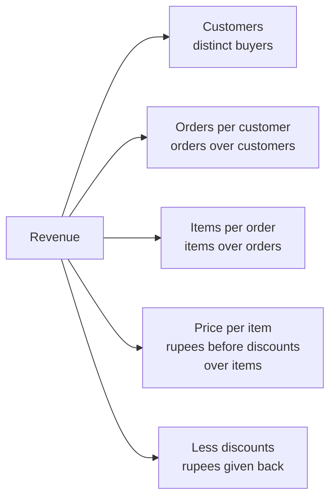
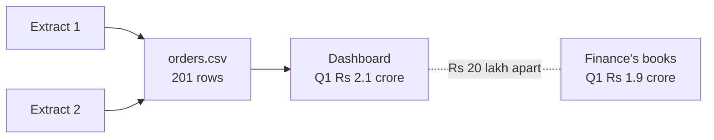
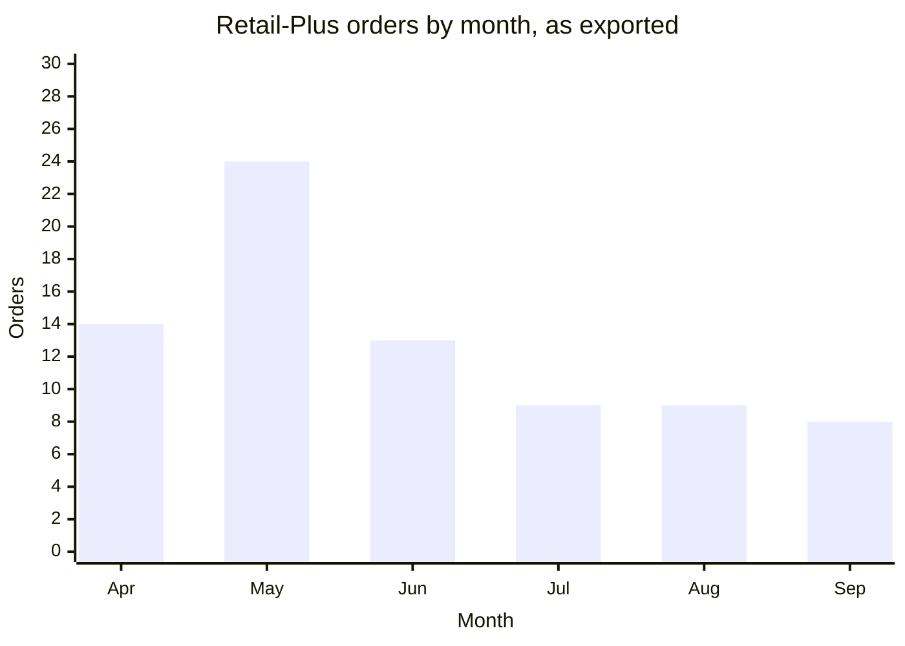
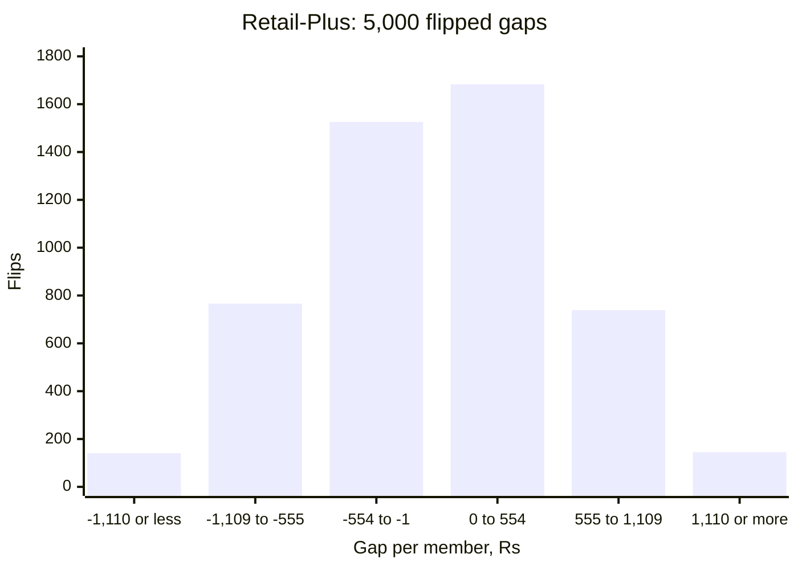
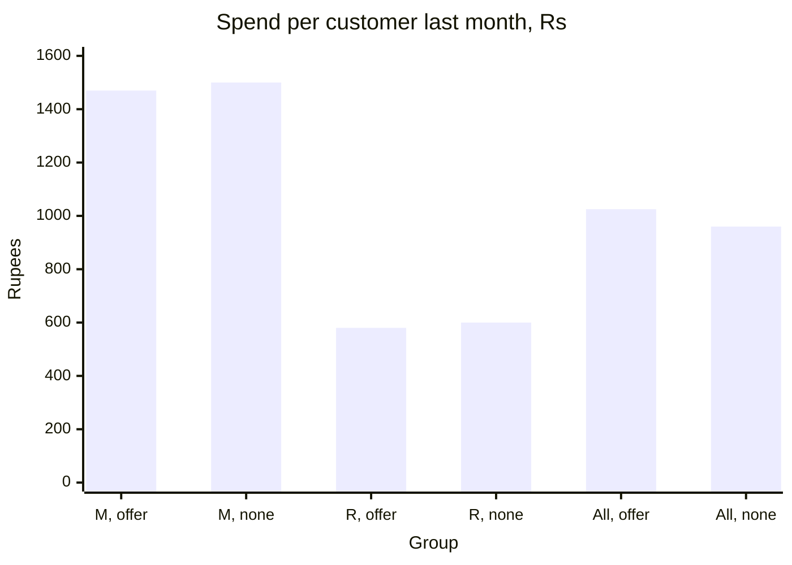
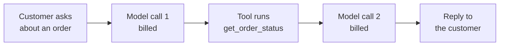

# Week 1 recap paper

Saturday 10 October 2026 · 120 minutes · 35 items in 5 parts · pen and paper, no assistant, no notes

Name: ____________________    Marked by: ____________________    Items right: ____ of 35

## What this paper is for

This week Meera Raghavan, Kalpa Retail's CEO, asked whether the Rs 12 crore Marketing wants for winning new customers goes to the part of revenue that fell; Anand Iyer, the finance controller, disputed the Q1 figure on the team's dashboard; and Meera now has to decide what Monday's growth review hears about Retail-Plus, Student and the monsoon sale. Parts 1 to 3 put those decisions to you again, with no notes, and Parts 4 and 5 set the same mistakes in public cases and at a food-delivery company, where interviewers test them. The room's score in each part, set beside the rating you give it in step one, decides where Monday's revision starts. A wrong answer tells Monday more than a blank does, so answer every item.

## How this paper works

- 120 minutes in one sitting. Each part gives its minutes as a guide, not a limit.
- Every item names its format beside its number, and a word bank or a match table names it once, above its items: circle one letter, circle every correct letter, write the matching letter, write the word or number, show the working and the answer, or write the letters in order.
- Every item also names its level, easy, medium or hard, so you can plan your time. A hard item is several steps on an exhibit, never an obscure fact.
- A wrong answer costs nothing, so answer every item on the line under it.
- Pen and this paper only: no laptop, no phone, no notes and no assistant.
- Afterwards the papers are swapped and marked against the key, and the discussion takes the items the room missed most. The paper is ungraded and ranks nobody; the room's rates by part and by tag set Monday's revision.
- Parts 1 to 3 are set inside Kalpa Retail, where you work as a trainee engineer in the data and AI team of its Global Capability Centre, the in-house centre that builds Kalpa's data and AI systems. Meera Raghavan is Kalpa Retail's CEO, Anand Iyer its finance controller and Kavya Nair the senior analyst on your team; Marketing and Finance appear as departments. Part 4 draws on public cases, each with its source named beside it, and Part 5 imagines a food-delivery company, its offer and its support agent, all illustrative. Every number an item needs is on the page.

## Step one, before Part 1

Before you read any item, rate yourself from 1 to 4 on each part in the table below, as you are today. The comparison between your rating and your score in each part is the most useful thing this paper produces for Monday.

- 1: I have not used this
- 2: I can follow it when someone shows me
- 3: I can do it alone on a small problem
- 4: I can find and fix mistakes in someone else's version

Your ratings: Part 1 ___ · Part 2 ___ · Part 3 ___ · Part 4 ___ · Part 5 ___

## The paper at a glance

| Part | What it shows | Items | Minutes | Easy | Medium | Hard |
|---|---|---|---|---|---|---|
| 1. Where did Kalpa's revenue go between the first quarter and the second? | whether you can read revenue from orders and say what would change a budget call | Q1 to Q7 (7) | 21 | 1 | 3 | 3 |
| 2. Did Kalpa book Rs 2.1 crore in the first quarter, or Rs 1.9 crore? | whether you can check an export the way an auditor would, row by row and rupee by rupee | Q8 to Q15 (8) | 29 | 0 | 2 | 6 |
| 3. Is the Retail-Plus fall more than chance, and what should Meera's note say? | whether you can say what a chance test, a count and a fair comparison let you tell Meera | Q16 to Q21 (6) | 22.5 | 0 | 1 | 5 |
| 4. Which check would have caught the misleading number in five public cases? | whether you can spot the week's mistakes in public cases and name the check for each | Q22 to Q26 (5) | 14 | 0 | 4 | 1 |
| 5. Did a delivery company's offer raise spending, and are its AI agent's numbers right? | whether you can judge an offer's lift and read an agent's code, log and bill | Q27 to Q35 (9) | 31.5 | 0 | 3 | 6 |
| Total | | 35 | 118 | 1 | 13 | 21 |

---

## Part 1. Where did Kalpa's revenue go between the first quarter and the second? (Q1 to Q7)

*What it shows: whether you can read revenue from orders and say what would change a budget call. 7 items, about 21 minutes.*

Kalpa Retail sells through its app, its website and its stores to four segments of customers: Retail-Core, Student, Business (its corporate buyers) and Retail-Plus, a membership tier whose members pay a fee to belong. Revenue here means booked value, which retail calls GMV (gross merchandise value): every order at the price charged, before cancellations and returns come out. Q1 is April to June and Q2 is July to September, and revenue fell from Q1 to Q2. Marketing wants Rs 12 crore to win new customers. Meera Raghavan, the CEO, needs to know which branch of the revenue tree below fell before she signs, since money spent on a branch that held is money lost: "Is acquisition even the branch that is short?" When a sales figure drops, the team works through the sales-drop investigation ladder, five checks called rungs that are always climbed in the same order.

**Exhibit 1A.** Kalpa's revenue tree, in which each branch is one of the numbers that make up revenue.



#### Q1 · Medium · show the working, then the answer · Size the revenue tree

A retailer has 50,000 customers, 2 orders per customer, 3 items per order, Rs 400 per item and Rs 1 crore of discounts. What is its revenue?

Working:

Answer: ____________________

**Exhibit 1B.** The 29 consumer orders in the team's first sample of 30 orders, every order outside the Business segment, by channel and status, and the analyst's cell. The int() is there because one amount arrived as the text "4500".

| Channel | Delivered | Returned | Cancelled |
|---|---|---|---|
| app | 10 orders, Rs 18,600 | none | none |
| web | 5 orders, Rs 12,320 | 5 orders, Rs 14,970 | none |
| store | 5 orders, Rs 9,870 | none | 4 orders, Rs 9,050 |

```python
sales = {"app": 0, "web": 0, "store": 0}
for o in CONSUMER_ORDERS:                 # the 29 orders in the table
    if o["status"] == "delivered" or "returned":
        sales[o["channel"]] += int(o["amount"])
print(sales)
```

#### Q2 · Hard · circle one letter · Predict the output and the call

Every Kalpa order carries a status: delivered (it reached the customer), returned (it came back for a refund) or cancelled (it never left the shelf). Meera will fund one of two asks next quarter, the app team's new checkout or the store team's refit. Her rule is to back the channel whose consumer orders in the sample brought in more, counting every order that was not cancelled. The analyst wrote this cell to settle it. What does it print, and which channel does her rule back?

a) {'app': 18600, 'web': 27290, 'store': 18920}; her rule backs the store.
b) {'app': 18600, 'web': 27290, 'store': 9870}; her rule backs the app.
c) {'app': 18600, 'web': 27290, 'store': 18920}; her rule backs the app.
d) {'app': 18600, 'web': 27290, 'store': 9870}; her rule backs the store.

**Exhibit 1C.** The first sample's 30 orders by status: 21 delivered, 5 returned and 4 cancelled, each status's amounts sorted from the smallest, in rupees.

| Status | Places | Amounts |
|---|---|---|
| delivered | 1 to 7 | 400, 860, 940, 1,120, 1,190, 1,440, 1,520 |
| delivered | 8 to 14 | 1,650, 1,890, 2,020, 2,060, 2,090, 2,110, 2,300 |
| delivered | 15 to 21 | 2,500, 2,520, 2,780, 2,800, 4,100, 4,500, 4,80,000 |
| returned | 1 to 5 | 1,240, 2,880, 2,930, 3,830, 4,090 |
| cancelled | 1 to 4 | 1,450, 2,430, 2,430, 2,740 |

#### Q3 · Hard · show the working, then the answer · Price the typical first order

Marketing's payback model asks how long a typical new customer takes to repay what it cost to win them. The model covers every new customer, business buyers included, and it takes cancellations and returns off at their own rates. For the value of a typical first order it uses Rs 18,160, the mean of the sample's 30 orders. What figure should it use? Give it in rupees.

Working:

Answer: ____________________

**Exhibit 1D.** Tuesday's export counted by segment and quarter, and the analyst's cell, in which ORDERS holds the export's 200 rows.

| Segment | Q1 rows | Q2 rows |
|---|---|---|
| Student | 5 | 7 |
| Retail-Plus | 51 | 26 |
| Business | 20 | 17 |
| Retail-Core | 38 | 36 |
| all | 114 | 86 |

```python
SEGMENTS = ["Student", "Retail-Plus", "Business", "Retail-Core"]
orders_in = {}
for q in ["Q1", "Q2"]:
    for seg in SEGMENTS:
        n = 0
        for o in ORDERS:
            if o["quarter"] == q and o["segment"] == seg:
                n += 1
    orders_in[q] = n
change = (orders_in["Q2"] / orders_in["Q1"] - 1) * 100
print(orders_in, f"{change:+.1f}%")
```

#### Q4 · Medium · circle one letter · Predict the headline

For Meera's first slide an analyst wants the orders in each quarter of Tuesday's export, and writes this cell. What does it print?

a) {'Q1': 114, 'Q2': 86} -24.6%
b) {'Q1': 5, 'Q2': 7} +40.0%
c) {'Q1': 114, 'Q2': 200} +75.4%
d) {'Q1': 38, 'Q2': 36} -5.3%

#### Q5 · Easy · circle one letter · Pick the first rung

What is the first rung of the sales-drop investigation ladder?

a) Confirm that the drop is real.
b) Decompose the change along the revenue tree.
c) State a hypothesis for the cause.
d) Isolate the segment that moved.

**Exhibit 1E.** Marketing's estimates for the next quarter, for each customer.

| Route | Cost for each customer | Revenue in the next quarter |
|---|---|---|
| A new customer won | Rs 1,200 | Rs 2,400 |
| A member brought back to Q1's buying | Rs 600 | Rs 1,500 |

#### Q6 · Hard · circle one letter · Find what flips the call

Tuesday's split of the fall along the revenue tree found the customer count flat at 69 in both quarters and orders per customer down from 1.65 to 1.25, so the team's note to Meera proposes bringing Retail-Plus members, who now buy less often, back to buying as often as they did in Q1 before any spend on acquisition, the winning of new customers. Marketing answers with its own estimates, in the table. Kavya compares the two routes on the revenue each brings in the next quarter for every rupee spent. Which one of these changes, on its own, would make acquisition the better use of the next rupee?

a) A new customer's spend in the next quarter rises to Rs 2,800.
b) Winning a new customer costs Rs 1,000 through a cheaper channel.
c) Bringing a member back costs Rs 800 once the easiest are won.
d) A member brought back spends only Rs 1,300 in the next quarter.

#### Q7 · Medium · write the letters in order · Order the ladder

Put the five rungs of the sales-drop investigation ladder in order.

a) Isolate the branch and the segment.
b) Check each quarter's figure on its own: no rows missing, doubled or malformed.
c) Hypothesise, and name the evidence that would settle it.
d) Set the two checked figures side by side on the same weeks and the same definitions.
e) Decompose along the revenue tree.

Order: ____________________

---

## Part 2. Did Kalpa book Rs 2.1 crore in the first quarter, or Rs 1.9 crore? (Q8 to Q15)

*What it shows: whether you can check an export the way an auditor would, row by row and rupee by rupee. 8 items, about 29 minutes.*

Kalpa's dashboard reads an ERP export: a copy of the orders taken out of the enterprise resource planning system that Finance books orders in. Anand Iyer, the finance controller, signs Finance's books, and both his figure and the dashboard's count booked value. Anand replied to all on Tuesday's finding: "Your dashboard says Q1 was Rs 2.1 crore. Our books say 1.9. Until your numbers match ours, Finance will not act on a drop measured from an ERP export." Meera needs the right Q1 as well, since the fall she asked about is measured from it. The ERP team adds that Wednesday's export, orders.csv, was stitched together from two extracts and holds 201 rows. Profiling a field means counting how many of its values are present, missing and malformed.

**Exhibit 2A.** Where the two Q1 figures come from.



**Exhibit 2B.** A new analyst's read of the export.

```python
import csv
with open("orders.csv") as f:
    reader = csv.DictReader(f)
    next(reader)                  # skip the header line
    rows = list(reader)
print(len(rows), rows[0]["order_id"])
```

#### Q8 · Hard · circle one letter · Predict the output and the check

orders.csv opens on a line that names its columns, and 201 order rows follow it, the first two KR-02001 and KR-02002. The analyst's cleaning pass, the step that sorts every row it is given into clean or rejected, then runs on rows and reports its input as clean rows plus rejected rows. What does the cell print, and which check tells Anand whether every order in the file reached the pass?

a) 201 KR-02001; a count of the file's own rows against the pass's input tells him, where the pass's report cannot.
b) 200 KR-02002; the pass's own report tells him, since its input must equal clean plus rejected.
c) 200 KR-02002; a count of the file's own rows against the pass's input tells him, where the pass's report cannot.
d) 201 KR-02001; the pass's own report tells him, since its input must equal clean plus rejected.

#### Q9 · Medium · circle one letter · Judge the comparison

Every amount csv.DictReader reads arrives as text, as the amount "4500" on order KR-01008 in the first sample did. Statement: in Python 3, the comparison '4500' < '30000' evaluates to True. True or false, and why?

a) True, because Python compares the numbers that the two strings of digits spell.
b) True, because a string with fewer characters sorts before a longer one.
c) False, because Python 3 refuses to order two strings made of digits.
d) False, because text compares character by character, and '4' follows '3'.

**Exhibit 2C.** Two rows of the export as the reader hands them over, and the analyst's cell.

```python
rows = [{"order_id": "KR-02063", "amount": "twelve"},
        {"order_id": "KR-02064", "amount": "3150"}]
as_arrived = rows.copy()        # the export as it came, for the auditor
for r in rows:
    r["amount"] = int(r["amount"]) if r["amount"].isdigit() else 0
rejects = [a["order_id"] for a in as_arrived if not str(a["amount"]).isdigit()]
print(len(rows), "+", len(rejects), "=", len(as_arrived), rejects)
```

#### Q10 · Hard · circle one letter · Predict the output and the check

Finance's auditor wants every amount the export sent that was not a number. So before the pass converts the amounts in place, the analyst keeps the export as it came, and afterwards lists the amounts in that copy that are not digits. Anand's books hold both orders at their true values. What does the cell print, and which check would show Anand that the value of order KR-02063 was lost?

a) 2 + 0 = 2 []; a rupee total against Anand's books shows it, where the printed line cannot.
b) 2 + 1 = 2 ['KR-02063']; the printed line shows it, since clean plus rejected must equal the input.
c) 2 + 0 = 2 []; the printed line shows it, since clean plus rejected must equal the input.
d) 2 + 1 = 2 ['KR-02063']; a rupee total against Anand's books shows it, where the printed line cannot.

**Exhibit 2D.** Five invented rows laid out as the export's are, and a pass meant to set aside every unreadable amount.

```python
rows = [("KR-09051", "2400"), ("KR-09052", "twelve"), ("KR-09053", "n/a"),
        ("KR-09054", "1850"), ("KR-09055", "3100")]
rejects = []
for row in rows:
    if not row[1].isdigit():
        rows.remove(row)
        rejects.append(row)
print(len(rows), "+", len(rejects), "=", len(rows) + len(rejects))
```

#### Q11 · Hard · circle every correct letter · Choose every fix

The pass prints 4 + 1 = 5, so its rows reconcile: every row it was given is counted once, as kept or as rejected. Which rewrites set aside every unreadable row and keep every readable one? Mark every correct option.

a) Loop over rows as now, but call rejects.append(row) before rows.remove(row).
b) Loop over a copy, for row in list(rows):, removing each bad row from rows and adding it to rejects.
c) Loop over rows as now, and add continue straight after the call to rows.remove(row).
d) Build two new lists: kept from the rows with digit amounts, rejects from the rest.
e) Loop over rows as now, and set a bad row's amount to "0" instead of removing it from rows.

**Exhibit 2E.** Seven rows of orders.csv, in the order the file holds them. The five columns not shown match within each order_id.

| Row | order_id | customer_id | order_date | amount | quarter |
|---|---|---|---|---|---|
| 1 | KR-02006 | C-2015 | 2026-06-17 | 2,890 | Q1 |
| 2 | KR-02063 | C-3003 | 2026-05-14 | twelve | Q1 |
| 3 | KR-02150 | C-3013 | 2026-08-01 | 3,700 | Q2 |
| 4 | KR-02151 | C-3014 | 2026-09-25 | 3,710 | Q2 |
| 5 | KR-02006 | C-2015 | 2026-06-17 | 2,890 | Q1 |
| 6 | KR-02063 | C-3003 | 2026-05-14 | 1,790 | Q1 |
| 7 | KR-02151 | C-3014 | 2026-08-02 | 3,710 | Q2 |

#### Q12 · Hard · show the working, then the answer · Apply the duplicate rules

Kalpa's order system gives each order one order_id, and Anand's books hold each order once, at the amount it was booked for. How much revenue do these seven rows hold for each quarter once each order is counted once? Give Q1 and Q2 in rupees.

Working:

Answer: ____________________

#### Q13 · Medium · write the letters in order · Order the cleaning pass

Put the cleaning pass in order.

a) Reconcile counts and revenue.
b) Profile each field.
c) Recompute the revenue tree on the clean data, and send it to Anand.
d) Decide drop, default or flag for each defect, with a written reason.

Order: ____________________

### Set 1

**Situation.** Meera's inbox holds three messages about the change in revenue from Q1 to Q2. Wednesday's, from Kavya: the reconciliation found Tuesday's Q2 clean at Rs 1,87,00,000, and found that 14 of Q1's rows in Tuesday's file were copies of other Q1 orders, worth Rs 20,00,000 together. Tuesday's note: the two closed quarters in Tuesday's file, each complete at 13 weeks, Rs 2,10,00,000 and Rs 1,87,00,000, down 11.0 percent. Tuesday's first dashboard tile, built from an extract taken on 15 September, when Q2 had run 11 of its 13 weeks: that part of Q2, Rs 1,55,59,950, against all of Q1, Rs 2,10,00,000, down 25.9 percent.

**Exhibit 2F.** Retail-Plus orders by month, as Tuesday's export held them.



| Month | Apr | May | Jun | Jul | Aug | Sep |
|---|---|---|---|---|---|---|
| Orders | 14 | 24 | 13 | 9 | 9 | 8 |

#### Q14 · Hard · write the word or number · Give the note's number

Give the change in revenue from Q1 to Q2 that belongs in Meera's note on Monday, as a percentage to one decimal place.

Answer: ____________________

#### Q15 · Hard · circle one letter · Recompute the finding

The chart and its table are Tuesday's count of Retail-Plus orders by month, as exported; Q1 is April to June and Q2 is July to September. Tuesday's file held 114 order rows in Q1 and 86 in Q2, and Retail-Plus had the same 22 members in both quarters. Of the 14 copied Q1 rows, 11 were Retail-Plus orders placed in May. On the reconciled file, which keeps one row per order, what happened to Retail-Plus orders per member, and how much of the company's fall in orders does Retail-Plus carry?

a) Orders per member fall 35.0 percent, and Retail-Plus carries all 14 of the company's 14 lost orders.
b) Orders per member fall 49.0 percent, and Retail-Plus carries all 14 of the company's 14 lost orders.
c) Orders per member fall 35.0 percent, and Retail-Plus carries 25 of the company's 28 lost orders.
d) Orders per member fall 49.0 percent, and Retail-Plus carries 25 of the company's 28 lost orders.

---

## Part 3. Is the Retail-Plus fall more than chance, and what should Meera's note say? (Q16 to Q21)

*What it shows: whether you can say what a chance test, a count and a fair comparison let you tell Meera. 6 items, about 22.5 minutes.*

Meera has set the growth review for Monday and sent three questions. "One: Retail-Plus is down. Real, or the wobble we see every quarter? Two: Student is up 40 percent; should I move budget there? Three: Marketing says the monsoon sale lifted revenue 6 percent and wants to repeat it at Diwali." Her constraint: "One page, two minutes." The page decides three spends at the review: a retention offer for Retail-Plus, budget for Student and a second run of the sale.

**Exhibit 3A.** Kavya's test of the Retail-Plus fall, on each member's delivered spend: the rupees of the member's delivered orders in the quarter. If the quarter made no difference to what a member spent, each member's two figures could have come in either order, so each of 5,000 flips tosses a coin for each of the 22 members, and heads swaps that member's Q1 and Q2 spend. The gap is the members' average Q1 spend less their average Q2 spend, rounded to the rupee, so a fall is a positive gap; the real gap is Rs 1,110. The share of flips whose gap is at least as large as the real one is the test's p-value.



| Gap per member, Rs | Flips |
|---|---|
| -1,110 or less | 141 |
| -1,109 to -555 | 766 |
| -554 to -1 | 1,526 |
| 0 to 554 | 1,683 |
| 555 to 1,109 | 739 |
| 1,110 or more | 145 |

#### Q16 · Hard · circle one letter · Answer the first question

Meera sent her question about Retail-Plus after Q2's figures had shown the fall. The team reads a fall as more than chance when fewer than 5 in 100 flips reach it. Which line answers her?

a) Real: 145 of 5,000 flips reach a fall that large, a share of 0.029, under the line of 5 in 100; Rs 24,420 a quarter across the tier.
b) Borderline: 145 of 5,000 flips reach the fall, and 286 a move that large either way; Rs 1,110 a quarter across the tier.
c) Borderline: 145 of 5,000 flips reach the fall, and 286 a move that large either way; Rs 24,420 a quarter across the tier.
d) Real: 145 of 5,000 flips reach a fall that large, a share of 0.029, under the line of 5 in 100; Rs 1,110 a quarter across the tier.

#### Q17 · Hard · circle one letter · Judge the fairer figure

Kavya lays two versions of Retail-Plus delivered spend side by side. Per member, over all 22 members: Rs 3,279 in Q1 and Rs 2,169 in Q2. Per buyer, over the 20 members with a delivered order in Q1 and the 16 in Q2: Rs 3,607 and Rs 2,982. Statement: the per-buyer figure is the fairer read, since a member who bought nothing has no spend to average. True or false, and why?

a) False: per buyer it falls a sixth and per member a third; 6 members had nothing delivered in Q2, against 2 in Q1, and leave the base.
b) True: per buyer it falls a third, the same share as per member, so the choice of base changes nothing Meera hears.
c) True: per buyer it falls a sixth, which is the fall among the members who still buy, the ones Meera can reach.
d) False: per buyer it falls a third and per member a sixth; 6 members had nothing delivered in Q2, against 2 in Q1, and leave the base.

#### Q18 · Medium · circle every correct letter · Check four p-value statements

Which statements about the p-value are correct? Mark every correct option.

a) It is computed on the assumption that chance alone is at work.
b) It is the probability that the hypothesis is true.
c) A small value means the observed gap would be rare under chance alone.
d) It says nothing about whether the gap is large enough to matter.

**Exhibit 3B.** Ten invented cards, the label shuffle, and the analyst's rerun.

```python
import random
from statistics import mean

def shuffle_gaps(q1, q2, times, seed):       # the label shuffle
    random.seed(seed)
    pool = q1 + q2
    gaps = []
    for _ in range(times):
        random.shuffle(pool)
        gaps.append(mean(pool[:len(q1)]) - mean(pool[len(q1):]))
    return gaps

q1 = [3600, 4100, 3200, 4300, 3000]          # five customers, Q1
q2 = [3300, 2000, 2900, 2600, 2500]          # five other customers, Q2
real_gap = mean(q2) - mean(q1)               # the fall, Q2 against Q1
gaps = shuffle_gaps(q1, q2, 1000, seed=2026)
p = sum(1 for g in gaps if g >= real_gap) / len(gaps)
print(round(real_gap), p)
```

#### Q19 · Hard · circle one letter · Predict the output and the call

The web team asks whether buyers spent less after the website changed at the start of Q2. Ten invented cards hold the spend of five customers who bought in Q1 and five different customers who bought in Q2, so the test shuffles the quarter labels: shuffle_gaps pools the ten figures, deals five to each quarter at random and records the gap. The first run wrote the gap as Q1 less Q2, Rs 980, and 13 of 1,000 shuffles reached it, so the note called the fall real. An analyst reruns the cell with the gap written as Q2 less Q1, the way a fall is usually shown. What does the cell print, and what should the note say about the fall now?

a) -980 0.013; the note still calls the fall real.
b) -980 0.992; the note should now call the fall chance.
c) -980 0.013; the note should now call the fall chance.
d) -980 0.992; the note still calls the fall real.

**Exhibit 3C.** 5,000 worlds in which a coin toss sends each of Student's 12 orders to Q1 or to Q2, as if the quarter made no difference, counted by how many of the 12 landed in Q2.

| Q2 orders out of 12 | Worlds |
|---|---|
| 4 or fewer | 918 |
| 5 | 964 |
| 6 | 1,133 |
| 7 | 1,034 |
| 8 | 595 |
| 9 or more | 356 |

#### Q20 · Hard · circle one letter · Write the Student line

Student went from 5 orders in Q1 to 7 in Q2, the 40 percent rise Meera asked about, and all 12 orders came from 2 customers. Which line goes into the one-page note?

a) Up 40 percent on 12 orders from 2 customers, a rise chance makes in 951 of 5,000 worlds: noise, so Student comes out of the budget talk altogether.
b) Up 40 percent on 12 orders from 2 customers, a rise chance makes in 1,985 of 5,000 worlds: a lead, so no budget moves until more customers buy.
c) Up 40 percent on 12 orders from 2 customers, a rise chance makes in 1,985 of 5,000 worlds: noise, so Student comes out of the budget talk altogether.
d) Up 40 percent on 12 orders from 2 customers, a rise chance makes in 951 of 5,000 worlds: a lead, so no budget moves until more customers buy.

#### Q21 · Hard · circle one letter · Design the Diwali test

Meera agrees to run the Diwali offer as a test: Marketing will hold back about one customer in five from whichever group it picks, keeping them out of the offer so that they can be compared with the rest. Which plan lets the next note say whether the discount itself changed what customers spent?

a) Hold back a random fifth of each segment, and compare the two groups' total revenue over the Diwali weeks.
b) Offer it to all of Retail-Plus, hold back a random fifth of Retail-Core, and compare spend per customer over the Diwali weeks.
c) Hold back a random fifth of each segment, and compare spend per customer in the two groups over the Diwali weeks.
d) Offer it to all of Retail-Plus, hold back a random fifth of Retail-Core, and compare total revenue over the Diwali weeks.

---

## Part 4. Which check would have caught the misleading number in five public cases? (Q22 to Q26)

*What it shows: whether you can spot the week's mistakes in public cases and name the check for each. 5 items, about 14 minutes.*

Kavya runs a reading group for the team's trainees on Friday afternoons: each week one public case in which a number misled capable people, or nearly did, with its source on the table. In each case the people about to act on the number needed a check first, and each item asks for that check or for the first move. Every case is on the public record, and its source is named beside it.

### Set 2

**Situation.** In 2010 the economists Carmen Reinhart and Kenneth Rogoff published the average growth of advanced economies in the years their public debt stood above 90 percent of GDP (gross domestic product, the value of everything an economy produces in a year). They sorted each country's years into four bands by how high its debt stood, the top band above 90 percent, and averaged growth within each band. In 2013 Thomas Herndon, Michael Ash and Robert Pollin rebuilt the figure from the authors' working spreadsheet. The table gives the seven countries in that average as the spreadsheet carried them. It counted one year for New Zealand, 1951, and carried its growth at -7.9 percent where the country's own sheet said -7.6; it left out New Zealand's four earlier years above 90 percent, 1946 to 1949.

**Exhibit 4A.** The seven countries in the above-90 average, as the working spreadsheet carried them. Source: Herndon, Ash and Pollin, PERI Working Paper 322, April 2013, Table 2.

| Country | Years counted above 90 percent | Average growth in those years, percent |
|---|---|---|
| Greece | 19 | 2.9 |
| Ireland | 7 | 2.4 |
| Italy | 10 | 1.0 |
| Japan | 11 | 0.7 |
| New Zealand | 1 | -7.9 |
| United Kingdom | 19 | 2.4 |
| United States | 4 | -2.0 |

**Exhibit 4B.** The two averages, computed on the seven countries as the table gives them.

```python
above_90 = {"Greece": (19, 2.9), "Ireland": (7, 2.4), "Italy": (10, 1.0),
            "Japan": (11, 0.7), "New Zealand": (1, -7.9),
            "United Kingdom": (19, 2.4), "United States": (4, -2.0)}
years = sum(n for n, g in above_90.values())
by_country = sum(g for n, g in above_90.values()) / len(above_90)
by_year = sum(n * g for n, g in above_90.values()) / years
print(years, f"{by_country:.2f}", f"{by_year:.2f}")
```

#### Q22 · Hard · circle one letter · Predict the output and the weight

What does the cell print, and how much of the first printed average's weight rests on New Zealand's single year?

a) 71 -0.07 1.68; New Zealand's single year carries a seventy-first of that weight.
b) 71 1.68 -0.07; New Zealand's single year carries a seventh of that weight.
c) 71 1.68 -0.07; New Zealand's single year carries a seventy-first of that weight.
d) 71 -0.07 1.68; New Zealand's single year carries a seventh of that weight.

#### Q23 · Medium · circle one letter · Choose the check

The working spreadsheet held its 20 countries in rows 30 to 49, but the formula for each average covered rows 30 to 44, which left out Australia, Austria, Belgium, Canada and Denmark; the authors accepted the error when it was found. Which check, run before publication, would have caught it?

a) Count the countries inside each band's average, and check that every band holds all 20.
b) Plot growth against debt for every country, and look for a point that breaks the pattern.
c) Recompute each band's average with the same formula on a fresh copy of the sheet.
d) Check the rows each average's formula spans against the 20 country rows in the sheet.

#### Q24 · Medium · circle one letter · Choose the first move

NASA's Mars Climate Orbiter was lost on 23 September 1999 as it reached Mars. One team's ground software wrote the thrusters' impulse in pound-force seconds, while the interface specification, and the navigation software that read the file, used newton-seconds, so every firing's effect was understated by a factor of 4.45. Through the spring and summer of 1999, engineers raised concerns about differences between navigation solutions, the team's estimates of the spacecraft's path, but only informally. As the spacecraft approached Mars, solutions from Doppler data alone consistently placed it closer to the planet than the other solutions did, and the differences were not resolved (NASA Mishap Investigation Board, 1999). What should the team have done when the solutions disagreed?

a) Adopt the solution built on the most tracking data, since more data averages out the noise.
b) Treat the disagreement as the finding, and trace its cause before the next manoeuvre.
c) Average the solutions, and carry their spread forward as the uncertainty of the approach.
d) Plan the approach on the solution farthest from the planet, since it leaves the widest margin.

#### Q25 · Medium · circle every correct letter · Choose both reasons

Google Flu Trends estimated flu activity in the United States from how often people searched for certain terms. Its builders tested 50 million search terms for those whose weekly volume best fit 1,152 data points of the CDC's figures (the Centers for Disease Control and Prevention, which counts doctor visits for flu-like illness), and weeded out terms such as high school basketball that fit well and had nothing to do with flu (Lazer and colleagues, Science, 2014). The paper gives two reasons such a term can fit. Which two does it give? Mark every correct option.

a) Basketball games spread flu, since crowds gather indoors through the winter.
b) Winter drives both basketball searches and flu visits, so each rises with the season.
c) The CDC's figures carried errors that the basketball searches happened to match.
d) Search volume measures illness directly, so any term searched in winter measures flu.
e) Among 50 million candidate terms, some will fit 1,152 points by chance alone.

#### Q26 · Medium · circle one letter · Answer the alert

In 2012 an idea for changing how Bing displayed the headlines of its search ads had waited more than six months for a slot, until an engineer ran it as an A/B test, a controlled experiment that shows a change to a random share of users and compares them with the rest. Within hours the new version was producing abnormally high revenue, and a "too good to be true" alert fired (Kohavi and Thomke, Harvard Business Review, 2017). You are the analyst on call. What do you do first?

a) Ship the change to every user now, since each hour of delay costs revenue.
b) Treat the alert as a likely bug, and check the logging and the group split.
c) Stop the test and discard it, since a lift that large is almost always a bug.
d) Leave the test running for a quarter, until the lift settles near normal results.

---

## Part 5. Did a delivery company's offer raise spending, and are its AI agent's numbers right? (Q27 to Q35)

*What it shows: whether you can judge an offer's lift and read an agent's code, log and bill. 9 items, about 31.5 minutes.*

Suppose you join the data and AI team of a food-delivery company. The company, its customers, its agent, its logs and every number in this part are illustrative. Members pay a monthly fee for the company's membership, and everyone else is a regular customer. The support team runs an AI agent: for each customer conversation a large language model reads the message, may ask for a tool (an order's status, a refund within a limit, a hand-off to a person) and writes the reply. Every model call is billed and writes one row to a log table. The head of customer support owns two numbers, the cost per conversation and the share of conversations the agent resolves without a person, and sets the agent's budget and limits by them. The marketing lead needs to know what an offer did before sending it again.

### Set 3

**Situation.** Last month the company's marketing team sent a 20 percent weekend offer to 500 customers, 250 members and 250 regular customers, and not to the other 1,000, of whom 400 were members and 600 regular. That month the 500 spent Rs 1,025 each and the 1,000 spent Rs 960 each, a lift of 6.8 percent, which is the marketing lead's case for sending the offer again at the festival. The chart and its table split the same customers by tier.

**Exhibit 5A.** Spend per customer last month, by tier and offer; on the chart M is members and R regular customers. Illustrative.



| Group | Customers | Spend per customer, Rs |
|---|---|---|
| Members with the offer | 250 | 1,470 |
| Members without it | 400 | 1,500 |
| Regular with the offer | 250 | 580 |
| Regular without it | 600 | 600 |
| All with the offer | 500 | 1,025 |
| All without it | 1,000 | 960 |

#### Q27 · Hard · write the word or number · Size the offer's effect

On these figures, how much more or less did the 500 customers who got the offer spend last month than the same customers would have spent without it? Give it in rupees.

Answer: ____________________

#### Q28 · Hard · circle one letter · Advise on the festival

The marketing lead wants to send the offer again at the festival, at 25 percent off, to the same kind of list. What do you advise?

a) Send it again at 25 percent off; orders need to rise by a quarter to hold revenue.
b) Do not send it as it ran; orders need to rise by a third to hold revenue at 25 percent off.
c) Send it again at 25 percent off; orders need to rise by a third to hold revenue.
d) Do not send it as it ran; orders need to rise by a quarter to hold revenue at 25 percent off.

**Exhibit 5B.** One conversation, and the agent's order-status tool as first written. Illustrative.



```python
ORDER_STATUS = {"1041": "delivered", "1042": "out for delivery"}

def get_order_status(order_id):
    if order_id in ORDER_STATUS:
        return ORDER_STATUS[order_id]
    print(f"order {order_id}: not found")

results = [str(get_order_status(o)) for o in ["1042", "1099", "1041"]]
found = sum(1 for r in results if r)         # the dashboard's lookups found
```

#### Q29 · Hard · circle one letter · Predict what the model and the dashboard read

The agent sends the model whatever the tool returns, as text, and the support head's dashboard counts a lookup as found when that text is not empty. Three customers ask about orders 1042, 1099, a mistyped number, and 1041. What does the model read as the tool's result for 1099, and what does found hold?

a) 'None', and found holds 2 of the 3 lookups.
b) 'order 1099: not found', and found holds 2 of the 3 lookups.
c) 'None', and found holds 3 of the 3 lookups.
d) 'order 1099: not found', and found holds 3 of the 3 lookups.

**Exhibit 5C.** The agent's loop as first written, and three customers on one server. Illustrative.

```python
def run_agent(message, history=[]):
    history.append({"role": "user", "content": message})
    reply = call_model(history)            # sends every message in history
    history.append({"role": "assistant", "content": reply})
    return reply

run_agent("Where is order 1042?")          # customer A
run_agent("Please cancel order 2210")      # customer B
run_agent("Is my refund done?")            # customer C
```

#### Q30 · Hard · circle one letter · Count the messages and choose the fix

Customers often write more than once, and the server answers several conversations at the same time. Here customers A, B and C have each sent a first message, in that order. How many messages does C's model call send, and which change gives every conversation its own messages across all its turns?

a) 5; keep each conversation's messages under its conversation id, and pass that list in.
b) 3; keep the default list, and clear it at the end of every call so the next customer starts empty.
c) 5; keep the default list, and clear it at the end of every call so the next customer starts empty.
d) 3; keep each conversation's messages under its conversation id, and pass that list in.

**Exhibit 5D.** Cost per conversation in one shift. Every model call costs Rs 0.40. Illustrative.

| Conversation | Model calls | Cost, Rs |
|---|---|---|
| C-01 | 4 | 1.60 |
| C-02 | 3 | 1.20 |
| C-03 | 5 | 2.00 |
| C-04 | 4 | 1.60 |
| C-05 | 3 | 1.20 |
| C-06 | 3 | 1.20 |
| C-07 | 105 | 42.00 |

#### Q31 · Hard · circle one letter · Size the cap

In C-07 the model kept calling the same tool until a timeout stopped it. The head of support wants the typical conversation's cost on the dashboard, and a cap on model calls set at twice the calls of a typical conversation. Which pair is right: the typical cost, and what that cap would have saved this shift?

a) Rs 7.26 is the typical cost, and the cap would have saved Rs 38.80.
b) Rs 1.60 is the typical cost, and the cap would have saved Rs 38.80.
c) Rs 1.60 is the typical cost, and the cap would have saved Rs 27.60.
d) Rs 7.26 is the typical cost, and the cap would have saved Rs 27.60.

**Exhibit 5E.** The support head asks which tools failed at least 30 times in the week of 21 to 27 September; a call failed when its status is anything but ok, and called_on is a date, with no time of day. The log's calls by tool, status and week, and the analyst's query. Illustrative.

| tool | status | 21 to 27 Sep | 14 to 20 Sep |
|---|---|---|---|
| order_status | ok | 410 | 388 |
| order_status | error | 12 | 9 |
| order_status | timeout | 22 | 6 |
| refund | ok | 96 | 90 |
| refund | error | 35 | 40 |
| refund | timeout | 3 | 2 |
| handover | ok | 48 | 51 |
| handover | error | 9 | 11 |
| handover | timeout | 18 | 25 |

```sql
SELECT tool, COUNT(*) AS failed_calls
FROM calls
WHERE status <> 'ok'
  AND called_on BETWEEN '2026-09-21' AND '2026-09-27'
GROUP BY tool
HAVING COUNT(*) >= 30;
```

#### Q32 · Hard · circle one letter · Predict the query's rows

What does the query return?

a) Two rows, order_status 34 and refund 38.
b) One row, refund 35, and nothing for order_status.
c) Three rows, order_status 49, refund 80 and handover 63.
d) Three rows, order_status 34, refund 38 and handover 27.

**Exhibit 5F.** Eight calls from the same log, illustrative. latency_ms is empty, NULL, when a call timed out; tool is NULL when the model replied without calling one.

| call_id | conversation_id | tool | status | latency_ms |
|---|---|---|---|---|
| 1 | CV-1 | order_status | ok | 800 |
| 2 | CV-1 | order_status | ok | 1200 |
| 3 | CV-2 | refund | error | 600 |
| 4 | CV-3 | order_status | timeout | NULL |
| 5 | CV-3 | refund | ok | 1000 |
| 6 | CV-4 | NULL | ok | 400 |
| 7 | CV-5 | handover | timeout | NULL |
| 8 | CV-6 | order_status | ok | 800 |

**Match table 1.** Write the letter of the value each query returns in PostgreSQL on the eight calls in the exhibit above. Each value is used once at most, and some are not used.

| Item | To match | Letter | Match |
|---|---|---|---|
| Q33 (Medium) | SELECT COUNT(latency_ms) FROM calls; | a | 0 |
| Q34 (Medium) | SELECT AVG(latency_ms) FROM calls; | b | 0.375 |
| Q35 (Medium) | SELECT COUNT(*) FILTER (WHERE status <> 'ok') / COUNT(*) FROM calls; | c | 6 |
|  |  | d | 8 |
|  |  | e | 600 |
|  |  | f | 800 |

Answers: Q33 ____    Q34 ____    Q35 ____

---

## Stretch: untimed, and not marked

For anyone who finishes early. Nothing here is counted; each item is the kind an interviewer asks after your first answer, so write the answer you would say.

### Stretch 1

On Tuesday's export, revenue per order rose 18 percent from Q1 to Q2 while orders per customer fell. Meera asks whether the rise is good news. Answer in three sentences she could repeat.

### Stretch 2

Kavya's test of the Retail-Plus fall flips each member's own two quarters. A label shuffle would pool all 44 figures and deal them out to the two quarters at random. Why is the flip the fairer test for these 22 members? Answer in two sentences.

### Stretch 3

You have two hours and a raw export, and Meera wants the Q1 figure at the end of them. What do you do first, what do you skip, and what do you refuse to skip?

### Stretch 4

The head of customer support asks for one number for the support agent's weekly review. Which number do you give, and what goes beside it so that it cannot mislead?
