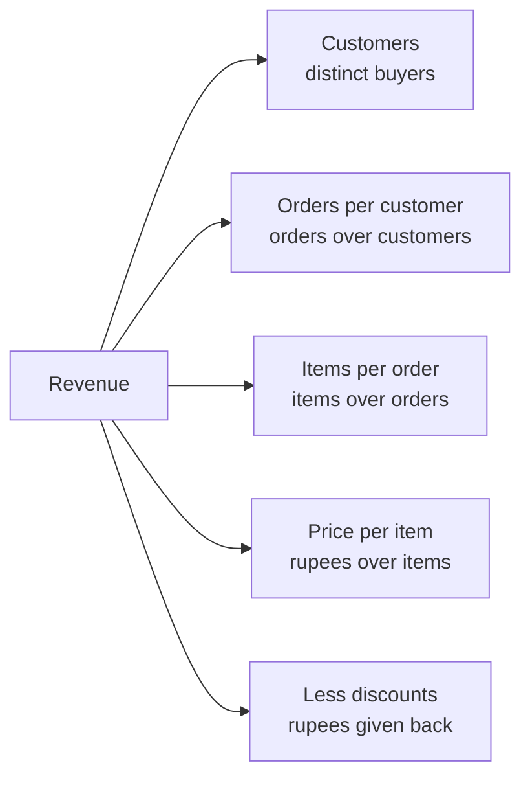
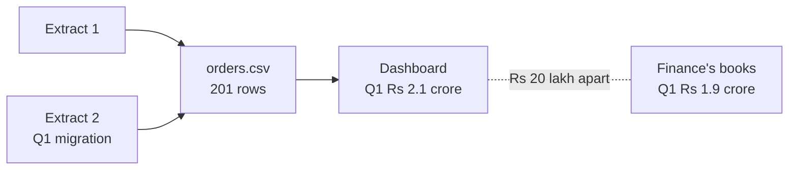
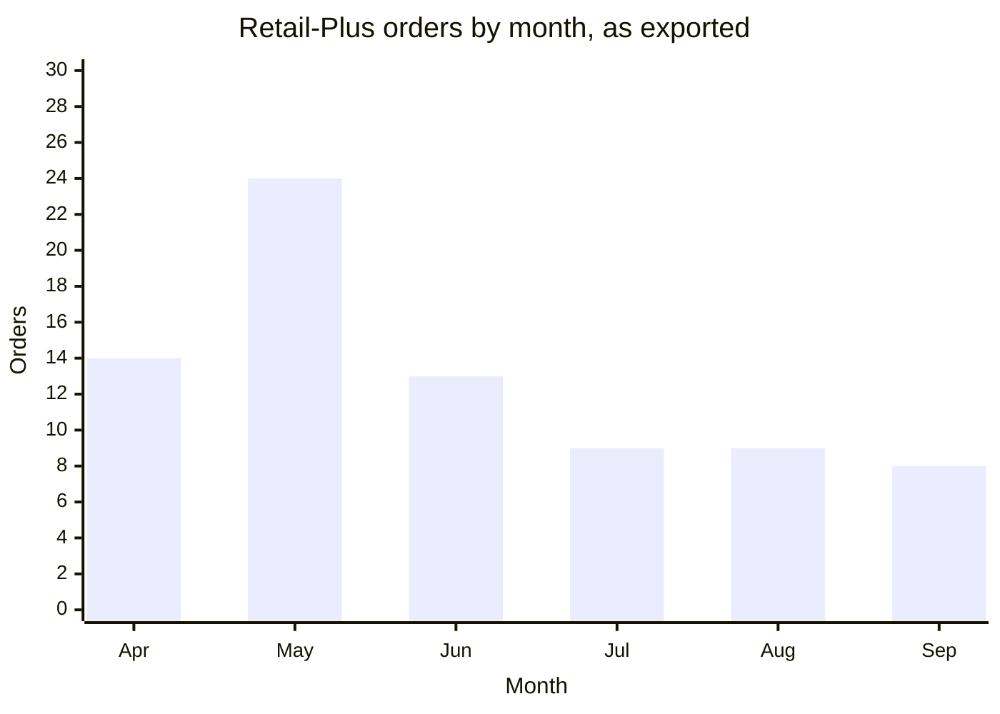
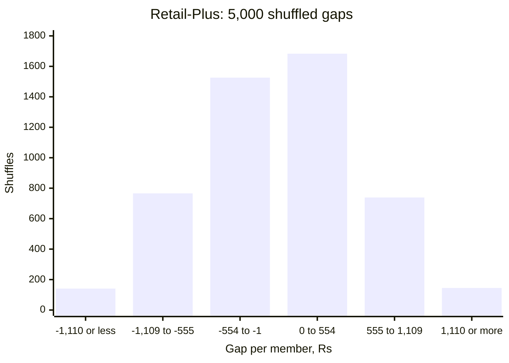
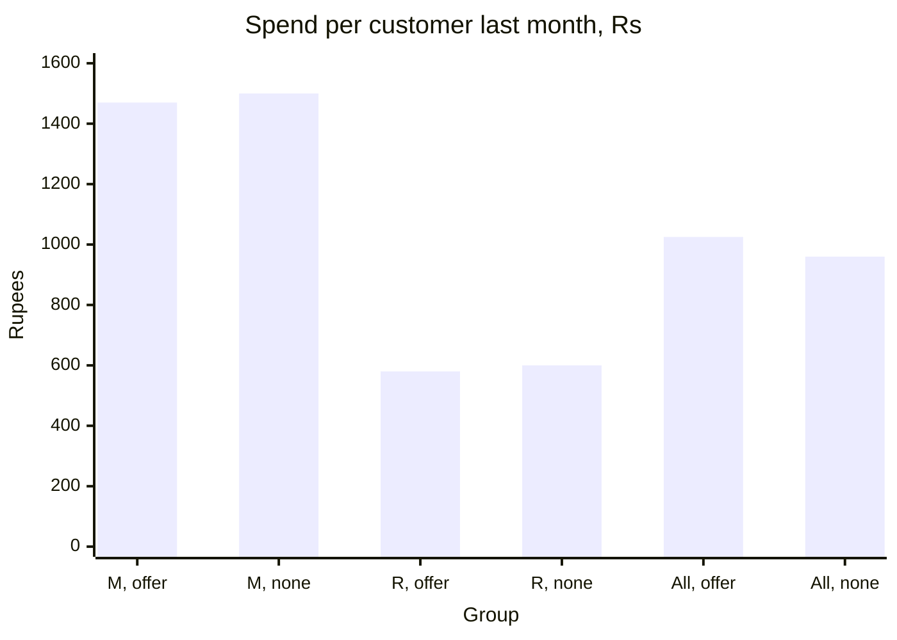
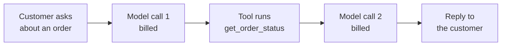

# Week 1 recap paper

Saturday 10 October 2026 · 120 minutes · 35 items in 5 parts · pen and paper, no assistant, no notes

Name: ____________________    Marked by: ____________________    Items right: ____ of 35

## What this paper is for

This week Meera Raghavan asked whether the Rs 12 crore Marketing wants for acquisition goes to the branch of revenue that is actually short, Anand Iyer disputed the Q1 figure the ERP export put on the dashboard, and Meera now has to decide what the growth review hears about Retail-Plus, Student and the monsoon sale. This paper puts those decisions in front of you again, cold, and then the same traps in public cases and in a delivery company's offer and AI agent, where interviewers will test them. The room's scores in each part, set beside the ratings you give in step one, decide where Monday's revision starts. A wrong answer tells Monday more than a blank one, so answer every item.

## How this paper works

- 120 minutes in one sitting. Each part gives its minutes as a guide, not a limit.
- Every item names its format beside its number: circle one letter, circle every correct letter, write T or F, write a letter from a word bank or a match table, write the word or number, show the working, or write the letters in order.
- Every item also names its level, easy, medium or hard, so you can plan your time. A hard item is several steps on an exhibit, never an obscure fact.
- A wrong answer costs nothing, so answer every item on the line under it.
- Pen and this paper only: no laptop, no phone, no notes and no assistant.
- Afterwards the papers are swapped and marked against the key, and the discussion takes the items the room missed most. The paper is ungraded and ranks nobody; the room's rates by part and by tag set Monday's revision.
- Parts 1 to 3 are set inside Kalpa Retail, where you work as a trainee engineer in the data and AI team of its Global Capability Centre: Meera Raghavan is its CEO, Anand Iyer its finance controller and Kavya Nair a senior analyst in its data team, and Marketing and Finance appear by function. Part 4 draws on public cases, each with its source named beside it, and Part 5 imagines a food-delivery company, its offer and its support agent, all illustrative. Every number an item needs is on the page.

## Step one, before Part 1

Before you read any item, rate yourself from 1 to 4 on each part in the table below, as you are today. The comparison between your rating and your score in each part is the most useful thing this paper produces for Monday.

- 1: I have not used this
- 2: I can follow it when someone shows me
- 3: I can do it alone on a small problem
- 4: I can find and fix mistakes in someone else's version

Your ratings: Part 1 ___ · Part 2 ___ · Part 3 ___ · Part 4 ___ · Part 5 ___

## The paper at a glance

| Part | What it shows | Items | Minutes | Easy | Medium | Hard |
|---|---|---|---|---|---|---|
| 1. Where the revenue went | whether you can read revenue from orders and say what would change a budget call | Q1 to Q7 (7) | 21.5 | 2 | 1 | 4 |
| 2. Which Q1 figure is right | whether you read an export as an auditor will and close its rows and its rupees | Q8 to Q15 (8) | 29 | 0 | 2 | 6 |
| 3. Real, or the wobble | whether you can say what a shuffle, a count and a fair test let you tell Meera | Q16 to Q20 (5) | 17 | 0 | 2 | 3 |
| 4. The same traps, in public | whether you spot the week's traps in public cases and name the check for each | Q21 to Q26 (6) | 18 | 0 | 4 | 2 |
| 5. An offer, an agent and its logs | whether you can judge an offer's lift and read an agent's code, log and bill | Q27 to Q35 (9) | 31.5 | 0 | 3 | 6 |
| Total | | 35 | 117 | 2 | 12 | 21 |

---

## Part 1. Where the revenue went (Q1 to Q7)

*What it shows: whether you can read revenue from orders and say what would change a budget call. 7 items, about 21.5 minutes.*

Kalpa Retail sells through its app, its website and its stores. Its revenue is a tree of branches multiplied together: customers, orders per customer (how often each customer buys), items per order and price per item, less the discounts given; revenue per order, the average order value, is items per order times price per item, before discounts. Most orders run between Rs 800 and Rs 3,000, while Business orders, from corporate buyers, are few and large: in Tuesday's Q1 export, 20 Business rows carried Rs 2.08 crore of the Rs 2.10 crore booked. Retail-Plus is Kalpa's paid-membership tier, customers who pay to be members. Marketing wants Rs 12 crore to acquire new customers, and Meera Raghavan, the CEO, will not sign until the data answers her: "Is acquisition even the branch that is short?"

**Exhibit 1A.** Kalpa's revenue tree. The branches multiply, and the discounts come off the product.



#### Q1 · Easy · show the working, then the answer · Compute median and mean

Five order values in rupees: 800, 1,200, 1,400, 2,000 and 4,80,000. Give the median and the mean.

Working:

Answer: ____________________

**Exhibit 1B.** Monday's 30 orders by status, and the analyst's cell. The int() is there because one amount arrived as the text "4500".

| Status | Orders | Rupees |
|---|---|---|
| delivered | 21 | 5,20,790 |
| returned | 5 | 14,970 |
| cancelled | 4 | 9,050 |

```python
sales, n = 0, 0
for o in ORDERS:
    if o["status"] == "delivered" or "returned":
        sales += int(o["amount"])
        n += 1
print(n, "orders, Rs", sales)
```

#### Q2 · Hard · circle one letter · Predict the output

Every Kalpa order carries a status: delivered (it reached the customer), returned (it came back for a refund) or cancelled (it never left the shelf). Meera's first reading of sales counts every order that left the shelf, delivered or returned, and leaves out the cancelled ones; refunds get a line of their own in her note. The analyst ran this cell on Monday's 30 orders to give her that figure. What does it print, and how does it compare with the figure Meera asked for?

a) 26 orders, Rs 535760, which is Meera's figure exactly.
b) 30 orders, Rs 544810, which is Rs 9,050 above Meera's figure.
c) 21 orders, Rs 520790, which is Rs 14,970 below Meera's figure.
d) 30 orders, Rs 544810, which is Rs 14,970 above Meera's figure.

**Exhibit 1C.** Monday's 30 orders by status: 21 delivered, 5 returned and 4 cancelled, each status's amounts sorted from the smallest, in rupees.

| Status | Places | Amounts |
|---|---|---|
| delivered | 1 to 7 | 400, 860, 940, 1,120, 1,190, 1,440, 1,520 |
| delivered | 8 to 14 | 1,650, 1,890, 2,020, 2,060, 2,090, 2,110, 2,300 |
| delivered | 15 to 21 | 2,500, 2,520, 2,780, 2,800, 4,100, 4,500, 4,80,000 |
| returned | 1 to 5 | 1,240, 2,880, 2,930, 3,830, 4,090 |
| cancelled | 1 to 4 | 1,450, 2,430, 2,430, 2,740 |

#### Q3 · Hard · show the working, then the answer · Price the first order

Marketing's payback model needs what a new customer's first order is typically worth to Kalpa, and it uses Rs 18,160, the mean of Monday's 30 orders. A cancelled order is never charged and a returned one is refunded, so only a delivered order stays paid for; Finance's books hold every delivered order, the Rs 4,80,000 Business order the room found by sorting among them. What figure goes back to Marketing? Give it in rupees.

Working:

Answer: ____________________

**Exhibit 1D.** Tuesday's export, 200 rows, by segment and quarter, and the analyst's cell.

| Segment | Q1 rows | Q2 rows |
|---|---|---|
| Retail-Core | 38 | 36 |
| Retail-Plus | 51 | 26 |
| Business | 20 | 17 |
| Student | 5 | 7 |
| all | 114 | 86 |

```python
SEGMENTS = ["Retail-Core", "Retail-Plus", "Business", "Student"]
orders_in = {}
for q in ["Q1", "Q2"]:
    for seg in SEGMENTS:
        n = 0
        for o in ORDERS:
            if o["quarter"] == q and o["segment"] == seg:
                n += 1
    orders_in[q] = n
change = (orders_in["Q2"] / orders_in["Q1"] - 1) * 100
print(orders_in, f"{change:+.1f}%")
```

#### Q4 · Hard · circle one letter · Predict the headline

For Meera's first slide an analyst wants the orders in each quarter of Tuesday's export, and writes this cell. What does it print?

a) {'Q1': 114, 'Q2': 86} -24.6%
b) {'Q1': 38, 'Q2': 36} -5.3%
c) {'Q1': 51, 'Q2': 26} -49.0%
d) {'Q1': 5, 'Q2': 7} +40.0%

#### Q5 · Easy · circle one letter · Pick the first rung

What is the first rung of the sales-drop investigation ladder?

a) Confirm that the drop is real.
b) Decompose the change along the revenue tree.
c) State a hypothesis for the cause.
d) Isolate the segment that moved.

**Exhibit 1E.** Marketing's estimates for the next quarter, for each customer won.

| Route | Cost to win one | Revenue in the next quarter |
|---|---|---|
| A new customer | Rs 1,200 | Rs 2,400 |
| A lapsed member won back | Rs 600 | Rs 1,500 |

#### Q6 · Hard · circle one letter · Find what flips the call

Tuesday's decomposition found the same 69 customers in both quarters and orders per customer down from 1.65 to 1.25, so the note proposes winning lapsed Retail-Plus members back before any spend on acquisition. Marketing answers with its own estimates, in the table. Kavya compares the two routes on the revenue each brings in the next quarter for every rupee spent. Which one of these changes, on its own, would make acquisition the better use of the next rupee?

a) A new customer's orders in the next quarter rise to Rs 2,800.
b) Winning a new customer costs Rs 1,000 through a cheaper channel.
c) Winning back a member costs Rs 800 once the easiest are won.
d) A member won back brings only Rs 1,300 in the next quarter.

#### Q7 · Medium · write the letters in order · Order the ladder

Put the five rungs of Tuesday's sales-drop investigation ladder in the order they are climbed, each rung resting on the one before it.

a) Isolate the branch and the segment.
b) Confirm the drop is real: each quarter's figure is complete and free of pipeline errors.
c) Hypothesise, and name the evidence that would settle it.
d) Compare like with like: the two quarters cover the same weeks and the same definitions.
e) Decompose along the revenue tree.

Order: ____________________

---

## Part 2. Which Q1 figure is right (Q8 to Q15)

*What it shows: whether you read an export as an auditor will and close its rows and its rupees. 8 items, about 29 minutes.*

Kalpa's dashboard reads an ERP export, a copy of the orders taken out of the company's order system, while Finance's books, which Anand Iyer signs, record the revenue Kalpa reports. Anand replied to all on Tuesday's finding: "Your dashboard says Q1 was Rs 2.1 crore. Our books say 1.9." The ERP team adds that Wednesday's export, orders.csv, was stitched from two extracts during the Q1 migration, and it holds 201 rows against the 200 in Tuesday's file. A reconciliation proves which figure is right: every row of the export ends in the clean file or in the rejects log with its reason, so input rows equal clean rows plus rejected rows, and the clean rupees tie to the books.

**Exhibit 2A.** Where the two Q1 figures come from.



**Exhibit 2B.** A new analyst's read of the export.

```python
import csv
with open("C2_W01_D03_orders_STUDENT.csv") as f:
    reader = csv.DictReader(f)
    next(reader)                  # skip the header line
    rows = list(reader)
print(len(rows), rows[0]["order_id"])
```

#### Q8 · Hard · circle one letter · Predict the output

The export's first line names its columns, and 201 rows follow it; the first two rows are orders KR-02001, a Q1 order of Rs 2,200, and KR-02002. The analyst's cleaning pass then runs on rows and reports input 200 = clean 185 + rejected 15 to Anand. What does the cell print, and what does the pass's report hide?

a) 201 KR-02001; nothing, since every order reached the pass and all of its counts close.
b) 200 KR-02001; one order is counted twice, since the header was read as a row.
c) 200 KR-02002; the counts close, yet KR-02001 is in neither the clean file nor the log.
d) 200 KR-02002; nothing, since a pass cannot close its counts with an order missing.

#### Q9 · Medium · circle one letter · Judge the comparison

Every amount csv.DictReader reads arrives as text, as the amount "4500" on Monday's order KR-01008 did. Statement: in Python 3, the comparison '4500' < '30000' evaluates to True. True or false, and why?

a) True, because Python compares the numbers that the two strings of digits spell.
b) True, because a string with fewer characters sorts before a longer one.
c) False, because Python 3 refuses to order two strings made of digits.
d) False, because text compares character by character, and '4' follows '3'.

**Exhibit 2C.** Two rows of the export as the reader hands them over, and the analyst's cell.

```python
rows = [{"order_id": "KR-02063", "amount": "twelve"},
        {"order_id": "KR-02064", "amount": "3150"}]
as_arrived = rows.copy()        # the export as it came, for the auditor
for r in rows:
    r["amount"] = int(r["amount"]) if r["amount"].isdigit() else 0
rows.append({"order_id": "KR-02065", "amount": 2400})
```

#### Q10 · Hard · circle one letter · Judge the auditor's copy

The auditor wants every row as the export gave it, so before the pass converts the amounts in place the analyst keeps a copy; a later line appends an order to rows. Statement: after the cell runs, as_arrived still holds the export as it came, two rows with "twelve" in the first. True or false, and why?

a) True: it is a new list, so it keeps two rows and the text "twelve".
b) True: copying a list copies the dictionaries in it, so "twelve" survives there.
c) False: it keeps two rows, but they share dictionaries, so the first reads 0.
d) False: it is the same list as rows, so it holds three rows and a 0.

**Exhibit 2D.** Five invented rows laid out as the export's are, and a pass meant to set aside every unreadable amount.

```python
rows = [("KR-09051", "2400"), ("KR-09052", "twelve"), ("KR-09053", "n/a"),
        ("KR-09054", "1850"), ("KR-09055", "3100")]
rejects = []
for row in rows:
    if not row[1].isdigit():
        rows.remove(row)
        rejects.append(row)
print(len(rows), "+", len(rejects), "=", len(rows) + len(rejects))
```

#### Q11 · Hard · circle every correct letter · Choose every fix

The pass prints 4 + 1 = 5, so its rows reconcile, yet order KR-09053 is still among the clean rows. Which rewrites set aside every unreadable row and keep every readable one? Mark every correct option.

a) Loop over rows as now, but call rejects.append(row) before rows.remove(row).
b) Loop over a copy, for row in list(rows):, and remove each bad row from rows.
c) Loop over rows as now, and add continue straight after the rows.remove(row).
d) Build two new lists: kept from rows with digit amounts, rejects from the rest.
e) Loop over rows as now, and set a bad row's amount to "0" instead of removing it.

**Exhibit 2E.** Six rows of Wednesday's export. The five columns not shown match within each order_id.

| Row | order_id | customer_id | order_date | amount | quarter |
|---|---|---|---|---|---|
| 1 | KR-02006 | C-2015 | 2026-06-17 | 2,890 | Q1 |
| 2 | KR-02150 | C-3013 | 2026-08-01 | 3,700 | Q2 |
| 3 | KR-02151 | C-3014 | 2026-09-25 | 3,710 | Q2 |
| 4 | KR-02152 | C-3015 | 2026-07-28 | 3,520 | Q2 |
| 5 | KR-02006 | C-2015 | 2026-06-17 | 2,890 | Q1 |
| 6 | KR-02151 | C-3014 | 2026-08-02 | 3,710 | Q2 |

#### Q12 · Hard · show the working, then the answer · Apply the identity rule

A check that compares whole rows reports one duplicate in these six rows. Anand's books hold each order once, under Wednesday's identity rule: one order_id is one order. How much Q2 revenue do the six rows hold once that rule has run? Give it in rupees.

Working:

Answer: ____________________

### Set 1

**Situation.** Tuesday's numbers reached Meera before Wednesday's reconciliation did. The first dashboard tile she saw was built from an extract taken on 15 September, when Q2 had run 11 of its 13 weeks, and it set that part of Q2, Rs 1,55,59,950, against all of Q1, Rs 2,10,00,000: down 25.9 percent. The closed quarters as exported read Rs 2,10,00,000 and Rs 1,87,00,000, down 11.0 percent. Wednesday's reconciliation then found that 14 of Q1's rows were copies of other Q1 orders, together worth Rs 20,00,000, which Anand's books never held.

**Exhibit 2F.** Retail-Plus orders by month, as Tuesday's export held them.



| Month | Apr | May | Jun | Jul | Aug | Sep |
|---|---|---|---|---|---|---|
| Orders | 14 | 24 | 13 | 9 | 9 | 8 |

#### Q13 · Hard · write the word or number · Give Monday's number

Give the change in revenue from Q1 to Q2 that belongs in Meera's note on Monday, as a percentage to one decimal place.

Answer: ____________________

#### Q14 · Hard · write the word or number · Recompute the finding

The chart and its table are Tuesday's count of Retail-Plus orders by month, as exported; Q1 is April to June and Q2 is July to September. Retail-Plus had the same 22 members in both quarters, and 11 of the 14 copied Q1 rows were Retail-Plus orders placed in May. Give the change in Retail-Plus orders per member from Q1 to Q2 on the reconciled file, as a percentage to one decimal place.

Answer: ____________________

#### Q15 · Medium · write the letters in order · Order the cleaning pass

Put Wednesday's cleaning pass in order. Kavya's rule for it: nothing is computed from the clean file until the file accounts for every row and rupee that came in.

a) Reconcile counts and revenue.
b) Profile each field.
c) Recompute the revenue tree on the clean data.
d) Decide drop, default or flag for each defect, with a written reason.

Order: ____________________

---

## Part 3. Real, or the wobble (Q16 to Q20)

*What it shows: whether you can say what a shuffle, a count and a fair test let you tell Meera. 5 items, about 17 minutes.*

Meera has set the growth review for Monday and sent three questions. "One: Retail-Plus is down, smaller than first reported. Real, or the wobble we see every quarter? Two: Student is up 40 percent; should I move budget there? Three: Marketing says the monsoon sale lifted revenue 6 percent and wants to repeat it at Diwali." Her constraint: "One page, two minutes. If the honest answer is 'we do not know yet', say so and tell me what would tell us."

**Exhibit 3A.** Kavya's test of the Retail-Plus fall. Each of 5,000 shuffles keeps every member's two quarters together and tosses a coin for each of the 22 members: heads swaps that member's Q1 and Q2 spend. The gap is the members' average Q1 spend less their average Q2 spend, rounded to the rupee, so a fall is a positive gap; the real gap is Rs 1,110.



| Gap per member, Rs | Shuffles |
|---|---|
| -1,110 or less | 141 |
| -1,109 to -555 | 766 |
| -554 to -1 | 1,526 |
| 0 to 554 | 1,683 |
| 555 to 1,109 | 739 |
| 1,110 or more | 145 |

#### Q16 · Hard · circle one letter · Answer the first question

Kavya's rule for Meera's first question: count the shuffles whose gap reaches the real one in the direction of the fall, and call the fall real when their share is under 0.05. Which line answers Meera, with the size of the fall across the tier beside it?

a) Real: 145 of 5,000 shuffles, a p of 0.029, on a fall of Rs 24,420 a quarter across the tier.
b) Not shown: 286 of 5,000 shuffles reach the gap one way or the other, a p of 0.057.
c) Not shown: 884 of 5,000 shuffles show a fall of Rs 555 or more, a p of 0.177.
d) Real: 145 of 5,000 shuffles, a p of 0.029, on a fall of Rs 1,110 a quarter across the whole tier.

#### Q17 · Medium · circle every correct letter · Check four p-value statements

Which statements about the p-value are correct? Mark every correct option.

a) It is computed on the assumption that chance alone is at work.
b) It is the probability that the hypothesis is true.
c) A small value means the observed gap would be rare under chance alone.
d) It says nothing about whether the gap is large enough to matter.

**Exhibit 3B.** Thursday's ten cards, the class's shuffle_gaps, and the analyst's rerun.

```python
def shuffle_gaps(q1, q2, times, seed):       # as in class
    random.seed(seed)
    pool = q1 + q2
    gaps = []
    for _ in range(times):
        random.shuffle(pool)
        gaps.append(mean(pool[:len(q1)]) - mean(pool[len(q1):]))
    return gaps

q1 = [3400, 2900, 4100, 2500, 3800]
q2 = [2200, 3100, 1900, 2700, 2400]
real_gap = mean(q2) - mean(q1)               # the fall, Q2 against Q1
gaps = shuffle_gaps(q1, q2, 1000, seed=2026)
p = sum(1 for g in gaps if g >= real_gap) / len(gaps)
print(round(real_gap), p)
```

#### Q18 · Hard · circle one letter · Predict the output

Thursday's ten cards held five members' Q1 spend and five other members' Q2 spend, and in class 21 of 1,000 shuffles reached the real gap of Rs 880. An analyst reruns the test with the gap written as Q2 less Q1, the way a fall is usually shown. What does the cell print?

a) -880 0.021
b) 880 0.021
c) -880 0.981
d) -880 0.042

**Exhibit 3C.** Student's 12 orders dealt to Q1 or Q2 by the toss of a coin, 5,000 times: the worlds by the number of orders that landed in Q2.

| Q2 orders out of 12 | Worlds |
|---|---|
| 4 or fewer | 918 |
| 5 | 964 |
| 6 | 1,133 |
| 7 | 1,034 |
| 8 | 595 |
| 9 or more | 356 |

#### Q19 · Hard · circle one letter · Write the Student line

Student went from 5 orders in Q1 to 7 in Q2, the 40 percent rise Meera asked about, and all 12 orders came from 2 customers. Kavya's rule is no decision on a rate from fewer than 30 orders. Which line goes into the one-page note?

a) 7 orders against 5, from 2 customers; chance alone does this in 951 of 5,000 worlds. Hold, and re-read at 30 orders.
b) 7 orders against 5, from 2 customers; chance alone does this in 1,985 of 5,000 worlds. Hold, and re-read at 30 orders.
c) 7 orders against 5, from 2 customers; chance alone does this in 1,985 of 5,000 worlds, so the rise is noise.
d) 7 orders against 5, from 2 customers; chance alone does this in 1,034 of 5,000 worlds. Hold, and re-read at 30 orders.

#### Q20 · Medium · circle one letter · Design the Diwali test

Meera agrees to run the Diwali offer as a test. Which design lets the next note say whether the discount itself changes what customers spend?

a) Hold back a random share inside each segment, and compare the offer and hold-back groups within it.
b) Send the offer to every Retail-Plus member, and compare them with a random sample of Retail-Core.
c) Send the offer to a random half of all customers, and compare this Diwali's spend with last Diwali's.
d) Let customers opt in on the app, and compare them with a random sample of those who did not.

---

## Part 4. The same traps, in public (Q21 to Q26)

*What it shows: whether you spot the week's traps in public cases and name the check for each. 6 items, about 18 minutes.*

Interviewers at strong AI and data teams like to test a method on a case the candidate has not seen. Every case in this part is on the public record, with its source named beside it, and every number an item needs is on the page. Read each one the way Kavya Nair reads a draft: what the number is, what it was computed on, and which check would have caught it.

### Set 2

**Situation.** In 2010 the economists Carmen Reinhart and Kenneth Rogoff reported that advanced economies whose public debt was above 90 percent of GDP (gross domestic product, the value of everything an economy produces in a year) grew at -0.1 percent a year on average. In 2013 Thomas Herndon, Michael Ash and Robert Pollin rebuilt the figure from the authors' working spreadsheet. The table gives the seven countries in that average as the spreadsheet carried them. It counted one year for New Zealand, 1951, and carried its growth at -7.9 percent where the country's own sheet said -7.6; it left out New Zealand's four earlier years above 90 percent, 1946 to 1949.

**Exhibit 4A.** The seven countries in the above-90 average, as the working spreadsheet carried them. Source: Herndon, Ash and Pollin, 2013, Table 2.

| Country | Years counted above 90 percent | Average growth in those years, percent |
|---|---|---|
| Greece | 19 | 2.9 |
| Ireland | 7 | 2.4 |
| Italy | 10 | 1.0 |
| Japan | 11 | 0.7 |
| New Zealand | 1 | -7.9 |
| United Kingdom | 19 | 2.4 |
| United States | 4 | -2.0 |

**Exhibit 4B.** The two averages, computed on the seven countries as the table gives them.

```python
above_90 = {"Greece": (19, 2.9), "Ireland": (7, 2.4), "Italy": (10, 1.0),
            "Japan": (11, 0.7), "New Zealand": (1, -7.9),
            "United Kingdom": (19, 2.4), "United States": (4, -2.0)}
years = sum(n for n, g in above_90.values())
by_country = sum(g for n, g in above_90.values()) / len(above_90)
by_year = sum(n * g for n, g in above_90.values()) / years
print(years, f"{by_country:.2f}", f"{by_year:.2f}")
```

#### Q21 · Hard · circle one letter · Predict the output

What does the cell print, and what explains the gap between its two averages?

a) 71 -0.07 1.68: counted by country, one New Zealand year weighs as much as nineteen British years.
b) 71 1.68 -0.07: counted by year, New Zealand's one bad year drags the second average below zero.
c) 71 -0.07 -0.07: both lines average the same seven growth figures, so the weights change nothing.
d) 7 -0.07 1.68: years counts the seven countries, and the second line weights each one by its years.

#### Q22 · Medium · circle one letter · Choose the check

The working spreadsheet held its 20 countries in rows 30 to 49, but the formula for each average covered rows 30 to 44, which left out Australia, Austria, Belgium, Canada and Denmark; the authors accepted the error when it was found. Which check, run before publication, would have caught it?

a) Recompute each band's average as a median, which a few missing rows cannot move far.
b) Plot growth against debt for every country, and look for a point that breaks the pattern.
c) Recompute each band's average with the same formula on a fresh copy of the sheet.
d) Check the rows each average's formula spans against the 20 country rows in the sheet.

#### Q23 · Hard · circle one letter · Judge the fairer figure

In the Second World War, Abraham Wald of the Statistical Research Group at Columbia University estimated how vulnerable aircraft were from the damage on the aircraft that came back, reasoning that a hit a returning aircraft carries is a hit an aircraft can survive (Mangel and Samaniego, Journal of the American Statistical Association, 1984). Back at Kalpa, Kavya lays two versions of the Retail-Plus figure side by side. Per member, over all 22 members: Rs 3,279 in Q1 and Rs 2,169 in Q2. Per buyer, over the 20 members who bought in Q1 and the 16 who bought in Q2: Rs 3,607 and Rs 2,982. Statement: the per-buyer figure is the fairer read, since a member who bought nothing has no spend to average. True or false, and why?

a) True: per buyer it falls Rs 625, which is the fall among the members who still buy.
b) True: per buyer or per member, it falls by about a third of Q1's spend.
c) False: per buyer it falls by about half, as fewer buyers share Q2's total.
d) False: per buyer it falls a sixth against a third, as 6 members stopped buying.

#### Q24 · Medium · circle one letter · Choose the first move

NASA's Mars Climate Orbiter was lost on 23 September 1999 as it reached Mars. One team's ground software wrote the thrusters' impulse in pound-force seconds, while the interface specification, and the navigation software that read the file, used newton-seconds, so every firing's effect was understated by a factor of 4.45. Through the spring and summer of 1999, engineers raised concerns about differences between navigation solutions, but only informally. As the spacecraft approached Mars, solutions from Doppler data alone consistently placed it closer to the planet than the other solutions did, and the differences were not resolved (NASA Mishap Investigation Board, 1999). In this week's terms, what should have happened when the solutions disagreed?

a) Adopt the solution built on the most tracking data, since more data averages out the noise.
b) Treat the disagreement as the finding, and trace its cause before the next manoeuvre.
c) Average the solutions, and carry their spread forward as the uncertainty of the approach.
d) Plan the approach on the solution farthest from the planet, since it leaves the widest margin.

#### Q25 · Medium · circle every correct letter · Choose both reasons

Google Flu Trends estimated flu activity in the United States from how often people searched for certain terms. Its builders tested 50 million search terms for those whose weekly volume best fit 1,152 data points of the CDC's figures (the Centers for Disease Control and Prevention, which counts doctor visits for flu-like illness), and weeded out terms such as high school basketball that fit well and had nothing to do with flu (Lazer and colleagues, Science, 2014). The paper gives two reasons such a term can fit: one tied to the season, and one that holds for any search through so many terms. Which are they? Mark every correct option.

a) Basketball games spread flu, since crowds gather indoors through the winter.
b) Winter drives both basketball searches and flu visits, so each rises with the season.
c) The CDC's figures carried errors that the basketball searches happened to match.
d) Search volume measures illness directly, so any term searched in winter measures flu.
e) Among 50 million candidate terms, some will fit 1,152 points by chance alone.

#### Q26 · Medium · circle one letter · Answer the alert

In 2012 an idea for changing how Bing displayed the headlines of its search ads had waited more than six months for a slot, until an engineer ran it as an A/B test, a controlled experiment that shows a change to a random share of users and compares them with the rest. Within hours the new version was producing abnormally high revenue, and a "too good to be true" alert fired (Kohavi and Thomke, Harvard Business Review, 2017). You are the analyst on call. What do you do first?

a) Ship the change to every user now, since each hour of delay costs revenue.
b) Treat the alert as a likely bug, and check the logging and the group split.
c) Stop the test and discard it, since a lift that large is almost always a bug.
d) Leave the test running for a quarter, until the lift settles near normal results.

---

## Part 5. An offer, an agent and its logs (Q27 to Q35)

*What it shows: whether you can judge an offer's lift and read an agent's code, log and bill. 9 items, about 31.5 minutes.*

Suppose you join the data and AI team of a food-delivery company. The company, its customers, its agent, its logs and every number in this part are illustrative. Members pay a monthly fee for the company's membership, and everyone else is a regular customer. The support team runs an AI agent: for each customer conversation a large language model reads the message, may ask for a tool (an order's status, a refund within a limit, a hand-off to a person) and writes the reply. Every model call is billed and writes one row to a log table. The head of customer support owns two numbers: the cost per conversation, and the share of conversations the agent resolves without a person.

### Set 3

**Situation.** Last month the company's marketing team sent a 20 percent weekend offer to 500 customers, 250 members and 250 regular customers, and not to the other 1,000, of whom 400 were members and 600 regular. That month the 500 spent Rs 1,025 each and the 1,000 spent Rs 960 each, a lift of 6.8 percent, which is the marketing lead's case for sending the offer again at the festival. The chart and its table split the same customers by tier.

**Exhibit 5A.** Spend per customer last month, by tier and offer; on the chart M is members and R regular customers. Illustrative.



| Group | Customers | Spend per customer, Rs |
|---|---|---|
| Members with the offer | 250 | 1,470 |
| Members without it | 400 | 1,500 |
| Regular with the offer | 250 | 580 |
| Regular without it | 600 | 600 |
| All with the offer | 500 | 1,025 |
| All without it | 1,000 | 960 |

#### Q27 · Hard · write the word or number · Compute at one mix

At the no-offer group's mix of members and regular customers, what would the offer group have spent per customer? Give its change against the no-offer group's Rs 960, as a percentage to one decimal place.

Answer: ____________________

#### Q28 · Hard · circle one letter · Advise on the festival

The marketing lead wants to send the offer again at the festival, at 25 percent off, to the same kind of list. What do you advise?

a) Send it at 25 percent off: the offer group outspent the rest by 6.8 percent, and a deeper cut should widen the lead.
b) Do not send it as it ran: each tier spent less with the offer, and at 25 percent off orders must rise by a quarter to hold revenue.
c) Do not send it as it ran: each tier spent less with the offer, and at 25 percent off orders must rise by a third to hold revenue.
d) Send it to members only: members spend about two and a half times what regular customers do, so the offer pays best there.

**Exhibit 5B.** One conversation, and the agent's order-status tool as first written. Illustrative.



```python
ORDER_STATUS = {"1041": "delivered", "1042": "out for delivery"}

def get_order_status(order_id):
    if order_id in ORDER_STATUS:
        return ORDER_STATUS[order_id]
    print(f"order {order_id}: not found")

results = [str(get_order_status(o)) for o in ["1042", "1099", "1041"]]
```

#### Q29 · Hard · circle one letter · Predict what the model reads

The agent sends the model whatever the tool returns, as text. Three customers ask about orders 1042, 1099, a mistyped number, and 1041. What does the model read as the three tool results, and which change fixes it?

a) 'out for delivery', 'not found', 'delivered'; nothing, since the tool already reports the missing order.
b) 'out for delivery', 'None', 'delivered'; return a "not found" message where the tool now prints one.
c) 'out for delivery', 'order 1099: not found', 'delivered'; send the console's last line as the result.
d) 'out for delivery', 'None', 'delivered'; wrap the call in try and except so that the error is caught.

**Exhibit 5C.** The agent's loop as first written, and three customers on one server. Illustrative.

```python
def run_agent(message, history=[]):
    history.append({"role": "user", "content": message})
    reply = call_model(history)            # sends every message in history
    history.append({"role": "assistant", "content": reply})
    return reply

run_agent("Where is order 1042?")          # customer A
run_agent("Please cancel order 2210")      # customer B
run_agent("Is my refund done?")            # customer C
```

#### Q30 · Hard · circle one letter · Count the messages

Customer C says the agent's reply mentioned somebody else's order. How many messages does C's model call send, and which change gives each conversation only its own messages?

a) 5; default history to None, and make a new list inside the function when it is None.
b) 1; nothing, since each call starts again from the empty list in the definition.
c) 3; keep the default list, and trim it to the last 3 messages on each call.
d) 5; move history out to one list at module level that every call to run_agent appends to.

**Exhibit 5D.** Cost per conversation in one shift. Every model call costs Rs 0.40. Illustrative.

| Conversation | Model calls | Cost, Rs |
|---|---|---|
| C-01 | 4 | 1.60 |
| C-02 | 3 | 1.20 |
| C-03 | 5 | 2.00 |
| C-04 | 4 | 1.60 |
| C-05 | 3 | 1.20 |
| C-06 | 3 | 1.20 |
| C-07 | 105 | 42.00 |

#### Q31 · Hard · circle one letter · Size the bill

In C-07 the model kept calling the same tool until a timeout stopped it. The head of support wants the typical conversation's cost on the dashboard, and asks what a cap of 5 model calls per conversation would have saved this shift. Which pair is right?

a) Rs 7.26, the mean of all seven; the cap would have saved Rs 40.00.
b) Rs 1.40, the median once C-07 is dropped; the cap would have saved Rs 40.00.
c) Rs 1.60, the median of all seven; the cap would have saved Rs 42.00.
d) Rs 1.60, the median of all seven; the cap would have saved Rs 40.00.

**Exhibit 5E.** The support head asks which tools failed at least 30 times in the week of 21 to 27 September; a call failed when its status is anything but ok. The log's calls by tool, status and week, and the analyst's query. Illustrative.

| tool | status | 21 to 27 Sep | 14 to 20 Sep |
|---|---|---|---|
| order_status | ok | 410 | 388 |
| order_status | error | 12 | 9 |
| order_status | timeout | 22 | 6 |
| refund | ok | 96 | 90 |
| refund | error | 35 | 40 |
| refund | timeout | 3 | 2 |
| handover | error | 9 | 11 |
| handover | timeout | 18 | 25 |

```sql
SELECT tool, COUNT(*) AS failed_calls
FROM calls
WHERE status <> 'ok'
  AND called_on BETWEEN '2026-09-21' AND '2026-09-27'
GROUP BY tool
HAVING COUNT(*) >= 30;
```

#### Q32 · Hard · circle one letter · Predict the query's rows

What does the query return?

a) Two rows, order_status 34 and refund 38.
b) One row, refund 35, and nothing for order_status.
c) Three rows, order_status 49, refund 80 and handover 63.
d) Three rows, order_status 34, refund 38 and handover 27.

**Exhibit 5F.** Eight calls from the same log, illustrative. latency_ms is empty, NULL, when a call timed out; tool is NULL when the model replied without calling one.

| call_id | conversation_id | tool | status | latency_ms |
|---|---|---|---|---|
| 1 | CV-1 | order_status | ok | 800 |
| 2 | CV-1 | order_status | ok | 1200 |
| 3 | CV-2 | refund | error | 600 |
| 4 | CV-3 | order_status | timeout | NULL |
| 5 | CV-3 | refund | ok | 1000 |
| 6 | CV-4 | NULL | ok | 400 |
| 7 | CV-5 | handover | timeout | NULL |
| 8 | CV-6 | order_status | ok | 800 |

**Match table 1.** Write the letter of the value each query returns in PostgreSQL on the eight calls in the exhibit above. Each value is used once at most, and some are not used.

| Item | To match | Letter | Match |
|---|---|---|---|
| Q33 (Medium) | SELECT COUNT(latency_ms) FROM calls; | a | 0 |
| Q34 (Medium) | SELECT AVG(latency_ms) FROM calls; | b | 0.375 |
| Q35 (Medium) | SELECT COUNT(*) FILTER (WHERE status <> 'ok') / COUNT(*) FROM calls; | c | 6 |
|  |  | d | 8 |
|  |  | e | 600 |
|  |  | f | 800 |

Answers: Q33 ____    Q34 ____    Q35 ____

---

## Stretch: untimed, and not marked

For anyone who finishes early. Nothing here is counted; each item is the kind an interviewer asks after your first answer, so write the answer you would say.

### Stretch 1

Revenue per order rose 18 percent between Tuesday's two quarters while orders per customer fell. Meera asks whether the rise is good news. Answer in three sentences she could repeat.

### Stretch 2

A shuffle test on the gap between two segments returns p = 0.03. Meera asks, "So we are 97 percent sure?" Answer in two sentences she can repeat to the board.

### Stretch 3

You have two hours and a raw export, and Meera wants the Q1 figure at the end of them. What do you do first, what do you skip, and what do you refuse to skip?

### Stretch 4

The head of customer support asks for one number for the support agent's weekly review. Which number do you give, and what goes beside it so that it cannot mislead?
