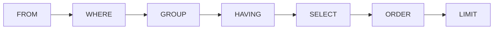

# SQL, the first day

## Panel 1: The order a query runs in

**Crux:** You write `SELECT` first and the server runs it fifth, which explains almost every
error you will meet this week.



Point at this picture before reading any error message. The clause that failed is almost always
one that ran earlier than you assumed.

## Panel 2: The clauses, and what each one is for

**Crux:** Seven clauses cover every query you write today, and each one answers a different
question about the rows.

| Clause | The question it answers |
|---|---|
| `FROM` | Which table are the rows coming from |
| `WHERE` | Which rows do I keep, judged one row at a time |
| `GROUP BY` | What do I collapse the rows into |
| `HAVING` | Which whole groups do I keep |
| `SELECT` | Which columns come back, and what are they called |
| `ORDER BY` | In what order |
| `LIMIT` | How many |

## Panel 3: WHERE against HAVING

**Crux:** `WHERE` judges a row before any group exists, `HAVING` judges a group after it is
formed, so an aggregate belongs in one and never in the other.

```sql
WHERE  quarter = 'Q1'      -- a fact about one row
HAVING count(*) > 100      -- a fact about a whole group
```

`WHERE count(*) > 100` is refused, and the message names the reason: aggregate functions are not
allowed in `WHERE`.

## Panel 4: Three errors and what each one means

**Crux:** Every message below is the execution order telling you where you stood.

| Message | What actually happened |
|---|---|
| `column "x" must appear in the GROUP BY clause` | `SELECT` had one row per group and many values of `x` |
| `aggregate functions are not allowed in WHERE` | `WHERE` ran before any group existed |
| `column "revenue" does not exist` | The alias was made in `SELECT`, which runs after `WHERE` |

## Panel 5: The habits that make a query auditable

**Crux:** A query nobody can check gets trusted on faith or rejected on faith, and neither is an
audit.

| Habit | Why |
|---|---|
| One comment line per query, naming the question | It is the first line a reviewer reads |
| Name the denominator in that comment | Most disagreements are denominator disagreements |
| A CTE per step, named after the step | Three levels of nesting is correct and unreadable |
| Never `LIMIT` without `ORDER BY` | Otherwise it returns five rows, not the top five |

## Panel 6: A CTE is a named step

**Crux:** `WITH name AS (query)` gives a result a name for the rest of the statement, and nothing
more than that.

```sql
WITH q1 AS (
  SELECT segment, sum(amount) rev
  FROM orders o
  JOIN customers c USING (customer_id)
  WHERE quarter = 'Q1'
  GROUP BY segment
)
SELECT * FROM q1 ORDER BY rev DESC;
```

It is a name, not a promise about how the work is done. Write CTEs for the person auditing the
query.
