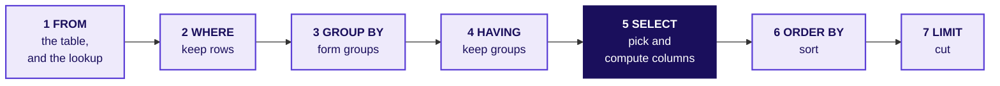

# Week 2 Monday: Can the warehouse itself give Anand the Monday numbers, every segment, every week?

Anand Iyer, Kalpa Retail's finance controller, wants last week's revenue tree every Monday for every
segment, computed from the warehouse itself, and his analyst audits every line. The book holds 1,000
orders over Q1 (April to June 2026) and Q2 (July to September 2026), each at its amount, whatever its
status.

## Panel 1: In what order does the database run a query's clauses?


```mermaid
flowchart LR
    F["<b>1 FROM</b><br/>the table,<br/>and the lookup"] --> W["<b>2 WHERE</b><br/>keep rows"] --> G["<b>3 GROUP BY</b><br/>form groups"] --> H["<b>4 HAVING</b><br/>keep groups"] --> S["<b>5 SELECT</b><br/>pick and<br/>compute columns"] --> O["<b>6 ORDER BY</b><br/>sort"] --> L["<b>7 LIMIT</b><br/>cut"]
    classDef known fill:#EEEAFB,stroke:#5B3FD6,color:#1A0F5C,stroke-width:2px
    classDef bet fill:#1A0F5C,stroke:#1A0F5C,color:#FFFFFF
    class F,W,G,H,O,L known
    class S bet
```

A query is written SELECT, FROM, WHERE, GROUP BY, HAVING, ORDER BY, LIMIT and runs as the arrows
show. `WHERE`
tests rows before groups exist, so a test on a count goes in `HAVING`; `SELECT` comes fifth, so it
cannot print a column the groups do not pin down; `LIMIT` cuts after `ORDER BY`. The sheet is Week
1's tree: customers who bought, times orders per customer, times revenue per order, every leaf from
`orders` and the segment from `customers`. Each panel below is one chapter's check.

## Panel 2: Which count is a customer, and where should the Monday number be computed?

| Query | On the book | It counts |
|---|---|---|
| `count(*)` over orders | 1,000 | Order rows |
| `count(DISTINCT customer_id)` over orders | 301 | Customers who bought |
| `count(*)` over customers | 340 | Members Kalpa holds |

Per quarter, `count(*) AS customers` printed 538 and 462 at 1.00 order each; counted once, 244 and
227 bought. A `.sql` file sends back 2 rows where an export copies 1,340.

**Crux:** A count says what it counts: order rows are count(*), customers are count(DISTINCT customer_id).

## Panel 3: Does a total that matches last week's mean the story matches?

| Q2 over Q1 | Customers | Frequency | Order value | Revenue |
|---|---|---|---|---|
| Last week's extract | 1.000 | 0.860 | 1.144 | 0.984 |
| The warehouse | 0.930 | 0.923 | 1.146 | 0.984 |

Both fell 1.6 percent, yet 69 of 69 extract customers bought in both quarters against 170 of 301 in
the book, where 7.0 percent fewer bought in Q2 and each ordered 7.7 percent less often.

**Crux:** A matching total is one leaf matching, so compare every leaf as a change.

## Panel 4: Why did 140 orders over 76 customers print 1?

```sql
count(*) / count(DISTINCT customer_id)   -- 2, then 1
round(count(*)::numeric
  / count(DISTINCT customer_id), 2)      -- 2.36, 1.84
HAVING count(DISTINCT customer_id) < 30  -- Student
```

Two whole numbers divide as whole numbers, truncating towards zero. Multiply back: 1 x 76 is 76, where
the orders are 140. Retail-Plus revenue fell 29.4 percent and its frequency 22.0 percent, where the
whole numbers said it halved.

**Crux:** Divide in numeric, round on purpose, and keep the counts beside the ratio.

## Panel 5: Who is inside the average of member spend?

| Retail-Plus, per member | Q1 | Q2 | Change |
|---|---|---|---|
| `avg`, a `CASE` with no `ELSE` | Rs 6,437 | Rs 5,439 | -15.5% |
| `coalesce(..., 0)` written in | Rs 5,474 | Rs 3,863 | -29.4% |

The first averages 91 members in Q1 and 76 in Q2, since `avg` skips `NULL`; the second averages the
same 107 in both. Named steps, `WITH book AS (...), q1 AS (...)`, read top down and rerun anywhere.

**Crux:** An average names who is inside it, so write the zero on purpose.

## Panel 6: Which numbers add across quarters, and which are counted again?

| Retail-Plus in the half-year | Customers |
|---|---|
| Q1 plus Q2, added | 167 |
| Members on the book | 120 |
| Counted from the orders | 107 |
| Bought in both quarters | 60 |

91 + 76 - 60 = 107. Segments add to the book, 36 + 102 + 91 + 15 = 244, because a customer sits in one
segment; quarters do not, because a customer can buy in both.

**Crux:** Orders and rupees add across quarters; customers are counted again from the orders.

## Panel 7: Will next Monday's run draw the same five orders?

The fingerprint holds seven numbers: `orders` has 1,000 rows, 301 customers, a latest date of 28
September 2026 and Rs 19,84,00,000 in all, and `customers` has 340 rows, 340 customers and a latest
joining date of 25 December 2025. On Monday `LIMIT 5` with no `ORDER BY` drew five orders worth Rs
3,900, and after a reload that changed no value it drew Rs 4,590. `ORDER BY order_id LIMIT 5` draws
the same five, Rs 3,900, both times.

**Crux:** Order every list on a column no two rows share, and print the book's fingerprint beside the numbers.
