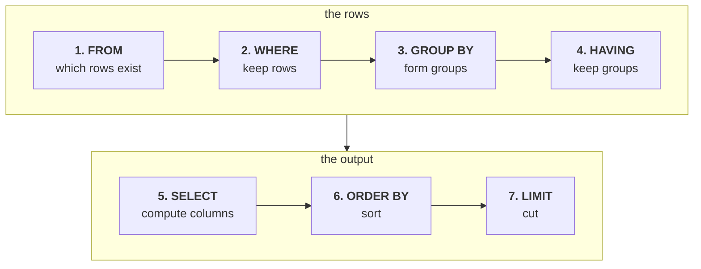

# The Monday numbers, in SQL

Kalpa Retail, Week 2 Monday. The revenue tree as queries the warehouse runs every Monday: every count
says what it counts, every ratio keeps its fraction, every average names who is in it, and every list
has an order.

## Panel 1: The order a query runs in, and the four lines


```mermaid
flowchart TB
    subgraph rows["the rows"]
        direction LR
        F["<b>1. FROM</b><br/>which rows exist"] --> W["<b>2. WHERE</b><br/>keep rows"] --> G["<b>3. GROUP BY</b><br/>form groups"] --> H["<b>4. HAVING</b><br/>keep groups"]
    end
    subgraph out["the output"]
        direction LR
        S["<b>5. SELECT</b><br/>compute columns"] --> O["<b>6. ORDER BY</b><br/>sort"] --> L["<b>7. LIMIT</b><br/>cut"]
    end
    rows --> out
```

Written SELECT first, run FROM first. The run order explains the classic refusals: an alias from
SELECT is unknown in WHERE, `WHERE count(*)` is refused, and a column must be grouped or aggregated.

- Count what you mean: COUNT(DISTINCT customer_id) counts people; count(*) counts rows.
- Divide in numeric and round on purpose: integers divide as integers.
- Name who is averaged: AVG skips NULLs, so say whether a NULL means zero.
- Order every list on a unique key: a table has no order.

## Panel 2: Week 1's steps as clauses

| Week 1 in Python | In SQL |
|---|---|
| Count the orders | `count(*)` |
| Add the amounts | `sum(amount)` |
| Count each customer once | `count(DISTINCT customer_id)` |
| A total per segment | `GROUP BY segment` |
| Keep delivered orders | `WHERE status = 'delivered'` |
| The typical order | `percentile_cont(0.5) WITHIN GROUP (ORDER BY amount)` |
| Two quarters side by side | Two CTEs lined up on segment |

## Panel 3: Three counts, three questions

| Query | Kalpa, two quarters | It answers |
|---|---|---|
| `count(*)` over orders | 1,000 | How many order rows |
| `count(DISTINCT customer_id)` over orders | 301 | How many customers bought |
| `count(*)` over customers | 340 | How many members Kalpa holds |

**Crux:** A label is a promise the query does not keep: `count(*) AS customers` still counts rows.

## Panel 4: Division and averages

```sql
SELECT 140 / 76;                     -- 1
SELECT round(140::numeric / 76, 2);  -- 1.84
SELECT avg(x), count(*), count(x)    -- 150, 3, 2
FROM (VALUES (100), (NULL), (200)) AS invented (x);
```

Multiply a ratio back by its denominator: 1.84 times 76 gives 140, and 1 times 76 does not. Put
`count(*)` beside every average, and write `coalesce(x, 0)` when no value means zero.

## Panel 5: WHERE, HAVING and the named step

```sql
WITH q1 AS (SELECT c.segment, count(*) AS orders
            FROM orders o JOIN customers c USING (customer_id)
            WHERE o.quarter = 'Q1' GROUP BY c.segment),
     q2 AS ( ... the same step, WHERE o.quarter = 'Q2' ... )
SELECT segment, q1.orders, q2.orders
FROM   q1 JOIN q2 USING (segment)
ORDER  BY segment;
```

WHERE tests a row before grouping; HAVING tests a group after it. A later step reads every earlier
step and every table.

## Panel 6: The four wrong numbers of the day

| The hurried query | The wrong number | The check |
|---|---|---|
| count(*) as customers | 1,000 customers, 1.00 orders each | Count three ways |
| LIMIT 5, no ORDER BY | Rs 3,900 audited, Rs 4,590 rerun | Rerun after a reload |
| count / count in integers | Retail-Plus 2 to 1, "halved" | Multiply back |
| avg over NULLs | Spend per member 15.5% down | count(*) against count(x) |

**Crux:** Every trap printed a clean number with no error; the check is what catches it.

## Panel 7: The sentence to Anand

Claim, booked revenue fell 1.6 percent, as last week's extract showed. Evidence, the fall sits in
Retail-Plus frequency, 2.36 to 1.84 orders per customer. Caveat, booked revenue, and a thin cell
flagged. Next step, collected revenue.

**Crux:** A number the analyst cannot rerun is a number the analyst cannot sign.
