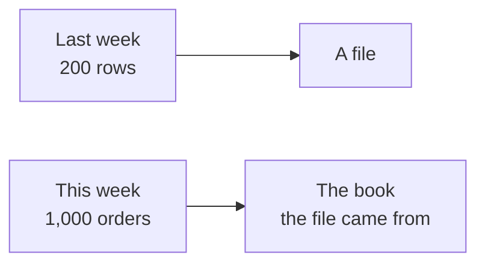
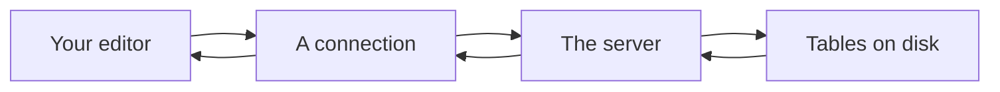
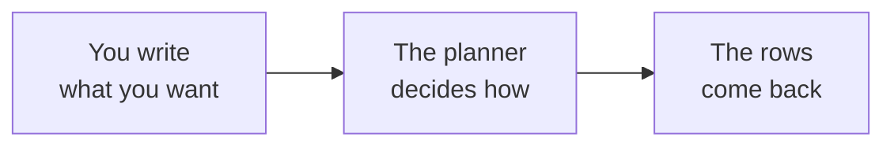
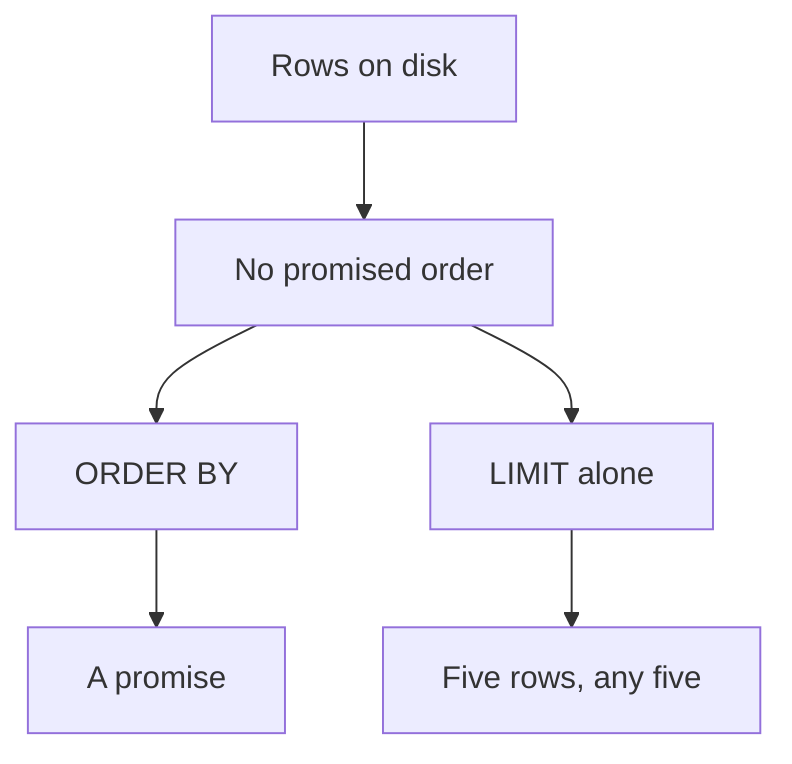
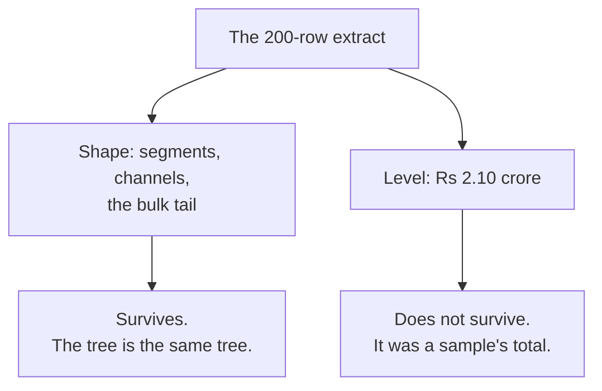
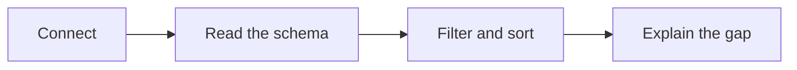

# Half one: the warehouse answers, and it answers differently

Week 2, Day 1. Slide source. One idea per slide.

Position bar, repeated at every section boundary:
`[Anand's ask] > [the connection] > [one table, filtered] > [the number that did not match]`

---

## SECTION A. What Anand actually asked for

---

## S1. The reply to your note
> "Good note. I accept real, modest, fix frequency. Now I want these numbers every Monday, for
> every segment and channel, computed from the warehouse itself. No notebooks, no exports,
> nothing a person can mistype. Our data team will give you read access to Postgres."

Anand Iyer, finance controller. He is not asking for a better analysis. He is asking for the same
analysis to stop depending on you.

---

## S2. Three words in that message rule things out
| What he said | What it rules out |
|---|---|
| every Monday | A script somebody has to remember to run |
| from the warehouse itself | A CSV that left the database and aged |
| nothing a person can mistype | A cell someone edits after the fact |

The deliverable is not a number. It is a query that returns the number whenever it is run.

---

## S3. And one more line from the platform lead
> "The warehouse holds the same orders and customers you cleaned last week, one thousand orders
> for the two quarters, already de-duplicated. Query it; do not export it."

One thousand. Last week's file had two hundred rows.

---

## S4. Hold that number

Last week you worked a file. This week you have the book the file came out of.

Nothing in your analysis was wrong. The thing you analysed was smaller than the business.

That gap is the first thing today has to close, and it closes with a query rather than an apology.

---

## SECTION B. Getting in

---

## S5. What a database is, before any syntax

You send text. The server decides how to get the answer. You never touch the files.

---

## S6. The connection, once
The warehouse is already running in your Codespace. The database is called `kalpa`.

```sql
-- A .sql file, opened in the editor, run against the connection.
SELECT count(*) FROM orders;
```

One thousand. That is the whole handshake.

---

## S7. Reading a schema before writing anything
| Table | One row is | Why you care today |
|---|---|---|
| `customers` | A person or a company that has bought | Segment lives here, not on the order |
| `orders` | One order | Amount, channel, quarter, status |
| `payments` | One payment attempt | Tomorrow's problem, not today's |
| `refunds` | One refund | Tomorrow's problem too |
| `campaign_exposure` | One customer seen by one campaign | Thursday |
| `plan_line` | One week of the plan | Wednesday |

A column you have not looked at is a column you will misuse.

---

## S8. A query describes the result

You do not tell the database to open a file, walk it and add things up. You describe what you
want back, and the server picks how.

That is the whole difference from last week's accumulator, and it is why a query is shorter than
the loop it replaces.

---

## SECTION C. One table, filtered

---

## S9. Three clauses get you a long way
```sql
SELECT order_id, amount, channel
FROM   orders
WHERE  quarter = 'Q1'
ORDER BY amount DESC
LIMIT 5;
```
`SELECT` picks the columns, `FROM` names the table, `WHERE` keeps rows, `ORDER BY` sorts,
`LIMIT` cuts.

---

## S10. Last week's first finding, in one statement
Monday of Week 1 spent a morning finding the order that pulled the mean away from the median.

```sql
SELECT order_id, amount FROM orders ORDER BY amount DESC LIMIT 5;
```
Thirty lines of Python became one line. The finding was never in the Python.

---

## S11. LIMIT without ORDER BY is not the top five
```sql
SELECT order_id, amount FROM orders LIMIT 5;
```
This returns five rows. Which five is the server's business, and it may answer differently on two
machines running the same query against the same data.

A row has no position until you give it one.

---

## D1. What the server actually guarantees about order

Nothing. Not insertion order, not primary key order, not the order you saw last time.

An `ORDER BY` is the only promise. Everything else is an accident of how the rows came back, and
an accident that holds for a year can stop holding the day an index is added.

---

## S12. Counting is a question about rows
```sql
SELECT count(*) FROM orders WHERE quarter = 'Q1';
```
`count(*)` counts rows. `count(column)` counts rows where that column is not null, which is a
different question and sometimes the one you meant.

---

## SECTION D. The number that did not match

---

## S13. Run last week's headline
Last week's note to Meera said Q1 was Rs 2.10 crore.

```sql
SELECT quarter, sum(amount) FROM orders GROUP BY quarter;
```

The warehouse says Q1 is Rs 10.00 crore.

---

## S14. Neither number is wrong
Both are honest, and they answer different questions.

Last week's file was an extract the data team pulled so the room could start before anybody had
database access. Two hundred rows out of a thousand orders.

---

## S15. What survives, and what does not


---

## S16. The sentence you send Anand
> "Last week's figures came from a 200-row extract, so the levels were a sample's levels. The
> shape held: Retail-Plus frequency is still the branch that moved. Every number from Monday
> onward comes from the warehouse, and here is the query for each one."

Say it before he finds it.

---

## D2. Why this is a good day rather than a bad one
An analyst who quietly reconciles a number nobody asked about is worth more than one who is
never wrong, because the second one has not checked.

The gap was findable in one query. That is the argument for Anand's whole request.

---

## S17. Where half one leaves you

You can reach the warehouse, read its schema, filter one table, sort it, and explain why your
old number and the new one are both honest.

Half two turns that into the suite Anand runs every Monday.
