# Can the warehouse itself give Anand the Monday numbers, every segment, every week?

Week 2, Day 1. Morning.

Kicker: WEEK 2  ·  MONDAY  ·  MORNING
Quote: I want these numbers every Monday, for every segment and channel, computed from the warehouse itself. Nothing a person can mistype.
Who: Anand Iyer, finance controller, Kalpa Retail, to the data and AI team at Kalpa's Global Capability Centre

```notes
LIVE, one minute. Read Anand's words aloud and leave them up while the room settles. Last week
ended with Meera accepting "real, modest, fix frequency" from a 186-order extract, and parking
Marketing's Rs 12 crore acquisition request. This week the same numbers move from files into
Kalpa's warehouse, and each day answers a harder version of Anand's request. Then the day's
question and its six chapters.
```

---

## S1. Six chapters, each asking what the last answer raised
*Can the warehouse itself give Anand the Monday numbers, every segment, every week?*

```timeline
label: Chapter 1 | title: What does the book say? | body: Orders, rupees and customers per quarter, counted where the book lives.
label: Chapter 2 | title: Same story as Week 1? | body: Does the warehouse agree with the file Meera's decision rested on?
label: Chapter 3 | title: Which segment moved? | body: Which segment carried the fall, and how often its customers ordered.
label: Chapter 4 | title: Which branch moved? | body: Which branch fell in each segment, and how much less each member spent.
label: Chapter 5 | title: Does the suite add up? | body: Do the numbers add up the way Anand's analyst will add them?
label: Chapter 6 | title: Same answer next week? | body: After lunch: will next Monday's run give the same answer? | tone: dark
```

```notes
LIVE, 2 minutes. Read the day's question, then the six chapter questions in order. Each chapter
asks the question the answer before it raises, and each closes on its own answer with a number.
Chapters 1 to 5 run this morning, with a break before chapter 4, and chapter 6 after lunch.
Then Anand's message in full.
```

---

## S2. Every Monday, every segment, straight from Postgres
*What exactly is Anand asking for, and what did the platform lead add?*

**The client asks.** "I want these numbers every Monday, for every segment and channel, computed from the warehouse itself. No notebooks, no exports, nothing a person can mistype. Our data team will give you read access to Postgres."

> "The warehouse holds the same orders and customers you cleaned last week, one thousand orders for the two quarters, already de-duplicated. Query it; do not export it."
> The data platform lead, Kalpa Retail

```stats
value: 1.6% | label: last week's fall | note: booked revenue, Q1 to Q2, on the extract
value: 1,000 | label: orders in the warehouse | note: as the platform lead describes it
value: 0 | label: exports allowed | note: query it, do not export it
value: 1 | label: analyst who audits | note: every line of every query
```

```notes
LIVE, 4 minutes. Read both messages aloud. Anand Iyer is Kalpa Retail's finance controller: he
owns the book, the record of every order Finance stands behind, and his analyst will read every
query line by line without the team in the room. The warehouse is Kalpa's Postgres database, the
one copy of the book everybody reads. Q1 is April to June 2026 and Q2 is July to September 2026.
Ask which of the four numbers changes how the team works most. Most say the zero, because every
Week 1 step ran on a file. The platform lead's "one thousand orders" is a claim; chapter 1 checks
it. Then what Anand's rule rules out.
```

---

## S3. Question: what does "from the warehouse" rule out?
*Anand named three things he never wants behind a Monday number: which work does his rule still allow?*

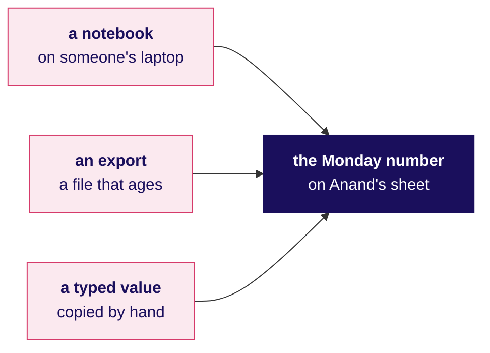
```mermaid
flowchart LR
    A["<b>a notebook</b><br/>on someone's laptop"] --> X["<b>the Monday number</b><br/>on Anand's sheet"]
    B["<b>an export</b><br/>a file that ages"] --> X
    C["<b>a typed value</b><br/>copied by hand"] --> X
    classDef bad fill:#FBE9EF,stroke:#D63A6A,color:#1A0F5C
    classDef bet fill:#1A0F5C,stroke:#1A0F5C,color:#FFFFFF
    class A,B,C bad
    class X bet
```

**Question.** Which work does Anand's rule still allow? a) exploring in a notebook while the reported number comes from a saved query; b) exporting once a quarter to a shared drive; c) pasting a query's output into the sheet by hand; d) none, since all analysis moves to SQL.

```notes
LIVE, 3 minutes. One minute in pairs, then letters. Expect d from the cautious and b from the
practical, and hold the answer until every pair has a letter. Then the answer.
```

---

## S4. Answer: explore anywhere, report from the query
*Which work does Anand's rule allow, and why is each of the others ruled out?*

| Option | Verdict | Why |
|---|---|---|
| a) Explore in a notebook, report from a saved query | Allowed | The reported number is rerun on the book every Monday. |
| b) Export once a quarter | Ruled out | The export is a second copy that ages the day it lands. |
| c) Paste output by hand | Ruled out | A typed value leaves no trace an auditor can follow. |
| d) Move all analysis into SQL | Too far | Charts, tests and exploration stay in Python, reading the warehouse. |

The answer is a. The query is what the team hands over, and the notebook is where the team thinks.

```notes
LIVE, 2 minutes. Option d sounds disciplined and throws away every chart the week needs; option b
is how most teams start and why most Monday numbers drift. This is the first half of the interview
answer to "why compute a KPI in the warehouse", which chapter 1 finishes with a number. Then which
of last week's steps become one line.
```

---

## S5. Every Week 1 step becomes one line of SQL
*Which of last week's Python steps become one line of SQL?*

| Week 1 step, in Python | The SQL line | Where today |
|---|---|---|
| Count the orders | count(*) | Chapter 1 |
| Add the amounts | sum(amount) | Chapter 1 |
| Count each customer once | count(DISTINCT customer_id) | Chapter 1 |
| One row per segment and quarter | GROUP BY segment, quarter | Chapter 3 |
| Keep only some groups | HAVING count(...) < 30 | Chapter 3 |
| Two quarters side by side | a named step per quarter, WITH ... AS | Chapter 4 |

The room knows every right answer from Week 1, so today's attention goes to the language and to what each line guarantees.

```notes
LIVE, 3 minutes. Say each pair aloud. The last one, two quarters side by side, is chapter 4's
named steps. Where SQL stops: charts, statistical tests and exploration stay in Python, which
reads the warehouse; the number on the sheet comes from the saved query. Then the order in which
the database runs what you write.
```

---

## S6. A query is written in one order and run in another
*In what order does the database run a query's clauses?*

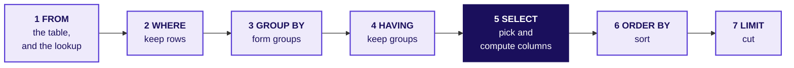
```mermaid
flowchart LR
    F["<b>1 FROM</b><br/>the table,<br/>and the lookup"] --> W["<b>2 WHERE</b><br/>keep rows"] --> G["<b>3 GROUP BY</b><br/>form groups"] --> H["<b>4 HAVING</b><br/>keep groups"] --> S["<b>5 SELECT</b><br/>pick and<br/>compute columns"] --> O["<b>6 ORDER BY</b><br/>sort"] --> L["<b>7 LIMIT</b><br/>cut"]
    classDef known fill:#EEEAFB,stroke:#5B3FD6,color:#1A0F5C,stroke-width:2px
    classDef bet fill:#1A0F5C,stroke:#1A0F5C,color:#FFFFFF
    class F,W,G,H,O,L known
    class S bet
```

Written as SELECT, FROM, WHERE, GROUP BY, HAVING, ORDER BY, LIMIT; run as the arrows show. Most of today's refusals and wrong numbers are explained by this order.

```notes
LIVE, 4 minutes, never cut. Draw it on the board and leave it up all day. Walk one query through
it aloud: the table is read, WHERE keeps rows one at a time, GROUP BY forms the groups, HAVING
keeps groups, and only then does SELECT compute the columns, which is why SELECT cannot print a
column the groups do not pin down, and why WHERE cannot test a count that does not exist yet.
ORDER BY sorts after SELECT, and LIMIT cuts last. A query describes the result; the database
decides how to get it. Then the tree Anand's sheet carries.
```

---

## S7. The tree Anand's sheet carries, leaf by leaf
*Which numbers does the Monday sheet carry, and which table holds each?*

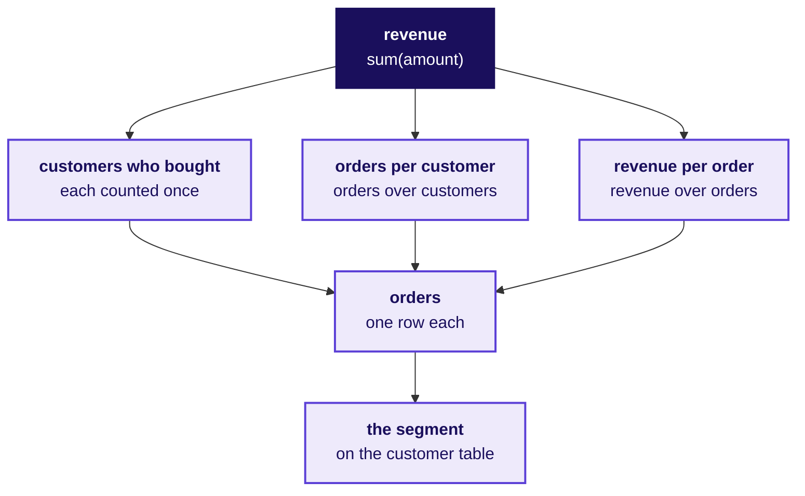
```mermaid
flowchart TB
    R["<b>revenue</b><br/>sum(amount)"] --> C["<b>customers who bought</b><br/>each counted once"]
    R --> F["<b>orders per customer</b><br/>orders over customers"]
    R --> V["<b>revenue per order</b><br/>revenue over orders"]
    C --> O["<b>orders</b><br/>one row each"]
    F --> O
    V --> O
    O --> SEG["<b>the segment</b><br/>on the customer table"]
    classDef known fill:#EEEAFB,stroke:#5B3FD6,color:#1A0F5C,stroke-width:2px
    classDef bet fill:#1A0F5C,stroke:#1A0F5C,color:#FFFFFF
    class C,F,V,O,SEG known
    class R bet
```

Revenue is customers who bought, times orders per customer, times revenue per order: Week 1 Monday's tree, now read from two tables.

```notes
LIVE, 3 minutes. Recall the tree from Week 1 Monday; the retail dossier
(content/W01/D1/study-notes/C2_W01_D01_domain_retail_STUDENT.md, section 5) has the long version.
Booked revenue means every order at its amount, whatever its status; Finance's delivered-only
definition is the escalated case's question this afternoon. Every leaf comes from the orders
table, and the segment lives on the customer, which chapter 3 needs. Then chapter 1.
```

---

## SECTION 1: What does the book say?
*How many orders, rupees and customers did each quarter book, counted where the book lives?*

```notes
LIVE. Thirty minutes: the need and the company (3), the options and the call (5), the schema
read and the first query live (6), the quarter totals (4), the trap and its fix (8, never cut),
the second route (2) and the close (2). Notebook 1 and sql/C2_W02_D01_01_book_STUDENT.sql run
beside it.
```

---

## S8. Answered in five questions, before the sheet goes out
*Who needs this answer, and which questions lead to it?*

**Who needs the answer.** Anand puts these numbers on the Monday sheet and his analyst audits every line. A customer count that is really a count of orders says nobody ever buys twice, which reopens the Rs 12 crore acquisition request that Meera, Kalpa Retail's CEO, parked last week.

```timeline
label: 1 | title: Where to compute? | body: An export, a query or a view
label: 2 | title: What does it hold? | body: The tables, and where each leaf lives
label: 3 | title: What did it book? | body: Orders and rupees per quarter
label: 4 | title: How many customers? | body: Who bought in each quarter
label: 5 | title: Does Python agree? | body: The raw rows, counted another way | tone: dark
```

```notes
LIVE, 1 minute. Read the five questions. Each gets its answer before the next is asked, and the
chapter's last slide answers all five in a line each. Then the need.
```

---

## S9. The need: the tree's leaves, counted on the book
*Who asks, what is measured, and what does a wrong count cost?*

```cards
icon: user | eyebrow: Who asks | title: Anand and his analyst | body: The finance controller signs the Monday sheet; his analyst reruns every query behind it.
icon: chart-line | eyebrow: The metric | title: The tree's leaves | body: Orders, booked revenue and customers who bought, per quarter, counted in the warehouse.
icon: triangle-alert | eyebrow: A wrong count costs | title: Rs 12 crore reopened | body: Customers counted as orders say nobody buys twice, and the acquisition request comes back. | tone: dark
```

```notes
LIVE, 2 minutes. A customer who bought means a customer with at least one order in the quarter,
counted once however many orders they placed. Write that definition on the board beside the tree;
the trap in this chapter is a count that looks like it and is not. Then a bank that paid for
numbers moved by hand.
```

---

## S10. JPMorgan: a risk model moved by copy and paste
*Has a real finance team paid for numbers a person moved by hand?*

> "operated through a series of Excel spreadsheets, which had to be completed manually, by a process of copying and pasting data from one spreadsheet to another"
> JPMorgan Chase's task force on its 2012 trading losses, report of 16 January 2013, page 124

```stats
value: $5.8 billion | label: losses for the year | note: through 30 June 2012, the report's page 7
value: 132 pages | label: the task force's report | note: 16 January 2013
```

A number a person moves by hand can be moved wrongly, and Anand's rule keeps Kalpa's book away from that.

```notes
LIVE, 1 minute. The London Whale losses. The quote is about the chief investment office's new
value-at-risk model, the number that told management how much the trading book could lose;
hand-moved inputs were among the problems the task force found. Do not claim the spreadsheet caused the loss; say it was one of
the control failures the report names. Source and check date are in the day's provenance. Then
the three places the Monday numbers could be computed.
```

---

## S11. A .sql file sends 2 rows where an export sends 1,340
*Where could the Monday numbers be computed, and what does each way cost?*

| Option | What leaves the warehouse each Monday | Can the analyst rerun it? | When a column is renamed |
|---|---|---|---|
| A. Export the tables and compute in pandas | 1,340 rows: all 1,000 orders and 340 customers | Only on the copy, which may no longer match the book | An old export keeps answering from old data |
| B. Query the warehouse from a .sql file | 2 rows, one per quarter | Yes: the same file on the same book | The query stops with an error naming the column |
| C. Save the query as a view in the warehouse | 2 rows, one per quarter | Yes: one line reads the view | The view follows the rename and blocks a drop |

**The call.** B: the team has read access only, and a .sql file reruns exactly on the book.

```notes
LIVE, 3 minutes. Sized on this warehouse in notebook 1: the export copies both tables the tree
needs, 1,340 rows, before Python adds anything; the query and the view return two rows. The copy
is also a second version of the book, and the analyst cannot tell whether it still matches the
first. A view needs the right to create objects in the warehouse, which read access does not
give. The notebook reads the same .sql file, so the team thinks in the notebook and reports from
the query. Then what would switch the call.
```

---

## S12. A schema of the team's own would switch it to a view
*What fact would move the call away from a .sql file?*

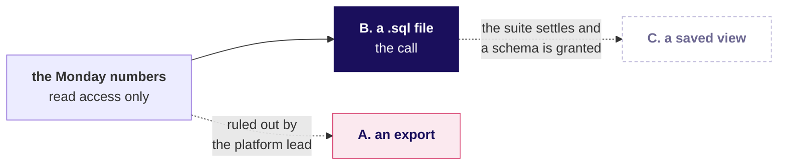
```mermaid
flowchart LR
    Q["<b>the Monday numbers</b><br/>read access only"] --> B["<b>B. a .sql file</b><br/>the call"]
    B -.->|"the suite settles and<br/>a schema is granted"| C["<b>C. a saved view</b>"]
    Q -.->|"ruled out by<br/>the platform lead"| A["<b>A. an export</b>"]
    classDef unknown fill:#FFFFFF,stroke:#B8B2D6,color:#6B6690,stroke-dasharray:4 3
    classDef bad fill:#FBE9EF,stroke:#D63A6A,color:#1A0F5C
    classDef bet fill:#1A0F5C,stroke:#1A0F5C,color:#FFFFFF
    class B bet
    class C unknown
    class A bad
```

**The fact that would change the call.** Once the suite stops changing and the platform lead grants a schema, a view is better: Postgres then records which columns the Monday numbers depend on and refuses a change that would break them.

```notes
LIVE, 1 minute. Notebook 1's depth section shows both behaviours inside a rolled-back
transaction: after a rename, a query naming the old column stops with an error, the view follows
the rename, and Postgres refuses to drop a column the view reads. That refusal is the view's value
and its cost. Then the first query: what the warehouse holds.
```

---

## S13. Seven tables, and today's tree needs two
*What does the warehouse hold, and where does each leaf of the tree live?*

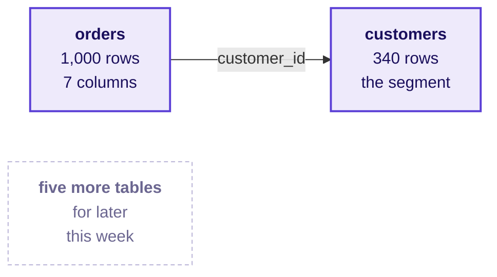
```mermaid
flowchart LR
    ORD["<b>orders</b><br/>1,000 rows<br/>7 columns"] -->|"customer_id"| CUS["<b>customers</b><br/>340 rows<br/>the segment"]
    OTH["<b>five more tables</b><br/>for later<br/>this week"]
    classDef known fill:#EEEAFB,stroke:#5B3FD6,color:#1A0F5C,stroke-width:2px
    classDef unknown fill:#FFFFFF,stroke:#B8B2D6,color:#6B6690,stroke-dasharray:4 3
    class ORD,CUS known
    class OTH unknown
```

```sql
SELECT table_name, count(*) AS columns
FROM   information_schema.columns
WHERE  table_schema = 'public'
GROUP  BY table_name ORDER BY table_name;
```

An order carries order_id, customer_id, order_date, quarter, channel, amount and status. The segment is not on the order: it lives on the customer.

```notes
LIVE, 6 minutes. First contact: open sql/C2_W02_D01_01_book_STUDENT.sql in VS Code, connect with
the PostgreSQL extension to the kalpa database, select the block and run it. information_schema is
the catalogue every Postgres database keeps about itself, so nobody had to be asked. amount is
stored as numeric, so sum can add it. If a connection fails, two minutes and the last line of the
error, then pair the learner with a neighbour. Then the book's quarter totals.
```

---

## S14. Question: what will the book say for each quarter?
*Week 1's extract said Rs 1.90 crore in Q1 and Rs 1.87 crore in Q2: what will the whole book say?*

```sql
SELECT quarter, count(*) AS orders, sum(amount) AS revenue
FROM   orders
GROUP  BY quarter
ORDER  BY quarter;
```

**Question.** What will the warehouse say? a) exactly the extract's two totals; b) larger totals, falling the same 1.6 percent; c) larger totals, falling by a different amount; d) smaller totals, because the warehouse is de-duplicated.

```notes
LIVE, 1 minute. Letters first. Expect a from those who took "the same orders you cleaned" at its
word. Then run it.
```

---

## S15. Answer: Rs 10 crore to Rs 9.84 crore, down 1.6%
*How many orders and rupees did each quarter book?*

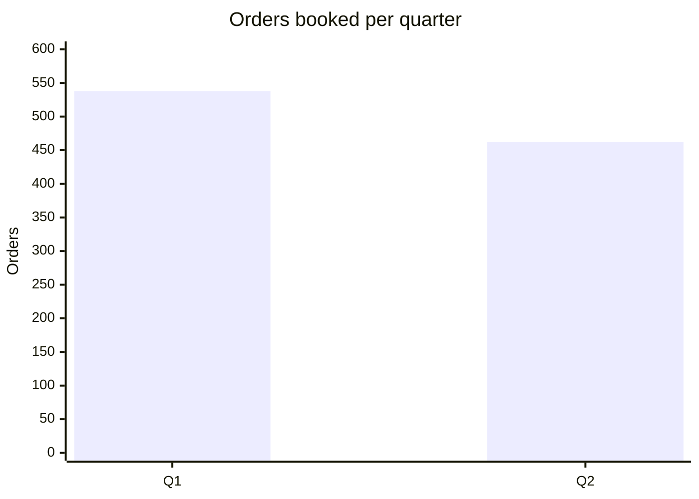
```mermaid
xychart-beta
    title "Orders booked per quarter"
    x-axis ["Q1", "Q2"]
    y-axis "Orders" 0 --> 600
    bar [538, 462]
```

The answer is b. Q1 booked Rs 10,00,00,000 on 538 orders and Q2 Rs 9,84,00,000 on 462: about five times the extract's totals, falling the same 1.6 percent. The check: 538 plus 462 is 1,000, the platform lead's number.

```notes
LIVE, 3 minutes. Revenue per order rose from Rs 1,85,874 to Rs 2,12,987; the Business segment's orders are worth
lakhs each, which chapter 3 shows. One leaf agrees with Week 1, and chapter 2 sets every other leaf
beside last week's. Then the next leaf, customers.
```

---

## S16. The plausible wrong answer: 538 customers, 1.00 each
*What does the quickest customer count put on Anand's sheet?*

```sql
SELECT quarter, count(*) AS customers
FROM   orders
GROUP  BY quarter ORDER BY quarter;
```

```stats
value: 538 | label: Q1 "customers" | note: the column's own label
value: 462 | label: Q2 "customers" | note: the column's own label
value: 1.00 | label: orders per customer | note: in both quarters
```

**What breaks.** Every customer bought once and never came back, so the frequency branch Meera was told to fix reads as nothing to fix, and the Rs 12 crore acquisition case returns.

```notes
LIVE, 3 minutes. Put it up as a hurried analyst would ship it and ask whose first draft looks like
it. The query runs, the label says customers, and the number is plausible for a store where people
buy once. Ask what the query actually counted before showing why.
```

---

## S17. Why it is wrong: count(*) counts order rows
*What does count(*) count, whatever the column is called?*

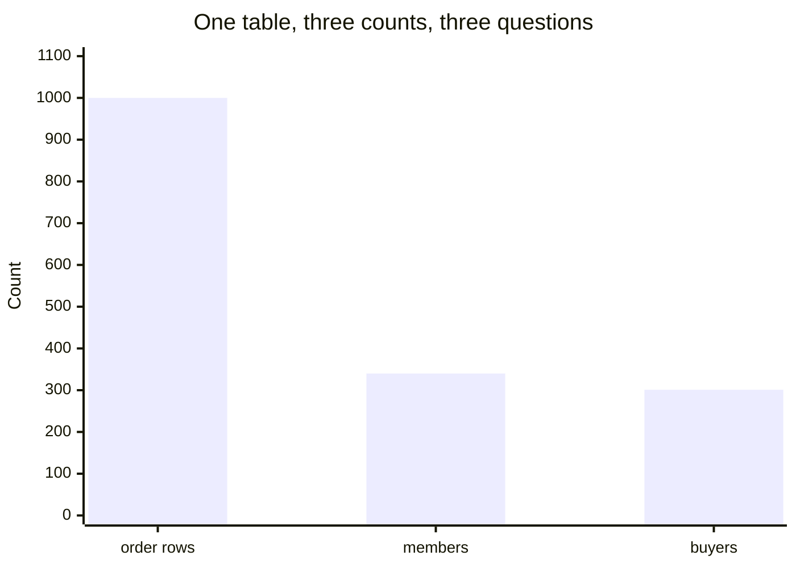
```mermaid
xychart-beta
    title "One table, three counts, three questions"
    x-axis ["order rows", "members", "buyers"]
    y-axis "Count" 0 --> 1100
    bar [1000, 340, 301]
```

**The check.** Count three ways, each named for what it counts: 1,000 order rows, 340 members on the customer table, and 301 buyers, the customers who bought across both quarters. `AS customers` is a label, and the database prints whatever name it is given.

```notes
LIVE, 3 minutes. count(*) counts rows, and a row of orders is an order. 39 of the 340 members
bought nothing in either quarter, so the customer table answers a different question: how many
members Kalpa holds. Only count(DISTINCT customer_id) on the orders answers the tree's question.
Then the fix per quarter.
```

---

## S18. The fix: 244 and 227 customers, 2.20 and 2.04 each
*How many customers bought in each quarter, each counted once?*

```sql
SELECT quarter, count(*) AS order_rows,
  count(DISTINCT customer_id) AS customers
FROM orders
GROUP BY quarter ORDER BY quarter;
```

| Quarter | Order rows | Customers who bought | Orders per customer |
|---|---|---|---|
| Q1 | 538 | 244 | 2.20 |
| Q2 | 462 | 227 | 2.04 |

The fix takes out 294 customers who do not exist in Q1 and 235 in Q2, and orders per customer moves from 1.00 to 2.20 and 2.04: customers do come back.

```notes
LIVE, 2 minutes. Keep order_rows beside customers on the sheet, so the reader sees the two counts
are different things. The gap between them is the repeat buying Meera cares about. Then the same
three leaves, reached a second way.
```

---

## S19. A second route: Python moved 1,000 rows to agree
*Do the raw rows, counted in Python, give the same leaves?*

| Leaf | Q1, SQL | Q1, Python | Q2, SQL | Q2, Python |
|---|---|---|---|---|
| Orders | 538 | 538 | 462 | 462 |
| Customers | 244 | 244 | 227 | 227 |
| Revenue | Rs 10,00,00,000 | Rs 10,00,00,000 | Rs 9,84,00,000 | Rs 9,84,00,000 |

The second route pulls every order row into Python and counts with a set of customer ids and a running sum, with no SQL count or sum anywhere. It agrees on every leaf, after moving 1,000 rows where the query moved two.

```notes
LIVE, 2 minutes. This is option A from the sizing, done once, so it also shows what an export
costs. A Python set keeps each id once, the way count(DISTINCT ...) does. When to switch: pandas
is the right tool for exploration and charts that read the warehouse; the reported number stays in
the query. Then the chapter's answer.
```

---

## S20. The book: 538 then 462 orders, 244 then 227 buyers
*So how many orders, rupees and customers did each quarter book, counted where the book lives?*

| The question on the way | The answer |
|---|---|
| 1. Where to compute? | A .sql file: 2 rows back against an export's 1,340 |
| 2. What does it hold? | Seven tables; orders and customers carry today's tree |
| 3. What did it book? | Rs 10,00,00,000 on 538, then Rs 9,84,00,000 on 462 |
| 4. How many customers? | 244, then 227; count(*) said 538 and 462 |
| 5. Does Python agree? | Yes, on every leaf, after moving 1,000 rows |

**Kavya's review.** Every count says what it counts, in its name and in the comment above it. Customers on Anand's sheet are customers who bought in the quarter, each counted once, and a count named customers that counts rows is the first thing an auditor finds.

**In the interview.** [F] Why would you compute a KPI in the warehouse rather than in a notebook? [F] What do count(*), count(customer_id) and count(DISTINCT customer_id) each count?

```notes
LIVE, 2 minutes. Kavya Nair is the team's senior analyst, who checks every number before it
leaves. The interview answer in one breath: the warehouse holds the one copy everyone reads, a
query reruns on it, and on this book an export moves 1,340 rows to answer what two rows answer.
The chapter 1 set (exercises/unguided/C2_W02_D01_ch1_what_the_book_says_STUDENT.md) runs its
first two items now if the chapter ran to time. Then chapter 2: the total matched last week's, so
does everything else?
```

---

## SECTION 2: Same story as Week 1?
*Does the warehouse tell the same story as the file Meera's decision rested on?*

```notes
LIVE. Thirty minutes: the need and the company (3), the options and the call (4), last week's file
recomputed (4), every leaf as a change (5), the trap and its check (6, never cut), the second route
(4), the line for the sheet and the close (4). Notebook 2 and sql/C2_W02_D01_02_same_story_STUDENT.sql
run beside it.
```

---

## S21. Answered in six questions, before Anand signs
*Who needs this answer, and which questions lead to it?*

**Who needs the answer.** Anand wants to know which story the sheet signs for, and Meera parked a Rs 12 crore acquisition request on last week's finding that customers held steady while each ordered less often. If the book tells a different story and nobody says so, that decision stays parked on a number the warehouse does not support.

```timeline
label: 1 | title: Compare how? | body: Two sources of different sizes
label: 2 | title: Last week intact? | body: The extract recomputed from its file
label: 3 | title: Which leaves agree? | body: Each read as a change, Q1 to Q2
label: 4 | title: Customers too? | body: The leaf the decision rested on
label: 5 | title: Where did 17 go? | body: The customer change, built another way
label: 6 | title: What goes on the sheet? | body: The line about last week's note | tone: dark
```

```notes
LIVE, 1 minute. Read the six questions. Then the need.
```

---

## S22. The need: the story the sheet signs for
*Who asks, what is compared, and what does a wrong story cost?*

```cards
icon: user | eyebrow: Who asks | title: Anand, then Meera | body: Anand signs the sheet; Meera's parked decision rests on last week's branch story.
icon: chart-line | eyebrow: The metric | title: Every leaf, as a change | body: Revenue, orders, customers, orders per customer and revenue per order, Q1 to Q2.
icon: triangle-alert | eyebrow: A wrong story costs | title: A parked Rs 12 crore | body: A decision stays parked on a finding the book does not show, and the next number is doubted. | tone: dark
```

> "Before your numbers go in my book, show me they match the ones you gave Meera."
> Anand Iyer, finance controller, Kalpa Retail

```notes
LIVE, 2 minutes. Last week's extract held 186 cleaned orders: 100 in Q1 and 86 in Q2, Rs 1,90,00,000
and Rs 1,87,00,000, with 69 customers in each quarter. The warehouse holds 1,000. The totals
cannot match; the question is whether the story does. Then a company that met the same question.
```

---

## S23. Airbnb: two teams, one question, two answers
*Has a real company seen two sources answer one question differently?*

> "Data Science and Finance would sometimes provide diverging answers using slightly different tables, metric definitions, and business logic"
> The Airbnb Tech Blog, "How Airbnb achieved metric consistency at scale", 30 April 2021

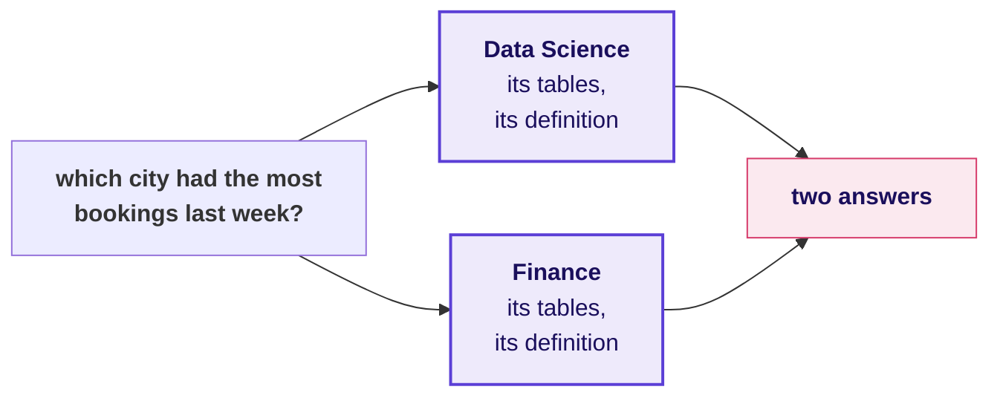
```mermaid
flowchart LR
    Q["<b>which city had the most<br/>bookings last week?</b>"] --> DS["<b>Data Science</b><br/>its tables,<br/>its definition"]
    Q --> FI["<b>Finance</b><br/>its tables,<br/>its definition"]
    DS --> X["<b>two answers</b>"]
    FI --> X
    classDef known fill:#EEEAFB,stroke:#5B3FD6,color:#1A0F5C,stroke-width:2px
    classDef bad fill:#FBE9EF,stroke:#D63A6A,color:#1A0F5C
    class DS,FI known
    class X bad
```

```notes
LIVE, 1 minute. The question in the post was the chief executive's, years before the post was
written. Two sources that answer one
question differently are settled leaf by leaf, with the definitions side by side, before either
reaches a decision maker. Source and check date are in the day's provenance. Then four ways to
compare Kalpa's two sources.
```

---

## S24. Every leaf as a change; the files share no id
*How can two sources of different sizes be compared fairly?*

| Option | What it touches here | What it can catch |
|---|---|---|
| A. The two totals | 4 numbers | A different fall, and nothing else |
| B. Every leaf, as a change Q1 to Q2 | 20 numbers | Any branch that moved differently |
| C. Order by order, on the order id | 186 lookups, 0 found | Nothing: the sources share no order or customer id |
| D. Last week's notebook on an export | 1,340 rows exported | Ruled out by the platform lead |

**The call.** B: a change survives a five-fold difference in size. **What would change it:** shared order ids would let C prove or disprove every order, and C would win.

```notes
LIVE, 4 minutes. Notebook 2 sizes each on these two sources. C is the strictest and finds nothing,
because the extract and the warehouse hold different records of the same two quarters: no order id
and no customer id in common. Twenty numbers side by side is what B costs. Then last week's file,
recomputed.
```

---

## S25. Question: how many of the 69 bought in both quarters?
*Does last week's file still give last week's numbers, and who is in it?*

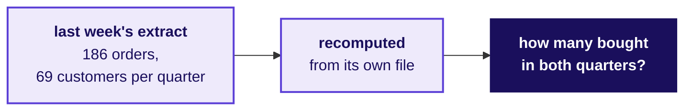
```mermaid
flowchart LR
    F["<b>last week's extract</b><br/>186 orders,<br/>69 customers per quarter"] --> R["<b>recomputed</b><br/>from its own file"]
    R --> B["<b>how many bought<br/>in both quarters?</b>"]
    classDef known fill:#EEEAFB,stroke:#5B3FD6,color:#1A0F5C,stroke-width:2px
    classDef bet fill:#1A0F5C,stroke:#1A0F5C,color:#FFFFFF
    class F,R known
    class B bet
```

**Question.** How many of the extract's 69 customers bought in both quarters? a) all 69; b) about half, 35; c) none, since each quarter held different customers; d) it cannot be counted from one file.

```notes
LIVE, 1 minute. Both columns of the comparison must come from a computation rather than from
memory, so last week's numbers are recomputed first. Letters, then the answer.
```

---

## S26. Answer: all 69, and last week's numbers hold
*Does last week's file still give last week's numbers?*

```stats
value: 186 | label: orders | note: 100 in Q1, 86 in Q2
value: Rs 1.90 cr to 1.87 cr | label: booked revenue | note: down 1.6%, as the note said
value: 69 of 69 | label: bought in both quarters | note: every customer, both times
```

The answer is a. The file reproduces what Meera was told, so the comparison starts from last week's numbers, recomputed.

```notes
LIVE, 2 minutes. Hold on "69 of 69": the room will need it in four slides. Then every leaf of both
sources, read as a change.
```

---

## S27. Question: how many other leaves agree within a point?
*Revenue fell 1.6 percent in both sources: how many of the other four leaves agree to within a point?*

```sql
SELECT quarter, count(DISTINCT customer_id) AS customers,
       count(*) AS orders, sum(amount) AS revenue
FROM   orders GROUP BY quarter ORDER BY quarter;
```

**Question.** How many of the other four leaves agree to within a point? a) all four; b) two, orders and revenue per order; c) one; d) none, since the sources share no record.

```notes
LIVE, 1 minute. The four others are orders, customers, orders per customer and revenue per order.
Letters, then the answer.
```

---

## S28. Answer: two agree, and the customer leaves part
*Which leaves agree once each is read as a change from Q1 to Q2?*

| Leaf | Last week's extract | The warehouse | Gap, points |
|---|---|---|---|
| Revenue | -1.6% | -1.6% | 0.0 |
| Orders | -14.0% | -14.1% | -0.1 |
| Customers who bought | 0.0% | -7.0% | -7.0 |
| Orders per customer | -14.0% | -7.7% | +6.3 |
| Revenue per order | +14.4% | +14.6% | +0.1 |

The answer is b. Revenue, orders and revenue per order agree to within half a point; customers and orders per customer do not.

```notes
LIVE, 3 minutes. On the extract, customers held and each ordered 14.0 percent less often. On the
book, customers fell 7.0 percent, from 244 to 227, and each ordered 7.7 percent less often. Then
what a hurried analyst writes when the totals match.
```

---

## S29. The plausible wrong answer: customers held flat
*If the sheet copies last week's customer leaf because the totals matched, what does it say?*

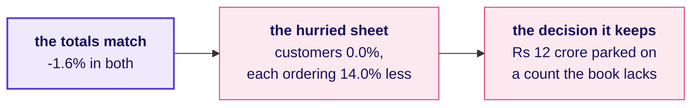
```mermaid
flowchart LR
    T["<b>the totals match</b><br/>-1.6% in both"] --> W["<b>the hurried sheet</b><br/>customers 0.0%,<br/>each ordering 14.0% less"]
    W --> D["<b>the decision it keeps</b><br/>Rs 12 crore parked on<br/>a count the book lacks"]
    classDef bad fill:#FBE9EF,stroke:#D63A6A,color:#1A0F5C
    classDef known fill:#EEEAFB,stroke:#5B3FD6,color:#1A0F5C,stroke-width:2px
    class T known
    class W,D bad
```

**What breaks.** "The warehouse confirms last week" carries last week's branch story onto the book, because one leaf matched.

```notes
LIVE, 2 minutes. Ask how many would have stopped at the totals. Most would; a matching total feels
like confirmation. Then why it is wrong, and the count that exposes it.
```

---

## S30. Why it is wrong: two trees multiply to one 0.984
*How can the totals agree while the branches disagree?*

| Source | Customers | Orders per customer | Revenue per order | Product |
|---|---|---|---|---|
| Last week's extract | 1.000 | 0.860 | 1.144 | 0.984 |
| The warehouse | 0.930 | 0.923 | 1.146 | 0.984 |

**The check.** Count who bought in both quarters: 69 of 69 in the extract, 170 of 301 in the book. The extract held only customers present in both quarters, so its customer count could not fall.

```notes
LIVE, 4 minutes. Each ratio is Q2 over Q1. A total is a product of branches, and different
branches can multiply to the same product, so a matching total is one leaf matching. The fix: the
sheet carries the book's own leaves, 244 to 227 customers, down 7.0 percent, and orders per
customer down 7.7 percent. 131 of the book's 301 customers bought in only one quarter. Then the
same change reached a second way.
```

---

## S31. A second route: 244 less 74, plus 57, is 227
*Where did the book's 17 fewer Q2 customers come from?*

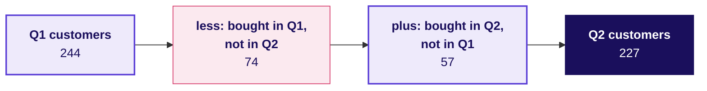
```mermaid
flowchart LR
    A["<b>Q1 customers</b><br/>244"] --> B["<b>less: bought in Q1,<br/>not in Q2</b><br/>74"]
    B --> C["<b>plus: bought in Q2,<br/>not in Q1</b><br/>57"]
    C --> D["<b>Q2 customers</b><br/>227"]
    classDef known fill:#EEEAFB,stroke:#5B3FD6,color:#1A0F5C,stroke-width:2px
    classDef bad fill:#FBE9EF,stroke:#D63A6A,color:#1A0F5C
    classDef bet fill:#1A0F5C,stroke:#1A0F5C,color:#FFFFFF
    class A known
    class B bad
    class C known
    class D bet
```

The first route subtracted two distinct counts. This one builds the change from each customer's own history, one row per customer filtered with HAVING, and lands on the same 227. The net fall of 17 hides 131 customers moving.

```notes
LIVE, 4 minutes. The query behind the 74: one row per customer, kept when the customer's latest
quarter is Q1, which is HAVING max(quarter) = 'Q1'. HAVING tests each customer's group after it is
formed, which WHERE cannot do, since WHERE sees one order at a time. When to switch: the
subtraction is quicker, and the bridge is what a stakeholder needs when the net number hides
movement. Then the line for Anand's sheet.
```

---

## S32. Question: which line goes under the customer leaf?
*What should Anand's sheet say about last week's note?*

**Question.** Which line belongs on the sheet? a) "The warehouse confirms last week: revenue fell 1.6 percent in both."; b) "On the whole book, 7.0 percent fewer customers bought in Q2, and each ordered 7.7 percent less often; last week's extract held only customers who bought in both quarters."; c) "Last week's note was wrong, so the Rs 12 crore request should be approved."; d) nothing, since the revenue leaf agrees.

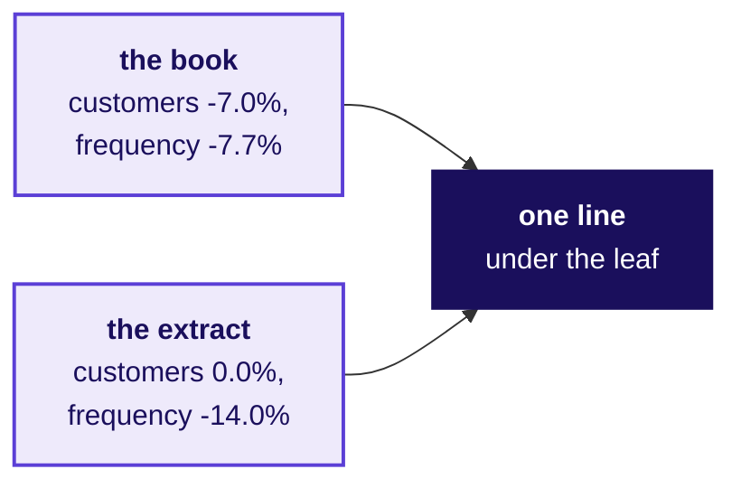
```mermaid
flowchart LR
    B["<b>the book</b><br/>customers -7.0%,<br/>frequency -7.7%"] --> L["<b>one line</b><br/>under the leaf"]
    E["<b>the extract</b><br/>customers 0.0%,<br/>frequency -14.0%"] --> L
    classDef known fill:#EEEAFB,stroke:#5B3FD6,color:#1A0F5C,stroke-width:2px
    classDef bet fill:#1A0F5C,stroke:#1A0F5C,color:#FFFFFF
    class B,E known
    class L bet
```

```notes
LIVE, 1 minute. Letters. Expect a from anyone keen to reassure Anand, and c from anyone keen to
show the error mattered. Then the answer.
```

---

## S33. Answer: fewer bought, and each bought less often
*So does the warehouse tell the same story as the file Meera's decision rested on?*

| The question on the way | The answer |
|---|---|
| 1. Compare how? | Every leaf as a change; no shared id |
| 2. Last week intact? | Yes: 186 orders, all 69 in both quarters |
| 3. Which leaves agree? | Revenue, orders, revenue per order |
| 4. Customers too? | No: flat there, down 7.0% on the book |
| 5. Where did 17 go? | 74 left after Q1; 57 arrived in Q2 |
| 6. What goes on the sheet? | Both branches fell, and why |

**Kavya's review.** When two sources disagree, say which one is the book and put the difference in the line under the number.

**In the interview.** [D] Two analysts report different customer counts for one quarter; how do you settle it?

```notes
LIVE, 2 minutes. The answer is b: it names both falling branches and why the extract could not
show the first. Option c goes further than one chapter's evidence, and d leaves Meera deciding on a
story the book does not tell. The interview answer in one breath: put the two definitions side by
side before the two numbers, recompute both from the source of record, agree which definition
answers the question, and store that query. The follow-up, [F] "your total matches last week's;
is your analysis the same?", is answered by slide S30's two trees. Kavya's longer version: set every
leaf beside its twin before you say two sources agree. Then chapter 3: which segment carries each
branch?
```

---

## SECTION 3: Which segment moved?
*Which segment carried the fall from Q1 to Q2, and how often did its customers order?*

```notes
LIVE. Thirty minutes: the need and the company (3), the options and the call (4), the GROUP BY
error (2), the eight rows (5), the thin groups with HAVING (4), the trap and its fix (8, never
cut), the second route (2) and the close (2). Notebook 3 and
sql/C2_W02_D01_03_which_segment_STUDENT.sql run beside it. The break follows this chapter.
```

---

## S34. Answered in five questions, before the budget moves
*Who needs this answer, and which questions lead to it?*

**Who needs the answer.** Anand's sheet carries one line per segment, and the head of Retail-Plus, who owns the paid membership tier, reads that line to decide which members the team works to keep. A wrong frequency sends the retention budget to the wrong segment.

```timeline
label: 1 | title: One query or four? | body: Per segment, grouped, or pandas
label: 2 | title: What did each book? | body: Orders, customers, rupees per quarter
label: 3 | title: Which are too thin? | body: Groups of under 30 customers
label: 4 | title: How often? | body: Orders per customer, per segment
label: 5 | title: Another way? | body: Each customer's own count, averaged | tone: dark
```

```notes
LIVE, 1 minute. Read the five questions. Then the need.
```

---

## S35. The need: one line per segment, and a budget
*Who asks, what is measured, and what does a wrong line cost?*

```cards
icon: user | eyebrow: Who asks | title: The head of Retail-Plus | body: Reads the tier's line on Anand's sheet and decides whom the team works to keep.
icon: chart-line | eyebrow: The metric | title: Orders per customer | body: Orders in the quarter over the customers who bought in it, per segment.
icon: triangle-alert | eyebrow: A wrong ratio costs | title: The budget misfires | body: A tier that seems to order half as often gets an emergency plan, and a segment that seems to double gets money it does not need. | tone: dark
```

```notes
LIVE, 2 minutes. Kalpa sells to four segments: Business (corporate buyers, orders worth lakhs),
Retail-Core (everyday shoppers), Retail-Plus (the paid membership tier) and Student. The segment
lives on the customer table, so each order looks it up with one line,
JOIN customers c USING (customer_id). Joins are tomorrow's topic; today the line is only that
lookup, and since each order has one customer it changes no row count. Then a company whose total
hid three stories.
```

---

## S36. Eternal: one 54% total held three stories
*Has a real company reported a group total that hid very different parts?*

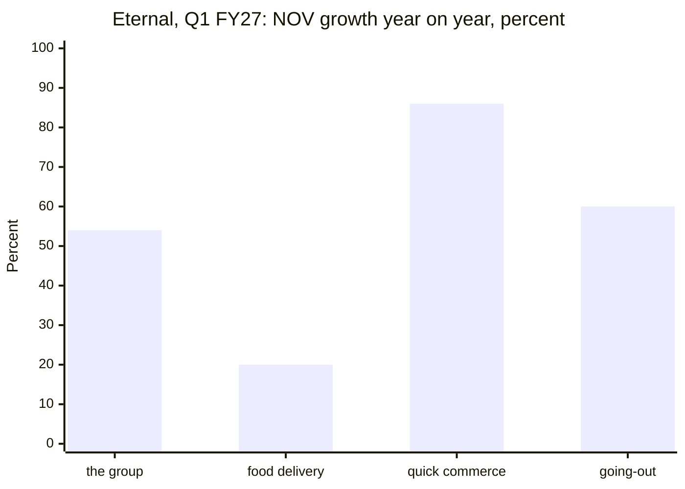
```mermaid
xychart-beta
    title "Eternal, Q1 FY27: NOV growth year on year, percent"
    x-axis ["the group", "food delivery", "quick commerce", "going-out"]
    y-axis "Percent" 0 --> 100
    bar [54, 20, 86, 60]
```

Eternal, the company behind Zomato and Blinkit, grew its consumer businesses' net order value 54 percent in the quarter to 30 June 2026, and its letter told each business's number on its own. Kalpa's 1.6 percent is four stories.

```notes
LIVE, 1 minute. Net order value is the value of orders placed through the platforms. Eternal's
shareholders' letter for Q1 FY27 (22 July 2026) gives the group's 54 percent beside food delivery
at a little over 20 percent, quick commerce at 86 and going-out at 60. Source and check date are
in the day's provenance. Then four ways to put every segment on the sheet.
```

---

## S37. One GROUP BY: one query, and new segments appear
*One query per segment, one grouped query, or pandas?*

| Option | Queries to keep | Rows it moves | When a fifth segment appears |
|---|---|---|---|
| A. One query per segment, with WHERE | 4 | 8 | It is silently missing: no query asks for it |
| B. One query, GROUP BY segment and quarter | 1 | 8 | It appears as two new rows |
| C. Every order row into pandas | 1 and a Python step | 1,000 | It appears, on a copy of the book |
| D. One wide row per segment | 1 | 4 | It appears, and every new measure adds two columns |

**The call.** B. **What would change it:** a one-off question about one segment, such as the head of Retail-Plus asking about the tier alone, is A's job, and one WHERE is the clearest way to write it.

```notes
LIVE, 4 minutes. Sized in notebook 3 on this warehouse, which holds four segments. A needs four
queries kept correct and forgets a fifth segment; C moves every order to do what the database
does in one pass; D is the easiest to read and the hardest to extend. Then the first try, which
Postgres refuses.
```

---

## S38. The GROUP BY error, read in two minutes
*Why does Postgres refuse to print a segment it was not told to group by?*

```sql
SELECT c.segment, o.quarter, count(*) AS orders
FROM   orders o JOIN customers c USING (customer_id)
GROUP  BY o.quarter;
-- ERROR: column "c.segment" must appear in the GROUP BY
-- clause or be used in an aggregate function
```

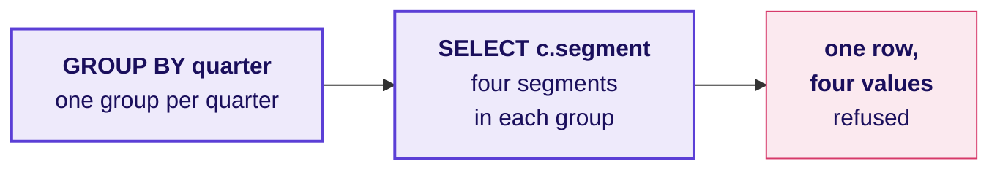
```mermaid
flowchart LR
    G["<b>GROUP BY quarter</b><br/>one group per quarter"] --> S["<b>SELECT c.segment</b><br/>four segments<br/>in each group"]
    S --> E["<b>one row,<br/>four values</b><br/>refused"]
    classDef known fill:#EEEAFB,stroke:#5B3FD6,color:#1A0F5C,stroke-width:2px
    classDef bad fill:#FBE9EF,stroke:#D63A6A,color:#1A0F5C
    class G,S known
    class E bad
```

```notes
LIVE, 2 minutes, never cut, never longer. Read the last line of the error aloud. In the order a
query runs, GROUP BY forms the groups before SELECT picks the columns, so each quarter's group
holds four segments, and SELECT has four values to print on one row. Two fixes: group by the
segment too, or put it inside an aggregate such as min(c.segment). The first is what the question
asks for. Then how many rows the fixed query returns.
```

---

## S39. Question: how many rows does the fixed query return?
*With GROUP BY c.segment, o.quarter, how many rows come back?*

```sql
SELECT c.segment, o.quarter, count(*) AS orders,
       count(DISTINCT o.customer_id) AS customers,
       sum(o.amount) AS revenue
FROM   orders o JOIN customers c USING (customer_id)
GROUP  BY c.segment, o.quarter ORDER BY c.segment, o.quarter;
```

**Question.** How many rows? a) 2, one per quarter; b) 4, one per segment; c) 8, one per segment and quarter; d) 1,000, one per order.

```notes
LIVE, 1 minute. Letters, then run it.
```

---

## S40. Answer: 8 rows; Retail-Plus lost 29.4 percent
*How many orders, customers and rupees did each segment book in each quarter?*

| Segment | Q1 orders, customers | Q2 orders, customers | Revenue, Q1 to Q2 | Change |
|---|---|---|---|---|
| Business | 97, 36 | 91, 35 | Rs 9,90,14,440 to Rs 9,75,84,600 | -1.4% |
| Retail-Core | 199, 102 | 193, 96 | Rs 3,73,070 to Rs 3,66,250 | -1.8% |
| Retail-Plus | 215, 91 | 140, 76 | Rs 5,85,770 to Rs 4,13,380 | -29.4% |
| Student | 27, 15 | 38, 20 | Rs 26,720 to Rs 35,770 | +33.9% |

The answer is c. Retail-Plus lost 75 of the book's 76 fewer orders and 29.4 percent of its revenue.

```notes
LIVE, 4 minutes. Business books 99 percent of the rupees, so it carries Rs 14,29,840 of the
Rs 16,00,000 fall on only 6 fewer orders, a 1.4 percent dip, and the total hides Retail-Plus
entirely. The check: the four segments' orders add back to 538 and 462. Then which rows are too
thin to quote a rate on.
```

---

## S41. HAVING flags Student: 15 and 20 customers
*Which segment-quarters hold too few customers to quote a rate on?*

```sql
SELECT c.segment, o.quarter, count(DISTINCT o.customer_id) AS customers
FROM   orders o JOIN customers c USING (customer_id)
GROUP  BY c.segment, o.quarter
HAVING count(DISTINCT o.customer_id) < 30;
```

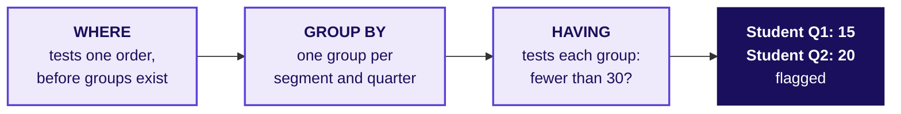
```mermaid
flowchart LR
    W["<b>WHERE</b><br/>tests one order,<br/>before groups exist"] --> G["<b>GROUP BY</b><br/>one group per<br/>segment and quarter"] --> H["<b>HAVING</b><br/>tests each group:<br/>fewer than 30?"]
    H --> R["<b>Student Q1: 15<br/>Student Q2: 20</b><br/>flagged"]
    classDef known fill:#EEEAFB,stroke:#5B3FD6,color:#1A0F5C,stroke-width:2px
    classDef bet fill:#1A0F5C,stroke:#1A0F5C,color:#FFFFFF
    class W,G,H known
    class R bet
```

```notes
LIVE, 4 minutes. Kavya's rule from Week 1: a rate built on fewer than 30 customers moves a long way
when one customer changes, so it goes on the sheet with a flag. The test is on a group, so it sits
in HAVING, which runs after the groups exist; WHERE runs before them and tests one order at a
time. Student's 33.9 percent rise goes on the sheet flagged. Business, with 36 and 35, clears the
bar. Then the next leaf: how often each segment's customers ordered.
```

---

## S42. Question: what does 215 / 91 print?
*Retail-Plus placed 215 orders from 91 customers in Q1 and 140 from 76 in Q2: what does the quickest query print?*

```sql
SELECT c.segment, o.quarter,
       count(*) / count(DISTINCT o.customer_id) AS orders_per_customer
FROM   orders o JOIN customers c USING (customer_id)
GROUP  BY c.segment, o.quarter ORDER BY c.segment, o.quarter;
```

**Question.** What does it print for Retail-Plus's two quarters? a) 2.36 and 1.84; b) 2 and 1; c) 2.4 and 1.8; d) an error, since a count cannot be divided.

```notes
LIVE, 1 minute. Letters. Most say a, because a calculator would. Then run it.
```

---

## S43. Answer: 2 then 1, so the sheet says "halved"
*What does the integer answer tell the head of Retail-Plus to do?*

| Segment | Q1 | Q2 | What the sheet would say |
|---|---|---|---|
| Business | 2 | 2 | No change |
| Retail-Core | 1 | 2 | Frequency doubled |
| Retail-Plus | 2 | 1 | Frequency halved |
| Student | 1 | 1 | No change |

**What breaks.** The head of Retail-Plus sees an emergency, and the retention budget drifts to Retail-Core, whose customers seem to order twice as often. The answer is b.

```notes
LIVE, 2 minutes. This is the plausible wrong answer: the query runs, every number is a whole
number a reader might accept as "about two", and the decisions it drives are both wrong. Then why.
```

---

## S44. Why it is wrong: whole numbers divide as whole numbers
*Why did the division drop the fraction, and which check catches it?*

| Segment and quarter | Ratio printed | Customers | Ratio x customers | Orders |
|---|---|---|---|---|
| Retail-Plus Q1 | 2 | 91 | 182 | 215 |
| Retail-Plus Q2 | 1 | 76 | 76 | 140 |
| Retail-Core Q1 | 1 | 102 | 102 | 199 |
| Retail-Core Q2 | 2 | 96 | 192 | 193 |

**The check.** Multiply a ratio back by what it divided by: 1 times 76 is 76, where the orders are 140. Counts are whole numbers, and Postgres divides two whole numbers as whole numbers, truncating towards zero.

```notes
LIVE, 3 minutes. The PostgreSQL documentation, mathematical functions: "for integral types,
division truncates the result towards zero", so 5 / 2 is 2. sum(amount) / count(*) in chapter 1 kept
its decimals because amount is stored as numeric. A spreadsheet stores every number as a
decimal, so 140 / 76 gives 1.84 whatever you typed, which is why the habit from Excel misleads
here. Then the fix.
```

---

## S45. The fix: numeric division, 2.36 to 1.84, down 22.0%
*How often did each segment's customers order, once the division keeps its decimals?*

```sql
round(count(*)::numeric
      / count(DISTINCT o.customer_id), 2)
  AS orders_per_customer
```

| Segment | Q1 | Q2 | Change | The integer query said |
|---|---|---|---|---|
| Business | 2.69 | 2.60 | -3.5% | 2 then 2 |
| Retail-Core | 1.95 | 2.01 | +3.0% | 1 then 2 |
| Retail-Plus | 2.36 | 1.84 | -22.0% | 2 then 1 |
| Student | 1.80 | 1.90 | +5.6% | 1 then 1 |

```notes
LIVE, 2 minutes. Cast one side to numeric, round on purpose to two places, and keep orders and
customers in the same row so anyone can multiply the ratio back. Retail-Plus fell 22.0 percent
where the integer query said 50, and Retail-Core rose 3.0 where it said 100; Student's 5.6 sits
on a flagged group. Each change is computed from the counts before rounding. Then a second route that never divides two counts.
```

---

## S46. A second route: each customer's own count, averaged
*Does the average of each customer's own order count agree with the division?*

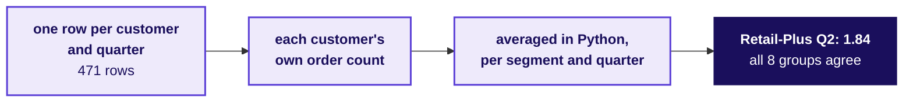
```mermaid
flowchart LR
    A["<b>one row per customer<br/>and quarter</b><br/>471 rows"] --> B["<b>each customer's<br/>own order count</b>"]
    B --> C["<b>averaged in Python,<br/>per segment and quarter</b>"]
    C --> D["<b>Retail-Plus Q2: 1.84</b><br/>all 8 groups agree"]
    classDef known fill:#EEEAFB,stroke:#5B3FD6,color:#1A0F5C,stroke-width:2px
    classDef bet fill:#1A0F5C,stroke:#1A0F5C,color:#FFFFFF
    class A,B,C known
    class D bet
```

If the division is right, the average of the individual counts must equal it, and in all eight segment-quarters it does, to two places.

```notes
LIVE, 2 minutes. The second route asks the warehouse for each customer's own number of orders
(471 rows, one per customer and quarter) and averages them in Python, so it cannot share the first
route's division. When to switch: the per-customer rows are what you want when the next question
is about the spread of customers, such as how many ordered once. Then the chapter's answer.
```

---

## S47. Retail-Plus carried the fall: 2.36 to 1.84 orders
*So which segment carried the fall from Q1 to Q2, and how often did its customers order?*

| The question on the way | The answer |
|---|---|
| 1. One query or four? | One GROUP BY: one query, eight rows, new segments appear |
| 2. What did each book? | Retail-Plus down 29.4%, 75 of the 76 fewer orders |
| 3. Which are too thin? | Student, with 15 and 20 customers |
| 4. How often? | Retail-Plus 2.36 then 1.84, down 22.0%; integers said 2 then 1 |
| 5. Another way? | Each customer's own count averages to the same eight ratios |

**Kavya's review.** Divide in numeric and round on purpose. Keep the counts beside every ratio, so anyone reading the sheet can multiply it back: a ratio that does not multiply back to its orders is a number nobody should sign.

**In the interview.** [F] Orders per customer reads 1 for a segment; what do you check first? [S] WHERE against HAVING, one sentence each. [S] Explain the logical order in which a SQL query runs.

```notes
LIVE, 2 minutes. WHERE against HAVING in one breath: WHERE keeps or drops rows before any group is
formed, so it can test one order; HAVING keeps or drops groups after they are formed, so it can
test count(DISTINCT customer_id) < 30. The chapter 3 set runs its first two items now if time
allows. Then the break, ten minutes. After it, chapter 4: which branch of each segment's tree
moved?
```

---

## SECTION 4: Which branch moved?
*Which branch of each segment's tree moved, and how much less did each Retail-Plus member spend?*

```notes
LIVE. Thirty minutes: the need and the company (3), the options and the call (5), the CTE
comparison (6), the branches (4), the trap, its check and its fix (9, never cut), the second route
(2) and the close (1). Notebook 4 and sql/C2_W02_D01_04_which_branch_STUDENT.sql run beside it.
```

---

## S48. Answered in four questions, before the tier's plan
*Who needs this answer, and which questions lead to it?*

**Who needs the answer.** Anand's analyst wants the quarter comparison as one query that reads from top to bottom, and the head of Retail-Plus decides how hard to work to keep the tier's members. An average that quietly leaves out members who stopped buying says the tier's spend per member fell 15.5 percent when it fell 29.4.

```timeline
label: 1 | title: Which way to write it? | body: Subqueries, named steps or temporary tables
label: 2 | title: Which branch moved? | body: Customers, frequency, order value
label: 3 | title: How much less each? | body: Spend per Retail-Plus member
label: 4 | title: Another count agree? | body: Members from the customer table | tone: dark
```

```notes
LIVE, 1 minute. Read the four questions. Then the need, in the head of Retail-Plus's words.
```

---

## S49. The need: how much less each member spent
*Who asks, what is measured, and what does a wrong average cost?*

> "How much less is each of my members spending, and is it fewer members buying or each one buying less?"
> The head of Retail-Plus, Kalpa Retail

```cards
icon: user | eyebrow: Who asks | title: The head of Retail-Plus | body: Sets how hard the team works to keep the tier's members next quarter.
icon: chart-line | eyebrow: The metric | title: Spend per member | body: The rupees a member spent in a quarter, averaged over the tier's members.
icon: triangle-alert | eyebrow: A wrong average costs | title: A light touch | body: A modest dip gets a light plan while the tier loses nearly a third of its spend. | tone: dark
```

```notes
LIVE, 2 minutes. Chapter 3 found Retail-Plus lost 29.4 percent of its revenue, from Rs 5,85,770 to
Rs 4,13,380, with orders per customer down from 2.36 to 1.84. This chapter splits that fall into
the tree's branches and prices it per member. Then how a team whose queries are read by others
writes them.
```

---

## S50. GitLab writes every query as named steps
*How does a real data team keep a query readable for the people who audit it?*

> "Prefer CTEs over sub-queries as CTEs make SQL more readable ..."
> GitLab handbook, SQL Style Guide

```cards
icon: list-ordered | eyebrow: The rule | title: One step, one job | body: Each named step should "perform a single, logical unit of work".
icon: message-square | eyebrow: The habit | title: Say what it does | body: A calculation carries "a brief description of what's going on".
```

```notes
LIVE, 1 minute. A CTE, a common table expression, is a named step written with WITH: the query
reads as a list of steps, each with a name and a one-line comment, and the last step reads the
ones above it. GitLab publishes the style guide its data team writes to; the sentence goes on
to call CTEs more performant, which is about GitLab's own warehouse, so on Postgres the reason to
name steps is the reader. Source and check date are in the day's provenance. Then three ways to write the comparison.
```

---

## S51. Named steps read top down and rerun anywhere
*Nested subqueries, named steps or temporary tables: which suits an audited suite?*

| Option | How the analyst reads it | Rows written into the warehouse | A rerun in a new session |
|---|---|---|---|
| A. Nested subqueries | From the innermost bracket outwards | 0 | Works |
| B. Named steps, WITH ... AS | From the top down, one named step at a time | 0 | Works |
| C. Temporary tables | Several statements, run in order | 4, for the session | UndefinedTable: the table is gone |

**The call.** B. **What would change it:** a step that many queries reuse over millions of rows in one long session is cheaper as a temporary table, computed once; that is a performance choice for the platform team, and Anand's suite is nowhere near it.

```notes
LIVE, 3 minutes. Notebook 4 runs option C: in the session that made it, the temporary table holds
four rows, one per segment; a new session, which is what the analyst opens, finds no such table.
Postgres drops a temporary table when its session ends. A and B are single statements, so the
analyst reruns exactly what the team ran; B also reads in the order the work happens. Then the
comparison as named steps.
```

---

## S52. Four named steps put Q1 beside Q2
*What does the comparison look like as named steps?*

```sql
WITH book AS (   -- step 1: each order with its segment
    SELECT o.customer_id, o.quarter, o.amount, c.segment
    FROM orders o JOIN customers c USING (customer_id)),
q1 AS (          -- step 2: Q1's leaves per segment
    SELECT segment, count(DISTINCT customer_id) AS customers,
           count(*) AS orders, sum(amount) AS revenue
    FROM book WHERE quarter = 'Q1' GROUP BY segment),
q2 AS (...)      -- step 3: the same for Q2
SELECT ...       -- step 4: each branch as Q2 over Q1
```

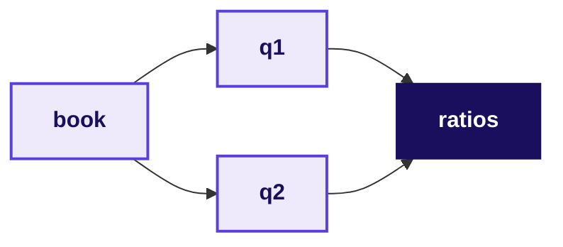
```mermaid
flowchart LR
    B["<b>book</b>"] --> Q1["<b>q1</b>"]
    B --> Q2["<b>q2</b>"]
    Q1 --> R["<b>ratios</b>"]
    Q2 --> R
    classDef known fill:#EEEAFB,stroke:#5B3FD6,color:#1A0F5C,stroke-width:2px
    classDef bet fill:#1A0F5C,stroke:#1A0F5C,color:#FFFFFF
    class B,Q1,Q2 known
    class R bet
```

```notes
LIVE, 6 minutes. Read it top down with the room: book, then q1 and q2, each reading book, then the
last step dividing Q2 by Q1 for each branch. q2 is q1 with 'Q2' in the WHERE. The last step sets
the two quarters side by side on the segment, which is the row's "two CTEs matched on segment";
each segment has one row in each, so nothing multiplies. Postgres works each step out once per
run and writes nothing into the warehouse. Then the prediction.
```

---

## S53. Question: which branch fell furthest in Retail-Plus?
*Customers, orders per customer or revenue per order: which moved most in Retail-Plus?*

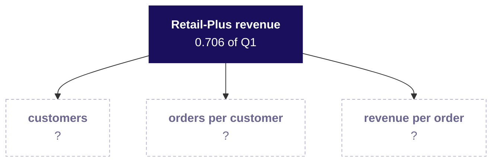
```mermaid
flowchart TB
    R["<b>Retail-Plus revenue</b><br/>0.706 of Q1"] --> C["<b>customers</b><br/>?"]
    R --> F["<b>orders per customer</b><br/>?"]
    R --> V["<b>revenue per order</b><br/>?"]
    classDef unknown fill:#FFFFFF,stroke:#B8B2D6,color:#6B6690,stroke-dasharray:4 3
    classDef bet fill:#1A0F5C,stroke:#1A0F5C,color:#FFFFFF
    class C,F,V unknown
    class R bet
```

**Question.** Which branch fell furthest? a) customers who bought; b) orders per customer; c) revenue per order; d) all three fell by the same amount.

```notes
LIVE, 1 minute. Letters, then run the named steps.
```

---

## S54. Answer: frequency, 0.780, and the three give 0.706
*How did customers, frequency and order value move in each segment?*

| Segment | Customers | Orders per customer | Revenue per order | Revenue |
|---|---|---|---|---|
| Business | 0.972 | 0.965 | 1.051 | 0.986 |
| Retail-Core | 0.941 | 1.030 | 1.012 | 0.982 |
| Retail-Plus | 0.835 | 0.780 | 1.084 | 0.706 |
| Student | 1.333 | 1.056 | 0.951 | 1.339 |

The answer is b. In Retail-Plus, customers fell 16.5 percent, orders per customer 22.0 percent, and revenue per order rose 8.4 percent; the three multiply back to 0.706, the 29.4 percent fall.

```notes
LIVE, 3 minutes. The check the query carries: in every segment the three branch ratios multiply
to the revenue ratio, within rounding, so the query checks itself. Frequency is the branch that
fell furthest; fewer members buying comes second. Then the head of Retail-Plus's own number.
```

---

## S55. The plausible wrong answer: members spent 15.5% less
*What does the quickest average of member spend tell the head of Retail-Plus?*

```sql
-- one row per Retail-Plus member:
sum(CASE WHEN o.quarter = 'Q1'
         THEN o.amount END) AS q1_spend,
sum(CASE WHEN o.quarter = 'Q2'
         THEN o.amount END) AS q2_spend
-- then, over those rows:
avg(q1_spend), avg(q2_spend)
```

```stats
value: Rs 6,437 | label: Q1 average member | note: the quick query
value: Rs 5,439 | label: Q2 average member | note: down 15.5%
value: +4.3% | label: Retail-Core | note: the same query says members spent more
```

**What breaks.** The head of Retail-Plus reads a modest dip and plans a light touch, and the sheet says Retail-Core and Business members each spent more in Q2.

```notes
LIVE, 3 minutes. The full query is block c4_member_spend_hurried in notebook 4's SQL file: one
row per member built with a CASE per quarter, then avg of each column. The same average says
Business +1.4 and Student +0.4. Ask whether anything about
the query looks wrong. Usually nothing does: one row per member, a CASE per quarter, avg of each
column. Then what the average left out.
```

---

## S56. Why it is wrong: avg skipped 31 members who stopped
*Who is inside each average, and which check shows it?*

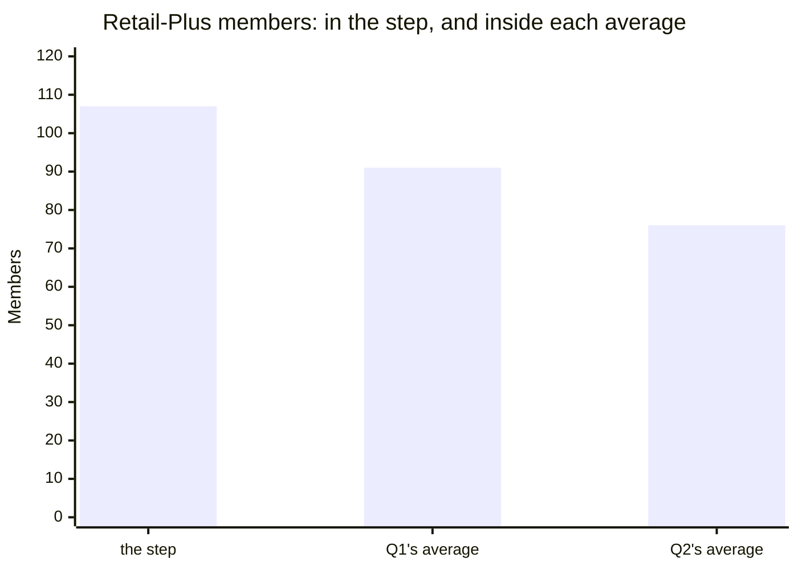
```mermaid
xychart-beta
    title "Retail-Plus members: in the step, and inside each average"
    x-axis ["the step", "Q1's average", "Q2's average"]
    y-axis "Members" 0 --> 120
    bar [107, 91, 76]
```

**The check.** Count who is inside each average: 107 members in the step, 91 inside Q1's and 76 inside Q2's. A CASE with no ELSE gives NULL for a member with no order that quarter, and avg averages only the values present, so Q1 and Q2 are averaged over two different groups of people.

```notes
LIVE, 3 minutes. The PostgreSQL documentation on aggregates: avg "computes the average (arithmetic
mean) of all the non-null input values". The 31 members who bought in Q1 and stopped are out of
Q2's average, which is the fall the head of Retail-Plus most needs to see. The warehouse has no
missing values in any column; these NULLs are made by the query. The mechanism on three invented
values, 100, a missing value and 200: avg gives 150, avg(coalesce(x, 0)) gives 100, count(*) sees
3 rows and count(x) 2 values. Then the fix.
```

---

## S57. The fix: Rs 0 on purpose, and the fall is 29.4%
*How much less did each Retail-Plus member spend, over the same members in both quarters?*

```sql
coalesce(sum(CASE WHEN o.quarter = 'Q2' THEN o.amount END), 0)
    AS q2_spend   -- a member who bought nothing spent Rs 0
```

| Segment | The quick average, Q1 to Q2 | Rs 0 said on purpose, Q1 to Q2 |
|---|---|---|
| Business | +1.4% | -1.4% |
| Retail-Core | +4.3% | -1.8% |
| Retail-Plus | -15.5% | -29.4% |
| Student | +0.4% | +33.9%, on 24 members |

Over the same 107 members, a Retail-Plus member spent Rs 5,474 in Q1 and Rs 3,863 in Q2: down 29.4 percent, nearly twice the quick 15.5.

```notes
LIVE, 3 minutes. A member who bought nothing in a quarter spent Rs 0 in it, so the query says so
with coalesce, and both averages cover the same people. Two segments flip from a rise to a fall.
Student rises on 24 members, a group chapter 3 flagged as too thin for a rate. Then a second route
with a different set of members.
```

---

## S58. A second route: over 120 members, the same 29.4%
*Does a member count taken from the customer table give the same change?*

```stats
value: 120 | label: members on the tier's book | note: counted from the customer table
value: Rs 4,881 | label: Q1 spend per member | note: Rs 5,85,770 over 120
value: Rs 3,445 | label: Q2 spend per member | note: Rs 4,13,380 over 120, down 29.4%
```

This route never averages: it divides each quarter's Retail-Plus revenue by every member on the tier's book, bought or not, counted in a subquery. Its levels differ from the 107-member route; its change is the same, because both keep one fixed group of members.

```notes
LIVE, 2 minutes. Any fixed group of members gives the same change; only an average whose members
change between quarters gives a different one. When to switch: the tier's 120 is the right base
when the head of Retail-Plus asks about the whole tier, including members who never bought; the
107 is right for members who bought in the half-year. Then the chapter's answer.
```

---

## S59. Frequency fell most; each member spent 29.4% less
*So which branch moved, and how much less did each Retail-Plus member spend?*

| The question on the way | The answer |
|---|---|
| 1. Which way to write it? | Named steps: read top down, one statement, rerun anywhere |
| 2. Which branch moved? | Retail-Plus frequency, 0.780; customers 0.835; order value 1.084 |
| 3. How much less each? | Rs 5,474 to Rs 3,863 over 107 members; the quick average said 15.5% |
| 4. Another count agree? | Rs 4,881 to Rs 3,445 over 120 members: the same 29.4% |

**Kavya's review.** Write the count of members beside every average, so the reader sees that Q1 and Q2 are over the same people, and put the zero in on purpose where a member bought nothing.

**In the interview.** [F] An average moved but the total did not, or moved differently; how? [F] When would you use a CTE instead of a subquery?

```notes
LIVE, 1 minute. The average answer in one breath: the denominator changed. avg counts only the
values present, so if a quarter's missing values stand for members who bought nothing, those
members drop out of that quarter's average. Count the rows inside the average beside count(*),
decide what a missing value means, and say it with coalesce. Then chapter 5: every number is
built, so does the suite add up?
```

---

## SECTION 5: Does the suite add up?
*Do the suite's numbers add up the way Anand's analyst will add them?*

```notes
LIVE. Thirty minutes: the need and the company (3), the options and the call (4), the first
tie-out (5), the trap, its check and its fix (10, never cut), the second route (5) and the close
(3). Notebook 5 and sql/C2_W02_D01_05_does_it_add_up_STUDENT.sql run beside it.
```

---

## S60. Answered in four questions, before the analyst adds
*Who needs this answer, and which questions lead to it?*

**Who needs the answer.** Anand's analyst adds before reading any query: the segments against the book, the two quarters against the half-year. A half-year line showing more Retail-Plus customers than the tier has members fails the audit on sight, and every other number in the suite is doubted with it.

```timeline
label: 1 | title: How to get a half-year? | body: Four ways to the six-month column
label: 2 | title: Do segments add up? | body: Four segments against the book
label: 3 | title: How many in six months? | body: Retail-Plus customers, April to September
label: 4 | title: Does the overlap explain it? | body: Customers in both quarters | tone: dark
```

```notes
LIVE, 1 minute. Read the four questions. Then the need, in Anand's words.
```

---

## S61. The need: sums the analyst checks before reading
*Who asks, what is measured, and what does a sum that fails cost?*

> "My analyst will add your rows before reading a single query. If they do not add up, the suite does not reach me."
> Anand Iyer, finance controller, Kalpa Retail

```cards
icon: user | eyebrow: Who asks | title: Anand's analyst | body: Adds every column of the suite before trusting any line of it.
icon: chart-line | eyebrow: The metric | title: Customers in a window | body: Customers who bought, each counted once, per quarter and for the half-year, April to September 2026.
icon: triangle-alert | eyebrow: A sum that fails costs | title: The whole suite | body: One impossible line and every number is doubted; the members who bought nothing stay hidden. | tone: dark
```

```notes
LIVE, 2 minutes. The half-year is April to September 2026, both quarters together. Chapters 3 and
4 found Retail-Plus with 91 customers in Q1 and 76 in Q2, and the tier holds 120 members on
Kalpa's customer table. Then a company that counts people across four apps.
```

---

## S62. Meta counts a person once across four apps
*Has a real company had to count people who appear in more than one group?*

```stats
value: 3.58 billion | label: daily active people | note: on average, December 2025
value: 4 | label: apps counted together | note: Facebook, Instagram, Messenger, WhatsApp
value: 1 | label: count per person | note: however many of the apps they opened
```

Meta's annual report counts a person who opened any of its apps that day once, "counting such group of accounts as one person". Adding each app's daily users would count that person twice.

```notes
LIVE, 1 minute. Meta Platforms, Form 10-K for 2025: a daily active person is a logged-in user who
visited at least one of the family's products that day. Source and check date are in the day's
provenance. Then four ways to produce the half-year column.
```

---

## S63. Count the half-year from the orders, like a quarter
*How should the suite produce its half-year column?*

| Option | What it reads | What it assumes | What the analyst audits |
|---|---|---|---|
| A. Add each segment's two quarter rows | 8 rows | That every measure adds across quarters | One more step, a sum |
| B. Count the half-year from the orders | 1,000 rows | Nothing new: the quarter's definition, a wider window | The same query without the quarter |
| C. GROUPING SETS: quarters and half-year in one query | 1,000 rows, once | Nothing new, and one more feature to read | One query, a NULL quarter for the half-year |
| D. Report no half-year | 0 rows | That nobody wants one | Nothing, until someone adds by hand |

**The call.** B. On a book this size none costs a noticeable second; what separates them is what each assumes. **What would change it:** several windows at once, months, quarters and the half-year, make C worth its extra feature.

```notes
LIVE, 3 minutes. A reads 8 rows and B 1,000; the rows do not decide it here. B uses one definition
the analyst already audited for each quarter; A assumes every measure in the quarter rows can be
added. Hold that assumption: it is the trap. Then the first tie-out.
```

---

## S64. Question: will the four segments add to 244?
*Will the four segments' Q1 customers add up to the book's 244?*

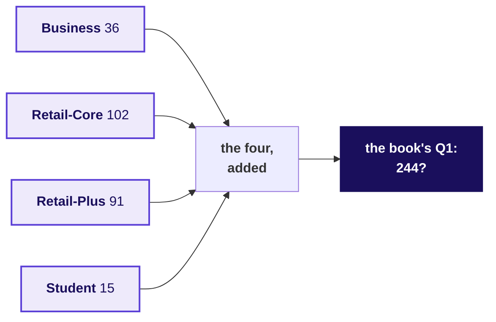
```mermaid
flowchart LR
    B["<b>Business</b> 36"] --> S["<b>the four,<br/>added</b>"]
    RC["<b>Retail-Core</b> 102"] --> S
    RP["<b>Retail-Plus</b> 91"] --> S
    ST["<b>Student</b> 15"] --> S
    S --> Q["<b>the book's Q1:<br/>244?</b>"]
    classDef known fill:#EEEAFB,stroke:#5B3FD6,color:#1A0F5C,stroke-width:2px
    classDef bet fill:#1A0F5C,stroke:#1A0F5C,color:#FFFFFF
    class B,RC,RP,ST known
    class Q bet
```

**Question.** Will they add to 244? a) yes, since each customer belongs to exactly one segment; b) no, the segments add to more than 244; c) no, they add to fewer; d) only orders and rupees can be added, never customers.

```notes
LIVE, 1 minute. Letters, then the tie-out query, which is three named steps: the segment rows, the
segments added, and the book's own totals beside them.
```

---

## S65. Answer: yes, each customer sits in one segment
*Do the segments add back to the book in each quarter?*

| Quarter | Orders, segments added | Orders, book | Customers, segments added | Customers, book | Rupees, both |
|---|---|---|---|---|---|
| Q1 | 538 | 538 | 244 | 244 | Rs 10,00,00,000 |
| Q2 | 462 | 462 | 227 | 227 | Rs 9,84,00,000 |

The answer is a. Customers add across segments because a customer belongs to one segment, so no customer sits in two of the rows being added.

```notes
LIVE, 3 minutes. 36 plus 102 plus 91 plus 15 is 244. The tie-out is itself a query the suite runs
every Monday, so the analyst's first check is already answered. Hold the reason: customers add
across groups a customer cannot share. Then the half-year, the quick way.
```

---

## S66. The plausible wrong answer: 167 Retail-Plus buyers
*What does the half-year line say when the two quarter rows are added?*

```stats
value: 167 | label: Retail-Plus customers | note: 91 plus 76, the half-year line
value: 471 | label: customers in the book | note: the four segments, added
value: Rs 5,983 | label: revenue per customer | note: Retail-Plus, over six months
```

**What breaks.** The orders (355) and rupees (Rs 9,99,150) in the same line are right, which makes the customer count look right beside them, and the head of Retail-Plus would read that every member was active.

```notes
LIVE, 3 minutes. The quick way is option A: the quarter rows already exist in a step, so a last
step sums each segment's two rows. Ask the room to check the line against anything they already
know. Then the check.
```

---

## S67. Why it is wrong: 167 buyers in a tier of 120
*Which check shows the added line cannot be true?*

```mermaid
xychart-beta
    title "Half-year customers, added, against members on the book"
    x-axis ["Business", "Retail-Core", "Retail-Plus", "Student"]
    y-axis "Customers" 0 --> 220
    bar [71, 198, 167, 35]
    line [40, 150, 120, 30]
```

**The check.** A count of customers who bought can never exceed the customers who exist: the added line runs over the members in every segment (the line marks the members). A customer who bought in both quarters sits in the Q1 row and in the Q2 row, so adding the rows counts them twice.

```notes
LIVE, 3 minutes. Business 71 of 40, Retail-Core 198 of 150, Retail-Plus 167 of 120, Student 35 of
30. Orders and rupees add across quarters, because an order belongs to one quarter; customers add
only across groups a customer cannot share, such as segments. Then the fix.
```

---

## S68. The fix: 107 bought once or more; 13 bought nothing
*How many Retail-Plus customers bought in the half-year, each counted once?*

```sql
SELECT c.segment, count(*) AS orders,
       count(DISTINCT o.customer_id) AS customers, sum(o.amount) AS revenue
FROM   orders o JOIN customers c USING (customer_id)
GROUP  BY c.segment ORDER BY c.segment;
```

| Segment | Added | Counted | Counted twice | Members on the book |
|---|---|---|---|---|
| Business | 71 | 39 | 32 | 40 |
| Retail-Core | 198 | 131 | 67 | 150 |
| Retail-Plus | 167 | 107 | 60 | 120 |
| Student | 35 | 24 | 11 | 30 |

```notes
LIVE, 2 minutes. The book's half-year holds 301 customers, the same 301 chapter 1 counted across
both quarters, not 471. Revenue per Retail-Plus customer over the half-year is Rs 9,338, not
Rs 5,983, and 13 of the tier's 120 members bought nothing all half-year, which the added line could
never show. Then the gap explained a second way.
```

---

## S69. Question: how many Retail-Plus buyers bought in both?
*Does the overlap between the two quarters explain the gap between 167 and 107?*

```mermaid
flowchart LR
    Q1["<b>Q1 buyers</b><br/>91"] --> O["<b>bought in<br/>both quarters</b><br/>?"]
    Q2["<b>Q2 buyers</b><br/>76"] --> O
    classDef known fill:#EEEAFB,stroke:#5B3FD6,color:#1A0F5C,stroke-width:2px
    classDef unknown fill:#FFFFFF,stroke:#B8B2D6,color:#6B6690,stroke-dasharray:4 3
    class Q1,Q2 known
    class O unknown
```

**Question.** How many Retail-Plus customers bought in both quarters? a) 16; b) 31; c) 60; d) 76.

```notes
LIVE, 1 minute. The second route builds the half-year from the quarters and the overlap: Q1's
customers, plus Q2's, less the customers who bought in both, since those are the ones counted
twice. The overlap comes from one row per customer with the number of quarters that customer
bought in. Letters first.
```

---

## S70. Answer: 60, and 91 plus 76 less 60 is 107
*Does the overlap explain the gap in every segment?*

| Segment | Q1 + Q2 less both | Counted directly |
|---|---|---|
| Business | 36 + 35 - 32 = 39 | 39 |
| Retail-Core | 102 + 96 - 67 = 131 | 131 |
| Retail-Plus | 91 + 76 - 60 = 107 | 107 |
| Student | 15 + 20 - 11 = 24 | 24 |

The answer is c. In every segment the customers counted twice are exactly the customers who bought in both quarters.

```notes
LIVE, 3 minutes. This route never counts the half-year directly; it counts each customer's
quarters and subtracts the overlap, so it cannot share the direct count's mistake. The same holds
for daily users added into a month. Notebook 5's depth section shows GROUPING SETS returning the
quarter rows and the half-year rows from one query, each counted from the orders. Then the
chapter's answer.
```

---

## S71. The suite adds up, and six months hold 107 buyers
*So do the suite's numbers add up the way Anand's analyst will add them?*

| The question on the way | The answer |
|---|---|
| 1. How to get a half-year? | Count it from the orders, the quarter's own definition |
| 2. Do segments add up? | Yes: 538 orders, Rs 10 crore and 244 customers in Q1 |
| 3. How many in six months? | 107 Retail-Plus customers, not the added 167 |
| 4. Does the overlap explain it? | Yes: 60 bought in both; 91 plus 76 less 60 is 107 |

**Kavya's review.** Before you add a column, ask whether one customer can sit in two of its rows. Orders and rupees add. People add only across groups they cannot share, so a half-year of customers is counted from the orders, never added from the quarters.

**In the interview.** [F] Why can you not add two quarters' customer counts to get the half-year's? [D] A stakeholder's analyst must audit your query; what changes in how you write it, and what would you refuse to compute in a notebook?

```notes
LIVE, 3 minutes. The design question in one breath: each number gets a named step and a comment
stating its question and definition, divisions are done in numeric and rounded on purpose, every
list is ordered on a unique key, the suite carries its own tie-outs, and the reported number is
never computed on an export in a notebook, because the analyst cannot rerun it on the book. After
lunch, chapter 6: will next Monday's run give the same answer?
```
