# The Monday numbers, from the warehouse

Week 2, Day 1. Half one.

Kicker: WEEK 2  ·  MONDAY  ·  HALF ONE
Quote: I want these numbers every Monday, for every segment and channel, computed from the warehouse itself. No notebooks, no exports, nothing a person can mistype.
Who: Anand Iyer, CFO, Kalpa Retail, to the data and AI team at Kalpa's Global Capability Centre

```notes
LIVE, one minute. Read Anand's words aloud and leave them up while the room settles. Last week
ended with Meera accepting "real, modest, fix frequency". This week the numbers move from files to
the warehouse, and every day is a harder version of Anand's request: today the tree as queries,
Tuesday booked against collected, Wednesday the top members and the running total, Thursday one
row per customer in pandas, Friday the leadership deck in Excel. Say the arc once and move on.
```

---

## SECTION 1: The ask
*The CFO wants last week's tree every Monday, from the warehouse, and an analyst who audits every line.*

```notes
LIVE. Twenty minutes: the ask, what it rules out, and the thinking drawn on the board before any
tool opens. No SQL is typed in this chapter.
```

---

## S1. Monday at the GCC: the ask moves to the warehouse
*Last week's note carried the growth review; this week the numbers have to run themselves.*

```stats
value: 1.6% | label: the fall, Q1 to Q2 | note: Week 1's reconciled number
value: every Monday | label: how often | note: for every segment and channel
value: 6 | label: queries | note: the Monday suite the analyst audits
value: 0 | label: exports | note: query it, do not export it
```

```notes
LIVE, 3 minutes. The stats row is the brief. Anand is the CFO of Kalpa Retail; his analyst will
read every query line by line without the team beside him. The data platform lead has given read
access to Postgres and one rule: query it, do not export it. Ask: which of these four numbers
changes how you work most? The zero exports, because every Week 1 step ran on a file.
```

---

## S2. What Anand wrote, and what the platform lead added
*Four questions in two messages, and each has a day this week.*

**The client asks.** "I want these numbers every Monday, for every segment and channel, computed from the warehouse itself. No notebooks, no exports, nothing a person can mistype."

> "The warehouse holds the orders and customers you cleaned last week, one thousand orders for the two quarters, already de-duplicated. Query it; do not export it." The data platform lead, Kalpa Retail

| What they asked | What it becomes for the team | Answered |
|---|---|---|
| Last week's tree as queries | The leaves per segment and quarter in SQL | Today |
| Readable enough to audit | Named steps, comments, an order on every list | Today |
| Which Python steps become one line | COUNT, SUM, GROUP BY, WHERE, a CTE | Today |
| Where SQL stops | Charts, tests and exploration stay in Python | Thursday |

```notes
LIVE, 3 minutes. Read both messages aloud. Separate the four questions and say when each gets
answered. The platform lead's "one thousand orders" is a claim the room checks in round 1; do not
comment on it now.
```

---

## S3. Question: what does "from the warehouse" rule out?
*Anand listed three things he never wants to see again.*

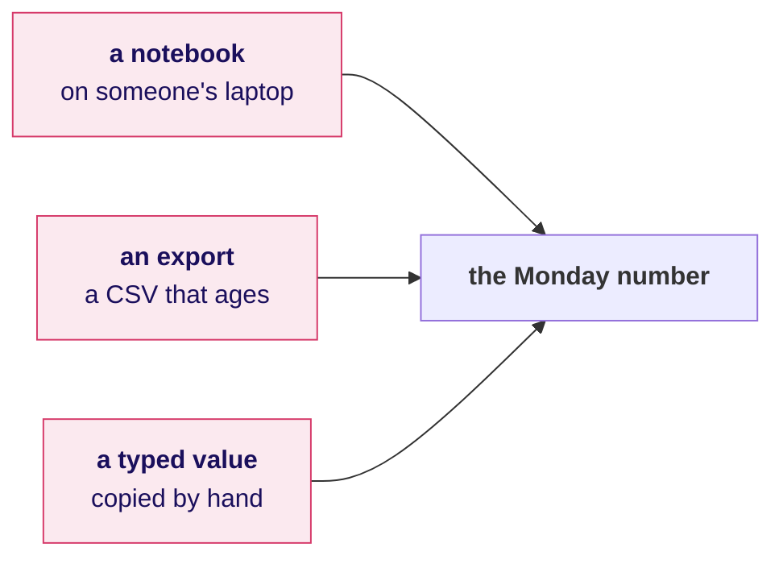
```mermaid
flowchart LR
    A["<b>a notebook</b><br/>on someone's laptop"] --> X["<b>the Monday number</b>"]
    B["<b>an export</b><br/>a CSV that ages"] --> X
    C["<b>a typed value</b><br/>copied by hand"] --> X
    classDef bad fill:#FBE9EF,stroke:#D63A6A,color:#1A0F5C
    class A,B,C bad
```

**Question.** Which of these does Anand's rule still allow? a) Exploring in a notebook, while the reported number comes from a saved query; b) exporting once a quarter to a shared drive; c) pasting the query's output into the sheet by hand; d) none of them, all analysis moves to SQL.

```notes
LIVE, 3 minutes. One minute in pairs, then letters. Expect d from the cautious and b from the
practical.
```

---

## S4. Answer: explore anywhere, report from the query
*The rule covers the number on the sheet; exploration still belongs in a notebook.*

| Option | Verdict | Why |
|---|---|---|
| a) Explore in a notebook, report from a saved query | Allowed | The reported number is rerun against the book every Monday |
| b) Export once a quarter | Ruled out | The export is stale the day it lands |
| c) Paste output by hand | Ruled out | A typed value leaves no trace |
| d) All analysis in SQL | Too far | Charts, tests and exploration are Python's job |

**Kavya's review.** The query is what we hand over; the notebook is where we think. Keep them apart and say which is which.

```notes
LIVE, 2 minutes. The answer is a. Option d sounds disciplined and would throw away every chart the
week needs. This slide is the interview answer to "why compute a KPI in the warehouse", which
returns at the end of round 1.
```

---

## S5. Every Week 1 step has a SQL counterpart
*Counting is COUNT, summing is SUM, per segment is GROUP BY, a filter is WHERE.*

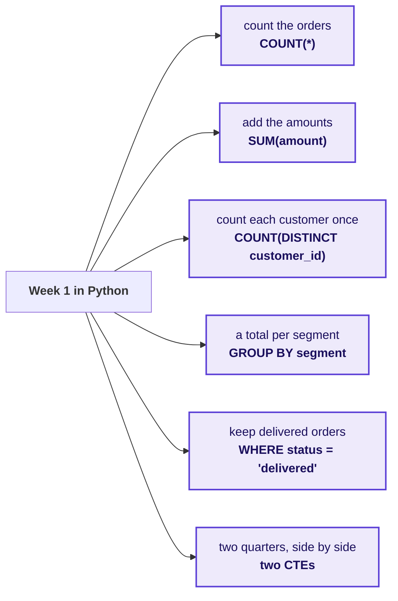
```mermaid
flowchart LR
    T["<b>Week 1 in Python</b>"] --> C["count the orders<br/><b>COUNT(*)</b>"]
    T --> S["add the amounts<br/><b>SUM(amount)</b>"]
    T --> D["count each customer once<br/><b>COUNT(DISTINCT customer_id)</b>"]
    T --> G["a total per segment<br/><b>GROUP BY segment</b>"]
    T --> W["keep delivered orders<br/><b>WHERE status = 'delivered'</b>"]
    T --> Q["two quarters, side by side<br/><b>two CTEs</b>"]
    classDef known fill:#EEEAFB,stroke:#5B3FD6,color:#1A0F5C,stroke-width:2px
    class C,S,D,G,W,Q known
```

The room knows every right answer from Week 1, so today's attention goes to the language.

```notes
LIVE, 3 minutes. Draw this on the board: last week's move on the left, its SQL on the right. The
contrast to say aloud: Tuesday's thirty-line profiler becomes three lines of SQL. Leave the board
drawing up all morning; each round ticks one row.
```

---

## S6. A query describes a result and runs in fixed order
*The database reads a query in a different order from the one it is written in.*

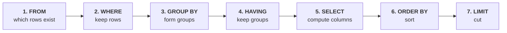
```mermaid
flowchart LR
    F["<b>1. FROM</b><br/>which rows exist"] --> W["<b>2. WHERE</b><br/>keep rows"] --> G["<b>3. GROUP BY</b><br/>form groups"] --> H["<b>4. HAVING</b><br/>keep groups"] --> S["<b>5. SELECT</b><br/>compute columns"] --> O["<b>6. ORDER BY</b><br/>sort"] --> L["<b>7. LIMIT</b><br/>cut"]
```

Written order: SELECT, FROM, WHERE, GROUP BY, HAVING, ORDER BY, LIMIT. Run order: the arrows.

```notes
LIVE, 3 minutes. Draw the seven boxes on the board and keep them there all day. Say: you write
what you want; the database decides how. The run order explains most errors a beginner meets, and
the analyst reads a query in this order whatever order it is written in. Do not teach each clause
now; each round lights one part.
```

---

## S7. One case, five rungs, each a harder question
*The day climbs from one number to the suite the analyst reruns every Monday.*

```timeline
label: Rung 1 | title: Is it the book? | body: The leaves re-answered in SQL and checked against Week 1.
label: Rung 2 | title: Per segment, per quarter | body: Eight rows of the same leaves, with honest division.
label: Rung 3 | title: Two quarters as named steps | body: Which branch moved, and an average that skips no one.
label: Rung 4 | title: The Monday suite | body: Six queries the analyst audits line by line. | tone: dark
label: Rung 5 | title: By channel | body: The same tree for every channel, in the practice lab.
```

```notes
LIVE, 3 minutes. Walk the rungs. The morning is rungs 1 to 3, the first hour of the afternoon is
rung 4, and the practice lab is rung 5. The IITGN block that closes the day is tentative; say it
once with that word and do not describe its content.
Transition: rung 1 opens with a connection.
```

---

## SECTION 2: Round 1, is it the book
*Before one number goes on Anand's sheet, the warehouse has to agree with what we already defended.*

```notes
LIVE. Fifty minutes: the question and its picture (5), first contact and every leaf against Week 1 (17),
the customer trap (10), the sample trap and the harder variant (13), Kavya's review (5).
Notebook: notebooks/C2_W02_D01_01_warehouse_STUDENT.ipynb. SQL: sql/C2_W02_D01_01_warehouse_STUDENT.sql.
```

---

## S8. The question: the warehouse against Week 1
*A new source that disagrees with the old one is the first thing to explain.*

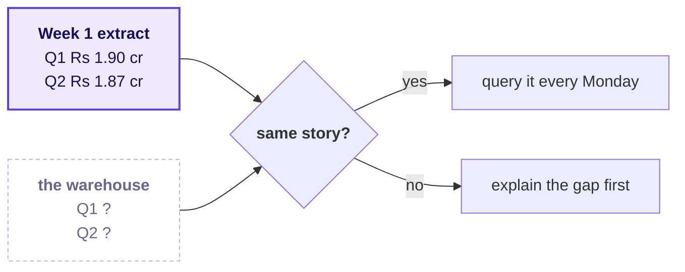
```mermaid
flowchart LR
    W1["<b>Week 1 extract</b><br/>Q1 Rs 1.90 cr<br/>Q2 Rs 1.87 cr"] --> C{"<b>same story?</b>"}
    WH["<b>the warehouse</b><br/>Q1 ?<br/>Q2 ?"] --> C
    C -->|"yes"| Y["query it every Monday"]
    C -->|"no"| N["explain the gap first"]
    classDef known fill:#EEEAFB,stroke:#5B3FD6,color:#1A0F5C,stroke-width:2px
    classDef unknown fill:#FFFFFF,stroke:#B8B2D6,color:#6B6690,stroke-dasharray:4 3
    class W1 known
    class WH unknown
```

**The client asks.** "Before your numbers go in my book, show me they match the ones you gave Meera."

```notes
LIVE, 2 minutes. Draw it. Ask what "the same story" should mean: the same totals, or the same fall?
Leave the question open; the demonstration answers it.
```

---

## S9. First contact: a live connection, a .sql file
*Connect from VS Code, open a .sql file, run one block, read the result grid.*

```timeline
label: Step 1 | title: Connect | body: The Postgres extension in VS Code, the Codespace's warehouse, database kalpa.
label: Step 2 | title: Open the file | body: sql/C2_W02_D01_01_warehouse_STUDENT.sql, one block per question.
label: Step 3 | title: Run one block | body: Cursor inside the block, run it, read the grid under the editor.
label: Step 4 | title: Read the schema | body: Seven tables; orders and customers carry today's tree. | tone: dark
```

The walkthrough is `whiteboards/C2_W02_D01_execution_order_STUDENT.md`, part one.

```notes
LIVE, 8 minutes, the only tool-setup time today. Everyone runs r1_tables. Anyone whose connection
fails pairs with a neighbour now and the support TA fixes it at the break; do not stop the room.
The notebooks run the same blocks, so a learner can follow in either.
```

---

## S10. SELECT, FROM, WHERE: one quarter's book
*Three clauses answer the first leaf: how much did Q1 book?*

```sql
-- The question: how many orders did Q1 book, and for how much? Booked means every status.
SELECT count(*) AS orders, sum(amount) AS revenue
FROM   orders
WHERE  quarter = 'Q1';
```

| Clause | What it does here |
|---|---|
| FROM orders | Every order row in the book |
| WHERE quarter = 'Q1' | Keeps the Q1 rows |
| SELECT count(*), sum(amount) | Counts and adds what survived |

```notes
LIVE, 4 minutes. Type it with the room. Point at the comment line: the analyst reads it first,
so it states the question and the definition. Then run the Q2 block beside it.
```

---

## S11. Question: what does the warehouse say for Q1?
*Week 1 reconciled Q1 to Rs 1,90,00,000 and Q2 to Rs 1,87,00,000.*

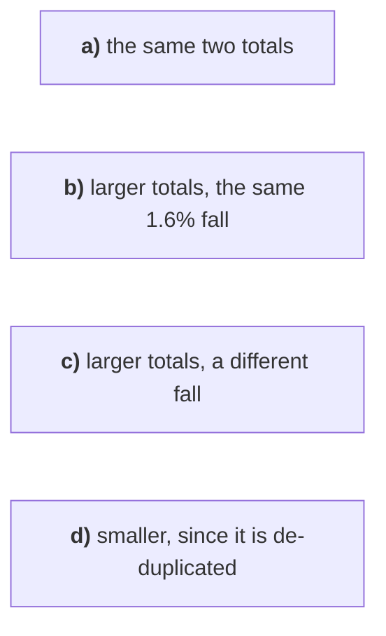
```mermaid
flowchart LR
    A["<b>a)</b> the same two totals"]
    B["<b>b)</b> larger totals, the same 1.6% fall"]
    C["<b>c)</b> larger totals, a different fall"]
    D["<b>d)</b> smaller, since it is de-duplicated"]
```

**Question.** Before you run the Q1 and Q2 blocks, which of these do you expect? Answer as a letter.

```notes
LIVE, 2 minutes. Letters first, then run both blocks.
```

---

## S12. Answer: five times the totals, the same fall
*One leaf agrees; the tree has eight more.*

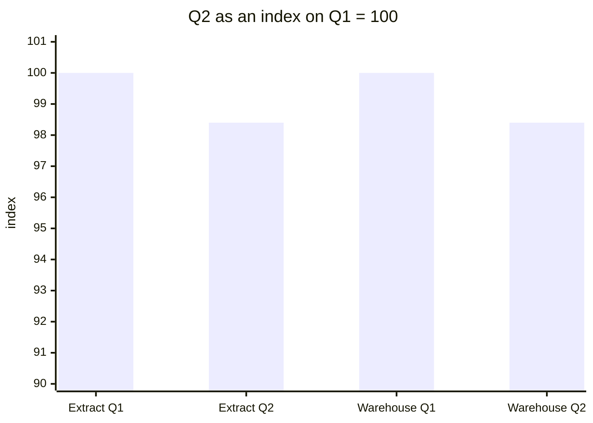
```mermaid
xychart-beta
    title "Q2 as an index on Q1 = 100"
    x-axis ["Extract Q1", "Extract Q2", "Warehouse Q1", "Warehouse Q2"]
    y-axis "index" 90 --> 101
    bar [100, 98.4, 100, 98.4]
```

Extract: Rs 1.90 crore to Rs 1.87 crore. Warehouse: Rs 10.00 crore to Rs 9.84 crore. Both fall 1.6 percent.

```notes
LIVE, 2 minutes. The answer is b. Last week's file held 186 cleaned orders; the warehouse holds
1,000. The fall agrees, and that is one leaf. Transition: so check every leaf.
```

---

## S12a. Every leaf against Week 1
*Three leaves agree; the customer leaves do not, and everything divided by customers follows them.*

| Leaf | Week 1 file | Warehouse | What explains it |
|---|---|---|---|
| Book revenue | 1.6% down | 1.6% down | The two agree. |
| Book revenue per order | 14.4% up | 14.6% up | The two agree. |
| Book customers | 69, flat | 244 to 227 | The files share no customer, and the warehouse is the record. |
| Book orders per customer | 14.0% down | 7.7% down | It follows the customer count. |
| Plus customers | 22, flat | 91 to 76 | The files share no member, and the warehouse is the record. |
| Plus orders per customer | 35.0% down | 22.0% down | It follows the customer count. |
| Plus orders | 35.0% down | 34.9% down | The two agree. |
| Plus revenue per order | 5.7% up | 8.4% up | No source explains it, and the warehouse is the record. |
| Plus revenue | 31.3% down | 29.4% down | It carries the order-value gap. |

```notes
LIVE, 3 minutes. Notebook 01, section 2, runs this table and proves the files share no order id
and no customer id. Read the three agreeing rows first, then the customer rows. Frequency is
orders over customers: orders fall by the same third in both, so fewer buyers means a smaller fall
per buyer. Where a source does not explain a gap, say that the numbers differ and that the
warehouse is the book of record; do not offer a reason.
```

---

## S12b. Retail-Plus, leaf by leaf
*The orders agree; the warehouse also shows members who stopped buying.*

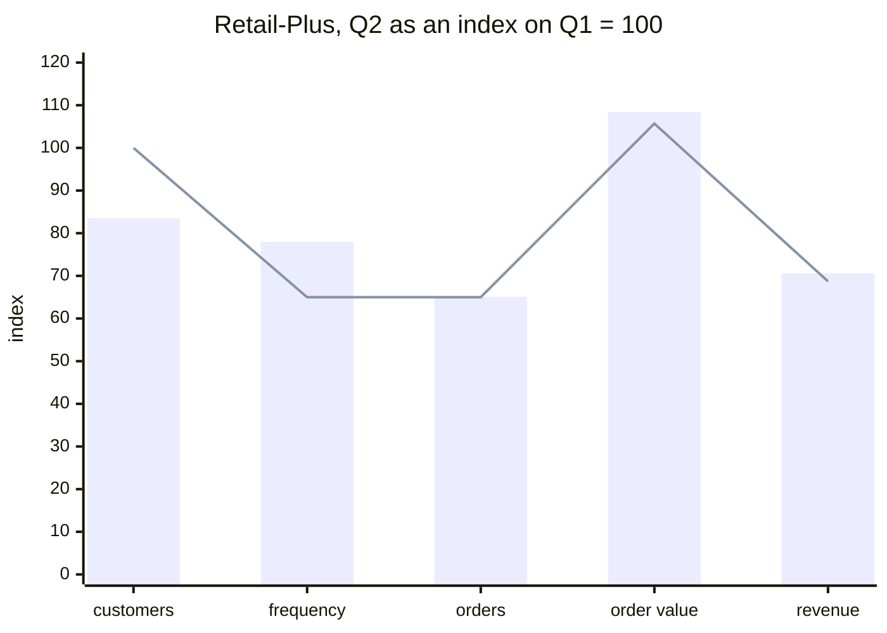
```mermaid
xychart-beta
    title "Retail-Plus, Q2 as an index on Q1 = 100"
    x-axis ["customers", "frequency", "orders", "order value", "revenue"]
    y-axis "index" 0 --> 120
    bar [83.5, 78.0, 65.1, 108.4, 70.6]
    line [100, 65.0, 65.0, 105.7, 68.7]
```

The bars are the warehouse and the line is Week 1's file. Fewer members bought, 91 to 76, and those who bought ordered less often.

```notes
LIVE, 1 minute. The finding Meera accepted survives in direction: Retail-Plus orders fell by a
third and its members ordered less often. The warehouse adds what the smaller file could not show,
members who bought nothing in Q2. Anand's sheet carries the warehouse's numbers and one line on
where they differ from last week's.
```

---

## S13. The plausible wrong answer: 1,000 customers
*The next leaf, asked the quickest way.*

```sql
SELECT count(*) AS customers FROM orders;
```

```stats
value: 1,000 | label: customers | note: the column's own label
value: 1,000 | label: orders | note: Q1 plus Q2
value: 1.00 | label: orders per customer | note: so nobody ever came back
```

On Anand's sheet this says every customer bought once: the frequency branch, the one Meera was told to fix, reads as if there were nothing to fix.

```notes
LIVE, 3 minutes. Run it and read the result as the hurried analyst would, straight-faced. Ask
whether anyone would sign it. Most hesitate at 1.00 because Week 1 said members come back.
```

---

## S14. Why it is wrong: count(*) counts rows
*A label is a promise the query does not keep; the database prints whatever name you give it.*

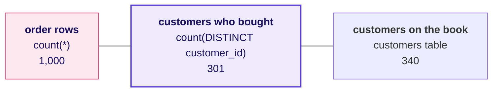
```mermaid
flowchart LR
    R["<b>order rows</b><br/>count(*)<br/>1,000"] --- B["<b>customers who bought</b><br/>count(DISTINCT customer_id)<br/>301"] --- K["<b>customers on the book</b><br/>customers table<br/>340"]
    classDef bad fill:#FBE9EF,stroke:#D63A6A,color:#1A0F5C
    classDef known fill:#EEEAFB,stroke:#5B3FD6,color:#1A0F5C,stroke-width:2px
    class R bad
    class B known
```

**The check.** Count the same table three ways, each named for what it counts (block `r1_customers_three`). The three numbers differ, so at most one of them is "customers".

```notes
LIVE, 3 minutes. Run r1_customers_three. Ask which of 301 and 340 belongs on Anand's sheet: 301
for orders per customer, because a customer who bought nothing places no orders; 340 answers how
many members Kalpa holds. The suite states which one it uses.
```

---

## S15. The fix: 301 customers, 3.32 orders each
*count(DISTINCT customer_id) counts each person once, and the frequency branch is back.*

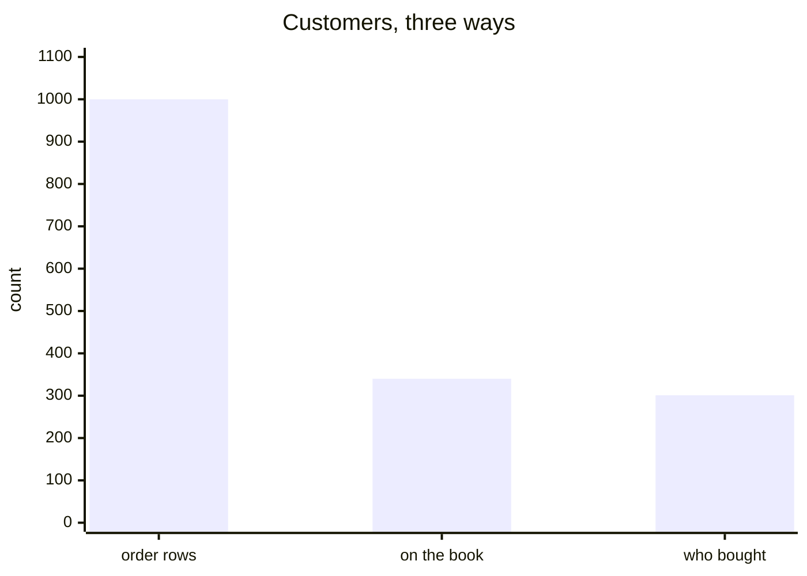
```mermaid
xychart-beta
    title "Customers, three ways"
    x-axis ["order rows", "on the book", "who bought"]
    y-axis "count" 0 --> 1100
    bar [1000, 340, 301]
```

**What changed.** 699 customers who do not exist leave the sheet, and orders per customer moves from 1.00 to 3.32 over the two quarters.

```notes
LIVE, 2 minutes. Say the fix in one line and the change in people. Week 1 met the same trap with
30 rows and 23 customers; the room should recognise it.
```

---

## S16. Question: which five does LIMIT 5 return?
*The analyst will trace five delivered Q2 app orders against the ERP, and rerun your query to get the same five.*

```sql
SELECT order_id, amount
FROM   orders
WHERE  quarter = 'Q2' AND channel = 'app' AND status = 'delivered'
LIMIT  5;
```

**Question.** Without ORDER BY, which five rows come back? a) The five smallest order ids; b) the five most recent; c) whichever five the database reaches first, which can change between runs; d) five at random every time.

```notes
LIVE, 2 minutes. Letters, then run r1_sample_hurried. Everyone in the room gets the same five
today, which is exactly why the trap survives: it looks stable.
```

---

## S17. Answer: whichever five it reaches first
*A reload rewrites two rows with identical values, and the same query returns a different five.*

| Run | The five orders | Their total |
|---|---|---|
| Yours, Monday | KR-00542, 544, 545, 546, 547 | Rs 3,900 |
| The analyst's, after the reload | KR-00545, 546, 547, 549, 553 | Rs 4,590 |

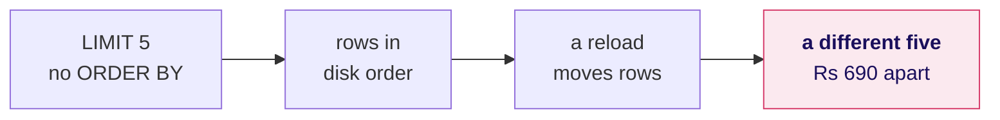
```mermaid
flowchart LR
    Q["LIMIT 5<br/>no ORDER BY"] --> D["rows in<br/>disk order"] --> R["a reload<br/>moves rows"] --> X["<b>a different five</b><br/>Rs 690 apart"]
    classDef bad fill:#FBE9EF,stroke:#D63A6A,color:#1A0F5C
    class X bad
```

```notes
LIVE, 4 minutes. The answer is c. Run r1_sample_after_reload: it updates two rows to the values
they already hold inside a transaction, reruns, and rolls back. No number in the book changed; the
audit still reports a Rs 690 disagreement. A table has no order.
```

---

## S18. The fix: order by a unique key, then limit
*The same five rows before and after the reload, so the analyst audits what you audited.*

```sql
SELECT order_id, amount
FROM   orders
WHERE  quarter = 'Q2' AND channel = 'app' AND status = 'delivered'
ORDER  BY order_id
LIMIT  5;
```

**The rule.** Every list on Anand's sheet carries an ORDER BY on a column, or a set of columns, that no two rows share. Ordering by amount alone still lets two equal amounts swap.

```notes
LIVE, 2 minutes. Run r1_sample_fixed. The notebook reruns it inside the reload and checks it is
identical. Wednesday returns to ties when the head of Retail-Plus wants a top fifty.
```

---

## S19. Your turn: the three readings of sales
*Week 1's readings, re-answered with one WHERE each.*

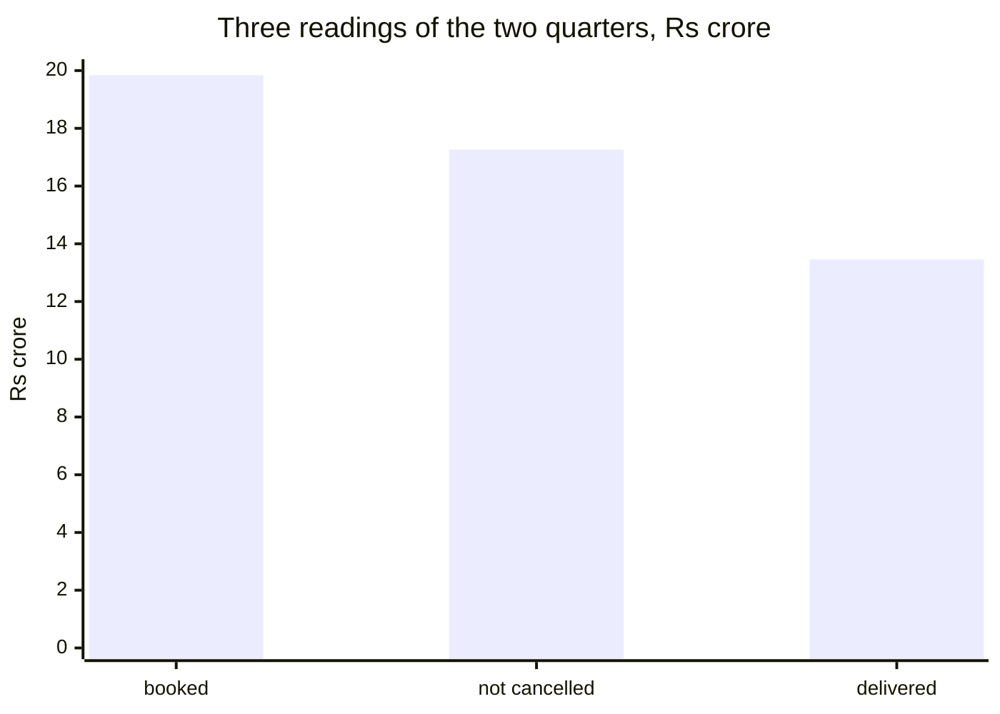
```mermaid
xychart-beta
    title "Three readings of the two quarters, Rs crore"
    x-axis ["booked", "not cancelled", "delivered"]
    y-axis "Rs crore" 0 --> 20
    bar [19.84, 17.26, 13.46]
```

**The harder variant.** Write the not-cancelled and delivered readings for each quarter, and say which one Anand's sheet uses and where the comment says so. Block `r1_readings` has the answer for both quarters together.

```notes
LIVE, 8 minutes of the room's own typing. The bars are r1_readings' three totals. The suite uses booked revenue, the definition Week 1 reconciled; the comment line
says so. Fast finishers compute the median order with percentile_cont (block r1_typical): the
mean is 79 times the median, and block r1_typical_rest shows it is still 66.5 times with the two
largest orders set aside, because Business orders average about Rs 8.84 lakh.
```

---

## S20. Round 1: the warehouse is the book
*It agrees with Week 1 on three leaves, differs on who bought, and is the book of record from today.*

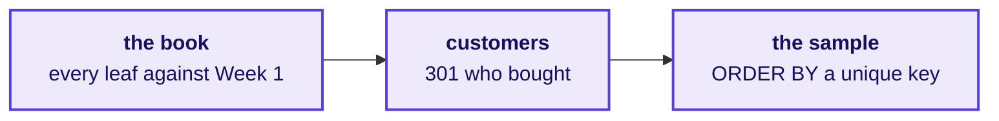
```mermaid
flowchart LR
    A["<b>the book</b><br/>every leaf against Week 1"] --> B["<b>customers</b><br/>301 who bought"] --> C["<b>the sample</b><br/>ORDER BY a unique key"]
    classDef known fill:#EEEAFB,stroke:#5B3FD6,color:#1A0F5C,stroke-width:2px
    class A,B,C known
```

**Kavya's review.** Every count says what it counts, and every list says how it is ordered. The comment above the query names both, because it is the first line the analyst reads.

**In the interview.** [F] What does LIMIT without ORDER BY return? [F] Why would you compute a KPI in the warehouse rather than in a notebook?

```notes
LIVE, 5 minutes. Ask the two questions aloud and take one answer each; the model answers are in
the notebook's "In the interview" section and in the day sheet. Tick the first row of the board.
```

---

## SECTION 3: Round 2, per segment
*Eight rows of the same leaves, one clause, and a ratio the database rounds without saying so.*

```notes
LIVE. Fifty minutes: GROUP BY and the run order (15), the GROUP BY error (2), the integer-division
trap (13), HAVING and the harder variant (15), Kavya's review (5).
Notebook: notebooks/C2_W02_D01_02_segments_STUDENT.ipynb. SQL: sql/C2_W02_D01_02_segments_STUDENT.sql.
```

---

## S21. The question: every leaf, every segment, both quarters
*Anand's sheet is the tree repeated for four segments and two quarters.*

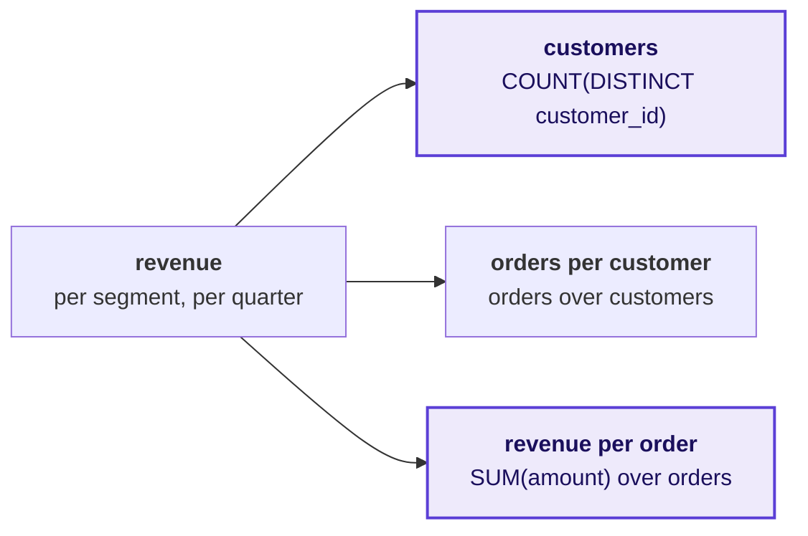
```mermaid
flowchart LR
    R["<b>revenue</b><br/>per segment, per quarter"] --> C["<b>customers</b><br/>COUNT(DISTINCT customer_id)"]
    R --> F["<b>orders per customer</b><br/>orders over customers"]
    R --> V["<b>revenue per order</b><br/>SUM(amount) over orders"]
    classDef known fill:#EEEAFB,stroke:#5B3FD6,color:#1A0F5C,stroke-width:2px
    class C,V known
```

**The client asks.** "Every segment. I do not want a total that hides which one moved."

```notes
LIVE, 2 minutes. The segment lives on the customer, so each order borrows it with one lookup line,
JOIN customers USING (customer_id). Each order has exactly one customer, so the row count stays
1,000; say that joins are tomorrow's day and move on.
```

---

## S22. GROUP BY: one row per group
*The thousand rows collapse into one row per quarter, and each aggregate runs inside its group.*

```sql
SELECT quarter, count(*) AS orders, sum(amount) AS revenue
FROM   orders
GROUP  BY quarter
ORDER  BY quarter;
```

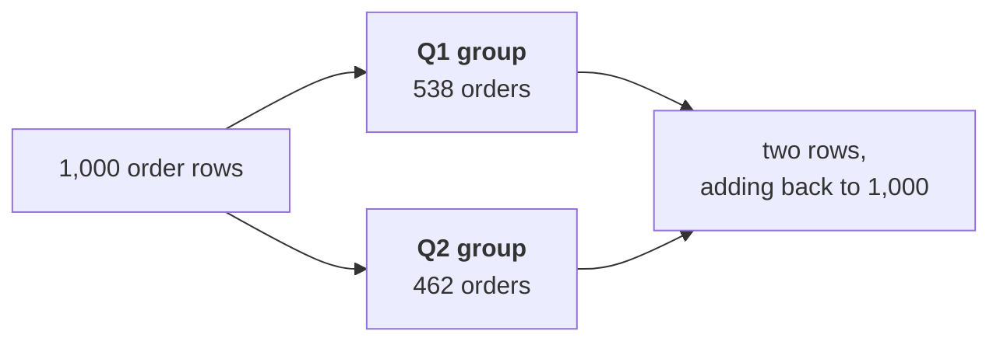
```mermaid
flowchart LR
    T["1,000 order rows"] --> G1["<b>Q1 group</b><br/>538 orders"]
    T --> G2["<b>Q2 group</b><br/>462 orders"]
    G1 --> S["two rows,<br/>adding back to 1,000"]
    G2 --> S
```

```notes
LIVE, 5 minutes. Predict the row count first: 2. Then the first check on any grouped result: the
groups add back to the table. A grouped result that does not add back has lost or doubled rows.
```

---

## S23. The error worth two minutes
*A column that is neither grouped nor aggregated has four values per group, so the database refuses.*

```sql
SELECT c.segment, o.quarter, count(*) AS orders
FROM   orders o JOIN customers c USING (customer_id)
GROUP  BY o.quarter;
-- ERROR: column "c.segment" must appear in the GROUP BY clause
--        or be used in an aggregate function
```

**Two fixes.** Add `c.segment` to GROUP BY, which is Anand's question, or wrap it in an aggregate, which answers another one.

```notes
LIVE, 2 minutes and no more. Let it fail on the room's screens, read the last line aloud, fix it by
adding the column. This is a syntax error, never a trap: nobody would ship it, because it prints no
number.
```

---

## S24. Question: what does 140 / 76 return?
*Retail-Plus in Q2: 140 orders from 76 customers. The hurried query divides count by count.*

```sql
SELECT c.segment, o.quarter,
       count(*) / count(DISTINCT o.customer_id) AS orders_per_customer
FROM   orders o JOIN customers c USING (customer_id)
GROUP  BY c.segment, o.quarter;
```

**Question.** What does Postgres print for Retail-Plus in Q2? a) 1.84; b) 1; c) 2; d) an error.

```notes
LIVE, 2 minutes. Letters, then run r2_frequency_hurried.
```

---

## S25. Answer: 1, and the sheet says frequency halved
*The plausible wrong answer: Retail-Plus drops from 2 to 1 and Retail-Core doubles from 1 to 2.*

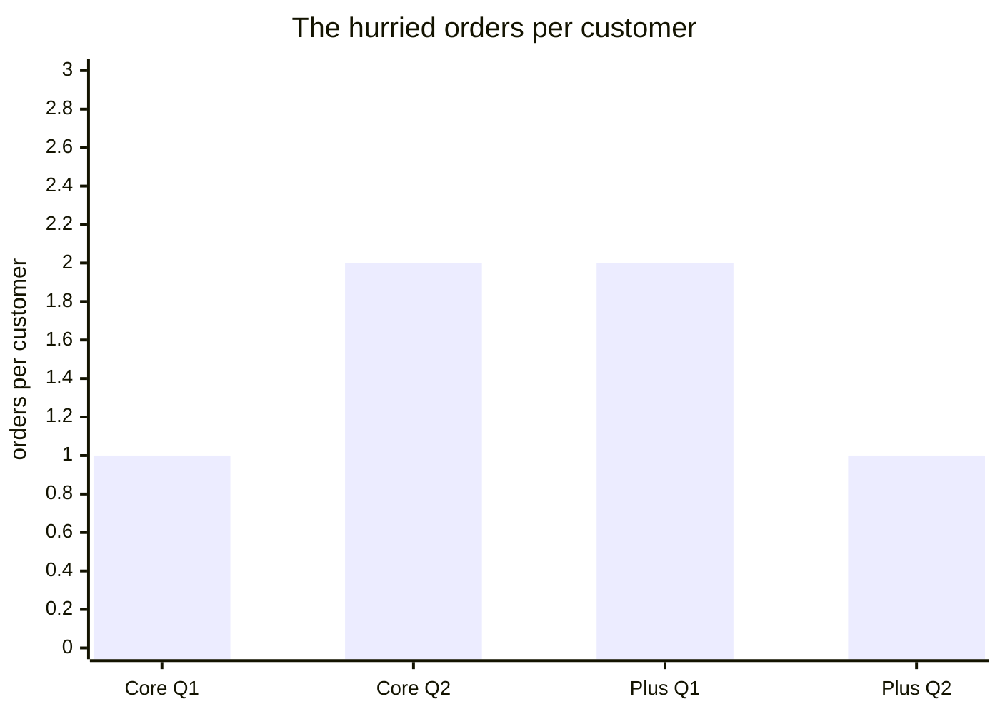
```mermaid
xychart-beta
    title "The hurried orders per customer"
    x-axis ["Core Q1", "Core Q2", "Plus Q1", "Plus Q2"]
    y-axis "orders per customer" 0 --> 3
    bar [1, 2, 2, 1]
```

Read aloud to the head of Retail-Plus, it says her members now order once a quarter, and it says the loyalty budget should follow Retail-Core, whose members suddenly order twice as often.

```notes
LIVE, 3 minutes. The answer is b. Present it straight, as the sheet would. Ask what the head of
Retail-Plus would do with it. Then ask whether anyone believes Retail-Core doubled in one quarter.
```

---

## S26. Why it is wrong: integers divide as integers
*Both counts are integers, so Postgres drops the fraction; nothing on the grid warns you.*

| Segment, quarter | Orders | Customers | Hurried ratio | Orders it implies |
|---|---|---|---|---|
| Retail-Plus, Q1 | 215 | 91 | 2 | 182 |
| Retail-Plus, Q2 | 140 | 76 | 1 | 76 |
| Retail-Core, Q1 | 199 | 102 | 1 | 102 |
| Retail-Core, Q2 | 193 | 96 | 2 | 192 |

**The check.** Multiply the ratio back by the customers. A right ratio gives the orders; this one misses in all eight rows (block `r2_frequency_check`).

```notes
LIVE, 4 minutes. Point at Retail-Plus Q2: the ratio accounts for 76 of 140 orders. The check is a
calculator habit the analyst will use on every ratio on the sheet.
```

---

## S27. The fix: numeric division, and the decision flips back
*One cast keeps the fraction; round on purpose for the reader.*

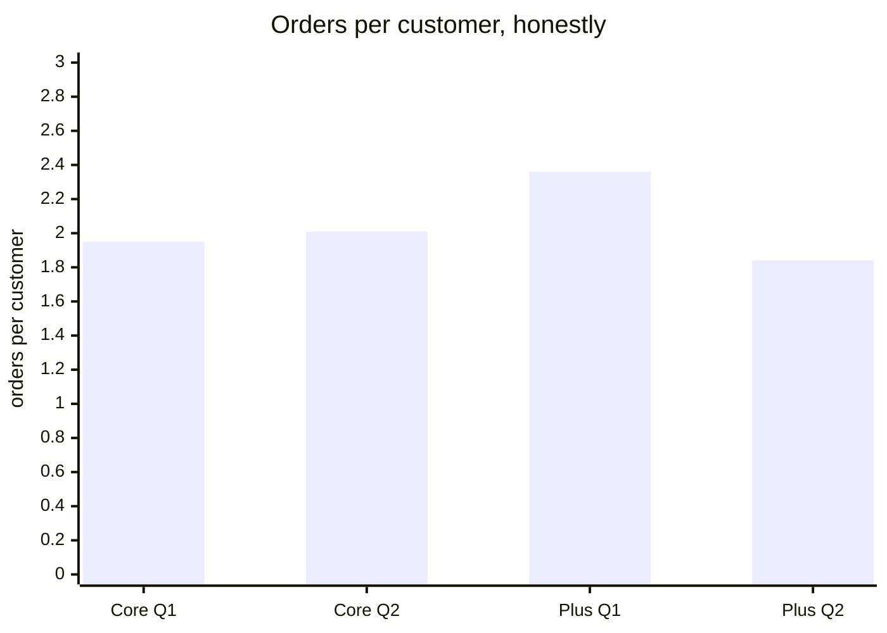
```mermaid
xychart-beta
    title "Orders per customer, honestly"
    x-axis ["Core Q1", "Core Q2", "Plus Q1", "Plus Q2"]
    y-axis "orders per customer" 0 --> 3
    bar [1.95, 2.01, 2.36, 1.84]
```

`round(count(*)::numeric / count(DISTINCT o.customer_id), 2)`: Retail-Plus falls 22 percent, 2.36 to 1.84, and Retail-Core rises 3 percent. Retail-Plus is still the segment to fix, and no budget moves to Core.

```notes
LIVE, 4 minutes. Run r2_frequency_fixed. Say what changed in business terms: halved becomes a
fifth, doubled becomes flat.
```

---

## S28. WHERE keeps rows, HAVING keeps groups
*A filter on a count runs after GROUP BY, because before it no count exists.*

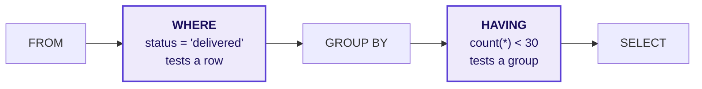
```mermaid
flowchart LR
    F["FROM"] --> W["<b>WHERE</b><br/>status = 'delivered'<br/>tests a row"] --> G["GROUP BY"] --> H["<b>HAVING</b><br/>count(*) < 30<br/>tests a group"] --> S["SELECT"]
    classDef known fill:#EEEAFB,stroke:#5B3FD6,color:#1A0F5C,stroke-width:2px
    class W,H known
```

**The question it answers.** Which segment-quarters hold fewer than 30 orders, too thin to read a rate from? One: Student in Q1, with 27.

```notes
LIVE, 5 minutes. Week 1 Thursday warned against a rate on twelve orders; the suite flags thin
cells rather than hiding them. WHERE count(*) < 30 fails because WHERE runs before groups exist;
let one learner try it, read the last line, move on.
```

---

## S29. Your turn: the same tree on delivered orders
*The status filter tests rows, so it is a WHERE, and it runs before the groups form.*

| Segment | Q1 delivered orders per customer | Q2 |
|---|---|---|
| Business | 1.90 | 2.08 |
| Retail-Core | 1.57 | 1.74 |
| Retail-Plus | 1.87 | 1.56 |
| Student | 1.58 | 1.65 |

**The harder variant.** Write it before you look at block `r2_delivered_by_segment`, and check the groups add back to 653 delivered orders.

```notes
LIVE, 10 minutes of the room's own typing. The table is the answer; reveal it after. Retail-Plus
still falls on delivered orders, so the finding does not depend on the reading of sales.
```

---

## S30. Round 2: honest ratios, per segment
*Every ratio sits beside the two counts it divides.*


```mermaid
flowchart LR
    A["<b>GROUP BY</b><br/>adds back to 1,000"] --> B["<b>numeric division</b><br/>2.36 to 1.84"] --> C["<b>HAVING</b><br/>the thin cell flagged"]
    classDef known fill:#EEEAFB,stroke:#5B3FD6,color:#1A0F5C,stroke-width:2px
    class A,B,C known
```

**Kavya's review.** Show me the orders and customers beside every orders-per-customer figure, so I can divide them myself. Say which orders count, booked or delivered.

**In the interview.** [S] WHERE against HAVING, one sentence each. [S] Explain the logical order in which a SQL query executes.

```notes
LIVE, 5 minutes. Ask both questions aloud, one learner each, under thirty seconds. Then the break
of 10 minutes.
```

---

## SECTION 4: Round 3, named steps
*Which branch moved, read top to bottom, and an average that skips no one.*

```notes
LIVE. Fifty minutes: the subquery (5), two CTEs and the bridge (15), the AVG trap (15), the
harder variant (10), Kavya's review (5). Cut first: the subquery slide, straight to CTEs.
Notebook: notebooks/C2_W02_D01_03_quarters_STUDENT.ipynb. SQL: sql/C2_W02_D01_03_quarters_STUDENT.sql.
```

---

## S31. The question: which branch moved, and where
*Week 1's question, asked of the book: the two quarters on one row per segment.*

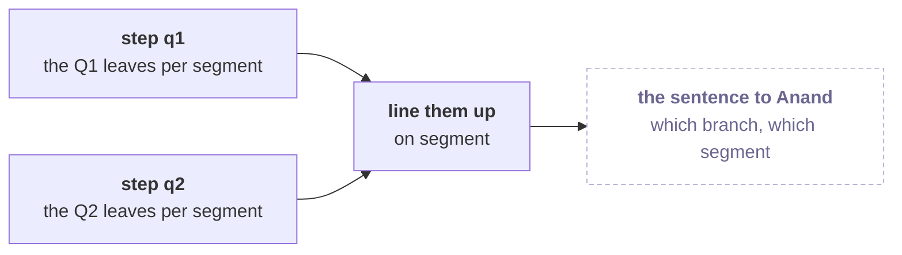
```mermaid
flowchart LR
    Q1["<b>step q1</b><br/>the Q1 leaves per segment"] --> J["<b>line them up</b><br/>on segment"]
    Q2["<b>step q2</b><br/>the Q2 leaves per segment"] --> J
    J --> A["<b>the sentence to Anand</b><br/>which branch, which segment"]
    classDef unknown fill:#FFFFFF,stroke:#B8B2D6,color:#6B6690,stroke-dasharray:4 3
    class A unknown
```

**The client asks.** "Which part of the tree moved, and in which segment? The analyst has to be able to read it top to bottom."

```notes
LIVE, 2 minutes. Draw the three boxes before any SQL. Each box becomes one WITH block.
```

---

## S32. A query inside a query: each segment's share
*The share needs the total as its denominator, and the total is a query of its own.*

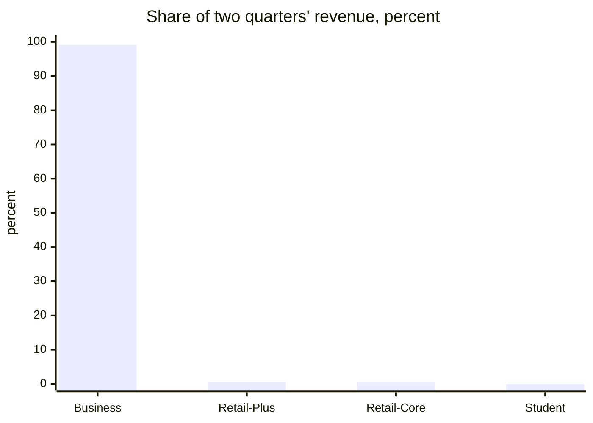
```mermaid
xychart-beta
    title "Share of two quarters' revenue, percent"
    x-axis ["Business", "Retail-Plus", "Retail-Core", "Student"]
    y-axis "percent" 0 --> 100
    bar [99.1, 0.5, 0.4, 0.0]
```

`round(100 * sum(o.amount) / (SELECT sum(amount) FROM orders), 1)`. Business carries 99 percent of the rupees and the consumer segments carry the customers, which is why the tree is read per segment.

```notes
LIVE, 4 minutes. Cut first if the morning runs late. The subquery works and hides its step inside
a line; the next slide names the steps instead.
```

---

## S33. Two CTEs: each step named, the last one reads
*WITH q1 AS, q2 AS, then one SELECT that lines them up on segment.*

```sql
WITH q1 AS (
    SELECT c.segment, count(DISTINCT o.customer_id) AS customers,
           count(*) AS orders, sum(o.amount) AS revenue
    FROM   orders o JOIN customers c USING (customer_id)
    WHERE  o.quarter = 'Q1'
    GROUP  BY c.segment
),
q2 AS ( ... the same, WHERE o.quarter = 'Q2' ... )
SELECT segment, q1.customers, q2.customers,
       round(q1.orders::numeric / q1.customers, 2) AS q1_frequency,
       round(q2.orders::numeric / q2.customers, 2) AS q2_frequency
FROM   q1 JOIN q2 USING (segment)
ORDER  BY segment;
```

```notes
LIVE, 6 minutes. Build it with the room from block r3_two_quarters. Ask what the last SELECT can
see: both steps and every table. A later step reads every earlier one.
```

---

## S34. Retail-Plus: frequency is the biggest branch
*The Rs 1.72 lakh fall, split one branch at a time.*

```mermaid
xychart-beta
    title "Retail-Plus, Q1 to Q2, Rs thousand moved by each branch"
    x-axis ["lost: fewer customers", "lost: fewer orders each", "gained: bigger orders"]
    y-axis "Rs thousand" 0 --> 120
    bar [96.6, 107.8, 31.9]
```

Customers 91 to 76, orders per customer 2.36 to 1.84, revenue per order Rs 2,725 to Rs 2,953.

```notes
LIVE, 5 minutes. The split is sequential: customers first, then frequency, then order value, and
the order of steps changes it slightly; say so. Frequency costs Rs 1.08 lakh, the Week 1 lever at
warehouse scale. The book also shows fewer members buying at all, which an extract of 22 members
could not show. The other three segments move under 2 percent, except Student, which grew.
```

---

## S35. Question: how did spend per member move?
*The head of Retail-Plus asks; the hurried analyst builds one row per member and averages it.*

```sql
WITH member AS (
    SELECT o.customer_id,
           sum(CASE WHEN o.quarter = 'Q1' THEN o.amount END) AS q1_spend,
           sum(CASE WHEN o.quarter = 'Q2' THEN o.amount END) AS q2_spend
    FROM   orders o JOIN customers c USING (customer_id)
    WHERE  c.segment = 'Retail-Plus'
    GROUP  BY o.customer_id
)
SELECT round(avg(q1_spend)), round(avg(q2_spend)) FROM member;
```

**Question.** A member who ordered in Q1 and not in Q2 carries which Q2 spend? a) Rs 0; b) NULL, no value at all; c) their Q1 spend; d) an error.

```notes
LIVE, 2 minutes. Letters, then run r3_member_spend_hurried.
```

---

## S36. Answer: NULL, and the average reads a 15.5% fall
*The plausible wrong answer, as it would reach the head of Retail-Plus.*

```stats
value: Rs 6,437 | label: Q1 spend per member | note: the hurried average
value: Rs 5,439 | label: Q2 spend per member | note: the hurried average
value: 15.5% | label: the fall | note: a soft quarter
```

She plans a light touch: a reminder email to members, no retention budget.

```notes
LIVE, 3 minutes. The answer is b: a CASE with no ELSE returns NULL, and a sum of nothing but NULLs
is NULL. Present the 15.5 percent straight. Ask what a light touch would cost if the real fall
were twice that.
```

---

## S37. Why it is wrong: AVG skips NULLs, silently
*The average divides by the members who bought, and drops the ones who stopped.*

| Invented values, not Kalpa data | Result |
|---|---|
| spend: 100, NULL, 200 | three rows |
| avg(spend) | 150 |
| count(*) | 3 |
| count(spend) | 2 |
| sum(spend) / count(*) | 100 |

The members the head most needs to hear about have left the denominator without a word.

```notes
LIVE, 4 minutes. Show the mechanism on the invented table first (block r3_invented_null), and say
aloud that the three values are invented. Then the next slide finds it in the book.
```

---

## S38. The check: count who is in each average
*The two averages divide by different people.*

```mermaid
xychart-beta
    title "Retail-Plus members in each average"
    x-axis ["bought in the window", "in the Q1 average", "in the Q2 average"]
    y-axis "members" 0 --> 120
    bar [107, 91, 76]
```

31 members bought in Q1 and nothing in Q2. The hurried Q2 average never saw them (block `r3_member_spend_check`).

```notes
LIVE, 3 minutes. count(*) against count(q2_spend). This is the habit: every average gets its
count beside it.
```

---

## S39. The fix: say Rs 0 on purpose, and the fall doubles
*coalesce(sum(...), 0) counts a member who bought nothing as spending nothing.*

```mermaid
xychart-beta
    title "Spend per Retail-Plus member, Rs"
    x-axis ["hurried Q1", "hurried Q2", "honest Q1", "honest Q2"]
    y-axis "Rs" 0 --> 7000
    bar [6437, 5439, 5474, 3863]
```

**What changed.** The fall is 29.4 percent, from Rs 5,474 to Rs 3,863, nearly twice the hurried 15.5. The light touch becomes a retention problem.

```notes
LIVE, 3 minutes. The honest change equals the segment's revenue change, 29.4 percent, as it must
when the members are the same 107 people. That equality is the analyst's proof the denominator is
right.
```

---

## S40. Your turn: the honest average for every segment
*One more column in the member step, one GROUP BY at the end.*

| Segment | Members | Q1 spend each | Q2 spend each | Change |
|---|---|---|---|---|
| Retail-Core | 131 | Rs 2,848 | Rs 2,796 | 1.8% down |
| Retail-Plus | 107 | Rs 5,474 | Rs 3,863 | 29.4% down |
| Student | 24 | Rs 1,113 | Rs 1,490 | 33.9% up |
| Business | 39 | Rs 25,38,832 | Rs 25,02,169 | 1.4% down |

**The harder variant.** Write it, then check each segment's change against its revenue change from S33's query.

```notes
LIVE, 10 minutes of the room's own typing. Reveal the table after. Block r3_member_spend_by_segment.
```

---

## S41. Round 3, and the crux of the morning
*Named steps, honest denominators, and a sentence the analyst can check.*

```mermaid
flowchart LR
    A["<b>count what you mean</b><br/>DISTINCT for people"] --> B["<b>divide in numeric</b><br/>round on purpose"] --> C["<b>name who is averaged</b><br/>coalesce when NULL means 0"] --> D["<b>order every list</b><br/>on a unique key"]
    classDef known fill:#EEEAFB,stroke:#5B3FD6,color:#1A0F5C,stroke-width:2px
    class A,B,C,D known
```

**Kavya's review.** When a number comes out of an average, say who is in it. That is the difference between a 15 percent wobble and a 29 percent problem.

**In the interview.** [D] A stakeholder's analyst must audit your query; what changes in how you write it, and what would you refuse to compute in a notebook?

```notes
LIVE, 5 minutes. Read the four crux lines aloud; they return word for word on the cheat sheet and
the afternoon's close. Ask the [D] question and take one answer. Transition: the afternoon
assembles all of it into the suite.
```
