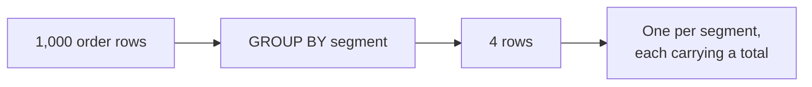
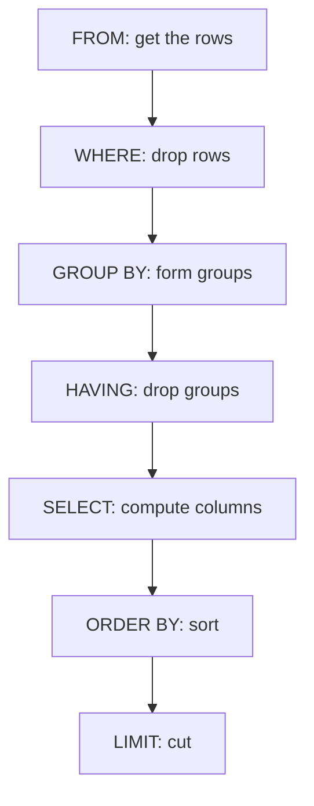
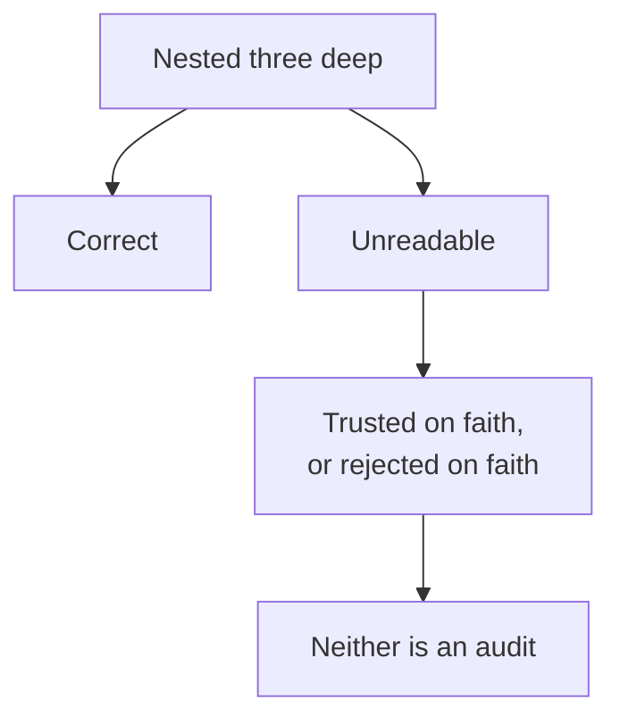
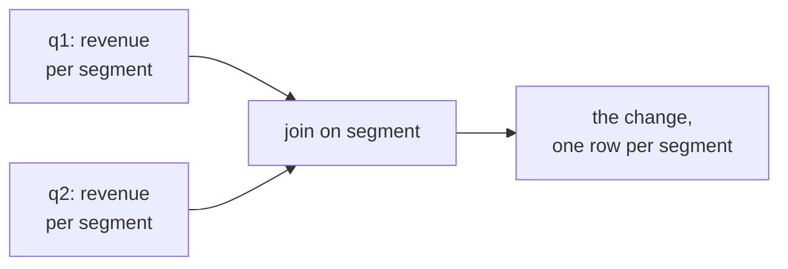
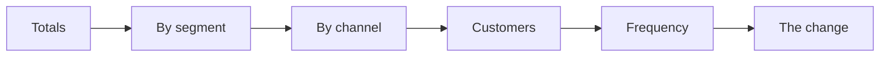

# Half two: the Monday suite, and the order a query really runs in

Week 2, Day 1. Slide source. One idea per slide.

Position bar, repeated at every section boundary:
`[grouping] > [the error] > [the real order] > [named steps] > [the suite]`

---

## SECTION E. Asking a question per group

---

## S1. Anand wants it per segment, not in total
One number for the quarter answers nothing. He asked for every segment and every channel.

```sql
SELECT c.segment, count(*), sum(o.amount)
FROM orders o JOIN customers c USING (customer_id)
GROUP BY c.segment;
```
`GROUP BY` collapses many rows into one row per group.

---

## S2. What collapsing means, drawn

The order rows are gone from the result. Only the groups survive.

---

## S3. Which is why this fails
```sql
SELECT c.segment, o.channel, sum(o.amount)
FROM orders o JOIN customers c USING (customer_id)
GROUP BY c.segment;
```

The server has four segment rows to return and no single channel to put in any of them.

---

## S4. Read the error out loud
```
ERROR:  column "o.channel" must appear in the GROUP BY clause
        or be used in an aggregate function
```
The message says exactly what to do, and there are two right answers.

---

## S5. Answer: pick one of the two fixes
| Fix | What you get |
|---|---|
| Add `o.channel` to `GROUP BY` | One row per segment and channel, twelve rows |
| Wrap it: `count(DISTINCT o.channel)` | Still four rows, now carrying how many channels |

Neither is more correct. They answer different questions, and the error made you choose.

---

## S6. Filtering after the grouping
```sql
SELECT c.segment, count(*) AS orders
FROM orders o JOIN customers c USING (customer_id)
GROUP BY c.segment
HAVING count(*) > 100;
```
`WHERE` filters rows before they are grouped. `HAVING` filters groups after.

---

## S7. So this is refused
```sql
WHERE count(*) > 100
```
At the moment `WHERE` runs, no group exists yet, so there is nothing to count.

That is not a rule to memorise. It falls out of the order the clauses run in.

---

## SECTION F. The order a query really runs in

---

## S8. You write it in one order and it runs in another


---

## S9. Most beginner errors are this picture
| The error | Where it sits in the picture |
|---|---|
| `column must appear in the GROUP BY` | `SELECT` ran after `GROUP BY` and found no single value |
| `aggregate functions are not allowed in WHERE` | `WHERE` ran before any group existed |
| An alias unknown in `WHERE` | The alias is made in `SELECT`, which runs later |
| An alias that works in `ORDER BY` | `ORDER BY` runs after `SELECT`, so it can see it |

---

## D1. The alias asymmetry, which trips everyone once
```sql
SELECT sum(amount) AS revenue FROM orders
GROUP BY quarter
ORDER BY revenue DESC;     -- fine
```
```sql
SELECT sum(amount) AS revenue FROM orders
WHERE revenue > 100;       -- ERROR: column "revenue" does not exist
```
`ORDER BY` sees the alias because it runs later. `WHERE` cannot, because it ran first.

---

## SECTION G. Named steps

---

## S10. A query nobody can check is not finished

Anand's analyst audits every line. A three-level nested subquery is correct and unreadable, and
an unreadable query gets trusted or rejected on faith.

---

## S11. A CTE is a named step
```sql
WITH q1 AS (
    SELECT customer_id, sum(amount) AS revenue
    FROM orders WHERE quarter = 'Q1'
    GROUP BY customer_id
)
SELECT count(*) FROM q1;
```
`WITH name AS (query)` makes a result you can refer to by name for the rest of the statement.

---

## S12. Two CTEs make the quarter comparison readable

Each block does one thing and is named after the thing it does.

---

## S13. The same comparison, written out
```sql
WITH q1 AS (SELECT c.segment, sum(o.amount) rev FROM orders o
            JOIN customers c USING (customer_id)
            WHERE o.quarter='Q1' GROUP BY c.segment),
     q2 AS (SELECT c.segment, sum(o.amount) rev FROM orders o
            JOIN customers c USING (customer_id)
            WHERE o.quarter='Q2' GROUP BY c.segment)
SELECT q1.segment, q1.rev, q2.rev, q2.rev - q1.rev AS change
FROM q1 JOIN q2 USING (segment)
ORDER BY change;
```

---

## D2. What a CTE does not promise
It is a name, not a guarantee about how the work is done. The planner may run the block once, or
fold it into the outer query entirely.

Write CTEs for the person auditing the query. Reach for other tools when the question is speed.

---

## SECTION H. The suite

---

## S14. Six queries is the whole deliverable

| Query | The question it answers |
|---|---|
| 1 | Revenue and orders per quarter |
| 2 | Revenue and orders per segment per quarter |
| 3 | Revenue per channel per quarter |
| 4 | Customers who ordered, per quarter |
| 5 | Orders per customer, per segment, per quarter |
| 6 | The quarter-on-quarter change per segment |

Query six is last week's finding, now reproducible by somebody who has never met you.

---

## S15. One comment line per query
```sql
-- Q5: orders per customer per segment per quarter. Frequency, which is the branch
--     that moved in Q2. Denominator is customers who ordered, not all customers.
```
The comment states the question and the denominator. Anand's analyst reads that line first.

---

## S16. What today equipped you to answer
> [S] WHERE against HAVING, one sentence each.
> [S] Explain the logical order in which a SQL query executes.
> [F] Why would you compute a KPI in the warehouse rather than in a notebook?
> [F] What does LIMIT without ORDER BY return?
> [D] A stakeholder's analyst must audit your query; what changes in how you write it, and what
> would you refuse to compute in a notebook?

---

## S17. Tomorrow
Anand reads the suite and replies with a harder question: booked revenue is not collected
revenue. The payments table joins the warehouse.
