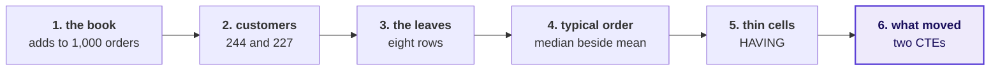
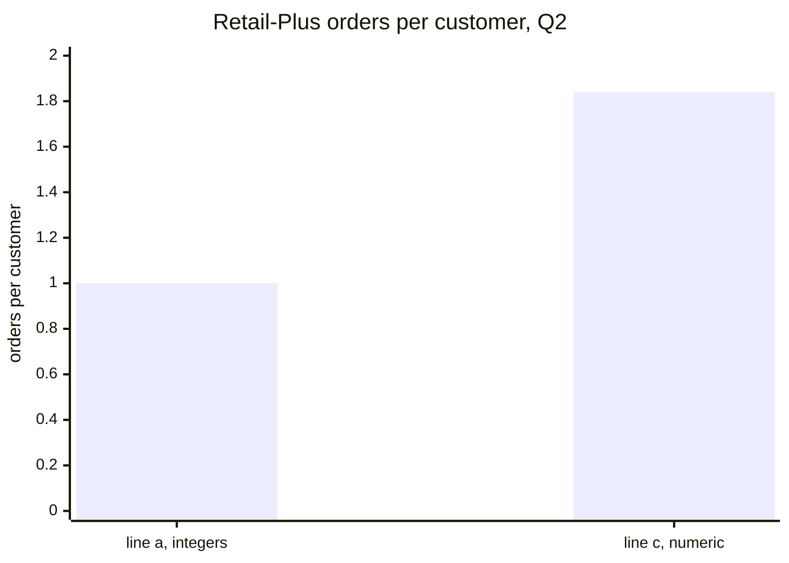
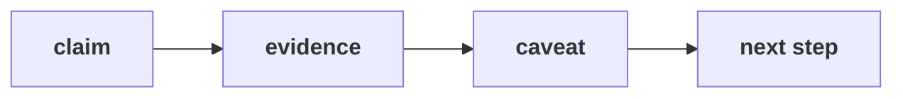
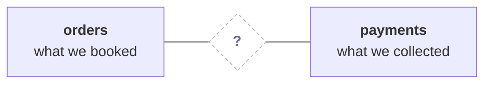

# The Monday suite

Week 2, Day 1. Half two.

Kicker: WEEK 2  ·  MONDAY  ·  HALF TWO
Quote: My analyst will read every query line by line, without you beside him. Be ready to explain why each one is written the way it is.
Who: Anand Iyer, CFO, Kalpa Retail, on the suite he wants every Monday

```notes
LIVE, one minute. The afternoon is sixty minutes: the escalated case with its debrief (45), then
the Kahoot and tomorrow's ask (15). After it the tentative IITGN block runs; say that once, with
the word tentative, and nothing about its content. There is no second case today.
```

---

## SECTION 1: The case
*Six queries that reproduce Week 1's tree by segment and quarter, written for an auditor.*

```notes
LIVE. Forty-five minutes in all: the brief (5), the room builds alone (30), the debrief of wrong
answers (10). No hints during the build; the support TA answers environment problems only.
```

---

## S1. The suite the analyst reruns every Monday
*One file, six queries, one comment line above each.*

```stats
value: 6 | label: queries | note: sql/C2_W02_D01_02_monday_suite_STUDENT.sql
value: 8 | label: rows | note: four segments, two quarters
value: 30 | label: minutes | note: alone, no hints
value: 10 | label: letters | note: posted from the hands-on notebook
```

**The client asks.** "I want these numbers every Monday, for every segment and channel, computed from the warehouse itself."

```notes
LIVE, 2 minutes. The suite file holds six comment lines and no SQL. The hands-on notebook,
notebooks/C2_W02_D01_hands_on_STUDENT.ipynb, runs the same suite with ten lettered choices; a
learner may work in either, and posts the ten letters at the end.
```

---

## S2. The brief, in five parts
*Each part is one rung of the morning, put to work.*

```timeline
label: Part A | title: The book | body: Orders and revenue per quarter, with the change against Q1.
label: Part B | title: Customers | body: Who bought in each quarter, against the members on the book.
label: Part C | title: The leaves | body: Customers, orders per customer and revenue per order, per segment and quarter.
label: Part D | title: The typical order | body: The median beside the mean, and the cells too thin for a rate.
label: Part E | title: What moved | body: Two CTEs, one row per segment, and the sentence to Anand. | tone: dark
```

The brief is `exercises/unguided/C2_W02_D01_monday_suite_brief_STUDENT.md`.

```notes
LIVE, 2 minutes. Walk the parts once; do not show any SQL.
```

---

## S3. The five rules the analyst audits against
*A number that breaks one of these does not reach Anand.*

| Rule | What it rules out |
|---|---|
| Revenue means booked revenue, and the comment says so | A total with no definition |
| A customer is counted once | count(*) read as customers |
| Every ratio is divided in numeric and rounded on purpose | 140 / 76 printed as 1 |
| Every list has an ORDER BY on a unique key | Two runs, two answers |
| A step that feeds another step is a named CTE | A query nobody can read top to bottom |

```notes
LIVE, 1 minute. These five rules are the morning's traps turned into a checklist. Start the 30
minutes of building when this slide goes up.
```

---

## S4. The suite as the analyst reads it
*Six queries in the order of the tree, each checkable against the one before.*


```mermaid
flowchart LR
    A["<b>1. the book</b><br/>adds to 1,000 orders"] --> B["<b>2. customers</b><br/>244 and 227"] --> C["<b>3. the leaves</b><br/>eight rows"]
    C --> D["<b>4. typical order</b><br/>median beside mean"] --> E["<b>5. thin cells</b><br/>HAVING"] --> F["<b>6. what moved</b><br/>two CTEs"]
    classDef known fill:#EEEAFB,stroke:#5B3FD6,color:#1A0F5C,stroke-width:2px
    class F known
```

**Kavya's review.** Each query checks the one before it: the leaves add back to the book, and the change in query 6 matches the revenue in query 3.

```notes
SELF-STUDY during the build, left on screen. The numbers in the boxes are checks a learner can
compare against without being given an answer.
```

---

## SECTION 2: The debrief
*The wrong answers the room gave, each with the number it produced and the check that caught it.*

```notes
LIVE. Ten minutes. Read the room's letters as they arrive in chat and pick the two most-missed
markers. Run this chapter from those, never from a lecture.
```

---

## S5. Question: which line ships a wrong number?
*Three lines a learner posted from the suite. Each runs without an error.*

```sql
-- line a
count(*) / count(DISTINCT o.customer_id) AS orders_per_customer
-- line b
sum(o.amount) / count(*) AS revenue_per_order
-- line c
round(count(*)::numeric / count(DISTINCT o.customer_id), 2) AS orders_per_customer
```

**Question.** Which line puts a wrong number on Anand's sheet? a) Line a; b) line b; c) line c; d) none of them.

```notes
LIVE, 2 minutes. Letters in chat. Most rooms split between a and d.
```

---

## S6. Answer: line a, and it reads Retail-Plus as 1
*Integer division again; line b is right because amount is numeric.*


```mermaid
xychart-beta
    title "Retail-Plus orders per customer, Q2"
    x-axis ["line a, integers", "line c, numeric"]
    y-axis "orders per customer" 0 --> 2
    bar [1, 1.84]
```

Line b divides a numeric sum by an integer count, so Postgres keeps the fraction. The difference is the type of the numerator, and nothing on the grid shows it.

```notes
LIVE, 2 minutes. The answer is a. Ask how a learner would know b is safe: check the column type,
numeric(12,2), from round 1's schema read.
```

---

## S7. The four wrong numbers of the day
*Each one looks like a finished result, and each one flips a decision.*

| The hurried query | The wrong number | The check | The honest number |
|---|---|---|---|
| count(*) as customers | 1,000 customers, 1.00 orders each | count three ways | 301 customers, 3.32 orders each |
| LIMIT 5, no ORDER BY | Rs 3,900 audited, Rs 4,590 rerun | rerun after a reload | the same five, every run |
| count / count in integers | Retail-Plus 2 to 1, halved | multiply back | 2.36 to 1.84, 22% down |
| avg over NULLs | spend per member 15.5% down | count(*) against count(x) | 29.4% down |

```notes
LIVE, 3 minutes. Read one row per trap, wrong number first. This table is the day on one slide,
and it returns word for word in the study notes.
```

---

## S8. What the suite says: Retail-Plus moved
*Query 6, the one row per segment Anand reads first.*

| Segment | Customers | Frequency | Order value | Revenue |
|---|---|---|---|---|
| Business | 2.8% down | 3.5% down | 5.1% up | 1.4% down |
| Retail-Core | 5.9% down | 3.0% up | 1.2% up | 1.8% down |
| Retail-Plus | 16.5% down | 22.0% down | 8.4% up | 29.4% down |
| Student | 33.3% up | 5.6% up | 4.9% down | 33.9% up |

```notes
LIVE, 2 minutes. Frequency is the branch that fell furthest, which is Week 1's finding at warehouse
scale. Student grows on 27 and 38 orders, so its row carries the thin-cell warning.
```

---

## S9. The sentence to Anand
*Claim, evidence, caveat and next step, in four sentences he can check.*


```mermaid
flowchart LR
    C["<b>claim</b>"] --> E["<b>evidence</b>"] --> V["<b>caveat</b>"] --> N["<b>next step</b>"]
```

**The claim.** Booked revenue fell 1.6 percent from Q1 to Q2, the same fall last week's extract showed, so the warehouse agrees with the note Meera accepted.

**The evidence.** The fall sits in Retail-Plus, down 29.4 percent: its members ordered less often, 2.36 to 1.84 per quarter, and fewer bought at all, 91 to 76; the other segments moved under 2 percent or grew.

**The caveat.** This is booked revenue; Student's Q1 rate rests on 27 orders. **The next step.** Collected revenue, tomorrow.

```notes
LIVE, 1 minute. Read it aloud. Ask for the one number the analyst would check first: the 1.6
percent against query 1.
```

---

## SECTION 3: The close
*The crux lines, the Kahoot, and tomorrow's question left open.*

```notes
LIVE. Fifteen minutes: the crux lines (2), the Kahoot (10), tomorrow's ask (3).
```

---

## S10. Four lines to carry out of the room
*The same four lines are on the cheat sheet, word for word.*

```cards
icon: hash | eyebrow: Line 1 | title: Count what you mean | body: COUNT(DISTINCT customer_id) counts people; count(*) counts rows.
icon: divide | eyebrow: Line 2 | title: Divide in numeric and round on purpose | body: Integers divide as integers.
icon: sigma | eyebrow: Line 3 | title: Name who is averaged | body: AVG skips NULLs, so say whether a NULL means zero.
icon: list-ordered | eyebrow: Line 4 | title: Order every list on a unique key | body: A table has no order. | tone: dark
```

```notes
LIVE, 2 minutes. Read the four lines aloud, slowly.
```

---

## S11. The interview questions the day equips
*Tagged as the row tags them; the full answers are in the study notes.*

| Tag | Question |
|---|---|
| [S] | WHERE against HAVING, one sentence each. |
| [S] | Explain the logical order in which a SQL query executes. |
| [F] | Why would you compute a KPI in the warehouse rather than in a notebook? |
| [F] | What does LIMIT without ORDER BY return? |
| [D] | A stakeholder's analyst must audit your query; what changes in how you write it? |
| [F] | Your orders-per-customer column reads 1 for a segment; what do you check first? |

```notes
SELF-STUDY tonight, 20 minutes aloud. The full list of eleven, with answers, is in the study notes
and the day sheet. The last row is a case-style follow-up this pack adds to the row's anchors.
```

---

## D12. The case-style follow-ups
*Five more questions an interviewer asks once the anchors are answered.*

| Tag | Follow-up |
|---|---|
| [F] | Your KPI dropped 30 percent overnight and the data did not change; what in the query do you suspect? |
| [F] | An average moved, but the total did not; how can that happen? |
| [S] | COUNT(*), COUNT(column) and COUNT(DISTINCT column): what does each count? |
| [D] | Two analysts report different customer counts for the same quarter; how do you settle it? |
| [F] | When would you use a CTE instead of a subquery? |

```notes
SELF-STUDY. Answered in full in the study notes, section "In the interview".
```

---

## S13. The Kahoot: eight items, ungraded
*Six from today, one from Week 1 Thursday, one on the suite.*

```cards
icon: list-ordered | eyebrow: Items 1 to 3 | title: The order and the filters | body: What runs first, why WHERE count(*) fails, how many rows a GROUP BY returns.
icon: shuffle | eyebrow: Items 4 to 6 | title: The traps | body: LIMIT without ORDER BY, what a CTE can see, one presence counter in one line.
icon: rotate-ccw | eyebrow: Items 7 and 8 | title: The return | body: The discount's mix effect one level up, and the integer ratio. | tone: dark
```

```notes
LIVE, 10 minutes. kahoot/C2_W02_D01_quiz_STUDENT.md. Ungraded; read the most-missed item's reason
aloud and nothing else.
```

---

## S14. Tomorrow: booked is not collected
*Anand's reply to the Monday suite, left open.*

> "Booked revenue is not collected revenue. Some orders are paid in two instalments, some are refunded, some were never paid at all. Show me, order by order, what we actually collected against what we booked in Q2." Anand Iyer, CFO, Kalpa Retail


```mermaid
flowchart LR
    O["<b>orders</b><br/>what we booked"] --- Q{"<b>?</b>"} --- P["<b>payments</b><br/>what we collected"]
    classDef unknown fill:#FFFFFF,stroke:#B8B2D6,color:#6B6690,stroke-dasharray:4 3
    class Q unknown
```

```notes
LIVE, 3 minutes. Read Anand's reply and leave the question mark on screen. Do not explain joins.
The pre-read ships tonight. Then the room moves to the tentative IITGN block, and after the day
the TA-led practice lab runs from exercises/practice/.
```
