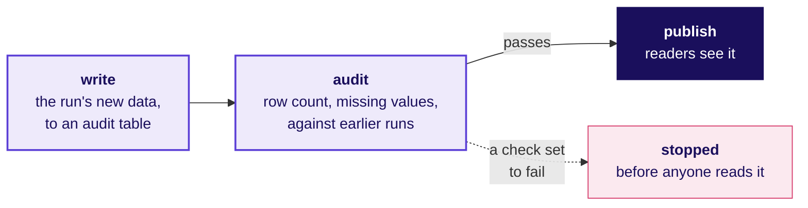
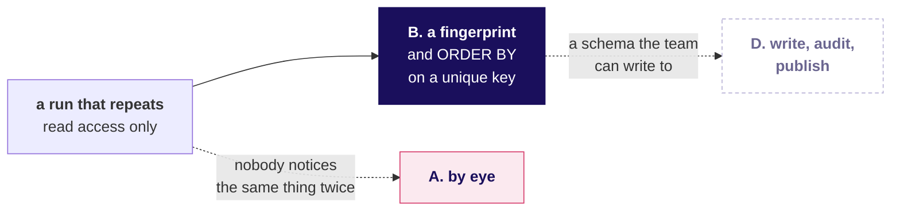
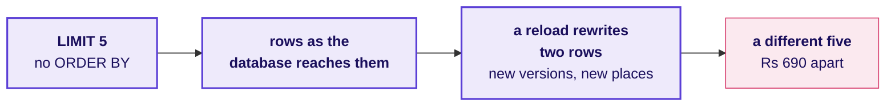
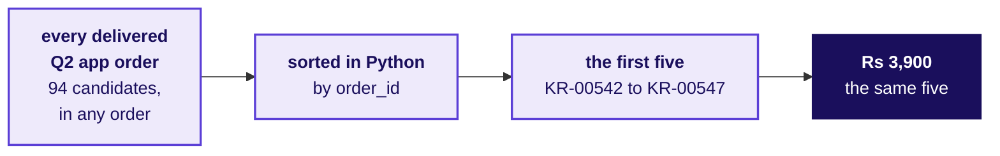
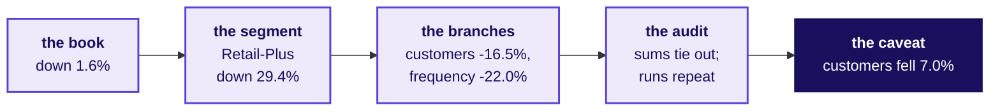
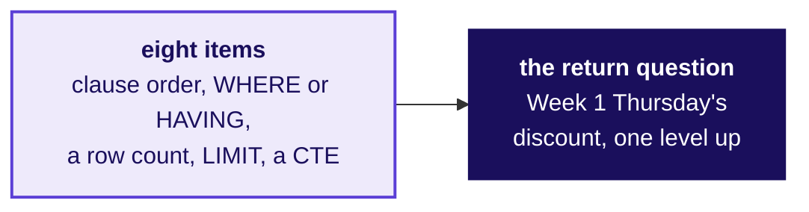
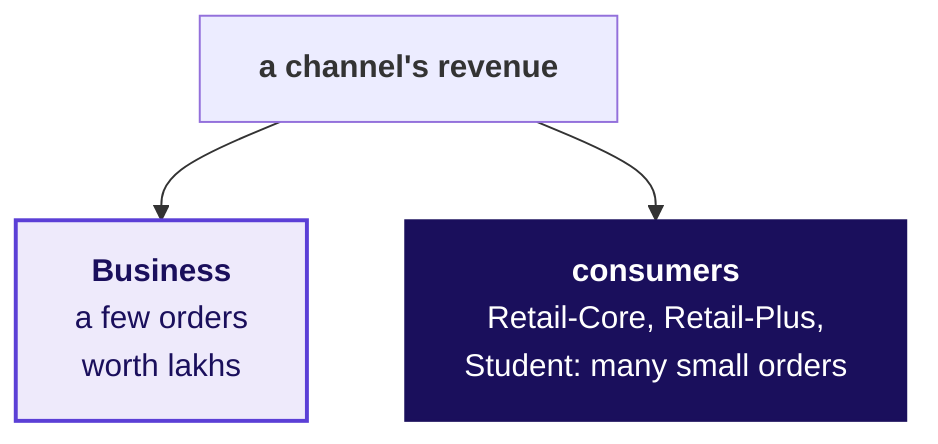
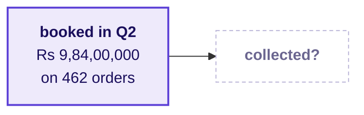

# Will next Monday's run give the analyst the same answer?

Week 2, Day 1. Afternoon.

Kicker: WEEK 2  ·  MONDAY  ·  AFTERNOON
Quote: Every Monday I rerun your suite and trace five delivered app orders against the ERP. If my rerun differs from yours, I need to know whether the book changed or your query did.
Who: Anand's analyst, finance, Kalpa Retail, to the data and AI team at Kalpa's Global Capability Centre

```notes
LIVE, one minute. Read the analyst's words aloud. The morning built every number on Anand's
Monday sheet; the afternoon asks whether the suite repeats, then hands the room a case to run
alone. The trainer's part of the afternoon is 60 minutes: chapter 6 (30), the escalated case's
first two parts (20) and the Kahoot (10). Then what the morning established.
```

---

## S1. The morning built the suite in five chapters
*What did the morning's five chapters establish, with their numbers?*

| Chapter | What it answered |
|---|---|
| 1. What does the book say? | Rs 10,00,00,000 on 538 orders in Q1 and Rs 9,84,00,000 on 462 in Q2; 244 then 227 customers who bought |
| 2. Same story as Week 1? | Revenue agrees; customers fell 7.0% on the book where last week's extract showed them flat |
| 3. Which segment moved? | Retail-Plus, down 29.4%, with orders per customer 2.36 then 1.84 |
| 4. Which branch moved? | Frequency, 0.780 of Q1; each Retail-Plus member spent 29.4% less |
| 5. Does the suite add up? | Segments add to the book; 107 Retail-Plus customers in the half-year, not 167 |

```notes
LIVE, 2 minutes. Read the five answers as one story: the book fell 1.6 percent, Retail-Plus
carries the fall in orders, and every count, ratio and average on the sheet says what it counts.
Q1 is April to June 2026 and Q2 is July to September 2026; revenue is booked revenue, every order
at its amount. Then chapter 6.
```

---

## SECTION 6: Same answer next week?
*Will next Monday's run give Anand's analyst the same answer from the same book?*

```notes
LIVE. Thirty minutes: the need and the company (3), the options and the call (5), the fingerprint
and the reload (5), the trap, its check and its fix (9, never cut), the second route (3), the
sentence to Anand (3) and the close (2). Notebook 6 and sql/C2_W02_D01_06_same_answer_STUDENT.sql
run beside it.
```

---

## S2. Answered in five questions, before the first rerun
*Who needs this answer, and which questions lead to it?*

**Who needs the answer.** Anand's analyst reruns the suite every Monday and checks five orders against the ERP, the system Finance books orders in. A rerun that disagrees with the team's run on a sample that should be identical, even by a few hundred rupees, makes every number in the suite suspect, because nobody can say whether the book moved or the query did.

```timeline
label: 1 | title: How does a run prove itself? | body: Four ways to tell two runs apart
label: 2 | title: What does it leave behind? | body: This Monday's fingerprint
label: 3 | title: Which five orders? | body: The audit sample the analyst traces
label: 4 | title: Does Python agree? | body: The same five, sorted another way
label: 5 | title: What does Anand hear? | body: The day's answer in one message | tone: dark
```

```notes
LIVE, 1 minute. Read the five questions. Then the need.
```

---

## S3. The need: a rerun that matches to the rupee
*Who asks, what is measured, and what does a rerun that differs cost?*

```cards
icon: user | eyebrow: Who asks | title: Anand's analyst | body: Reruns the suite every Monday and traces five delivered Q2 app orders against the ERP.
icon: fingerprint | eyebrow: The metric | title: The run itself | body: What the book held when the suite ran, and which orders the sample drew.
icon: triangle-alert | eyebrow: A rerun that differs costs | title: Every number doubted | body: Nobody can say whether the book moved or the query did, so nothing on the sheet is signed. | tone: dark
```

```notes
LIVE, 2 minutes. The ERP is the enterprise system where Finance books every order; the analyst
traces a sample of warehouse orders back to it to prove the warehouse matches the books. Q2 is July
to September 2026. Then a company that checks every run before anyone reads it.
```

---

## S4. Netflix audits each run before anyone reads it
*Has a real data team built its runs to prove themselves before they are published?*


```mermaid
flowchart LR
    W["<b>write</b><br/>the run's new data,<br/>to an audit table"] --> A["<b>audit</b><br/>row count, missing values,<br/>against earlier runs"]
    A -->|"passes"| P["<b>publish</b><br/>readers see it"]
    A -.->|"a check set<br/>to fail"| S["<b>stopped</b><br/>before anyone reads it"]
    classDef known fill:#EEEAFB,stroke:#5B3FD6,color:#1A0F5C,stroke-width:2px
    classDef bad fill:#FBE9EF,stroke:#D63A6A,color:#1A0F5C
    classDef bet fill:#1A0F5C,stroke:#1A0F5C,color:#FFFFFF
    class W,A known
    class P bet
    class S bad
```

Netflix's data engineering team called the pattern write, audit, publish: a number published every week checks itself against last week before anyone reads it.

```notes
LIVE, 1 minute. Michelle Ufford's talk "Whoops, The Numbers Are Wrong! Scaling Data Quality @
Netflix" at DataWorks Summit, San Jose, 13 June 2017. One of its slides sets a new batch of 17,240
rows with 17,240 missing values beside the previous day's 16,135 rows with 21: every value of the
column was missing. In the talk's rules the row-count checks fail the job and the missing-value
check only warns, so that batch raised a warning; say it that way. Source and check date are in
the day's provenance. Then four ways a Kalpa run could prove itself.
```

---

## S5. A fingerprint: 7 numbers, and read access is enough
*How can a run show that it computed the same thing as last week's?*

| Option | Stored with each run | Access it needs | What it can tell apart |
|---|---|---|---|
| A. Rerun and compare by eye | Nothing | Read | Whatever someone happens to notice |
| B. A fingerprint block that runs with the suite | 7 numbers about the book | Read | A changed book from a changed query |
| C. Snapshot each Monday's outputs into a table | About 18 rows a Monday | Write, to a schema the team owns | What changed in any output, row by row |
| D. Write, audit, publish | A staging table per run | Write, and a scheduler | A bad run, stopped before anyone reads it |

**The call.** B, with an ORDER BY on a unique column in every list: the team has read access, which rules out C and D, and B answers the analyst's first question.

```notes
LIVE, 3 minutes. The fingerprint reads each table once: orders gives its rows, its rupees, its
distinct customers and its latest date, and customers gives its rows, its distinct customers and
its latest joining date, seven numbers in all, since customers carries no rupees. If next
Monday's fingerprint matches this one, the book has not changed, so any difference in the numbers
is the query's. Then what would switch the call.
```

---

## S6. A schema of the team's own would switch it to D
*What fact would move the call away from a fingerprint?*


```mermaid
flowchart LR
    Q["<b>a run that repeats</b><br/>read access only"] --> B["<b>B. a fingerprint</b><br/>and ORDER BY<br/>on a unique key"]
    B -.->|"a schema the team<br/>can write to"| D["<b>D. write, audit,<br/>publish</b>"]
    Q -.->|"nobody notices<br/>the same thing twice"| A["<b>A. by eye</b>"]
    classDef unknown fill:#FFFFFF,stroke:#B8B2D6,color:#6B6690,stroke-dasharray:4 3
    classDef bad fill:#FBE9EF,stroke:#D63A6A,color:#1A0F5C
    classDef bet fill:#1A0F5C,stroke:#1A0F5C,color:#FFFFFF
    class B bet
    class D unknown
    class A bad
```

**The fact that would change the call.** Once the platform lead grants a schema the team can write to, D runs the audit before the numbers are released, which beats finding the problem after Anand has read them.

```notes
LIVE, 2 minutes. C costs little here, about 18 output rows a Monday, and it needs the same write
access D does, so the switch is to D, the pattern that stops a bad run. Then this Monday's
fingerprint.
```

---

## S7. Question: does a reload move the fingerprint?
*Overnight the warehouse reloads two order rows with the values they already hold: does the fingerprint change?*

```sql
SELECT 'orders' AS table_name, count(*) AS rows, sum(amount) AS rupees,
       count(DISTINCT customer_id) AS distinct_customers,
       max(order_date) AS latest_date
FROM   orders
UNION ALL
SELECT 'customers', count(*), NULL, count(DISTINCT customer_id), max(joined_date)
FROM   customers;
```

**Question.** Does the fingerprint change? a) yes, two rows were written, so the row count moves; b) yes, the rupees move, since the rows were rewritten; c) no, the rows, the rupees and the customers are all the same; d) it cannot be read during a reload.

```notes
LIVE, 1 minute. UNION ALL stacks the two tables' rows into one result, one row per table. The
notebook runs the reload inside a transaction and rolls it back, so the warehouse is left as it
was. Letters, then the answer.
```

---

## S8. Answer: no: 1,000 rows, Rs 19.84 crore, 301 buyers
*What fingerprint does this Monday's run leave?*

```stats
value: 1,000 | label: order rows | note: before and after the reload
value: Rs 19.84 cr | label: rupees on the book | note: Rs 19,84,00,000, Q1 and Q2 together
value: 301 | label: distinct customers | note: who bought in either quarter
value: 340 | label: customer rows | note: members on the book
```

The answer is c. The reload rewrote two rows with their own values, so whatever differs between two runs after it cannot be the book.

```notes
LIVE, 2 minutes. The latest order date is 28 September 2026 and the latest joining date on the
customer table is 25 December 2025; both sit in the fingerprint and both held. Print the
fingerprint at the top of every Monday's run: it is the first thing the analyst compares. Then
the audit sample.
```

---

## S9. Question: which five orders does LIMIT 5 return?
*The analyst traces five delivered Q2 app orders: which five does the quickest query return?*

```sql
SELECT order_id, amount FROM orders
WHERE  quarter = 'Q2' AND channel = 'app' AND status = 'delivered'
LIMIT  5;
```

**Question.** With no ORDER BY, which five rows come back? a) the five with the smallest order ids; b) the five most recent orders; c) whichever five the database reaches first, which can change between runs; d) five chosen at random on every run.

```notes
LIVE, 1 minute. Letters. Expect a, because on a small, freshly loaded table the first rows often
are the smallest ids, and the first run seems to confirm it. Then both runs side by side.
```

---

## S10. Answer: whichever five come first, Rs 690 apart
*What happens when the analyst reruns the same query after the reload?*

| Your run on Monday | Amount | The analyst's rerun | Amount |
|---|---|---|---|
| KR-00542 | Rs 790 | KR-00545 | Rs 680 |
| KR-00544 | Rs 960 | KR-00546 | Rs 500 |
| KR-00545 | Rs 680 | KR-00547 | Rs 970 |
| KR-00546 | Rs 500 | KR-00549 | Rs 970 |
| KR-00547 | Rs 970 | KR-00553 | Rs 1,470 |
| **Total** | **Rs 3,900** | **Total** | **Rs 4,590** |

**What breaks.** The audit reports a Rs 690 disagreement on a sample that should be identical, and every other number in the suite comes under question. The answer is c.

```notes
LIVE, 2 minutes. This is the plausible wrong answer: the query ran, returned five delivered Q2 app
orders, and looked right both times. Two of the five differ between the runs, and nothing in the
book changed. Then why.
```

---

## S11. Why it is wrong: a table has no order to keep
*Why did the same query on the same book draw a different five?*


```mermaid
flowchart LR
    A["<b>LIMIT 5</b><br/>no ORDER BY"] --> B["<b>rows as the<br/>database reaches them</b>"]
    B --> C["<b>a reload rewrites<br/>two rows</b><br/>new versions, new places"]
    C --> D["<b>a different five</b><br/>Rs 690 apart"]
    classDef known fill:#EEEAFB,stroke:#5B3FD6,color:#1A0F5C,stroke-width:2px
    classDef bad fill:#FBE9EF,stroke:#D63A6A,color:#1A0F5C
    class A,B,C known
    class D bad
```

**The check.** The fingerprint said the book did not change; the samples say the five did. Without ORDER BY, Postgres returns rows "in an unspecified order", and LIMIT returns "an unpredictable subset of the query's rows".

```notes
LIVE, 3 minutes. The PostgreSQL documentation on sorting: the order "will depend on the scan and
join plan types and the order on disk, but it must not be relied on". Postgres writes a rewritten
row as a new version in a new place, so after the reload the first five rows the database reaches
are a different five. The room's sixty Codespaces hold identical data and will often draw the same
five, which is exactly why the habit survives until the first reload. Then the fix.
```

---

## S12. The fix: ORDER BY order_id draws the same five
*Which five orders will the analyst trace against the ERP?*

```sql
SELECT order_id, amount FROM orders
WHERE  quarter = 'Q2' AND channel = 'app' AND status = 'delivered'
ORDER  BY order_id
LIMIT  5;
```

```stats
value: KR-00542 to KR-00547 | label: the five | note: 542, 544, 545, 546 and 547
value: Rs 3,900 | label: before the reload | note: the same five
value: Rs 3,900 | label: after the reload | note: the same five
```

```notes
LIVE, 2 minutes. order_id is the table's key, a column no two rows share, so the order is unique
and every run draws the same five. Ordering on a column rows can share, such as the customer or
the date, still leaves ties the database may break differently. Then the same five, reached a
second way.
```

---

## S13. A second route: Python's sort picks the same five
*Does a sort in Python, after the database returns every candidate, pick the same five?*


```mermaid
flowchart LR
    A["<b>every delivered<br/>Q2 app order</b><br/>94 candidates,<br/>in any order"] --> B["<b>sorted in Python</b><br/>by order_id"]
    B --> C["<b>the first five</b><br/>KR-00542 to KR-00547"]
    C --> D["<b>Rs 3,900</b><br/>the same five"]
    classDef known fill:#EEEAFB,stroke:#5B3FD6,color:#1A0F5C,stroke-width:2px
    classDef bet fill:#1A0F5C,stroke:#1A0F5C,color:#FFFFFF
    class A,B,C known
    class D bet
```

The first route asked the database to sort and cut; this one asks for all 94 candidates in whatever order they arrive and sorts them in Python, and it names the same five orders.

```notes
LIVE, 2 minutes. 80 of the 94 candidates are under Rs 5,000, and the sampled five average Rs 780;
the other 14 are Business orders worth lakhs. When to switch: sorting in Python is fine for a
one-off check; the Monday suite sorts in the query, so the file the analyst reruns carries its
own order. Then what the suite now tells Anand.
```

---

## S14. The message to Anand: down 1.6%, and Retail-Plus
*What does the Monday suite tell Anand?*

> "Anand, the Monday suite now runs on the warehouse itself. Booked revenue fell 1.6 percent, from Rs 10.00 crore to Rs 9.84 crore, and Retail-Plus carries the fall in orders: its revenue is down 29.4 percent because 16.5 percent fewer members bought and each ordered 22.0 percent less often. Every count says what it counts, every ratio multiplies back, and each run prints the book's fingerprint, so a rerun on the same book gives the same answer. One caveat: last week's extract showed customers flat, and the full book shows 7.0 percent fewer customers in Q2."


```mermaid
flowchart LR
    B["<b>the book</b><br/>down 1.6%"] --> S["<b>the segment</b><br/>Retail-Plus<br/>down 29.4%"] --> R["<b>the branches</b><br/>customers -16.5%,<br/>frequency -22.0%"] --> A["<b>the audit</b><br/>sums tie out;<br/>runs repeat"] --> C["<b>the caveat</b><br/>customers fell 7.0%"]
    classDef known fill:#EEEAFB,stroke:#5B3FD6,color:#1A0F5C,stroke-width:2px
    classDef bet fill:#1A0F5C,stroke:#1A0F5C,color:#FFFFFF
    class B,S,R,A known
    class C bet
```

```notes
LIVE, 3 minutes. Read the message aloud once, then ask the room which sentence Anand's analyst
checks first. The caveat is the sentence that earns the rest their trust: it says, before anyone
else does, where the book and last week's note part company. Then the chapter's answer.
```

---

## S15. Yes, once every list is ordered and fingerprinted
*So will next Monday's run give Anand's analyst the same answer from the same book?*

| The question on the way | The answer |
|---|---|
| 1. How does a run prove itself? | A fingerprint block, 7 numbers, and ORDER BY on a unique key |
| 2. What does it leave behind? | 1,000 orders, Rs 19,84,00,000, 301 customers; unchanged by the reload |
| 3. Which five orders? | KR-00542 to KR-00547, Rs 3,900; unordered, a rerun drew Rs 4,590 |
| 4. Does Python agree? | Yes: sorting all 94 candidates picks the same five |
| 5. What does Anand hear? | Down 1.6%, Retail-Plus carries it, and every rerun repeats |

**Kavya's review.** A run that cannot be repeated cannot be audited. Every list carries an ORDER BY on a column no two rows share, and the book's fingerprint prints beside the numbers, so a difference next Monday says whether the book moved or the query did.

**In the interview.** [F] What does LIMIT without ORDER BY return? [F] Your KPI moved 30 percent overnight and the data did not change; what do you suspect?

```notes
LIVE, 2 minutes. The overnight answer in one breath: check the book's fingerprint first; if rows
and rupees are the same, suspect the query: an unordered LIMIT, a definition that changed, a
denominator that shifted, or integer division. Every one of those is a chapter from today. Then
the case the room runs alone.
```

---

## SECTION 7: Can you do it alone?
*Does the Monday suite hold on Anand's definition, the orders that were delivered?*

```notes
LIVE. Twenty minutes in the afternoon for parts 1 and 2, alone, in
notebooks/C2_W02_D01_ex1_escalated_case_STUDENT.ipynb with the brief
exercises/unguided/C2_W02_D01_escalated_case_STUDENT.md. Parts 3 to 5 run in the practice lab
after the day.
```

---

## S16. Answer it in five parts: two now, three in the lab
*Which parts does the case ask for, and which runs where?*

**The client asks.** "Finance counts the orders that reached the customer and stayed there. Run me the same suite on delivered orders, and tell me whether the story changes."

```timeline
label: Part 1 | title: The delivered book | body: Orders, customers and rupees per quarter, on Anand's definition. This afternoon.
label: Part 2 | title: Each segment's frequency | body: Orders per customer per segment, and the groups too thin to quote. This afternoon.
label: Part 3 | title: Branches and spend | body: Retail-Plus's branches and spend per member. In the lab.
label: Part 4 | title: The tie-outs | body: Segments against the book, the half-year counted once. In the lab.
label: Part 5 | title: The run that repeats | body: An ordered sample and the delivered book's fingerprint. In the lab. | tone: dark
```

```notes
LIVE, 3 minutes. Read Anand's words aloud. Delivered means the order reached the customer and was
not returned or cancelled; on the book 653 of the 1,000 orders are delivered. Nothing from the
morning can be copied: every number changes on the new definition, and each part climbs one
chapter's method. Post ten letters and three numbers when the case is done. Then the rules the
brief holds the room to.
```

---

## S17. Every choice is yours, and the analyst reads it first
*Which rules does the delivered suite have to keep, whatever the numbers turn out to be?*

```cards
icon: filter | eyebrow: The definition | title: Delivered only | body: A filter on the order's status keeps orders that reached the customer and stayed.
icon: users | eyebrow: The counts | title: Named for what they count | body: Orders are rows; customers are counted once each.
icon: divide | eyebrow: The ratios | title: Divided in numeric | body: Every ratio keeps its decimals and multiplies back to its orders.
icon: list-ordered | eyebrow: The run | title: Ordered and fingerprinted | body: The sample orders on a unique key, and the delivered book's fingerprint prints beside it. | tone: dark
```

```notes
LIVE, 17 minutes of work after this slide: parts 1 and 2 alone, in the notebook. Walk the room.
Where a learner stalls on part 1, ask which clause runs first and what it keeps; on part 2, ask
what 2 times 26 gives back. Do not give letters. At the end of the 20 minutes, collect part 1's
revenue change and part 2's thinnest segment-quarter on the board, and say parts 3 to 5 run in the
lab tonight. Then the close.
```

---

## SECTION 8: What do we tell Anand?
*What did the day answer, and what does Anand ask next?*

```notes
LIVE. Ten minutes: the day's answer (1), the crux lines (1), the Kahoot (7) and tomorrow's
question (1). The self-study
slides after the Kahoot carry the interview drill, the second case and the day's wrong numbers for
the lab and the take-home.
```

---

## S18. Answer: yes: down 1.6%, Retail-Plus, and it reruns
*Can the warehouse itself give Anand the Monday numbers, every segment, every week?*

```stats
value: 1.6% | label: the book's fall | note: Rs 10.00 crore to Rs 9.84 crore
value: 29.4% | label: Retail-Plus's fall | note: 16.5% fewer members, each 22.0% less often
value: 7.0% | label: fewer customers | note: the caveat against last week's extract
value: 7 | label: fingerprint numbers | note: so a rerun says whether the book moved
```

Yes. Every number on Anand's sheet is a named query on the book, every count says what it counts, every ratio multiplies back, and every run repeats.

```notes
LIVE, 1 minute. Ask two learners to read their own sentence to Anand before this slide: the
full message is S14's. Then the six lines worth keeping.
```

---

## S19. Six lines worth keeping, one per chapter
*Which line does each chapter leave the Monday suite with?*

```timeline
label: Chapter 1 | title: Counts | body: A count says what it counts: order rows are count(*), customers are count(DISTINCT customer_id).
label: Chapter 2 | title: Sources | body: A matching total is one leaf matching, so compare every leaf as a change.
label: Chapter 3 | title: Ratios | body: Divide in numeric, round on purpose, and keep the counts beside the ratio.
label: Chapter 4 | title: Averages | body: An average names who is inside it, so write the zero on purpose.
label: Chapter 5 | title: Sums | body: Orders and rupees add across quarters; customers are counted again from the orders.
label: Chapter 6 | title: Runs | body: Order every list on a column no two rows share, and print the book's fingerprint beside the numbers. | tone: dark
```

```notes
LIVE, 1 minute. Read the six lines; the cheat sheet prints them word for word. Each is the check
that caught one of the day's plausible wrong numbers. Then the Kahoot.
```

---

## S20. The Kahoot: eight items, none of them graded
*Which of the day's decisions can the room make in twenty seconds each?*

```stats
value: 8 | label: items | note: seven on today, one returning from Week 1 Thursday
value: 0 | label: grades | note: the Kahoot is daily and ungraded
value: 20 s | label: per item | note: then the reason, aloud
```


```mermaid
flowchart LR
    Q["<b>eight items</b><br/>clause order, WHERE or HAVING,<br/>a row count, LIMIT, a CTE"] --> R["<b>the return question</b><br/>Week 1 Thursday's<br/>discount, one level up"]
    classDef known fill:#EEEAFB,stroke:#5B3FD6,color:#1A0F5C,stroke-width:2px
    classDef bet fill:#1A0F5C,stroke:#1A0F5C,color:#FFFFFF
    class Q known
    class R bet
```

```notes
LIVE, 7 minutes. The pack is kahoot/C2_W02_D01_quiz_STUDENT.md. After each item, one learner says
why the key holds. The last item returns to Week 1 Thursday: the discount's 6 percent lift was a
mix effect, and the room says in one line what a fair comparison would need. Then tomorrow's
question.
```

---

## D21. The interview drill, for the lab: ten questions
*Which interview questions does today equip you to answer, and how are they tagged?*

| Tag | The question |
|---|---|
| [S] | WHERE against HAVING, one sentence each. |
| [S] | Explain the logical order in which a SQL query runs. |
| [F] | Why would you compute a KPI in the warehouse rather than in a notebook? |
| [F] | What does LIMIT without ORDER BY return? |
| [D] | An analyst must audit your query: what changes in how you write it, and what would you refuse to compute in a notebook? |
| [F] | Orders per customer reads 1 for a segment; what do you check first? |
| [F] | An average moved but the total did not; how? |
| [F] | Why can you not add two quarters' customer counts to get the half-year's? |
| [D] | Two analysts report different customer counts for one quarter; how do you settle it? |
| [F] | Your KPI moved 30 percent overnight and the data did not change; what do you suspect? |

Tags: [S] asked everywhere, [F] frequent in GCC and product screens, [D] a differentiator.

```notes
SELF-STUDY, 2 minutes to read. The drill runs aloud in the practice lab, sixty seconds per answer,
in pairs. Each chapter's closing slide and the study notes carry the full answers. The design
question among them: four ways to produce a number, which would you choose, sized how, and what
would make you switch.
```

---

## D22. The second case, for the take-home: the channels
*Which channel is losing Kalpa's consumers, once the Business orders are read apart?*

**The client asks.** "The same numbers for every channel: app, web and store. Marketing says the store is booming and the web is collapsing, and wants the budget moved. Is that what the book says?"


```mermaid
flowchart TB
    T["<b>a channel's revenue</b>"] --> B["<b>Business</b><br/>a few orders<br/>worth lakhs"]
    T --> C["<b>consumers</b><br/>Retail-Core, Retail-Plus,<br/>Student: many small orders"]
    classDef known fill:#EEEAFB,stroke:#5B3FD6,color:#1A0F5C,stroke-width:2px
    classDef bet fill:#1A0F5C,stroke:#1A0F5C,color:#FFFFFF
    class B known
    class C bet
```

Kalpa sells through its app, its website and its stores. Business books about 99 percent of the rupees, so each channel's total is two businesses in one line.

```notes
SELF-STUDY. The case runs in the take-home, in pairs or alone:
notebooks/C2_W02_D01_ex2_second_case_STUDENT.ipynb with the brief
exercises/unguided/C2_W02_D01_second_case_STUDENT.md. Seven lettered choices and one line for
Anand naming the channel losing its consumers fastest, with its number.
```

---

## D23. The day's wrong numbers, each with its check
*Which plausible wrong numbers did the day stage, and what caught each?*

| Chapter | The plausible wrong number | The check that caught it |
|---|---|---|
| 1 | 538 and 462 customers, 1.00 order each | Three counts of one table: 1,000 rows, 340 members, 301 buyers |
| 2 | Customers held flat, as last week said | Who bought in both quarters: 69 of 69 against 170 of 301 |
| 3 | Retail-Plus frequency 2 then 1, "halved" | Multiply back: 1 times 76 is 76, where the orders are 140 |
| 4 | Each member spent 15.5% less | Who is inside each average: 107, 91 and 76 |
| 5 | 167 Retail-Plus customers in the half-year | Buyers against members: 167 of a tier of 120 |
| 6 | Rs 3,900 against a rerun's Rs 4,590 | The fingerprint held while the sample moved |

```notes
SELF-STUDY. The debrief of wrong answers runs in the lab on a faculty day. A learner who missed
the class can take each row back to its chapter's slides and notebook.
```

---

## S24. Tomorrow: booked against collected, left open
*Anand asks the next question: what does the book say about the money itself?*

> "Booked revenue is not collected revenue. Show me, order by order, what we actually collected against what we booked in Q2."
> Anand Iyer, finance controller, Kalpa Retail, the question he sends back


```mermaid
flowchart LR
    B["<b>booked in Q2</b><br/>Rs 9,84,00,000<br/>on 462 orders"] --> Q["<b>collected?</b>"]
    classDef known fill:#EEEAFB,stroke:#5B3FD6,color:#1A0F5C,stroke-width:2px
    classDef unknown fill:#FFFFFF,stroke:#B8B2D6,color:#6B6690,stroke-dasharray:4 3
    class B known
    class Q unknown
```

```notes
LIVE, 1 minute. Leave the question open. Tonight's pre-read opens on Anand's message. Then the
practice lab after the day, and before it the IITGN faculty session, which is tentative and runs
120 minutes on a topic of its own.
```
