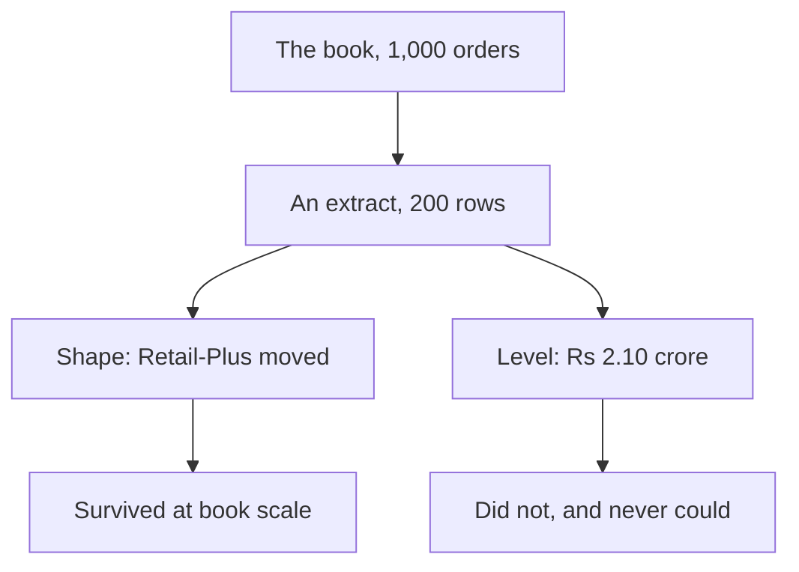
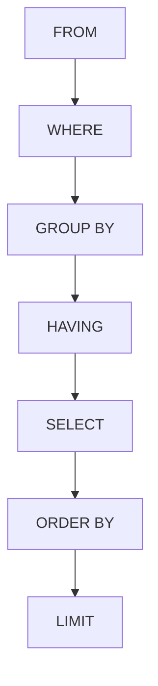

# Study notes: Monday, the warehouse answers

## The situation you were in

Anand Iyer accepted your growth note and then changed the job. He did not ask for a better
analysis; he asked for the analysis to stop depending on you. Three phrases in his message carried
the whole requirement: every Monday, from the warehouse itself, nothing a person can mistype.

Each phrase rules something out. "Every Monday" rules out a script somebody has to remember to
run. "From the warehouse itself" rules out a CSV that left the database and aged. "Nothing a
person can mistype" rules out a cell somebody edits after the fact. What survives all three is a
query, which is why today was about queries rather than about SQL.

## The thing that happened first

The platform lead said the warehouse held a thousand orders. Last week's file held two hundred
rows. Running last week's headline against the warehouse returned Rs 10.00 crore for Q1 where your
note to Meera had said Rs 2.10 crore.

Neither number was wrong. Last week's file was an extract the data team pulled so the room could
start before anybody had database access, and a sample's total is a sample's total.



The distinction is worth more than the day's syntax. A sample is trustworthy about structure long
before it is trustworthy about level, and an analyst who says which of the two they are claiming
is a different kind of colleague from one who is simply never questioned.

Retail-Plus order count fell 34.9 percent against Retail-Core's 3.0 at full scale, which is the
same finding the sample carried. The story held. Only the size moved.

## The mental model the day was built on

A query describes the result. The server decides how to get it. That single sentence is the whole
difference from last week's accumulator, and it is why a query is shorter than the loop it
replaces.

It is also why nothing in a query tells you the order rows come back in. You never said how, so
the server never promised a walk.

## The order a query runs in

You write `SELECT` first and the server runs it fifth.



Three errors met today all come out of that picture, and none of them needs memorising once the
picture is in your head.

| Error | What the picture says |
|---|---|
| `column "o.channel" must appear in the GROUP BY clause or be used in an aggregate function` | `SELECT` runs after `GROUP BY`, so it had one row per segment to fill and three channels to choose from |
| `aggregate functions are not allowed in WHERE` | `WHERE` runs before `GROUP BY`, so no group existed to count |
| `column "revenue" does not exist` | The alias was created in `SELECT`, which runs after `WHERE` and before `ORDER BY` |

The last one is the clearest evidence that written order and run order differ. The same alias
works in `ORDER BY` and fails in `WHERE`, and the only thing separating them is when they run.

## WHERE against HAVING, in one sentence each

`WHERE` decides whether to keep one row, judged on that row alone, before any grouping exists.

`HAVING` decides whether to keep a whole group, judged on the group, after the grouping has
happened.

That is the entire distinction, and the fact that an aggregate belongs in one and never the other
is a consequence rather than a separate rule.

## LIMIT without ORDER BY

```sql
SELECT order_id, amount FROM orders LIMIT 5;
```

This returns five rows. Which five is the server's business. Two machines can answer differently,
and the same machine can answer differently after an index is added or a table is vacuumed.

The dangerous part is that it runs perfectly well. A query that errors teaches you something. A
query that quietly returns five arbitrary rows labelled as your top five does not.

A colleague who shows you a run where rows came back in insertion order has observed one run. The
server promised nothing.

## A CTE is a named step

```sql
WITH q1 AS (
    SELECT c.segment, sum(o.amount) AS revenue
    FROM orders o JOIN customers c USING (customer_id)
    WHERE o.quarter = 'Q1'
    GROUP BY c.segment
)
SELECT * FROM q1 ORDER BY revenue DESC;
```

`WITH name AS (query)` gives a result a name for the rest of the statement. That is all it
promises. It is not a guarantee about how the work is done, and the planner may fold the block
into the outer query entirely.

Write CTEs for the person auditing the query. Anand's analyst reads every line and will not have
you beside him, and a three-level nested subquery is correct and unreadable. Unreadable work gets
trusted on faith or rejected on faith, and neither one is an audit.

## The comment line that is half the deliverable

```sql
-- Q5: orders per customer per segment per quarter. Frequency, which is the branch that
--     moved in Q2. Denominator is customers who ordered, not customers on the books.
```

The comment states the question and the denominator. It is the first thing a reviewer reads and
the thing most working queries are missing. Most disagreements about a number turn out to be
disagreements about its denominator, discovered late.

## Check yourself without writing anything

Cover the answers and say these out loud.

1. Why is `WHERE count(*) > 5` refused, in one sentence that does not use the word "rule"?
2. An alias works in `ORDER BY` and fails in `WHERE`. What single fact explains both?
3. `GROUP BY segment, quarter` on four segments and two quarters. How many rows, and what would
   make it fewer?
4. Your `LIMIT 5` and a colleague's `LIMIT 5` return different rows from the same table. Who is
   wrong?
5. What does a CTE promise, and what does it not?
6. Last week you told Meera Q1 was Rs 2.10 crore. The warehouse says Rs 10.00 crore. Write the
   sentence you send her.

Answers to four and six are the ones worth checking against somebody else, because both have a
tempting wrong version that sounds confident.

## Reading, in the order that helps

1. SQLBolt lessons 1 to 5, which run in the browser: <https://sqlbolt.com/> (verified 13 Sep 2026)
2. pgtutorial.com, the `SELECT` and `GROUP BY` pages, when a clause needs a second
   explanation: <https://www.pgtutorial.com/> (verified 13 Sep 2026)
3. freeCodeCamp.org, "Learn PostgreSQL Tutorial, Full Course for Beginners", for anyone who
   wants the whole picture said aloud:
   <https://www.youtube.com/watch?v=qw--VYLpxG4> (verified 13 Sep 2026)

## What tomorrow does to today

Anand reads your suite and replies that booked revenue is not collected revenue. The payments
table joins the warehouse, and the first honest-looking join you write will return a number that
is roughly twice the truth.

Today's habit of naming the denominator is what catches it.
