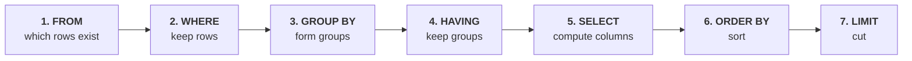

# The Monday numbers, from the warehouse

**Week 2, Monday. Study notes, read after the session.** Last week's revenue tree, rebuilt as
queries the warehouse runs every Monday, written so that an analyst who has never met you can rerun
and audit every line. Reading time: about 25 minutes.

---

## What you can now do

1. You can connect to the Kalpa warehouse from VS Code, open a `.sql` file and run one block
   against the database, and read a schema before you trust a number from it.
2. You can check a new source against an old one on the number that should carry over, which is a
   rate, and say why the totals are allowed to differ.
3. You can say what `count(*)`, `count(column)` and `count(DISTINCT column)` each count, and choose
   the one a question needs.
4. You can group with `GROUP BY`, filter rows with `WHERE` and groups with `HAVING`, and explain
   both from the order a query runs in.
5. You can divide two counts without losing the fraction, and check any ratio by multiplying it
   back.
6. You can write a comparison as named steps with `WITH`, and say who is inside an average before
   you quote it.
7. You can order a list so that two runs return the same rows, and say why a table on its own has no
   order.

---

## Where this sits

**What the session covered.** Worked in full: Anand's ask and what "from the warehouse itself" rules
out; the first connection and the schema; the book checked against Week 1; three counts of
"customers"; an audit sample that could not be rerun; `GROUP BY` per segment and quarter; integer
division; `WHERE` against `HAVING`; a subquery for a share; two CTEs for the quarter comparison;
`AVG` and the members it skipped; and the Monday suite of six queries. Mentioned only: the
lookup line that brings each order its customer's segment, which is tomorrow's topic in full.

**What came before.** Week 1 built the tree from files: an extract of the two quarters, cleaned and
reconciled to Rs 1.90 crore for Q1 and Rs 1.87 crore for Q2, a fall of 1.6 percent, with Retail-Plus
members ordering less often. Every right answer today was already known; the attention went to the
language.

**What comes next.** Tuesday joins payments to orders to separate booked revenue from collected
revenue, and a join is the first operation this week that can change the number of rows. Wednesday
ranks members and compares a month with the one before it. Thursday rebuilds the same tree in
pandas, so the room sees three tools answer one question.
The afternoon closed on a tentative IITGN faculty session, which these notes do not cover.

---

## The picture to remember: the order a query runs in


```mermaid
flowchart LR
    F["<b>1. FROM</b><br/>which rows exist"] --> W["<b>2. WHERE</b><br/>keep rows"] --> G["<b>3. GROUP BY</b><br/>form groups"] --> H["<b>4. HAVING</b><br/>keep groups"] --> S["<b>5. SELECT</b><br/>compute columns"] --> O["<b>6. ORDER BY</b><br/>sort"] --> L["<b>7. LIMIT</b><br/>cut"]
```

You write `SELECT` first. The database runs `FROM` first. Almost every error a beginner meets in SQL
is explained by this one drawing, and an analyst auditing your query reads it in this order,
whatever order you typed it in. A query describes the result you want; the database decides how to
fetch it, and it is free to fetch it in any way that gives the same result.

---

## Anand's ask, and what it rules out

> "I want these numbers every Monday, for every segment and channel, computed from the warehouse
> itself. No notebooks, no exports, nothing a person can mistype." Anand Iyer, CFO, Kalpa Retail

Three things are ruled out, and one thing is not. A number on Anand's sheet may no longer come from
a notebook on somebody's laptop, from an export that is stale the day it lands, or from a value
copied by hand. Exploration still belongs in a notebook: charts, tests and the first look at a
question stay in Python. The rule is about the reported number, which now comes from a saved query
that runs against the book every Monday, unchanged, and that an analyst can read line by line.

That second half is the real change. Last week, the reader of your work was Meera, who wanted one
page. This week the reader is an analyst who wants to rerun every number and check it with a
calculator. Everything else in these notes follows from writing for that reader.

---

## Round 1, worked: is the warehouse the book?

**The question.** Before one number from the warehouse goes on Anand's sheet, does the warehouse
tell the story Week 1 defended?

**The first contact.** The Codespace starts a PostgreSQL 16 server and loads the warehouse into a
database called `kalpa`. The first query any analyst runs on a new source reads the schema: seven
tables, of which `orders` and `customers` carry today's tree. An order carries its customer, date,
quarter, channel, amount and status; the segment lives on the customer.

**The demonstration.** Three clauses answer the first leaf:

```sql
-- How many orders did Q1 book, and for how much? Booked means every status.
SELECT count(*) AS orders, sum(amount) AS revenue
FROM   orders
WHERE  quarter = 'Q1';
```

Q1 books 538 orders and Rs 10,00,00,000; Q2 books 462 orders and Rs 9,84,00,000. Week 1's extract
said Rs 1.90 crore and Rs 1.87 crore. The totals differ by about five times, because last week's
files were an extract of 186 cleaned orders and the warehouse holds the whole book of 1,000. The
rate agrees: both fall 1.6 percent. Retail-Plus orders fall 34.9 percent in the book against 35.0 in
the extract. When a source changes, the number that must carry over is the rate, and here it does,
so the warehouse is the source from now on.

**The trap: 1,000 customers.** The next leaf is customers. The quickest query is
`SELECT count(*) AS customers FROM orders;`, and it prints 1,000. Divide the orders by it and orders
per customer reads 1.00: every customer bought once and never came back. On Anand's sheet that says
the frequency branch, the one Meera was told to fix, has nothing in it to fix.

**Why it is wrong.** `count(*)` counts rows, and a row of `orders` is an order. The label
`AS customers` is a promise the query does not keep; the database prints whatever name you give it.

**The check.** Count the same table three ways, each named for what it counts:

| Count | Result | It answers |
|---|---|---|
| `count(*)` over orders | 1,000 | How many order rows |
| `count(DISTINCT customer_id)` over orders | 301 | How many customers bought in the window |
| `count(*)` over customers | 340 | How many members Kalpa holds |

**The fix, and what changed.** `count(DISTINCT customer_id)` counts each person once. The leaf moves
from 1,000 customers to 301, and 699 people who do not exist leave the sheet; orders per customer
moves from 1.00 to 3.32 over the two quarters. The 340 is honest too, for a different question:
the 39 members who bought nothing in the window are still Kalpa's members.

**The second trap: a sample nobody can reproduce.** Anand's analyst will trace five delivered Q2
app orders against the ERP, and he will rerun your query to get the same five. `LIMIT 5` with no
`ORDER BY` returns KR-00542, 544, 545, 546 and 547, which total Rs 3,900. Overnight the warehouse
reloads and rewrites two of those rows with identical values. The same query now returns KR-00545,
546, 547, 549 and 553, which total Rs 4,590. His audit reports a Rs 690 disagreement on a sample that
should have been identical, and no amount in the book changed.

**Why it is wrong.** A table has no order. `LIMIT` returns the first rows the database happens to
reach, which today follows where rows sit on disk. The PostgreSQL documentation puts it without
hedging: without an `ORDER BY` that makes the order unique, `LIMIT` returns "an unpredictable subset
of the query's rows". The fix is `ORDER BY order_id LIMIT 5`, ordered on a column no two rows share;
ordering by `amount` alone is not enough, because two orders in that very list share Rs 970.

> **Kavya's review.** Every count says what it counts, and every list says how it is ordered. Name
> both in the comment above the query, because that comment is the first line the analyst reads.

---

## Round 2, worked: per segment and per quarter

**The question.** Anand asked for every segment. The sheet is the tree repeated for four segments
and two quarters: eight rows of customers, orders per customer and revenue per order.

**The demonstration.** `GROUP BY` collapses rows into one row per group, and every aggregate in the
`SELECT` runs inside its group. The segment lives on the customer, so each order borrows it with one
lookup line, `JOIN customers c USING (customer_id)`; every order has exactly one customer, so the row
count stays 1,000.

```sql
SELECT c.segment, o.quarter,
       count(*) AS orders, count(DISTINCT o.customer_id) AS customers, sum(o.amount) AS revenue
FROM   orders o
JOIN   customers c USING (customer_id)
GROUP  BY c.segment, o.quarter
ORDER  BY c.segment, o.quarter;
```

Eight rows, which add back to 1,000 orders and Rs 19.84 crore. That sum is the first check on any
grouped result: groups that do not add back to the table they came from have lost or doubled rows.

**Met on the way, two minutes.** Grouping by quarter alone while selecting the segment is refused:
`column "c.segment" must appear in the GROUP BY clause or be used in an aggregate function`. Each
quarter's group holds four segments, and the database will not pick one for you. Add the segment to
`GROUP BY`. This is an error that prints no number, so nobody ships it, and it takes two minutes.

**The trap: a ratio the database rounded without saying so.** Orders per customer, written
`count(*) / count(DISTINCT customer_id)`, prints:

| Segment | Q1 | Q2 |
|---|---|---|
| Retail-Core | 1 | 2 |
| Retail-Plus | 2 | 1 |

Read aloud, Retail-Plus frequency halved and Retail-Core frequency doubled. The head of Retail-Plus
hears that her members order once a quarter, and the loyalty budget looks as if it should follow
Retail-Core.

**Why it is wrong.** Both counts are integers, and Postgres divides two integers as integers,
truncating toward zero: 140 orders over 76 customers prints 1. Nothing on the grid warns you.

**The check.** Multiply the ratio back by the customers. A right ratio gives the orders: 1.84 times
76 is 140. The printed 1 times 76 is 76, so the ratio accounts for 76 of Retail-Plus's 140 Q2
orders, and the same check fails in all eight rows.

**The fix, and what changed.** Make one side numeric and round on purpose:
`round(count(*)::numeric / count(DISTINCT customer_id), 2)`. Retail-Plus falls from 2.36 to 1.84,
22 percent, where the hurried sheet said it halved; Retail-Core moves from 1.95 to 2.01, 3 percent,
where the hurried sheet said it doubled. The decision flips back: Retail-Plus is the segment to fix,
and no budget moves.

**Filtering groups.** Week 1 Thursday warned against a rate built on twelve orders, so the suite
flags any segment-quarter with fewer than 30 orders. The count exists only after grouping, so the
filter is `HAVING count(*) < 30`, which returns one row: Student in Q1, with 27 orders. `WHERE
count(*) < 30` is refused, because `WHERE` runs before any group exists. A condition on a row, such
as `status = 'delivered'`, belongs in `WHERE`, where it throws rows away before the work of grouping
them; on delivered orders only, Retail-Plus still falls, from 1.87 to 1.56 orders per customer.

> **Kavya's review.** Show me the orders and the customers beside every orders-per-customer figure,
> so I can divide them myself.

---

## Round 3, worked: the two quarters as named steps

**The question.** Which branch of the tree moved from Q1 to Q2, in which segment, written so the
analyst can read it top to bottom.

**A query inside a query.** Anand's first question on any split is how much of the book each part
carries. The share divides each segment's revenue by the total, and the total is a query of its own,
written in brackets:

```sql
round(100 * sum(o.amount) / (SELECT sum(amount) FROM orders), 1) AS share_pct
```

Business carries 99.1 percent of the rupees and the consumer segments carry most of the customers,
which is why the tree is read per segment and never from the total.

**Named steps.** A CTE is a named step in a `WITH` block. Step `q1` computes the Q1 leaves per
segment, step `q2` repeats it for Q2 with only the filter changed, and the last `SELECT` lines them up
with `FROM q1 JOIN q2 USING (segment)`. A later step can read every earlier step and every table.
Identical steps are the point: the analyst audits one and trusts both.

The Retail-Plus row reads: customers who bought 91 then 76, orders per customer 2.36 then 1.84,
revenue per order Rs 2,725 then Rs 2,953, revenue 29.4 percent down. Split one branch at a time,
customers first, then frequency, then order value, the Rs 1.72 lakh fall is Rs 96,555 from fewer
customers, Rs 1,07,784 from fewer orders each, and Rs 31,949 back from bigger orders. The order of
the steps changes the split slightly, so a bridge always states its order. Frequency is the largest
branch, which is Week 1's lever at warehouse scale; the book also shows fewer members buying at all,
which an extract of 22 members could not show.

**The trap: an average that skips people.** The head of Retail-Plus asks how spend per member moved.
The hurried analyst builds one row per member with `sum(CASE WHEN quarter = 'Q2' THEN amount END)`,
then averages the column. The result: Rs 6,437 in Q1 and Rs 5,439 in Q2, a fall of 15.5 percent, a
soft quarter worth a reminder email.

**Why it is wrong.** A `CASE` with no `ELSE` gives NULL, and a sum of nothing but NULLs is NULL, so a
member with no Q2 order carries NULL in the Q2 column. `avg` skips NULLs without saying so: it
divides by the members who have a value. The mechanism on three invented values, 100, NULL and 200:
`avg` returns 150, `count(*)` returns 3 and `count(x)` returns 2. The PostgreSQL documentation
states it for every aggregate except `count(*)`: the functions work on the non-null input values.

**The check.** Count who is in each average: 107 members bought in either quarter, 91 have a Q1
value and 76 have a Q2 value. The Q2 average silently left out 31 members, the ones who stopped
buying, who are exactly the ones the head of Retail-Plus most needs to hear about.

**The fix, and what changed.** `coalesce(sum(...), 0)` says on purpose that a member who bought
nothing spent Rs 0, and the comment says the denominator is every member who bought in either
quarter. Spend per member falls 29.4 percent, from Rs 5,474 to Rs 3,863: nearly twice the hurried
figure, and exactly the segment's revenue fall, as it must be when both averages divide by the same
107 people. The light touch becomes a retention problem.

> **Kavya's review.** When a number comes out of an average, say who is in it. That is the difference
> between a 15 percent wobble and a 29 percent problem.

---

## The Monday suite, and the sentence to Anand

The afternoon assembled the three rounds into six queries the analyst reruns every Monday, each with
one comment line that states the question, the reading of revenue and the denominator:

| Query | What it answers |
|---|---|
| 1. The book | Orders and revenue per quarter, and the change against Q1: 1.6 percent down |
| 2. Customers | Buyers per quarter, 244 and 227, against 340 on the book |
| 3. The leaves | Customers, orders per customer, revenue per order and revenue, per segment and quarter |
| 4. The typical order | The median beside the mean, because one bulk order drags a mean |
| 5. Thin cells | The segment-quarters under 30 orders: Student in Q1 |
| 6. What moved | Two CTEs, the percentage change of each branch per segment |

The five rules it is audited against: revenue is booked revenue and the comment says so; a customer
is counted once; every ratio is divided in numeric and rounded on purpose; every list has an `ORDER
BY` on a unique key; a step that feeds another step is a named CTE.

The sentence to Anand: booked revenue fell 1.6 percent from Q1 to Q2, the same fall last week's
extract showed, so the warehouse agrees with the note Meera accepted. The fall sits in Retail-Plus,
down 29.4 percent: its members ordered less often, 2.36 to 1.84 per quarter, and fewer bought at all,
91 to 76; the other segments moved under 2 percent or grew. This is booked revenue, and Student's Q1
rate rests on 27 orders. Tomorrow's step is collected revenue.

---

## Four lines to carry

- Count what you mean: COUNT(DISTINCT customer_id) counts people; count(*) counts rows.
- Divide in numeric and round on purpose: integers divide as integers.
- Name who is averaged: AVG skips NULLs, so say whether a NULL means zero.
- Order every list on a unique key: a table has no order.

---

## Where this shows up in the work

Every analytics team that serves a finance function keeps its reported numbers as versioned
queries, one definition per number, and every dashboard reads the query rather than a copy of it.
Tools such as dbt formalise the habit, and the habit comes first. The four traps are the four most
common ways such a number goes quietly wrong: a "users" tile that counts events, a conversion rate
computed in integers, an average revenue per active user that rises while the business shrinks
because lapsed users left the denominator, and a sample or a top-ten list that changes between two
runs of the same query.

---

## Try this yourself

Three questions, answered in your head before you run anything. The answers are under them.

1. `SELECT count(*), count(customer_id), count(DISTINCT customer_id) FROM orders;` on the warehouse.
   Which of the three differ, and why?
2. `SELECT 7 / 2, 7.0 / 2, round(7::numeric / 2);` What does each print?
3. A member step holds 50 members, and `count(q2_spend)` returns 42. How many members does
   `avg(q2_spend)` leave out, and what one word in the query brings them back?

**Answers.** 1: the first two are both 1,000, because every order carries a customer id, and the
third is 301. 2: 3, 3.5000000000000000 and 4, since round sends 3.5 up. 3: eight members, and
`coalesce` brings them back as Rs 0.

---

## Where this gets tested

### In the interview

The first five are the row's anchors. The last six are case-style follow-ups this pack adds, tagged
by this programme's own calibration for candidates with up to three years of experience.

**[S] WHERE against HAVING, one sentence each.** "`WHERE` filters rows before they are grouped, so it
can only test a row's own columns. `HAVING` filters groups after `GROUP BY`, so it can test an
aggregate such as `count(*)`. When a condition could go in either, like a segment name, I put it in
`WHERE`, because it throws rows away before the work of grouping them."

**[S] Explain the logical order in which a SQL query executes.** "FROM and its joins build the rows,
WHERE keeps some of them, GROUP BY forms groups, HAVING keeps some groups, SELECT computes the output
columns, DISTINCT removes duplicates, ORDER BY sorts and LIMIT cuts. It is the logical order: the
planner may execute differently as long as the result is the same. It explains the classic errors:
why a SELECT alias cannot be used in WHERE, why `WHERE count(*)` is refused, and why every selected
column must be grouped or aggregated."

**[F] Why would you compute a KPI in the warehouse rather than in a notebook?** "Because the warehouse
is the one copy everybody reads. A saved query runs against the book, unchanged, every Monday, and an
auditor can read its exact text; a notebook works on an export that ages the day it lands, and one
mistyped cell changes the number without a trace. I still explore and chart in a notebook, but the
number that reaches Finance comes from a query in version control."

**[F] What does LIMIT without ORDER BY return?** "Whichever rows the database reaches first, which
SQL leaves undefined. In Postgres it usually follows storage order, so it looks stable until a
reload, an update or a different plan moves the rows. For a top five or a sample someone will rerun,
I order by a column that makes the order unique, then limit; ordering by a column with ties still
lets two rows swap."

**[D] A stakeholder's analyst must audit your query; what changes in how you write it, and what would
you refuse to compute in a notebook?** "I write it to be read: one named step per idea as a CTE, a
comment on each saying what it computes and what it divides by, explicit numeric division, an ORDER BY
on every list, and a check query beside it that adds the groups back to the total. I refuse to compute
the reported KPI in a notebook on an export, because the analyst cannot rerun it against the book. The
notebook is where I explore; the query is what I hand over."

**[F] Your orders-per-customer column reads 1 for a segment; what do you check first?** "Integer
division. Two counts are integers, and Postgres truncates their quotient, so I multiply the ratio back
by the customers: if it does not give the orders, the fraction was dropped. The fix is a numeric cast
on one side and a deliberate round."

**[F] Your KPI dropped 30 percent overnight and the data did not change; what in the query do you
suspect?** "Something in the query that depends on more than the data: an unordered LIMIT, a filter on
a date relative to today, a changed definition, or a denominator that shifted, such as an average that
started skipping a new batch of NULLs. I rerun last week's query text on today's data and today's text
on last week's, which separates a change in the data from a change in the query."

**[F] An average moved, but the total did not; how can that happen?** "The denominator changed. If
customers with no activity become NULL and the average skips them, the average rises while the total
stands still, or the reverse when they come back. I put `count(*)` beside the average and state who is
in it."

**[S] COUNT(*), COUNT(column) and COUNT(DISTINCT column): what does each count?** "Rows; rows where the
column is not NULL; and the number of different non-NULL values. On an orders table, the first two are
usually equal and count orders, and the third counts customers."

**[D] Two analysts report different customer counts for the same quarter; how do you settle it?** "I
ask each for the query text, then write the definitions side by side: rows or distinct ids, buyers or
members on the book, which statuses, which dates. Usually both are right for different questions. We
agree one definition per question, name it in the comment, and store the query where everyone reads it."

**[F] When would you use a CTE instead of a subquery?** "Both compute the same thing. A CTE names the
step and puts it first, so the query reads top to bottom in the order the logic runs, and a step can
be read twice. A subquery is fine for a one-off value such as a share's denominator."

### On Saturday

The Week 2 recap paper's Monday items test the logical order, WHERE against HAVING and LIMIT without
ORDER BY, as fill-in, true-or-false, choice and ordering items from the week's item bank.

---

## Glossary

| Term | What it means here | Where it appeared | Example |
|---|---|---|---|
| Warehouse | The database every reported number is computed from, queried in place | Half one, S1 | The `kalpa` database in the Codespace |
| Schema | The tables and columns a database holds, with their types | Round 1 | `orders` carries seven columns |
| Query | A description of the result you want; the database decides how to fetch it | Round 1 | `SELECT count(*) FROM orders;` |
| Logical order | The order a query's clauses run in, whatever order they are written in | Half one, S6 | FROM, WHERE, GROUP BY, HAVING, SELECT, ORDER BY, LIMIT |
| Distinct count | The number of different values in a column | Round 1 | 301 customers who bought |
| GROUP BY | One output row per group, each aggregate computed inside its group | Round 2 | Eight rows per segment and quarter |
| HAVING | A filter on groups, after GROUP BY | Round 2 | `HAVING count(*) < 30` |
| Integer division | Two integers divided to an integer, truncating toward zero | Round 2 | `140 / 76` is 1 |
| Subquery | A query inside a query | Round 3 | The total a share divides by |
| CTE | A named step in a WITH block that later steps can read | Round 3 | `WITH q1 AS (...), q2 AS (...)` |
| coalesce | The first value that is not NULL | Round 3 | `coalesce(q2_spend, 0)` |
| Monday suite | The six queries the analyst reruns every Monday | Half two | `sql/C2_W02_D01_02_monday_suite_STUDENT.sql` |

---

## Go deeper

PostgreSQL 16 documentation, LIMIT and OFFSET, https://www.postgresql.org/docs/16/queries-limit.html (verified 29 Sep 2026)

PostgreSQL 16 documentation, aggregate functions, https://www.postgresql.org/docs/16/functions-aggregate.html (verified 29 Sep 2026)

PostgreSQL 16 documentation, WITH queries, https://www.postgresql.org/docs/16/queries-with.html (verified 29 Sep 2026)

PostgreSQL 16 documentation, mathematical operators, https://www.postgresql.org/docs/16/functions-math.html (verified 29 Sep 2026)

SQLBolt, Lesson 12, order of execution of a query, https://sqlbolt.com/lesson/select_queries_order_of_execution (verified 29 Sep 2026)

pgtutorial.com, the GROUP BY page, https://www.pgtutorial.com/postgresql-tutorial/postgresql-group-by/ (verified 29 Sep 2026)

Luke Barousse, SQL for Data Analytics, a video course, https://www.youtube.com/watch?v=7mz73uXD9DA (verified 29 Sep 2026)
