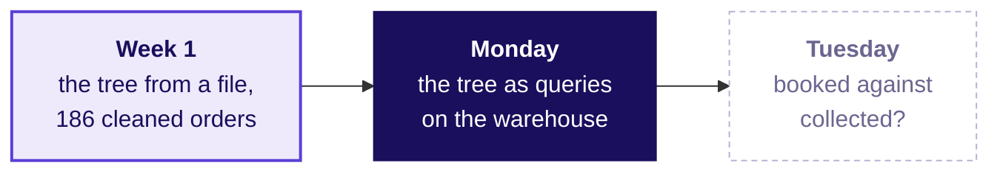
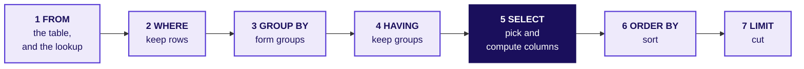

# Can the warehouse itself give Anand the Monday numbers, every segment, every week?

**Week 2, Monday. Study notes, read after the session.** Reading time: about 25 minutes.

Last week the team's note carried Meera Raghavan's growth review: Kalpa Retail's CEO accepted "real,
modest, fix frequency" and parked Marketing's Rs 12 crore acquisition budget. Then Anand Iyer, Kalpa
Retail's finance controller, asked for something that changes the team's job:

> "I want these numbers every Monday, for every segment and channel, computed from the warehouse
> itself. No notebooks, no exports, nothing a person can mistype. Our data team will give you read
> access to Postgres."

The data platform lead added: "The warehouse holds the same orders and customers you cleaned last
week, one thousand orders for the two quarters, already de-duplicated. Query it; do not export it."
You deliver the Monday suite, and Anand's analyst audits it line by line. Kavya Nair, the team's
senior analyst, reviews each chapter's answer before it leaves the team.

---

## What can you do now that you could not this morning?

1. You can connect to Kalpa's warehouse from VS Code, run one block of a `.sql` file and read the
   schema before you trust a number from it.
2. You can say what a count counts and compare two sources leaf by leaf, as changes.
3. You can group with `GROUP BY`, keep groups with `HAVING`, divide in `numeric` and check a ratio by
   multiplying it back.
4. You can write a comparison as named steps and say who is inside an average.
5. You can say which numbers add across quarters and which must be counted again.
6. You can make a run repeat, with the book's fingerprint and a sort on a column no two rows share.

---

## Where does today sit, and what does Anand's sheet measure?

**What the session covered.** Six chapters on one Kalpa case, each worked in full with its options,
its trap and a second route. Three tools were only named, each as the switch a later fact would
trigger: a saved view, `GROUPING SETS`, and write, audit, publish. The escalated case's first two
parts ran in the afternoon; its last three run in the practice lab with the interview drill.

**What the sheet measures.** The book is the warehouse's two quarters of orders, the one copy
everybody reads; Q1 is April to June 2026 and Q2 is July to September 2026. Revenue is booked
revenue, every order at its amount, whatever its status, and the sheet carries Week 1 Monday's tree:
customers who bought, times orders per customer, times revenue per order. Last week's books, Rs 1.90
crore for Q1, described the 186-order extract the team was handed; from today the book of record is
the warehouse. Kalpa's segments are Business (corporate buyers whose orders are worth lakhs of rupees
or more), Retail-Core (everyday shoppers), Retail-Plus (the paid membership tier) and Student.

```mermaid
flowchart LR
    A["<b>Week 1</b><br/>the tree from a file,<br/>186 cleaned orders"] --> M["<b>Monday</b><br/>the tree as queries<br/>on the warehouse"]
    M --> T["<b>Tuesday</b><br/>booked against<br/>collected?"]
    classDef known fill:#EEEAFB,stroke:#5B3FD6,color:#1A0F5C,stroke-width:2px
    classDef bet fill:#1A0F5C,stroke:#1A0F5C,color:#FFFFFF
    classDef unknown fill:#FFFFFF,stroke:#B8B2D6,color:#6B6690,stroke-dasharray:4 3
    class A known
    class M bet
    class T unknown
```

**The outcome tie.** Tuesday's booked-against-collected report starts from today's Q2 booked revenue,
Rs 9,84,00,000 on 462 orders, and the Week 2 Saturday paper asks today's questions as items: the run
order, `WHERE` against `HAVING`, the `GROUP BY` refusal and `LIMIT` without `ORDER BY`.

**What was left out.** Channels wait for the second case and Finance's delivered-only definition for
the escalated case. Week 1 met both measures, booked revenue and delivered revenue, and Thursday's
per-member work used delivered; today's suite starts from booked revenue, the reading of last week's
tree, and the escalated case reruns it on delivered. Joins arrive tomorrow; today used one join line
only to look up each order's segment. The tentative IITGN faculty session after the afternoon's
chapter runs on a topic of its own.

---

## In what order does the database run a query's clauses, drawn once?

```mermaid
flowchart LR
    F["<b>1 FROM</b><br/>the table,<br/>and the lookup"] --> W["<b>2 WHERE</b><br/>keep rows"] --> G["<b>3 GROUP BY</b><br/>form groups"] --> H["<b>4 HAVING</b><br/>keep groups"] --> S["<b>5 SELECT</b><br/>pick and<br/>compute columns"] --> O["<b>6 ORDER BY</b><br/>sort"] --> L["<b>7 LIMIT</b><br/>cut"]
    classDef known fill:#EEEAFB,stroke:#5B3FD6,color:#1A0F5C,stroke-width:2px
    classDef bet fill:#1A0F5C,stroke:#1A0F5C,color:#FFFFFF
    class F,W,G,H,O,L known
    class S bet
```

Call it the run order. A query is written SELECT, FROM, WHERE, GROUP BY, HAVING, ORDER BY, LIMIT, and
the database runs it in the order of the arrows. It is the logical order: the database may fetch rows
any way it likes, so long as the result is the one this order describes. The `GROUP BY` refusal,
the choice between `WHERE` and `HAVING`, and an unsorted `LIMIT` all follow from it. `WHERE` cannot test a count that does not exist yet, `SELECT`
cannot print a column the groups do not pin down, and `LIMIT` cuts after `ORDER BY`, so a limit with
no sort cuts wherever the rows happened to fall.

**CALLBACK.** Week 0's SQL brush-up showed `SELECT`, `WHERE`, `ORDER BY` and `GROUP BY` on a practice
database; today they run on Kalpa's book.

---

## Chapter 1. How many orders, rupees and customers did each quarter book, counted where the book lives?

**Who needs the answer.** Anand signs the Monday sheet and his analyst audits every query behind it.
A customer count that is really a count of orders says nobody buys twice, which would reopen the
Rs 12 crore acquisition budget Meera parked last week.

**The questions on the way.**

1. Where could the Monday numbers be computed: an export, a query or a view?
2. What does the warehouse hold, and where does each leaf of the tree live?
3. How many orders and rupees did each quarter book?
4. How many customers bought in each quarter?
5. Do the raw rows, counted in Python, give the same leaves?

**IN THE FIELD.** JPMorgan Chase's task force on its 2012 trading losses found a value-at-risk model
that "operated through a series of Excel spreadsheets, which had to be completed manually, by a
process of copying and pasting data from one spreadsheet to another", one of the operational issues
its review turned up (report of 16 January 2013, page 124). The losses reached about $5.8 billion by
30 June 2012 (page 7).

### Where could the Monday numbers be computed: an export, a query or a view?

| Option | Sized on this book, every Monday |
|---|---|
| A. Export the tables, compute in pandas | 1,000 order rows leave the warehouse, since the quarter totals read only orders, and the analyst can rerun only the copy |
| B. A `.sql` file run in place | 2 rows come back, and a renamed column stops it with an error |
| C. A saved view | 2 rows; it follows a rename and needs the right to create objects |

The call is B, since the team has read access only. A schema granted once the suite settles would
switch it to C, because Postgres then refuses a change that would break the Monday numbers.

### What does the warehouse hold, and where does each leaf of the tree live?

Seven tables, listed from `information_schema`, the catalogue every Postgres database keeps about
itself. Every leaf comes from `orders`, whose `amount` is stored as `numeric`; the segment lives on
`customers`, and the other five tables arrive later in the week.

### How many orders and rupees did each quarter book?

Q1 booked Rs 10,00,00,000 on 538 orders and Q2 Rs 9,84,00,000 on 462, down 1.6 percent like the
extract; revenue per order rose from Rs 1,85,874 to Rs 2,12,987.

### How many customers bought in each quarter?

The quickest query, `count(*) AS customers`, prints 538 and 462 at 1.00 order each: nobody came back,
the frequency branch Meera was told to fix is empty, and the Rs 12 crore case for new customers
returns. `count(*)` counts rows, a row of `orders` is an order, and the label `AS customers` names
the column and changes nothing the query counts. The check counts the orders table two ways and sets
the customer table's count beside them, each named for what it counts: 1,000 order rows and 301
customers who bought, beside 340 customers on the customer table. The fix,
`count(DISTINCT customer_id)` per quarter, gives 244 and 227 customers at 2.20 and 2.04 orders each,
and removes 294 and 235 customers who do not exist.

### Do the raw rows, counted in Python, give the same leaves?

Yes. The second route pulls all 1,000 rows into Python and counts with a set of customer ids and a
running sum: the same orders, customers and rupees, after moving 1,000 rows where the query moved two.

> **Kavya's review.** "Every count says what it counts, in its name and in the comment above it. A
> count named customers that counts rows is the one number an auditor finds first."

Q1 booked Rs 10,00,00,000 on 538 orders from 244 customers who bought, and Q2 Rs 9,84,00,000 on 462
orders from 227, down 1.6 percent.

---

## Chapter 2. Does the warehouse tell the same story as the file Meera's decision rested on?

**Who needs the answer.** Anand wants to know which story his sheet signs for, and Meera parked the
Rs 12 crore budget on last week's finding that customers held steady while each ordered less often.
If the book says otherwise and nobody writes it down, that decision stays parked on a number the
warehouse does not support.

**The questions on the way.**

1. How can two sources of different sizes be compared fairly?
2. Does last week's file still give last week's numbers?
3. Which leaves agree once each is read as a change from Q1 to Q2?
4. Did the customer leaf agree?
5. Where did the book's 17 fewer Q2 customers come from?
6. What goes on Anand's sheet about last week's note?

**IN THE FIELD.** Airbnb's data team wrote that, years earlier, when the chief executive asked which
city had the most bookings the previous week, "Data Science and Finance would sometimes provide
diverging answers using slightly different tables, metric definitions, and business logic" (The
Airbnb Tech Blog, "How Airbnb achieved metric consistency at scale", 30 April 2021).

### How can two sources of different sizes be compared fairly?

| Option | Sized on these two sources |
|---|---|
| A. The two totals | 4 numbers, which catch a different fall and nothing else |
| B. Every leaf as a change | 20 numbers, which catch any branch that moved differently |
| C. Order by order, on the id | 186 lookups and 0 found, since the sources share no id |
| D. Last week's notebook on an export | 1,340 rows exported, which the platform lead ruled out |

The call is B, because a change survives a five-fold difference in size. Shared order ids would
switch it to C.

### Does last week's file still give last week's numbers?

Yes: 186 orders, 100 in Q1 and 86 in Q2, worth Rs 1,90,00,000 and Rs 1,87,00,000, and the same 69
customers bought in both quarters.

### Which leaves agree once each is read as a change from Q1 to Q2?

| Leaf | Last week's extract | The warehouse |
|---|---|---|
| Revenue | -1.6% | -1.6% |
| Orders | -14.0% | -14.1% |
| Customers who bought | 0.0% | -7.0% |
| Orders per customer | -14.0% | -7.7% |
| Revenue per order | +14.4% | +14.6% |

Three leaves agree to within half a point; customers and orders per customer part company.

### Did the customer leaf agree?

No. The plausible wrong answer copies last week's branches because the totals matched: "customers held
flat, 0.0 percent; each ordered 14.0 percent less often." Two trees can multiply to one total through
different branches, and 1.000 x 0.860 x 1.144 for the extract and 0.930 x 0.923 x 1.146 for the book
both come to 0.984. The check counts who bought in both quarters: 69 of 69 in the extract against 170
of 301 in the book, so the extract's customer count could never fall. The fix carries the book's own
leaves, 244 customers to 227, down 7.0 percent, with orders per customer down 7.7 percent.

### Where did the book's 17 fewer Q2 customers come from?

From 131 customers moving. The second route builds the change from each customer's own history:
244, less the 74 who bought only in Q1 (`HAVING max(quarter) = 'Q1'` on one row per customer), plus
the 57 who bought only in Q2, is 227. The histories tie out both quarters on their own: 170 who
bought in both plus 74 is Q1's 244, and 170 plus 57 is Q2's 227. `HAVING` tests each
customer's group once it exists, which `WHERE` cannot do, since it sees one order at a time.

### What goes on Anand's sheet about last week's note?

"On the whole book, 7.0 percent fewer customers bought in Q2, and each ordered 7.7 percent less
often; last week's extract held only customers who bought in both quarters."

> **Kavya's review.** "A matching total is one leaf matching. Set every leaf beside its twin before
> you say two sources agree, and when they disagree, say which one is the book."

The warehouse agrees on revenue, down 1.6 percent in both, and parts on customers: 7.0 percent fewer
bought in Q2, and each ordered 7.7 percent less often.

---

## Chapter 3. Which segment carried the fall from Q1 to Q2, and how often did its customers order?

**Who needs the answer.** Anand's sheet carries one line per segment, and the head of Retail-Plus
reads it to decide which members the team works to keep. A wrong frequency sends the retention
budget to the wrong segment.

**The questions on the way.**

1. One query per segment, one grouped query, or pandas?
2. How many orders, customers and rupees did each segment book in each quarter?
3. Which segment-quarters hold too few customers to quote a rate on?
4. How often did each segment's customers order?
5. Does the average of each customer's own order count agree?

**IN THE FIELD.** Eternal, which owns Zomato, Blinkit and District, reported B2C net order value up 54
percent year on year to Rs 31,120 crore in the quarter to 30 June 2026, with food delivery up a little
over 20 percent, quick commerce 86 percent and going-out 60 percent (shareholders' letter for Q1 FY27,
22 July 2026). Kalpa's 1.6 percent fall adds four segments' changes, from Student up 33.9 percent to
Retail-Plus down 29.4.

### One query per segment, one grouped query, or pandas?

| Option | Sized on this book |
|---|---|
| A. One query per segment, each with `WHERE` | 4 queries and 8 rows, and a fifth segment goes missing |
| B. One query, `GROUP BY c.segment, o.quarter` | 1 query and 8 rows, and a new segment appears by itself |
| C. Every order row into pandas | 1,000 rows moved to a copy of the book |
| D. One wide row per segment | 4 rows, and each new measure adds two columns |

The call is B; a one-off question about one segment is A's job. The segment lives on the customer, so
each order looks it up with one line, `JOIN customers c USING (customer_id)`, and joins proper are
Tuesday's topic.

### How many orders, customers and rupees did each segment book in each quarter?

The first try grouped only by quarter and Postgres refused it, `column "c.segment" must appear in the
GROUP BY clause or be used in an aggregate function`, because each quarter's group held four
segments. Grouping by the segment too fixes it in two minutes.

| Segment | Q1 orders, customers | Q2 orders, customers | Revenue, Q1 to Q2 | Change |
|---|---|---|---|---|
| Business | 97, 36 | 91, 35 | Rs 9,90,14,440 to Rs 9,75,84,600 | -1.4% |
| Retail-Core | 199, 102 | 193, 96 | Rs 3,73,070 to Rs 3,66,250 | -1.8% |
| Retail-Plus | 215, 91 | 140, 76 | Rs 5,85,770 to Rs 4,13,380 | -29.4% |
| Student | 27, 15 | 38, 20 | Rs 26,720 to Rs 35,770 | +33.9% |

Business books 99 percent of the rupees and carries Rs 14,29,840 of the Rs 16,00,000 fall; Retail-Plus
lost 75 of the book's 76 fewer orders, and the total hides it.

### Which segment-quarters hold too few customers to quote a rate on?

Student, with 15 customers in Q1 and 20 in Q2, found by `HAVING count(DISTINCT o.customer_id) < 30`,
which tests each group after it exists. Student's 33.9 percent goes on the sheet flagged.

**CALLBACK.** Week 1 Thursday set Kavya's rule: a rate built on fewer than thirty customers goes on
the sheet flagged.

### How often did each segment's customers order?

The quickest query, `count(*) / count(DISTINCT o.customer_id)`, prints Retail-Plus 2 then 1
("halved") and Retail-Core 1 then 2 ("doubled"), and the retention budget drifts to Retail-Core.
Both counts are whole numbers, and "for integral types, division truncates the result towards zero"
(PostgreSQL 16 documentation, mathematical operators). The check multiplies the ratio back by the
customers: 1 times 76 is 76, where the orders are 140. The fix, `round(count(*)::numeric /
count(DISTINCT o.customer_id), 2)` with the counts beside it, gives Retail-Plus 2.36 then 1.84,
down 22.0 percent where the hurried query said 50, and Retail-Core 1.95 then 2.01, up 3.0 where it
said 100.

**WATCH OUT.** A spreadsheet stores every number as a floating-point value, so the Excel habit
expects 1.84 from 140 / 76, and a database with whole numbers on both sides prints 1.

### Does the average of each customer's own order count agree?

Yes. The second route averages each customer's own order count in Python, 471 rows of one customer
and quarter: a sum of counts over a number of customers, both from a different query, divided with
Python's true division. It agrees in all eight segment-quarters, Retail-Plus Q2 at 1.84.

> **Kavya's review.** "Divide in numeric and round on purpose, and keep the counts beside every
> ratio, so anyone reading the sheet can multiply it back."

Retail-Plus carried the fall in orders: its revenue fell 29.4 percent, and its customers ordered 2.36
times each in Q1 and 1.84 in Q2, down 22.0 percent.

---

## Chapter 4. Which branch of each segment's tree moved, and how much less did each Retail-Plus member spend?

**Who needs the answer.** Anand's analyst wants the comparison as one query read from top to bottom,
and the head of Retail-Plus decides how hard to work to keep the tier's members. An average that
leaves out the members who stopped says spend per member fell 15.5 percent when it fell 29.4.

**The questions on the way.**

1. Nested subqueries, named steps or temporary tables?
2. How did customers, frequency and order value move in each segment?
3. How much less did each Retail-Plus member spend?
4. Does revenue over the members who bought, counted on their own, give the same levels?

**IN THE FIELD.** GitLab's data team publishes its SQL style guide: "Prefer CTEs over sub-queries as
CTEs make SQL more readable ...", and each CTE should "perform a single, logical unit of work" (GitLab
handbook, SQL Style Guide). The sentence goes on to call CTEs more performant, a claim the guide makes
with no test beside it; on Postgres the reason to name steps is the reader. The same guide says not
to use `USING` in joins because it "produces inaccurate results in Snowflake"; on Postgres `USING` is
exact, and today's lookup line uses it.

### Nested subqueries, named steps or temporary tables?

A named step, a common table expression or CTE, is written with `WITH` and read by later steps.

| Option | Sized on this suite |
|---|---|
| A. Nested subqueries | 1 statement and 0 rows written, read from the inside out; a renamed `segment` is 4 edits |
| B. Named steps, `WITH ... AS` | 1 statement and 0 rows written, read from the top down; a renamed `segment` is 1 edit |
| C. Temporary tables, one per quarter | 3 statements and 8 rows written, and a new session fails with `UndefinedTable`; 4 edits |

The call is B: "Temporary tables are automatically dropped at the end of a session ..." (PostgreSQL 16
documentation, CREATE TABLE), so the analyst's new session finds nothing. A step many queries reuse
over millions of rows in one long session would be cheaper as a temporary table.

### How did customers, frequency and order value move in each segment?

The steps are `book` (each order with its segment), `q1` and `q2` (each quarter's leaves), and a last
step dividing Q2 by Q1.

| Segment | Customers | Orders per customer | Revenue per order | Revenue |
|---|---|---|---|---|
| Business | 0.972 | 0.965 | 1.051 | 0.986 |
| Retail-Core | 0.941 | 1.030 | 1.012 | 0.982 |
| Retail-Plus | 0.835 | 0.780 | 1.084 | 0.706 |
| Student | 1.333 | 1.056 | 0.951 | 1.339 |

In Retail-Plus, customers fell 16.5 percent and frequency 22.0 percent while revenue per order rose
8.4 percent, and the three multiply back to 0.706, the 29.4 percent fall, so the query checks itself.

### How much less did each Retail-Plus member spend?

The hurried build makes one row per member with `sum(CASE WHEN o.quarter = 'Q1' THEN o.amount END)`
per quarter and averages each column: Rs 6,437 in Q1 and Rs 5,439 in Q2, down 15.5 percent, with
Retail-Core members up 4.3 percent. A `CASE` with no `ELSE` gives `NULL`, a missing value, for a
member with no order that quarter, and `avg` "computes the average (arithmetic mean) of all the
non-null input values" (PostgreSQL 16 documentation, aggregate functions). The check counts who is
inside each average: 107 members in the step, 91 inside Q1's and 76 inside Q2's; on three invented
values, 100, `NULL` and 200, `avg` gives 150. The fix writes Rs 0 on purpose with
`coalesce(..., 0)`: Rs 5,474 then Rs 3,863 over the same 107 members, down 29.4 percent, and
Retail-Core flips to down 1.8.

**WATCH OUT.** The warehouse holds no missing value in any column; these `NULL`s were made by the
query, which is why nobody sees them coming.

### Does revenue over the members who bought, counted on their own, give the same levels?

Yes. The second route never builds a row per member and never averages: it counts the members who
bought in either quarter in a step of its own, 107, and divides each quarter's Retail-Plus revenue by
that count, Rs 5,85,770 and Rs 4,13,380 over 107, which is Rs 5,474 then Rs 3,863, the fix's own
levels. A step that dropped or doubled a member would leave the two routes apart. Over the tier's
120 members on the customer table, bought or not, the change is the same 29.4 percent at Rs 4,881
then Rs 3,445: any fixed base keeps the revenue ratio, so only the level says which base is read.

> **Kavya's review.** "An average names who is inside it. Put the zero in on purpose, and write the
> count of members beside the average."

Frequency moved furthest, to 0.780 of Q1 in Retail-Plus, and each Retail-Plus member spent 29.4
percent less, Rs 5,474 then Rs 3,863.

---

## Chapter 5. Do the suite's numbers add up the way Anand's analyst will add them?

**Who needs the answer.** Anand's analyst adds before reading any query: the segments against the
book, the quarters against the half-year. A half-year line with more Retail-Plus customers than the
tier has members fails the audit on sight, and every other number is doubted with it.

**The questions on the way.**

1. How should the suite produce its half-year column?
2. Do the segments add back to the book in each quarter?
3. How many Retail-Plus customers bought in the half-year?
4. Does the overlap between the two quarters explain the gap?

**IN THE FIELD.** Meta's Form 10-K for 2025 reports 3.58 billion daily active people on average in
December 2025, each a logged-in user "who visited at least one of these Family products" that day,
with the accounts of one person matched, "counting such group of accounts as one person". Adding each
app's daily users would count that person twice.

### How should the suite produce its half-year column?

| Option | Sized on this book |
|---|---|
| A. Add each segment's two quarter rows | 8 rows read, assuming every measure adds across quarters |
| B. Count the half-year from the orders | 1,000 rows read, with the same definition over a wider window |
| C. `GROUPING SETS`, every window in one query | 1,000 rows read, with one more feature to audit |
| D. No half-year at all | 0 rows, until someone adds the quarters by hand |

None costs a noticeable second on a book this size, so what separates them is what each assumes. The
call is B; several windows at once would make C worth its extra feature.

### Do the segments add back to the book in each quarter?

Yes, on orders, rupees and customers: 538, Rs 10,00,00,000 and 244 (36 plus 102 plus 91 plus 15) in
Q1, and 462, Rs 9,84,00,000 and 227 in Q2, because each customer belongs to one segment.

### How many Retail-Plus customers bought in the half-year?

Retail-Plus had 107 customers in the half-year. The plausible wrong answer adds each segment's
quarter rows: 167 Retail-Plus customers, 471 across the book, and Rs 5,983 of revenue per
Retail-Plus customer. The orders (355) and rupees (Rs 9,99,150) on the same line are right, which
makes the count look right, yet a customer who bought in both quarters sits in both rows. The
check: buyers can never outnumber the customers who exist, and the added line runs over in every
segment, Retail-Plus at 167 against 120 members and Business at 71 against 40. The fix counts the
half-year from the orders: Business 39, Retail-Core 131, Retail-Plus 107 and Student 24, which is
chapter 1's 301. Revenue per Retail-Plus customer becomes Rs 9,338, and 13 of the tier's 120
members bought nothing all half-year.

### Does the overlap between the two quarters explain the gap?

Yes. The second route takes Q1 plus Q2 less the customers in both, which gives each direct count:
Retail-Plus 91 + 76 - 60 = 107, Business 36 + 35 - 32 = 39, Retail-Core 102 + 96 - 67 = 131 and
Student 15 + 20 - 11 = 24. One query can return both windows, `GROUP BY GROUPING SETS ((c.segment,
o.quarter), (c.segment))`, where a `NULL` quarter stands for the half-year row.

> **Kavya's review.** "Before you add a column, ask whether one customer can sit in two of its rows.
> Orders and rupees add. People add only across groups they cannot share, so a half-year of customers
> is counted from the orders, never added from the quarters."

The suite adds up: the segments tie to the book in both quarters, and the half-year holds 107
Retail-Plus customers and 301 in all.

---

## Chapter 6. Will next Monday's run give Anand's analyst the same answer from the same book?

**Who needs the answer.** Anand's analyst reruns the suite every Monday and traces five delivered Q2
app orders against the ERP, the system Finance books orders in. A rerun that disagrees on a sample
that should be identical makes every number suspect, because nobody can say whether the book moved or
the query did.

**The questions on the way.**

1. How can a run show that it computed the same thing as last week's?
2. What fingerprint does this Monday's run leave?
3. Which five orders will the analyst trace against the ERP?
4. Does a count with no sort confirm the five?
5. What does the Monday suite tell Anand?

**IN THE FIELD.** Netflix's data engineers called their pattern write, audit, publish: a run's new
data is written first to an audit table and checked against earlier runs. In Michelle Ufford's talk
"Whoops, The Numbers Are Wrong! Scaling Data Quality @ Netflix" (DataWorks Summit, San Jose, 13 June
2017), one slide sets a batch of 17,240 rows with 17,240 missing values beside the previous day's
16,135 rows with 21; the row-count checks fail the job, and the missing-value check raised a warning.

### How can a run show that it computed the same thing as last week's?

| Option | Sized for this team |
|---|---|
| A. Rerun and compare by eye | Nothing stored, and it catches whatever someone notices |
| B. A fingerprint block in the suite | 7 numbers on read access, which tell a changed book from a changed query |
| C. Snapshot each Monday's outputs | 18 rows a Monday, and it needs write access |
| D. Write, audit, publish | A staging table per run, write access and a scheduler |

The call is B, with an `ORDER BY` on a unique column in every list. A schema the team can write to
would switch it to D.

### What fingerprint does this Monday's run leave?

`orders` holds 1,000 rows, Rs 19,84,00,000, 301 distinct customers and a latest order date of 28
September 2026; `customers` holds 340 rows, 340 customers and a latest joining date of 25
December 2025. An overnight reload that rewrote two order rows with the values they already held
left all seven unchanged.

### Which five orders will the analyst trace against the ERP?

With no `ORDER BY`, `SELECT order_id, amount FROM orders WHERE quarter = 'Q2' AND channel = 'app' AND
status = 'delivered' LIMIT 5` drew KR-00542, KR-00544, KR-00545, KR-00546 and KR-00547, Rs 3,900. The
analyst's rerun after the reload drew KR-00545, KR-00546, KR-00547, KR-00549 and KR-00553, Rs 4,590: a
Rs 690 gap on a sample that should be identical. Unsorted rows come back "in an unspecified order"
(PostgreSQL 16 documentation, sorting rows), `LIMIT` returns "an unpredictable subset of the query's
rows" (LIMIT and OFFSET), and Postgres writes a rewritten row as a new version in a new place. The
check sets the fingerprint beside the samples: the book held still while the five moved. The fix,
`ORDER BY order_id LIMIT 5`, draws the same five, Rs 3,900, before and after.

**WATCH OUT.** Sixty Codespaces holding identical data often draw the same five, so the habit
survives until the first reload.

### Does a count with no sort confirm the five?

Yes. The second route never sorts and never cuts: it counts the delivered Q2 app candidates whose id
sits at or below a sample's last id. Exactly five of the 94 sit at or below KR-00547, worth Rs 3,900,
the ordered sample's own total, so the five are the first five by order id. Seven sit at or below
KR-00553, the unordered rerun's last id, so the count catches the rerun that skipped KR-00542 and
KR-00544.

### What does the Monday suite tell Anand?

It tells him that booked revenue fell 1.6 percent, that Retail-Plus carries the fall in orders, and
that a rerun on the same book repeats, with one caveat about last week's extract. The sentence to
Anand closes these notes.

> **Kavya's review.** "Order every audit sample on a column no two rows share, and print the book's
> fingerprint beside the numbers, so a difference next Monday says whether the book moved or the
> query did."

It will, once every audit sample is ordered on a unique key and the fingerprint prints beside the numbers:
1,000 orders, Rs 19,84,00,000 and 301 customers, and the same five orders, Rs 3,900.

---

## What do the escalated case and the second case ask?

**The escalated case** asks whether the suite holds on Finance's definition: "Finance counts the
orders that reached the customer and stayed there. Run me the same suite on delivered orders, and
tell me whether the story changes." Delivered means the order reached the customer and was not
returned or cancelled. Its five parts climb the chapters, from the delivered book and each segment's
frequency to Retail-Plus's branches, the tie-outs and a run that repeats; parts 1 and 2 ran in the
afternoon and parts 3 to 5 run in the practice lab. Every number changes on the new definition.

**The second case** asks whether the store is booming and the web collapsing, as Marketing says.
Marketing read the channel totals and wants budget moved from the web to the stores, and Anand wants
the same numbers for app, web and store first. It runs in the take-home.

---

## What will an interviewer ask, and what does a strong answer sound like?

The tags are this programme's own calibration for 0 to 3 year Indian-market candidates: [S] a staple
asked everywhere, [F] frequent in GCC and product screens, [D] a differentiator. The thirteen run in
the practice lab's drill in this order, and the design question comes last: four ways to produce one
of today's numbers, which would you choose, sized how, and what would make you switch.

**[S] Explain the logical order in which a SQL query runs.** "FROM and the lookup, then WHERE, GROUP
BY, HAVING, SELECT, ORDER BY and LIMIT; the planner may fetch rows another way, but the result follows
this order, which is why SELECT cannot print a column the groups do not pin down." A weak answer
recites the written order.

**[S] WHERE against HAVING, one sentence each.** "WHERE keeps or drops rows before any group exists;
HAVING keeps or drops groups after they form, so it can test `count(DISTINCT customer_id) < 30`." A
weak answer calls HAVING a second WHERE.

**[F] What do `count(*)`, `count(customer_id)` and `count(DISTINCT customer_id)` each count?**
"`count(*)` counts rows, `count(customer_id)` counts the rows whose customer id is filled in, and
`count(DISTINCT customer_id)` counts the different ids. On Kalpa's orders the first two give 1,000,
since no order lacks a customer, and the third 301." A weak answer says the second one counts
customers.

**[F] Why would you compute a KPI in the warehouse rather than in a notebook?** "The warehouse holds
the one copy everybody reads, so Monday's number and the auditor's rerun come from the same book; an
export ages the day it lands, and here it moves 1,000 rows to answer what the query answers with two.
I explore in a notebook that reads the warehouse and report from the saved query." A weak answer says
SQL is faster.

**[F] Your total matches last week's; is your analysis the same?** "Not yet. Kalpa's revenue fell 1.6
percent in last week's extract and in the book, while customers were flat in one and down 7.0
percent in the other: two trees multiplied to the same 0.984. I set every leaf beside its twin as a
change before I say two sources agree." A weak answer says yes because the total matches.

**[F] Orders per customer reads 1 for a segment; what do you check first?** "Integer division: 140
orders over 76 customers truncates to 1. I multiply back, 1 times 76 is 76, then cast one side to
numeric and show the counts." A weak answer suspects the data first.

**[F] An average moved but the total did not, or moved differently; how?** "The denominator changed:
avg skips missing values, so members who bought nothing left Q2's Retail-Plus average, which fell
15.5 percent while revenue fell 29.4. I count who is inside each average and write the zero on
purpose." A weak answer says customers spent less.

**[F] When would you use a CTE instead of a subquery?** "When a step deserves a name, is read more
than once, or someone else has to read the query from the top down. A CTE runs inside one statement
and writes nothing, so an auditor reruns it whole, and a lookup written once is one edit when a
column is renamed: one against four on today's comparison." A weak answer says CTEs are always
faster.

**[F] Why can you not add two quarters' customer counts to get the half-year's?** "A customer who
bought in both sits in both counts: Retail-Plus 91 plus 76 less the 60 in both is 107, where adding
gives 167 in a tier of 120. Orders and rupees add, since each order sits in one quarter." A weak
answer adds and moves on.

**[F] What does LIMIT without ORDER BY return?** "Whichever rows the database reaches first, which
can change with no change to the data; at Kalpa a reload moved the audit sample from Rs 3,900 to
Rs 4,590. I order on a column no two rows share, then limit." A weak answer says five at random.

**[F] Your KPI moved 30 percent overnight and the data did not change; what do you suspect?** "The
run, then the query. If the book's fingerprint matches, I check the run's parameters, the date window
and the time zone, and what it depends on, a view, a deploy or a cached result. Then today's
suspects: a changed definition, a shifted denominator, integer division, and an unordered LIMIT when
the number comes from a sample." A weak answer blames the pipeline before checking the book.

**[D] Two analysts report different customer counts for one quarter; how do you settle it?** "I set
the definitions side by side before the numbers, recompute both from the source of record with each
definition in the query, agree which one answers the question, and store that query. At Kalpa, 538
order rows, 244 buyers and 340 customers on the customer table were true answers to three different
questions." A weak answer picks the newer number.

**[D] An analyst must audit your query: what changes in how you write it, and what would you refuse
to compute in a notebook?** "A named step and a comment for every number, ratios in numeric with
their counts, every audit sample ordered on a unique key, tie-outs and the book's fingerprint in the
suite. I refuse to compute the reported number on an export in a notebook, because the analyst cannot
rerun it on the book." A weak answer stops at formatting.

---

## Which words did today use, and what does each mean?

| Term | What it means here | Where | Example |
|---|---|---|---|
| The book | The warehouse's two quarters of orders, the one copy everybody reads; last week's books described a 186-order extract | Chapter 1 | 1,000 orders |
| Customers who bought | Customers with an order in the window, each counted once | Chapter 1 | 244 in Q1 |
| HAVING | Keeps or drops groups after GROUP BY has formed them | Chapter 3 | Student flagged |
| Integer division | Two whole numbers divided to a whole number, cut towards zero | Chapter 3 | 140 / 76 prints 1 |
| CTE | A named step written with WITH, which later steps can read | Chapter 4 | book, q1, q2 |
| Fingerprint | Seven numbers about the book, printed beside each run's numbers | Chapter 6 | 1,000 rows |
| Booked revenue | Every order at its amount, whatever its status | Chapter 1 | Rs 9,84,00,000 in Q2 |
| Run order | FROM, WHERE, GROUP BY, HAVING, SELECT, ORDER BY, then LIMIT | The picture | SELECT runs fifth |
| Warehouse | Kalpa's Postgres database of seven tables, queried in place | Chapter 1 | kalpa |
| Schema | A named area inside the database that holds tables and views; the team reads the public schema and has none of its own | Chapter 1 | public |
| View | A query saved inside the warehouse | Chapter 1 | Blocks a drop |
| Revenue tree | Customers who bought, times orders per customer, times revenue per order | Chapter 2 | 0.984 |
| Segment | A customer's group, kept on the customer table | Chapter 3 | Retail-Plus |
| The lookup | The one join line that fetches each order's segment | Chapter 3 | `USING (customer_id)` |
| numeric | Postgres's exact decimal type, which keeps the fraction | Chapter 3 | 2.36 |
| Thin group | A group of fewer than thirty customers, whose rate is flagged | Chapter 3 | Student |
| NULL | A missing value, which avg skips | Chapter 4 | No Q2 order |
| coalesce | The first value that is not NULL, used to write Rs 0 on purpose | Chapter 4 | `coalesce(x, 0)` |
| Spend per member | Rupees a Retail-Plus member spent in a quarter, averaged over the members who bought in either quarter | Chapter 4 | Rs 5,474 over 107 |
| Temporary table | A table that lives only in the session that made it | Chapter 4 | `UndefinedTable` |
| Tie-out | A sum an auditor checks, such as the segments against the book | Chapter 5 | 244 |
| Half-year | April to September 2026, its customers counted from the orders | Chapter 5 | 107 |
| GROUPING SETS | Several groupings returned by one query | Chapter 5 | A NULL quarter |
| Unique key | A column no two rows share | Chapter 6 | `order_id` |
| ERP | The system Finance books orders in | Chapter 6 | Five traced orders |
| Write, audit, publish | A run computed into a hidden table and checked before release | Chapter 6 | Netflix |

---

## What should you read next, and in what order?

| Order | What | Time | Why |
|---|---|---|---|
| 1 | SQLBolt, Lesson 12, https://sqlbolt.com/lesson/select_queries_order_of_execution (checked 30 September 2026) | 10 minutes | The run order |
| 2 | ByteByteGo, SQL execution order, https://www.youtube.com/watch?v=BHwzDmr6d7s (checked 30 September 2026) | One video | The run order, drawn |
| 3 | PostgreSQL 16 tutorial, aggregates, https://www.postgresql.org/docs/16/tutorial-agg.html (checked 30 September 2026) | 15 minutes | WHERE against HAVING |
| 4 | Alex The Analyst, Having vs Where, https://www.youtube.com/watch?v=dCNjUOc1cBY (checked 30 September 2026) | One video | MySQL; in Postgres, repeat the aggregate in HAVING |
| 5 | PostgreSQL 16, mathematical operators, https://www.postgresql.org/docs/16/functions-math.html#FUNCTIONS-MATH-OP-TABLE (checked 30 September 2026) | 5 minutes | Integer division |
| 6 | PostgreSQL 16, aggregate functions, https://www.postgresql.org/docs/16/functions-aggregate.html#FUNCTIONS-AGGREGATE-TABLE (checked 30 September 2026) | 10 minutes | What avg skips |
| 7 | PostgreSQL 16, WITH queries, https://www.postgresql.org/docs/16/queries-with.html#QUERIES-WITH-SELECT (checked 30 September 2026) | 15 minutes | Named steps |
| 8 | techTFQ, SQL WITH clause, https://www.youtube.com/watch?v=QNfnuK-1YYY (checked 30 September 2026) | One video | CTEs worked through |
| 9 | PostgreSQL 16, LIMIT and OFFSET, https://www.postgresql.org/docs/16/queries-limit.html (checked 30 September 2026) | 5 minutes | The unpredictable subset |
| 10 | Alex The Analyst, Limit and aliasing, https://www.youtube.com/watch?v=ZnAydTqCtFU (checked 30 September 2026) | One video | MySQL; Postgres writes LIMIT 2 OFFSET 3 |
| 11 | PostgreSQL Exercises, aggregates, https://pgexercises.com/questions/aggregates/ (checked 30 September 2026) | 30 minutes | Practice |
| 12 | Chapter 1: JPMorgan's task force report, https://ypfsresourcelibrary.blob.core.windows.net/fcic/YPFS/JPMorgan%20Management%20Task%20Force%20Regarding%202012%20CIO%20Losses%201-16-13.pdf (checked 30 September 2026) | 15 minutes, pages 7 and 124 | A model moved by hand |
| 13 | Chapter 2: Airbnb's post, archived, https://web.archive.org/web/20260809070448/https://medium.com/airbnb-engineering/how-airbnb-achieved-metric-consistency-at-scale-f23cc53dea70 (checked 30 September 2026) | 12 minutes | Two teams, two answers |
| 14 | Chapter 3: Eternal's Q1 FY27 shareholders' letter, https://drive.google.com/file/d/1jb9KWd4Ap4RTKHFHxzEOO7jgQqVZEGcd/view (checked 1 October 2026), linked from https://www.eternal.com/blog/q1fy27 (checked 30 September 2026) | 10 minutes, pages 3 and 4 | Three businesses, one total |
| 15 | Chapter 4: GitLab's SQL Style Guide, https://handbook.gitlab.com/handbook/enterprise-data/platform/sql-style-guide/ (checked 30 September 2026) | 15 minutes | CTEs and comments |
| 16 | Chapter 5: Meta's Form 10-K for 2025, https://www.sec.gov/Archives/edgar/data/1326801/000162828026003942/meta-20251231.htm (checked 30 September 2026) | 10 minutes, Item 7 | One person, counted once |
| 17 | Chapter 6: Michelle Ufford's talk, https://www.youtube.com/watch?v=fXHdeBnpXrg (checked 30 September 2026) | One talk | Write, audit, publish |

---

## Which six lines from today's chapters are worth keeping?

1. A count says what it counts: order rows are count(*), customers are count(DISTINCT customer_id).
2. A matching total is one leaf matching, so compare every leaf as a change.
3. Divide in numeric, round on purpose, and keep the counts beside the ratio.
4. An average names who is inside it, so write the zero on purpose.
5. Orders and rupees add across quarters; customers are counted again from the orders.
6. Order every audit sample on a column no two rows share, and print the book's fingerprint beside the numbers.

---

## So, can the warehouse itself give Anand the Monday numbers, every segment, every week?

Yes. The sentence to Anand: "Anand, the Monday suite now runs on the warehouse itself. Booked revenue
fell 1.6 percent, from Rs 10.00 crore to Rs 9.84 crore, and Retail-Plus carries the fall in orders:
its revenue is down 29.4 percent because 16.5 percent fewer members bought and each ordered 22.0
percent less often, while each order was worth 8.4 percent more. The counts are named for what they
count and printed beside every ratio, and each run prints the book's fingerprint, so a rerun on the
same book gives the same answer. One caveat: last week's
extract showed customers flat, and the full book shows 7.0 percent fewer customers in Q2."

Anand's next question is already in: how much of what was booked was collected? It stays open until
Tuesday.
