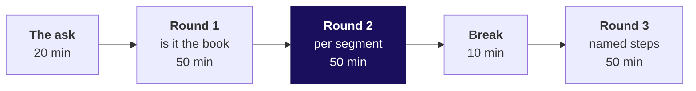
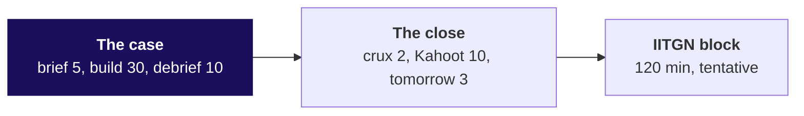

# Day sheet: Week 2, Monday. The Monday numbers, from the warehouse

**TRAINER ONLY.** Nothing on this page reaches a learner.

Posts to <!-- sync:module:W02/D1 -->Module 1: Foundations of AI and Data<!-- /sync:module:W02/D1 -->, on <!-- sync:day-date:W02/D1 -->Mon 12 Oct 2026<!-- /sync:day-date:W02/D1 -->.

<!-- sync:faculty-day:W02/D1 -->
**IITGN faculty block W2-1 (tentative), 120 minutes, after this row's applied core.** Faculty: to be confirmed by IIT Gandhinagar.

TOPIC: From the shuffle to the sampling distribution: random variables, the sampling distribution of a mean, the standard error, and the central limit theorem.
PICKS UP WHERE THE ROW STOPS: Week 1 Thursday ran the permutation test concept-first and stopped before the t-test family, the construction of a confidence interval and power, naming each as later. This three-session block is that later, and it runs beside the SQL days without sharing their tooling.
CONNECTS TO KALPA: the 5,000 shuffles on the Retail-Plus gap are a sampling distribution the room has already drawn.
BY THE END: a learner can say what a standard error is, why sample means pile up in a bell shape, and why twelve Student orders give a wide one.
DOES NOT REPEAT: the meaning of a p-value, which the room has stated correctly since Week 1.
<!-- /sync:faculty-day:W02/D1 -->

Your row stops where the faculty block starts: the escalated case and the Kahoot are the last things
you run. The block picks up Week 1 Thursday's shuffle as a sampling distribution and shares no SQL
with the day; do not preview its content, and when you mention it to the room, say it is tentative.

| | |
|---|---|
| **Start from** | Zero SQL, and a room that knows every answer from Week 1, which is the whole advantage: attention goes to the language. |
| **Go as far as** | Every learner ships the Monday suite: the tree's leaves by segment and quarter, and one CTE-structured comparison. |
| **Stop before** | Joins beyond the one lookup line to customers (Tuesday), window functions (Wednesday), DDL beyond reading the schema, indexes and performance. |
| **Comes later** | Tuesday joins payments to answer collected against booked; Wednesday ranks and compares months; Thursday re-expresses the tree in pandas, the third tool for one question. |
| **Cut first** | The subquery slide, S32, straight to CTEs. Never the execution-order walk, the GROUP BY error, or any of the four traps. |

---

## Morning, 180 minutes

| Part | Slides | Beside it | What must land | If short of time |
|---|---|---|---|---|
| The ask, 20 | Half one, S1 to S7 | The board: the Week 1 to SQL table and the seven-box run order | Anand's four questions separated; option a on S3; the run order drawn and left up | S7 to one sentence |
| Round 1, 50 | S8 to S20 | `notebooks/C2_W02_D01_01_warehouse_STUDENT.ipynb`, `sql/C2_W02_D01_01_warehouse_STUDENT.sql`, `unguided/C2_W02_D01_row_count_STUDENT.md` | Everyone connected by S9; every leaf against Week 1 (S12a), three agreeing and the customer leaves not; 1,000 against 301; Rs 3,900 against Rs 4,590 | S19's typing to five minutes |
| Round 2, 50 | S21 to S30 | Notebook 02, `sql/C2_W02_D01_02_segments_STUDENT.sql`, `guided/C2_W02_D01_first_aggregate_STUDENT.md`, `unguided/C2_W02_D01_clause_order_STUDENT.md` | The groups add back to 1,000; the GROUP BY error in two minutes; 1 against 1.84 with the multiply-back check; HAVING flags Student Q1 | S29 becomes the round set's item 5 |
| Round 3, 50 | S31 to S41 | Notebook 03, `sql/C2_W02_D01_03_quarters_STUDENT.sql`, `unguided/C2_W02_D01_quarters_STUDENT.md`, the companion's walk | Two CTEs read top to bottom; frequency is the largest branch; 15.5 against 29.4 with the 107, 91, 76 count | S32 first, then S40 to the table only |

A round runs: the question and its picture (5), your demonstration on the warehouse (15), the trap
and its wrong number (10), the room's harder variant (15), Kavya's review and the round set (5).

---

## Afternoon, the first 60 minutes

| Part | Slides | Beside it | What must land | If short of time |
|---|---|---|---|---|
| The case, 45 | Half two, S1 to S9 | `unguided/C2_W02_D01_monday_suite_brief_STUDENT.md` with `notebooks/C2_W02_D01_hands_on_STUDENT.ipynb` or `sql/C2_W02_D01_04_monday_suite_STUDENT.sql` | Thirty minutes alone; the two most-missed markers debriefed from the room's letters; the sentence to Anand read aloud | S8 and S9 to one slide |
| The close, 15 | S10 to S14 | `kahoot/C2_W02_D01_quiz_STUDENT.md` | The four crux lines read aloud; Anand's reply left open | D12 stays self-study |

The debrief runs from the room's wrong answers. The answer strings: the notebook's ten letters are
`bdbccbadac`; the brief's eight are `acbdcadb`. Most rooms miss marker 5 (the ORDER BY that makes
eight rows stable) and brief item 2 (the denominator under orders per customer).

---

## The traps, with their exact wrong numbers

| Round | The hurried query | The wrong number | The decision it misleads | The check | The fix and what changed |
|---|---|---|---|---|---|
| 1 | `SELECT count(*) AS customers FROM orders;` | 1,000 customers, 1.00 orders each | Frequency reads as nothing to fix | Count three ways: 1,000 rows, 301 buyers, 340 members | `count(DISTINCT customer_id)`: 699 phantom customers leave; 3.32 orders each |
| 1 | Five delivered Q2 app orders, `LIMIT 5`, no ORDER BY | Rs 3,900 on Monday; Rs 4,590 after the reload | The analyst's audit disagrees by Rs 690 | Rerun inside the reload transaction (block `r1_sample_after_reload`) | `ORDER BY order_id LIMIT 5`: the same five, every run |
| 2 | `count(*) / count(DISTINCT customer_id)` | Retail-Plus 2 then 1; Retail-Core 1 then 2 | Plus "halved", budget follows Core | Multiply back: 1 times 76 is 76 against 140 orders, all eight rows fail | `::numeric`, rounded: 2.36 to 1.84 (22 percent down); 1.95 to 2.01 |
| 3 | `avg()` over `sum(CASE WHEN quarter = 'Q2' ...)` per member | Rs 6,437 to Rs 5,439, 15.5 percent down | A light touch for Retail-Plus | count(*) 107 against count(q2) 76: 31 members left out | `coalesce(..., 0)`: Rs 5,474 to Rs 3,863, 29.4 percent down |

The GROUP BY error (`column "c.segment" must appear in the GROUP BY clause ...`) gets two minutes on
the room's own screens, read from its last line and fixed by grouping the segment. It is never a
trap: it prints no number.

The invented table for the AVG mechanism is `(VALUES (100), (NULL), (200))`; say aloud that it is
invented. The warehouse has no NULL in any column, so the NULL in the book comes from the `CASE`
with no `ELSE`, which is the realistic source.

**Checkpoints, one learner each, under thirty seconds.** After round 1: what does `count(*)` count
on `orders`? After round 2: what should 1.84 times 76 give, and what does 1 times 76 give? After
round 3: who is inside `avg(q2_spend)`?

---

## What is planted, and what the room should find

The row's client-zero column says nothing new is planted for today; the contrast with Week 1 carries
the teaching. Two things in the warehouse surface today anyway, and the rest wait for their days.
Nothing in any learner file names any of them.

| Planted in v4 | Where it is | What the room should do today | If nobody finds it |
|---|---|---|---|
| The warehouse holds 1,000 orders where last week's file held 186 | Every table | Run the Q1 and Q2 blocks, see totals five times Week 1's, then set every leaf beside its Week 1 number (S12a) | Ask what would make both totals right at once, then ask which leaves should agree |
| The bulk orders at the top of the book, carried from Week 1 | KR-00667, Rs 1,98,57,600, Q2; KR-00124, Rs 1,22,77,440, Q1; both Business | Meet them only if they sort by amount (S19's fast finishers). The mean is 79 times the median, and with both set aside it is still 66.5 times, because the other 186 Business orders average Rs 8,84,215; the gap is the segment, not the two orders | Leave it; Week 1 taught it and today's suite reports the median |
| 400 large invoices paid in two instalments, and 50 orders posted twice by the gateway | payments | Nothing today; Tuesday's fan-out | Do not raise it, even when a learner runs `count(*)` on payments tonight |
| 30 delivered orders never paid, and 8 payments whose order is not in the table | payments | Nothing today; Tuesday's anti-join | Do not raise it |
| An exact Q2 revenue tie at the fiftieth Retail-Plus position; three members whose spend falls in each Q2 month | orders | Nothing today; Wednesday | Do not raise it. The row says the tie sits in the top ten; the generator places it at the fiftieth |
| 6 duplicated customer keys in the exposure feed; the campaigns table present but unused | campaign_exposure, campaigns | Nothing until Thursday; the schema read lists both tables without comment | If asked, say the table's question arrives later this week |

**Round 1, every leaf against Week 1.** Week 1's numbers are recomputed in notebook 01 from
`content/W01/D4/data/C2_W01_D04_orders_STUDENT.csv`, the cleaned 186 orders behind the note Meera
accepted, and the notebook checks they reproduce Week 1's 69 customers, Rs 1.90 and Rs 1.87 crore,
and Retail-Plus 1.82 to 1.18 on 22 members.

| Leaf | Week 1 file | Warehouse | Verdict |
|---|---|---|---|
| Book revenue | Rs 1,90,00,000 to Rs 1,87,00,000, 1.6% down | Rs 10,00,00,000 to Rs 9,84,00,000, 1.6% down | Agrees |
| Book revenue per order | Rs 1,90,000 to Rs 2,17,442, 14.4% up | Rs 1,85,874 to Rs 2,12,987, 14.6% up | Agrees |
| Book customers who bought | 69 to 69, flat | 244 to 227, 7.0% down | Differs by 7.0 points |
| Book orders per customer | 1.45 to 1.25, 14.0% down | 2.20 to 2.04, 7.7% down | Differs by 6.3 points |
| Retail-Plus customers | 22 to 22, flat | 91 to 76, 16.5% down | Differs by 16.5 points |
| Retail-Plus orders per customer | 1.82 to 1.18, 35.0% down | 2.36 to 1.84, 22.0% down | Differs by 13.0 points |
| Retail-Plus orders | 40 to 26, 35.0% down | 215 to 140, 34.9% down | Agrees |
| Retail-Plus revenue per order | Rs 2,850 to Rs 3,012, 5.7% up | Rs 2,725 to Rs 2,953, 8.4% up | Differs by 2.7 points |
| Retail-Plus revenue | Rs 1,14,000 to Rs 78,300, 31.3% down | Rs 5,85,770 to Rs 4,13,380, 29.4% down | Differs by 1.9 points |

What the sources say about the differences, for the trainer only. Customers flat quarter on quarter
is a v1 witness in `docs/07_Client_Zero.md` section 7, and v4's witness list does not carry it. The
generator's comments say v4 keeps customers flat and that last week's rows were sampled from the
book (`data/generate_client_zero.py`, the v4 block); what the code holds fixed is the pool of 340
members, and each order draws its buyer from that pool at random, so buyers per quarter fall, and
the two files share no order id and no customer id. Frequency differs because it divides by the
customer count. Nothing in the sources explains the Retail-Plus order-value gap. In the room, say
the numbers differ and the warehouse is the book of record; never say what was planted.

If a learner asks whether the data is rigged, answer with the question back: "What would you check?"

---

## The numbers, so you are never caught out

| Measure | Q1 | Q2 | Both |
|---|---|---|---|
| Orders | 538 | 462 | 1,000 |
| Booked revenue | Rs 10,00,00,000 | Rs 9,84,00,000 | Rs 19,84,00,000 |
| Customers who bought | 244 | 227 | 301, against 340 on the book |
| Orders per customer | 2.20 | 2.04 | 3.32 |
| Delivered orders | 355 | 298 | 653 |

| Segment | Customers, Q1 then Q2 | Orders per customer | Revenue per order | Revenue change |
|---|---|---|---|---|
| Business | 36, 35 | 2.69, 2.60 | Rs 10,20,767, Rs 10,72,358 | 1.4 percent down |
| Retail-Core | 102, 96 | 1.95, 2.01 | Rs 1,875, Rs 1,898 | 1.8 percent down |
| Retail-Plus | 91, 76 | 2.36, 1.84 | Rs 2,725, Rs 2,953 | 29.4 percent down |
| Student | 15, 20 | 1.80, 1.90 | Rs 990, Rs 941 | 33.9 percent up |

The typical order: mean Rs 1,98,400, median Rs 2,510, 79 times; without the two largest orders,
mean Rs 1,66,598 against median Rs 2,505, 66.5 times. Business carries 99.1 percent of the rupees,
so it holds Rs 14,29,840 of the Rs 16,00,000 fall; Retail-Plus holds Rs 1,72,390 of it, and 75 of
the book's 76 fewer orders.
The Retail-Plus bridge, customers first: Rs 5,85,770, less Rs 96,555 for fewer customers, less
Rs 1,07,784 for fewer orders each, plus Rs 31,949 for bigger orders, lands on Rs 4,13,380. The
channels: web Rs 3,79,02,050 to Rs 2,36,61,000 (37.6 percent down) and store Rs 1,99,59,110 to
Rs 3,21,48,730 (61.1 percent up), nearly all of both Business orders; consumer orders fell in every
channel, app most at 24.1 percent.

**The take-home's numbers, for tomorrow's walk-through.** Retail-Plus by city: Delhi Rs 1,76,340 to
Rs 83,630 (52.6 percent down, frequency 2.86 to 1.63, buyers 22 to 19); Chennai Rs 88,290 to
Rs 47,290 (46.4 percent down, buyers 20 to 9, frequency 1.60 to 1.67); Pune the only rise, Rs 50,230
to Rs 77,070. Six of the twelve city-quarters hold fewer than 30 orders, so the honest note calls the
city split a lead for the regional heads. The take-home runs on the warehouse, since the generator
has no second Week 2 sample; its self-check names no plant.

---

## The interview questions, answered in one breath

| Tag | Question | The answer in one breath |
|---|---|---|
| [S] | WHERE against HAVING, one sentence each. | WHERE keeps rows before grouping; HAVING keeps groups after it, so it can test count(*). |
| [S] | Explain the logical order in which a SQL query executes. | FROM, WHERE, GROUP BY, HAVING, SELECT, ORDER BY, LIMIT, and it explains the classic refusals. |
| [F] | Why would you compute a KPI in the warehouse rather than in a notebook? | One copy everybody reads, rerun unchanged and auditable; a notebook's export ages and hides a typo. |
| [F] | What does LIMIT without ORDER BY return? | Whichever rows the database reaches first; order on a unique key, then limit. |
| [D] | A stakeholder's analyst must audit your query; what changes, and what would you refuse to compute in a notebook? | Named steps, a comment per step with its denominator, numeric division, ordered lists, a check query; never the reported KPI on an export. |
| [F] | Orders per customer reads 1 for a segment; what do you check first? | Integer division: multiply the ratio back by the customers. |
| [F] | Your KPI dropped 30 percent overnight and the data did not change; what do you suspect? | Something in the query: an unordered LIMIT, a relative date, a changed definition or a shifted denominator. |
| [F] | An average moved, but the total did not; how? | The denominator changed, often NULLs the average now skips. |
| [S] | COUNT(*), COUNT(column), COUNT(DISTINCT column)? | Rows, non-NULL values, different non-NULL values. |
| [D] | Two analysts report different customer counts; how do you settle it? | Put the two definitions side by side, agree one per question, store the query. |
| [F] | When a CTE instead of a subquery? | When the step deserves a name, is read twice, or the query must read top to bottom. |

The full answers are in the study notes and in each notebook's "In the interview" section. The last
six are this pack's follow-ups on the row's five anchors.

---

## The practice lab, for the TA

The set is `exercises/practice/C2_W02_D01_lab_STUDENT.md` with `sql/C2_W02_D01_05_lab_STUDENT.sql`,
about an hour; the solution, `solutions/C2_W02_D01_lab_solution_STUDENT.md`, opens when the lab ends.
The answer string is `bdacbdcbcad`.

| Problem | Where learners stall | The one hint to give |
|---|---|---|
| 1. Predict four row counts | Answering 1,000 for a grouped query, or forgetting that HAVING removes groups | "How many groups exist before HAVING runs, and how many survive it?" |
| 2. Order five clauses | Giving the written order | "Which clause needs a table to exist before it can do anything?" |
| 3. A colleague's channel query | Rejecting every column because two are wrong, or missing that customers counts rows | "Multiply each column back by what it divides by." |
| 4. The channel tree | Reading web's 37.6 percent fall as a collapsing channel | "Run lab_channel_split and read the Business rows first." |

The fast finishers go to the stretch in `extras/C2_W02_D01_tiered_STUDENT.md`; anyone who lost the
grouping this morning goes to its recovery ladder before problem 3.

---

## Which file for which moment

| Moment | File |
|---|---|
| Teaching | `slides/C2_W02_D01_half1_STUDENT.pptx` and `slides/C2_W02_D01_half2_STUDENT.pptx`, speaker notes on every slide |
| Live SQL | `sql/C2_W02_D01_01_warehouse_STUDENT.sql`, `_02_segments_`, `_03_quarters_`, one named block per step |
| Live notebooks | `notebooks/C2_W02_D01_01_warehouse_STUDENT.ipynb`, `_02_segments_`, `_03_quarters_`, in order |
| The projector's moving picture | `demos/C2_W02_D01_execution_order_STUDENT.html`: the walk at each round's close, the simulator in the debrief |
| Early finishers | `demos/C2_W02_D01_decision_tool_STUDENT.xlsx`, four tabs with one formula defect each |
| Round sets and the case | `exercises/`, with every solution opened at the close |
| The lab | `exercises/practice/` and `sql/C2_W02_D01_05_lab_STUDENT.sql` |
| Close | `kahoot/C2_W02_D01_quiz_STUDENT.md` |
| Tonight | `takehome/` with `sql/C2_W02_D01_06_takehome_STUDENT.sql`, and `preread/` for Tuesday |

**If a learner's warehouse will not answer**, they run `bash .devcontainer/load_warehouse.sh` in the
terminal and pair with a neighbour until it reports its rows; the notebooks open read-only on GitHub
with every output showing.
