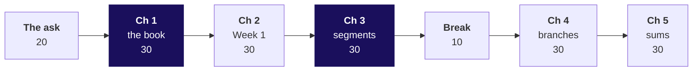
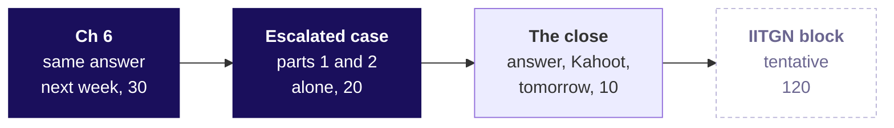

# Day sheet, Week 2 Monday: can the warehouse itself give Anand the Monday numbers, every segment, every week?

**TRAINER ONLY.** Nothing on this page reaches a learner.

Posts to <!-- sync:module:W02/D1 -->Module 1: Foundations of AI and Data<!-- /sync:module:W02/D1 -->, on <!-- sync:day-date:W02/D1 -->Mon 12 Oct 2026<!-- /sync:day-date:W02/D1 -->.

<!-- sync:faculty-day:W02/D1 -->
**IITGN faculty block W2-1 (tentative), 120 minutes, after this row's applied core.** Faculty: to be confirmed by IIT Gandhinagar.

TOPIC: From the shuffle to the sampling distribution: random variables, the sampling distribution of a mean, the standard error, and the central limit theorem.
PICKS UP WHERE THE ROW STOPS: Week 1 Thursday ran the permutation test concept-first and stopped before the t-test family, the construction of a confidence interval and power, naming each as later. This three-session block is that later, and it runs beside the SQL days without sharing their tooling.
CONNECTS TO KALPA: the 5,000 shuffles on the Retail-Plus gap are a sampling distribution the room has already drawn.
BY THE END: a learner can say what a standard error is, why sample means pile up in a bell shape, and why twelve Student orders give a wide one.
DOES NOT REPEAT: the meaning of a p-value, which the room has stated correctly since Week 1.
<!-- /sync:faculty-day:W02/D1 -->

Your row stops where the faculty block starts: chapter 6, the escalated case's first two parts and
the Kahoot are the last things you run. The block shares no SQL with the day; do not preview its
content, and when you mention it to the room, say it is tentative.

Built from the approved Weeks 1 and 2 spine (`docs/detailing/W01_W02_spine.md`, Monday, and its
faculty-day paragraph), raised to the chapter standard and the question ladder of 30 September 2026,
and the Monday row of `docs/curriculum/W2_Data_manipulation.md`. Data: the client-zero v4 warehouse,
generated by `data/generate_client_zero.py` and loaded by `bash .devcontainer/load_warehouse.sh`.
Kalpa Retail's business, its segments and its metrics are told in the retail domain dossier
(`content/W01/D1/study-notes/C2_W01_D01_domain_retail_STUDENT.md`); today links to it and never
retells it.

## Which questions does the day ask, in the order the trainer asks them?

The day's question, in Anand Iyer's terms: **can the warehouse itself give Anand the Monday numbers,
every segment, every week?** Ask each question below before its answer is shown; each chapter's map
slide lists its smaller questions, and its last slide answers them.

| Part | Its question | The smaller questions, in order |
|---|---|---|
| The ask | What is Anand asking for, and what does "from the warehouse itself" rule out? | What exactly is Anand asking for, and what did the platform lead add? Which work does his rule still allow? Which of last week's Python steps become one line of SQL? In what order does the database run a query's clauses? Which numbers does the Monday sheet carry, and which table holds each? |
| Chapter 1 | How many orders, rupees and customers did each quarter book, counted where the book lives? | Where could the Monday numbers be computed: an export, a query or a view? What does the warehouse hold, and where does each leaf of the tree live? How many orders and rupees did each quarter book? How many customers bought in each quarter? Do the raw rows, counted in Python, give the same leaves? |
| Chapter 2 | Does the warehouse tell the same story as the file Meera's decision rested on? | How can two sources of different sizes be compared fairly? Does last week's file still give last week's numbers? Which leaves agree once each is read as a change from Q1 to Q2? Did the customer leaf agree? Where did the book's 17 fewer Q2 customers come from? What goes on Anand's sheet about last week's note? |
| Chapter 3 | Which segment carried the fall from Q1 to Q2, and how often did its customers order? | One query per segment, one grouped query, or pandas? How many orders, customers and rupees did each segment book in each quarter? Which segment-quarters hold too few customers to quote a rate on? How often did each segment's customers order? Does the average of each customer's own order count agree? |
| Chapter 4 | Which branch of each segment's tree moved, and how much less did each Retail-Plus member spend? | Nested subqueries, named steps or temporary tables? How did customers, frequency and order value move in each segment? How much less did each Retail-Plus member spend? Does revenue over the members who bought, counted on their own, give the same levels? |
| Chapter 5 | Do the suite's numbers add up the way Anand's analyst will add them? | How should the suite produce its half-year column? Do the segments add back to the book in each quarter? How many Retail-Plus customers bought in the half-year? Does the overlap between the two quarters explain the gap? |
| Chapter 6 | Will next Monday's run give Anand's analyst the same answer from the same book? | How can a run show that it computed the same thing as last week's? What fingerprint does this Monday's run leave? Which five orders will the analyst trace against the ERP? Does a count with no sort confirm the five? What does the Monday suite tell Anand? |
| The escalated case | Does the Monday suite hold on Finance's definition, the orders that were delivered? | What does the book say on Finance's definition? Which segment's frequency fell on delivered orders, and which groups are too thin? Which branch of Retail-Plus's tree moved furthest, and how much less did each member spend? Does the suite add up the way the analyst will add it? Will the analyst's rerun draw the same sample, and what does the run print beside it? |
| The second case, take-home | Is the store booming and the web collapsing, as Marketing says? | What do the channel totals say from Q1 to Q2? Which orders make up each channel's total? How did each channel's consumers move, branch by branch? Which line goes on Anand's channel sheet? |
| The close | Can the warehouse itself give Anand the Monday numbers, every segment, every week? | Which line does each chapter leave the Monday suite with? What does Anand ask next? |

**The day's answer, said at chapter 6's message slide (afternoon S14) and again, in brief, as the close's first slide (S21).** "Anand, the Monday suite now
runs on the warehouse itself. Booked revenue fell 1.6 percent, from Rs 10.00 crore to Rs 9.84 crore,
and Retail-Plus carries the fall in orders: its revenue is down 29.4 percent because 16.5 percent
fewer members bought and each ordered 22.0 percent less often, while each order was worth 8.4
percent more. The counts are named for what they count and printed beside every ratio, and each run
prints the book's fingerprint, so a rerun on the same book gives the same answer. One caveat: last week's extract showed customers flat, and the full book
shows 7.0 percent fewer customers in Q2."

---

## What does the day start from, and where does it stop?

| | |
|---|---|
| **Start from** | Week 0's SQL brush-up (SELECT, WHERE, ORDER BY and GROUP BY on a practice database, taught in one of two tracks), and a room that knows every Week 1 answer, which is the advantage: attention goes to the language and to what each line guarantees. |
| **Go as far as** | Every learner writes the Monday suite on the warehouse: the tree's leaves per quarter and per segment, ratios in numeric with the counts beside them, the quarter comparison as named steps, the half-year counted from the orders, and an ordered sample with the book's fingerprint. Every chapter names its options, its best-fit call and a second route. |
| **Stop before** | Joins beyond the one lookup line to customers (Tuesday), window functions and ranking (Wednesday), pandas merge and pivot tables (Thursday), Excel (Friday), DDL beyond reading the schema, indexes and performance. Name each as later, once. |
| **Comes later** | Tuesday joins payments to answer booked against collected; Wednesday ranks members and compares months; Thursday re-expresses the tree in pandas, the third tool for one question; Friday puts the number in the leadership deck. The tentative IITGN block this afternoon runs on its own topic. |
| **Cut first** | Chapter 1's second route (morning S19) to its table, then chapter 4's second route (S58) to one sentence, then S23's Airbnb picture to its quote. Never the execution-order walk (S6), the GROUP BY refusal (S38), any of the six traps, or the escalated case's start. |

---

## How does the morning's 180 minutes run?

| Part | Slides (morning deck) | Beside it | What must land | If short of time |
|---|---|---|---|---|
| The ask, 20 | Cover, S1 to S7 | The board's first two drawings | The day's question and its six chapter questions (S1); option a on S4; the order a query runs in, drawn and left up all day (S6); the tree read from two tables (S7) | S5 to its first three rows |
| Chapter 1, 30 | SECTION 1, S8 to S20 | Notebook 1, `sql/C2_W02_D01_01_book_STUDENT.sql`, the guided build's steps 1 and 2, inside the first query and the quarter totals (10) | Everyone connected and running a block by S13; the book's 1.6 percent (S15); 538 "customers" (S16) against 244 (S18), with the orders table counted two ways beside the customer table's count as the check (S17) | S19 to its table |
| Chapter 2, 30 | SECTION 2, S21 to S33 | Notebook 2 and last week's extract, `data/C2_W02_D01_week1_orders_STUDENT.csv` | Every leaf as a change (S28); the totals matching while the customer leaf moves 7.0 points (S29, S30); the bridge 244 less 74 plus 57 (S31); line b for the sheet (S33) | S23 to its quote |
| Chapter 3, 30 | SECTION 3, S34 to S47 | Notebook 3, the guided build's steps 3 to 5, inside the GROUP BY error and the eight rows (7) and the first three minutes of the thin groups | The GROUP BY refusal read in two minutes (S38); eight rows (S40); HAVING for the thin groups (S41); 2 then 1 against 2.36 then 1.84, with the multiply-back check (S43 to S45) | S46 to one sentence |
| Break, 10 | After S47 | | | |
| Chapter 4, 30 | SECTION 4, S48 to S59 | Notebook 4 | Named steps read top down, a rename costing one edit against four, and the temporary table gone in a new session (S51); frequency the branch that fell furthest (S54); 15.5 against 29.4 percent with the count of who is inside each average (S55 to S57) | S58 to one sentence |
| Chapter 5, 30 | SECTION 5, S60 to S71 | Notebook 5 | The segments tie out (S65); 167 buyers in a tier of 120 (S66, S67); 107 counted once and 13 who bought nothing (S68); the overlap of 60 (S70) | S62 to its first stat |

Each chapter's set (`exercises/unguided/C2_W02_D01_ch{n}_*_STUDENT.md`) runs its first items live in
the chapter's last minutes if the chapter ran to time; the rest are the practice lab's or tonight's.

## Which checkpoint question follows each chapter?

One learner each, under thirty seconds. After chapter 1: what does `count(*)` count on `orders`, and
what counts customers? After chapter 2: why can two sources agree on revenue and disagree on
customers? After chapter 3: what should 1.84 times 76 give back, and what does 1 times 76 give?
After chapter 4: who is inside `avg(q2_spend)`? After chapter 5: which columns may you add across two
quarters? After chapter 6: what tells a changed book from a changed query?

---

## How do the afternoon's 60 minutes run, and where does the rest go?

| Part | Slides (afternoon deck) | Beside it | What must land | If short of time |
|---|---|---|---|---|
| Chapter 6, 30 | Cover, S1, SECTION 6, S2 to S15 | Notebook 6 | The morning's five answers (S1); the fingerprint unchanged by the reload (S8); Rs 3,900 against Rs 4,590 on an unordered sample (S10), the book's fingerprint as the check (S11), ORDER BY order_id as the fix (S12); the message to Anand read aloud (S14) | S13 to one sentence |
| Escalated case, parts 1 and 2, 20 | SECTION 7, S16 and S17 | `notebooks/C2_W02_D01_ex1_escalated_case_STUDENT.ipynb`, `exercises/unguided/C2_W02_D01_escalated_case_STUDENT.md` | Every learner filters to delivered orders and counts customers once (part 1), then puts each segment's ratio in numeric with the thin groups flagged (part 2) | Nothing; start on time |
| The close, 10 | SECTION 8, S21 to S24 | `kahoot/C2_W02_D01_quiz_STUDENT.md` | The day's answer after two learners read theirs (S21); the six crux lines read together (S22); eight items with a reason aloud after each (S23); Anand's next question left open (S24) | S22 read by the trainer alone |

D18, D18a, D19 and D20 sit before SECTION 8 and stay self-study: the interview drill in two slides,
the second case and the day's wrong numbers. **What
moves out of the afternoon.** The escalated case's parts 3 to 5, the debrief of the room's wrong
answers and the interview drill run in the TA-led practice lab; the second case runs in the
take-home, in pairs or alone. The TA's note is `trainer/C2_W02_D01_practice_lab_TA_TRAINER.md`.

**Which letters are keys?** The chapter sets: chapter 1 `cadbd`, chapter 2 `bcdab`, chapter 3
`bdacb`, chapter 4 `acadcb`, chapter 5 `cabdc`, chapter 6 `cbcdba`. The escalated case
`bcadacdbbadcbda` (items 1 to 10 are the notebook's markers, 11 to 15 the brief's own, one per part:
four design items and, in part 3, a reading of the two trees); the second case `dacbbdcaab` (1 to 7
the markers, 8 to 10 the brief's own). The guided build `adcbd`; the practice lab `bdcaadbcdab`. The
Kahoot, in order: d, b, a, c, a, d, c, b. Reasons for every letter, and each item's kind, are in
`exercises/solutions/`. Of the 73 lettered items, 26 are design items: three in each of chapters 1,
2, 4, 5 and 6, two in chapter 3, four in the escalated case, four in the second case and one in the
lab. Expect the room to split on chapter 2's
item 5 (the customer bridge built from each customer's history) and the escalated case's item 14
(the fact that would let two quarter counts be added); take those two first in the lab's debrief.

---

## Which options, call and second route does each chapter take?

| Chapter | Options, sized on this warehouse | Best-fit call, and what would change it | Second route |
|---|---|---|---|
| 1. What does the book say? | An export and pandas (1,000 order rows leave the warehouse; the segment lines' export is 1,340), a .sql file (2 rows), a saved view (2 rows, needs the right to create objects) | The .sql file, since read access is all the team has; a granted schema and a settled suite make the view better | All 1,000 rows counted in Python with a set of ids and a running sum: the same 538, 462, 244, 227 and rupees |
| 2. Same story as Week 1? | The two totals (4 numbers), every leaf as a change (20), order by order (186 lookups, 0 found), last week's notebook on an export (ruled out) | Every leaf as a change; shared order ids would make order-by-order win | The customer change built from each customer's history: 244 less 74 plus 57 is 227, and 170 plus 74 and 170 plus 57 tie out both quarters |
| 3. Which segment moved? | One query per segment (4 queries), one GROUP BY (1 query, 8 rows), pandas on the rows (1,000 rows), one wide row per segment (4 rows) | One GROUP BY; a one-off question about one segment is a WHERE | Each customer's own order count, 471 rows, averaged in Python: all eight ratios agree |
| 4. Which branch moved? | Nested subqueries (one statement, nothing written, 4 edits for a renamed segment), named steps (one statement, nothing written, 1 edit), temporary tables, one per quarter (8 rows written, gone in a new session, 4 edits) | Named steps; a step reused over millions of rows in one long session would favour a temporary table | Retail-Plus revenue over the 107 members who bought, counted in a step of their own: Rs 5,474 then Rs 3,863, the fix's own levels; the tier's 120 give the same change at Rs 4,881 to Rs 3,445, a depth note |
| 5. Does the suite add up? | Add the quarter rows (8 rows), count from the orders (1,000), GROUPING SETS (1,000 rows, one query), no half-year | Count from the orders; several windows at once would make GROUPING SETS worth its extra feature | Q1 plus Q2 less the customers in both: 91 plus 76 less 60 is 107, and in every segment the double count equals the overlap |
| 6. Same answer next week? | By eye (0 numbers), a fingerprint block (7 numbers, read access), a snapshot table (18 rows a Monday, write access), write, audit, publish (a staging table, write access and a scheduler) | The fingerprint with ORDER BY on a unique key; a schema the team can write to makes write, audit, publish better | A count with no sort: 5 candidates at or below KR-00547, worth Rs 3,900, and 7 at or below the unordered rerun's KR-00553, so it catches the sample that drifted |

---

## Which trap prints which wrong number, and what catches it?

| Chapter | The plausible wrong answer, exactly | The decision it would mislead | The check that catches it | The fix and what it changes |
|---|---|---|---|---|
| 1 | `SELECT quarter, count(*) AS customers FROM orders GROUP BY quarter`: 538 and 462 customers, 1.00 order each | Nobody comes back, so frequency needs no fixing and the Rs 12 crore acquisition request returns | The orders table counted two ways, 1,000 rows and 301 buyers, beside 340 on the customer table | `count(DISTINCT customer_id)`: 244 and 227, 2.20 and 2.04 orders each; 294 and 235 customers who do not exist leave |
| 2 | "The warehouse confirms last week": customers flat, 0.0 percent, each ordering 14.0 percent less | Rs 12 crore stays parked on a customer count the book does not show | Who bought in both quarters: 69 of 69 in the extract, 170 of 301 in the book; two trees multiply to one 0.984 | The book's leaves: customers 244 to 227, down 7.0 percent; orders per customer down 7.7 |
| 3 | `count(*) / count(DISTINCT o.customer_id)`: Retail-Plus 2 then 1, "halved"; Retail-Core 1 then 2, "doubled" | An emergency plan for Retail-Plus and budget drifting to Retail-Core | Multiply back: 1 times 76 is 76, where the orders are 140; every row misses | `round(count(*)::numeric / count(DISTINCT o.customer_id), 2)`: Retail-Plus 2.36 to 1.84, down 22.0 percent; Retail-Core 1.95 to 2.01, up 3.0 |
| 4 | `avg()` over `sum(CASE WHEN quarter = 'Q2' THEN amount END)` per member: Rs 6,437 to Rs 5,439, down 15.5 percent; Retail-Core +4.3, Business +1.4 | A light touch for a tier losing nearly a third of its spend | Who is inside each average: 107 in the step, 91 in Q1's, 76 in Q2's | `coalesce(..., 0)`: Rs 5,474 to Rs 3,863 over the same 107, down 29.4; Retail-Core and Business flip to falls |
| 5 | Each segment's two quarter rows added: 167 Retail-Plus customers in the half-year, 471 in the book, Rs 5,983 per customer | The audit fails on sight, and the 13 members who bought nothing stay hidden | Buyers against members: 167 of a tier of 120; every segment runs over | Counted from the orders: 107, the book 301; Rs 9,338 per Retail-Plus customer |
| 6 | Five delivered Q2 app orders with `LIMIT 5` and no ORDER BY: Rs 3,900 on your run, Rs 4,590 on the analyst's rerun after a reload | A Rs 690 disagreement puts every number in the suite under question | The fingerprint held (1,000 rows, Rs 19,84,00,000, 301 customers) while the sample moved | `ORDER BY order_id LIMIT 5`: KR-00542, 544, 545, 546 and 547, Rs 3,900 on every run |

The GROUP BY refusal (`column "c.segment" must appear in the GROUP BY clause or be used in an
aggregate function`) gets two minutes on the room's own screens, read from its last line and fixed
by grouping the segment. It prints no number, so it is never a trap. A connection that fails gets the
same two minutes and the last line of its error. The AVG mechanism's invented table is
`(VALUES (100), (NULL), (200))`: avg 150, avg of the value or zero 100; say aloud that it is
invented. The warehouse holds no NULL in any column, so the NULLs in chapter 4 come from the CASE
with no ELSE, which is the realistic source. Two of the traps reproduce identically on every
Codespace, so the room's sixty screens agree; the LIMIT trap needs the rolled-back reload the
notebook runs, since sixty identical warehouses usually hand every learner the same unordered five.

---

## Which real company does each chapter name, and on what fact?

Every fact below was checked on 30 September 2026 against the source the provenance links, and
Eternal's figures again on 1 October 2026 against the letter itself; say each one as the table
words it, and no stronger.

| Chapter | Company | The fact, as the source gives it | Say it this way in the room |
|---|---|---|---|
| 1 | JPMorgan Chase | The task force report on the 2012 CIO losses (16 January 2013) found CIO's new value-at-risk model "operated through a series of Excel spreadsheets, which had to be completed manually, by a process of copying and pasting data from one spreadsheet to another" (page 124); losses for the year through 30 June 2012 had grown to about $5.8 billion (page 7) | Hand-moved inputs were one of the control failures the report names; do not claim the spreadsheet caused the loss |
| 2 | Airbnb | The Airbnb Tech Blog, "How Airbnb achieved metric consistency at scale" (30 April 2021): years earlier, when the chief executive asked which city had the most bookings in the previous week, Data Science and Finance "would sometimes provide diverging answers using slightly different tables, metric definitions, and business logic" | Two sources answering one question differently are settled definition by definition before either reaches a decision maker |
| 3 | Eternal (Zomato, Blinkit, District) | Shareholders' letter for Q1 FY27 (22 July 2026): B2C net order value up 54 percent year on year to Rs 31,120 crore; food delivery 20 percent and more (Rs 10,769 crore), quick commerce 86 percent (Rs 17,132 crore), going-out 60 percent (Rs 3,218 crore) | One group total held three businesses' stories, and the letter tells each; Kalpa's 1.6 percent adds four segments' changes |
| 4 | GitLab | The data team's SQL style guide: "Prefer CTEs over sub-queries as CTEs make SQL more readable ..." (the sentence goes on "and are more performant", a claim the guide makes with no test beside it); each CTE should "perform a single, logical unit of work"; calculations carry "a brief description of what's going on"; the same guide says not to use USING in joins because it "produces inaccurate results in Snowflake" | On Postgres the reason to name steps is the reader; do not repeat the performance claim; USING is exact on Postgres, which is why the day's lookup line uses it |
| 5 | Meta | Form 10-K for 2025 (filed 29 January 2026): daily active people 3.58 billion on average in December 2025; a person who opened any of the family's apps that day is counted once, "counting such group of accounts as one person" | Adding each app's daily users would count one person several times; Meta says its estimate carries an error margin of about 3 percent |
| 6 | Netflix | Michelle Ufford, "Whoops, The Numbers Are Wrong! Scaling Data Quality @ Netflix", DataWorks Summit, San Jose, 13 June 2017: write, audit, publish; a batch of 17,240 rows with 17,240 missing values beside the previous day's 16,135 rows with 21 | The row-count checks fail the job and the missing-value check only warns; in the talk that batch raised a warning, so never say it was stopped |

---

## What is planted, and what should the room find?

The row's client-zero column says nothing new is planted for today; the contrast with Week 1
carries the teaching. The v4 witnesses below wait for their own days, and nothing in any learner
file names any of them.

| Planted in v4 | Where it is | What the room should do today | If nobody finds it |
|---|---|---|---|
| The warehouse holds 1,000 orders where last week's file held 186 | Every table | Chapter 1 counts it; chapter 2 sets every leaf beside last week's and finds the customer leaf moved | Ask what would make both totals right at once, then which leaves should agree |
| The two largest bulk orders, carried from Week 1: KR-00667, Rs 1,98,57,600, Q2, and KR-00124, Rs 1,22,77,440, Q1, both Business | orders | Meet them only if a learner sorts by amount. The mean order is Rs 1,98,400 against a median of Rs 2,510, 79 times; the gap is the Business segment, which books about 99 percent of the rupees | Leave it; Week 1 taught the typical order |
| 450 orders with two payment rows (instalments and gateway retries) | payments | Nothing today; Tuesday's question | Do not raise it, even when a learner runs `count(*)` on payments tonight |
| 30 delivered orders never paid, and 8 payments whose order is not in the table | payments | Nothing today; Tuesday | Do not raise it |
| An exact tie at the fiftieth Retail-Plus position; three members whose spend falls two months running | orders | Nothing today; Wednesday | Do not raise it. The row says the tie sits in the top ten; the generator places it at the fiftieth, and Wednesday's session records the conflict |
| 6 duplicated keys in the campaign exposure table; the campaigns table present and unused | campaign_exposure, campaigns | Nothing until Thursday; chapter 1's schema read lists the tables without comment | If asked, say that table's question arrives later this week |

**Why last week's extract and the book part company.** The extract's 69 customers all bought in both
quarters, so its customer count was flat by construction, while the book holds 131 customers who
bought in one quarter only. The two files share no order id and no customer id: the generator draws
each file from the same pool of Kalpa's members with its own order ids. In the room, say the numbers
differ and the warehouse is the book of record, and never say what was planted. If a learner asks
whether the data is rigged, answer with the question back: "What would you check?"

---

## Which numbers should the trainer have to hand?

| Measure | Q1 | Q2 | Half-year |
|---|---|---|---|
| Orders | 538 | 462 | 1,000 |
| Booked revenue | Rs 10,00,00,000 | Rs 9,84,00,000 | Rs 19,84,00,000 |
| Customers who bought | 244 | 227 | 301, against 340 on the customer table |
| Orders per customer | 2.20 | 2.04 | |
| Revenue per order | Rs 1,85,874 | Rs 2,12,987 | |
| Delivered orders, Rs | Rs 6,80,25,200 | Rs 6,65,65,090 | 653 orders, Rs 13,45,90,290 |

| Segment | Orders, Q1 then Q2 | Customers, Q1 then Q2 | Orders per customer | Revenue per order | Revenue, Q1 to Q2 | Half-year customers | Members |
|---|---|---|---|---|---|---|---|
| Business | 97, 91 | 36, 35 | 2.69, 2.60 | Rs 10,20,767, Rs 10,72,358 | Down 1.4% | 39 | 40 |
| Retail-Core | 199, 193 | 102, 96 | 1.95, 2.01 | Rs 1,875, Rs 1,898 | Down 1.8% | 131 | 150 |
| Retail-Plus | 215, 140 | 91, 76 | 2.36, 1.84 | Rs 2,725, Rs 2,953 | Down 29.4% | 107 | 120 |
| Student | 27, 38 | 15, 20 | 1.80, 1.90 | Rs 990, Rs 941 | Up 33.9% | 24 | 30 |

Retail-Plus branches, Q2 over Q1: customers 0.835, orders per customer 0.780, revenue per order
1.084, revenue 0.706. Spend per member: Rs 5,474 to Rs 3,863 over 107; revenue per tier member, Rs 4,881
to Rs 3,445 over the tier's 120. Business holds Rs 14,29,840 of the Rs 16,00,000 fall and Retail-Plus Rs 1,72,390, with 75
of the book's 76 fewer orders. The fingerprint: orders 1,000 rows, Rs 19,84,00,000, 301 customers,
latest order 28 September 2026; customers 340 rows, latest joining date 25 December 2025.

---

## How is each interview question answered in one breath?

The drill asks these thirteen in this order, from the afternoon deck's D18 and D18a.

| Tag | Question | The answer in one breath |
|---|---|---|
| [S] | Explain the logical order in which a SQL query runs. | FROM with its lookup, WHERE, GROUP BY, HAVING, SELECT, ORDER BY, LIMIT; it explains why SELECT cannot print an ungrouped column and WHERE cannot test a count. |
| [S] | WHERE against HAVING, one sentence each. | WHERE keeps rows before any group forms, so it tests one order; HAVING keeps groups after they form, so it can test a count. |
| [F] | What do count(*), count(customer_id) and count(DISTINCT customer_id) each count? | Rows, rows with a customer id, and different customer ids: 1,000, 1,000 and 301 on the book. |
| [F] | Why would you compute a KPI in the warehouse rather than in a notebook? | The warehouse holds the one copy everyone reads; a query reruns on it and a rename stops it loudly, while an export ages and on this book moves 1,000 rows to answer what 2 rows answer. |
| [F] | Your total matches last week's; is your analysis the same? | Not yet: revenue fell 1.6 percent in both while customers were flat in one and down 7.0 percent in the other; compare every leaf as a change. |
| [F] | Orders per customer reads 1 for a segment; what do you check first? | Integer division: multiply the ratio back by the customers, then cast to numeric. |
| [F] | An average moved but the total did not, or moved differently; how? | The denominator changed: avg skips missing values, so members with no orders drop out; count who is inside it and say the zero with coalesce. |
| [F] | When would you use a CTE instead of a subquery? | When a step deserves a name, is read twice or must be read top down by someone else; it writes nothing, reruns whole, and a rename costs one edit against four. |
| [F] | Why can you not add two quarters' customer counts to get the half-year's? | A customer who bought in both sits in both counts; the half-year is Q1 plus Q2 less the overlap, 91 plus 76 less 60 is 107. |
| [F] | What does LIMIT without ORDER BY return? | Whichever rows the database reaches first, which can change between runs; order on a column no two rows share, then limit. |
| [F] | Your KPI moved 30 percent overnight and the data did not change; what do you suspect? | The run, then the query: the fingerprint, the run's parameters and what it depends on, then a changed definition, a shifted denominator, integer division, and an unordered LIMIT on a sample. |
| [D] | Two analysts report different customer counts for one quarter; how do you settle it? | Put the two definitions side by side, recompute both from the source of record, agree which answers the question, and store that query. |
| [D] | An analyst must audit your query: what changes in how you write it, and what would you refuse to compute in a notebook? | Named steps with a comment stating each question and definition, numeric division rounded on purpose, ordered audit samples, tie-outs in the suite, and never the reported number on an export. |

The full answers are in the study notes and in each notebook's "In the interview" section. The
design question, asked last in the drill: four ways to produce one of today's numbers, which would
you choose, sized how, and what would make you switch.

---

## How does the practice lab run?

The TA-led practice lab follows the day. It runs from the TA's note,
`trainer/C2_W02_D01_practice_lab_TA_TRAINER.md`, in this order: the escalated case's parts 3 to 5,
alone, in `notebooks/C2_W02_D01_ex1_escalated_case_STUDENT.ipynb` with its brief; the debrief of the
room's wrong answers from parts 1 to 5, which a faculty day moves out of the afternoon; the practice
set, `exercises/practice/C2_W02_D01_lab_STUDENT.md`, whose solution opens when the lab ends; and the
interview drill aloud, sixty seconds an answer in pairs, from the afternoon deck's slides D18 and
D18a, the design question last.

**The take-home's own witnesses, for tomorrow's walk-through and never for a learner file.** The
take-home runs on a second book, Kalpa Retail East, invented and written by
`internal/C2_W02_D01_takehome_data_INTERNAL.py` into the schema `takehome`. Three things are planted
in it. First, integer division prints the same whole number in both quarters for every segment:
Retail-Plus reads 2 and 2 (80 over 34, 53 over 26) while its numeric ratio falls from 2.35 to 2.04,
down 13.4 percent, and Business, Retail-Core and Student read 2, 1 and 1 twice while each rises. A
learner who divides in integers reports that nothing moved. Second, twelve Retail-Plus members
bought in Q1 and not in Q2, so an average of a CASE with no ELSE reads Rs 6,381 to Rs 5,695, down 10.8
percent, where the same 38 members show Rs 5,709 to Rs 3,897, down 31.7. Third, every segment's
quarters added run past its members: Student's 10 and 11 add to 21 against 14 members, and
Retail-Plus's 34 and 26 to 60 against 40. The rows load in a shuffled order, so an unordered LIMIT
returns a different five from the ordered sample on the first run. If nobody finds the first,
ask the room to multiply 2 back by 26.

---

## Which file serves which moment?

| Moment | File |
|---|---|
| The morning, the ask and chapters 1 to 5 | `slides/C2_W02_D01_half1_STUDENT.md` and its .pptx |
| The afternoon, chapter 6, the case's first parts and the close | `slides/C2_W02_D01_half2_STUDENT.md` and its .pptx |
| Each chapter, run beside its slides | `notebooks/C2_W02_D01_0{1..6}_*_STUDENT.ipynb`, each reading its own `sql/C2_W02_D01_0{n}_*_STUDENT.sql` |
| Chapter 2's comparison | `data/C2_W02_D01_week1_orders_STUDENT.csv`, last week's 186 orders |
| Chapters 1 and 3, built together | `exercises/guided/C2_W02_D01_first_aggregate_STUDENT.md` |
| Each chapter's last minutes, or tonight | `exercises/unguided/C2_W02_D01_ch{n}_*_STUDENT.md` |
| The escalated case | `exercises/unguided/C2_W02_D01_escalated_case_STUDENT.md` with `notebooks/C2_W02_D01_ex1_escalated_case_STUDENT.ipynb` |
| The second case, in the take-home | `exercises/unguided/C2_W02_D01_second_case_STUDENT.md` with `notebooks/C2_W02_D01_ex2_second_case_STUDENT.ipynb` |
| The practice lab | `exercises/practice/C2_W02_D01_lab_STUDENT.md` and `trainer/C2_W02_D01_practice_lab_TA_TRAINER.md` |
| Every answer | `exercises/solutions/`, opened after each set |
| The Kahoot | `kahoot/C2_W02_D01_quiz_STUDENT.md` |
| A learner who wants to move the numbers | `demos/C2_W02_D01_execution_order_STUDENT.html` and `demos/C2_W02_D01_decision_tool_STUDENT.xlsx` |
| The board | `whiteboards/C2_W02_D01_board_work_STUDENT.md` |
| After the day | `study-notes/C2_W02_D01_notes_STUDENT.md`, `cheatsheets/C2_W02_D01_sql_clauses_STUDENT.pdf`, `takehome/C2_W02_D01_brief_STUDENT.md` with its self-check, `preread/C2_W02_D01_preread_STUDENT.md` for Tuesday, `extras/C2_W02_D01_tiered_STUDENT.md` for the fast |
| Where every fact came from | `internal/C2_W02_D01_provenance_INTERNAL.md` |
