# Which drawings go up on the board, in order, to answer Anand's Monday question?

These are the board drawings for Week 2, Monday, in the order they go up. Anand Iyer, Kalpa Retail's
finance controller, wants last week's revenue tree every Monday, for every segment, "computed from
the warehouse itself. No notebooks, no exports, nothing a person can mistype." The warehouse is
Kalpa's Postgres database, and the book is its two quarters of orders, the one copy everybody reads:
Q1 is April to June 2026 and Q2 is July to September 2026, and revenue is booked revenue, every
order at its amount, whatever its status. Anand's analyst audits every line of the suite. The decks,
the notebooks and the cheat sheet use these same drawings.

---

## What does Anand's rule rule out, and what does it still allow?

Anand named three things he never wants behind a Monday number, and they go up first. Beside them
the room writes what the rule still allows: exploring in a notebook is fine, so long as the reported
number comes from a saved query that reruns on the book every Monday.

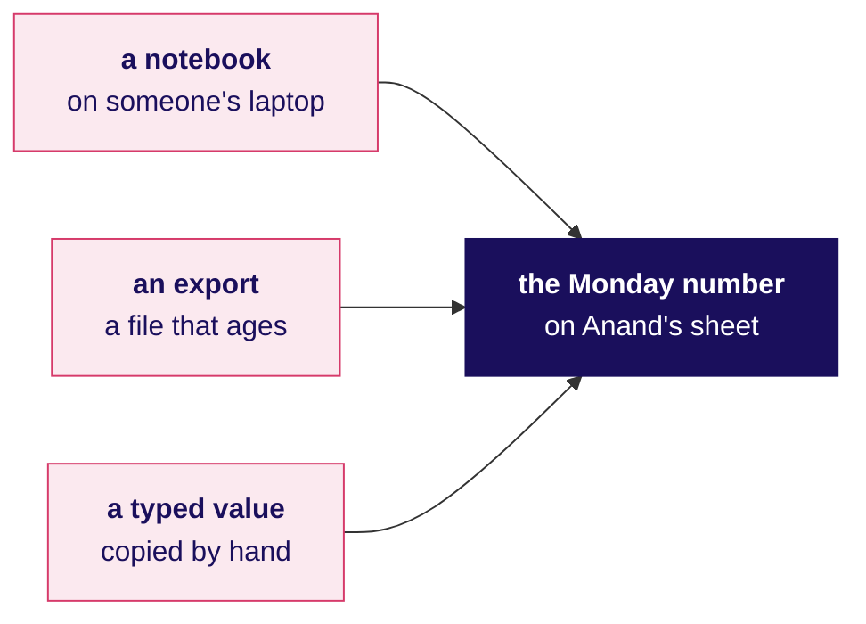

---

## In what order does the database run a query's clauses?

Seven boxes go up left to right, drawn once and left up all day. A query is written SELECT, FROM, WHERE,
GROUP BY, HAVING, ORDER BY, LIMIT, and it runs as the arrows show; most of the day's refusals and
wrong numbers are explained by this order. SELECT is drawn dark because it comes fifth.

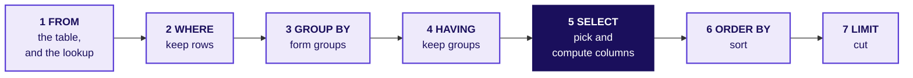

---

## Which numbers does the Monday sheet carry, and which table holds each?

Week 1 Monday's revenue tree goes up under the run order: revenue is customers who bought, times
orders per customer, times revenue per order. Every leaf comes from the orders table, and the segment
lives on the customer table. Beside it goes the definition the day's first trap tests: a customer
who bought is a customer with at least one order in the quarter, counted once.

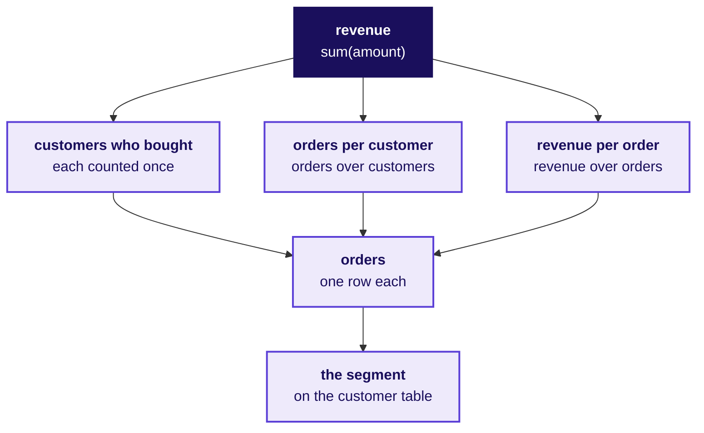

---

## How do you connect VS Code to the warehouse and run one block of a `.sql` file?

This is the day's first-use step, taken before chapter 1's first query. The steps follow Microsoft
Learn's quickstart for the PostgreSQL extension,
https://learn.microsoft.com/en-us/azure/postgresql/development/vs-code-extension/quickstart-connect-query (checked 30 September 2026),
and the settings come from the Codespace's own configuration, which installs the extension
(`ms-ossdata.vscode-pgsql`) and loads the warehouse into a database called `kalpa`. The extension's
screens were not run in this build, so the labels below are the quickstart's.

| Step | What you do | What you should see |
|---|---|---|
| 1 | Open the PostgreSQL view with `Ctrl+Alt+D` (`Cmd+Alt+D` on a Mac) or the PostgreSQL icon in the Activity Bar. | A Connections section, empty the first time. |
| 2 | Hover over the Connections header and choose Add New Connection, the plus icon. | A connection dialog on its Parameters tab. |
| 3 | Enter server name `localhost`, authentication type Password, user name `postgres`, password `postgres` and database name `kalpa`. | The fields filled, with a connection name of your choice. |
| 4 | Choose Save & Connect. | The server in the Connections tree with a green status mark. |
| 5 | Open `sql/C2_W02_D01_01_book_STUDENT.sql`, select the first block, `c1_tables`, and run it with `Ctrl+Shift+E` (`Cmd+Shift+E` on a Mac). | Seven tables with the number of columns each carries. |

Whether those shortcuts behave the same in a Codespace opened in a browser was not verified. If the
extension reports "Connection refused", the database server is not running: in the terminal, run
`bash .devcontainer/load_warehouse.sh`, which waits for the server and reloads the warehouse. The same
check without the extension is `psql -c "SELECT count(*) FROM orders;"`, which prints 1000 once the
warehouse is loaded, since the Codespace's settings name the host, the user and the database.

---

## What does the warehouse hold, and where does each leaf live?

The first query reads the catalogue, `information_schema`, and the board records its answer: seven
tables, of which today's tree needs two. An order carries its customer, date, quarter, channel,
amount and status; the segment is on the customer.

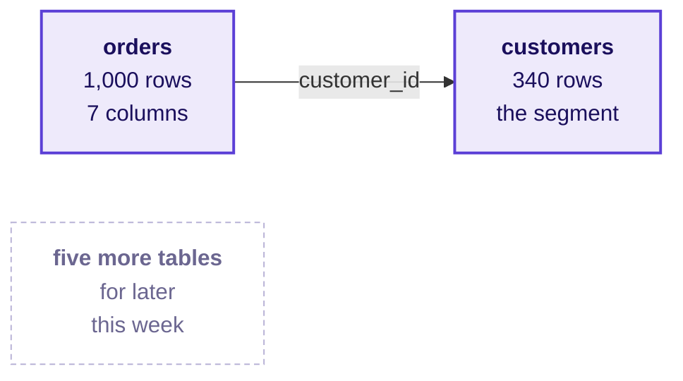

---

## What does each count count on one table?

Chapter 1's check goes up next. The hurried query's `count(*) AS customers` said 538 and 462
customers, 1.00 order each, so three counts, each named for what it counts, go up side by side.
Under them the room writes the fix per quarter: 244 and 227 customers who bought, 2.20 and 2.04
orders each.

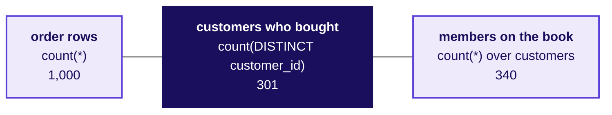

---

## How can two sources agree on the total and part on the branches?

For chapter 2, last week's extract and the warehouse both fell 1.6 percent, and their two trees go
up as products of their branches, each Q2 over Q1. Under them goes the check, who bought in both
quarters: 69 of 69 in the extract, 170 of 301 in the book.

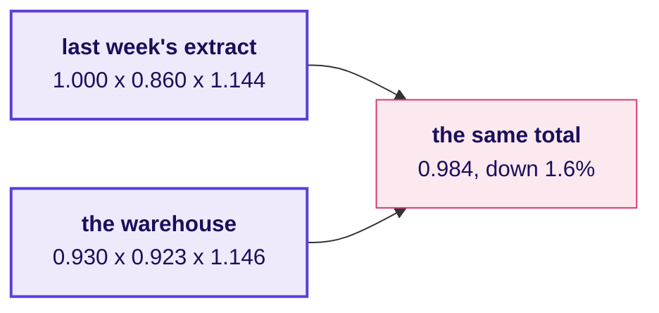

The second route goes up beside it as a bridge: Q1's 244 customers, less the 74 who bought in Q1 and
not in Q2, plus the 57 who bought in Q2 and not in Q1, is 227.

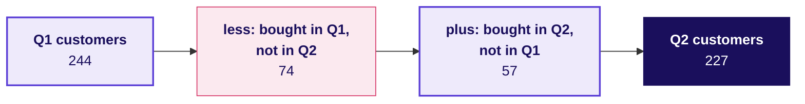

---

## Where does a test on a group go, and how is a ratio checked?

Chapter 3's drawing takes three boxes from the run order and adds the test the day uses: a rate on
fewer than 30 customers goes on the sheet flagged, and only HAVING can see a group's count. Beside it
goes the multiply-back check on the hurried ratio: 140 orders over 76 customers printed 1, and 1 times
76 is 76, where the orders are 140; in numeric it is 1.84.

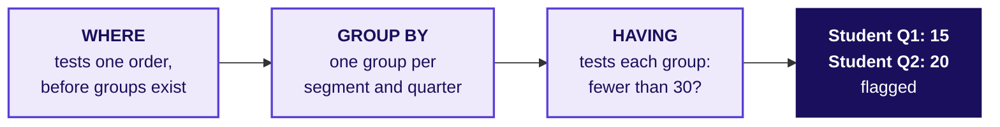

---

## How do named steps set Q1 beside Q2, and who is inside each average?

Chapter 4's drawing is the shape of the query, one named step per job, read from the top down. Beside
it go the members inside the hurried average of Retail-Plus spend: 107 in the step, 91 inside Q1's
average and 76 inside Q2's, so Q1 and Q2 were averaged over different people. With Rs 0 written in on
purpose, the same 107 members spent Rs 5,474 and then Rs 3,863, down 29.4 percent.

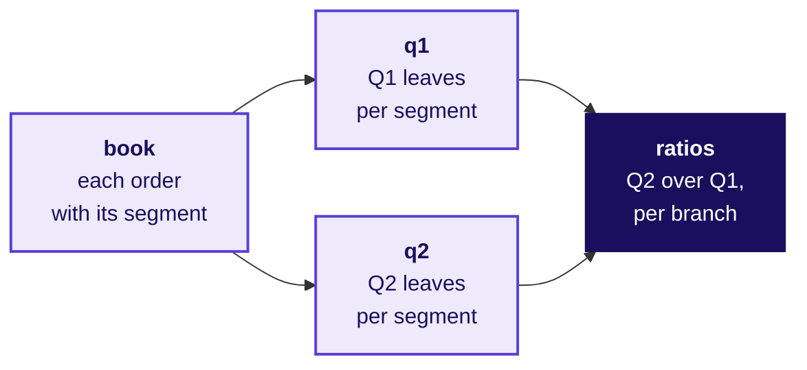

---

## Why can the half-year's customers not be added from the quarters?

In chapter 5, adding Retail-Plus's two quarter rows gave 167 customers in a tier of 120 members.
The overlap explains the gap, and the counted half-year goes up as the answer.

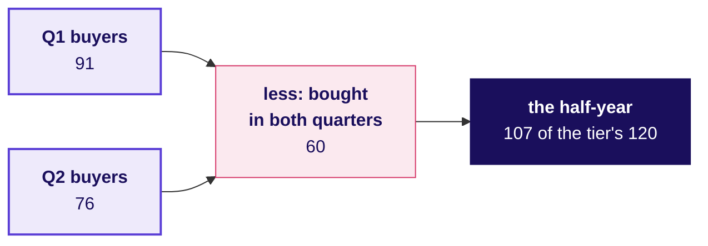

Beside it goes the rule the drawing proves. Orders and rupees add across quarters, because an order
sits in one quarter, and customers add across segments, because a customer sits in one segment; the
half-year's customers are counted again from the orders.

---

## How does a run show that the book held still while the sample moved?

Chapter 6 sets the unordered sample beside the fingerprint. The sample drew Rs 3,900 on Monday and
Rs 4,590 after an overnight reload that changed no value, while the book's fingerprint held at 1,000
rows, Rs 19,84,00,000 and 301 customers. The fix goes under it: `ORDER BY order_id LIMIT 5` draws
the same five, Rs 3,900, both times.

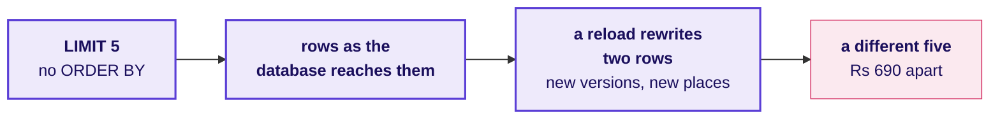

---

## What does the Monday suite tell Anand?

The day's answer goes up as one chain, the evidence in the order Anand reads it and the caveat last.

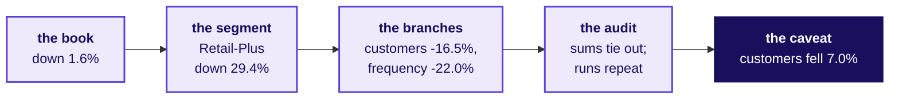

---

## What is on the board when the day ends?

The run order is still up with SELECT drawn dark, and the tree beside it carries the day's numbers on
its leaves: 244 and 227 customers who bought, 2.20 and 2.04 orders each, Rs 10,00,00,000 and
Rs 9,84,00,000. Under them sit the three counts, the two trees that multiply to 0.984 with the bridge
from 244 to 227, the HAVING test with Student flagged and the multiply-back check, the named steps
with 107, 91 and 76 written beside them, the half-year with 107 of 120 ringed, and the sample that
moved beside the fingerprint that held. The chain to Anand runs across the bottom, and beside it the
six lines the cheat sheet prints:

1. A count says what it counts: order rows are count(*), customers are count(DISTINCT customer_id).
2. A matching total is one leaf matching, so compare every leaf as a change.
3. Divide in numeric, round on purpose, and keep the counts beside the ratio.
4. An average names who is inside it, so write the zero on purpose.
5. Orders and rupees add across quarters; customers are counted again from the orders.
6. Order every list on a column no two rows share, and print the book's fingerprint beside the numbers.

Tomorrow's question goes in the corner, left open: how much of what was booked was collected?
