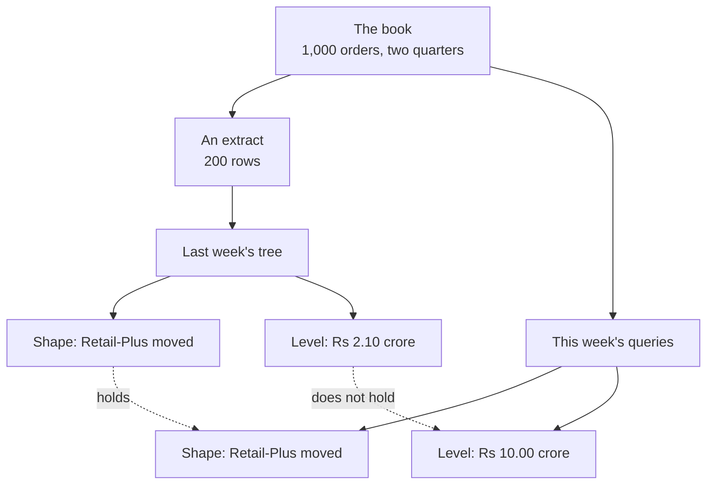
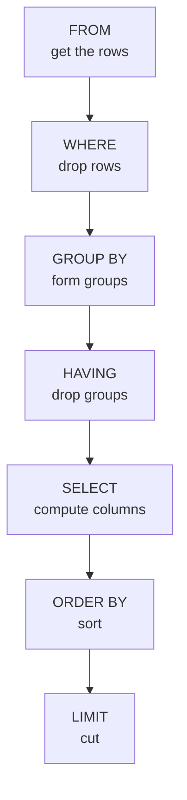

# The board work: two drawings, both made before anyone types SQL

## Drawing one: where last week's number went

Draw this before running a single query. The room has just been told the warehouse holds a
thousand orders and their file held two hundred rows, and the instinct is that somebody made a
mistake. Nobody did, and the drawing is what shows it.

The two dotted lines carry the lesson. A sample is reliable about structure long before it is
reliable about level, and an analyst who says which of the two they are claiming is worth more
than one who is never questioned.

## Drawing two: the order a query runs in

This is the day's mental model and it earns its own board. Draw the seven boxes downward, then
write the clauses of a query beside them in the order they were typed, and let the room see the
crossing lines.

Three consequences fall straight out of the picture, and none of them has to be memorised.

| What the picture says | What follows |
|---|---|
| `WHERE` sits above `GROUP BY` | An aggregate in `WHERE` is refused, because no group exists yet |
| `SELECT` sits below `GROUP BY` | A column that is neither grouped nor aggregated has no single value to show |
| `ORDER BY` sits below `SELECT` | An alias made in `SELECT` is visible to `ORDER BY` and invisible to `WHERE` |

## How the board is used through the day

Leave both drawings up. Every error the room meets gets pointed at rather than explained: the
`GROUP BY` message is a finger on the `SELECT` box, the aggregate refusal is a finger on the
`WHERE` box. By the fourth error somebody in the room points before the trainer does, which is
the moment the model has landed.
