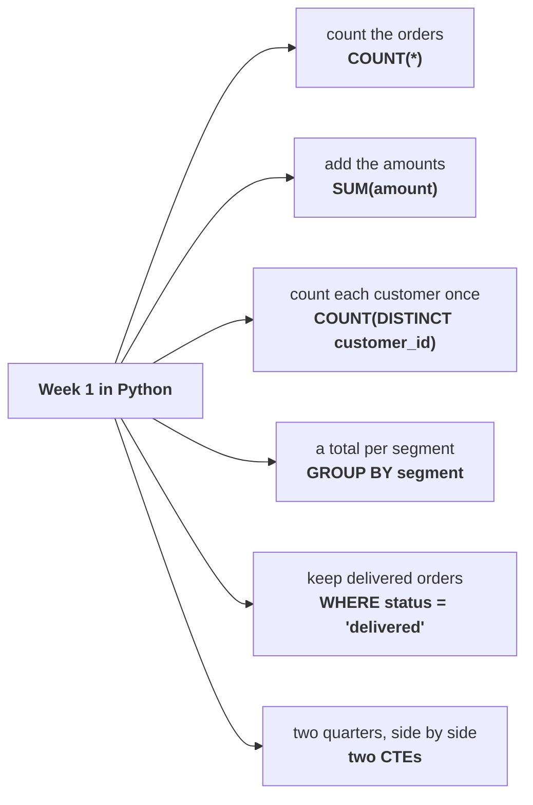
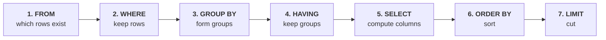
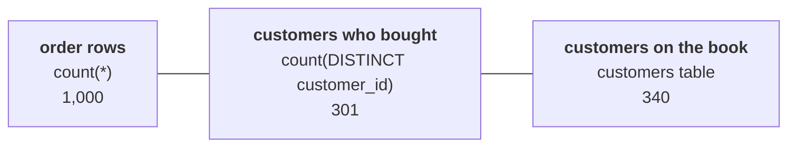
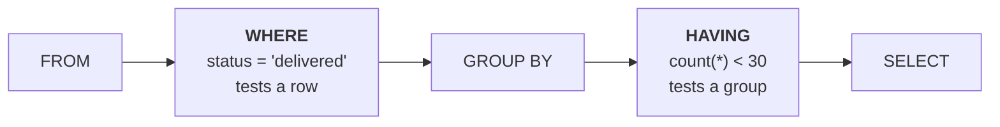
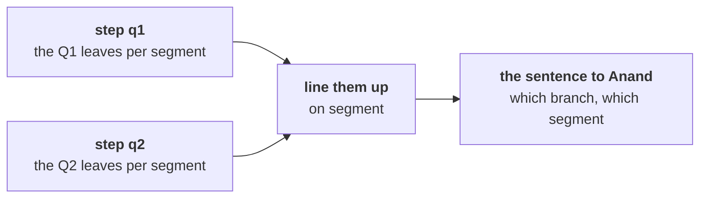

# The board, and the first connection to the warehouse

Two parts. Part one is the first-use walkthrough: connecting VS Code to the warehouse and running a
`.sql` file, written for you in front of the screen. Part two is the board work for Week 2, Monday,
in the order it goes up, drawn from the same fences the deck, the notebooks and the cheat sheet use.

---

## Part one. Connecting to the warehouse from VS Code

The Codespace starts a PostgreSQL 16 server and loads the Kalpa warehouse into a database called
`kalpa` when it is created. The connection settings are already in the Codespace's environment:
host `localhost`, port `5432`, user `postgres`, password `postgres`, database `kalpa`. The
PostgreSQL extension from Microsoft is installed with the Codespace.

The steps below follow the extension's own quickstart. Labels in VS Code move between versions, so
each step says what the screen asks for rather than where a button sits.

| Step | What you do | What you should see |
|---|---|---|
| 1 | Open the PostgreSQL view: the elephant icon in the left bar, or `Ctrl+Alt+D` (`Cmd+Alt+D` on a Mac). | A panel with a Connections section, empty the first time. |
| 2 | Add a new connection from the Connections header. | A form asking for a server name, an authentication type, a user name, a password and a database name. |
| 3 | Fill it in: server `localhost`, authentication by password, user `postgres`, password `postgres`, database `kalpa`, and a connection name such as `kalpa warehouse`. | The fields filled, with a choice to save the password. |
| 4 | Save and connect. | The connection in the tree with a green status mark. Open it and `kalpa` lists its tables. |
| 5 | Open `sql/C2_W02_D01_01_warehouse_STUDENT.sql` and make sure the editor is connected to `kalpa`: the query editor's toolbar names the database it will run against. | The file, with `kalpa` named as its database. |
| 6 | Put the cursor inside the first block, `r1_tables`, select it, and run it: `Ctrl+Shift+E` (`Cmd+Shift+E` on a Mac), or the run button in the editor's toolbar. | A result grid with seven tables and their column counts. |

**Where this goes wrong.**

- **The editor runs against the wrong database.** If the database field was left at `postgres`,
  the server's default database, no Kalpa table exists there, and the error reads `relation "orders"
  does not exist`. Switch the editor's database to `kalpa`.
- **Nothing answers on port 5432.** The server did not start with the Codespace. In the terminal,
  run `bash .devcontainer/load_warehouse.sh`; it waits for the server and reloads the warehouse, and
  its last line reports the rows it loaded.

**The check, in the terminal.** The same connection without the extension:

```bash
psql -c "SELECT count(*) FROM orders;"
```

It prints 1000 when the warehouse is loaded, because the Codespace's environment already names the
host, the user and the database.

**Closing up.** Nothing to stop: the database lives inside your Codespace and stops with it.

The steps follow the PostgreSQL extension's quickstart,
https://learn.microsoft.com/en-us/azure/postgresql/extensions/vs-code-extension/quickstart-connect (verified 29 Sep 2026).
The extension's screens were read from that page and were not run in the session that wrote this
walkthrough, so they are not verified; the `psql` check and the reload script were run.

---

## Part two. The board, in the order it goes up

### First drawing: every Week 1 step has a SQL counterpart

Last week's move on the left, its clause on the right. It stays up all morning; each round ticks
one row.


```mermaid
flowchart LR
    T["<b>Week 1 in Python</b>"] --> C["count the orders<br/><b>COUNT(*)</b>"]
    T --> S["add the amounts<br/><b>SUM(amount)</b>"]
    T --> D["count each customer once<br/><b>COUNT(DISTINCT customer_id)</b>"]
    T --> G["a total per segment<br/><b>GROUP BY segment</b>"]
    T --> W["keep delivered orders<br/><b>WHERE status = 'delivered'</b>"]
    T --> Q["two quarters, side by side<br/><b>two CTEs</b>"]
```

### Second drawing: the order a query runs in

Seven boxes, left to right, drawn once and left up all day.


```mermaid
flowchart LR
    F["<b>1. FROM</b><br/>which rows exist"] --> W["<b>2. WHERE</b><br/>keep rows"] --> G["<b>3. GROUP BY</b><br/>form groups"] --> H["<b>4. HAVING</b><br/>keep groups"] --> S["<b>5. SELECT</b><br/>compute columns"] --> O["<b>6. ORDER BY</b><br/>sort"] --> L["<b>7. LIMIT</b><br/>cut"]
```

### Third drawing, round 1: three counts, three questions


```mermaid
flowchart LR
    R["<b>order rows</b><br/>count(*)<br/>1,000"] --- B["<b>customers who bought</b><br/>count(DISTINCT customer_id)<br/>301"] --- K["<b>customers on the book</b><br/>customers table<br/>340"]
```

Beside it: orders per customer is 1,000 over 301, which is 3.32 across the two quarters.

### Fourth drawing, round 2: WHERE keeps rows, HAVING keeps groups


```mermaid
flowchart LR
    F["FROM"] --> W["<b>WHERE</b><br/>status = 'delivered'<br/>tests a row"] --> G["GROUP BY"] --> H["<b>HAVING</b><br/>count(*) < 30<br/>tests a group"] --> S["SELECT"]
```

Beside it, the multiply-back check: 140 orders over 76 customers is 1.84, and 1.84 times 76 gives
140; the integer 1 times 76 gives 76.

### Fifth drawing, round 3: two named steps


```mermaid
flowchart LR
    Q1["<b>step q1</b><br/>the Q1 leaves per segment"] --> J["<b>line them up</b><br/>on segment"]
    Q2["<b>step q2</b><br/>the Q2 leaves per segment"] --> J
    J --> A["<b>the sentence to Anand</b><br/>which branch, which segment"]
```

Beside it, the denominator of the member average written out: 107 members, 91 with a Q1 value, 76
with a Q2 value.

### What is on the board when the day ends

The seven-box run order, the Week 1 table with every row ticked, the three counts, and four lines
written across the bottom, word for word as the cheat sheet prints them:

- Count what you mean: COUNT(DISTINCT customer_id) counts people; count(*) counts rows.
- Divide in numeric and round on purpose: integers divide as integers.
- Name who is averaged: AVG skips NULLs, so say whether a NULL means zero.
- Order every list on a unique key: a table has no order.
