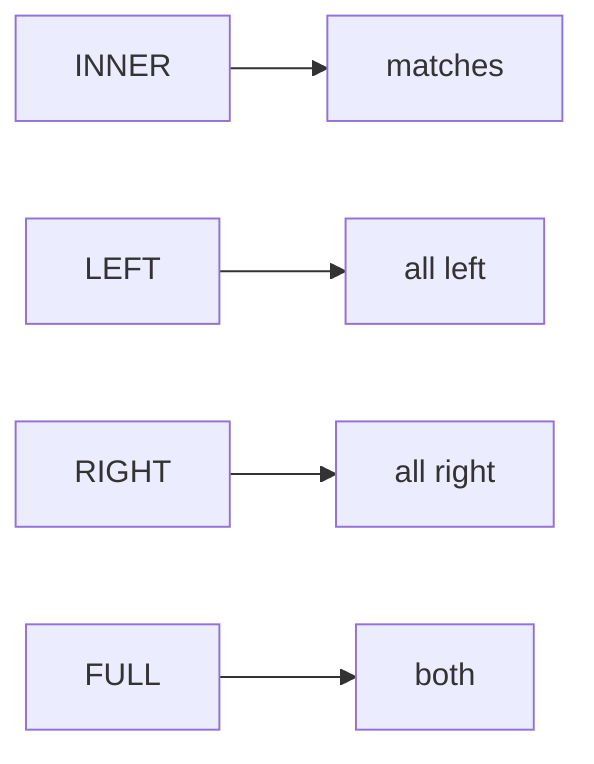

# Joins, and the count that catches them

## Panel 1: What each join keeps

**Crux:** Each join answers a different question about the rows that do not match, so choosing one
is a business decision rather than a style preference.



| Join | Keeps |
|---|---|
| `INNER` | Only rows that matched on both sides |
| `LEFT` | Every left row, matched or not |
| `RIGHT` | Every right row, matched or not |
| `FULL OUTER` | Everything, with NULLs on either side |

## Panel 2: The count check, every time

**Crux:** A join is done when its row count is explained, not when it is checked.

```sql
-- Rows before: 1,000 orders.
-- Rows after:  1,450.
-- Difference:  450 orders carry two payment rows.
-- Therefore:   do not SUM the order amount over this join.
```

The "Therefore" line is the one that saves somebody. If you cannot write it, you do not yet know
what your join did.

## Panel 3: Fan-out, and why it doubles rather than nudges

**Crux:** One row on the left times many on the right multiplies every aggregate, and the damage
is proportional to what the duplicated rows are worth.

If the duplicated orders are a random slice of the book, a total moves a few percent. If they are
the large invoices, which is normal because large invoices get instalment terms, the total roughly
doubles.

`count`, `sum` and `avg` are all wrong after a fan-out. Only `count` looks wrong.

## Panel 4: The two anti-joins

**Crux:** Keep everything, then keep only what failed to match, and you have found absence.

```sql
-- orders with no payment
SELECT o.* FROM orders o
LEFT JOIN payments p ON p.order_id = o.order_id
WHERE p.payment_id IS NULL;

-- payments with no order
SELECT p.* FROM payments p
LEFT JOIN orders o ON o.order_id = p.order_id
WHERE o.order_id IS NULL;
```

## Panel 5: The fix that cannot fan out

**Crux:** Collapse the many side to one row per key before joining, and the count check passes by
construction.

```sql
WITH paid AS (
  SELECT order_id, sum(amount) AS collected
  FROM payments GROUP BY order_id
)
SELECT sum(o.amount) AS booked,
       coalesce(sum(p.collected),0) AS collected
FROM orders o
LEFT JOIN paid p USING (order_id);
```

`coalesce` is load-bearing: an unpaid order joins to NULL, and NULL in arithmetic makes the whole
expression NULL.

## Panel 6: Retry against instalment

**Crux:** They look almost identical in the table, and what separates them is a business fact
rather than a data fact.

| Two payment rows, and | Means | What to do |
|---|---|---|
| The amounts are identical | A repeated charge | Report it, do not net it |
| The amounts differ | A split invoice | Leave it alone, it is correct |

A rule that deleted every duplicate payment would delete four hundred legitimate instalments. The
judgment is yours and it goes in writing.
