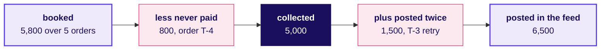

# What did Q2 collect, and is anything counted twice?

Kalpa Retail, Week 2 Tuesday: Anand Iyer, finance controller, wants collected against booked for Q2 by
order and channel. Booked is every order at its amount; collected, each payment once; posted, every
row the feed holds.

## Panel 1: What does the bridge from booked to posted look like?


```mermaid
flowchart LR
    B["<b>booked</b><br/>5,800 over 5 orders"] --> U["<b>less never paid</b><br/>800, order T-4"]
    U --> C["<b>collected</b><br/>5,000"]
    C --> R["<b>plus posted twice</b><br/>1,500, T-3 retry"]
    R --> P["<b>posted in the feed</b><br/>6,500"]
    classDef known fill:#EEEAFB,stroke:#5B3FD6,color:#1A0F5C,stroke-width:2px
    classDef bad fill:#FBE9EF,stroke:#D63A6A,color:#1A0F5C
    classDef bet fill:#1A0F5C,stroke:#1A0F5C,color:#FFFFFF
    class B,P known
    class U,R bad
    class C bet
```

Invented numbers, on the day's two tiny tables. Booked comes from `orders` alone and posted from
`payments` alone, and each move has a list of orders behind it.

**Crux:** A join is done when its row count is explained: rows in, rows out, the difference named.

## Panel 2: Which join answers which question?

| Join | The question it answers | Rows on the tiny tables |
|---|---|---|
| INNER | Which orders were matched, once per payment? | 6 |
| LEFT, orders first | What happened to every order, paid or not? | 7 |
| RIGHT | What happened to every payment, matched or not? | 7 |
| FULL OUTER | What fails to match, on either side? | 8 |

Anand asked about every booked order, so his report is a LEFT JOIN with `orders` first. The platform
lead's question about every payment row starts from `payments`.

**Crux:** Start from the table whose every row must survive, and name its grain.

## Panel 3: Why does a join double the bookings, and how do you stop it?

A two-instalment order owns two payment rows, so a join writes its amount twice: Q2's 462 orders
become 678 rows, and the first draft reports Rs 19,29,04,410 against Rs 9,84,00,000 booked. DISTINCT
loses Rs 20,32,780, since orders share amounts.

```sql
WITH posted_per_order AS (
  SELECT order_id, sum(amount) AS posted
  FROM payments GROUP BY order_id)
SELECT o.order_id, o.amount, pp.posted
FROM orders o LEFT JOIN posted_per_order pp
  ON pp.order_id = o.order_id
WHERE o.quarter = 'Q2';
```

**Crux:** Bring the many side to the grain of the question before you join.

## Panel 4: Where does a condition on the payments table go?

In WHERE it runs after the join: an unpaid order's NULL date fails the test, and the LEFT JOIN turns
INNER without a word. In ON it decides which payments attach, and every order survives.

```sql
LEFT JOIN payments p
  ON p.order_id = o.order_id
 AND p.paid_date BETWEEN '2026-07-01'
                     AND '2026-09-30'
WHERE p.order_id IS NULL   -- the anti-join
```

Avoid `NOT IN`: one NULL id in the subquery and it returns no rows at all. `NOT EXISTS` reads as
Anand's sentence and stays correct.

**Crux:** In a LEFT JOIN, a condition on the right-hand table goes in ON.

## Panel 5: How do you tell a retry from an instalment?

| Pattern per order | What it is | What to do |
|---|---|---|
| Instalments 1 and 2 | The customer paid as asked | Count both |
| Instalment 1, twice | The gateway retried | Count it once; list the surplus |

`GROUP BY order_id HAVING count(*) > 1` flags every instalment order too, 216 in Q2. Group by
`order_id, instalment_no`, and the list's surplus, `sum(amount) - max(amount)`, must equal posted less
collected.

**Crux:** Two payment rows are not a double payment: a retry is one order and instalment, twice.

## Panel 6: Which checks let the number leave?

| Tie-back check | Stops |
|---|---|
| Orders against the orders table | a dropped or repeated order |
| Booked against `orders` alone | a fan-out |
| Gap against booked less collected | a NULL gap; use `coalesce(collected, 0)` |
| Gap against the unpaid list | a wrong list |
| Collected plus twice against posted | a retry inside collected |

When one fails late on reporting day, booked leaves with the open line named; collected is held.

**Crux:** A check is worth its power to fail: tie every figure back to one table alone.
