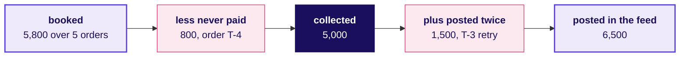

# Booked against collected

Kalpa Retail, Week 2 Tuesday. A join is a promise about the rows that do not match, a repeating key
multiplies before it loses, and a joined number leaves the team only when its row count is explained.

## Panel 1: The bridge, from booked to what the feed posted


```mermaid
flowchart LR
    B["<b>booked</b><br/>5,800 over 5 orders"] --> U["<b>less never paid</b><br/>800, order T-4"]
    U --> C["<b>collected</b><br/>5,000"]
    C --> R["<b>plus posted twice</b><br/>1,500, T-3 retry"]
    R --> P["<b>posted in the feed</b><br/>6,500"]
    classDef known fill:#EEEAFB,stroke:#5B3FD6,color:#1A0F5C,stroke-width:2px
    classDef bad fill:#FBE9EF,stroke:#D63A6A,color:#1A0F5C
    classDef bet fill:#1A0F5C,stroke:#1A0F5C,color:#FFFFFF
    class B,P known
    class U,R bad
    class C bet
```

Invented numbers, on the two tiny tables. Booked comes from `orders` alone and posted from `payments`
alone. The unpaid list is the anti-join, and the retry list is the same instalment posted twice.

**Crux:** Collected sits between booked and posted, and each step of the bridge is a list of rows
someone can act on.

## Panel 2: Which join answers which question

| Join | The question it answers | Tiny rows |
|---|---|---|
| INNER | Which orders were matched, once per payment? | 6 |
| LEFT | What happened to every order, paid or not? | 7 |
| RIGHT | What happened to every payment, matched or not? | 7 |
| FULL OUTER | What is unmatched on either side? | 8 |

Anand asked about every order, so his report is a LEFT JOIN with `orders` on the left.

**Crux:** Every join answers a question about the rows that do not match; choose the join by that question.

## Panel 3: The grain rule, and the fan-out

Say what one row stands for before the join: one order in `orders`, one payment event in `payments`.
An instalment order has two payment rows, so a join repeats its order and `SUM(o.amount)` counts it
twice. Q2 turns 462 orders into 678 rows, and "collected" reads 1.96 times booked.

```sql
WITH paid_per_order AS (
  SELECT order_id, SUM(amount) AS paid
  FROM payments GROUP BY order_id)
SELECT COUNT(*), SUM(o.amount),
       SUM(COALESCE(pp.paid, 0))
FROM orders o
LEFT JOIN paid_per_order pp
  ON pp.order_id = o.order_id
WHERE o.quarter = 'Q2';
```

**Crux:** A key that repeats on one side multiplies the other side's rows before any number is summed.

## Panel 4: The reconciliation, written above the number

```sql
-- Rows in:  every Q2 order, from orders alone.
-- Rows out: one row per order; equals rows in.
-- Booked:   after the join equals from orders.
-- The gap:  booked minus collected equals
--           the booked value of the unpaid list.
-- The feed: collected plus the retry surplus
--           equals what payments posted.
```

If one line fails, the number stays in the team and the line that failed is named.

**Crux:** A join is done when its row count is explained: rows in, rows out, and the difference named.

## Panel 5: WHERE against ON, and the anti-join

A payments condition in WHERE runs after the join and throws away the NULL rows of unpaid orders.
In ON, it decides which payments attach, and every order survives.

```sql
LEFT JOIN payments p
  ON p.order_id = o.order_id
 AND p.paid_date BETWEEN '2026-07-01'
                     AND '2026-09-30'
```

The anti-join is the one WHERE test on the right table that belongs there:
`WHERE p.payment_id IS NULL`, or `WHERE NOT EXISTS (...)`, which reads as Anand's sentence.

**Crux:** A condition on the right-hand table belongs in the ON clause, or the LEFT JOIN becomes an INNER one.

## Panel 6: A retry against an instalment

| Pattern per order | What it is | What to do |
|---|---|---|
| Instalments 1 and 2 | The customer paid as asked. | Count both payments. |
| Instalment 1 twice | The gateway retried. | Count it once and report the surplus. |

`GROUP BY order_id HAVING COUNT(*) > 1` lists every instalment order as well, 216 in Q2. Group by
`order_id, instalment_no` instead.

**Crux:** Two payment rows are not a double payment until the grain says they are the same payment.
