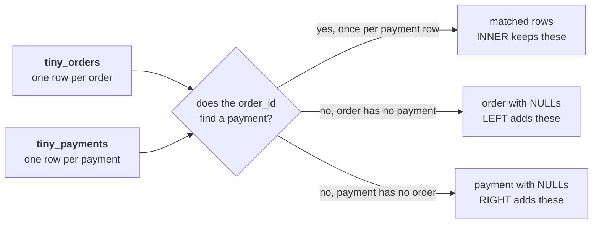

# Which rows does each join keep on two tiny tables, traced by hand before any query runs?

You build this sheet with the trainer in chapter 1, on the board and on your paper at the same time.
The two tables below are invented: five orders and seven payment rows, small enough to hold in your
head, and shaped like the Kalpa feed Anand's question runs on. Nothing here is graded.

Anand's question sits over the whole trace: "Show me, order by order, what we actually collected
against what we booked." Before the warehouse answers it, you prove on paper what each join keeps,
what it drops and what it repeats.

You write the rows first, and the query runs afterwards, only to check what you wrote.

---

## What do the two invented tables hold?

`tiny_orders`, one row per order:

| order_id | channel | amount |
|---|---|---|
| T-1 | app | 1,000 |
| T-2 | web | 2,000 |
| T-3 | store | 1,500 |
| T-4 | app | 800 |
| T-5 | store | 500 |

`tiny_payments`, one row per payment the feed posted:

| payment_id | order_id | paid_date | amount | instalment_no |
|---|---|---|---|---|
| P-1 | T-1 | 2026-07-03 | 1,000 | 1 |
| P-2 | T-2 | 2026-07-05 | 1,200 | 1 |
| P-3 | T-2 | 2026-08-05 | 800 | 2 |
| P-4 | T-3 | 2026-07-09 | 1,500 | 1 |
| P-5 | T-3 | 2026-07-09 | 1,500 | 1 |
| P-6 | T-5 | 2026-07-12 | 500 | 1 |
| P-7 | T-9 | 2026-07-14 | 600 | 1 |

The trainer draws the question each join answers on the board first:



---

## Part 1. What does one row of each table stand for?

Before you join any table at work, you write this sentence about it first.

Write, beside each table on your paper, what one row is. Then write whether `order_id` can repeat
in it, and which rows prove it.

| Table | One row is | Can order_id repeat? | The rows that prove it |
|---|---|---|---|
| tiny_orders | | | |
| tiny_payments | | | |

---

## Part 2. Which rows does the INNER join return?

At work you predict a join's output this way before you trust it.

Write every row the INNER join returns, in order_id order. Leave the query closed.

```sql
SELECT o.order_id, o.amount AS booked, p.payment_id, p.amount AS paid
FROM tiny_orders o
JOIN tiny_payments p ON p.order_id = o.order_id;
```

| order_id | booked | payment_id | paid |
|---|---|---|---|
| | | | |
| | | | |
| | | | |
| | | | |
| | | | |
| | | | |
| | | | |

Under the table, write the row count, the orders that appear more than once, and the order that
never appears.

---

## Part 3. Which rows does the LEFT join add?

Any question at work about every booked order needs this join.

Now keep every order, paid or not. Write the rows, with `NULL` wherever the right side has nothing.

```sql
SELECT o.order_id, o.amount AS booked, p.payment_id, p.amount AS paid
FROM tiny_orders o
LEFT JOIN tiny_payments p ON p.order_id = o.order_id;
```

| order_id | booked | payment_id | paid |
|---|---|---|---|
| | | | |
| | | | |
| | | | |
| | | | |
| | | | |
| | | | |
| | | | |
| | | | |

Under the table, write the row count and one sentence on what the LEFT join added to the INNER one.

---

## Part 4. Which extra rows do RIGHT and FULL keep?

At work, these two answer the questions that start from the other table.

The trainer names these two and does not trace them in full. Write one sentence for each: which
extra row appears, and which question about Kalpa's feed that row answers.

---

## Part 5. Did the query return what you wrote?

At work you check every prediction against the result, row by row.

Now run the queries in `sql/C2_W02_D02_01_what_a_join_keeps_STUDENT.sql`, which builds the same two tables and runs each join. Tick every row you wrote
correctly and circle every row you missed or invented. Keep the circled rows, since each one shows a
place where your prediction and the join disagreed.

---

## Part 6. Can you answer four picks from your paper alone?

An interviewer asks you to predict row counts like these aloud.

Post one line, four letters in item order, no spaces, in this shape:

```
Post exactly this shape: xxxx
```

### Q1. How many rows does the INNER join return on these two tables?

a) 5, one row for each order in tiny_orders
b) 7, one row for each payment the feed posted
c) 6, once per payment that finds its order
d) 4, one row for each order that has a payment

### Q2. Which orders appear twice in the INNER join, and why?

a) T-2 and T-3, since each has two payment rows
b) T-3 only, since its payment was posted twice
c) T-2 only, since it was paid in two instalments
d) None, since an INNER join keeps each order once

### Q3. What does the LEFT join show for T-4, the order nobody paid?

a) Nothing, since T-4 has no payment to join to
b) One row with NULL in every payment column
c) One row with a paid amount of zero, already filled in
d) Two rows, one for the order and one for its payment

### Q4. Which of the four joins show payment P-7, the one the platform lead will ask about?

a) LEFT, which keeps every row that has a key
b) RIGHT alone, since it keeps every payment row
c) Only the FULL join, since P-7 matches nothing
d) RIGHT and FULL, which keep every payment row
