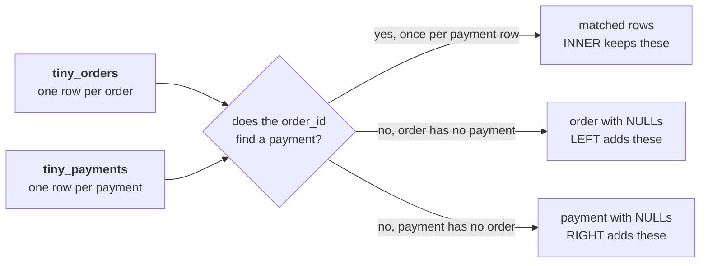

# Guided: two tiny tables, traced by hand before any query runs

Built with the trainer in round 1, on the board and on your paper at the same time. The two tables
below are invented: five orders and seven payment rows, small enough to hold in your head, and
shaped like the Kalpa feed Anand's question runs on. Nothing here is graded.

Anand's question sits over the whole trace: "Show me, order by order, what we actually collected
against what we booked." Before the warehouse answers it, you prove on paper what each join keeps,
what it drops and what it repeats.

The rule for this sheet is simple. You write the rows first, and the query runs afterwards, only to
check what you wrote.

---

## The two tables (invented)

`tiny_orders`, one row per order:

| order_id | channel | amount | status |
|---|---|---|---|
| T-1 | app | 1,000 | delivered |
| T-2 | web | 2,000 | delivered |
| T-3 | store | 1,500 | delivered |
| T-4 | app | 800 | delivered |
| T-5 | store | 500 | delivered |

`tiny_payments`, one row per payment the feed posted:

| payment_id | order_id | paid_date | amount | instalment_no |
|---|---|---|---|---|
| P-1 | T-1 | 2026-07-03 | 1,000 | 1 |
| P-2 | T-2 | 2026-07-05 | 1,200 | 1 |
| P-3 | T-2 | 2026-08-05 | 800 | 2 |
| P-4 | T-3 | 2026-07-09 | 1,500 | 1 |
| P-5 | T-3 | 2026-07-09 | 1,500 | 1 |
| P-6 | T-5 | 2026-07-12 | 500 | 1 |
| P-7 | T-9 | 2026-07-14 | 600 | 1 |

The picture of the question each join answers, drawn on the board first:



---

## Part 1. Name the grain, one sentence each

Write, beside each table on your paper, what one row is. Then write whether `order_id` can repeat
in it, and which rows prove it.

| Table | One row is | Can order_id repeat? | The rows that prove it |
|---|---|---|---|
| tiny_orders | | | |
| tiny_payments | | | |

---

## Part 2. The INNER join, written by hand

Write every row the INNER join returns, in order_id order. Leave the query closed.

```sql
SELECT o.order_id, o.amount AS booked, p.payment_id, p.amount AS paid
FROM tiny_orders o
JOIN tiny_payments p ON p.order_id = o.order_id;
```

| order_id | booked | payment_id | paid |
|---|---|---|---|
| | | | |
| | | | |
| | | | |
| | | | |
| | | | |
| | | | |
| | | | |

Under the table, write the row count, the orders that appear more than once, and the order that
never appears.

---

## Part 3. The LEFT join, written by hand

Now keep every order, paid or not. Write the rows, with `NULL` wherever the right side has nothing.

```sql
SELECT o.order_id, o.amount AS booked, p.payment_id, p.amount AS paid
FROM tiny_orders o
LEFT JOIN tiny_payments p ON p.order_id = o.order_id;
```

| order_id | booked | payment_id | paid |
|---|---|---|---|
| | | | |
| | | | |
| | | | |
| | | | |
| | | | |
| | | | |
| | | | |
| | | | |

Under the table, write the row count and one sentence on what the LEFT join added to the INNER one.

---

## Part 4. RIGHT and FULL, named

The trainer names these two and does not trace them in full. Write one sentence for each: which
extra row appears, and which question about Kalpa's feed that row answers.

---

## Part 5. Check what you wrote

Now run steps 1 to 6 of `sql/C2_W02_D02_01_tiny_tables_STUDENT.sql`. Tick every row you wrote
correctly and circle every row you missed or invented. A circled row is the lesson, so keep it.

---

## Part 6. Four quick picks, from your paper

Post one line, four letters in item order, no spaces, in this shape:

```
Post exactly this shape: xxxx
```

### Q1. How many rows does the INNER join return on these two tables?

a) 5, one row for each order in tiny_orders
b) 7, one row for each payment the feed posted
c) 6, once per payment that finds its order
d) 4, one row for each order that has a payment

### Q2. Which orders appear twice in the INNER join, and why?

a) T-2 and T-3, since each has two payment rows
b) T-3 only, since its payment was posted twice
c) T-2 only, since it was paid in two instalments
d) None, since an INNER join keeps each order once

### Q3. What does the LEFT join show for T-4, and what does that mean for Anand?

a) Nothing, since T-4 has no payment to join to
b) One row with NULL payment columns: booked, never paid
c) One row with a paid amount of zero, already filled in
d) Two rows, one for the order and one for its payment

### Q4. Which of the four joins show payment P-7, the one the platform lead will ask about?

a) LEFT, which keeps every row that has a key
b) INNER, which keeps every payment it can read
c) Only the FULL join, since P-7 matches nothing
d) RIGHT and FULL, which keep every payment row
