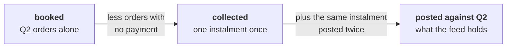

# Solution: the report Anand signs

The worked queries are in `C2_W02_D02_case_solution_STUDENT.sql`, beside this file, and the executed
notebook is `C2_W02_D02_case_solution_STUDENT.ipynb`. This page gives the approach, the reason for
each move and the checks every learner's own numbers must pass. It gives no totals for the unpaid or
double-paid lists, because those are yours to find and defend.

## The idea being tested

A joined number is honest when three things close: the rows, the money and the feed. The rows close
when one row per Q2 order comes out of the join. The money closes when booked less collected is
exactly the value of the orders nobody paid. The feed closes when collected, plus what the gateway
posted twice, plus what no order claims, is every rupee in the payments table.

## Part by part

**Part 1.** `GROUP BY channel` on Q2 orders, with no join. Booked is Rs 9,84,00,000 over 462 orders:
app 153 orders and Rs 4,25,90,270, store 159 and Rs 3,21,48,730, web 150 and Rs 2,36,61,000. Every
later part must reproduce these figures after its join.

**Part 2.** Payments are brought to order grain in two steps. First group by order_id and
instalment_no, and keep one amount per instalment, which counts a retried instalment once. Then sum
those instalments per order. The orders table then LEFT JOINs to that per-order result, and COALESCE
turns a missing payment into a zero. The comment block reads, in words: 462 orders in; 462 rows out;
difference zero, because payments were summed to one row per order before the join; booked after the
join equals part 1. Your block carries those numbers and your own collected figure.

**Part 3.** An anti-join: LEFT JOIN payments and keep the rows where the payment key IS NULL, or
`NOT EXISTS`. Read the count first, then the rows. The list's booked total is checked in part 5.

**Part 4.** A retry is the same order, the same instalment and the same amount posted more than once,
so the list is `GROUP BY order_id, instalment_no HAVING COUNT(*) > 1`, and the surplus is the amount
times the postings beyond the first. `GROUP BY order_id HAVING COUNT(*) > 1` returns 216 Q2 orders,
because it counts every legitimate two-instalment order as well; if your list is that long, your
grain is wrong.

**Part 5.** One CTE chain feeds the report and the checks, so the numbers in both come from the same
rows. The checks, each of which must read true:

| Check | What it compares | What a false tells you |
|---|---|---|
| Rows | Rows out of the join against Q2 orders in part 1 | The join fanned out, or a filter dropped orders |
| Booked | Booked after the join against booked from orders alone | The same, seen in rupees |
| The gap | Booked less collected against the unpaid list's booked total, per channel | A retry is still inside collected, or the unpaid list is built at the wrong grain |
| The feed | Collected plus the surplus against the sum of payments matched to Q2 orders | The retry rule removed too much or too little |
| Every payment | Payment rows matched to Q2, to Q1 and to no order, against the table's row count | A payment was lost or counted twice |

The payments that match no order stay out of collected. They go to the platform lead with their ids,
dates and amounts, because a payment the book cannot claim is a feed problem before it is a revenue
one.

## The two sentences, in shape

"Q2 collected is Rs [collected] against Rs 9,84,00,000 booked, a gap of Rs [gap] that is exactly the
[n] orders with no payment on the attached list, and the collected figure counts each instalment once
after removing [n] gateway double-posts worth Rs [surplus]. Chase [the largest unpaid invoices, by
id] on [channel] first; I have sent the [n] payments that match no order to the platform lead."

A sentence that gives the gap without saying it equals the unpaid list, or that gives collected
without saying how retries were removed, is the sentence Anand sends back.

## The part worth arguing about

Whether the surplus from retries belongs in the report at all. It never enters collected, so the
report is right without it. It belongs beside the report because the customer was charged twice and
somebody owes a reversal, and that is a decision for Anand and the payments team with a list in hand.

## Where the pattern lives in production

Collections reporting in every retailer and lender runs this shape each month: the ledger, the
payment feed, the matched pairs, the breaks on each side and a bridge that closes to the rupee. The
analyst who ships the bridge with the number is the one Finance trusts on reporting day.
