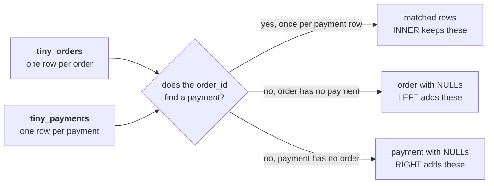

# Solution: which rows does each join keep on two tiny tables?

Answers: 1c 2a 3b 4d

## What does the trace test?

Choosing a join means deciding what happens to the rows that do not match, and the grain of each
table decides its row count before any number is summed. On paper, with five orders and seven
payment rows, a learner can see every row a join keeps, drops and repeats, which is what makes the
warehouse's 678 rows readable an hour later.

## What should your traced tables show?

Part 1, the grain. `tiny_orders` is one row per order, and order_id never repeats in it.
`tiny_payments` is one row per payment posting, and order_id repeats: T-2 carries P-2 and P-3 (two
instalments), and T-3 carries P-4 and P-5 (the same instalment posted twice).

Part 2, the INNER join returns 6 rows:

| order_id | booked | payment_id | paid |
|---|---|---|---|
| T-1 | 1,000 | P-1 | 1,000 |
| T-2 | 2,000 | P-2 | 1,200 |
| T-2 | 2,000 | P-3 | 800 |
| T-3 | 1,500 | P-4 | 1,500 |
| T-3 | 1,500 | P-5 | 1,500 |
| T-5 | 500 | P-6 | 500 |

T-2 and T-3 appear twice each, and T-4 never appears, because it has no payment. P-7 never appears,
because its order T-9 is not in tiny_orders.

Part 3, the LEFT join returns 7 rows: the six above and one more, T-4 with booked 800 and NULL in
payment_id and paid. The LEFT join added the order that was booked and never paid, which is the row
Anand's question is about.

Part 4. The RIGHT join returns 7 rows: the six matched rows and P-7 with NULL order columns, which
answers "which payments does no order claim?", the question for the platform lead. The FULL join
returns 8 rows: the six matched rows, T-4 and P-7, which answers "what fails to match on either
side?" before a feed is repaired.

## What did the trace give you to work from?

`tiny_orders`, one row per order:

| order_id | channel | amount |
|---|---|---|
| T-1 | app | 1,000 |
| T-2 | web | 2,000 |
| T-3 | store | 1,500 |
| T-4 | app | 800 |
| T-5 | store | 500 |

`tiny_payments`, one row per payment the feed posted:

| payment_id | order_id | paid_date | amount | instalment_no |
|---|---|---|---|---|
| P-1 | T-1 | 2026-07-03 | 1,000 | 1 |
| P-2 | T-2 | 2026-07-05 | 1,200 | 1 |
| P-3 | T-2 | 2026-08-05 | 800 | 2 |
| P-4 | T-3 | 2026-07-09 | 1,500 | 1 |
| P-5 | T-3 | 2026-07-09 | 1,500 | 1 |
| P-6 | T-5 | 2026-07-12 | 500 | 1 |
| P-7 | T-9 | 2026-07-14 | 600 | 1 |

The trainer draws the question each join answers on the board first:

## Why does each key hold, item by item?

### Q1. How many rows does the INNER join return on these two tables?

The key is c, "6, once per payment that finds its order". Every payment that finds its order makes one row: P-1 to P-6 find orders, and P-7 does not, so six rows.

- a, "5, one row for each order in tiny_orders": counts orders, which is the grain of only one side.
- b, "7, one row for each payment the feed posted": counts P-7, which has no order to join to.
- d, "4, one row for each order that has a payment": counts the orders that were paid, and forgets that two of them repeat.

### Q2. Which orders appear twice in the INNER join, and why?

The key is a, "T-2 and T-3, since each has two payment rows". T-2 has two instalment rows and T-3 has two postings of one instalment, so both repeat in the join.

- b, "T-3 only, since its payment was posted twice": T-3 repeats, and so does T-2, whose instalments are real payments.
- c, "T-2 only, since it was paid in two instalments": T-2 repeats, and so does T-3.
- d, "None, since an INNER join keeps each order once": an INNER join keeps a row per matched pair, so an order with two matches comes out twice.

### Q3. What does the LEFT join show for T-4, the order nobody paid?

The key is b, "One row with NULL in every payment column". The LEFT join keeps T-4 with NULL on the payment side, which reads as booked and never paid.

- a, "Nothing, since T-4 has no payment to join to": dropping T-4 is what the INNER join does.
- c, "One row with a paid amount of zero, already filled in": a NULL is no amount at all until COALESCE turns it into a zero.
- d, "Two rows, one for the order and one for its payment": T-4 has no payment row to make a second row from.

### Q4. Which of the four joins show payment P-7, the one the platform lead will ask about?

The key is d, "RIGHT and FULL, which keep every payment row". RIGHT keeps every payment row, and FULL keeps every row on both sides, so both show P-7.

- a, "LEFT, which keeps every row that has a key": LEFT keeps every order, and P-7 has no order.
- b, "RIGHT alone, since it keeps every payment row": RIGHT does show P-7, and FULL keeps every row on both sides, so it shows P-7 as well.
- c, "Only the FULL join, since P-7 matches nothing": FULL shows it, and RIGHT shows it too.

## Which part is worth arguing about?

Some of the room will call T-3 in part 1 an instalment order because it has two rows. The two rows
carry the same instalment number, the same amount and the same day, and that is what makes them one
payment posted twice. Chapter 4's double-paid list rests on the difference between T-2 and T-3, so it
is worth writing on the board now, unresolved.

## Where does this pattern live in production?

Every payments reconciliation in a retailer, a lender or a marketplace starts from this trace: a
ledger of orders at one grain, a feed of postings at another, and a join whose row count has to be
explained before its total is believed. Finance teams call the unmatched rows on each side breaks,
and the daily break report is a FULL join with the matched pairs filtered out.
