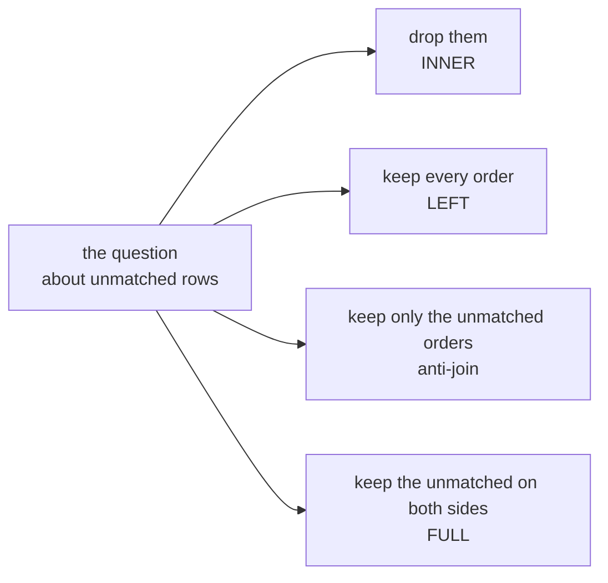

# Round 2 set: rows in, rows out, and the difference named

About 15 minutes, alone first, then compare with your neighbour. Eight items. Every item has one
right answer.

Kavya's rule for this round: "Rows in, rows out, and the difference explained, written above the
number. If the count does not close, the number does not leave the team."

Post one line, eight letters in item order, no spaces, in this shape:

```
Post exactly this shape: xxxxxxxx
```

---

## Part A. Match five business questions to the join type that answers each

Each join answers a different question about the rows that do not match. Items 1 to 5 share the same
four options, and an option may be the answer to more than one item.



### Q1. Anand asks: "Which Q2 orders has nobody paid for at all?" Which join answers it?

a) INNER JOIN, matched pairs only
b) LEFT JOIN, every order kept
c) Anti-join, unmatched orders
d) FULL JOIN, both sides' orphans

### Q2. Anand asks: "For every Q2 order, what was booked and what was collected against it?" Which join answers it?

a) INNER JOIN, matched pairs only
b) LEFT JOIN, every order kept
c) Anti-join, unmatched orders
d) FULL JOIN, both sides' orphans

### Q3. Kavya asks: "For the orders that were paid, how many days on average from order to first payment?" Which join answers it?

a) INNER JOIN, matched pairs only
b) LEFT JOIN, every order kept
c) Anti-join, unmatched orders
d) FULL JOIN, both sides' orphans

### Q4. The platform lead asks: "Before we repair the feed, which orders and which payments fail to find each other, on either side?" Which join answers it?

a) INNER JOIN, matched pairs only
b) LEFT JOIN, every order kept
c) Anti-join, unmatched orders
d) FULL JOIN, both sides' orphans

### Q5. Anand asks: "Which payment methods did the paid Q2 orders use, by channel?" Which join answers it?

a) INNER JOIN, matched pairs only
b) LEFT JOIN, every order kept
c) Anti-join, unmatched orders
d) FULL JOIN, both sides' orphans

---

## Part B. The count that closes, or does not

Items 6 and 7 run on the invented tiny tables from round 1: five orders booked at 5,800 in all, and
seven payment rows posted at 6,500 in all.

### Q6. A teammate joins the tiny orders to payments summed per order with an INNER join and reports: booked 5,000, collected 6,500, gap minus 1,500, "fully collected, with a surplus". Which check tells you the report cannot go to Anand?

a) Compare collected with the payments table's own total, which it matches
b) Count the orders in the report against the orders in the table
c) Recompute the gap by channel to see which channel went negative
d) Rerun the sum with SUM(DISTINCT p.amount) to strip the repeats

### Q7. The LEFT join at order grain now keeps all five orders and reports booked 5,800, collected as posted 6,500, gap minus 700. What does the minus 700 hold, on these tables?

a) Rs 700 of refunds on T-2 that nobody has netted off yet
b) The Rs 600 payment P-7 that no order claims, plus rounding
c) Rs 700 over-collected across T-2's two instalment payments
d) Rs 800 never paid, outweighed by Rs 1,500 posted twice

---

## Part C. The order the checks run in

### Q8. Five steps put a joined number in front of Anand: p) send him the collected number, q) count the Q2 orders and booked from orders alone, r) run the order-grain join and count rows out, s) explain every row of difference, t) check that booked after the join equals booked before it. Which order is right?

a) r, q, s, t, p
b) q, r, p, s, t
c) q, r, s, t, p
d) p, q, r, s, t

---

## Check it yourself

After you post, run part A of `sql/C2_W02_D02_03_reconcile_STUDENT.sql` and watch the tiny report
lose an order and then find it. Then write the reconciliation for Q2 above query B2 in your own
words, run it, and see whether your count closes.
