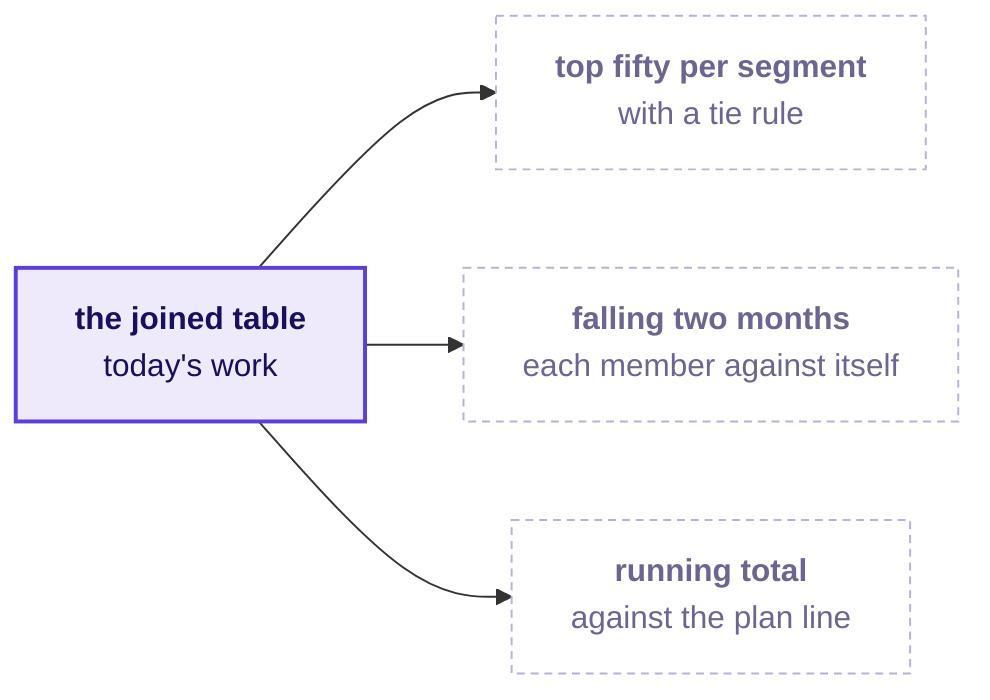

# Before tomorrow: rank the members without collapsing them

Ships tonight. Fifteen minutes of reading and one check to run. Tomorrow opens on Marketing's request,
and a room that has read this answers rather than catches up.

---

## What tomorrow is about

Today attached payments to orders and proved the join. Tomorrow Marketing uses the joined table:

> "Retail-Plus frequency is the problem, so we want to protect our best members before they drift.
> Give us the top fifty customers by Q2 revenue in each segment, and flag anyone whose monthly spend
> has fallen for two months running. And Meera wants to see revenue accumulate week by week against
> the plan line, so we know by mid-quarter whether we are on track."

The head of Retail-Plus adds: "Ties matter. If two members spent the same, I want them ranked the
same, and I want to know how many made the top fifty, not forty-nine because of a tie."

---

## The words you will hear tomorrow

Fill these in from memory tonight. Tomorrow's first ten minutes assume you can.

| Word | What you think it means, in your own words |
|---|---|
| Window function | |
| Partition | |
| Rank against dense rank | |
| Previous row | |
| Running total | |
| Tie | |

If you cannot fill one in, that is the one to listen for.

---

## One thing to think about before you arrive

GROUP BY answers "how much per segment" by collapsing every segment into one row. Marketing's three
asks keep every member's row and ask about its neighbours: where it stands inside its segment, what
the same member spent last month, and how much the quarter has reached so far.

Write one sentence tonight on why a query that returns one row per segment cannot produce fifty names
per segment. Then write a second sentence on the tie: if two members spent exactly the same, should
they share a rank, what can that do to the length of a list meant to hold fifty, and who decides?
Bring both sentences; you will be asked for them.

---

## The check for tonight

Two checks, both under ten minutes.

1. Open your Codespace and confirm your Postgres still loads: connect from VS Code and run
   `SELECT count(*) FROM orders;` and `SELECT count(*) FROM payments;`. You should see 1,000 and
   1,428. If the connection fails, rerun `.devcontainer/load_warehouse.sh` and, if it still fails, post
   its last error line before the session.
2. Run today's five files in `content/W02/D2/sql/` top to bottom. Each one should finish without an
   error, and the order-grain LEFT JOIN should return 462 rows for Q2, the same as the orders table.
   Tomorrow's queries start from that joined table.

---

## The line worth carrying in

> A join is done when its row count is explained, and a rank is done when its tie rule is written
> beside it, because both decide how many rows the business acts on.
