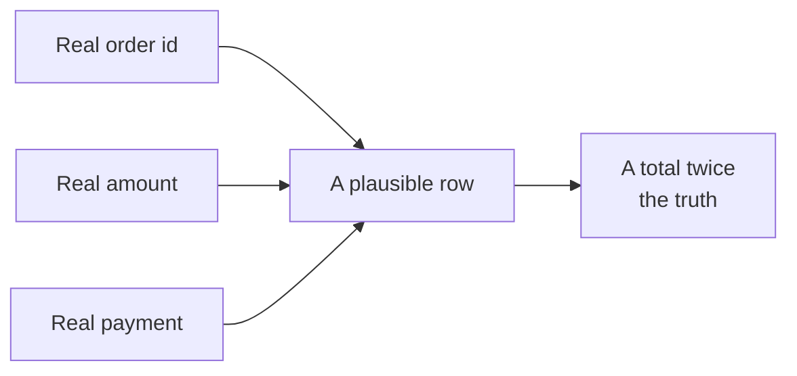
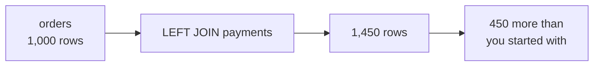
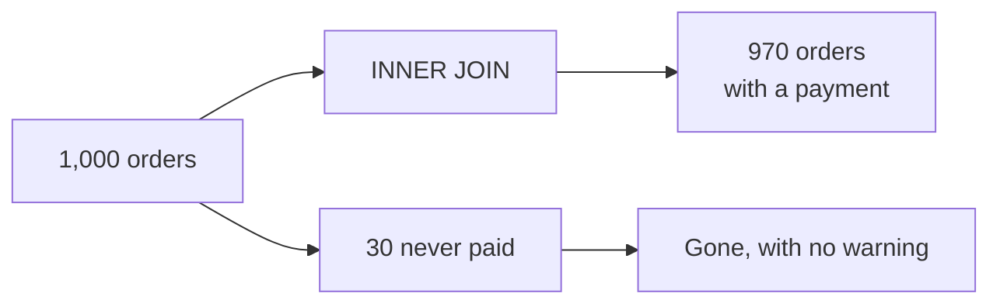
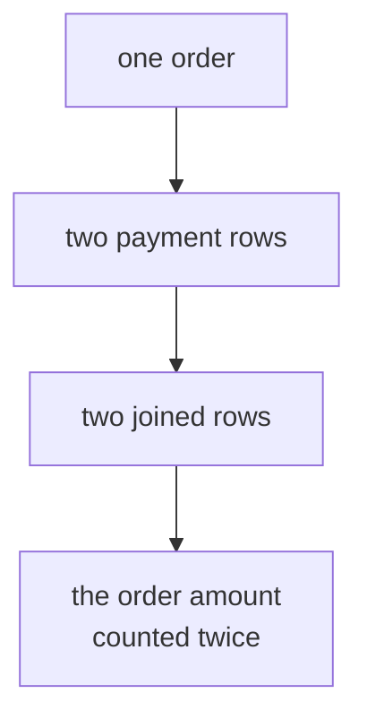
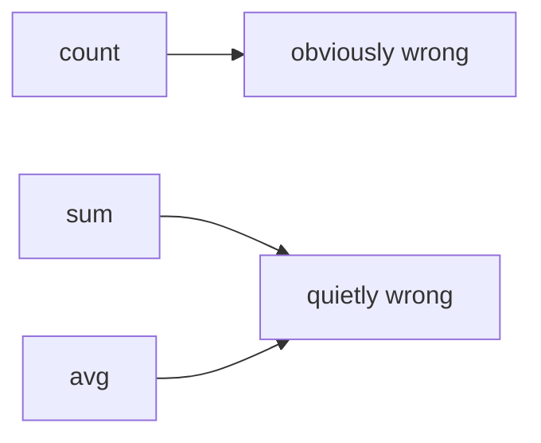
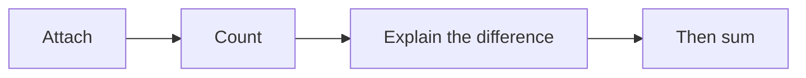

# Half one: booked is not collected, and the join that lied

Week 2, Day 2. Slide source. One idea per slide.

Position bar, repeated at every section boundary:
`[Anand's harder question] > [the naive join] > [what each join keeps] > [why it doubled]`

---

## SECTION A. The harder question

---

## S1. Your Monday suite got a reply
> "Booked revenue is not collected revenue. Some orders are paid in two instalments, some are
> refunded, some were never paid at all. Show me, order by order, what we actually collected
> against what we booked in Q2. If there is a gap, I want to know which orders and which channel."

Anand Iyer. He has read the suite and found the thing it cannot answer.

---

## S2. And one line from the platform lead, said in passing
> "You have the payments table now. Oh, and the payments feed sometimes double-posts when the
> gateway retries."

Remember that sentence. It is the only warning you get.

---

## S3. Booked and collected are different questions
| Word | The row that proves it | Where it lives |
|---|---|---|
| Booked | An order was placed | `orders` |
| Collected | Money arrived | `payments` |

Nothing so far connects the two. That connection is today.

---

## SECTION B. The join that looks right

---

## S4. Attaching one table to another
```sql
SELECT o.order_id, o.amount, p.amount AS paid
FROM   orders o
LEFT JOIN payments p ON p.order_id = o.order_id;
```
For each order, find the matching payment rows. That is the whole idea.

---

## S5. Now total it, the way anybody would
```sql
SELECT sum(o.amount) AS booked, sum(p.amount) AS collected
FROM   orders o
LEFT JOIN payments p ON p.order_id = o.order_id;
```
Booked comes back at roughly Rs 39.6 crore.

The two quarters together booked Rs 19.84 crore.

---

## D1. Every single row in that result looks correct

Pick any row. The order id is real. The amount is the order's real amount. The payment is a real
payment for that order.

Nothing is corrupted, nothing is missing, and the total is twice the truth. That combination is
what makes this the most expensive mistake in analytics.

---

## S6. Count before you sum

The row count was free to check and it was never checked.

---

## SECTION C. What each join actually does

---

## S7. Four joins, four questions about unmatched rows
| Join | Keeps |
|---|---|
| `INNER` | Only orders that have a payment |
| `LEFT` | Every order, paid or not |
| `RIGHT` | Every payment, even one whose order is missing |
| `FULL OUTER` | Both sides' orphans |

The choice is not a style preference. Each one answers a different business question.

---

## S8. The same query, two joins, two answers
```sql
SELECT count(*) FROM orders o INNER JOIN payments p USING (order_id);  -- 1,420
SELECT count(*) FROM orders o LEFT  JOIN payments p USING (order_id);  -- 1,450
```
Thirty rows are the difference. Those thirty are delivered orders that were never paid, which is
precisely what Anand asked about.

---

## D2. An INNER join drops your finding silently

It does not warn you. It does not log anything. The thirty orders Anand wants to see are the
thirty rows an `INNER` join removes, and the result still looks like a complete report.

Choosing `INNER` here is not a small mistake. It is answering a different question than the one
asked, in a way nobody can see from the output.

---

## S9. Which orders were never paid
```sql
SELECT o.order_id, o.channel, o.amount
FROM   orders o
LEFT JOIN payments p ON p.order_id = o.order_id
WHERE  p.payment_id IS NULL;
```
Keep everything, then keep only what failed to match. That pattern is called an anti-join and it
is how you find absence.

---

## S10. And the orphans on the other side
```sql
SELECT p.payment_id, p.amount
FROM   payments p
LEFT JOIN orders o ON o.order_id = p.order_id
WHERE  o.order_id IS NULL;
```
Eight payments whose order is not in the table. Money arrived for something the book does not
know about, which is a question for the platform team rather than for you.

---

## SECTION D. Why it doubled

---

## S11. An imperfect key multiplies before it loses

Nothing was duplicated in either table. The duplication happened in the join.

---

## S12. Counting the orders with more than one payment
```sql
SELECT count(*) FROM (
  SELECT order_id FROM payments GROUP BY order_id HAVING count(*) > 1
) t;
```
450.

Four hundred are large invoices settled in two instalments, which is normal. Fifty are the gateway
retries the platform lead mentioned.

---

## D3. Why 450 duplicates doubled a book of a thousand
The 450 are not a random slice. Large invoices get instalment terms, so the orders that were
duplicated are the orders that carry the revenue.

Duplicate the biggest half of the book and you do not inflate a total by five percent. You
roughly double it, which is what makes this both the worst case and the ordinary one.

---

## S13. The word for this is fan-out

One row on the left, many rows on the right, and every aggregate over the joined table inherits
the multiplication.

`count`, `sum` and `avg` are all wrong afterwards, and only `count` is obviously wrong.

---

## S14. Where half one leaves you

You can attach payments to orders, name what each join keeps, find orders with no payment and
payments with no order, and say why a plausible total came back at twice the truth.

Half two turns that into something you would sign.
