# Booked against collected, without lying

Week 2, Day 2. Half one.

Kicker: WEEK 2  ·  TUESDAY  ·  MORNING
Quote: Booked revenue is not collected revenue. Show me, order by order, what we actually collected against what we booked in Q2.
Who: Anand Iyer, finance controller, Kalpa Retail, replying to the team's Monday suite

```notes
LIVE, one minute. Read Anand's line aloud and leave it on screen while the room settles.
Yesterday the room rebuilt Week 1's tree as queries, one table at a time. Today the second table
arrives, and with it the first number in this programme that can be wrong while every row is right.
The arc of the morning: the ask and the thinking, then three rounds of fifty minutes. The escalated
case runs after lunch.
```

---

## SECTION 1: The ask
*A finance controller wants cash against bookings, and the payments feed has a habit.*

```notes
LIVE. This chapter runs 20 minutes. No query runs in it. Its job is to turn Anand's message into
questions about rows, and to draw the one picture the whole day rests on.
```

---

## S1. Anand's reply to Monday's suite
*Monday's numbers were bookings; Finance runs on cash.*

**The client asks.** "Booked revenue is not collected revenue. Some orders are paid in two instalments, some are refunded, some were never paid at all. Show me, order by order, what we actually collected against what we booked in Q2. If there is a gap, I want to know which orders and which channel."

```stats
value: Rs 9.84 cr | label: booked in Q2 | note: Monday's number, from orders alone
value: 462 | label: Q2 orders | note: one row each in the orders table
value: ? | label: collected in Q2 | note: today's question
```

```notes
LIVE, 3 minutes. The booked figure is Monday's own number, so the room can check it without
running anything. Ask: what would make collected smaller than booked? Collect answers: unpaid
orders, refunds, partial payments. Then ask: what could make it larger? Let the room sit with that
one; the platform lead answers it on the next slide.
```

---

## S2. What the platform lead added
*A new table, a new grain, and a remark made in passing.*

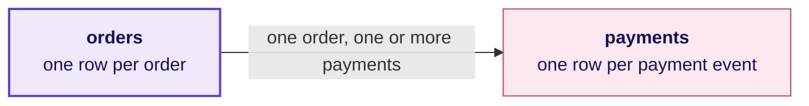
```mermaid
flowchart LR
    O["<b>orders</b><br/>one row per order"] -->|"one order, one or more payments"| P["<b>payments</b><br/>one row per payment event"]
    classDef known fill:#EEEAFB,stroke:#5B3FD6,color:#1A0F5C,stroke-width:2px
    classDef bad fill:#FBE9EF,stroke:#D63A6A,color:#1A0F5C
    classDef unknown fill:#FFFFFF,stroke:#B8B2D6,color:#6B6690,stroke-dasharray:4 3
    class O known
    class P bad
```

> "The payments feed sometimes double-posts when the gateway retries." The data platform lead, Kalpa Retail

| Table | One row per | Rows | What it carries |
|---|---|---|---|
| orders | Order | 1,000 | The amount booked, the channel, the quarter and the status |
| payments | Payment event | 1,428 | The order it pays, the date, the amount, the method and the instalment number |

**Your role.** You sign off the collected number, and Anand will ask how you know it is not double-counted before he uses it.

```notes
LIVE, 3 minutes. The grain column is the slide. Orders has one row per order; payments has one
row per payment event, which is a different grain. Any time two tables have different grains, a
join between them can change the number of rows. Do not say fan-out yet; the room finds it in
round 1. Point at the remark: a retry is a second payment row for the same payment.
```

---

## S3. Question: which number is "collected"?
*Three honest totals sit in the payments feed, and Anand wants one.*

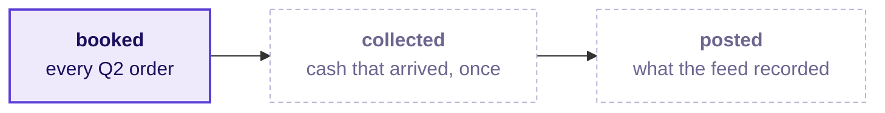
```mermaid
flowchart LR
    B["<b>booked</b><br/>every Q2 order"] --> C["<b>collected</b><br/>cash that arrived, once"]
    C --> P["<b>posted</b><br/>what the feed recorded"]
    classDef known fill:#EEEAFB,stroke:#5B3FD6,color:#1A0F5C,stroke-width:2px
    classDef unknown fill:#FFFFFF,stroke:#B8B2D6,color:#6B6690,stroke-dasharray:4 3
    class B known
    class C,P unknown
```

**Question.** Anand asks for collected revenue. Which total does he mean? a) the sum of every payment row the feed posted; b) the cash that arrived, with each payment counted once; c) the booked amount of every order that has at least one payment; d) booked less refunds.

```notes
LIVE, 3 minutes. One minute in pairs, then a show of letters. Expect a split between a and c.
Do not resolve it here.
```

---

## S4. Answer: cash that arrived, counted once
*The feed's own total and the value of paid orders are both easy to compute and both wrong.*

| Reading | Why it is tempting | What it gets wrong |
|---|---|---|
| a) Every posted row | It is one SUM over one table | A retried payment is counted twice |
| b) Cash counted once | It is what reached Kalpa's bank | Nothing; this is Anand's number |
| c) Booked value of paid orders | It feels like "the orders we were paid for" | A part-paid order counts in full |
| d) Booked less refunds | Refunds are in Anand's message | It never looks at payments at all |

**Kavya's review.** Write the definition above the number: "Collected, Q2 orders, each payment counted once." Then every query you write has to earn that sentence.

```notes
LIVE, 2 minutes. The answer is b. Refunds are real and belong to the take-home; the twelve
refund rows in the warehouse all sit on Q1 orders, so Q2's report can say so in one line.
Say that option c returns in round 1 as the first wrong number of the day.
```

---

## S5. Every join asks about the rows that miss
*Before any tool opens: what happens to an order with no payment, and a payment with no order?*

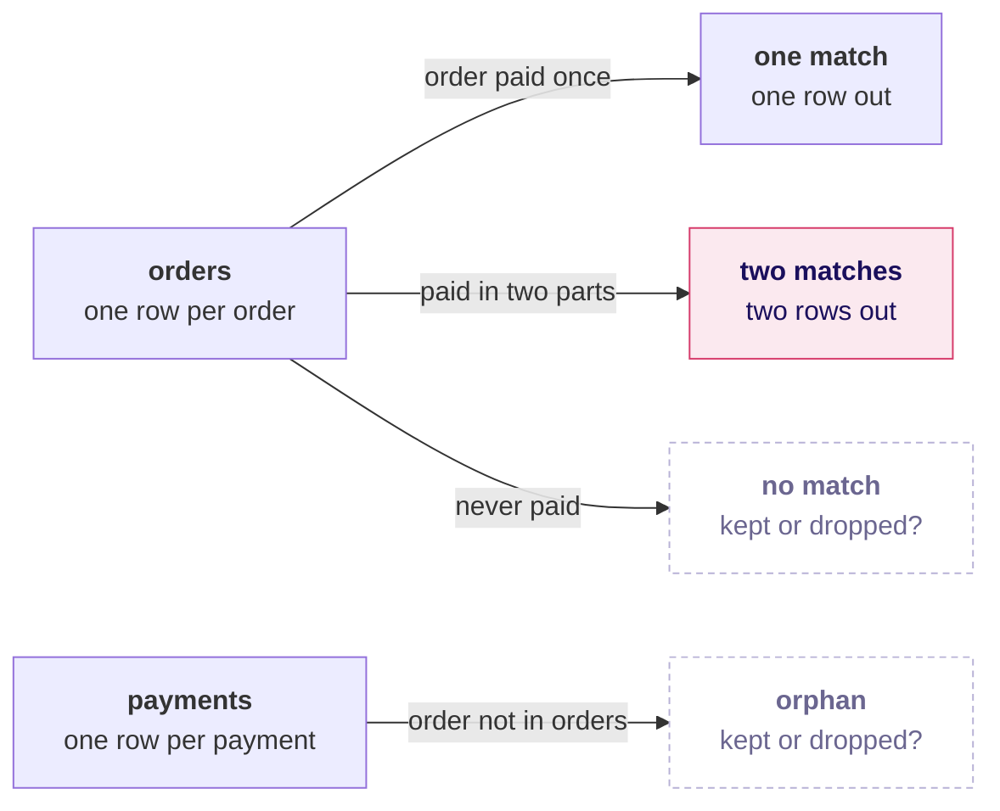
```mermaid
flowchart LR
    O["<b>orders</b><br/>one row per order"] -->|"order paid once"| M1["<b>one match</b><br/>one row out"]
    O -->|"paid in two parts"| M2["<b>two matches</b><br/>two rows out"]
    O -->|"never paid"| M0["<b>no match</b><br/>kept or dropped?"]
    P["<b>payments</b><br/>one row per payment"] -->|"order not in orders"| X["<b>orphan</b><br/>kept or dropped?"]
    classDef bad fill:#FBE9EF,stroke:#D63A6A,color:#1A0F5C
    classDef unknown fill:#FFFFFF,stroke:#B8B2D6,color:#6B6690,stroke-dasharray:4 3
    class M2 bad
    class M0,X unknown
```

The join type is the answer to the two open questions, and the grain of the right-hand table decides whether an order comes out once or twice.

```notes
LIVE, 5 minutes. Draw this on the board with the room, left to right, before anything else. Ask
of each arrow: how many rows does this order produce after the join? One, two, and "it depends on
the join". This drawing stays on the board all day; every trap of the day is one of its arrows.
```

---

## S6. The habit the whole day rests on
*A join is finished when its row count is explained, and not a moment before.*

```timeline
label: Step 1 | title: Rows in | body: Count each table at its own grain before the join.
label: Step 2 | title: Predict | body: Say how many rows the join should return, and why.
label: Step 3 | title: Rows out | body: Count what the join returned.
label: Step 4 | title: Explain | body: Name every row of difference: repeated keys, unmatched rows, filters.
label: Step 5 | title: Then the number | body: Only now read the total, with the reconciliation written above it. | tone: dark
```

**In the interview.** [D] Design the validation you run before a joined number reaches Finance, and say what you do when it fails at 5 pm on reporting day.

```notes
LIVE, 4 minutes. This is Week 1 Wednesday's reconciliation, one tool later: input equals clean
plus rejected became rows in equals rows out plus what the join did. The model answer to the
interview question is these five steps plus a fallback: ship the booked figure with the
reconciliation's open line stated, never an unreconciled collected figure. The answer is in the
day sheet.
Transition: round 1 starts on two tables small enough to trace by hand.
```

---

## SECTION 2: What a join does to the rows
*Two tiny tables traced by hand, then the warehouse's first join and the number it doubles.*

```notes
LIVE. Round 1 runs 50 minutes: the question and its picture (8), the tiny tables traced (12), the
warehouse join and its trap (15), the room's harder variant (10), Kavya's review (5).
Notebook 1 and sql/C2_W02_D02_01 and 02 run beside it.
```

---

## S7. Five invented orders, small enough to trace
*The left-hand table: one row per order, and the payment story of each.*

| order_id | channel | amount | Its payment story |
|---|---|---|---|
| T-1 | app | 1,000 | Paid once, in full |
| T-2 | web | 2,000 | Paid in two instalments |
| T-3 | store | 1,500 | Paid once, and the gateway posted it twice |
| T-4 | app | 800 | Never paid |
| T-5 | store | 500 | Paid once, in full |

```notes
LIVE, 2 minutes. These numbers are invented to show the mechanism, and the slide says so. Copy the
table onto the board. The story column is what the room should be able to say after tracing.
```

---

## S8. Seven invented payments, one of them an orphan
*The right-hand table: one row per payment event, a different grain from orders.*

| payment_id | order_id | paid_date | amount | instalment_no |
|---|---|---|---|---|
| P-1 | T-1 | 3 Jul | 1,000 | 1 |
| P-2 | T-2 | 5 Jul | 1,200 | 1 |
| P-3 | T-2 | 5 Aug | 800 | 2 |
| P-4 | T-3 | 9 Jul | 1,500 | 1 |
| P-5 | T-3 | 9 Jul | 1,500 | 1 |
| P-6 | T-5 | 12 Jul | 500 | 1 |
| P-7 | T-9 | 14 Jul | 600 | 1 |

```notes
LIVE, 2 minutes. Copy this beside the orders on the board. Ask the room to find, in words, the
order with two parts, the payment posted twice, the order never paid and the payment whose order
is not in the orders table. The same four stories are in the warehouse; the room will find them
there without being told how many.
```

---

## S9. Question: four joins, four row counts
*Write your four numbers before anyone runs anything.*

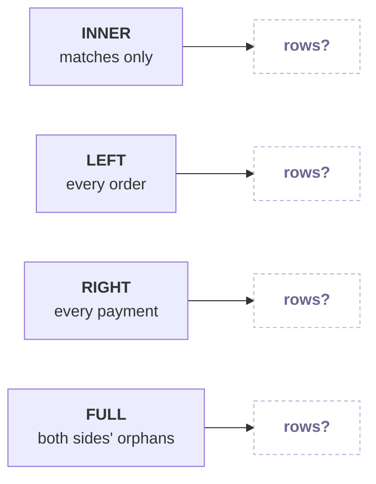
```mermaid
flowchart LR
    A["<b>INNER</b><br/>matches only"] --> N1["<b>rows?</b>"]
    B["<b>LEFT</b><br/>every order"] --> N2["<b>rows?</b>"]
    C["<b>RIGHT</b><br/>every payment"] --> N3["<b>rows?</b>"]
    D["<b>FULL</b><br/>both sides' orphans"] --> N4["<b>rows?</b>"]
    classDef unknown fill:#FFFFFF,stroke:#B8B2D6,color:#6B6690,stroke-dasharray:4 3
    class N1,N2,N3,N4 unknown
```

**Question.** Joining tiny_orders to tiny_payments on order_id, how many rows does each join return? a) 5, 5, 7, 7; b) 6, 7, 7, 8; c) 5, 6, 7, 8; d) 6, 6, 7, 7.

```notes
LIVE, 4 minutes. Two minutes alone, writing four numbers on paper, then a show of letters. The
most common wrong answer is a, from people who think a join keeps one row per order. Do not
correct anyone yet.
```

---

## S10. Answer: 6, 7, 7 and 8, traced row by row
*T-2 and T-3 come out twice, T-4 appears only with LEFT, and P-7 only with RIGHT.*

| Join | Rows | Where the rows come from |
|---|---|---|
| INNER | 6 | T-1 once, T-2 twice, T-3 twice, T-5 once |
| LEFT | 7 | The six, plus T-4 with NULLs on the payments side |
| RIGHT | 7 | The six, plus P-7 with NULLs on the orders side |
| FULL | 8 | The six, plus T-4, plus P-7 |

**The rule.** An order comes out once per matching payment row, so a key that repeats on the right multiplies the left before any number is summed.

```notes
LIVE, 5 minutes. The answer is b. Trace the INNER join on the board, drawing a line from each
order to each of its payments: the lines are the rows. Then add T-4 for LEFT and P-7 for RIGHT.
Run sql/C2_W02_D02_01, step 6, to confirm the four counts. Keep the lines on the board.
```

---

## S11. INNER and LEFT answer different questions
*Choose a join by the question you are asking about the rows that do not match.*

```cards
icon: filter | eyebrow: INNER JOIN | title: Only the matches | body: Answers "what do the paid orders look like?" An unpaid order disappears without a trace.
icon: list-checks | eyebrow: LEFT JOIN | title: Every order, matched or not | body: Answers "what happened to each order we booked?" An unpaid order stays, with NULL where its payment would be. | tone: dark
icon: arrow-left-right | eyebrow: RIGHT and FULL | title: The other side's orphans | body: RIGHT keeps every payment; FULL keeps both sides. Named today and used later, when two feeds are reconciled.
```

**In the interview.** [S] INNER against LEFT join: what does each drop or keep?

```notes
LIVE, 3 minutes. The model answer: INNER keeps rows that match on both sides and drops the rest
from both; LEFT keeps every row of the left table and fills the right side with NULL where nothing
matched; both repeat a left row once per matching right row. The last clause is the one most
candidates forget. FULL OUTER is named and parked, as the row says.
```

---

## S12. The warehouse's grain, checked first
*Before the warehouse join, count each table and ask whether order_id repeats in payments.*

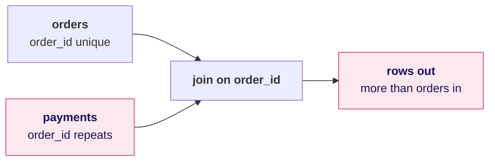
```mermaid
flowchart LR
    O["<b>orders</b><br/>order_id unique"] --> J["<b>join on order_id</b>"]
    P["<b>payments</b><br/>order_id repeats"] --> J
    J --> R["<b>rows out</b><br/>more than orders in"]
    classDef known fill:#EEEAFB,stroke:#5B3FD6,color:#1A0F5C,stroke-width:2px
    classDef bad fill:#FBE9EF,stroke:#D63A6A,color:#1A0F5C
    classDef unknown fill:#FFFFFF,stroke:#B8B2D6,color:#6B6690,stroke-dasharray:4 3
    class P,R bad
```

```stats
value: 462 | label: Q2 orders | note: one row each, Rs 9.84 crore booked
value: 1,428 | label: payment rows | note: across both quarters
value: 450 | label: orders with two payment rows | note: both quarters, sql 02, step 2
```

```sql
SELECT order_id, count(*) AS payment_rows
FROM payments
GROUP BY order_id
HAVING count(*) > 1;
```

```notes
LIVE, 3 minutes. Run steps 1 and 2 of sql/C2_W02_D02_02. The room sees that order_id repeats in
payments, so the join will multiply. Ask what the second rows are. Some are second instalments on
large invoices; the platform lead's remark says some might be retries. Which is which is round 3's
question, and nobody should answer it yet.
```

---

## S13. Question: what did Kalpa collect in Q2?
*A hurried analyst writes the value of the orders that were paid.*

```sql
SELECT sum(o.amount) AS collected_as_reported
FROM orders o
JOIN payments p ON p.order_id = o.order_id
WHERE o.quarter = 'Q2';
```

**Question.** Booked in Q2 is Rs 9,84,00,000. What does this query return? a) a little under Rs 9.84 crore, since some orders are unpaid; b) exactly Rs 9.84 crore; c) about Rs 19.3 crore; d) about Rs 4.9 crore.

```notes
LIVE, 3 minutes. Pairs predict, then show letters. Most rooms say a, because the query "only
keeps paid orders". The ones who say c have understood S9. Run it after the letters are up.
```

---

## S14. Answer: the plausible wrong answer, Rs 19.29 crore
*The bars are collected as reported by channel; the line is booked, and every bar sits near twice it.*

```stats
value: Rs 19,29,04,410 | label: collected, as reported | note: the hurried query
value: Rs 9,84,00,000 | label: booked | note: Monday's number
value: 1.96 x | label: collected over booked | note: the fan-out
```

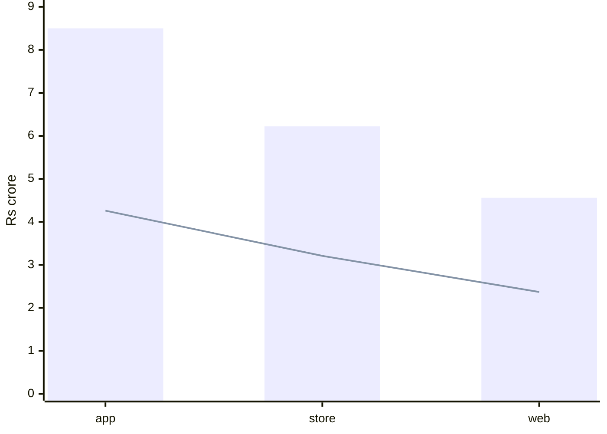
```mermaid
xychart-beta
    x-axis [app, store, web]
    y-axis "Rs crore" 0 --> 9
    bar [8.50, 6.22, 4.56]
    line [4.26, 3.21, 2.37]
```

```notes
LIVE, 4 minutes. The answer is c. The bars are the hurried collected by channel; the line is
booked, from Monday. Let the room find the doubling before anyone says fan-out: ask why an order would be
summed twice. Someone will point at S10's lines. Then, and only then, name it: a fan-out.
```

---

## S15. Why it is wrong, and the check that catches it
*The order amount rides along on every payment row, so a two-part order is summed twice.*

**What it would have misled.** "Collections are running ahead of bookings" stands the collections team down in the one quarter Anand is asking about.

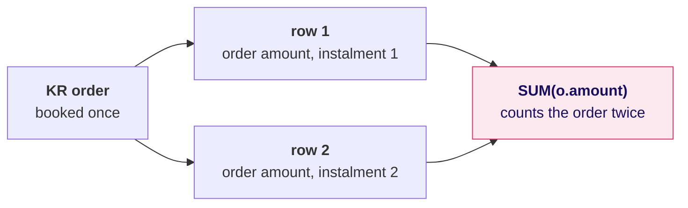
```mermaid
flowchart LR
    O["<b>KR order</b><br/>booked once"] --> R1["<b>row 1</b><br/>order amount, instalment 1"]
    O --> R2["<b>row 2</b><br/>order amount, instalment 2"]
    R1 --> S["<b>SUM(o.amount)</b><br/>counts the order twice"]
    R2 --> S
    classDef bad fill:#FBE9EF,stroke:#D63A6A,color:#1A0F5C
    class S bad
```

| Check | Rows in | Rows out | Verdict |
|---|---|---|---|
| Orders LEFT JOIN payments, Q2 | 462 orders | 678 rows | The join multiplied 216 rows |
| Collected against booked | Rs 9.84 crore | Rs 19.29 crore | Collected cannot exceed booked by 96 percent |

```notes
LIVE, 4 minutes. Two checks, and either one catches it: rows out against rows in, and collected
against booked. Run step 4 of sql/C2_W02_D02_02. Say the sentence: a SUM after a join sums at
the grain of the join, which is the payment, whatever column it names.
```

---

## S16. The fix: bring payments to the order's grain
*Aggregate the many side to one row per order, then join, and the count closes.*

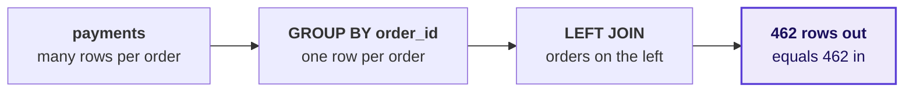
```mermaid
flowchart LR
    P["<b>payments</b><br/>many rows per order"] --> A["<b>GROUP BY order_id</b><br/>one row per order"]
    A --> L["<b>LEFT JOIN</b><br/>orders on the left"]
    L --> R["<b>462 rows out</b><br/>equals 462 in"]
    classDef known fill:#EEEAFB,stroke:#5B3FD6,color:#1A0F5C,stroke-width:2px
    classDef bad fill:#FBE9EF,stroke:#D63A6A,color:#1A0F5C
    classDef unknown fill:#FFFFFF,stroke:#B8B2D6,color:#6B6690,stroke-dasharray:4 3
    class R known
```

```sql
WITH paid_per_order AS (
    SELECT order_id, sum(amount) AS paid, count(*) AS payment_rows
    FROM payments
    GROUP BY order_id
)
SELECT count(*) AS rows_out, sum(o.amount) AS booked,
       sum(coalesce(pp.paid, 0)) AS paid_as_posted
FROM orders o
LEFT JOIN paid_per_order pp ON pp.order_id = o.order_id
WHERE o.quarter = 'Q2';
```

```stats
value: 462 | label: rows out | note: equals the 462 orders in
value: Rs 9,84,00,000 | label: booked after the join | note: equals Monday's booked
```

```notes
LIVE, 4 minutes. What changed: 216 repeated rows went away, the order-side sum went from Rs 19.29 crore
back to Rs 9.84 crore, and the order amount is summed once per order. Steps 6 and 7 of sql 02 run
this and the one-line check. Do not read the paid column aloud yet; round 2 reconciles it.
```

---

## S17. Question: the both-columns report by channel
*The room's harder variant: booked and collected side by side, from one join.*

```sql
SELECT o.channel, sum(o.amount) AS booked, sum(p.amount) AS collected
FROM orders o
LEFT JOIN payments p ON p.order_id = o.order_id
WHERE o.quarter = 'Q2'
GROUP BY o.channel;
```

**Question.** The collected column now sums payment amounts, so it looks safe. What does the report say? a) collected close to booked on every channel; b) booked near Rs 19.5 crore and about half of it collected; c) collected near Rs 19.3 crore again; d) the query fails because of the NULLs.

```notes
SELF-STUDY for the fast half, LIVE for the room in the 10-minute variant slot. Pairs run step 5 of
sql 02 and answer before looking. Walk the room, and ask each pair which column is wrong and why.
```

---

## S18. Answer: half of Q2 "uncollected", which is false
*The same fan-out, now on the booked side, invents a collections crisis.*

| Channel | Booked, as reported | Collected, as reported | Share collected |
|---|---|---|---|
| app | Rs 8,50,44,740 | Rs 4,25,89,770 | 50.1 percent |
| store | Rs 6,32,06,360 | Rs 3,11,96,760 | 49.4 percent |
| web | Rs 4,64,08,240 | Rs 2,28,79,290 | 49.3 percent |

```notes
LIVE, 4 minutes. The answer is b. The same mechanism misleads in the opposite direction: S14 stood
collections down, this one would send a team after Rs 9.8 crore that was never owed. A fan-out has
no direction of its own; it inflates whichever side repeats. The fix is S16's, on the booked side.
```

---

## S19. Kavya's review of round 1
*A join is a multiplication until you prove it is not.*

**Kavya's review.** A join is a multiplication until you prove it is not. Tell me the grain of each table before you tell me a total.

**In the interview.** [S] Your join grew the row count; name the cause and the check. [F] Revenue doubled after a join and every row looks fine; where do you look?

```cards
icon: search-check | eyebrow: The cause | title: A key that repeats | body: The right-hand table has more than one row per key, so each left row comes out once per match.
icon: calculator | eyebrow: The check | title: Rows in, rows out | body: Count before and after; any growth is explained by the repeated keys, or the join is wrong.
icon: layers | eyebrow: The fix | title: Match the grain | body: Aggregate the many side to the key's grain in a CTE, then join. | tone: dark
```

```notes
LIVE, 5 minutes. Two learners answer the interview questions aloud in under thirty seconds each.
The model answers: the cause is duplicate keys on the right, usually a one-to-many relationship
read as one-to-one; the check is the count before and after and a GROUP BY key HAVING count(*) > 1
on the right table; for a doubled revenue, look at the grain of the join, not at the rows, because
each row is individually correct. Transition: the join is now at the right grain; round 2 asks
whether it kept every order.
```

---

## SECTION 3: Prove the join before the number
*Rows in, rows out, the difference named, then the bridge from booked to collected.*

```notes
LIVE. Round 2 runs 50 minutes: the question (6), the reconciliation template (8), the INNER trap on
the tiny tables (14), the bridge (10), the room's variant on Q2 (8), Kavya's review (4).
Notebook 2 and sql/C2_W02_D02_03 run beside it.
```

---

## S20. Every Q2 order has to survive the join
*Anand asked order by order, so an order that vanishes is an order he never sees.*

**The client asks.** "If there is a gap, I want to know which orders." An order missing from the report cannot be on anyone's list.

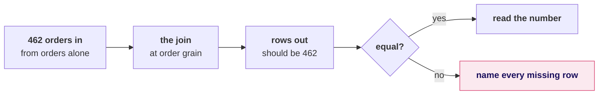
```mermaid
flowchart LR
    A["<b>462 orders in</b><br/>from orders alone"] --> J["<b>the join</b><br/>at order grain"]
    J --> B["<b>rows out</b><br/>should be 462"]
    B --> Q{"<b>equal?</b>"}
    Q -->|"yes"| N["<b>read the number</b>"]
    Q -->|"no"| E["<b>name every missing row</b>"]
    classDef bad fill:#FBE9EF,stroke:#D63A6A,color:#1A0F5C
    class E bad
```

```notes
LIVE, 4 minutes. After round 1 the join is at order grain, so rows out can only fall short of rows
in, never exceed it. Ask: which join types can make rows out smaller than rows in? INNER, and any
filter. That is the whole of round 2 and half of round 3.
```

---

## S21. The reconciliation, written above the number
*Four lines of comment that make a joined total auditable by Anand's analyst.*

```sql
-- Rows in:   462 Q2 orders, Rs 9,84,00,000 booked (orders alone).
-- Rows out:  ___ rows after the join at order grain.
-- Booked:    the sum over rows out equals the booked above.
-- The gap:   booked minus collected equals the unpaid orders' booked value.
```

| Line | What it proves | What breaks it |
|---|---|---|
| Rows in and out | No order was dropped or repeated | An INNER join, a filter, a repeated key |
| Booked after the join | The join added and lost nothing | A fan-out on the order side |
| The gap | Every rupee of gap belongs to a named order | A retry inside collected, an unpaid order dropped |

```notes
LIVE, 4 minutes. The blank is deliberate: it is filled from the data, never from the slide.
This comment block is the deliverable the row asks for in the escalated case. Anand's analyst
reads it before reading the number.
```

---

## S22. Question: the INNER report on the tiny tables
*Payments at order grain this time, joined with an INNER join, as most first drafts are.*

```sql
WITH paid_per_order AS (
    SELECT order_id, sum(amount) AS paid FROM tiny_payments GROUP BY order_id
)
SELECT count(*) AS orders, sum(o.amount) AS booked, sum(pp.paid) AS collected
FROM tiny_orders o
JOIN paid_per_order pp ON pp.order_id = o.order_id;
```

**Question.** Booked across the five invented orders is 5,800. What gap does this report show? a) 800; b) 0; c) minus 1,500; d) 700.

```notes
LIVE, 3 minutes. Pairs trace it on the board from the tables on S7 and S8 before anyone runs part A of
sql/C2_W02_D02_03. The ones who say a have forgotten that INNER drops T-4.
```

---

## S23. Answer: a gap of minus 1,500 on four orders
*The report says Kalpa collected everything and a little more, which is the plausible wrong answer.*

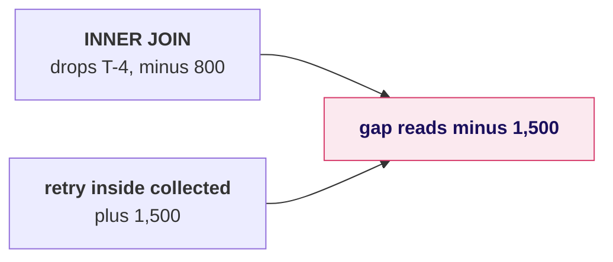
```mermaid
flowchart LR
    A["<b>INNER JOIN</b><br/>drops T-4, minus 800"] --> G["<b>gap reads minus 1,500</b>"]
    B["<b>retry inside collected</b><br/>plus 1,500"] --> G
    classDef known fill:#EEEAFB,stroke:#5B3FD6,color:#1A0F5C,stroke-width:2px
    classDef bad fill:#FBE9EF,stroke:#D63A6A,color:#1A0F5C
    classDef unknown fill:#FFFFFF,stroke:#B8B2D6,color:#6B6690,stroke-dasharray:4 3
    class G bad
```

```stats
value: 4 | label: orders in the report | note: out of 5 in the table
value: 5,000 | label: booked, as reported | note: T-4's 800 is gone
value: 6,500 | label: collected, as reported | note: T-3's retry is inside
value: minus 1,500 | label: gap, as reported | note: "fully collected, with a surplus"
```

**What it would have misled.** "There is no gap, Anand" means nobody chases the unpaid order, and nobody asks why the feed shows more cash than was booked.

```notes
LIVE, 4 minutes. The answer is c. Two errors cancel into a comfortable number: the INNER join
hides the unpaid order, and the retry inflates collected. These numbers are invented; the trainer
runs the same query on Q2 live, and the room writes down what it sees without reading it aloud.
```

---

## S24. Why it is wrong, and the check that catches it
*An INNER join answers "what do the paid orders look like", and Anand asked about every order.*

| Check | Expected | The INNER report | Verdict |
|---|---|---|---|
| Orders in the report | 5, from tiny_orders | 4 | One order was dropped |
| Booked after the join | 5,800 | 5,000 | The dropped order was booked |
| Collected against booked | At most booked | Above booked | Something was counted twice |

**The rule.** When the question is about every order, the orders table sits on the left of a LEFT JOIN, and a missing payment becomes a zero with COALESCE.

```notes
LIVE, 4 minutes. The first check needs no rupee at all, which is why it is the habit: count the
orders in the report against the orders in the table. Ask the room which check would catch this
on Kalpa's Q2 in one query. Answer: count(*) against 462.
```

---

## S25. The LEFT fix, and a gap that is still wrong
*LEFT JOIN keeps T-4, the count closes, and the gap reads minus 700.*

```stats
value: 5 | label: orders in the report | note: rows in equals rows out
value: 5,800 | label: booked | note: equals the table
value: 6,500 | label: collected as posted | note: the retry is still inside
value: minus 700 | label: gap | note: 800 unpaid, less the 1,500 retry
```

The count now closes and the gap is still wrong, because the gap mixes two different things: an order nobody paid, and a payment posted twice.

```notes
LIVE, 3 minutes. What changed: one order and 800 of booked came back. What did not: the retry.
This is the argument for a bridge, on the next slide: separate the moves so each has a name.
```

---

## S26. The bridge from booked to what the feed posted
*Each move between two totals gets its own bar, its own name and its own list of orders.*

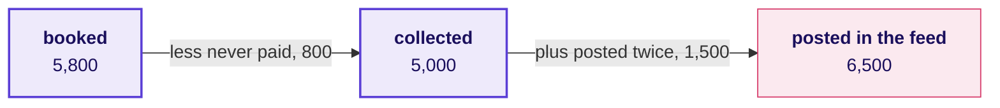
```mermaid
flowchart LR
    B["<b>booked</b><br/>5,800"] -->|"less never paid, 800"| C["<b>collected</b><br/>5,000"]
    C -->|"plus posted twice, 1,500"| P["<b>posted in the feed</b><br/>6,500"]
    classDef known fill:#EEEAFB,stroke:#5B3FD6,color:#1A0F5C,stroke-width:2px
    classDef bad fill:#FBE9EF,stroke:#D63A6A,color:#1A0F5C
    class B,C known
    class P bad
```

| Move | Tiny tables, invented | The list behind it |
|---|---|---|
| Booked | 5,800 | Every order |
| Less never paid | minus 800 | The unpaid list: T-4 |
| Collected | 5,000 | Anand's number |
| Plus posted twice | plus 1,500 | The double-paid list: T-3's retry |
| Posted in the feed | 6,500 | Every payment row matched to an order |

```notes
LIVE, 5 minutes. The notebook draws this as a bridge chart with kit.bridge, and the companion page
redraws it as the room changes one assumption at a time. Say what a bridge buys: each bar is a
question for Anand, and each bar has a list of orders behind it. The bridge closes when booked plus
every move equals what the feed posted.
```

---

## S27. Your turn: reconcile Q2 on the warehouse
*The room runs part B of sql 03 and writes the reconciliation before reading any rupee.*

```timeline
label: B1 | title: Rows in | body: Q2 orders and booked from orders alone.
label: B2 | title: Rows out | body: The order-grain LEFT join; compare the count and the booked.
label: B3 | title: The bridge | body: Booked, less never paid, collected, plus posted twice, posted.
label: B4 | title: It closes | body: Posted must equal the feed's own total against Q2 orders. | tone: dark
```

Write what you find in the four comment lines of the reconciliation, with your own numbers, before you say any of them aloud.

```notes
LIVE, 8 minutes. The room runs it; the trainer walks the room and does not read results aloud.
Anyone who finishes early runs the INNER version on Q2 and compares its order count with B1.
The day sheet carries the numbers. The discovery is theirs.
```

---

## S28. Kavya's review of round 2
*Rows in, rows out, and the difference explained, written above the number.*

**Kavya's review.** Rows in, rows out, and the difference explained, written above the number. If the count does not close, the number does not leave the team.

**In the interview.** [S] When is an INNER join the honest choice? [F] How do you reconcile a total after a join back to its source table?

```cards
icon: check-check | eyebrow: INNER is honest | title: When the question is about matches | body: "What do paid orders look like?" or "which campaigns converted" ask only about rows that matched.
icon: scale | eyebrow: Reconcile | title: Back to the source | body: Sum the joined column at the source's grain and compare it with the source table's own total.
icon: git-branch | eyebrow: Then | title: A bridge for the gap | body: Name each move between the two totals and list the rows behind it. | tone: dark
```

```notes
LIVE, 4 minutes. Two learners answer aloud. Model answers: INNER is honest when unmatched rows are
out of scope by definition, and the report says so; reconcile by recomputing the total from the
source table alone and explaining every rupee of difference as a bridge. Break for 10 minutes.
```

---

## SECTION 4: Which orders, and which payments
*The unpaid list, the double-paid list, and two ways a correct-looking query loses the answer.*

```notes
LIVE. Round 3 runs 50 minutes: the question (5), the WHERE trap on the tiny tables (12), the
anti-join (8), the HAVING trap on the warehouse (13), the room's variant (8), Kavya's review (4).
Notebook 3 and sql/C2_W02_D02_04 run beside it.
```

---

## S29. Anand wants names, and a quarter's cash
*Two lists, and a filter that sounds harmless: payments received inside Q2.*

**The client asks.** "Which orders, and which channel." The first list is every Q2 order with no payment. The second is every payment the gateway posted twice.

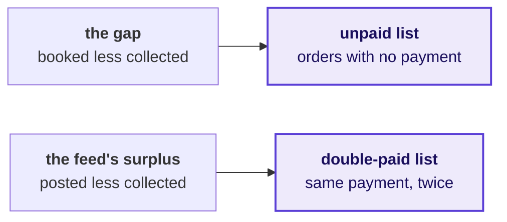
```mermaid
flowchart LR
    G["<b>the gap</b><br/>booked less collected"] --> U["<b>unpaid list</b><br/>orders with no payment"]
    F["<b>the feed's surplus</b><br/>posted less collected"] --> D["<b>double-paid list</b><br/>same payment, twice"]
    classDef known fill:#EEEAFB,stroke:#5B3FD6,color:#1A0F5C,stroke-width:2px
    class U,D known
```

```notes
LIVE, 5 minutes. Tie each list to a bar of S26's bridge. A list whose total does not equal its
bar is the wrong list, which is the check for the rest of the round.
```

---

## S30. Question: LEFT JOIN, with the quarter in WHERE
*The analyst learnt round 2's lesson, wrote LEFT, and added "cash received in Q2".*

```sql
SELECT o.order_id, p.payment_id, p.paid_date
FROM tiny_orders o
LEFT JOIN tiny_payments p ON p.order_id = o.order_id
WHERE p.paid_date BETWEEN '2026-07-01' AND '2026-09-30';
```

**Question.** On the invented tiny tables, how many rows come back, and is T-4 among them? a) 7 rows, T-4 with NULLs; b) 6 rows, T-4 gone; c) 5 rows, one per order; d) 8 rows, P-7 included.

```notes
LIVE, 3 minutes. Pairs trace T-4's row: after the join it has NULL paid_date. Ask what
NULL BETWEEN two dates evaluates to. Most of the room has not met three-valued logic by name.
```

---

## S31. Answer: 6 rows, and the LEFT JOIN became INNER
*A WHERE on the right-hand table throws away every row the LEFT JOIN kept for you.*

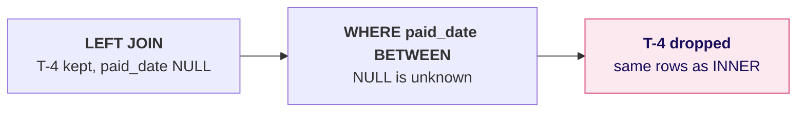
```mermaid
flowchart LR
    L["<b>LEFT JOIN</b><br/>T-4 kept, paid_date NULL"] --> W["<b>WHERE paid_date BETWEEN</b><br/>NULL is unknown"]
    W --> X["<b>T-4 dropped</b><br/>same rows as INNER"]
    classDef known fill:#EEEAFB,stroke:#5B3FD6,color:#1A0F5C,stroke-width:2px
    classDef bad fill:#FBE9EF,stroke:#D63A6A,color:#1A0F5C
    classDef unknown fill:#FFFFFF,stroke:#B8B2D6,color:#6B6690,stroke-dasharray:4 3
    class X bad
```

```stats
value: 6 | label: rows out | note: exactly the INNER join's count
value: T-4 | label: gone | note: its NULL date fails the WHERE
value: 0 | label: unpaid orders listed | note: the list Anand asked for is empty
```

**What it would have misled.** "Every Q2 order was paid within the quarter" is the sentence this query supports, and it is false. Checked on PostgreSQL 16.13 on 29 September 2026: the same WHERE on Kalpa's payments drops every unpaid Q2 order.

```notes
LIVE, 4 minutes. The answer is b. NULL compared with anything is unknown, and WHERE keeps only
rows that are true. The trainer runs the same query on Q2 live; the room counts rows against 462
and sees the shortfall without the trainer naming it.
```

---

## S32. The fix: the payments condition goes in ON
*ON decides what matches; WHERE decides what survives, after the join.*

```sql
SELECT o.order_id, p.payment_id, p.paid_date
FROM tiny_orders o
LEFT JOIN tiny_payments p
       ON p.order_id = o.order_id
      AND p.paid_date BETWEEN '2026-07-01' AND '2026-09-30';
```

| Where the condition sits | Rows on the tiny tables | T-4 |
|---|---|---|
| WHERE p.paid_date BETWEEN ... | 6 | Dropped |
| ON ... AND p.paid_date BETWEEN ... | 7 | Kept, with NULL payment |

**In the interview.** [F] A filter on the right-hand table of a LEFT JOIN: WHERE or ON, and what changes?

```notes
LIVE, 3 minutes. What changed: one row, and the whole unpaid list. The model answer: in ON, the
filter decides which right rows match and every left row survives; in WHERE, it runs after the
join and removes the NULL rows, so the LEFT JOIN behaves as INNER. The PostgreSQL 16 manual's
table-expressions page says the same; the link is in the notes.
```

---

## S33. The anti-join: the one WHERE that belongs there
*IS NULL on the right table's key keeps exactly the orders nothing matched.*

```sql
SELECT o.order_id, o.channel, o.amount
FROM orders o
LEFT JOIN payments p ON p.order_id = o.order_id
WHERE o.quarter = 'Q2'
  AND p.payment_id IS NULL;
```

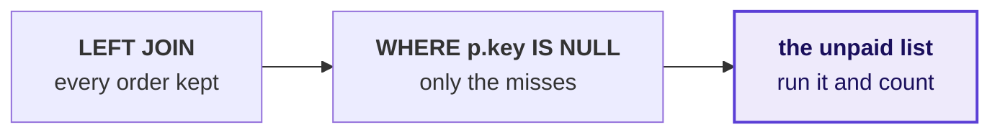
```mermaid
flowchart LR
    L["<b>LEFT JOIN</b><br/>every order kept"] --> W["<b>WHERE p.key IS NULL</b><br/>only the misses"]
    W --> U["<b>the unpaid list</b><br/>run it and count"]
    classDef known fill:#EEEAFB,stroke:#5B3FD6,color:#1A0F5C,stroke-width:2px
    class U known
```

**In the interview.** [F] How do you find orders with no payment?

```notes
LIVE, 4 minutes. On the tiny tables it returns T-4. On Q2 the room runs step B1 of sql 04 and
reads the count first. NOT EXISTS gives the same list and reads as Anand's sentence; both are fine,
and the day sheet has the numbers. The model answer: a LEFT JOIN with IS NULL on the right key, or
NOT EXISTS, and a check that the list's booked total equals the gap.
```

---

## S34. Question: the double-paid list on Q2
*The analyst reaches for HAVING, which Monday taught.*

```sql
SELECT o.order_id, count(*) AS payment_rows
FROM orders o
JOIN payments p ON p.order_id = o.order_id
WHERE o.quarter = 'Q2'
GROUP BY o.order_id
HAVING count(*) > 1;
```

**Question.** Anand will call every customer on this list about a refund. What does it return? a) a short list of small card payments; b) 216 orders, about Rs 9.6 crore of bookings; c) no rows, since payments have unique ids; d) every Q2 order.

```notes
LIVE, 3 minutes. Pairs predict. S12 already showed 216 orders with two payment rows, so the sharp
ones answer b from memory. Ask them what kind of orders those are.
```

---

## S35. Answer: 216 orders flagged, Rs 9,62,59,340 booked
*Most of the list is large invoices paid in two instalments, which are not double payments at all.*

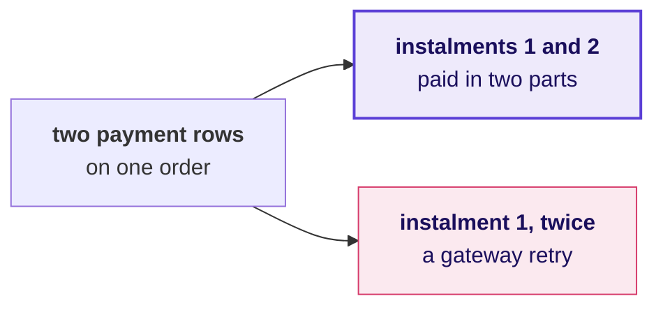
```mermaid
flowchart LR
    T["<b>two payment rows</b><br/>on one order"] --> I["<b>instalments 1 and 2</b><br/>paid in two parts"]
    T --> R["<b>instalment 1, twice</b><br/>a gateway retry"]
    classDef known fill:#EEEAFB,stroke:#5B3FD6,color:#1A0F5C,stroke-width:2px
    classDef bad fill:#FBE9EF,stroke:#D63A6A,color:#1A0F5C
    classDef unknown fill:#FFFFFF,stroke:#B8B2D6,color:#6B6690,stroke-dasharray:4 3
    class I known
    class R bad
```

```stats
value: 216 | label: Q2 orders flagged | note: more than one payment row each
value: Rs 9,62,59,340 | label: booked on the list | note: 98 percent of Q2
value: 2 | label: instalment numbers | note: on most flagged orders
```

**What it would have misled.** A refund review of Rs 9.6 crore of legitimate second instalments, and a call to every corporate buyer who paid on time.

```notes
LIVE, 4 minutes. The answer is b. Two payment rows can be two instalments or one payment posted
twice; the count cannot tell them apart. Ask what column could: instalment_no.
```

---

## S36. Why it is wrong, and the grain that fixes it
*A retry is the same instalment posted twice, so the double-paid grain is order and instalment.*

```sql
SELECT p.order_id, p.instalment_no, count(*) AS times_posted,
       max(p.amount) * (count(*) - 1) AS posted_twice
FROM payments p
JOIN orders o ON o.order_id = p.order_id
WHERE o.quarter = 'Q2'
GROUP BY p.order_id, p.instalment_no
HAVING count(*) > 1;
```

| Pattern of payment rows | What it is | On which list |
|---|---|---|
| Instalment 1 only | Paid once, in full | Neither |
| Instalments 1 and 2 | Paid in two parts | Neither |
| Instalment 1, twice | A gateway retry | The double-paid list |

**In the interview.** [F] HAVING COUNT(*) > 1 on payments by order: what does it find, and what does it wrongly include?

```notes
LIVE, 4 minutes. The room runs step B3 and B4 of sql 04 and counts its own list; step B4 prints
the patterns. Do not read the count aloud. The check: the list's surplus must equal the bridge's
"posted twice" bar from S27.
```

---

## S37. Your turn: both lists, and every payment row
*The room builds both lists on Q2 and accounts for all 1,428 payment rows.*

| Step | Query | The check it must pass |
|---|---|---|
| The unpaid list | sql 04, B1 and B2 | Its booked total equals booked less collected |
| The double-paid list | sql 04, B3 | Its surplus equals posted less collected |
| Every payment row | sql 04, B5 | Q1 rows plus Q2 rows plus unmatched rows equals 1,428 |

**The last line.** A payment that matches no order is a third finding, and it goes back to the platform lead with its ids.

```notes
LIVE, 8 minutes. The room runs it. Anyone who finds the unmatched payments has found what the FULL
OUTER join would show; name that and park it. The escalated case after lunch packages all of it
by channel for Anand.
```

---

## S38. Kavya's review of round 3
*Two payment rows are not a double payment.*

**Kavya's review.** Two payment rows are not a double payment. Show me what makes a retry a retry before you call anyone about a refund.

**In the interview.** [D] Anand says the gap is too small to matter; how do you decide whether to chase it?

```cards
icon: list-x | eyebrow: The unpaid list | title: An anti-join | body: LEFT JOIN with IS NULL on the right key, or NOT EXISTS; its total equals the gap.
icon: copy | eyebrow: The double-paid list | title: The right grain | body: Group by order and instalment; its surplus equals posted less collected.
icon: filter | eyebrow: The filter | title: ON, never WHERE | body: A condition on the right-hand table goes in the ON clause of a LEFT JOIN. | tone: dark
```

```notes
LIVE, 4 minutes. The [D] answer: size it by channel and by order, since a small total can hide one
large invoice; check its age, since an unpaid order from July is overdue while one from yesterday
is not; and state the cost of chasing against the cash at stake. The answer is in the day sheet.
Transition: after lunch, the escalated case puts the three rounds into one report by channel.
```

---

## S39. What the morning leaves on your desk
*Five moves, each one used again in the afternoon's case.*

| You can now | The evidence from this morning |
|---|---|
| Trace a join by hand before running it | Six, seven, seven and eight rows on the tiny tables |
| Spot a fan-out and fix the grain | Rs 19.29 crore back to Rs 9.84 crore at order grain |
| Write the reconciliation above the number | Rows in, rows out, booked, and the gap |
| Keep a LEFT JOIN a LEFT JOIN | The paid_date condition moved into ON |
| Tell a retry from an instalment | The double-paid grain is order and instalment |

```notes
LIVE, 2 minutes. Ask the room which row felt weakest by a show of hands, and note it for the
escalated case: that is where the room will stall after lunch.
```
