# What did Q2 actually collect, order by order?

Week 2, Day 2. Morning.

Kicker: WEEK 2  ·  TUESDAY  ·  MORNING
Quote: Booked revenue is not collected revenue. Show me, order by order, what we actually collected against what we booked in Q2. If there is a gap, I want to know which orders and which channel.
Who: Anand Iyer, finance controller, Kalpa Retail, replying to the team's Monday numbers

```notes
LIVE, one minute. Read Anand's words aloud and leave them on screen while the room settles.
Yesterday the room rebuilt Week 1's revenue tree as queries on one table, orders. Today a second
table arrives, payments, and with it the first number in the programme that can be wrong while
every row behind it is right. The morning runs the ask and the thinking (20), then chapters 1 to 5
of about 30 minutes each, with a break before chapter 4. Chapter 6 opens the afternoon.
Transition: the next slide is the whole day on one screen.
```

---

## S1. Six questions stand between booked and collected
*What did Kalpa actually collect in Q2, and how will Anand know nothing is counted twice?*

| Chapter | The question it answers |
|---|---|
| 1. What does a join keep? | When payments meet orders, which rows does each join keep, drop or repeat? |
| 2. Why twice the bookings? | Why does the first join report nearly twice the bookings, and how do we stop the double count? |
| 3. Is every order there? | Is every booked order still in the report, and can every rupee between booked and posted be named? |
| 4. Which orders, exactly? | Which Q2 orders were never paid, and which payments did the gateway post twice? |
| 5. What does Anand sign? | What goes on the report by channel, and does its gap column tell the truth? |
| 6. Can the number leave? | Which checks must pass before the number leaves, and what happens when one fails late? |

```notes
LIVE, 2 minutes. Read the day's question, then the six chapter questions in order, and say that
each one is the question the previous answer raises. The first five run this morning and chapter 6
opens the afternoon. Ask the room to write the day's question at the top of a page; every chapter
ends on one line under it.
Transition: the question came from Anand, so start with his message.
```

---

## S2. Anand wants cash against bookings, by order
*What exactly is the finance controller asking for, and what did the platform lead add?*

**The client asks.** "Booked revenue is not collected revenue. Some orders are paid in two instalments, some are refunded, some were never paid at all. Show me, order by order, what we actually collected against what we booked in Q2. If there is a gap, I want to know which orders and which channel."

> "The payments feed sometimes double-posts when the gateway retries." The data platform lead, Kalpa Retail

```stats
value: Rs 9.84 cr | label: booked in Q2 | note: Rs 9,84,00,000, Monday's number from orders alone
value: 462 | label: Q2 orders | note: one row each in the orders table
value: ? | label: collected in Q2 | note: today's question
```

**Your role.** You sign off the collected number, and Anand will ask how you know it is not double-counted before he uses it. Kavya Nair, the team's senior analyst, reviews every number before it leaves the team.

```notes
LIVE, 4 minutes. Anand Iyer is Kalpa Retail's finance controller: he owns the books, the monthly
close and the audit, and his question to any data team is whether its numbers match his books and
whether his analyst can audit how they were made (retail dossier, section 4). Booked is Monday's own
figure, so the room can check it without running anything. Ask what would make collected smaller
than booked: unpaid orders, refunds, part payments. Then ask what could make it larger, and let the
platform lead's remark answer. A retry is a second payment row for the same payment.
Transition: before any number, agree what "collected" means.
```

---

## S3. Question: which total is "collected"?
*Which of four honest-looking totals is the one Anand asked for?*

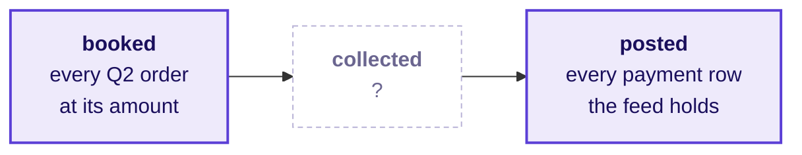
```mermaid
flowchart LR
    B["<b>booked</b><br/>every Q2 order<br/>at its amount"] --> C["<b>collected</b><br/>?"]
    C --> P["<b>posted</b><br/>every payment row<br/>the feed holds"]
    classDef known fill:#EEEAFB,stroke:#5B3FD6,color:#1A0F5C,stroke-width:2px
    classDef unknown fill:#FFFFFF,stroke:#B8B2D6,color:#6B6690,stroke-dasharray:4 3
    class B,P known
    class C unknown
```

**Question.** Anand asks for collected revenue. Which total does he mean? a) the sum of every payment row the feed posted; b) the cash that arrived, with each payment counted once; c) the booked amount of every order that has at least one payment; d) booked less refunds.

```notes
LIVE, 3 minutes. One minute in pairs, then letters. Expect a split between a and c, since both are
one line of SQL. Hold the answer for the next slide.
```

---

## S4. Answer: cash that arrived, each payment once
*Why do the other three totals fail Anand, even though each is easy to compute?*

| Reading | Why it tempts | What it gets wrong |
|---|---|---|
| a) Every posted row | One SUM over one table | A retried payment counts twice |
| b) Cash, each payment once | It is what reached Kalpa's bank | Nothing: this is Anand's number |
| c) Booked value of paid orders | It feels like "the orders we were paid for" | A part-paid order counts in full |
| d) Booked less refunds | Refunds are in his message | It never reads a payment at all |

**Kavya's review.** "Write the definition above the number: collected, Q2 orders, each payment counted once. Then every query you write has to earn that sentence."

```notes
LIVE, 2 minutes. The answer is b. Three words recur all day and mean one thing each: booked is every
Q2 order at its amount, whatever its status; collected is the cash that arrived, each payment
counted once; posted is every payment row the feed holds, repeats included. Refunds belong to the
take-home: all twelve refund rows in the warehouse sit on Q1 orders, so the Q2 report says so in one
line. Option c returns in chapter 2 as the day's first wrong number.
Transition: now draw what any join has to decide.
```

---

## S5. Every join must decide two things first
*What does a join do with an order nobody paid, and with an order that has two payment rows?*

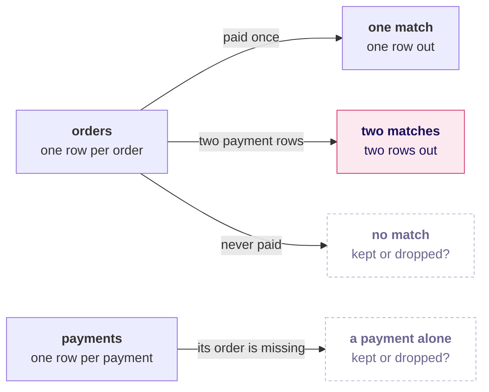
```mermaid
flowchart LR
    O["<b>orders</b><br/>one row per order"] -->|"paid once"| M1["<b>one match</b><br/>one row out"]
    O -->|"two payment rows"| M2["<b>two matches</b><br/>two rows out"]
    O -->|"never paid"| M0["<b>no match</b><br/>kept or dropped?"]
    P["<b>payments</b><br/>one row per payment"] -->|"its order is missing"| X["<b>a payment alone</b><br/>kept or dropped?"]
    classDef bad fill:#FBE9EF,stroke:#D63A6A,color:#1A0F5C
    classDef unknown fill:#FFFFFF,stroke:#B8B2D6,color:#6B6690,stroke-dasharray:4 3
    class M2 bad
    class M0,X unknown
```

The join type answers the two open questions, and how often a key repeats on the payments side decides whether an order comes out once or twice.

```notes
LIVE, 5 minutes. Draw this on the board with the room, left to right, before any laptop opens, and
leave it up all day. Ask which of the four arrows Anand cares about most: the "never paid" one,
since it is money Kalpa is owed. Ask what the two-matches arrow does to a SUM. Do not name fan-out;
the room meets it in chapter 2. Every chapter today adds one mark to this drawing.
Transition: one habit keeps every arrow honest.
```

---

## S6. Rows in, rows out, the difference named
*How will anyone know a joined number is honest before reading the number itself?*

```timeline
label: Line 1 | title: Rows in | body: How many orders the question starts from, counted from one table alone.
label: Line 2 | title: Rows out | body: How many rows the join returns, counted at the grain of the answer.
label: Line 3 | title: The difference | body: Every extra or missing row named, with the list behind it.
label: Line 4 | title: Then the number | body: Only now is the total read, and it reconciles to its source. | tone: dark
```

**The rule.** A join is done when its row count is explained. These four lines sit above every number that leaves the team today.

```notes
LIVE, 3 minutes. This is Week 1 Wednesday's reconciliation one tool later: counts first, then the
rupees. Write the four lines on the board under the drawing. Every chapter fills them in for its
own query, and chapter 6 turns them into the checks that run every Monday.
Transition: chapter 1 traces the four joins on tables small enough to check by hand.
```

---
## SECTION 1: What does a join keep?
*When payments are attached to orders, which rows does each join keep, drop or repeat, before Anand reads any total?*

```notes
LIVE. Chapter 1 runs 30 minutes: the map and the need (3), Razorpay (1), the invented tables and
the four options (5), the grain (3), INNER by hand (5), LEFT, RIGHT and FULL (4), the trap and its
fix (6), the second route (2), the close (1). Notebook 1, C2_W02_D02_01_what_a_join_keeps_STUDENT.ipynb,
runs beside it, and the guided trace sheet is on every desk.
```

---

## S7. Answer in five steps, each a row count
*Who needs chapter 1's answer, and which smaller questions lead to it?*

**Who needs the answer.** Anand's analyst, who audits the statement order by order, and you, since you sign the collected number. A join that drops an unpaid order hides it from the collections team, and a join that repeats a paid order sends them after a customer who paid in full.

```timeline
label: 1 | title: What is one row? | body: Of orders, and of payments, in the warehouse.
label: 2 | title: How many rows? | body: Each of the four joins, on five invented orders.
label: 3 | title: Which join? | body: The one that answers Anand about every booked order.
label: 4 | title: Payments first? | body: What a statement started from payments tells him.
label: 5 | title: From the keys? | body: The row counts, predicted before any join runs. | tone: dark
```

```notes
LIVE, 1 minute. Read the five questions aloud; each is a heading in notebook 1 and a line in the
chapter's close. The metric at stake all day is collected revenue against booked, and this chapter
settles which rows the join keeps before any rupee is added.
```

---

## S8. Two numbers per order live in two tables
*Why must the join be chosen before any total is read?*

```cards
icon: user | eyebrow: Who asks | title: Anand's analyst | body: Audits the statement line by line against the books before Anand signs it.
icon: receipt | eyebrow: The metric | title: Collected against booked | body: Cash that arrived, each payment once, against Rs 9,84,00,000 booked over 462 Q2 orders.
icon: triangle-alert | eyebrow: A wrong join costs | title: A missed or a false call | body: A dropped unpaid order is never chased; a repeated paid order looks short-paid and its customer gets a call. | tone: dark
```

```notes
LIVE, 2 minutes. orders holds what was booked, one row per order with its channel, quarter, status
and amount; payments holds what arrived, one row per payment event with its order, date, amount,
method and instalment number. A join has to decide what to do with an order that found no payment
and with an order that found two, before it adds anything. At Kalpa's size one large business
invoice is several lakh rupees, so a dropped order is real money.
```

---

## S9. Razorpay lists one order's payments many times
*Which real company's merchants meet this question every day?*

```stats
value: 1 order | label: in the merchant's orders | note: one row, one order id
value: many attempts | label: in its payments | note: "combines multiple payment attempts for a single order"
value: attempted to paid | label: the order's state | note: it moves to paid once a payment is captured
```

A merchant who puts Razorpay's two lists side by side meets chapter 1's question: one order id appears once in orders and several times in payments.

```notes
LIVE, 1 minute. Source: Razorpay documentation, About Orders and Fetch Payments for an Order, checked
1 Oct 2026 (URLs in the provenance). The phrases in quotes are Razorpay's own. Say it plainly: an
Indian gateway builds its API around the fact that one order can own many payment rows, so every
merchant's data team has to choose a join.
```

---

## S10. Five invented orders carry every case
*Which cases does Anand's statement have to survive?*

| order_id | channel | amount | What happened to it |
|---|---|---|---|
| T-1 | app | 1,000 | Paid once, in full (P-1) |
| T-2 | web | 2,000 | Paid in two instalments, 1,200 and 800 (P-2, P-3) |
| T-3 | store | 1,500 | Paid once, and the gateway posted it twice (P-4, P-5) |
| T-4 | app | 800 | Never paid |
| T-5 | store | 500 | Paid once, in full (P-6) |

**Invented.** P-7 is a payment of 600 against T-9, an order that is not in the orders table. Five orders and seven payments are small enough to check every row by hand.

```notes
LIVE, 2 minutes. These are invented for the chapter and labelled so everywhere. Each row is one case
from Anand's message or the platform lead's remark: paid once, paid in two instalments, a retry,
never paid, and a payment with no order. Put the same two tables on the board; the guided trace
sheet carries them with blank rows to fill.
```

---

## S11. Four joins, sized on five orders
*Which of the four joins answers Anand, and what does each cost on these tables?*

| Option | Rows out | Booked orders on it | T-4, never paid | P-7, no order |
|---|---|---|---|---|
| A. INNER JOIN | 6 | 4 of 5 | dropped | dropped |
| B. LEFT JOIN, orders first | 7 | 5 of 5 | kept | dropped |
| C. RIGHT JOIN, payments kept | 7 | 4 of 5 | dropped | kept |
| D. FULL OUTER JOIN | 8 | 5 of 5 | kept | kept |

**Sized.** Every option runs in under 3 milliseconds on these tables, so the rows each one keeps decide the call. All four list T-2 and T-3 twice.

```notes
LIVE, 3 minutes. The sizing cell in notebook 1 measures each option: rows out, how many of the five
booked orders reach the statement, what happens to T-4 and to P-7, and the time. Ask which column
decides the call. The answer is the booked-orders column, because Anand's question is about every
order Kalpa booked. The repeated T-2 and T-3 are chapter 2's problem.
```

---

## S12. The call: LEFT JOIN with orders first
*Which join fits Anand's question, and what fact would change the call?*

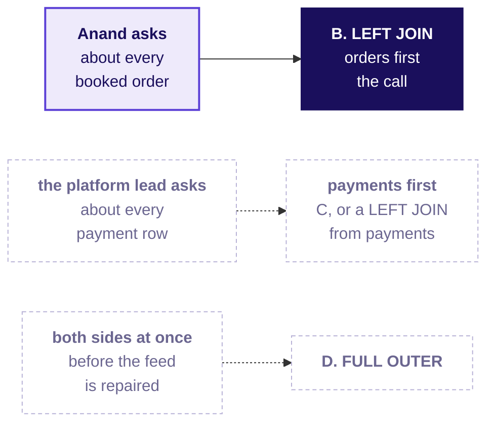
```mermaid
flowchart LR
    Q["<b>Anand asks</b><br/>about every<br/>booked order"] --> B["<b>B. LEFT JOIN</b><br/>orders first<br/>the call"]
    L["<b>the platform lead asks</b><br/>about every<br/>payment row"] -.-> C["<b>payments first</b><br/>C, or a LEFT JOIN<br/>from payments"]
    R["<b>both sides at once</b><br/>before the feed<br/>is repaired"] -.-> D["<b>D. FULL OUTER</b>"]
    classDef known fill:#EEEAFB,stroke:#5B3FD6,color:#1A0F5C,stroke-width:2px
    classDef unknown fill:#FFFFFF,stroke:#B8B2D6,color:#6B6690,stroke-dasharray:4 3
    classDef bet fill:#1A0F5C,stroke:#1A0F5C,color:#FFFFFF
    class B bet
    class Q known
    class L,R,C,D unknown
```

**The fact that would change the call.** A question about every payment the feed holds starts from payments; a question about both sides at once is a FULL OUTER JOIN.

```notes
LIVE, 1 minute. B is the only option that keeps all five orders and nothing that is not an order.
Name the switch facts aloud: the platform lead's question tonight, in the second case, keeps every
payment and so starts from payments. FULL OUTER is named here and parked.
```

---

## S13. Question: can an order own two payment rows?
*What is one row of orders, and one row of payments, in Kalpa's warehouse?*

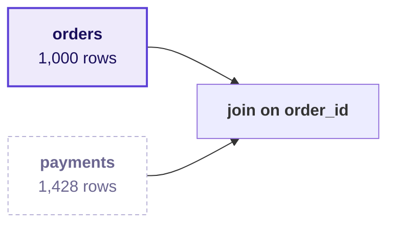
```mermaid
flowchart LR
    O["<b>orders</b><br/>1,000 rows"] --> J["<b>join on order_id</b>"]
    P["<b>payments</b><br/>1,428 rows"] --> J
    classDef known fill:#EEEAFB,stroke:#5B3FD6,color:#1A0F5C,stroke-width:2px
    classDef unknown fill:#FFFFFF,stroke:#B8B2D6,color:#6B6690,stroke-dasharray:4 3
    class O known
    class P unknown
```

**Question.** Does an `order_id` ever appear on more than one row of payments? a) never, each order is paid once; b) yes, up to twice; c) yes, up to five times; d) only for cancelled orders.

```notes
LIVE, 1 minute. The grain of a table is what one row stands for. Take letters, then run level 1 of
notebook 1.
```

---

## S14. Answer: one order, up to two payment rows
*What does the grain of each table mean for a join between them?*

```sql
SELECT 'orders' AS source, count(*) AS row_count, count(DISTINCT order_id) AS order_ids FROM orders
UNION ALL
SELECT 'payments', count(*), count(DISTINCT order_id) FROM payments;
```

```stats
value: 1,000 | label: orders rows | note: 1,000 order ids, one row per order
value: 1,428 | label: payments rows | note: fewer distinct order ids than rows
value: 2 | label: most rows for one order | note: the check passes: never more than two
```

The answer is b. Anand named one reason an order owns two rows, instalments; the platform lead named another, a gateway retry. Either way a join to payments can repeat an order.

```notes
LIVE, 2 minutes. The three checks in the notebook pass: one row per order id in orders, more rows
than ids in payments, at most two rows per id. Say "grain" once and write it on the board beside
each table.
```

---

## S15. Question: how many rows does INNER return?
*On five orders and seven payments, how many rows does the INNER join write?*

```sql
SELECT o.order_id, o.amount AS booked, p.payment_id, p.amount AS paid
FROM tiny_orders o
JOIN tiny_payments p ON p.order_id = o.order_id;
```

**Question.** How many rows come back? a) 5, one per order; b) 6; c) 7, one per payment; d) 8.

```notes
LIVE, 2 minutes. The room writes the rows by hand on the guided sheet first, Part 2, then takes a
letter. Watch for 5: the belief that a join returns one row per order is the belief chapter 2 breaks.
```

---

## S16. Answer: six rows, and T-4 and P-7 are gone
*Which pairs does an INNER join write, and what does it silently leave out?*

| order_id | booked | payment_id | paid |
|---|---|---|---|
| T-1 | 1,000 | P-1 | 1,000 |
| T-2 | 2,000 | P-2 | 1,200 |
| T-2 | 2,000 | P-3 | 800 |
| T-3 | 1,500 | P-4 | 1,500 |
| T-3 | 1,500 | P-5 | 1,500 |
| T-5 | 500 | P-6 | 500 |

The answer is b. One row for every order and payment that share an order_id: T-2 twice for its instalments, T-3 twice for its retry. **The check.** 6 rows from 5 orders and 7 payments.

```notes
LIVE, 3 minutes. T-4 is gone because no payment matched it, and P-7 because no order matched it.
Nothing in the join asked whether T-4 belonged on Anand's statement; it simply did not match. Tick
the room's hand-written rows against this table.
```

---

## S17. Question: what do the outer joins add back?
*What do LEFT, RIGHT and FULL do with the rows that find no partner?*

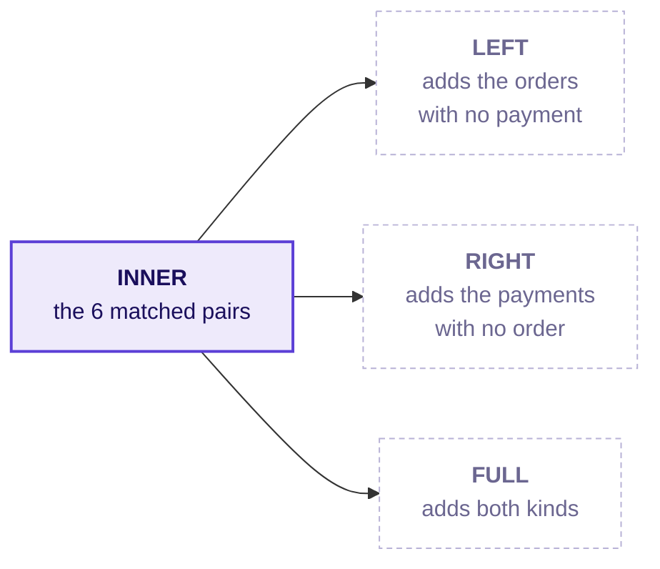
```mermaid
flowchart LR
    I["<b>INNER</b><br/>the 6 matched pairs"] --> L["<b>LEFT</b><br/>adds the orders<br/>with no payment"]
    I --> R["<b>RIGHT</b><br/>adds the payments<br/>with no order"]
    I --> F["<b>FULL</b><br/>adds both kinds"]
    classDef known fill:#EEEAFB,stroke:#5B3FD6,color:#1A0F5C,stroke-width:2px
    classDef unknown fill:#FFFFFF,stroke:#B8B2D6,color:#6B6690,stroke-dasharray:4 3
    class I known
    class L,R,F unknown
```

**Question.** How many rows do LEFT, RIGHT and FULL return, in that order? a) 5, 7 and 8; b) 7, 7 and 8; c) 5, 5 and 7; d) 7, 6 and 8.

```notes
LIVE, 1 minute. The three outer joins keep the same six pairs and differ only in the unmatched rows
they add back. Take letters.
```

---

## S18. Answer: 7, 7 and 8, and the repeats stay
*Which unmatched rows does each join keep, and where do the repeats come from?*

| Join | T-4, an order with no payment | P-7, a payment with no order | Rows |
|---|---|---|---|
| INNER | dropped | dropped | 6 |
| LEFT | kept, payment side NULL | dropped | 7 |
| RIGHT | dropped | kept, order side NULL | 7 |
| FULL | kept | kept | 8 |

The answer is b. **The check.** LEFT adds exactly one row to INNER, RIGHT exactly one, FULL both. Every join repeats T-2 and T-3, because the repeat comes from the key, whatever the join type.

```notes
LIVE, 3 minutes. NULL is SQL's mark for "no value here", and it is how an outer join shows the side
that found nothing. The four checks in notebook 1 pass. Guided sheet Part 3 is the LEFT join by hand.
Transition: a hurried analyst picks the wrong table to start from.
```

---

## S19. Question: what if the statement starts at payments?
*What does a statement that starts from the payments table tell Anand?*

**The plausible wrong answer.** Collected money lives in payments, so a teammate starts the statement there: every payment, with its order attached.

```sql
SELECT p.payment_id, p.amount AS paid, o.order_id, o.amount AS booked
FROM tiny_payments p
LEFT JOIN tiny_orders o ON o.order_id = p.order_id;
```

**Question.** How many of the five booked orders are on it, and how much cash does it total? a) 5 orders, 5,800; b) 4 orders, 7,100; c) 5 orders, 6,500; d) 4 orders, 5,000.

```notes
LIVE, 2 minutes. This returns the same rows as option C. Take letters before running it.
```

---

## S20. Answer: 4 of 5 orders, and 122 percent collected
*What exactly does the payments-first statement report?*

```stats
value: 4 of 5 | label: booked orders on it | note: T-4 is missing
value: 7,100 | label: cash on the statement | note: every payment row
value: 5,800 | label: booked | note: the five orders
value: 122% | label: collected, as it reads | note: more cash than was booked
```

The answer is b: four of the five booked orders, and 7,100 of cash against 5,800 booked. A finance controller who reads "we collected more than we booked" stands his collections team down.

```notes
LIVE, 1 minute. Say the wrong number exactly: 122 percent collected. This is the chapter's trap, a
plausible statement with every row real.
```

---

## S21. Why it is wrong: it answers another question
*Why is the payments-first statement wrong, and which check catches it without a rupee?*

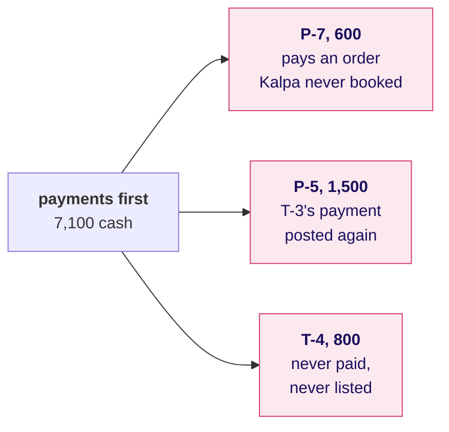
```mermaid
flowchart LR
    S["<b>payments first</b><br/>7,100 cash"] --> A["<b>P-7, 600</b><br/>pays an order<br/>Kalpa never booked"]
    S --> B["<b>P-5, 1,500</b><br/>T-3's payment<br/>posted again"]
    S --> C["<b>T-4, 800</b><br/>never paid,<br/>never listed"]
    classDef bad fill:#FBE9EF,stroke:#D63A6A,color:#1A0F5C
    class A,B,C bad
```

**The check that catches it.** Count the booked orders on the statement against the orders table, 4 against 5, and count the lines with no booked order behind them, 1. Neither check reads a rupee.

```notes
LIVE, 2 minutes. Anand asked about the orders Kalpa booked; this statement answers which payment
belongs to which order. T-4, the one order nobody paid, never reaches it, so the collections team
has nothing to chase, and the cash total carries 600 from P-7 and 1,500 from the retry.
```

---

## S22. The fix: orders first, and T-4 appears
*What does the statement look like when the table whose every row must survive comes first?*

| order_id | booked | payment_id | paid |
|---|---|---|---|
| T-1 | 1,000 | P-1 | 1,000 |
| T-2 | 2,000 | P-2 | 1,200 |
| T-2 | 2,000 | P-3 | 800 |
| T-3 | 1,500 | P-4 | 1,500 |
| T-3 | 1,500 | P-5 | 1,500 |
| T-4 | 800 | NULL | NULL |
| T-5 | 500 | P-6 | 500 |

**What changed.** All five booked orders are on it and T-4 shows NULL where its payment would be. What did not change: seven lines for five orders, so T-2 reads as short-paid on both its lines, 1,200 of 2,000 and 800 of 2,000, when it was paid in full.

```notes
LIVE, 2 minutes. P-7 left the statement; it belongs to the platform lead's question. The seven
lines are why chapter 2 exists: before any total is read from this join, the room has to say what
a total does to an order that appears twice.
```

---

## S23. A second route: the keys predict every count
*Can the row counts be predicted from the keys alone, before any join runs?*

| order_id | rows in orders (a) | rows in payments (b) | INNER writes a x b |
|---|---|---|---|
| T-1 | 1 | 1 | 1 |
| T-2 | 1 | 2 | 2 |
| T-3 | 1 | 2 | 2 |
| T-4 | 1 | 0 | 0, and LEFT adds 1 |
| T-5 | 1 | 1 | 1 |
| T-9 | 0 | 1 | 0, and RIGHT adds 1 |

**The check.** The keys predict 6, 7, 7 and 8, the four counts the joins returned, without running a join.

```notes
LIVE, 2 minutes. For a key seen a times in orders and b times in payments, INNER writes a x b rows;
LEFT adds one row per order key that matched nothing, RIGHT one per payment key that matched
nothing, FULL both. This route fails only when the join condition is more than key equality, such
as the date condition chapter 4 meets. Count the keys first on real data, every time.
```

---

## S24. Chapter 1, answered in five lines
*What did chapter 1 answer, and what question does it leave?*

| Question | The answer, with its number |
|---|---|
| What is one row? | One order in orders, 1,000 of them; one payment event in payments, up to two per order id |
| How many rows? | INNER 6, LEFT 7, RIGHT 7, FULL 8 on five orders and seven payments |
| Which join? | LEFT JOIN with orders first: all five orders, nothing that is not an order |
| Payments first? | 4 of 5 orders and 7,100 against 5,800: the unpaid order vanishes |
| From the keys? | a x b per key, plus the orphans: 6, 7, 7 and 8 predicted |

**Kavya's review.** "Tell me the grain of each table, and which rows your join drops, before you tell me any total. Start from the table whose every row must survive."

```notes
LIVE, 1 minute. Read the five lines, then Kavya's review. Mark the "never paid" arrow on the board
drawing with LEFT. The question this leaves: the right join still lists T-2 and T-3 twice, so what
does a total over those rows report on Kalpa's Q2? That is chapter 2.
```

---
## SECTION 2: Why twice the bookings?
*Why does the first join on Kalpa's Q2 report nearly twice the bookings as collected, and how do we attach payments so that nothing counts twice?*

```notes
LIVE. Chapter 2 runs 30 minutes: the map, the need and the companies (4), the ten largest orders (3),
the first draft and its number (5), why it is wrong (4), the four options and the call (6), the fix
(4), the second route (3), the close (1). Notebook 2, C2_W02_D02_02_why_twice_booked_STUDENT.ipynb.
```

---

## S25. Answer in six steps, from doubled to fixed
*Who needs chapter 2's answer, and which smaller questions lead to it?*

**Who needs the answer.** Anand, who would read a collected figure twice his books as collections running ahead and stand his collections team down; the data platform lead, who hears about a wrong warehouse number first; and you, because the way chosen here carries every later chapter of the day.

```timeline
label: 1 | title: Two rows, why? | body: Which Kalpa orders own two payment rows.
label: 2 | title: The first draft? | body: What it reports as collected for Q2.
label: 3 | title: Why wrong? | body: When every row on it is right.
label: 4 | title: Which fix? | body: Four ways to stop the double count, sized.
label: 5 | title: 462 kept? | body: Orders and Rs 9,84,00,000 after the fix.
label: 6 | title: Tables agree? | body: Each table summed alone, against the join. | tone: dark
```

```notes
LIVE, 1 minute. Read the six aloud. The metric at stake is still collected against booked, and
collected can never honestly exceed booked; hold on to that sentence, it is the chapter's first check.
```

---

## S26. A doubled figure stands the team down
*What does Anand lose if collected is counted twice?*

```cards
icon: user | eyebrow: Who asks | title: Anand, finance controller | body: Reads collected against booked to decide where the collections team spends next week.
icon: receipt | eyebrow: The metric | title: Collected against booked | body: Booked is Rs 9,84,00,000 over 462 Q2 orders, and cash against bookings cannot honestly exceed it.
icon: triangle-alert | eyebrow: A wrong number costs | title: A week, then trust | body: The team is stood down in the quarter Anand asked about, and a figure withdrawn from Meera Raghavan's Monday page makes every later warehouse number suspect. | tone: dark
```

```notes
LIVE, 1 minute. Meera Raghavan is Kalpa Retail's CEO; the Monday page is the numbers she reads each
week. Say what the controller would say on reading "collected above booked": we are collecting
ahead of bookings. That sentence is the cost.
```

---

## S27. Shopify and dbt name the same multiplication
*Which real companies build their data around one order owning several money rows?*

```cards
icon: shopping-cart | eyebrow: Shopify | title: Several transactions per order | body: A transaction for "every order that results in an exchange of money": an authorization, its capture, a sale, a void or a refund can all sit on one order.
icon: database | eyebrow: dbt Labs | title: Fan-out, named | body: "Fan-out joins are when one row in a table is joined to multiple rows in another table, resulting in more output rows than input rows."
icon: shield-check | eyebrow: What they do about it | title: Restrict it | body: MetricFlow, dbt's metrics layer, restricts fan-out joins, so a metric cannot be summed at the wrong grain. | tone: dark
```

A report that adds every Shopify transaction of an order counts an authorised and captured payment twice.

```notes
LIVE, 2 minutes. Sources: Shopify developer documentation, the REST Admin API's Transaction resource
(a legacy API since 1 October 2024, whose transaction kinds the GraphQL Admin API keeps), and dbt's
MetricFlow documentation (Joins, last updated 8 Sep 2026), both checked 1 Oct 2026; URLs in the
provenance.
An authorization is money the customer has agreed to pay; a capture takes that same money. dbt
builds a whole metrics layer to stop the mistake this chapter stages.
```

---

## S28. Question: do Q2's largest orders own two rows?
*Which Kalpa orders own two payment rows, and why?*

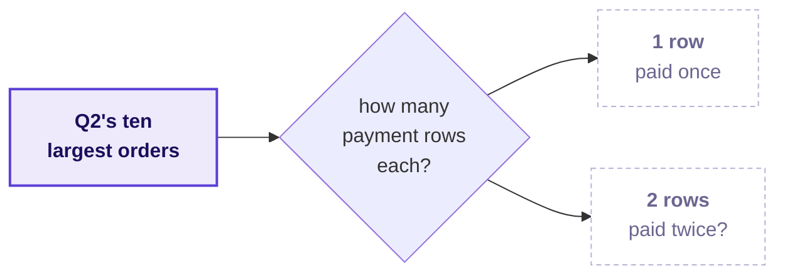
```mermaid
flowchart LR
    O["<b>Q2's ten<br/>largest orders</b>"] --> Q{"how many<br/>payment rows<br/>each?"}
    Q --> A["<b>1 row</b><br/>paid once"]
    Q --> B["<b>2 rows</b><br/>paid twice?"]
    classDef known fill:#EEEAFB,stroke:#5B3FD6,color:#1A0F5C,stroke-width:2px
    classDef unknown fill:#FFFFFF,stroke:#B8B2D6,color:#6B6690,stroke-dasharray:4 3
    class O known
    class A,B unknown
```

**Question.** Among Q2's ten largest orders, how many carry two payment rows? a) none, large orders are paid once; b) all ten, with instalments 1 and 2; c) the cancelled ones only; d) about half, at random.

```notes
LIVE, 1 minute. Chapter 1 found that an order id holds up to two payment rows; now ask which orders
they are. Take letters, then run level 1 of notebook 2.
```

---

## S29. Answer: all ten, in instalments 1 and 2
*What do the two payment rows of a large business invoice stand for?*

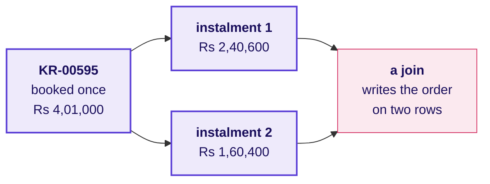
```mermaid
flowchart LR
    B["<b>KR-00595</b><br/>booked once<br/>Rs 4,01,000"] --> I1["<b>instalment 1</b><br/>Rs 2,40,600"]
    B --> I2["<b>instalment 2</b><br/>Rs 1,60,400"]
    I1 --> J["<b>a join</b><br/>writes the order<br/>on two rows"]
    I2 --> J
    classDef known fill:#EEEAFB,stroke:#5B3FD6,color:#1A0F5C,stroke-width:2px
    classDef bad fill:#FBE9EF,stroke:#D63A6A,color:#1A0F5C
    class B,I1,I2 known
    class J bad
```

The answer is b. Kalpa settles its large business invoices in two parts, as Anand said, so every one of Q2's ten largest orders owns two payment rows. **The check.** 10 of 10 carry instalments 1 and 2.

```notes
LIVE, 2 minutes. KR-00595 is a typical business order from the store channel, booked at Rs 4,01,000
and paid in two instalments that add back to it: two real payments in two rows for one order. An
order that owns two payment rows comes out of a join twice.
```

---

## S30. Question: what does the first draft collect?
*What does a first draft of collected report for Q2?*

**The plausible wrong answer.** A teammate keeps every Q2 order with a LEFT JOIN, as chapter 1 taught, and counts an order as collected, at its booked amount, whenever a payment row sits beside it.

```sql
SELECT count(*) AS rows_out,
       sum(o.amount) FILTER (WHERE p.payment_id IS NOT NULL) AS collected
FROM orders o
LEFT JOIN payments p ON p.order_id = o.order_id
WHERE o.quarter = 'Q2';
```

**Question.** Against Rs 9,84,00,000 booked, what does the draft report? a) a little under Rs 9.84 crore, since some orders may be unpaid; b) exactly Rs 9.84 crore; c) about Rs 19.3 crore; d) about Rs 4.9 crore.

```notes
LIVE, 2 minutes. FILTER (WHERE ...), which Monday used, restricts one aggregate to the rows that meet
a condition. Most rooms pick a, which is the answer the query was written to give. Take letters.
```

---

## S31. Answer: Rs 19,29,04,410, 1.96 times booked
*What exactly does the first draft report, and what would Anand do with it?*

```stats
value: Rs 19,29,04,410 | label: collected, first draft | note: the order amount beside each payment row
value: Rs 9,84,00,000 | label: booked | note: Monday's number, orders alone
value: 1.96 x | label: collected over booked | note: which cash cannot be
value: 678 | label: rows out | note: from 462 Q2 orders in
```

The answer is c. Read as it stands, the draft says Kalpa collected Rs 9.45 crore more than it sold, and a finance controller who believes it stops chasing anything this quarter.

```notes
LIVE, 2 minutes. Say the wrong number exactly: Rs 19,29,04,410. Every channel in the notebook's chart
sits near twice its bookings, so the error is not one channel's. Let the room find the doubling
before anyone names it.
```

---

## S32. Why it is wrong: the amount rides every row
*Why is the first draft wrong when every row on it is right?*

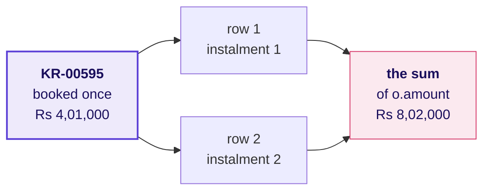
```mermaid
flowchart LR
    K["<b>KR-00595</b><br/>booked once<br/>Rs 4,01,000"] --> R1["row 1<br/>instalment 1"]
    K --> R2["row 2<br/>instalment 2"]
    R1 --> S["<b>the sum</b><br/>of o.amount<br/>Rs 8,02,000"]
    R2 --> S
    classDef known fill:#EEEAFB,stroke:#5B3FD6,color:#1A0F5C,stroke-width:2px
    classDef bad fill:#FBE9EF,stroke:#D63A6A,color:#1A0F5C
    class K known
    class S bad
```

A sum over a join runs at the join's grain, here the payment, whatever column it names. This is a **fan-out**: a key that repeats on one side multiplies the rows of the other. **The check that catches it.** Rows out against orders in, 678 against 462, or collected against booked, since cash cannot exceed bookings.

```notes
LIVE, 4 minutes. Now name it: fan-out. Either check is enough, and neither needs a second table.
Mark the "two matches" arrow on the board drawing with the word fan-out.
```

---

## S33. Four ways to stop the double count, sized
*Which of four ways stops the double count, and what does each cost on this data?*

| Option | Rows out for 462 orders | Booked after it | Error against booked |
|---|---|---|---|
| A. Payments to one row per order, then join | 462 | Rs 9,84,00,000 | Rs 0 |
| B. `sum(DISTINCT o.amount)` after the join | 678, one sum | Rs 9,63,67,220 | minus Rs 20,32,780 |
| C. A window dedupe of repeated postings | more than 462 | still inflated | every two-instalment order keeps two rows |
| D. Fix the feed | no change to Q2 | Q2 as posted | weeks of platform work |

**Sized.** A and B each take a few milliseconds, so the choice is about what each gets wrong. B loses real bookings because 243 of Q2's 462 orders share their amount with another order, across 97 amounts that repeat.

```notes
LIVE, 4 minutes. C keeps the first posting of each order and instalment with a window function, a
tool Wednesday teaches; it removes a repeat of the same instalment and leaves every genuine second
instalment, so the draft stays inflated. D is the right request to the platform lead and changes
nothing about the quarter Anand asked for. DISTINCT removes repeated values, and a repeated value is
not a repeated order.
```

---

## S34. The call: one row per order, then join
*Which way fits, and what fact would change the call?*

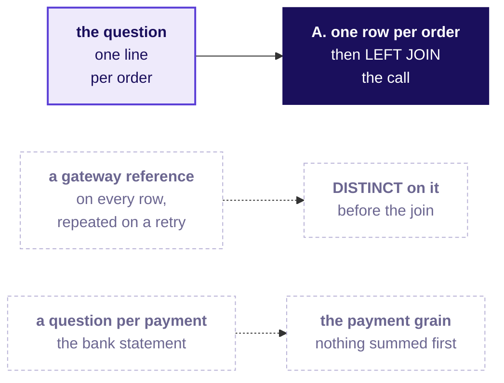
```mermaid
flowchart LR
    Q["<b>the question</b><br/>one line<br/>per order"] --> A["<b>A. one row per order</b><br/>then LEFT JOIN<br/>the call"]
    T["<b>a gateway reference</b><br/>on every row,<br/>repeated on a retry"] -.-> X["<b>DISTINCT on it</b><br/>before the join"]
    P["<b>a question per payment</b><br/>the bank statement"] -.-> G["<b>the payment grain</b><br/>nothing summed first"]
    classDef known fill:#EEEAFB,stroke:#5B3FD6,color:#1A0F5C,stroke-width:2px
    classDef unknown fill:#FFFFFF,stroke:#B8B2D6,color:#6B6690,stroke-dasharray:4 3
    classDef bet fill:#1A0F5C,stroke:#1A0F5C,color:#FFFFFF
    class A bet
    class Q known
    class T,X,P,G unknown
```

**The fact that would change the call.** A feed that carried the gateway's own reference on every row would let a DISTINCT on that reference remove retries exactly, and a question per payment would make the payment the right grain.

```notes
LIVE, 2 minutes. A keeps every order, paid or not, and keeps a count of payment rows, so a repeated
posting stays visible for chapter 4 instead of vanishing. Say the call and its reason in one line.
```

---

## S35. Question: how many rows does the fix return?
*Does the chosen way keep 462 orders and Rs 9,84,00,000 booked?*

```sql
WITH posted_per_order AS (
    SELECT order_id, sum(amount) AS posted, count(*) AS payment_rows
    FROM payments
    GROUP BY order_id
)
SELECT o.order_id, o.channel, o.amount AS booked, pp.posted, pp.payment_rows
FROM orders o
LEFT JOIN posted_per_order pp ON pp.order_id = o.order_id
WHERE o.quarter = 'Q2';
```

**Question.** How many rows does it return? a) 678; b) 462; c) 216; d) 1,000.

```notes
LIVE, 1 minute. A CTE, WITH ... AS, is a named subquery the main query reads, which Monday met.
posted is everything the feed holds against an order, instalments and any repeat alike, and an
order with no payment row gets NULL there. Take letters.
```

---

## S36. Answer: 462 rows and Rs 9,84,00,000 booked
*What changed, and what does the posted column now hold?*

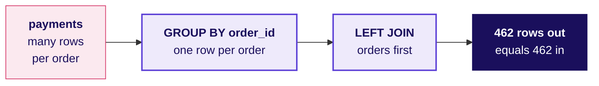
```mermaid
flowchart LR
    P["<b>payments</b><br/>many rows<br/>per order"] --> G["<b>GROUP BY order_id</b><br/>one row per order"]
    G --> L["<b>LEFT JOIN</b><br/>orders first"]
    L --> O["<b>462 rows out</b><br/>equals 462 in"]
    classDef bad fill:#FBE9EF,stroke:#D63A6A,color:#1A0F5C
    classDef known fill:#EEEAFB,stroke:#5B3FD6,color:#1A0F5C,stroke-width:2px
    classDef bet fill:#1A0F5C,stroke:#1A0F5C,color:#FFFFFF
    class P bad
    class G,L known
    class O bet
```

The answer is b: 462 rows for 462 orders, and booked after the join is Rs 9,84,00,000, Monday's figure to the rupee. **What changed.** The 216 extra rows are gone, and each order's amount is summed once.

```notes
LIVE, 3 minutes. The three checks in the notebook pass: rows out equal orders in, booked equals
Monday's, no order twice. The posted total is each learner's own to read in the empty your-turn cell;
they write it down as "posted against Q2 orders", and chapter 3 asks what it is made of.
```

---

## S37. A second route: each table summed alone
*Do the two tables, each summed alone, agree with the fixed join?*

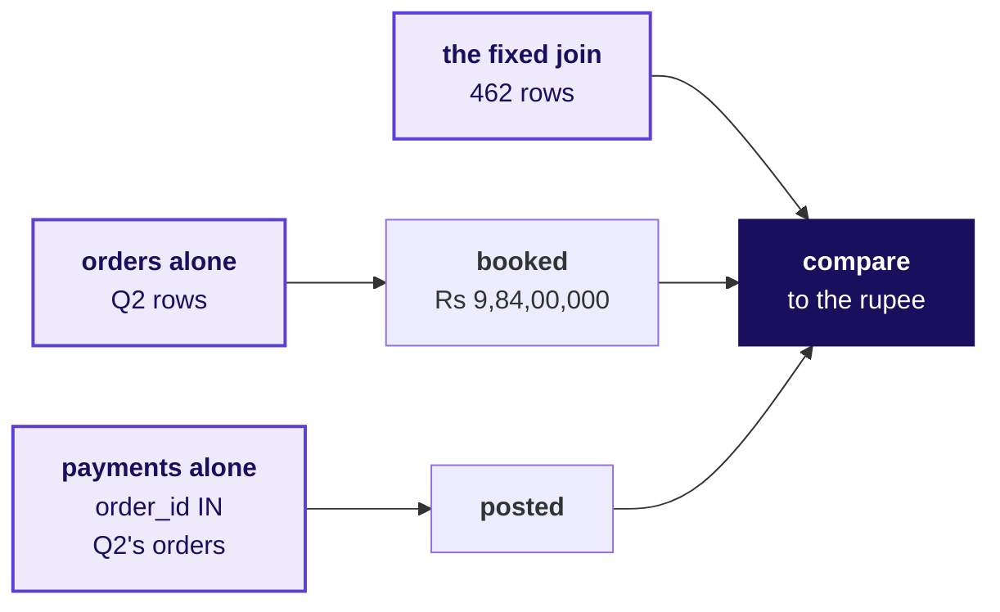
```mermaid
flowchart LR
    O["<b>orders alone</b><br/>Q2 rows"] --> B["<b>booked</b><br/>Rs 9,84,00,000"]
    P["<b>payments alone</b><br/>order_id IN<br/>Q2's orders"] --> S["<b>posted</b>"]
    J["<b>the fixed join</b><br/>462 rows"] --> C["<b>compare</b><br/>to the rupee"]
    B --> C
    S --> C
    classDef known fill:#EEEAFB,stroke:#5B3FD6,color:#1A0F5C,stroke-width:2px
    classDef bet fill:#1A0F5C,stroke:#1A0F5C,color:#FFFFFF
    class O,P,J known
    class C bet
```

**The check.** Booked from orders alone equals booked after the fix, Rs 9,84,00,000, and posted from payments alone, restricted with `IN` to Q2's order ids, equals the fixed join's posted to the rupee. The route never joins, so it cannot fan out.

```notes
LIVE, 3 minutes. This route would catch a fan-out the first missed, because it sums each table at
its own grain and never multiplies anything. The interview tags mark how often a question comes up:
[S] a staple asked everywhere, [F] frequent in GCC and product screens, [D] a differentiator.
Interview [F]: revenue doubled after a join and every row looks fine; where do you look? At the
grain: which key repeats on the many side.
```

---

## S38. Chapter 2, answered in six lines
*What did chapter 2 answer, and what question does it leave?*

| Question | The answer, with its number |
|---|---|
| Two rows, why? | Large business invoices are paid in two instalments: 10 of Q2's 10 largest orders |
| The first draft? | Rs 19,29,04,410 collected against Rs 9,84,00,000 booked, 1.96 times |
| Why wrong? | The order amount rides on every payment row: 462 orders become 678 rows |
| Which fix? | One row per order first; DISTINCT loses Rs 20,32,780 of bookings |
| 462 kept? | Yes: 462 rows and Rs 9,84,00,000, Monday's figures exactly |
| Tables agree? | Yes: booked and posted, each summed alone, match the join |

**Kavya's review.** "A join is a multiplication until you prove it is not. Bring the many side to the grain of the question before you join, and show me rows in and rows out beside the total."

```notes
LIVE, 1 minute. The question this leaves: the fixed join keeps every order and its posted column is
what the feed recorded. Is every booked order still there when the report is written, and what,
rupee by rupee, separates booked from posted? That is chapter 3.
```

---
## SECTION 3: Is every order there?
*Once nothing counts twice, is every booked order still in the report, and can every rupee between booked and posted be named?*

```notes
LIVE. Chapter 3 runs 30 minutes: the map, the need, Stripe and PHE (4), the four proofs and the call (5),
the grain check on Q2 (3), the plain JOIN trap, its check and fix (8), the bridge (7), the second
route (2), the close (1). Notebook 3, C2_W02_D02_03_every_order_there_STUDENT.ipynb.
```

---

## S39. Answer in six steps, from rows to rupees
*Who needs chapter 3's answer, and which smaller questions lead to it?*

**Who needs the answer.** Anand, who asked which orders make the gap, so an order missing from the report is an order nobody chases, and his analyst, who reads the reconciliation above the number before the number. A report that loses an order and carries a repeated payment can show a gap of zero, and nobody acts on a zero.

```timeline
label: 1 | title: Gain or lose? | body: What the join can now do to the row count.
label: 2 | title: A plain JOIN? | body: What a first draft reports on the invented tables.
label: 3 | title: No rupee read? | body: The check that catches it first.
label: 4 | title: Which moves? | body: From booked to what the feed posted.
label: 5 | title: Q2 closes? | body: The same bridge on Kalpa's warehouse.
label: 6 | title: Capped? | body: Collected a second way, each order at its booked. | tone: dark
```

```notes
LIVE, 1 minute. The metric now is the gap between booked and collected, and what can sit inside it:
orders never paid, orders paid short and payments posted twice. Posted is every payment row the
feed holds; collected counts each payment once.
```

---

## S40. A missing order is worse than a wrong total
*Why is an order that drops out of the report more dangerous than a total that is off?*

```cards
icon: eye | eyebrow: A wrong total | title: Visible | body: It disagrees with Monday's booked figure or breaks a rule such as cash above bookings, and someone asks.
icon: eye-off | eyebrow: A missing order | title: Invisible | body: Every number left in the report is correct for the orders that remain, so nothing looks wrong.
icon: triangle-alert | eyebrow: The cost to Anand | title: The order nobody rings | body: A repeated payment can offset the dropped order, and the report shows a gap of zero, which reads as fully collected. | tone: dark
```

```notes
LIVE, 2 minutes. Anand asked "which orders", and the one order a report drops is exactly the order
his collections team never rings. Ask the room for a report in their own work that looked complete
and was not.
```

---

## S41. Stripe itemizes payouts; PHE lost 15,841 cases
*Which real company builds this proof in, and which public case shows what its absence costs?*

```stats
value: every row | label: inside a Stripe payout | note: each payment, refund, dispute and fee, itemized against the deposit
value: 15,841 | label: positive cases PHE left out | note: of the daily figures, 25 Sep to 2 Oct 2020
value: about 1,400 | label: cases per XLS template | note: each result took several of its 65,000 rows; later cases were left off
```

Stripe's payout reconciliation report lets a merchant match each deposit in the bank to the payments behind it. At Public Health England no row that arrived was wrong; a count of rows sent against rows loaded would have caught the loss on the first day.

```notes
LIVE, 2 minutes. Sources: Stripe documentation, Payout reconciliation report, which "helps you match
the payouts you receive in your bank account with the batches of payments and other transactions
that they relate to" and itemizes "every payment, refund, dispute, fee, and other balance
transaction included in the payout"; PHE's statement on GOV.UK, 4 October 2020, and BBC News,
5 October 2020; all checked 1 Oct 2026. The testing firms' results arrived as CSV files and were
pulled into Excel templates in the old XLS format, which holds about 65,000 rows; each result took
several rows, so a template held about 1,400 cases, and once it was full further cases were left off.
They reached the dashboards and the contact tracers only after the fault was found. Stripe is the
bridge built into a product; PHE is the dropped-order failure at national scale, and the count check
is its fix.
```

---

## S42. Four proofs, run on a draft with two errors
*Which of four proofs shows Anand the gap is honest, and what does each catch?*

| Option | What Anand reads | Catches the dropped order | Catches the repeat inside |
|---|---|---|---|
| A. One number, booked less posted | 1 line: a gap of minus 1,500 | no | no |
| B. The count: rows in, rows out, the difference named | 4 lines: 4 of 5 orders | yes | no |
| C. The bridge, a list behind each move | 5 bars and 2 lists | yes | yes |
| D. The whole statement, one line per order | every line | if read | if read |

**Sized.** All four compute in seconds, so what separates them is what the reader can check. D catches everything only if someone reads 462 lines on Kalpa's Q2.

```notes
LIVE, 3 minutes. The invented draft carries two errors at once: it joined with a plain JOIN, and it
counts T-3's repeated payment inside collected. Notebook 3 runs each proof against it.
```

---

## S43. The call: the count first, then the bridge
*Which proof leaves the team first, and what fact would change the call?*

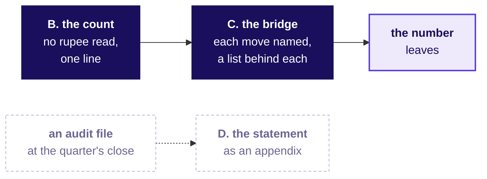
```mermaid
flowchart LR
    C["<b>B. the count</b><br/>no rupee read,<br/>one line"] --> B["<b>C. the bridge</b><br/>each move named,<br/>a list behind each"]
    B --> N["<b>the number</b><br/>leaves"]
    A["<b>an audit file</b><br/>at the quarter's close"] -.-> D["<b>D. the statement</b><br/>as an appendix"]
    classDef known fill:#EEEAFB,stroke:#5B3FD6,color:#1A0F5C,stroke-width:2px
    classDef unknown fill:#FFFFFF,stroke:#B8B2D6,color:#6B6690,stroke-dasharray:4 3
    classDef bet fill:#1A0F5C,stroke:#1A0F5C,color:#FFFFFF
    class C,B bet
    class N known
    class A,D unknown
```

**The fact that would change the call.** If the analyst had to tick every order for the audit file at the quarter's close, the whole statement would travel with the report as an appendix.

```notes
LIVE, 2 minutes. B catches a dropped or repeated order in one line and needs no rupee; the bridge is
the only proof that separates an unpaid order from a payment posted twice and puts a list behind each
move. Chapter 4's two lists are D's short form.
```

---

## S44. Question: can the fixed report gain rows?
*Once payments are one row per order, can the report gain rows, or only lose them?*

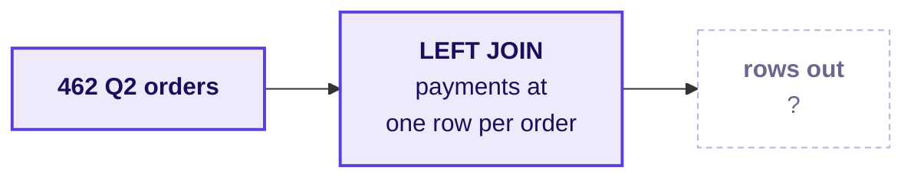
```mermaid
flowchart LR
    O["<b>462 Q2 orders</b>"] --> J["<b>LEFT JOIN</b><br/>payments at<br/>one row per order"]
    J --> R["<b>rows out</b><br/>?"]
    classDef known fill:#EEEAFB,stroke:#5B3FD6,color:#1A0F5C,stroke-width:2px
    classDef unknown fill:#FFFFFF,stroke:#B8B2D6,color:#6B6690,stroke-dasharray:4 3
    class O,J known
    class R unknown
```

**Question.** What can the join now do to the row count? a) gain rows, whenever an order has two instalments; b) only lose rows, and only if the join drops an order; c) nothing, a join always returns the left table's rows; d) gain rows, whenever a payment has no order.

```notes
LIVE, 1 minute. Take letters. Watch for c, the belief that a join cannot change the row count, which
chapter 2 has already broken.
```

---

## S45. Answer: it can only lose rows, and keeps 462
*What do the reconciliation lines say on Kalpa's Q2?*

| Reconciliation line | What it says on Kalpa's Q2 |
|---|---|
| Rows in | 462 Q2 orders, Rs 9,84,00,000 booked, from orders alone |
| Rows out | 462 rows, 462 distinct orders, at order grain |
| Booked after the join | Rs 9,84,00,000, equal to booked before it |
| The gap | booked less collected, each rupee named: your own figures |

The answer is b. An order now meets at most one payment row, so no order comes out twice, and the count can move only down, when the join drops an order. **The check.** 462 out, 462 in.

```notes
LIVE, 2 minutes. These are the four lines from the opening, filled in. The gap line stays blank on
the slide: each learner fills it from their own bridge at level 5.
```

---

## S46. Question: what gap does a plain JOIN report?
*What does a first draft with a plain JOIN report on the invented tables?*

**The plausible wrong answer.** A teammate takes chapter 2's fix and types `JOIN`, which in SQL means INNER JOIN, in place of `LEFT JOIN`, the shortest thing to type.

```sql
WITH posted_per_order AS (
    SELECT order_id, sum(amount) AS posted FROM tiny_payments GROUP BY order_id
)
SELECT count(*) AS orders, sum(o.amount) AS booked, sum(pp.posted) AS posted,
       sum(o.amount) - sum(pp.posted) AS gap
FROM tiny_orders o
JOIN posted_per_order pp ON pp.order_id = o.order_id;
```

**Question.** Booked across the five invented orders is 5,800. What gap does the draft report? a) 800; b) 0; c) minus 1,500; d) minus 700.

```notes
LIVE, 2 minutes. Payments are one row per order, so nothing is counted twice by this join. Take
letters.
```

---

## S47. Answer: minus 1,500, collected with a surplus
*What exactly does the plain JOIN draft report?*

```stats
value: 4 | label: orders in the report | note: of 5 in the table
value: 5,000 | label: booked, as reported | note: of 5,800
value: 6,500 | label: posted, as reported | note: every payment row matched
value: minus 1,500 | label: gap, as reported | note: fully collected, with a surplus
```

The answer is c. The report says Kalpa collected everything it booked and 1,500 more.

```notes
LIVE, 1 minute. Say the wrong number exactly: a gap of minus 1,500. This is the chapter's trap.
```

---

## S48. Why it is wrong: two errors cancel
*Why is the plain JOIN draft wrong, and which check catches it without reading a rupee?*

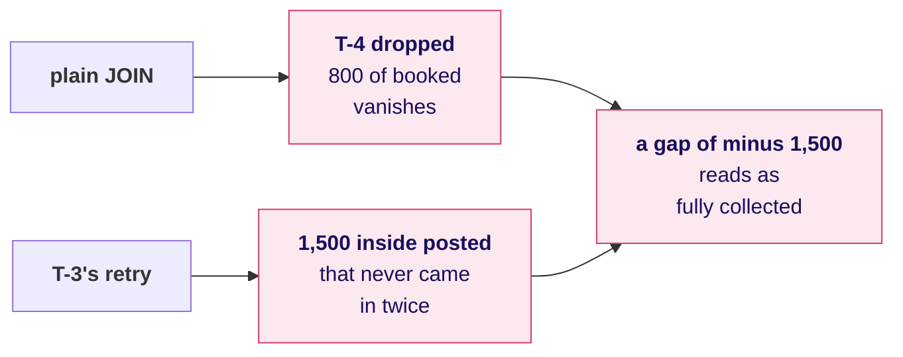
```mermaid
flowchart LR
    J["<b>plain JOIN</b>"] --> D["<b>T-4 dropped</b><br/>800 of booked<br/>vanishes"]
    R["<b>T-3's retry</b>"] --> P["<b>1,500 inside posted</b><br/>that never came<br/>in twice"]
    D --> G["<b>a gap of minus 1,500</b><br/>reads as<br/>fully collected"]
    P --> G
    classDef bad fill:#FBE9EF,stroke:#D63A6A,color:#1A0F5C
    class D,P,G bad
```

**The check that catches it.** Count the orders in the report against the orders in the table: 4 against 5. The count needs no rupee, which is why it runs first and every time.

```notes
LIVE, 3 minutes. Anand, reading "no gap, and a surplus", stops chasing T-4 and never asks why the
feed shows more cash than was booked. A LEFT JOIN at order grain must return exactly the orders it
was given, so the count fails the moment one goes missing.
```

---

## S49. The fix: LEFT JOIN, and two causes remain
*What does the LEFT JOIN restore, and what is still wrong with the gap?*

| Draft | Orders | Booked | Posted | Gap |
|---|---|---|---|---|
| plain JOIN | 4 | 5,000 | 6,500 | minus 1,500 |
| LEFT JOIN | 5 | 5,800 | 6,500 | minus 700 |

**What changed.** T-4 is back with NULL where its posted cash would be, and the count closes at 5 of 5. The gap still reads minus 700, which is 800 never paid less 1,500 posted twice: two different things netted into one figure that describes neither.

```notes
LIVE, 2 minutes. In the notebook's empty your-turn cell, each learner runs the plain JOIN on Kalpa's
Q2 and counts its orders against the 462 in the quarter, writing what they see in their
reconciliation lines before reading any rupee. The count is theirs to find.
```

---

## S50. Question: what is collected, each payment once?
*Which moves carry booked to what the feed posted?*

| Move | Definition, per order | Invented tables |
|---|---|---|
| Never paid | Booked, where the order has no payment row at all | T-4, 800 |
| Paid short | Booked less collected, where collected is below booked | none |
| Posted twice | Posted less collected: the same instalment written more than once | T-3, 1,500 |

**Question.** On the invented tables, what is collected, each payment counted once? a) 6,500; b) 5,800; c) 5,000; d) 4,200.

```notes
LIVE, 2 minutes. A bridge walks from one total to another in named moves, each with the list of
orders behind it, which is Week 1 Wednesday's revenue bridge one tool later. Collected counts each
order and instalment once; posted adds every row the feed holds.
```

---

## S51. Answer: 5,000, and the bridge closes
*Does booked, less each named move, land exactly on what the feed posted?*

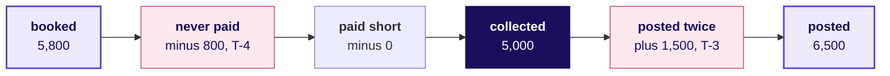
```mermaid
flowchart LR
    B["<b>booked</b><br/>5,800"] --> N["<b>never paid</b><br/>minus 800, T-4"]
    N --> S["<b>paid short</b><br/>minus 0"]
    S --> C["<b>collected</b><br/>5,000"]
    C --> T["<b>posted twice</b><br/>plus 1,500, T-3"]
    T --> P["<b>posted</b><br/>6,500"]
    classDef known fill:#EEEAFB,stroke:#5B3FD6,color:#1A0F5C,stroke-width:2px
    classDef bad fill:#FBE9EF,stroke:#D63A6A,color:#1A0F5C
    classDef bet fill:#1A0F5C,stroke:#1A0F5C,color:#FFFFFF
    class B,P known
    class N,T bad
    class C bet
```

The answer is c. **The check.** Booked less never paid less paid short equals collected, and collected plus posted twice equals posted. On Kalpa's Q2 the same bridge closes at every step and lands on the payments table's own total for Q2 orders.

```notes
LIVE, 4 minutes. Each move has one order behind it, and each is a question for a different person:
T-4 for the collections team, T-3 for the platform lead. Each learner runs the Kalpa bridge in the
notebook's your-turn cell and copies the six figures into their reconciliation lines; the check
cell after it confirms the bridge closes without printing a figure. The moves go in a fixed order,
written above the chart, so two analysts draw the same bridge.
```

---

## S52. A second route: cap each order at booked
*Does collected come out the same when each order's posted cash is capped at its booked amount?*

| order_id | booked | posted | the smaller of the two |
|---|---|---|---|
| T-1 | 1,000 | 1,000 | 1,000 |
| T-2 | 2,000 | 2,000 | 2,000 |
| T-3 | 1,500 | 3,000 | 1,500 |
| T-5 | 500 | 500 | 500 |
| **Collected** | | | **5,000** |

**The check.** The cap gives 5,000 on the invented tables and agrees with the bridge to the rupee on Kalpa's Q2. The two methods fail in different places: the instalment method would count a retry written under a new instalment number, and the cap would throw away a genuine overpayment. Where they agree, neither blind spot is in the data.

```notes
LIVE, 2 minutes. Here the INNER JOIN is the honest choice, because the question is about paid orders
only; an unpaid order adds nothing to collected either way. Interview [D]: two errors cancel and the
total looks right; how would you find them? Count first, then split the difference into moves.
```

---

## S53. Chapter 3, answered in six lines
*What did chapter 3 answer, and what question does it leave?*

| Question | The answer, with its number |
|---|---|
| Gain or lose? | It can only lose rows now; Kalpa's Q2 keeps 462 of 462 |
| A plain JOIN? | 4 orders, booked 5,000, posted 6,500: a gap of minus 1,500 |
| No rupee read? | Orders in the report against the table, 4 against 5 |
| Which moves? | 5,800 less 800 never paid, less 0 paid short, is 5,000; plus 1,500 twice is 6,500 |
| Q2 closes? | Yes, at every step, and posted equals the payments table's own total |
| Capped? | 5,000 again, and the same collected on Kalpa's Q2 |

**Kavya's review.** "Rows in, rows out and the difference explained, written above the number. If the count does not close, the number does not leave the team, and if the gap has two causes, it gets two bars."

```notes
LIVE, 1 minute. The question this leaves: each bar of the bridge is a total, and Anand asked which
orders. Which Q2 orders were never paid, and which payments were posted twice? That is chapter 4,
after the break.
```

---
## SECTION 4: Which orders, exactly?
*Which Q2 orders were never paid, and which payments did the gateway post twice, so each list reaches the right desk?*

```notes
LIVE. Chapter 4 runs 30 minutes after the break: the map, the need and the companies (4), the four
anti-joins and the call (4), the anti-join (3), the WHERE trap, its check and the fix in ON (8), the
HAVING trap and the fix by instalment (8), the second route (2), the close (1). Notebook 4,
C2_W02_D02_04_which_orders_STUDENT.ipynb.
```

---

## S54. Answer in six steps, from a bar to names
*Who needs chapter 4's answer, and which smaller questions lead to it?*

**Who needs the answer.** The collections team, who ring every customer on the unpaid list, and the platform lead and Finance, who reverse or refund what is on the double-paid list. A wrong unpaid list chases a customer who paid or misses one who did not; a wrong double-paid list reverses a real second instalment and rings a business buyer who paid on time.

```timeline
label: 1 | title: No payment? | body: The orders nothing matched.
label: 2 | title: Paid in Q2? | body: The list with the quarter in WHERE.
label: 3 | title: Where does it go? | body: A condition on the payments table.
label: 4 | title: Two rows? | body: What HAVING COUNT(*) > 1 flags.
label: 5 | title: A retry is? | body: The grain of a double payment, and each list against its bar.
label: 6 | title: A second list? | body: Other methods, the same orders. | tone: dark
```

```notes
LIVE, 1 minute. The metric now is the two moves of the bridge that carry names: the booked value of
orders never paid, and the cash posted twice. Each list is right only when its total equals its bar.
```

---

## S55. Two lists, two desks, two costs
*Whom does Anand chase, and whom does he refund?*

```cards
icon: phone | eyebrow: The unpaid list | title: The collections team | body: Rings every customer on it; each large business invoice on it is several lakh rupees Kalpa is owed.
icon: repeat | eyebrow: The double-paid list | title: The platform lead and Finance | body: The lead fixes the feed; Finance checks with the bank whether a customer was charged twice and refunds them.
icon: triangle-alert | eyebrow: A wrong list costs | title: A call, or cash left | body: A name on the wrong list is a phone call to a customer who did nothing wrong, and a name missing is money left where it is. | tone: dark
```

```notes
LIVE, 1 minute. Say the two costs as the collections head would hear them: a wasted call on a good
customer, or an overdue invoice nobody chased.
```

---

## S56. Stripe and the RBI treat a retry as money owed
*Which real company and which regulator deal with a payment posted twice?*

```cards
icon: key-round | eyebrow: Stripe | title: Idempotency keys | body: The client sends a key with a request; Stripe saves the first result, and "subsequent requests with the same key return the same result", so a retry cannot charge twice.
icon: landmark | eyebrow: Reserve Bank of India | title: Five days to reverse | body: A card payment debited online and never confirmed to the merchant's system must be reversed automatically within five days, or the bank pays Rs 100 a day of delay (RBI/2019-20/67). | tone: dark
```

A payment posted twice can be money a customer is owed back, on a regulator's clock.

```notes
LIVE, 2 minutes. Sources: Stripe API reference, Idempotent requests; RBI circular RBI/2019-20/67 of
20 September 2019, in force from 15 October 2019; both checked 1 Oct 2026, URLs in the provenance.
Stripe builds its API so the gateway retry the platform lead mentioned cannot double-charge; where a
feed lacks that, the data team finds the repeats.
```

---

## S57. Four anti-joins, sized on this data
*Which of four ways finds the unpaid orders, and what does each cost here?*

| Option | Written as | Carries the order's columns | With one NULL payment id |
|---|---|---|---|
| A. LEFT JOIN, keep the misses | `LEFT JOIN payments p ... WHERE p.order_id IS NULL` | yes | still finds T-4 |
| B. NOT EXISTS | `WHERE NOT EXISTS (SELECT 1 FROM payments p WHERE ...)` | yes | still finds T-4 |
| C. NOT IN | `WHERE o.order_id NOT IN (SELECT order_id FROM payments)` | yes | finds 0 orders, where it found 1 |
| D. EXCEPT | `SELECT order_id FROM orders EXCEPT SELECT ...` | ids only | still finds T-4 |

**Sized.** All four take a few milliseconds and return the same Q2 list on today's warehouse, so what separates them is what each assumes.

```notes
LIVE, 2 minutes. An anti-join keeps the rows of one table that have no partner in the other. The
notebook checks that all four agree on Kalpa's Q2 without printing the list, then adds one payment
with a NULL order reference to the invented tables, which a feed can send, and C returns nothing.
```

---

## S58. The call: the report's own LEFT JOIN
*Which anti-join fits, which one to avoid, and what fact would change the call?*

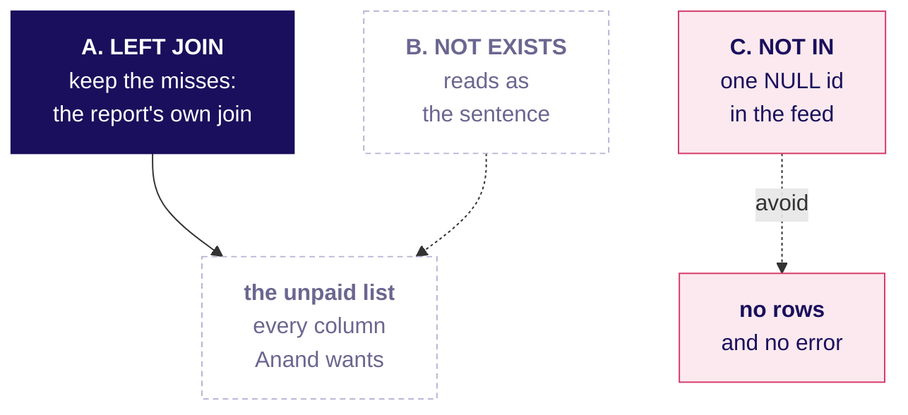
```mermaid
flowchart TB
    A["<b>A. LEFT JOIN</b><br/>keep the misses:<br/>the report's own join"] --> L["<b>the unpaid list</b><br/>every column<br/>Anand wants"]
    B["<b>B. NOT EXISTS</b><br/>reads as<br/>the sentence"] -.-> L
    C["<b>C. NOT IN</b><br/>one NULL id<br/>in the feed"] -.->|"avoid"| X["<b>no rows</b><br/>and no error"]
    classDef bet fill:#1A0F5C,stroke:#1A0F5C,color:#FFFFFF
    classDef unknown fill:#FFFFFF,stroke:#B8B2D6,color:#6B6690,stroke-dasharray:4 3
    classDef bad fill:#FBE9EF,stroke:#D63A6A,color:#1A0F5C
    class A bet
    class B,L unknown
    class C,X bad
```

**The fact that would change the call.** An analyst who reads the list as SQL would find B closest to "the orders for which no payment exists", and a feed change that allowed a NULL order id would make C unsafe even where it works today.

```notes
LIVE, 2 minutes. The unpaid list is the report's own rows with nothing on the payments side,
and it carries the channel, the date and the amount beside each order.
```

---

## S59. Question: which orders did nothing match?
*Which orders have no payment at all?*

```sql
SELECT o.order_id, o.channel, o.amount AS booked
FROM tiny_orders o
LEFT JOIN tiny_payments p ON p.order_id = o.order_id
WHERE p.order_id IS NULL;
```

**Question.** On the invented tables, which orders does it return? a) T-4; b) T-4 and T-9; c) T-2 and T-3; d) none, since every order has an id.

```notes
LIVE, 1 minute. Take letters. Watch for b: T-9 is a payment's order id, and it is not an order.
```

---

## S60. Answer: T-4 alone, the never-paid bar
*Does the unpaid list add up to the bar it explains?*

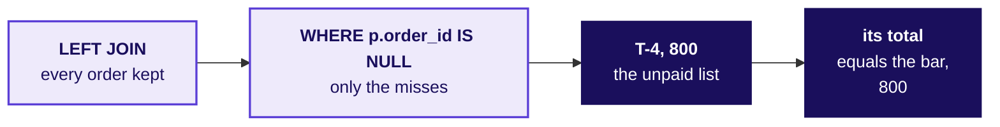
```mermaid
flowchart LR
    L["<b>LEFT JOIN</b><br/>every order kept"] --> W["<b>WHERE p.order_id IS NULL</b><br/>only the misses"]
    W --> U["<b>T-4, 800</b><br/>the unpaid list"]
    U --> C["<b>its total</b><br/>equals the bar,<br/>800"]
    classDef known fill:#EEEAFB,stroke:#5B3FD6,color:#1A0F5C,stroke-width:2px
    classDef bet fill:#1A0F5C,stroke:#1A0F5C,color:#FFFFFF
    class L,W known
    class U,C bet
```

The answer is a. T-9 is not an order, so it cannot be on a list of orders; it belongs to the platform lead's list. **The check.** The list's total equals chapter 3's never-paid bar, 800.

```notes
LIVE, 2 minutes. Each learner now runs the same anti-join on Kalpa's Q2 in the notebook's empty
your-turn cell and reads the list for themselves. The cell after it checks, without printing
anything, that their list's total equals the never-paid bar they computed in chapter 3.
```

---

## S61. Question: what if "paid in Q2" goes in WHERE?
*What happens to the unpaid list when the quarter's dates go into the WHERE clause?*

**The plausible wrong answer.** Anand talks about the cash that came in during Q2, so a teammate adds the quarter's dates to the unpaid list, in the WHERE clause.

```sql
SELECT o.order_id, o.amount AS booked
FROM tiny_orders o
LEFT JOIN tiny_payments p ON p.order_id = o.order_id
WHERE p.paid_date BETWEEN '2026-07-01' AND '2026-09-30'
  AND p.order_id IS NULL;
```

**Question.** How many orders does it list? a) 1, T-4; b) 0; c) 5; d) 2, T-2 and T-3.

```notes
LIVE, 2 minutes. Kalpa's Q2 runs from July to September. Take letters before running it.
```

---

## S62. Answer: no orders, from six joined rows
*What exactly does the list with the quarter in WHERE report?*

```stats
value: 6 | label: rows after the WHERE | note: the INNER join's count
value: 0 | label: orders on the unpaid list | note: the bar says 800 is unpaid
value: T-4 | label: missing | note: its paid_date is NULL
```

The answer is b. The list supports the sentence "every Q2 order was paid within the quarter", which is false, and the collections team gets an empty list.

```notes
LIVE, 1 minute. Say the wrong output exactly: an empty list. This is the chapter's first trap.
```

---

## S63. Why it is wrong: NULL fails the date test
*Why does a WHERE on the payments table empty the list, and which check catches it?*

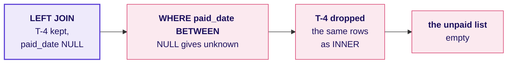
```mermaid
flowchart LR
    L["<b>LEFT JOIN</b><br/>T-4 kept,<br/>paid_date NULL"] --> W["<b>WHERE paid_date BETWEEN</b><br/>NULL gives unknown"]
    W --> D["<b>T-4 dropped</b><br/>the same rows<br/>as INNER"]
    D --> E["<b>the unpaid list</b><br/>empty"]
    classDef bad fill:#FBE9EF,stroke:#D63A6A,color:#1A0F5C
    classDef known fill:#EEEAFB,stroke:#5B3FD6,color:#1A0F5C,stroke-width:2px
    class L known
    class W,D,E bad
```

`NULL BETWEEN` two dates is unknown, and WHERE keeps only rows that are true, so T-4 is thrown away after the join kept it. **The check that catches it.** The list's total must equal its bar, 0 against 800; the join's rows, 6 where the LEFT JOIN returns 7, point at the same fault.

```notes
LIVE, 3 minutes. A condition on the right-hand table in the WHERE clause turns the LEFT JOIN into an
INNER one without a word, and the anti-join condition after it can never be met. This is SQL's
three-valued logic: true, false and unknown.
```

---

## S64. The fix: the condition goes in ON
*Where does a condition on the payments table belong, and what does moving it change?*

```sql
SELECT o.order_id, o.amount AS booked
FROM tiny_orders o
LEFT JOIN tiny_payments p
       ON p.order_id = o.order_id
      AND p.paid_date BETWEEN '2026-07-01' AND '2026-09-30'
WHERE p.order_id IS NULL;
```

| The date condition | Rows after the join | Orders on the unpaid list |
|---|---|---|
| in WHERE | 6 | none |
| in ON | 7 | T-4, 800 |

**What changed.** Moving one line changed the whole list. ON decides which payment rows count as a match, before the join; WHERE decides which joined rows survive, after it.

```notes
LIVE, 3 minutes. The PostgreSQL manual says a restriction in ON is processed before the join and a
restriction in WHERE after it, and that the difference matters a lot with outer joins (PostgreSQL 16
documentation, section 7.2.1.1, Joined Tables, checked 1 Oct 2026). The rule to keep: in a LEFT JOIN, a
condition on the right-hand table goes in ON, and the one right-table condition that belongs in
WHERE is the anti-join's IS NULL.
```

---

## S65. Question: are two payment rows a double payment?
*Which orders does HAVING COUNT(*) > 1 flag, and are they double-paid?*

**The plausible wrong answer.** For the double-paid list, a teammate reaches for Monday's tool: group Q2's payments by order and keep the orders with more than one row.

```sql
SELECT o.order_id, count(*) AS payment_rows
FROM orders o
JOIN payments p ON p.order_id = o.order_id
WHERE o.quarter = 'Q2'
GROUP BY o.order_id
HAVING count(*) > 1;
```

**Question.** Anand will ask the payments team to reverse the second payment on every order it returns. How long is the list? a) a handful of small card payments; b) 216 orders, including every one of Q2's ten largest invoices; c) no rows, since payment ids are unique; d) all 462 Q2 orders.

```notes
LIVE, 2 minutes. HAVING filters groups after GROUP BY, as Monday taught. Take letters.
```

---

## S66. Answer: 216 orders, the ten largest among them
*What exactly does the order-level list flag, and why is it wrong?*

```stats
value: 216 | label: Q2 orders flagged | note: more than one payment row each
value: 10 of 10 | label: largest Q2 orders on it | note: all paid in instalments 1 and 2
value: 2,300 | label: surplus it claims, invented | note: against a posted-twice bar of 1,500
```

The answer is b. **Why it is wrong.** Two payment rows can be two instalments or one payment posted twice, and a count of rows cannot tell them apart. **The check.** The list's surplus must equal the posted-twice bar, and on the invented tables it claims 2,300 against 1,500.

```notes
LIVE, 3 minutes. This is the chapter's second trap: the curriculum's own method, used on this data,
is a plausible wrong list. A note to reverse the second payment on all 216 would reverse real
second instalments on Kalpa's largest business invoices and put a call to every corporate buyer who
paid on time. On the invented tables T-2's second row is its second instalment, real cash; T-3's is
the retry.
```

---

## S67. The fix: a retry is one instalment, twice
*What makes a retry a retry, and does the fixed list match its bar?*

```sql
SELECT p.order_id, p.instalment_no,
       count(*) AS times_posted,
       sum(p.amount) - max(p.amount)
         AS posted_twice
FROM tiny_payments p
JOIN tiny_orders o
  ON o.order_id = p.order_id
GROUP BY p.order_id, p.instalment_no
HAVING count(*) > 1;
```

| Pattern of payment rows | What it is | Which list |
|---|---|---|
| instalment 1 only | paid once, in full | neither |
| instalments 1 and 2 | paid in two parts | neither |
| instalment 1, twice | a gateway retry | double-paid |

**The check.** The fixed list is T-3's instalment 1, 1,500 posted beyond one payment, which is the bar exactly; T-2 left the list.

```notes
LIVE, 3 minutes. The grain of a double payment is the order and the instalment. Each learner builds
Kalpa's double-paid list, and the list of payments that match no order, in the notebook's your-turn
cell; the check after it confirms the double-paid list matches its bar and that every one of the
1,428 payment rows is accounted for, without printing a figure.
```

---

## S68. A second route: two other ways to the lists
*Do a second method and a second list reach the same orders?*

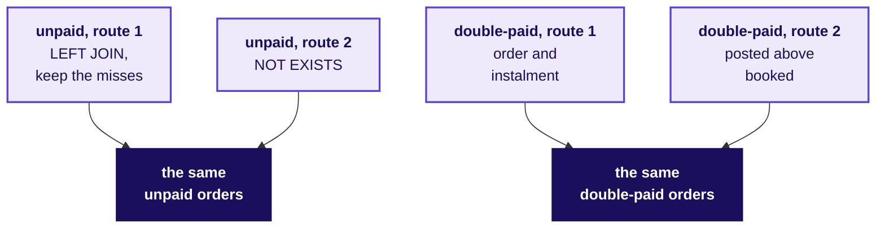
```mermaid
flowchart TB
    U1["<b>unpaid, route 1</b><br/>LEFT JOIN,<br/>keep the misses"] --> U["<b>the same<br/>unpaid orders</b>"]
    U2["<b>unpaid, route 2</b><br/>NOT EXISTS"] --> U
    D1["<b>double-paid, route 1</b><br/>order and<br/>instalment"] --> D["<b>the same<br/>double-paid orders</b>"]
    D2["<b>double-paid, route 2</b><br/>posted above<br/>booked"] --> D
    classDef known fill:#EEEAFB,stroke:#5B3FD6,color:#1A0F5C,stroke-width:2px
    classDef bet fill:#1A0F5C,stroke:#1A0F5C,color:#FFFFFF
    class U1,U2,D1,D2 known
    class U,D bet
```

NOT EXISTS never builds the joined rows. The second double-paid route never reads an instalment number: an order whose posted cash exceeds its booking was paid more than once. **The check.** Both routes agree with the first, on the invented tables and on Kalpa's Q2.

```notes
LIVE, 2 minutes. The instalment method would miss a retry the feed wrote under a new instalment
number, and the booked method would miss a retry on an order paid short; when both find the same
orders, neither gap is in the data. Interview [F]: how do you find orders with no payment?
```

---

## S69. Chapter 4, answered in six lines
*What did chapter 4 answer, and what question does it leave?*

| Question | The answer, with its number |
|---|---|
| No payment? | An anti-join: T-4 at 800 on the invented tables, the bar exactly |
| Paid in Q2? | In WHERE, the join shrinks to 6 rows and the list comes back empty |
| Where does it go? | In ON: 7 rows, and T-4 is back |
| Two rows? | 216 Q2 orders, the ten largest invoices among them: instalments too |
| A retry is? | One order and instalment posted twice: T-3's 1,500, the bar |
| A second list? | NOT EXISTS and posted above booked reach the same orders |

**Kavya's review.** "Two payment rows are not a double payment. Show me what makes a retry a retry before anyone rings a customer, and show me that each list adds up to its bar."

```notes
LIVE, 1 minute. The question this leaves: Anand has the bridge and its two lists. What goes on the
one page he signs, by channel, and does its gap column tell the truth? That is chapter 5.
```

---
## SECTION 5: What does Anand sign?
*What goes on the report by channel that Anand signs, and does its gap column tell the truth?*

```notes
LIVE. Chapter 5 runs 30 minutes: the map, the need and Infosys (4), the four forms and the call (5),
the lines by channel (3), the gap-column trap, its check and fix (10), the page against the bridge
(4), the second route and refunds (3), the close and the sentence (1). Notebook 5,
C2_W02_D02_05_what_anand_signs_STUDENT.ipynb.
```

---

## S70. Answer in six steps, from lists to a page
*Who needs chapter 5's answer, and which smaller questions lead to it?*

**Who needs the answer.** Anand, who signs the report and sends it on to the CEO's Monday page, and the channel heads, who chase their own unpaid orders from it. A gap column that reads zero stands every one of them down, and a report that does not add back to the bridge cannot be defended when his analyst audits it.

```timeline
label: 1 | title: A line carries? | body: What each channel's line needs before Anand signs.
label: 2 | title: Which form? | body: Four report forms for a finance controller.
label: 3 | title: The gap column? | body: What it says when each order's gap is added up.
label: 4 | title: Why wrong? | body: And the check that catches it.
label: 5 | title: Adds back? | body: The fixed page against the bridge on Q2.
label: 6 | title: Same gap? | body: The unpaid list, grouped by channel. | tone: dark
```

```notes
LIVE, 1 minute. The metric is booked, collected and the gap between them by channel: app, store and
web. The gap is booked less collected, order by order, and it must add up to the bridge's
never-paid and paid-short bars.
```

---

## S71. The page becomes Anand's figure
*What does Anand need on the page before he signs it?*

```cards
icon: layout-grid | eyebrow: By channel | title: Who chases | body: The store, app and web teams each chase their own customers, so the gap is split three ways.
icon: list | eyebrow: By order | title: Whom to chase | body: A channel total cannot be chased; the orders behind the gap can.
icon: file-check | eyebrow: The proof | title: Above the number | body: His analyst audits the page, so the reconciliation sits above the table. | tone: dark
```

A report that says nothing is outstanding closes the question for everyone who reads it.

```notes
LIVE, 1 minute. Anand signs the report and it goes to Meera Raghavan's Monday page, so every figure on
it becomes his figure. In the retail dossier's terms, the finance controller's cost of a wrong number
is a figure restated in front of the board (section 4).
```

---

## S72. Infosys publishes its gap every quarter
*Which real company reports the gap between billed and collected, and how is it measured?*

```stats
value: 63 days | label: days sales outstanding | note: quarter ended 30 June 2026
value: 67 days | label: at 31 March 2026 | note: the quarter before
value: 70 days | label: a year earlier | note: on the last twelve months' revenue
```

Days sales outstanding is money owed by customers divided by revenue per day. A finance team that publishes a collections figure every quarter answers for it, which is Anand's position when he signs.

```notes
LIVE, 2 minutes. Source: the Infosys fact sheet, Exhibit 99.4 to the Form 6-K furnished to the US SEC
on 28 July 2026, checked 1 Oct 2026; URL in the provenance. The retail dossier carries the same idea for Kalpa as days
of receivables: money owed by customers and payment partners over net revenue per day (section 3).
```

---

## S73. Four report forms, sized on Q2
*Which of four report forms fits a finance controller, and what does each cost him to read?*

| Form | Lines Anand reads, before any list | He can act on | He can audit |
|---|---|---|---|
| A. One number: the total gap | 1 | nothing: no channel, no order | nothing |
| B. A table by channel | 4 | which channel to chase | the totals, against booked |
| C. B, the reconciliation above it, the two lists beneath | 8, then the lists | which channel, and which orders | every figure, back to the bridge |
| D. The whole statement, one line per order | 462 | anything, once found | everything, if read |

**Sized.** The forms differ in what they ask of the reader, from one line to 462.

```notes
LIVE, 2 minutes. The notebook's sizing cell counts the lines each form puts in front of Anand on
Kalpa's Q2: three channels and a total, four reconciliation lines, and 462 orders.
```

---

## S74. The call: by channel, reconciled, with the lists
*Which form fits, and what fact would change the call?*

```mermaid
flowchart LR
    D["<b>1. definition</b><br/>collected: cash,<br/>each payment once"] --> R["<b>2. reconciliation</b><br/>rows in,<br/>rows out"]
    R --> T["<b>3. by channel</b><br/>booked, collected,<br/>gap"]
    T --> L["<b>4. the two lists</b><br/>unpaid,<br/>posted twice"]
    classDef known fill:#EEEAFB,stroke:#5B3FD6,color:#1A0F5C,stroke-width:2px
    classDef bet fill:#1A0F5C,stroke:#1A0F5C,color:#FFFFFF
    class D,R,L known
    class T bet
```

**The fact that would change the call.** At the quarter's close, when auditors ask for evidence order by order, the whole statement travels with the signed page as an appendix file; the page itself stays C.

```notes
LIVE, 2 minutes. C is the smallest page on which Anand can both act, by channel and by order, and
audit, since every figure ties back to the bridge. A alone hides where the gap sits; B tells the store
team to chase without telling them whom; D answers everything and asks Anand to find it in 462 lines.
```

---

## S75. Question: which channel books 1,800?
*What must a line per channel carry for Anand to sign it?*

```mermaid
flowchart LR
    O["<b>one row per order</b><br/>booked, collected"] --> G["<b>GROUP BY channel</b>"]
    G --> L["<b>one line per channel</b><br/>orders, booked,<br/>collected, gap"]
    classDef known fill:#EEEAFB,stroke:#5B3FD6,color:#1A0F5C,stroke-width:2px
    class O,G,L known
```

**Question.** On the invented tables, which channel carries booked of 1,800? a) web; b) store; c) app; d) none, every channel books 2,000.

```notes
LIVE, 1 minute. The report is built from chapter 3's table of one row per order, grouped by channel,
under a definition line: collected is cash received against Q2 orders, each payment counted once;
posted twice and refunds are shown separately. Take letters.
```

---

## S76. Answer: app books 1,800, and Kalpa's channels add up
*What does each channel book, and do the channels add back to Monday's figure?*

```stats
value: Rs 4,25,90,270 | label: app booked | note: 153 Q2 orders
value: Rs 3,21,48,730 | label: store booked | note: 159 Q2 orders
value: Rs 2,36,61,000 | label: web booked | note: 150 Q2 orders
value: Rs 9,84,00,000 | label: together | note: Monday's figure, 462 orders
```

The answer is c: app books T-1's 1,000 and T-4's 800 and collects 1,000, while web and store each book 2,000 and collect it. **The check.** Kalpa's three channels add to Rs 9,84,00,000.

```notes
LIVE, 2 minutes. Booked by channel comes from orders alone, so it can be printed and checked by
anyone. Collected by channel is each learner's own figure from the page they build at level 5.
```

---

## S77. Question: what does the gap column say?
*What does the gap column say when each order's gap is added up?*

**The plausible wrong answer.** Anand asked "order by order", so a teammate computes each order's gap, booked less collected, and adds the gaps up by channel.

```sql
SELECT channel, count(*) AS orders, sum(booked) AS booked,
       sum(collected) AS collected, sum(booked - collected) AS gap
FROM per_order
GROUP BY channel;
```

**Question.** On the invented tables, what does the gap column say for app? a) 800; b) 0; c) NULL; d) 1,800.

```notes
LIVE, 2 minutes. per_order is chapter 3's table: one row per Q2 order with booked, collected and
posted. Take letters.
```

---

## S78. Answer: a gap of 0 on every channel
*What exactly does the hurried gap column report?*

| channel | orders | booked | collected | gap, as reported |
|---|---|---|---|---|
| app | 2 | 1,800 | 1,000 | 0 |
| store | 2 | 2,000 | 2,000 | 0 |
| web | 1 | 2,000 | 2,000 | 0 |

The answer is b: 0 for app, and 0 for every channel, on the invented tables and on Kalpa's Q2 alike. Read as it stands, Kalpa collected every rupee it booked, and Anand signs a page that stands his collections team down.

```notes
LIVE, 1 minute. Say the wrong output exactly: Rs 0 on every channel. The notebook runs the same query
on Kalpa's Q2 and prints the three zeros. This is the chapter's trap.
```

---

## S79. Why it is wrong: NULL leaves the sum
*Why does an unpaid order drop out of the gap, and which check catches it?*

```mermaid
flowchart LR
    T["<b>T-4</b><br/>booked 800"] --> C["<b>collected</b><br/>NULL,<br/>never paid"]
    C --> G["<b>booked - collected</b><br/>NULL"]
    G --> S["<b>sum()</b><br/>skips it"]
    classDef known fill:#EEEAFB,stroke:#5B3FD6,color:#1A0F5C,stroke-width:2px
    classDef unknown fill:#FFFFFF,stroke:#B8B2D6,color:#6B6690,stroke-dasharray:4 3
    classDef bad fill:#FBE9EF,stroke:#D63A6A,color:#1A0F5C
    class T known
    class C unknown
    class G,S bad
```

`booked - NULL` is NULL, and `sum()` skips NULLs without saying so, the way Monday's AVG skipped them. **The check that catches it.** The gap column must equal booked less collected as two separate sums, 1,800 less 1,000 is 800 against a column saying 0, and no order may reach the report with a NULL gap.

```notes
LIVE, 3 minutes. The unpaid orders, the very orders the gap exists to show, drop out of the gap, and
since every paid order at Kalpa was paid in full, what remains adds to zero. Each column summed on
its own is handled correctly, which is why the two-sums check works.
```

---

## S80. The fix: say on purpose that unpaid means zero
*What does coalesce change, and does the fixed gap agree with the bridge?*

```sql
sum(booked - coalesce(collected, 0)) AS gap
```

```mermaid
flowchart LR
    A["<b>gap, as reported</b><br/>0"] --> B["<b>T-4 back in</b><br/>app, plus 800"]
    B --> C["<b>gap, fixed</b><br/>800"]
    classDef bad fill:#FBE9EF,stroke:#D63A6A,color:#1A0F5C
    classDef bet fill:#1A0F5C,stroke:#1A0F5C,color:#FFFFFF
    class A bad
    class C bet
```

**What changed.** `coalesce(collected, 0)` says that an order with no payment collected nothing, so its gap is its whole booked amount: app's gap becomes 800, T-4, and the page agrees with the bridge's never-paid bar.

```notes
LIVE, 3 minutes. coalesce returns its first argument that is not NULL, and Monday met it in its NULL
trap. The decision it writes into the query is a business one: what does a missing collected figure
mean? Here, nothing paid.
```

---

## S81. The page Anand signs adds back to the bridge
*Does the fixed report add back to the bridge on Kalpa's Q2?*

| The check on Kalpa's Q2 page | Result |
|---|---|
| The page's orders add to Q2's 462 | PASS, 462 |
| The page's booked adds to Monday's figure | PASS, Rs 9,84,00,000 |
| The page's gaps add to never paid plus paid short | PASS, equal to the rupee |
| The page's posted twice adds to its bar | PASS, equal to the rupee |

Each learner builds the page in the notebook, with the share collected, the orders never paid and the amount posted twice beside each channel's gap, and reads its figures there.

```notes
LIVE, 4 minutes. The four checks print PASS without the figures, since the gap and the lists are the
room's to find. Walk the room while they build the page in the empty your-turn cell of notebook 5,
and ask two learners to read their own gap by channel aloud.
```

---

## S82. A second route: the unpaid list by channel
*Does the unpaid list, grouped by channel, give the same gap?*

```mermaid
flowchart LR
    P["<b>route 1: the page</b><br/>sum of each order's gap,<br/>with coalesce"] --> C["<b>channel for channel</b><br/>equal"]
    U["<b>route 2: NOT EXISTS</b><br/>the unpaid list,<br/>grouped by channel"] --> C
    classDef known fill:#EEEAFB,stroke:#5B3FD6,color:#1A0F5C,stroke-width:2px
    classDef bet fill:#1A0F5C,stroke:#1A0F5C,color:#FFFFFF
    class P,U known
    class C bet
```

The second route never computes a per-order gap, so a NULL cannot fall out of it. **The check.** The two routes agree on every channel, on the invented tables (app 800, web 0, store 0) and on Kalpa's Q2. Every refund row in the warehouse sits on a Q1 order, so the Q2 page says so in one line.

```notes
LIVE, 3 minutes. Nothing on Kalpa's Q2 was paid short, so the gap by channel must equal the unpaid
list by channel. The refunds line answers the one part of Anand's message the page has not touched.
Interview [F]: why does the page show booked and collected, and not only the gap? Because the gap
cannot be checked on its own.
```

---

## S83. Chapter 5, answered in six lines
*What did chapter 5 answer, and what question does it leave?*

| Question | The answer, with its number |
|---|---|
| A line carries? | Orders, booked, collected and the gap, under a definition line |
| Which form? | By channel, reconciled above, with both lists beneath |
| The gap column? | 0 on every channel, invented and Kalpa alike |
| Why wrong? | An unpaid order's gap is NULL and sum() skips it; coalesce fixes it |
| Adds back? | Yes: 462 orders, Rs 9,84,00,000, and each gap and list equal to its bar |
| Same gap? | Yes: the unpaid list by channel matches every channel |

**Kavya's review.** "Every rupee on the page ties back to a bar, and every bar to a list. Write the definition of collected above the table, so nobody reads it as posted."

```notes
LIVE, 1 minute. The page ends on one sentence each learner writes from their own figures: "Q2 booked
Rs 9,84,00,000 and collected Rs ___, each payment counted once; the gap of Rs ___ is ___ orders
nobody has paid, listed by channel; separately, Rs ___ was posted twice and ___ payments match no
order, and both lists go to the platform lead." The question this leaves: the page is right today,
so what must pass every Monday before the number leaves? That opens the afternoon.
```
