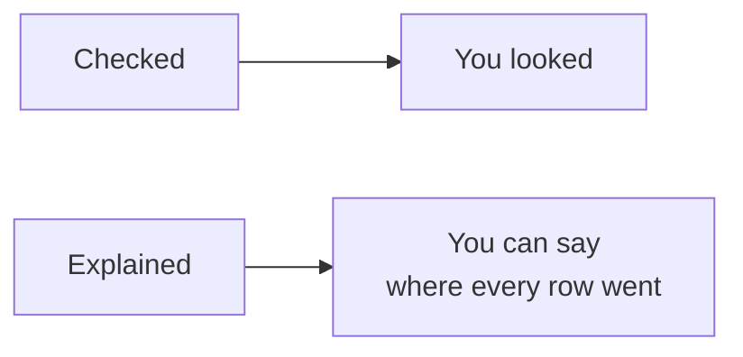
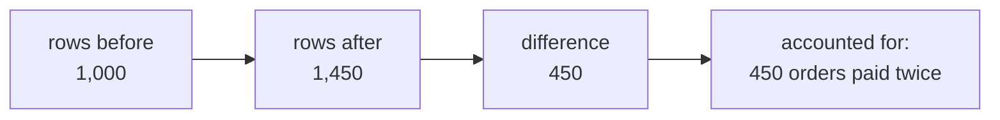
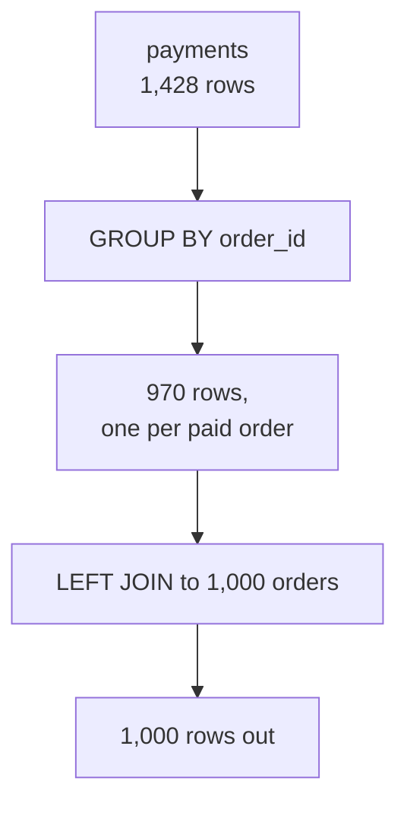
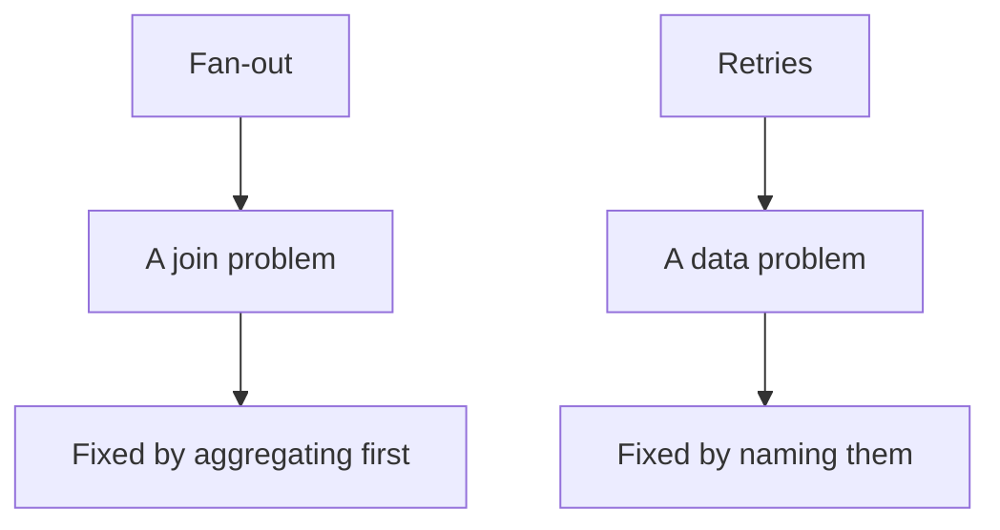
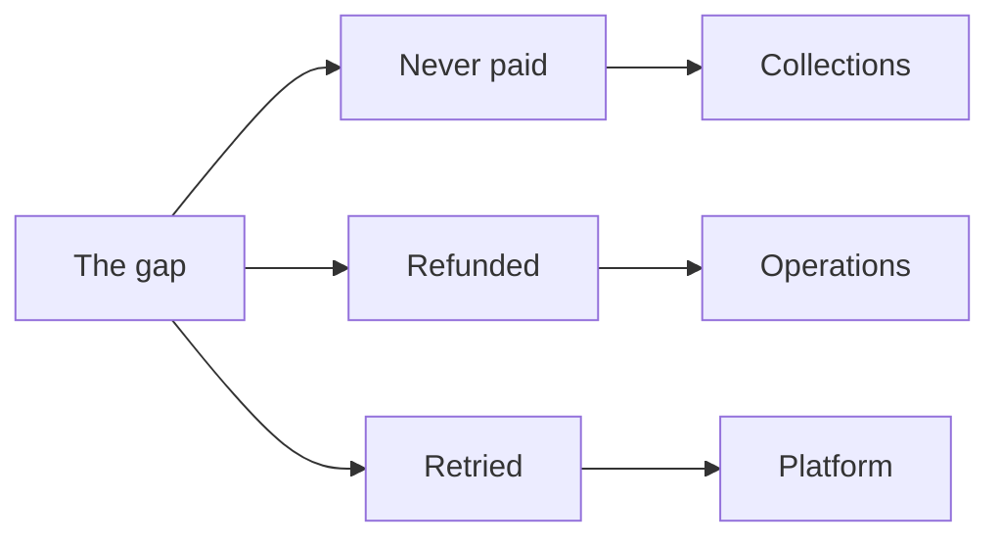
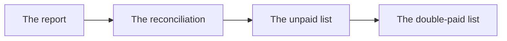

# Half two: the count reconciliation, and the report you sign

Week 2, Day 2. Slide source. One idea per slide.

Position bar, repeated at every section boundary:
`[the habit] > [the bridge] > [the gap] > [the report]`

---

## SECTION E. The habit that catches it

---

## S1. A join is only done when its row count is explained

Not checked. Explained.

Rows before, rows after, and a sentence accounting for the difference. If you cannot write that
sentence, you do not yet know what your join did.

---

## S2. The three numbers, every time


---

## S3. Written as a comment block above the query
```sql
-- Rows before: 1,000 orders.
-- Rows after:  1,450.
-- Difference:  450 orders carry two payment rows, of which 400 are two-instalment
--              invoices and 50 are gateway retries. 30 orders carry none.
-- Therefore:   do not SUM the order amount over this join.
```
The last line is the one that saves somebody.

---

## S4. The same habit you used last Wednesday
Last week you reconciled a dashboard's Rs 2.10 crore against Finance's Rs 1.90 crore by counting
duplicated rows.

This is that habit, one tool later. The tool changed. The discipline did not.

---

## SECTION F. Getting the real number

---

## S5. Aggregate first, then join
```sql
WITH paid AS (
    SELECT order_id, sum(amount) AS collected
    FROM   payments
    GROUP  BY order_id
)
SELECT sum(o.amount) AS booked, sum(p.collected) AS collected
FROM   orders o
LEFT JOIN paid p ON p.order_id = o.order_id;
```
Collapse the many side to one row per key **before** joining. Then no fan-out is possible.

---

## S6. Why that works, drawn

One row in, one row out. The count check now passes by construction.

---

## S7. The retries are still in there

Aggregating first fixes the fan-out. It does not fix the data.

The fifty gateway retries posted a real second row, so `sum(amount)` over `payments` still counts
them. That is a different problem with a different fix, and confusing the two is common.

---

## S8. Finding the double posts
```sql
SELECT order_id, count(*), sum(amount)
FROM   payments
GROUP  BY order_id
HAVING count(*) > 1
   AND count(DISTINCT amount) = 1;
```
Two rows for the same order carrying the identical amount is a retry. Two rows carrying different
amounts is an instalment plan, which is correct.

---

## D1. Why that distinction cannot be automated away
An instalment and a retry look almost identical in the table. What separates them is a business
fact: an instalment plan splits an invoice, a retry repeats a charge.

A rule that deletes every duplicate payment would delete four hundred legitimate instalments. The
judgment is yours, and it has to be stated in writing.

---

## SECTION G. The gap Anand asked about

---

## S9. Booked minus collected, by channel
```sql
WITH paid AS (SELECT order_id, sum(amount) collected
              FROM payments GROUP BY order_id)
SELECT o.channel,
       sum(o.amount)                        AS booked,
       coalesce(sum(p.collected), 0)        AS collected,
       sum(o.amount) - coalesce(sum(p.collected), 0) AS gap
FROM   orders o
LEFT JOIN paid p ON p.order_id = o.order_id
WHERE  o.quarter = 'Q2'
GROUP  BY o.channel
ORDER  BY gap DESC;
```

---

## S10. `coalesce` is doing real work there
An order with no payment joins to NULL, and NULL in an arithmetic expression makes the whole
expression NULL.

Without `coalesce`, one unpaid order turns a channel's entire gap into an empty cell, and an empty
cell reads as "no problem here".

---

## S11. What the gap is made of

| Cause | Shape in the data |
|---|---|
| Never paid | 30 delivered orders with no payment row |
| Refunded | A row in `refunds`, negative amount |
| Retried | Two identical payment rows, which inflates rather than gaps |

Three different business situations. One number unless you split them.

---

## D2. Anand will ask which of the three, and he asks today
A gap number on its own starts a meeting. A gap number split three ways ends one, because each
part has a different owner: unpaid is collections, refunded is operations, retried is the
platform team.

Splitting it is not extra work. It is the difference between reporting and being useful.

---

## SECTION H. The report

---

## S12. What you hand over

| Piece | What it is |
|---|---|
| The report | Booked, collected and gap by channel for Q2 |
| The reconciliation | The comment block: before, after, difference, therefore |
| The unpaid list | 30 order ids, with channel and amount |
| The double-paid list | The 50 retries, separated from the 400 instalments |

---

## S13. And the sentence that goes with it
> "Collected is Rs X against Rs Y booked for Q2. The gap is three things and I have split them:
> thirty orders never paid, the refunds, and fifty gateway retries that inflate rather than
> reduce. The join was validated on row count before any total was taken."

The last clause is the one that gets the number used.

---

## S14. What today equipped you to answer
> [S] INNER against LEFT join: what does each drop or keep?
> [S] Your join grew the row count; name the cause and the check.
> [F] How do you find orders with no payment?
> [F] Revenue doubled after a join and every row looks fine; where do you look?
> [D] Design the validation you run before a joined number reaches Finance, and say what you do
> when it fails at 5 pm on reporting day.

---

## S15. Tomorrow
Marketing wants the top fifty members per segment, and the head of Retail-Plus has an opinion
about ties.
