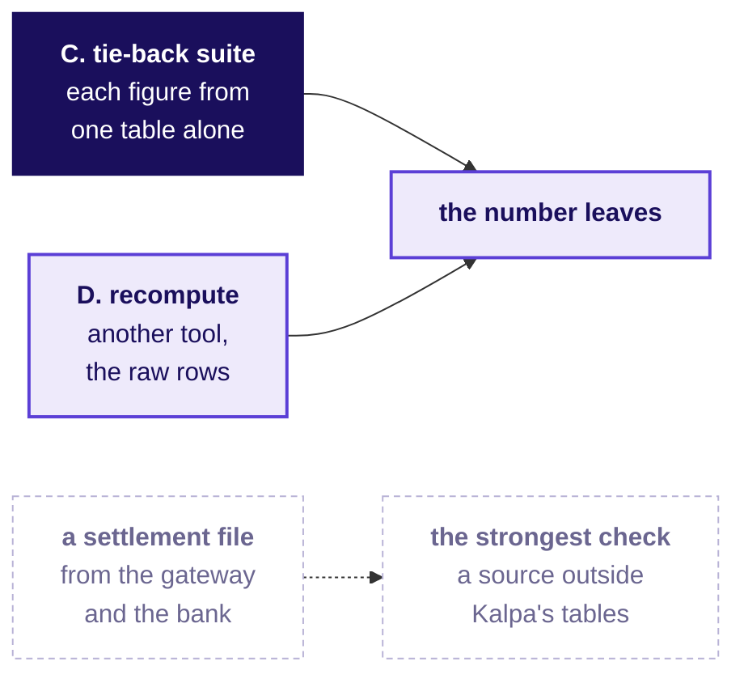
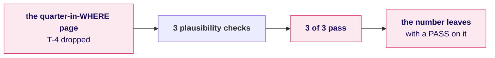
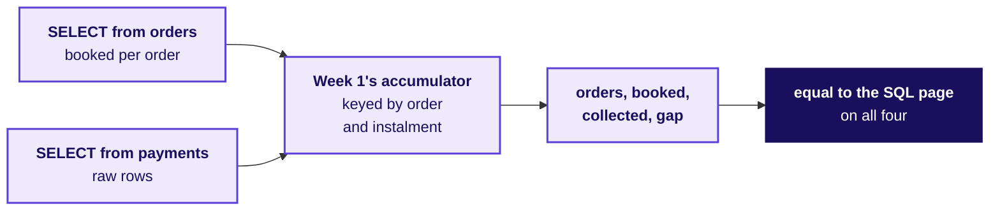
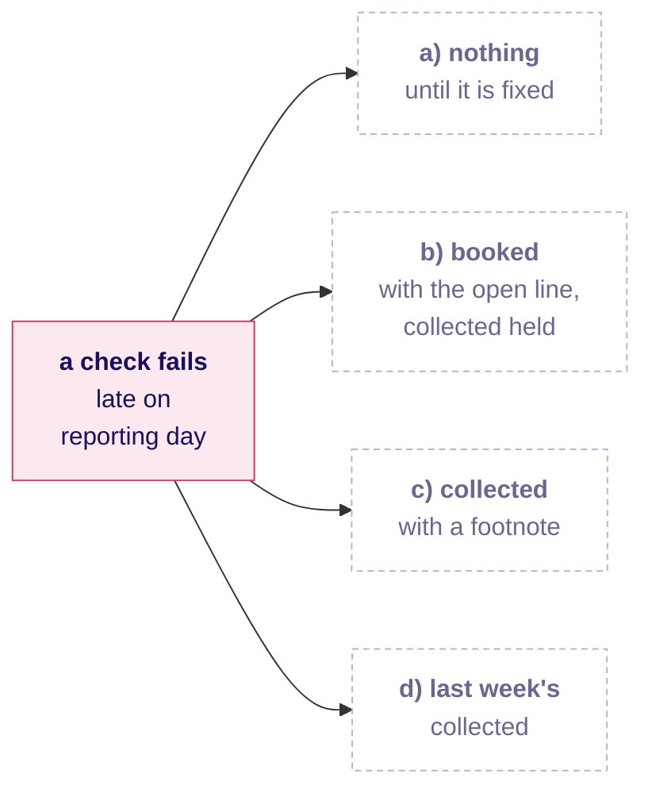
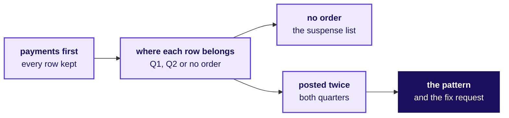
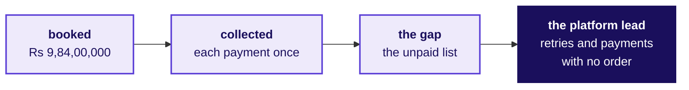
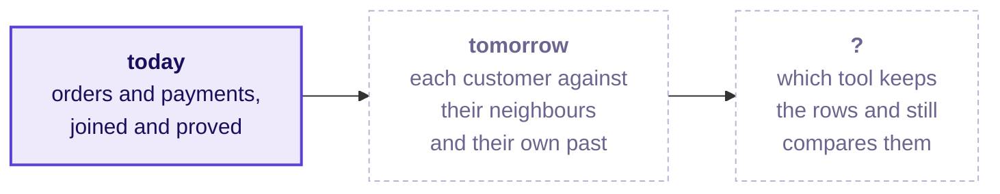

# Can the collected number leave the team?

Week 2, Day 2. Afternoon.

Kicker: WEEK 2  ·  TUESDAY  ·  AFTERNOON
Quote: If there is a gap, I want to know which orders and which channel.
Who: Anand Iyer, finance controller, Kalpa Retail, in the message that opened the day

```notes
LIVE, one minute. The trainer keeps the afternoon's first 60 minutes: chapter 6 (30), the escalated
case's first two parts (20), and the Kahoot with tomorrow's question (10).
The tentative IITGN faculty block W2-2 takes the last 120 minutes.
The rest of the escalated case, the second case and
the interview drill move to the TA-led practice lab and the take-home; their slides are marked D so
a learner can work them alone.
Transition: one slide of what the morning settled, then chapter 6.
```

---

## S1. Five answers the morning reached, with numbers
*What did chapters 1 to 5 settle before the number can leave?*

| Chapter | What it settled |
|---|---|
| 1. What does a join keep? | LEFT JOIN with orders first keeps every booked order; on five invented orders INNER returns 6 rows, LEFT 7, RIGHT 7, FULL 8 |
| 2. Why twice the bookings? | A fan-out: the first draft reported Rs 19,29,04,410 against Rs 9,84,00,000 booked; payments go to one row per order before the join |
| 3. Is every order there? | Rows in 462, rows out 462; a plain JOIN drops the unpaid order, and the bridge names every rupee from booked to posted |
| 4. Which orders, exactly? | The unpaid list is an anti-join; a date filter in WHERE empties it; a retry is one order and instalment posted twice |
| 5. What does Anand sign? | The page by channel, reconciled, with both lists; `coalesce` keeps an unpaid order in the gap |

```notes
LIVE, 1 minute. Read the five lines as the room's own findings; each learner's collected figure,
gap and lists are on their own page from chapter 5. Five wrong pages appeared on the way, each
plausible: chapter 2's fan-out draft, chapter 3's plain JOIN draft and its LEFT JOIN that still read
posted as collected, chapter 4's quarter in WHERE, and chapter 5's gap added up order by order.
Chapter 6 builds the checks that stop all five, every Monday.
```

---

## S1b. Five orders and seven payments, every row checkable by hand
*Which invented tables does chapter 6 test its checks on?*

| order_id | channel | amount | What happened to it |
|---|---|---|---|
| T-1 | app | 1,000 | Paid once, in full (P-1) |
| T-2 | web | 2,000 | Paid in two instalments, 1,200 and 800 (P-2, P-3) |
| T-3 | store | 1,500 | Paid once, and the gateway posted that payment twice (P-4, P-5) |
| T-4 | app | 800 | Never paid |
| T-5 | store | 500 | Paid once, in full (P-6) |

P-7 is a payment of 600 against T-9, an order the orders table does not hold. Booked is 5,800; collected, each payment counted once, is 5,000; the feed posted 6,500 against these five orders; the gap is 800, which is T-4.

```notes
LIVE, folded into the minute of S1. These are chapter 1's tables, the ones every chapter traced by
hand; the afternoon's wrong pages are all written on them.
```

---

## SECTION 6: Can the number leave?
*Which checks must pass before the collected number leaves the team, and what does Anand get when one fails at the end of reporting day?*

```notes
LIVE. Chapter 6 runs 30 minutes with the cover and the morning's five answers (2): the map, the need
and Wirecard (4), the four ways and the call (4), the hurried checks and why they pass (6), the
tie-back suite on one report and on all five (7), Kalpa's report (1), the second route (2), the
reporting-day rule (3), the close (1). Notebook 6,
C2_W02_D02_06_can_it_leave_STUDENT.ipynb.
```

---

## S2. Answer in six steps, from a PASS to a rule
*Who needs chapter 6's answer, and which smaller questions lead to it?*

**Who needs the answer.** Kavya Nair, the team's senior analyst, who reviews every number before it leaves the team; Anand, who forwards it to the CEO's Monday page; and you, who sign it. A validation that cannot fail puts a PASS stamp on a wrong number, and a stamped wrong number is harder to withdraw than an unstamped one.

```timeline
label: 1 | title: Can hurried checks miss an order? | body: Three plausibility checks on a page that hides one.
label: 2 | title: Which checks tie to the tables? | body: Five checks, each read from one table alone.
label: 3 | title: Does the suite stop all five? | body: The day's five wrong reports, one by one.
label: 4 | title: Does Kalpa's Q2 page pass? | body: The suite on the real page.
label: 5 | title: Does Python reach the same? | body: The same numbers from the raw rows.
label: 6 | title: What leaves when a check fails? | body: What Anand gets late on reporting day. | tone: dark
```

```notes
LIVE, 1 minute. The metric is the collected figure and its gap, every Monday, and the checks that
stand between them and Anand: which of the day's wrong reports each check would stop.
```

---

## S3. A PASS on a wrong number is forwarded with more trust
*What does a PASS stamp cost when the check behind it could not fail?*

```cards
icon: calendar-clock | eyebrow: Every Monday | title: Whoever is on the rota | body: The number is refreshed weekly, sometimes late on reporting day, by whoever runs it that week.
icon: shield-check | eyebrow: What checks buy | title: No line-by-line read | body: Checks let a number leave without Kavya reading every query.
icon: triangle-alert | eyebrow: A check that cannot fail | title: Worse than none | body: The PASS line travels with the number, and Anand forwards it with more confidence than an unchecked one. | tone: dark
```

```notes
LIVE, 1 minute. Say it plainly: a check is worth only its power to fail. Ask the room for a check in
their own work that has never failed, and what that proves.
```

---

## S4. Wirecard reported cash it did not have
*Which real company's checks read its own records back to it?*

```timeline
label: 2016 to 2018 | title: The check that could not fail | body: EY had not checked directly with Singapore's OCBC Bank and relied on documents and screenshots from a trustee and from Wirecard itself, the FT reported. | tone: dark
label: 18 June 2020 | title: No sign-off | body: EY refused to sign off on the accounts, saying it was unable to confirm the money existed.
label: 22 June 2020 | title: 1.9 billion euros | body: Wirecard said there was "a prevailing likelihood" that its trust account balances did not exist.
label: 25 June 2020 | title: Insolvency | body: Wirecard filed for insolvency.
```

```notes
LIVE, 2 minutes. Sources: BBC News, 18, 22 and 25 June 2020; the FT's report republished by the
Irish Times on 26 June 2020, attributed to people with first-hand knowledge; all checked 1 Oct 2026,
URLs in the provenance. Wirecard claimed up to 1 billion euros in cash at OCBC; the 1.9 billion was
later said to sit in banks in the Philippines. The point for the day: every check this chapter
builds reads Kalpa's own tables, so name what they cannot see.
```

---

## S5. Four ways to validate, sized on five wrong reports
*Which of four ways to validate stops the day's wrong reports, and what does each cost?*

| Option | What it does | Wrong reports it stops, of 5 | Time on Kalpa's Q2 |
|---|---|---|---|
| A. Read the report | A person looks at the page | depends on the reader | minutes of a person |
| B. Plausibility checks | Collected at most booked, no negative gap, every channel present | 3 | milliseconds, the report alone |
| C. Tie-back checks | Every figure recomputed from one table alone and compared | 5 | milliseconds, report and sources |
| D. An independent recomputation | The same figures from the raw rows by another tool | 5 | milliseconds, the raw rows |

**The five wrong pages.** Chapter 2's fan-out draft, chapter 3's plain JOIN draft and its LEFT JOIN that still read posted as collected, chapter 4's quarter in WHERE, and chapter 5's gap summed order by order, each written on the invented tables.

```notes
LIVE, 2 minutes. A is not sized, since what it catches depends on who reads. B costs the same as C
and stops three pages in five; which two it misses is S12's question, so do not say. Hold the call
for the next slide.
```

---

## S6. The call: tie-back, with a recompute beside it
*Which way fits, and what fact would change the call?*


```mermaid
flowchart LR
    C["<b>C. tie-back suite</b><br/>each figure from<br/>one table alone"] --> N["<b>the number leaves</b>"]
    D["<b>D. recompute</b><br/>another tool,<br/>the raw rows"] --> N
    S["<b>a settlement file</b><br/>from the gateway<br/>and the bank"] -.-> X["<b>the strongest check</b><br/>a source outside<br/>Kalpa's tables"]
    classDef bet fill:#1A0F5C,stroke:#1A0F5C,color:#FFFFFF
    classDef known fill:#EEEAFB,stroke:#5B3FD6,color:#1A0F5C,stroke-width:2px
    classDef unknown fill:#FFFFFF,stroke:#B8B2D6,color:#6B6690,stroke-dasharray:4 3
    class C bet
    class D,N known
    class S,X unknown
```

**The fact that would change the call.** A settlement file from the gateway, the list of what reached Kalpa's bank, would be a source outside Kalpa's own tables, and reconciling to it would become the strongest check of all.

```notes
LIVE, 2 minutes. Each tie-back check compares a figure on the report with the same figure computed
from one table alone, where no join can multiply or drop anything. The Python recomputation reaches
the numbers by a different tool and a different rule for counting a payment once, so an error in
the SQL and the same error in the checks would still be caught.
```

---

## S7. Question: do the hurried checks pass the report?
*Do the checks a hurried analyst writes pass a report that hides an unpaid order?*

**The plausible wrong answer.** A hurried validation checks what a finance reader expects of any collections report: collected is at most booked, the gap is not negative, and all three channels are on the page. It runs on the page written with chapter 4's mistake, the quarter's dates on payments placed in WHERE, which dropped T-4.

| The quarter-in-WHERE page, invented | Figure |
|---|---|
| Orders | 4 |
| Booked | 5,000 |
| Collected | 5,000 |
| Gap | 0 |

**Question.** How many of the three checks pass? a) none; b) one; c) two; d) all three.

```notes
LIVE, 2 minutes. Take letters. Most rooms expect at least one check to catch it.
```

---

## S8. Answer: all three pass, and the number leaves
*What exactly does the hurried suite report on a page that hides T-4?*


```mermaid
flowchart LR
    R["<b>the quarter-in-WHERE page</b><br/>T-4 dropped"] --> C["<b>3 plausibility checks</b>"]
    C --> P["<b>3 of 3 pass</b>"]
    P --> L["<b>the number leaves</b><br/>with a PASS on it"]
    classDef bad fill:#FBE9EF,stroke:#D63A6A,color:#1A0F5C
    class R,P,L bad
```

The answer is d. Collected 5,000 is at most booked 5,000, the gap of 0 is not negative, and app is still on the page through T-1. The suite stamps "3 of 3 passed" on a page that hides the one order nobody paid.

```notes
LIVE, 2 minutes. Say the wrong output exactly: 3 of 3 passed. This is the chapter's trap.
```

---

## S9. Why it is wrong: each check reads the report
*Why can a suite that never looks outside the report not see what it left out?*

| Plausibility check | What it compares | Why the missing order cannot fail it |
|---|---|---|
| Collected at most booked | the report with itself | T-4 took its booked amount with it |
| The gap is not negative | the report with itself | 0 is not negative |
| All three channels present | the report with itself | app is there through T-1 |

**The check that catches it.** One that looks outside the report: orders on the report against orders in the table, 4 against 5.

```notes
LIVE, 2 minutes. The report is internally consistent and externally wrong. Every plausibility check
tests the report against itself, which is the Wirecard pattern in miniature.
```

---

## S10. Question: which tie-back checks fail it?
*Which checks tie the report back to the two tables, and which of them fail the quarter-in-WHERE page?*

| Tie-back check | Computed from |
|---|---|
| Orders on the report equal orders in the table | orders alone |
| Booked equals booked from orders alone | orders alone |
| The gap equals booked less collected | the report's own columns |
| The gap equals the never-paid and paid-short lists | the anti-join, and each order's instalments against its booked |
| Collected plus posted twice equals posted from payments alone | payments alone |

**Question.** On the same page, which checks fail? a) none; b) orders, booked and the two lists; c) only the gap; d) all five.

```notes
LIVE, 2 minutes. Each tie-back check recomputes one figure from a single table and compares it with
the report. Take letters.
```

---

## S11. Answer: orders, booked and the two lists fail
*What does the tie-back suite say about the report the hurried suite passed?*

| Tie-back check | On the quarter-in-WHERE page |
|---|---|
| Orders on the report equal orders in the table | FAIL, 4 against 5 |
| Booked equals booked from orders alone | FAIL, 5,000 against 5,800 |
| The gap equals booked less collected | PASS |
| The gap equals the never-paid and paid-short lists | FAIL, 0 against 800 never paid and 0 paid short |
| Collected plus posted twice equals posted from payments alone | PASS |

The answer is b. The page's own arithmetic passes; only checks that look outside it can say it is wrong.

```notes
LIVE, 2 minutes. This is the fix for the hurried suite: the same page, checked against the two
tables, fails three ways. The gap is tied to both lists, the orders never paid and the orders paid
in part, since a part-paid order is a gap too; on these tables nothing is paid short.
```

---

## S12. Question: which two wrong pages get through?
*Does the suite fail every wrong report the day has met?*

| Wrong page, invented | Where the day met it | Orders | Booked | Collected | Gap |
|---|---|---|---|---|---|
| The fan-out draft | Chapter 2 | 7 | 5,800 | 8,500 | minus 2,700 |
| The plain JOIN draft | Chapter 3 | 4 | 5,000 | 6,500 | minus 1,500 |
| Posted as collected | Chapter 3, after the LEFT JOIN | 5 | 5,800 | 6,500 | minus 700 |
| The quarter in WHERE | Chapter 4 | 4 | 5,000 | 5,000 | 0 |
| The gap summed per order | Chapter 5 | 5 | 5,800 | 5,000 | 0 |

**Question.** The plausibility suite stops three of the five. Which two does it let through? a) the fan-out and plain JOIN drafts; b) the quarter in WHERE and the summed gap; c) posted as collected and the quarter in WHERE; d) the fan-out draft and the summed gap.

```notes
LIVE, 1 minute. Each page is one of the day's mistakes written with its chapter's figures, and
every page carries all three channels. Take letters.
```

---

## S13. Answer: the two pages that hide T-4 get through
*Which wrong pages does each suite stop?*

| Wrong page | Plausibility suite | Tie-back suite |
|---|---|---|
| The fan-out draft | fails: 8,500 exceeds 5,800 | fails on orders, the two lists and posted |
| The plain JOIN draft | fails: 6,500 exceeds 5,000 | fails 4 of 5, all but the page's own arithmetic |
| Posted as collected | fails: 6,500 exceeds 5,800 | fails on the two lists and posted |
| The quarter in WHERE | passes | fails on orders, booked and the two lists |
| The gap summed per order | passes | fails on both gap checks |

The answer is b. Every page with more cash on it than was booked fails the hurried suite at once; a page that hides T-4 loses its booked and its cash together, or loses the gap to a NULL, so nothing on it looks wrong. **The check.** The tie-back suite fails every wrong page on at least one check and passes the true page on all five.

```notes
LIVE, 2 minutes. Dwell on the last two rows: the mistakes that hide an unpaid order are the quiet
ones, and they are the ones Anand's question is about. Kavya's rule follows from this slide: do not
send a PASS you have never seen fail.
```

---

## S14. Kalpa's Q2 page passes all five checks
*Does the suite pass Kalpa's Q2 report?*

| Tie-back check, Kalpa's Q2 | Verdict | Detail |
|---|---|---|
| Orders on the report equal orders in the table | PASS | 462 against 462 |
| Booked equals booked from orders alone | PASS | Rs 9,84,00,000 against Rs 9,84,00,000 |
| The gap equals booked less collected | PASS | equal, figures on your own page |
| The gap equals the never-paid and paid-short lists | PASS | equal, figures on your own page |
| Collected plus posted twice equals posted | PASS | equal, figures on your own page |

The page may leave the team, and every one of the 1,428 payment rows sits on a Q1 order, a Q2 order or no order at all.

```notes
LIVE, 1 minute. The verdicts print; the figures that would name what the room is finding stay on
each learner's own page. Say the sentence: this report may leave the team.
```

---

## S15. A second route: Python counts the raw rows
*Does a second tool, working from the raw rows, reach the same numbers?*


```mermaid
flowchart LR
    O["<b>SELECT from orders</b><br/>booked per order"] --> A["<b>Week 1's accumulator</b><br/>keyed by order<br/>and instalment"]
    P["<b>SELECT from payments</b><br/>raw rows"] --> A
    A --> F["<b>orders, booked,<br/>collected, gap</b>"]
    F --> C["<b>equal to the SQL page</b><br/>on all four"]
    classDef known fill:#EEEAFB,stroke:#5B3FD6,color:#1A0F5C,stroke-width:2px
    classDef bet fill:#1A0F5C,stroke:#1A0F5C,color:#FFFFFF
    class O,P,A,F known
    class C bet
```

A repeat of the same instalment overwrites itself in the dictionary and counts once. **The check.** On the invented tables both tools give 5 orders, booked 5,800, collected 5,000 and a gap of 800, and they agree on Kalpa's Q2.

```notes
LIVE, 2 minutes. The route shares no join, no GROUP BY and no NULL rule with the SQL report, so a
mistake in one is unlikely to repeat in the other. Its own blind spot: it assumes a retry repeats the
same amount, which chapter 3's cap method checked. Each route covers a place the other cannot see.
```

---

## S16. Question: what does Anand get when a check fails?
*What does Anand get when a check fails at the end of reporting day?*


```mermaid
flowchart LR
    F["<b>a check fails</b><br/>late on<br/>reporting day"] --> A["<b>a) nothing</b><br/>until it is fixed"]
    F --> B["<b>b) booked</b><br/>with the open line,<br/>collected held"]
    F --> C["<b>c) collected</b><br/>with a footnote"]
    F --> D["<b>d) last week's</b><br/>collected"]
    classDef bad fill:#FBE9EF,stroke:#D63A6A,color:#1A0F5C
    classDef unknown fill:#FFFFFF,stroke:#B8B2D6,color:#6B6690,stroke-dasharray:4 3
    class F bad
    class A,B,C,D unknown
```

**Question.** Which does the team send? a) nothing until the check is fixed; b) booked, which ties to orders alone, with the open line named and collected held; c) the collected figure with a footnote saying one check failed; d) last week's collected figure.

```notes
LIVE, 1 minute. A failed check is information, and the day it fails matters: late on reporting day
there may be no time to fix it. Take letters.
```

---

## S17. Answer: booked leaves, collected is held
*Which check failing means what, and who fixes it the same day?*

| The check that fails | What it means | What Anand gets that day | Who fixes it |
|---|---|---|---|
| Orders against the table | The join dropped or repeated an order | Booked; collected held | You |
| Booked against orders alone | A fan-out or a dropped order | Booked from orders alone; collected held | You |
| The gap against booked less collected | A NULL fell out of a sum | The page with the gap recomputed | You |
| The gap against the two lists | A list or a bar is wrong | Booked and collected, the gap provisional | You, with Kavya |
| Collected plus posted twice against posted | The feed changed | Booked; collected held; the lead told | The platform lead |

The answer is b. **The rule.** Booked always leaves, because it ties to the orders table alone; an unreconciled collected figure never leaves; the open line, which check failed, what it means and when it will close, goes with it.

```notes
LIVE, 2 minutes. Option c is the one people send, and it is the one that puts an unreconciled figure
on the CEO's page. Every check has a named owner. Interview [D]: design the validation you run
before a joined number reaches Finance, and say what you do when it fails at the end of reporting day.
```

---

## S18. Chapter 6, answered in six lines
*What did chapter 6 answer, and what does the day's page now carry?*

| Question | The answer, with its number |
|---|---|
| Can hurried checks miss an order? | Yes: they pass the quarter-in-WHERE page 3 of 3, because each reads the page alone |
| Which checks tie to the tables? | Five checks recompute orders, booked, the gap and posted from one table each |
| Does the suite stop all five? | Plausibility lets 2 of 5 through, both hiding T-4; the tie-back suite stops all 5 |
| Does Kalpa's Q2 page pass? | Yes, 5 of 5: 462 against 462, Rs 9,84,00,000 against Rs 9,84,00,000 |
| Does Python reach the same? | Yes: orders, booked, collected and the gap all match |
| What leaves when a check fails? | Booked leaves with the open line; collected is held; the owner hears that day |

**Kavya's review.** "A check that cannot fail is decoration. For every check, tell me which wrong report it would have stopped, and do not send me a PASS you have never seen fail."

**In the interview.** [D] Design the validation you run before a joined number reaches Finance, and say what you do when it fails late on reporting day. And [S] if you could keep only one check, which would you keep?

```notes
LIVE, 1 minute. The day's answer, for Anand: Q2 booked Rs 9,84,00,000; collected, each payment
counted once, is the figure on each learner's own page; the gap is the orders nobody paid, named by
channel; the retries and the payments with no order go to the platform lead; and every figure ties
back to the two tables through checks that have each been seen to fail.
```

---

## SECTION 7: Which orders make the gap?
*Which Q2 orders and channels make the gap, and how do you prove the collected figure counts no payment twice, working alone from the warehouse?*

```notes
LIVE. The escalated case runs 20 minutes here, parts 1 and 2 alone, with
notebooks/C2_W02_D02_ex1_escalated_case_STUDENT.ipynb and exercises/unguided/C2_W02_D02_escalated_STUDENT.md.
Parts 3 to 5 move to the TA-led practice lab.
```

---

## S19. Answer in five parts, two of them now
*What does the escalated case ask, and which parts run before the tentative faculty block?*

```timeline
label: Part 1 | title: Booked by channel | body: From the orders table alone, the baseline every later figure reconciles to.
label: Part 2 | title: Collected, counted | body: At order grain, with the reconciliation written before the query runs.
label: Part 3 | title: The unpaid list | body: Every Q2 order with no payment, its total against the gap.
label: Part 4 | title: The double-paid list | body: Retries only, its surplus against posted less collected.
label: Part 5 | title: The page and its proof | body: One line per channel, the check that proves it, and the sentence to Anand. | tone: dark
```

**Now, alone, 20 minutes.** Parts 1 and 2 in the case notebook: pick each lettered option, run the check under it, and write the reconciliation lines. Parts 3 to 5 run in the practice lab.

```notes
LIVE, 3 minutes. Read the five parts aloud, show the next slide, then start the clock: 15 minutes
alone on parts 1 and 2, which with these two slides makes the block's 20. Each part's check tells a
learner whether their pick holds without showing the answer. Walk the room; the common stall in Part
2 is the grain of the payments CTE.
```

---

## S20. Harder: Kalpa's data, your own picks and page
*How is the escalated case harder than the six chapters?*

```cards
icon: database | eyebrow: No invented table | title: Kalpa's warehouse only | body: Every list is built on the real Q2 orders and payments, with nothing traced first on five rows.
icon: list-checks | eyebrow: Your own picks | title: Eight lettered choices | body: The grain, the join, the anti-join condition, the retry grain, its surplus, the gap expression and the proving check.
icon: pen-line | eyebrow: Your own page | title: The sentence to Anand | body: Written from the figures you found, with the check that lets it leave. | tone: dark
```

```notes
LIVE, 2 minutes, before the clock starts. The case is the day's chapters without the scaffolding.
The debrief of wrong picks runs in the practice lab, where the TA reads the most common wrong letters
for each part. When the 15 minutes end, name the lab slides in one sentence and go to the close.
```

---

## SECTION 8: What do the lab and tonight carry?
*Which parts of the day move to the TA-led practice lab and the take-home, since the tentative faculty block takes the last 120 minutes?*

```notes
SELF-STUDY. These slides are for the TA-led practice lab and for a learner working alone. The
trainer names them in one minute and moves to the Kahoot.
```

---

## D1. Answer: parts 3 to 5, the second case, the drill
*What moves from the afternoon to the lab and the take-home, and in what order?*

```timeline
label: The lab, first | title: The escalated case, parts 3 to 5 | body: The unpaid list, the double-paid list and the page with its proof, alone, then the debrief of wrong picks.
label: The lab, then | title: The second case, in pairs | body: The platform lead's audit of the feed, both quarters, four parts.
label: The lab, last | title: The interview drill | body: The day's questions aloud in pairs, sixty seconds each, the design question among them.
label: Tonight | title: The take-home | body: A second book in its own schema, collected net of refunds by channel, and a join question of your own. | tone: dark
```

```notes
SELF-STUDY. The TA runs the lab from the practice set and these slides, in this order: the escalated
case's parts 3 to 5 (30 minutes) and the debrief of wrong letters (10), the practice set's problems 1
to 3 (35), the second case in pairs (40), the drill (20), and problem 4 on the warehouse (25, or
tonight). Name the order once and move on to the Kahoot.
```

---

## D2. The second case: the platform lead's audit
*Which payment rows in the feed should not be there, and what should the platform lead fix first?*

**The client asks.** "Before I repair the payments feed, tell me which rows in it should not be there: payments with no order behind them, and payments the gateway posted twice. Both quarters, with the dates, the methods and the rupees at stake, and tell me what to fix first." The data platform lead, Kalpa Retail


```mermaid
flowchart LR
    P["<b>payments first</b><br/>every row kept"] --> H["<b>where each row belongs</b><br/>Q1, Q2 or no order"]
    H --> O["<b>no order</b><br/>the suspense list"]
    H --> R["<b>posted twice</b><br/>both quarters"]
    R --> F["<b>the pattern</b><br/>and the fix request"]
    classDef known fill:#EEEAFB,stroke:#5B3FD6,color:#1A0F5C,stroke-width:2px
    classDef bet fill:#1A0F5C,stroke:#1A0F5C,color:#FFFFFF
    class P,H,O,R known
    class F bet
```

In pairs in the lab, four parts: is every payment row in the feed accounted for; which payments match no order; which instalments were posted more than once, in either quarter; and is there a pattern the gateway team can act on. The notebook is `notebooks/C2_W02_D02_ex2_second_case_STUDENT.ipynb`.

```notes
SELF-STUDY, 40 minutes in the lab. This question starts from payments, because it is about every row
the feed holds, which is the fact chapter 1 said would change the join. A retry is the same order and
instalment posted twice; the platform lead fixes the feed, so the audit covers both quarters.
```

---

## D3. The interview drill: six questions, aloud in pairs
*Which interview questions does this day equip, and how is each tagged?*

| Tag | The question |
|---|---|
| [S] | INNER against LEFT join: what does each drop or keep? |
| [S] | Your join grew the row count; name the cause and the check. |
| [F] | How do you find orders with no payment? |
| [F] | Revenue doubled after a join and every row looks fine; where do you look? |
| [D] | Design the validation you run before a joined number reaches Finance, and say what you do when it fails at the end of reporting day. |
| [S] | When is an INNER join the honest choice? |

Tags: [S] a staple asked everywhere; [F] frequent in GCC and product screens; [D] a differentiator.

```notes
SELF-STUDY, 20 minutes in the lab, aloud in pairs: sixty seconds per answer, the partner times it.
Each answer in one breath, in the table's order. INNER keeps only matched rows; LEFT keeps every
left row with NULLs where nothing matched; both repeat a left row once per matching right row. A
row count grows when the join key repeats on the other table: count rows before and after, count that
table's rows per key, and bring it to the key's grain before the join. Orders with no payment come
from a LEFT JOIN that keeps the rows whose payment key IS NULL, or from NOT EXISTS, with the list's
booked total checked against total booked less total collected, less anything paid short, each
computed without the list; never NOT IN, which returns nothing once the subquery holds a NULL. When revenue doubles and every row looks fine, look at the grain: every row is real and the
sum runs per payment, so bring the many side to one row per order and recompute each table alone.
The validation design is counts, tie-backs to each table alone, one independent recomputation and a
test of the suite on known wrong reports; when a check fails late on reporting day, booked leaves
with the open line named and collected is held. An INNER join is honest when the unmatched rows are
outside the question by definition, such as days to the first payment for paid orders, and the
report says so.
```

---

## D4. Follow-ups and the design question
*Which follow-ups does an interviewer ask once the first answer lands?*

| Tag | The follow-up |
|---|---|
| [F] | A filter on the right-hand table of a LEFT JOIN: WHERE or ON, and what changes? |
| [F] | HAVING COUNT(*) > 1 on payments by order: what does it find, and what does it wrongly include? |
| [F] | How do you reconcile a total after a join back to its source table? |
| [D] | Two errors cancel and the total looks right: how would you find them? |
| [D] | Anand says the gap is too small to matter: how do you decide whether to chase it? |
| [S] | If you could keep only one check before a joined number leaves, which would you keep? |

```notes
SELF-STUDY, inside the drill's 20 minutes, sixty seconds an answer. The design question is the [D]
rows: which approach, sized how, and what would make you switch. A strong answer names the check, the number it compares and the wrong report it stops.
Each answer in one breath, in the table's order. A condition on the right-hand table goes in ON; in
WHERE it runs after the join, drops the NULL rows and turns the LEFT JOIN into an INNER one.
HAVING COUNT(*) > 1 by order finds every order with more than one payment row, legitimate
instalments included; a retry is one order and instalment posted twice. A joined total is reconciled
by recomputing it from the source table alone and naming every rupee of difference as a move with
its list. Two errors that cancel are found by counting first and then splitting the difference into
moves with definitions, so each error gets its own bar. A gap that looks too small is sized by
channel and by order, since a small total can be one large invoice, and by age, since an old unpaid
order is overdue; the cost of chasing is set against the cash, and the large, old orders go first.
The one check to keep is orders on the report against orders in the table: it reads no rupee and
catches both ways a join goes wrong, a fan-out and a dropped order. It misses what goes wrong after
the join, posted read as collected and the gap summed past a NULL, which is why the gap's tie-back to
the two lists comes second.
```

---

## SECTION 9: What leaves the room today?
*What sentence goes to Anand, which lines are worth keeping, and what does tomorrow ask?*

```notes
LIVE. The close runs about 10 minutes inside the trainer's hour: the sentence, the six lines, the
Kahoot, and tomorrow's question.
```

---

## S21. Answer: the sentence Anand can repeat
*What does Anand read, in one sentence he can repeat?*

> "Q2 booked Rs 9,84,00,000 and collected Rs ___, each payment counted once. The gap of Rs ___ is ___ orders nobody has paid, listed by channel, largest first. Separately, Rs ___ was posted twice by gateway retries and ___ payments match no order; both lists go to the platform lead. Every figure ties back to the orders and payments tables through checks that have each been seen to fail."


```mermaid
flowchart LR
    B["<b>booked</b><br/>Rs 9,84,00,000"] --> C["<b>collected</b><br/>each payment once"]
    C --> G["<b>the gap</b><br/>the unpaid list"]
    G --> P["<b>the platform lead</b><br/>retries and payments<br/>with no order"]
    classDef known fill:#EEEAFB,stroke:#5B3FD6,color:#1A0F5C,stroke-width:2px
    classDef bet fill:#1A0F5C,stroke:#1A0F5C,color:#FFFFFF
    class B,C,G known
    class P bet
```

```notes
LIVE, 1 minute. Each learner fills the blanks from their own page; nobody reads another's figures
aloud. The sentence carries the definition, the gap with its orders, the second list's owner and
the proof.
```

---

## S22. Six lines worth keeping
*Which rules from today hold on every join, in any tool?*

| The line |
|---|
| A join is done when its row count is explained: rows in, rows out, the difference named. |
| Start from the table whose every row must survive, and name its grain. |
| Bring the many side to the grain of the question before you join. |
| In a LEFT JOIN, a condition on the right-hand table goes in ON. |
| Two payment rows are not a double payment: a retry is one order and instalment, twice. |
| A check is worth its power to fail: tie every figure back to one table alone. |

```notes
LIVE, 1 minute. These are the crux lines the cheat sheet prints word for word. Ask each learner to
star the one they would have broken this morning.
```

---

## S23. The Kahoot: eight items, ungraded
*Which of the day's ideas held, one question each?*

```stats
value: 8 | label: items | note: ungraded, scored on correctness and speed
value: 1 | label: from Monday | note: WHERE against HAVING, one level up
value: 6 min | label: the Kahoot | note: then tomorrow's question and the tentative faculty block
```

The items: which side a LEFT JOIN keeps; a row count to predict; what an INNER join does to unpaid orders; the anti-join in words; the first check after a doubled total; what HAVING COUNT(*) > 1 finds; where WHERE and HAVING go; a WHERE on the payments side.

```notes
LIVE, 6 minutes. Run it from kahoot/C2_W02_D02_quiz_STUDENT.md. After each item, one sentence on
the wrong answer most of the room picked.
```

---

## S24. Tomorrow's question, left open
*What does Marketing ask next, and what would you need to answer it?*

**The client asks.** "Give us the top fifty customers by Q2 revenue in each segment, and flag anyone whose monthly spend has fallen for two months running." Marketing, Kalpa Retail


```mermaid
flowchart LR
    T["<b>today</b><br/>orders and payments,<br/>joined and proved"] --> W["<b>tomorrow</b><br/>each customer against<br/>their neighbours<br/>and their own past"]
    W --> Q["<b>?</b><br/>which tool keeps<br/>the rows and still<br/>compares them"]
    classDef known fill:#EEEAFB,stroke:#5B3FD6,color:#1A0F5C,stroke-width:2px
    classDef unknown fill:#FFFFFF,stroke:#B8B2D6,color:#6B6690,stroke-dasharray:4 3
    class T known
    class W,Q unknown
```

The pre-read for tomorrow ships tonight with the take-home.

```notes
LIVE, 2 minutes. Leave the question open: do not name tomorrow's tools. The room's first move
tomorrow is to say why GROUP BY alone cannot answer it.
Then hand over to the tentative IITGN faculty block W2-2.
```
