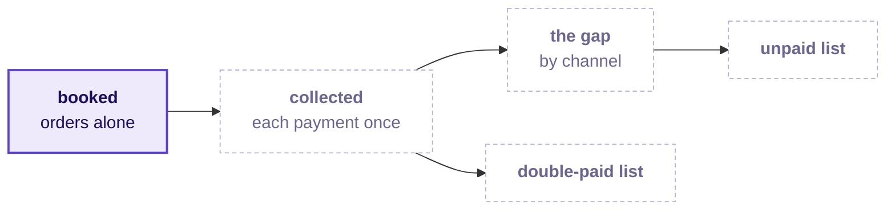
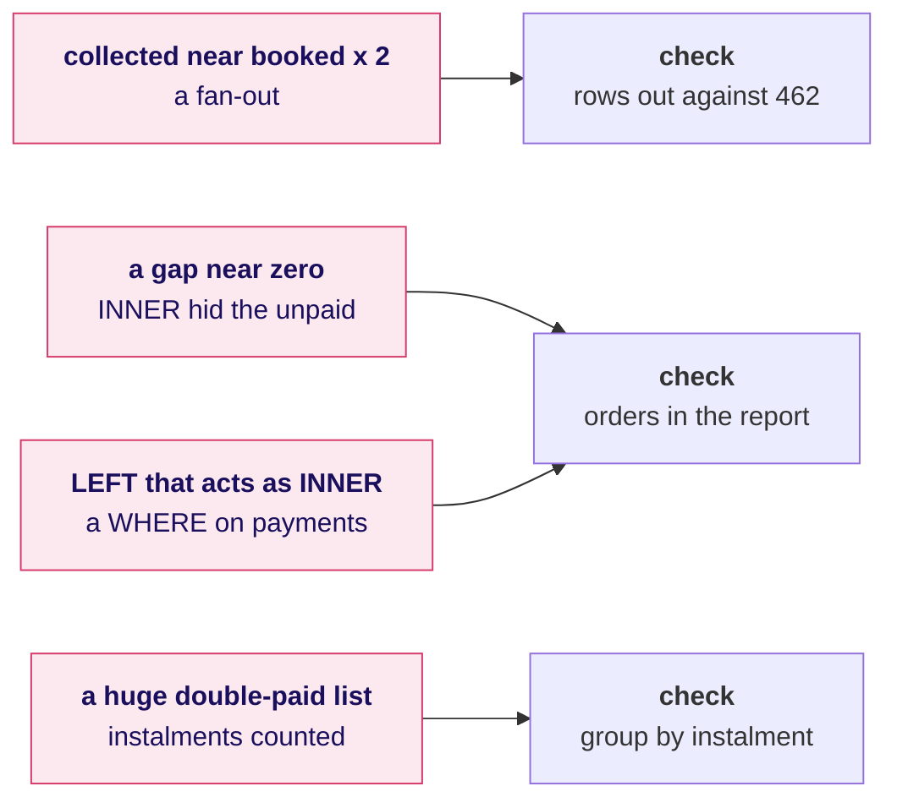
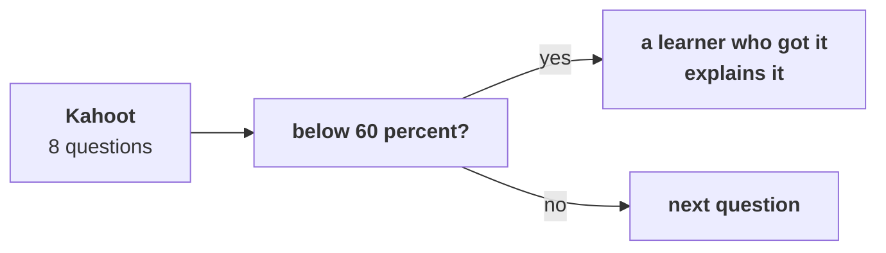
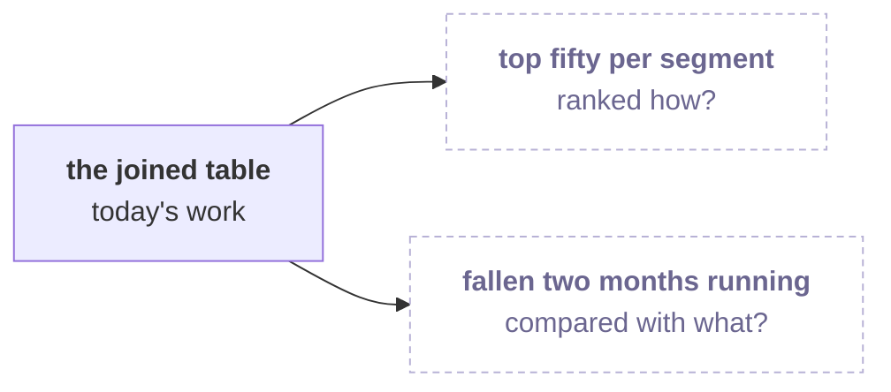

# The report Anand signs

Week 2, Day 2. Half two.

Kicker: WEEK 2  ·  TUESDAY  ·  AFTERNOON
Quote: How do you know it is not double-counted?
Who: Anand Iyer, finance controller, Kalpa Retail, before he uses the collected number

```notes
LIVE, one minute. The trainer's afternoon is 60 minutes: the escalated case (45) and the Kahoot
with tomorrow's ask (15). There is no second case today. The rest of the afternoon is the
tentative IITGN session, which picks up where this hour stops.
```

---

## SECTION 1: The escalated case
*The three rounds become one report by channel, with the reconciliation that proves it.*

```notes
LIVE. This chapter runs 45 minutes: the brief (5), the room alone on the case (30), the debrief of
the wrong answers the room produced (10). The brief is exercises/unguided/C2_W02_D02_case_STUDENT.md;
the start file is sql/C2_W02_D02_05_case_start_STUDENT.sql, with notebooks/C2_W02_D02_case_STUDENT.ipynb
for anyone who prefers the notebook. No hints during the 30 minutes.
```

---

## S1. The case, in Anand's words
*Order by order, by channel, with the proof above the number.*

**The client asks.** "Show me, order by order, what we actually collected against what we booked in Q2. If there is a gap, I want to know which orders and which channel. And tell me how you know it is not double-counted."


```mermaid
flowchart LR
    B["<b>booked</b><br/>orders alone"] --> C["<b>collected</b><br/>each payment once"]
    C --> G["<b>the gap</b><br/>by channel"]
    G --> U["<b>unpaid list</b>"]
    C --> D["<b>double-paid list</b>"]
    classDef known fill:#EEEAFB,stroke:#5B3FD6,color:#1A0F5C,stroke-width:2px
    classDef unknown fill:#FFFFFF,stroke:#B8B2D6,color:#6B6690,stroke-dasharray:4 3
    class B known
    class C,G,U,D unknown
```

```notes
LIVE, 2 minutes. Only booked is known when the case starts; everything dashed is the room's to
fill from the data. Read Anand's last sentence twice: it is the reason the reconciliation is part
of the deliverable and not an appendix.
```

---

## S2. Five parts, forty-five minutes
*Each part is one of the morning's rungs, run on Q2 and split by channel.*

```timeline
label: Part 1 | title: The baseline | body: Q2 orders and booked by channel, from orders alone.
label: Part 2 | title: Collected | body: Payments at order grain, a LEFT JOIN, the count reconciliation written above it.
label: Part 3 | title: The unpaid list | body: Every Q2 order with no payment, with channel and amount.
label: Part 4 | title: The double-paid list | body: Every payment the gateway posted twice, with the surplus.
label: Part 5 | title: The report | body: By channel, with the checks, the bridge and two sentences to Anand. | tone: dark
```

```notes
LIVE, 2 minutes. Say the timing: parts 1 and 2 in the first 15 minutes, parts 3 and 4 in the next
10, part 5 in the last 5. A learner who runs out of time ships part 5 with an open line in the
reconciliation, never a collected number without one.
```

---

## S3. What a finished report carries
*Columns, checks and sentences, with every number coming from your own query.*

| Column | What it holds | The check beside it |
|---|---|---|
| Orders | Q2 orders per channel | Rows out equals rows in |
| Booked | From orders alone | Equals Monday's booked, Rs 9,84,00,000 in total |
| Collected | Each payment counted once | Never above booked |
| Gap | Booked less collected | Equals the unpaid list's booked total |
| Posted twice | The double-paid list's surplus | Collected plus it equals the feed |

**The last check.** Every one of the 1,428 payment rows is matched to a Q1 order, a Q2 order, or to no order, and the unmatched ones go back to the platform lead.

```notes
LIVE, 1 minute. Leave this slide up for the 30 minutes: it is the definition of done.
```

---

## S4. The two sentences to Anand
*A claim with its evidence, a caveat, and the next step, in four parts.*

| Part | What Anand listens for |
|---|---|
| Claim | Collected against booked for Q2, as one number and one percentage |
| Evidence | The gap by channel, with the unpaid list behind it and the count reconciliation closed |
| Caveat | What the feed cannot tell you, such as whether an unpaid order is late or disputed |
| Next step | Who chases which orders, and what goes back to the platform lead |

**Kavya's review.** If the count does not close, the sentence says so and the collected number waits.

```notes
LIVE, 1 minute before the room starts, then silence for 30 minutes. Walk the room; the support
TA answers environment problems only. Note which of the four wrong answers on the next slide you
see on screens, for the debrief.
```

---

## S5. Four wrong answers to look for in your own report
*The debrief: each is a morning trap met again on Q2, and each has a one-line check.*


```mermaid
flowchart LR
    F["<b>collected near booked x 2</b><br/>a fan-out"] --> C1["<b>check</b><br/>rows out against 462"]
    I["<b>a gap near zero</b><br/>INNER hid the unpaid"] --> C2["<b>check</b><br/>orders in the report"]
    W["<b>LEFT that acts as INNER</b><br/>a WHERE on payments"] --> C2
    H["<b>a huge double-paid list</b><br/>instalments counted"] --> C3["<b>check</b><br/>group by instalment"]
    classDef bad fill:#FBE9EF,stroke:#D63A6A,color:#1A0F5C
    class F,I,W,H bad
```

```notes
LIVE, 6 minutes of the debrief. Ask for a volunteer whose report met one of these, and have them
say the check that caught it. Do not display anyone's collected number on the projector; the day
sheet has the numbers for you. If nobody met a trap, ask who ran the INNER version on purpose and
what its order count was.
```

---

## S6. Answer: what the checks prove, in Anand's words
*Read your reconciliation aloud as the answer to "how do you know it is not double-counted".*

```cards
icon: rows-3 | eyebrow: No row repeated | title: Rows out equals rows in | body: Payments were brought to one row per order before the join, so no order is summed twice.
icon: copy-x | eyebrow: No payment counted twice | title: Retries removed by grain | body: The same instalment posted twice counts once in collected, and the surplus is listed.
icon: list-checks | eyebrow: No order hidden | title: The gap has names | body: Booked less collected equals the unpaid list's total, order by order. | tone: dark
```

**In the interview.** [D] Design the validation you run before a joined number reaches Finance, and say what you do when it fails at 5 pm on reporting day.

```notes
LIVE, 4 minutes. Two learners read their two sentences aloud and the room checks the four parts.
Close the case on the interview question: the validation is these three cards plus the bridge,
and when it fails late on reporting day, send booked with the reconciliation's open line named and
hold collected; never ship an unreconciled number with a promise to fix it later.
```

---

## SECTION 2: The close
*The Kahoot, the lines to carry, and tomorrow's question.*

```notes
LIVE. This chapter runs 15 minutes: the Kahoot (9), the crux lines and the interview list (3),
tonight and tomorrow (3).
```

---

## S7. The Kahoot, eight questions
*Ungraded, and one of them returns to Monday.*

```stats
value: 8 | label: questions | note: seven on today, one returning to Monday
value: 0 | label: scores recorded | note: ungraded, as every day
value: 9 min | label: to play | note: then the answers, discussed
```


```mermaid
flowchart LR
    K["<b>Kahoot</b><br/>8 questions"] --> L["<b>below 60 percent?</b>"]
    L -->|"yes"| E["<b>a learner who got it<br/>explains it</b>"]
    L -->|"no"| N["<b>next question</b>"]
```

```notes
LIVE, 9 minutes. Run the pack from the kahoot folder. Pause on any question below 60 percent
correct and ask one learner who got it right to explain it.
```

---

## S8. Five lines to carry out of the room
*The same five lines close the notes and head the cheat sheet.*

| Line | The day's evidence |
|---|---|
| Every join answers a question about the rows that do not match; choose the join by that question. | INNER, LEFT, RIGHT and FULL on the tiny tables: 6, 7, 7 and 8 rows |
| A key that repeats on one side multiplies the other side's rows before any number is summed. | Rs 19.29 crore "collected" against Rs 9.84 crore booked |
| A join is done when its row count is explained: rows in, rows out, and the difference named. | 462 orders in, 462 rows out, at order grain |
| A condition on the right-hand table belongs in the ON clause, or the LEFT JOIN becomes an INNER one. | Six rows and T-4 gone on the tiny tables |
| Two payment rows are not a double payment until the grain says they are the same payment. | 216 Q2 orders flagged, most of them instalments |

```notes
LIVE, 2 minutes. Read the five lines aloud, left column only. The cheat sheet repeats them word for
word.
```

---

## D9. The interview questions of the day
*Eleven questions, tagged by how often they are asked; the answers are in the study notes.*

| Tag | Question |
|---|---|
| [S] | INNER against LEFT join: what does each drop or keep? |
| [S] | Your join grew the row count; name the cause and the check. |
| [F] | How do you find orders with no payment? |
| [F] | Revenue doubled after a join and every row looks fine; where do you look? |
| [D] | Design the validation you run before a joined number reaches Finance, and say what you do when it fails at 5 pm on reporting day. |
| [F] | A filter on the right-hand table of a LEFT JOIN: WHERE or ON, and what changes? |
| [F] | HAVING COUNT(*) > 1 on payments by order: what does it find, and what does it wrongly include? |
| [S] | When is an INNER join the honest choice? |
| [F] | How do you reconcile a total after a join back to its source table? |
| [D] | Anand says the gap is too small to matter; how do you decide whether to chase it? |
| [S] | What does a FULL OUTER JOIN add, and when would you reach for it? |

```notes
SELF-STUDY, 1 minute to point at it. [S] is asked everywhere, [F] often in GCC and product
screens, [D] separates candidates. Learners practise them aloud in pairs tonight.
```

---

## S10. Tonight, and after this hour
*The practice lab, the take-home and the reading, in the order they run.*

```timeline
label: Next | title: The IITGN session, tentative | body: Confidence intervals and the t-test family, 120 minutes, as currently planned.
label: Then | title: The practice lab | body: TA-led, four problems climbing, with solutions at the end.
label: Tonight | title: The take-home | body: A second payments book with its own surprises, reconciled by channel.
label: Tonight | title: Reading | body: SQLBolt lessons 6 to 8, and the study notes. | tone: dark
```

```notes
LIVE, 1 minute. The IITGN session is tentative until the institute confirms it; say so. The
practice lab set is exercises/practice/C2_W02_D02_lab_STUDENT.md.
```

---

## S11. Tomorrow, Marketing wants the best members
*The joined table is ready, and the next question is about each row's neighbours.*

**The client asks.** "Retail-Plus frequency is the problem, so we want to protect our best members before they drift. Give us the top fifty customers by Q2 revenue in each segment, and flag anyone whose monthly spend has fallen for two months running."


```mermaid
flowchart LR
    J["<b>the joined table</b><br/>today's work"] --> T["<b>top fifty per segment</b><br/>ranked how?"]
    J --> F["<b>fallen two months running</b><br/>compared with what?"]
    classDef unknown fill:#FFFFFF,stroke:#B8B2D6,color:#6B6690,stroke-dasharray:4 3
    class T,F unknown
```

```notes
LIVE, 2 minutes. Read the message and stop. Do not predict the answer; ask only one question to
leave open: which of Monday's clauses can rank a row within its own segment? None of them, which is
tomorrow's point.
```
