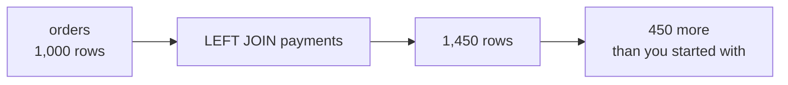
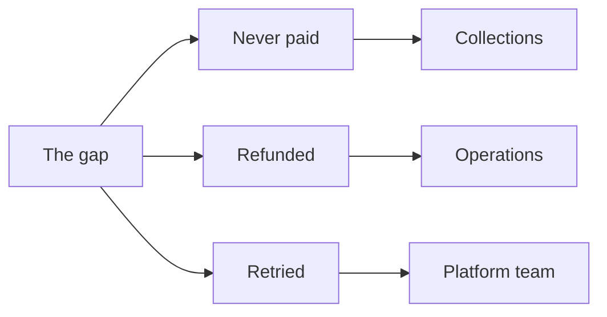

# Study notes: Tuesday, booked is not collected

## The situation you were in

Anand read the Monday suite and found the thing it could not answer:

> "Booked revenue is not collected revenue. Some orders are paid in two instalments, some are
> refunded, some were never paid at all. Show me, order by order, what we actually collected
> against what we booked in Q2. If there is a gap, I want to know which orders and which channel."

Booked lives in `orders`: an order was placed. Collected lives in `payments`: money arrived.
Nothing connected the two until today, and the connection is where the damage happens.

The platform lead added one line in passing: the payments feed sometimes double-posts when the
gateway retries. That was the only warning anyone gave.

## What happened when the obvious query ran

```sql
SELECT sum(o.amount) AS booked, sum(p.amount) AS collected
FROM orders o LEFT JOIN payments p ON p.order_id = o.order_id;
```

Booked came back at roughly Rs 39.6 crore against a true figure of Rs 19.84 crore. The result was
1.9952 times the truth.

Every single row in that result was correct. The order id was real, the amount was that order's
real amount, the payment was a genuine payment for that order. Nothing was corrupted and nothing
was missing.

That combination is what makes this the most expensive mistake in analytics. A number that is
5 percent wrong gets questioned. A number that is twice the truth gets believed, because it reads
as a different metric rather than a broken one.

## The count that was free and was not taken



Nothing was duplicated in either table. The duplication happened in the join, because one order
can carry several payment rows and every one of them makes a row.

450 orders carry more than one payment row. Four hundred are large invoices settled in two
instalments, which is normal commercial practice. Fifty are the gateway retries.

## Why 450 duplicates doubled a book of a thousand

The 450 are not a random slice. Large invoices get instalment terms, so the orders that were
duplicated are the orders that carry the revenue: they hold over 80 percent of the whole book.

Duplicate a random tenth of a book and a total moves a few percent. Duplicate the orders that hold
the money and it roughly doubles, which is why fan-out is both the worst case and the ordinary
one.

## What each join keeps

| Join | Keeps | The question it answers |
|---|---|---|
| `INNER` | Only orders that have a payment | What did paying customers do |
| `LEFT` | Every order, paid or not | What did we book, and what came in against it |
| `RIGHT` | Every payment, even an orphan | What money arrived, and for what |
| `FULL OUTER` | Both sides' orphans | Show me every mismatch in one table |

The `INNER` join is the quiet danger here. It removes the 30 unpaid orders, which are precisely
what Anand asked about, and the output still looks like a complete report. It does not warn you,
it does not log anything, and choosing it is answering a different question in a way nobody can
see from the result.

## Anti-joins, in both directions

```sql
-- orders with no payment: 30 rows
SELECT o.* FROM orders o
LEFT JOIN payments p ON p.order_id = o.order_id
WHERE p.payment_id IS NULL;

-- payments with no order: 8 rows
SELECT p.* FROM payments p
LEFT JOIN orders o ON o.order_id = p.order_id
WHERE o.order_id IS NULL;
```

Keep everything, then keep only what failed to match. That is how you find absence, and absence is
usually what a stakeholder is asking about without saying so.

The eight orphans are money that arrived for something the order book does not know about. That is
a question for the platform team rather than for you, and it still gets reported rather than
netted against anything.

## The habit

A join is done when its row count is **explained**, not when it is checked.

```sql
-- Rows before: 1,000 orders.
-- Rows after:  1,450.
-- Difference:  450 orders carry two payment rows, of which 400 are instalment plans
--              and 50 are gateway retries. 30 orders carry none.
-- Therefore:   do not SUM the order amount over this join.
```

The "Therefore" line is the one that saves somebody. If you cannot write it, you do not yet know
what your join did.

This is the same habit as last Wednesday, when a dashboard's Rs 2.10 crore was reconciled against
Finance's Rs 1.90 crore by counting duplicated rows. The tool changed. The discipline did not.

## The fix that cannot fan out

```sql
WITH paid AS (
    SELECT order_id, sum(amount) AS collected
    FROM payments GROUP BY order_id
)
SELECT sum(o.amount) AS booked, coalesce(sum(p.collected), 0) AS collected
FROM orders o LEFT JOIN paid p ON p.order_id = o.order_id;
```

Collapse the many side to one row per key **before** joining. One row in, one row out, and the
count check passes by construction rather than by luck.

`coalesce` is load-bearing. An order with no payment joins to NULL, and NULL in an arithmetic
expression makes the whole expression NULL, so one unpaid order would empty a channel's gap cell
entirely. An empty cell reads as "no problem here", which is the opposite of the truth.

## Aggregating first fixes the join, not the data

The fifty gateway retries posted a real second row, so summing the payment amount still counts
them. That is a different problem with a different fix, and confusing the two is common.

Separating a retry from an instalment is a business judgment, not a data rule:

| Two payment rows, and | Means |
|---|---|
| The amounts are identical | A repeated charge |
| The amounts differ | A split invoice, which is correct |

A rule that deleted every duplicate payment would delete four hundred legitimate instalments. The
judgment is yours and it goes in writing.

## What the gap is actually made of

Q2, by channel: store carries a gap around Rs 9.5 lakh, web around Rs 7.8 lakh, and app is
essentially clean at Rs 500. That contrast is the finding, not the total.



A gap number on its own starts a meeting. A gap number split three ways ends one, because each
part has a different owner.

## Check yourself without writing anything

1. Your join returned more rows than it started with. What is the first thing you look at, and
   what is the second?
2. An `INNER` join and a `LEFT` join differ by 30 rows. What are those 30, and which stakeholder
   asked about them?
3. Why did 450 duplicated orders roughly double a book of a thousand rather than inflate it by
   45 percent?
4. You aggregate payments before joining and the count comes out right. Have you fixed the retries?
5. Two payment rows on one order. When is that correct, and when is it a bug?
6. What does `coalesce` protect you from here, and what would the report have shown without it?

Four and six are the ones to check against somebody else.

## Reading

- SQLBolt lessons 6 to 8, the join lessons: <https://sqlbolt.com/> (verified 13 Sep 2026)
- PostgreSQL Exercises, the joins category, for drilling:
  <https://pgexercises.com/> (verified 13 Sep 2026)
- cudidotdev, "POSTGRESQL JOINS, complete guide in 12 mins", when the four types need saying
  aloud: <https://www.youtube.com/watch?v=FprFu75BoE4> (verified 13 Sep 2026)

## What tomorrow does to today

Marketing wants the top fifty members per segment, and the head of Retail-Plus has told you what
should happen when two members spent the same amount.

Today's tables are tomorrow's input, so the validated join is the thing everything Wednesday
stands on.
