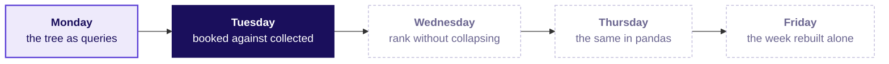
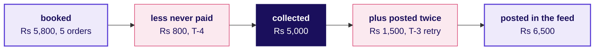

# Booked against collected, without lying

**Week 2, Tuesday. Study notes, read after the session.** A join is a promise about the rows that do
not match, a key that repeats on one side multiplies the other, and a joined number leaves the team
only when its row count is explained. Reading time: about 25 minutes.

---

## What you can now do

1. You can say, before running anything, what INNER, LEFT, RIGHT and FULL OUTER joins keep and drop,
   by asking what should happen to an order with no payment and a payment with no order.
2. You can name the grain of each table before a join, and predict when a join will multiply rows.
3. You can catch a fan-out with one count, and fix it by bringing the many side to one row per key
   before the join.
4. You can write a reconciliation above a joined number: rows in, rows out, and the difference named.
5. You can build a revenue bridge from booked to what the payments feed posted, and make each step of
   it a list someone can act on.
6. You can list the orders with no payment with an anti-join, and keep a condition on the payments
   table inside the ON clause so the LEFT JOIN stays a LEFT JOIN.
7. You can tell a second instalment from a gateway retry by the grain of the check, before anybody
   calls a customer about a refund.

---

## Where this sits

**What the session covered.** Worked in full: Anand's ask and the platform lead's remark about
retries; the grain of `orders` and `payments`; INNER and LEFT traced row by row on two invented tiny
tables, with RIGHT and FULL named on the same tables; the fan-out on Kalpa's Q2 orders and its fix;
the row-count reconciliation and the booked-to-collected bridge; the anti-join for unpaid orders;
WHERE against ON on the right-hand table; and the retry test at the grain of order and instalment.
The escalated case asked for the report by channel that Anand signs. Mentioned only: FULL OUTER JOIN
as the tool for reconciling both sides at once, which the stretch in the extras picks up, and
`NOT EXISTS` as the anti-join written the way Anand says it.


```mermaid
flowchart LR
    M["<b>Monday</b><br/>the tree as queries"] --> T["<b>Tuesday</b><br/>booked against collected"]
    T --> W["<b>Wednesday</b><br/>rank without collapsing"]
    W --> H["<b>Thursday</b><br/>the same in pandas"]
    H --> F["<b>Friday</b><br/>the week rebuilt alone"]
    classDef bet fill:#1A0F5C,stroke:#1A0F5C,color:#FFFFFF
    classDef known fill:#EEEAFB,stroke:#5B3FD6,color:#1A0F5C,stroke-width:2px
    classDef unknown fill:#FFFFFF,stroke:#B8B2D6,color:#6B6690,stroke-dasharray:4 3
    class T bet
    class M known
    class W,H,F unknown
```

This map of the week is the programme's own construction, drawn from the Week 2 rows. Monday is
done, today is the dark box, and the dashed boxes are still to come.

**The outcome tie.** Wednesday's protect list ranks customers on a joined table, and Thursday's merge
repeats today's join in pandas; both are only as honest as the join underneath them, and the count
check you wrote today is the one they inherit.

**What was left out.** Self-joins and CROSS JOIN are outside today's scope, and so are join
algorithms and performance.
The afternoon's tentative IITGN faculty session on intervals and t-tests is not covered here.

---

## The picture to remember: the bridge

On the two invented tiny tables, which every example below uses, the whole day fits in one drawing.


```mermaid
flowchart LR
    B["<b>booked</b><br/>Rs 5,800, 5 orders"] --> U["<b>less never paid</b><br/>Rs 800, T-4"]
    U --> C["<b>collected</b><br/>Rs 5,000"]
    C --> R["<b>plus posted twice</b><br/>Rs 1,500, T-3 retry"]
    R --> P["<b>posted in the feed</b><br/>Rs 6,500"]
    classDef known fill:#EEEAFB,stroke:#5B3FD6,color:#1A0F5C,stroke-width:2px
    classDef bad fill:#FBE9EF,stroke:#D63A6A,color:#1A0F5C
    classDef bet fill:#1A0F5C,stroke:#1A0F5C,color:#FFFFFF
    class B,P known
    class U,R bad
    class C bet
```

All numbers in this drawing are invented. Read it left to right: booked comes from the orders table
alone, posted comes from the payments table alone, and collected sits between them, reached by two
moves that each have a list behind them. Anand asked for the dark box. Every section below builds one
more piece of this bridge, and by the escalated case it is drawn on Kalpa's own Q2.

---

## Anand's ask, and the grain of each table

Anand Iyer, Kalpa's finance controller, answered Monday's suite with the question a controller always
asks next:

> "Booked revenue is not collected revenue. Some orders are paid in two instalments, some are
> refunded, some were never paid at all. Show me, order by order, what we actually collected against
> what we booked in Q2. If there is a gap, I want to know which orders and which channel."

The data platform lead added the `payments` table and said, in passing, that the feed "sometimes
double-posts when the gateway retries". You sign off the collected number, and Anand will ask how
you know it is not double-counted before he uses it.

Booked is Week 1's definition, carried into Monday's suite: the sum of `orders.amount` over every
order in the quarter, whatever its status. For Q2 that is Rs 9,84,00,000 over 462 orders: app 153
orders and Rs 4,25,90,270, store 159 and Rs 3,21,48,730, web 150 and Rs 2,36,61,000. That number is
the fixed point every later number reconciles to.

The first thinking move comes before any join is typed: **say the grain of each table**, meaning what
one row stands for. In `orders` one row is one order. In `payments` one row is one payment event, and
`order_id` can repeat, because an instalment order has two rows and a retry can post an instalment
twice. The table has no foreign key to `orders`, so nothing stops a payment pointing at an order that
does not exist. Said aloud, the grains show the day's two dangers before any query runs: a repeating
key will repeat the order it matches, and an unpaid order has nothing to match at all.

**CALLBACK.** Week 2, Monday put a CTE per quarter side by side joined on segment, where each side had
one row per segment, so the join could not multiply. Today the two sides have different grains.

---

## Every join answers a question about the rows that do not match

Two tiny invented tables carry the mechanism, so each row can be traced by hand before the
warehouse is touched.

| Order | Channel | Amount | Payments against it |
|---|---|---|---|
| T-1 | app | 1,000 | P-1 for 1,000, instalment 1 |
| T-2 | web | 2,000 | P-2 for 1,200, instalment 1, and P-3 for 800, instalment 2 |
| T-3 | store | 1,500 | P-4 for 1,500, instalment 1, and P-5 for 1,500, instalment 1, same day |
| T-4 | app | 800 | No payment at all |
| T-5 | store | 500 | P-6 for 500, instalment 1 |
| (none) | | | P-7 for 600 points at T-9, which is not in the orders table |

Five orders, seven payments, and every awkward case Anand named sits in one of them: an instalment
order (T-2), a retry (T-3), an unpaid order (T-4) and a payment nobody can match (P-7).

| Join | The question it answers about unmatched rows | Rows on the tiny tables |
|---|---|---|
| INNER | Which orders have at least one payment, once per payment? T-4 and P-7 both vanish. | 6 |
| LEFT, orders first | What happened to every order, paid or not? T-4 stays with NULLs on the payment side. | 7 |
| RIGHT, orders first | What happened to every payment, matched or not? P-7 stays with NULLs on the order side. | 7 |
| FULL OUTER | What is unmatched on either side? T-4 and P-7 both stay. | 8 |

The six inner rows are T-1 once, T-2 twice, T-3 twice and T-5 once; LEFT adds T-4, RIGHT adds P-7,
and FULL keeps both. A count you predicted and then checked is evidence, and a count you only read is
a number. Anand asked about every order, including those "never paid at all", so the report is a LEFT
JOIN with `orders` on the left; INNER answers a smaller question and never says the rest have gone.

> Every join answers a question about the rows that do not match; choose the join by that question.

**ORIGIN.** The explicit `JOIN ... ON` syntax, with LEFT, RIGHT and FULL OUTER as named keywords,
entered the SQL standard with SQL-92, in 1992. Before that, outer joins were written with
vendor-specific symbols in the WHERE clause, which is part of why WHERE and ON still get confused.

---

## Round 1: the fan-out, where every row is real and the total is not

**The question.** What did Kalpa collect in Q2, and is it close to what was booked?

**The plausible wrong answer.** A hurried analyst reads "collected" as "the value of the orders that
were paid", joins payments to orders, and sums the order amount:

```sql
SELECT SUM(o.amount)
FROM orders o
JOIN payments p ON p.order_id = o.order_id
WHERE o.quarter = 'Q2';
```

It returns **Rs 19,29,04,410**, which is 1.96 times the Rs 9,84,00,000 booked. By channel it reads app
Rs 8,50,36,620, store Rs 6,22,48,550 and web Rs 4,56,19,240. Every row behind it is a real order with
a real payment, which is exactly why it gets believed.

**Why it is wrong in business terms.** The decision it invites is "collections are running ahead of
bookings, stand the collections team down". No business collects twice what it sold. The query
summed `o.amount` once per payment row, so an order paid in two instalments counted its full value
twice. On the tiny tables the same query gives 8,500 against 5,800 booked, and the trace shows why:
T-2's 2,000 and T-3's 1,500 each appear on two rows.

**The harder variant the room ran.** Put booked and collected side by side by channel from one LEFT
JOIN, and the fan-out hides better:

```sql
SELECT o.channel, SUM(o.amount) AS booked, SUM(p.amount) AS collected
FROM orders o
LEFT JOIN payments p ON p.order_id = o.order_id
WHERE o.quarter = 'Q2'
GROUP BY o.channel;
```

The Q2 total reads booked Rs 19,46,59,340 and collected Rs 9,66,65,820, which is "49.7 percent
collected": app 50.1, store 49.4 and web 49.3. Now the decision it invites is a collections panic
over Rs 9.8 crore of apparently unpaid sales. The payment column is summed once per payment row, which
is its own grain, so it is the feed's total as posted. It is the booked column that doubled, and a
percentage with a doubled denominator halves.

**The check.** Count before you sum. Q2 has 462 orders, and `orders LEFT JOIN payments` for Q2 returns
678 rows. Rows in 462, rows out 678, so 216 rows are unexplained until you look at the payments
grain: 216 Q2 orders carry more than one payment row, each appears once more than it should, and 462
plus 216 is 678. On the whole table the same join turns 1,000 orders into 1,450 rows. Either count,
taken before the SUM, would have stopped both wrong answers.

**The fix, and what changed.** Bring payments to one row per order first, then join at order grain:

```sql
WITH paid_per_order AS (
    SELECT order_id, SUM(amount) AS paid, COUNT(*) AS payment_rows
    FROM payments
    GROUP BY order_id
)
SELECT o.channel, COUNT(*) AS rows_out, SUM(o.amount) AS booked,
       SUM(COALESCE(pp.paid, 0)) AS paid_as_posted
FROM orders o
LEFT JOIN paid_per_order pp ON pp.order_id = o.order_id
WHERE o.quarter = 'Q2'
GROUP BY o.channel;
```

Rows out is back to 462, and booked is back to Rs 9,84,00,000, exactly Monday's number. The 216 extra
rows are gone, and Rs 9,62,59,340 of double-counted order value with them. The paid column is still
"as posted", which is the next round's problem.

> A key that repeats on one side multiplies the other side's rows before any number is summed.

**WATCH OUT.** The tell of a fan-out is a total that is a round-ish multiple of a number you already
trust. When a joined total lands near 1.5, 2 or 3 times a known booked figure, stop and count rows
before you explain it.

**Kavya's review.** "A join is a multiplication until you prove it is not. Tell me the grain of each
table before you tell me a total."

---

## Round 2: rows in, rows out, and the bridge

**The question.** Now that the join is at the right grain, how much of the booked revenue was
collected, and how do you prove the number to Anand?

**The plausible wrong answer.** An analyst who learned round 1 keeps the per-order CTE and reaches for
INNER JOIN, because "we only want orders that were paid". On the invented tiny tables:

| | Orders in the report | Booked | Collected | Gap |
|---|---|---|---|---|
| INNER at order grain | 4 | 5,000 | 6,500 | minus 1,500 |

The report says every order was paid, with a surplus. The decision it invites is to tell Anand there
is no gap, so nobody chases the unpaid invoice. On the tiny tables that invoice is T-4 for 800, and
the INNER join removed it without a word, together with its 800 of booked value.

**Why it is wrong.** Booked moved, which should be impossible, because nothing about the orders
changed. INNER answered "what did the paid orders bring in", a smaller question than Anand's.

**The check.** Orders in the report against orders in the table: 4 against 5. Booked in the report
against booked from `orders` alone: 5,000 against 5,800. Either one fails, and both are cheap.

**The fix, and what changed.** LEFT JOIN with `COALESCE(pp.paid, 0)`, so an order with no payment
stays in the report with collected set to zero. On the tiny tables that gives 5 orders, booked 5,800,
collected as posted 6,500, and a gap of minus 700. The count now closes and booked is right, and the
gap is still negative, because the T-3 retry sits inside "collected" as 1,500 that was never owed.
That minus 700 is the bridge to round 3: the count check proved the join, and it cannot prove the
payments are clean.

**The reconciliation, written above the number.** This is the habit the round exists to build. Before
the report query runs, four lines go in a comment block above it:

```sql
-- Rows in:   every Q2 order, from orders alone.
-- Rows out:  one row per Q2 order after the join; must equal rows in.
-- Booked:    the sum over rows out must equal booked from orders alone.
-- The gap:   booked minus collected must equal the booked value of the unpaid list.
```

**The bridge.** Once each line holds, the picture above can be drawn: booked 5,800, less never paid
800, collected 5,000, plus posted twice 1,500, posted 6,500. Each move is a list with names on it,
which makes the bridge worth more than the total. On Kalpa's Q2 the room built it with
`sql/C2_W02_D02_03_reconcile_STUDENT.sql`: 462 rows in and out and Rs 9,84,00,000 booked on both
sides, with the two middle moves yours to find, closing to the last rupee.

> A join is done when its row count is explained: rows in, rows out, and the difference named.

**CALLBACK.** Week 1, Wednesday reconciled the dashboard's Q1 figure to Finance's books before Anand
would act on a drop. Today is the same discipline one tool later, written in a comment above a query.

**IN THE FIELD.** The PostgreSQL 16 tutorial on joins (section 2.6) builds its outer join example on
exactly this case: a weather reading for Hayward, a city missing from the cities table, disappears
from the inner join and returns from the left outer join with null values in the city columns. The
mechanism in today's T-4 is the one the documentation teaches first.

**Kavya's review.** "Rows in, rows out, and the difference explained, written above the number. If the
count does not close, the number does not leave the team."

---

## Round 3: the unpaid list, the double-paid list, and the filter that breaks a LEFT JOIN

**The question.** Anand asked which orders make up the gap. Which were never paid, and which were
charged twice?

### The filter that turns LEFT into INNER

**The plausible wrong answer.** "Collected in Q2" sounds like a date filter, so the hurried analyst
adds one to a correct LEFT JOIN:

```sql
SELECT o.order_id, o.amount, p.payment_id, p.paid_date
FROM tiny_orders o
LEFT JOIN tiny_payments p ON p.order_id = o.order_id
WHERE p.paid_date BETWEEN '2026-07-01' AND '2026-09-30';
```

On the invented tiny tables it returns 6 rows, and T-4 has gone. The LEFT JOIN kept T-4 with a NULL
`paid_date`, and then the WHERE clause, which runs after the join, threw it away because NULL is not
between two dates. The query is written as a LEFT JOIN and behaves as an INNER one, and the decision
it invites is the same as round 2's: no unpaid orders, nothing to chase.

**The check.** Count the orders the query returns against the orders in the table, exactly as in
round 2. A LEFT JOIN that returns fewer orders than its left table had has been quietly converted.

**The fix, and what changed.** Move the condition on the payments table into the ON clause:

```sql
LEFT JOIN tiny_payments p
       ON p.order_id = o.order_id
      AND p.paid_date BETWEEN '2026-07-01' AND '2026-09-30'
```

Now the date condition decides which payments attach, and every order survives. T-4 is back, with
NULLs. The PostgreSQL 16 documentation, section 7.2, draws the same line: a restriction in ON is
processed before the join and one in WHERE after it, and the documentation adds that the difference
is harmless for an inner join and matters a great deal for an outer one.

> A condition on the right-hand table belongs in the ON clause, or the LEFT JOIN becomes an INNER one.

### The unpaid list

The anti-join is the one WHERE on the right-hand table that belongs there: a test that the right side
found nothing.

```sql
SELECT o.order_id, o.channel, o.amount
FROM tiny_orders o
LEFT JOIN tiny_payments p ON p.order_id = o.order_id
WHERE p.payment_id IS NULL;
```

On the tiny tables it lists T-4. The same question written as `WHERE NOT EXISTS (SELECT 1 FROM
tiny_payments p WHERE p.order_id = o.order_id)` reads as Anand's own sentence and returns the same
row. Turned round, with payments on the left, the anti-join lists P-7, the payment no order can
claim. On Kalpa's Q2 you ran both directions yourself; your unpaid list, grouped by channel, is the
"which orders and which channel" half of Anand's ask.

**WATCH OUT.** Test IS NULL on a column that can never be NULL in a real match, such as the payment's
key. Testing a column that can be empty in a real payment row lists paid orders as unpaid.

### The double-paid list

**The plausible wrong answer.** Group payments by order and keep the orders with more than one row:

```sql
SELECT order_id, COUNT(*) AS payment_rows
FROM payments
GROUP BY order_id
HAVING COUNT(*) > 1;
```

On Kalpa's Q2 it returns 216 orders worth Rs 9,62,59,340 booked, and it looks like an alarming list of
double charges. The decision it invites is to refund, or to chase, Rs 9.6 crore of "double payments".
On the tiny tables the same query lists T-2 and T-3, and only T-3 is a retry: T-2 paid 1,200 and then
800, instalments 1 and 2, which is exactly what its customer was asked to do.

**Why it is wrong.** The query checked for repetition at the grain of the order, and a retry is a
repetition at the grain of the instalment. Most of those 216 orders are large invoices settled in two
instalments, which Anand named in his first sentence.

**The check and the fix.** A retry is the same instalment posted twice, so group at that grain:

```sql
SELECT order_id, instalment_no, COUNT(*) AS times_posted, MAX(amount) AS amount,
       MAX(amount) * (COUNT(*) - 1) AS posted_twice
FROM payments
GROUP BY order_id, instalment_no
HAVING COUNT(*) > 1;
```

On the tiny tables this lists T-3 alone, instalment 1 posted twice, 1,500 surplus. On Kalpa's Q2 the
list is much shorter than 216, and how much shorter is what you found in `sql/C2_W02_D02_04_lists_STUDENT.sql`.
The pattern query in that file makes the difference visible in one table: an instalment order shows
the pattern `1+2`, and a retry shows `1+1`.

> Two payment rows are not a double payment until the grain says they are the same payment.

**Kavya's review.** "Two payment rows are not a double payment. Show me what makes a retry a retry
before you call anyone about a refund."

---

## The escalated case: the report Anand signs

The afternoon's unguided case asked for the whole answer in one file: booked, collected and the gap by
channel, the unpaid list, the double-paid list, and a count reconciliation that proves the numbers.
The start file is `sql/C2_W02_D02_05_case_start_STUDENT.sql`, and the worked solution is released in
`exercises/solutions/`. The approach runs in five moves, and each one is a check on the one before.

1. **The baseline.** Q2 orders and booked by channel from `orders` alone, which must match Monday's
   Rs 9,84,00,000 and the channel split above.
2. **Collected at the right grain.** Payments are brought to one row per order and instalment, so a
   retry counts once, then to one row per order, then LEFT JOINed to the Q2 orders. Rows out must equal
   rows in, and booked after the join must equal the baseline.
3. **The unpaid list.** The anti-join, with each order's channel and amount, largest first, so the
   first line Anand reads is the one worth a phone call.
4. **The double-paid list.** The same instalment posted more than once, with the surplus each one
   carries, for the platform lead and for whoever issues refunds.
5. **The report by channel, with its checks.** Booked, collected, gap, unpaid count and value, and
   surplus, beside a column that tests booked minus collected against the unpaid list's booked value.
   The case closes on five checks that must all read true: rows out equals rows in; booked after the
   join equals booked from orders; the gap equals the unpaid list; collected plus the surplus equals
   what the feed posted against Q2 orders; and every payment row is matched to a Q1 order, a Q2 order,
   or to no order at all.

The last check finds payments the report cannot own. Any payment that matches no order goes back to
the platform lead with its ids and stays out of the collected number, since a rupee nobody can tie to
a sale cannot be reported as collected against one. The sentence to Anand carries the definition and
the proof: "Q2 collected counts each instalment once; it reconciles to booked through the unpaid list
and to the feed through the retry list, both attached by channel."

---

## Where this shows up in the work

| What you are looking at | What you check first | What it costs to get wrong |
|---|---|---|
| A dashboard tile shows revenue up sharply the week a new table was joined into its source | Rows before and after the join, and whether the new table's key repeats | A board pack that reports growth which is a fan-out, and a correction issued a month later under the CFO's name |
| Finance asks for collections against sales for the quarter's close | That the join is LEFT from orders, that no payment condition sits in WHERE, and that booked after the join equals booked from orders | Unpaid invoices dropped from the list, so nobody chases them before they age past the point of recovery |
| An operations lead forwards a list of "customers charged twice" for refunds | The grain the duplicate test ran at, and whether the list separates instalments from retries | Refunds paid against legitimate second instalments, which is money sent out that was owed in |

---

## Try this yourself

No writing: pick a letter for each, then check the key.

1. Five orders, seven payments, and every order has at least one payment. How many rows can a LEFT
   JOIN from orders to payments return? a) exactly five; b) exactly seven; c) seven, if every payment
   matches an order, and fewer if some match none; d) twelve.
2. Booked after your join is 1.5 times booked from the orders table. The first thing to check is:
   a) the date filter; b) whether the payments key repeats; c) the currency of the amounts; d) the
   channel names.
3. A LEFT JOIN from orders to payments has `WHERE p.method = 'card'`. What happens to an order with no
   payment? a) it stays with NULLs; b) it is dropped; c) it appears twice; d) it raises an error.
4. One order has two payment rows, instalment 1 for Rs 1,200 and instalment 2 for Rs 800. This is:
   a) a retry; b) a fan-out bug in the table; c) a legitimate instalment pair; d) an orphan payment.
5. A report must keep every order and also show every payment that matches no order. The join is:
   a) FULL OUTER; b) INNER; c) LEFT from orders; d) RIGHT from orders.
6. A filter on a group's total, such as segments with revenue above a threshold, goes in: a) WHERE;
   b) ON; c) HAVING; d) ORDER BY.

Key: 1c 2b 3b 4c 5a 6c. If you missed 1, reread "Every join answers a question about the rows that do
not match" (a LEFT JOIN returns at least one row per order, and one per matching payment); 2, round 1;
3, round 3, the filter that turns LEFT into INNER; 4, round 3, the double-paid list; 5, the join table
in the second section; 6 comes from Week 2, Monday, where WHERE filters rows before grouping and
HAVING filters groups after it.

---

## Where this gets tested

**[S] INNER against LEFT join: what does each drop or keep?** Tested: whether you frame a join by its
unmatched rows. Strong: INNER keeps only rows that found a match on both sides, so an order with no
payment and a payment with no order both vanish; LEFT keeps every row of the left table, matched or
not, with NULLs where the right side found nothing. Both repeat a left row once per matching right
row. Then the choice, in business words: Anand asked about every order, including unpaid ones, so
the report is a LEFT JOIN from orders. Weak: a Venn diagram of overlapping circles, which hides the
fact that a join can repeat rows.

**[S] Your join grew the row count; name the cause and the check.** Tested: whether you know fan-out
by its mechanism. Strong: the join key repeats on the other side, so each left row appears once per
match; here, an order paid in two instalments appears twice. The check is to count rows before and
after, and to count right-side rows per key with `GROUP BY key HAVING COUNT(*) > 1`. The fix is to
aggregate the many side to the join's grain first, in a CTE, and then join. Weak: "use DISTINCT",
which hides the symptom and can merge two genuine rows that happen to look the same.

**[F] How do you find orders with no payment?** Tested: the anti-join, and its trap. Strong: LEFT JOIN
payments and keep rows where the payment's key IS NULL, or write `WHERE NOT EXISTS` with a correlated
subquery, which reads as the business sentence. Say which column you test and why it cannot be NULL
in a real match. Mention that `NOT IN` against a subquery returns nothing at all if the subquery holds
a NULL, which is why `NOT EXISTS` is the safer habit. Weak: an INNER JOIN and a manual eyeball of
what is missing.

**[F] Revenue doubled after a join and every row looks fine; where do you look?** Tested: calm
diagnosis over row inspection. Strong: every row looks fine because every row is real; the problem is
how many times each order appears. Compare rows out with rows in, find the key that repeats on the
right, and check which side's amount was summed, since the left side's amount is repeated and the
right side's is not. Then fix at the grain and show booked back at its source value. Weak: reading
rows one by one looking for a bad value.

**[D] Design the validation you run before a joined number reaches Finance, and say what you do when
it fails at 5 pm on reporting day.** Tested: owning a number under pressure. Strong: the checks are
written above the query and run with it: rows out against rows in, the sum of the left table's amount
after the join against its source, the gap against the list that explains it, the posted total
against the feed, and every right-side row accounted for as matched or orphaned. When one fails late
on reporting day, the number does not go; you send what does reconcile with its definition, name the
line that does not close and by how much, give the time by which you will have it, and say who you
have asked. A late honest number costs an afternoon, and a wrong one costs the next quarter's trust.
Weak: sending the number with a caveat in small print, or silently switching to an INNER join because
it "looks cleaner".

**[F] A filter on the right-hand table of a LEFT JOIN: WHERE or ON, and what changes?** Tested: the
processing order of an outer join. Strong: in ON, the condition decides which right rows attach and
every left row survives; in WHERE, it runs on the joined result, rejects the NULLs of unmatched rows
and turns the LEFT JOIN into an INNER one. The one WHERE test on the right table that belongs there is
`IS NULL` on its key, which is the anti-join. Weak: "they are the same", which is true only for an
INNER join.

**[F] HAVING COUNT(*) > 1 on payments by order: what does it find, and what does it wrongly include?**
Tested: whether you check a duplicate at the right grain. Strong: it finds every order with more than
one payment row, and it wrongly includes every legitimate multi-instalment order. A retry is the same
instalment posted again, so group by order and instalment, and add the amount if the business says a
retry repeats it exactly. Weak: treating every multi-row order as a double charge and sending the
list for refunds.

**[S] When is an INNER join the honest choice?** Tested: judgement over rules. Strong: when the
question is only about matched rows and you say so in the definition, for example "average payment
per paid order", or when the key is enforced on both sides so nothing can be unmatched. It stays
honest if the output says which rows it covers and the count of excluded rows is known. Weak: "never",
or "always, it is cleaner".

**[F] How do you reconcile a total after a join back to its source table?** Tested: the bridge habit.
Strong: take the total from the source table alone, take the same total from the joined result, and
explain every difference as a named list: here, booked less the unpaid list gives collected, and
collected plus the retry surplus gives what the feed posted. Every move has rows behind it, and the
bridge closes to the rupee. Weak: "the totals were close enough".

**[D] Anand says the gap is too small to matter; how do you decide whether to chase it?** Tested:
materiality with judgement. Strong: size the gap against booked, then look at its shape before its
size: how many orders, whether it concentrates on one channel or in a few large invoices, how old the
oldest unpaid order is, and whether the same mechanism will grow next quarter. A small gap caused by a
broken process, such as a gateway that retries or a channel that does not post payments, is worth
chasing for the process even when the rupees are small. Agree the threshold with Anand and write it
down, so the next gap is judged by a rule. Weak: agreeing without looking, or insisting on chasing
every rupee regardless of cost.

**[S] What does a FULL OUTER JOIN add, and when would you reach for it?** Tested: knowing the fourth
join by its use. Strong: it keeps unmatched rows from both sides, so one query shows orders with no
payment and payments with no order together; it is the tool for reconciling two systems, such as an
order ledger against a payment feed, where either side can be missing rows. Say that you then split
its output into three lists: matched, left only and right only. Weak: "it returns everything", with no
use named.

---

## Glossary

| Term | What it means here | Where it appeared | Example |
|---|---|---|---|
| Grain | What one row of a table stands for, said before any join is written | The thinking, round 1 | One row per order in `orders`; one per payment event in `payments` |
| Fan-out | A join repeating a row once per match on a side whose key repeats | Round 1, notebook 1 | Q2's 462 orders become 678 rows, and summed order value doubles |
| INNER JOIN | A join that keeps only the rows that found a match on both sides | Round 1, the tiny tables | Six rows; unpaid T-4 and orphan P-7 both vanish |
| LEFT JOIN | A join that keeps every left row, with NULLs where nothing matched | Rounds 1 and 2 | Seven rows; T-4 stays with an empty payment |
| Anti-join | A LEFT JOIN that keeps only the left rows whose right side is NULL | Round 3, notebook 3 | The unpaid list: T-4 on the tiny tables |
| Row-count reconciliation | Rows in, rows out and the difference named, written above the number | Round 2, notebook 2 | 462 in, 462 out after the fix |
| Revenue bridge | Booked walked to posted in named moves, each move a list of rows | Round 2, the case | 5,800 less 800 is 5,000, plus 1,500 is 6,500 (invented) |
| Gateway retry | The same instalment posted twice by the payment feed | Round 3, the case | P-4 and P-5 on T-3, both instalment 1 (invented) |
| FULL OUTER JOIN | A join that keeps unmatched rows from both sides | Round 1, named; extras | Eight rows; T-4 and P-7 both stay |
| ON clause | The condition that decides which right rows attach to each left row | Round 3 | The paid-date window moved from WHERE into ON |

---

## Go deeper

| Order | What | Time | Why this one |
|---|---|---|---|
| 1 | Data with Baraa, "SQL Joins Basics (Visually Explained), INNER, LEFT, RIGHT, FULL", SQL Course 8, YouTube, https://www.youtube.com/watch?v=aY7z4HcHm5M (verified 29 Sep 2026) | 25 minutes | The four joins drawn row by row, the way the tiny tables were traced |
| 2 | PostgreSQL 16 documentation, 2.6 Joins Between Tables, https://www.postgresql.org/docs/16/tutorial-join.html (verified 29 Sep 2026) | 15 minutes | The outer join introduced on a row with no match, in the database you use |
| 3 | SQLBolt, lesson 6, joins, https://sqlbolt.com/lesson/select_queries_with_joins (verified 29 Sep 2026) | 10 minutes | Tonight's practice, the INNER join on two tables |
| 4 | SQLBolt, lesson 7, outer joins, https://sqlbolt.com/lesson/select_queries_with_outer_joins (verified 29 Sep 2026) | 10 minutes | LEFT, RIGHT and FULL, with the unmatched rows visible |
| 5 | SQLBolt, lesson 8, NULLs, https://sqlbolt.com/lesson/select_queries_with_nulls (verified 29 Sep 2026) | 10 minutes | The NULLs an outer join creates, and how to test for them |
| 6 | PostgreSQL 16 documentation, 7.2 Table Expressions, the joined tables part, https://www.postgresql.org/docs/16/queries-table-expressions.html (verified 29 Sep 2026) | 20 minutes | The documented difference between a condition in ON and one in WHERE |
| 7 | PostgreSQL Exercises, the joins category, https://pgexercises.com/questions/joins/ (verified 29 Sep 2026) | 40 minutes | Stretch practice on a second schema, with worked answers |
