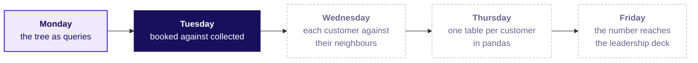
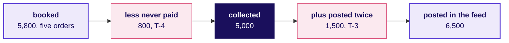

# What did Kalpa actually collect against what it booked in Q2, order by order, and how do you know nothing is counted twice?

**Week 2, Tuesday. Study notes, read after the session.** Anand Iyer, Kalpa Retail's finance
controller, asked for collected against booked for Q2, order by order and by channel, and the
platform lead warned that the payments feed sometimes posts a payment twice. The day answered him in
six chapters, each a harder question than the last, and ended on the checks that let the number leave
the team. Reading time: about 25 minutes.

---

## What can you now do?

1. Say, before running anything, which rows INNER, LEFT, RIGHT and FULL OUTER joins keep, drop and
   repeat, by asking what happens to an order with no payment and to a payment with no order.
2. Name the grain of each table before a join, and predict a join's row count from the keys alone.
3. Catch a fan-out with one count, and fix it by bringing the many side to one row per order before
   the join.
4. Write the reconciliation above a joined number, and walk booked to posted in a bridge whose moves
   each have a list of orders behind them.
5. List the unpaid orders with an anti-join, keep a condition on the payments table in ON, and tell a
   second instalment from a gateway retry by the order and the instalment together.
6. Build the page by channel a finance controller signs, with `coalesce` in the one place it belongs.
7. Write the checks that stop every wrong report the day met, and say what leaves the team on the day
   one of them fails.

---

## Where does today sit in the week?

**What the session covered.** Worked in full: Anand's ask and the platform lead's remark; the grain of
`orders` and `payments`; the four joins traced by hand on two invented tables; the fan-out on Kalpa's
Q2 and four ways to stop it, sized; the count reconciliation and the bridge from booked to posted; the
anti-join, the WHERE that empties it and the grain of a retry; the page by channel and the NULL that
leaves its gap; and the validation suite with the reporting-day rule. The escalated case asked for the
whole page on Kalpa's Q2, alone. Mentioned only: FULL OUTER JOIN as the tool for reconciling both
sides at once, and a window dedupe, which is Wednesday's tool.

```mermaid
flowchart LR
    M["<b>Monday</b><br/>the tree as queries"] --> T["<b>Tuesday</b><br/>booked against collected"]
    T --> W["<b>Wednesday</b><br/>each customer against<br/>their neighbours"]
    W --> H["<b>Thursday</b><br/>one table per customer<br/>in pandas"]
    H --> F["<b>Friday</b><br/>the number reaches<br/>the leadership deck"]
    classDef bet fill:#1A0F5C,stroke:#1A0F5C,color:#FFFFFF
    classDef known fill:#EEEAFB,stroke:#5B3FD6,color:#1A0F5C,stroke-width:2px
    classDef unknown fill:#FFFFFF,stroke:#B8B2D6,color:#6B6690,stroke-dasharray:4 3
    class T bet
    class M known
    class W,H,F unknown
```

The map of the week is the programme's own construction, drawn from the Week 2 plan: Monday is done,
today is the dark box, and the dashed boxes are still to come. Monday rebuilt Week 1's revenue tree as
queries on one table, `orders`, where one row is one order, so every sum was a sum of orders.

**The outcome tie.** Every later number this week is computed on joined tables, so the count check
you wrote today is the check they inherit: a list of members or a customer table is only as honest as
the join underneath it.

**What was left out.** Self-joins, CROSS JOIN beyond a mention, and how a database runs a join fast.
The afternoon's tentative IITGN faculty session W2-2, on intervals and t-tests, has its own material.

The retail story behind Anand's role, how a sale becomes cash and who checks it, is in the domain
dossier, `content/W01/D1/study-notes/C2_W01_D01_domain_retail_STUDENT.md`, sections 3 and 4. In one
line: the finance controller owns the books, the monthly close and the audit, and a figure restated in
front of the board is the cost he fears most.

---

## What is the one picture to remember?

The two invented tables the chapters traced hold five orders and seven payments, and the whole day
fits in one drawing of them.

| order_id | channel | amount | What happened to it |
|---|---|---|---|
| T-1 | app | 1,000 | Paid once, in full |
| T-2 | web | 2,000 | Paid in two instalments, 1,200 and 800 |
| T-3 | store | 1,500 | Paid once, and the gateway posted that payment twice |
| T-4 | app | 800 | Never paid |
| T-5 | store | 500 | Paid once, in full |

A seventh payment, P-7, pays 600 against T-9, an order that is not in the orders table.

```mermaid
flowchart LR
    B["<b>booked</b><br/>5,800, five orders"] --> U["<b>less never paid</b><br/>800, T-4"]
    U --> C["<b>collected</b><br/>5,000"]
    C --> R["<b>plus posted twice</b><br/>1,500, T-3"]
    R --> P["<b>posted in the feed</b><br/>6,500"]
    classDef known fill:#EEEAFB,stroke:#5B3FD6,color:#1A0F5C,stroke-width:2px
    classDef bad fill:#FBE9EF,stroke:#D63A6A,color:#1A0F5C
    classDef bet fill:#1A0F5C,stroke:#1A0F5C,color:#FFFFFF
    class B,P known
    class U,R bad
    class C bet
```

Booked comes from `orders` alone, posted from `payments` alone, and collected sits between them,
reached by moves that each have a list behind them. Anand asked for the dark box. Three words hold
all day: **booked** is every order at its amount, whatever its status; **collected** is the cash that
arrived, each payment counted once; **posted** is every payment row the feed holds, repeats included.

---

## When payments are attached to orders, which rows does each join keep, drop or repeat?

**Who needs the answer.** Anand's analyst, who audits the statement order by order, and you, since you
sign the collected number. A join that drops an unpaid order hides it from the collections team, and a
join that repeats a paid order sends them after a customer who paid in full.

**The questions on the way.** What is one row of each table? How many rows does each join return on
five orders? Which join answers Anand? What does a statement started from payments tell him? Can the
counts be predicted from the keys alone?

### What is one row of orders, and one row of payments?

The grain of a table is what one row stands for. In the warehouse, `orders` holds 1,000 rows and 1,000
order ids, so one row is one order. `payments` holds 1,428 rows and fewer distinct order ids than
rows, with at most two rows for one order id, so one row is one payment event and an order can own
two. Anand named one reason, instalments; the platform lead named another, a retry.

### Which of the four joins answers Anand?

Four options, run on the five invented orders and seven payments: INNER returns 6 rows and puts 4 of
the 5 orders on the statement; LEFT, orders first, returns 7 and all 5; RIGHT returns 7 and 4, keeping
P-7; FULL returns 8 and all 5, keeping both orphans. Every option runs in a few milliseconds, so speed
decides nothing, and the rows each keeps decide everything. The call is the LEFT JOIN with orders
first, the only option that keeps every booked order and nothing that is not an order. The fact that
would change it: a question about every payment the feed holds, which is the platform lead's in the
second case, starts from `payments`; a question about both sides at once is FULL.

### What does a statement that starts from payments tell Anand?

This is the chapter's trap. A hurried analyst reasons that collected money lives in `payments`, so the
statement should start there. On the invented tables it lists 4 of the 5 booked orders and 7,100 of
cash against 5,800 booked, so it reads as 122 percent collected. It answers another question, which
payment belongs to which order: T-4, the one order nobody paid, never reaches it, and the cash carries
600 from P-7 and 1,500 from T-3's repeat. The check reads no rupee: booked orders on the statement
against the orders table, 4 against 5, and lines with no booked order behind them, 1. The fix starts
from orders; T-4 then shows NULL where its payment would be, and the statement still has seven lines
for five orders.

### Can the row counts be predicted from the keys alone?

Yes, and it is the second route to use before any join on real data. For a key seen a times in
`orders` and b times in `payments`, INNER writes a x b rows; LEFT adds one row for every order key
that matched nothing, RIGHT one for every payment key that matched nothing, and FULL both. On the
invented tables the keys predict 6, 7, 7 and 8, the four counts the joins returned. The route fails
only when the join condition is more than key equality.

**The answer.** The LEFT JOIN with orders first keeps every booked order, and it still lists T-2 and
T-3 twice, so what a total does to an order that appears twice is chapter 2's question.

---

## Why does the first join on Kalpa's Q2 report nearly twice the bookings as collected, and how do we attach payments so that nothing counts twice?

**Who needs the answer.** Anand, who would read a collected figure twice his books as collections
running ahead and stand his collections team down; the data platform lead, who hears about a wrong
warehouse number first; and you, because the way chosen here carries every later chapter.

**The questions on the way.** Which orders own two payment rows? What does a first draft report? Why
is it wrong when every row is right? Which of four fixes, sized? Does the fix keep 462 orders? Do the
two tables, summed alone, agree?

### Which Kalpa orders own two payment rows, and why?

Every one of Q2's ten largest orders carries two payment rows, instalments 1 and 2: Kalpa settles its
large business invoices in two parts. KR-00595, a business order from the store channel, is booked at
Rs 4,01,000 and paid in instalments of Rs 2,40,600 and Rs 1,60,400. Two real payments, two rows, one
order.

### What does a first draft of collected report for Q2?

Q2 books 462 orders and Rs 9,84,00,000, Monday's number from `orders` alone. A teammate keeps every Q2
order with a LEFT JOIN and counts an order as collected, at its booked amount, whenever a payment row
sits beside it. The draft reports Rs 19,29,04,410 collected, 1.96 times booked, across 678 rows from
462 orders. Read as it stands, Kalpa collected Rs 9.45 crore more than it sold.

### Why is the first draft wrong when every row on it is right?

A sum over a join runs at the join's grain, here the payment, whatever column it names. KR-00595's
Rs 4,01,000 rides on both of its rows, so the draft counts Rs 8,02,000 for it. This is a **fan-out**:
a key that repeats on one side multiplies the rows of the other. Two checks catch it and neither needs
a second table: rows out against orders in, 678 against 462, and collected against booked, since cash
cannot exceed bookings.

### Which of four ways stops the double count, and what does each cost?

| Option | On Kalpa's Q2 |
|---|---|
| A. Payments to one row per order in a CTE, then the LEFT JOIN | 462 rows, booked Rs 9,84,00,000, error Rs 0 |
| B. `sum(DISTINCT o.amount)` after the join | Rs 9,63,67,220, losing Rs 20,32,780, because 243 of the 462 orders share their amount with another, across 97 amounts |
| C. A window dedupe of repeated postings, Wednesday's tool | still inflated, since every two-instalment order keeps two rows |
| D. Fix the feed | no change to the quarter Anand asked about |

A and B each take a few milliseconds, so the choice is about what each gets wrong. The call is A: one
row per order, booked exact, and a count of payment rows kept, so a repeat stays visible for chapter 4.
The fact that would change it: a feed carrying the gateway's own reference on every row, repeated on a
retry, would let a DISTINCT on that reference remove retries exactly; a question per payment, such as
matching each bank statement line, would make the payment the right grain.

### Do the two tables, each summed alone, agree with the fixed join?

The fixed join returns 462 rows and Rs 9,84,00,000 booked, Monday's figures to the rupee. The second
route never joins: booked from `orders` alone, and posted from `payments` alone restricted with `IN` to
Q2's order ids. Both equal the fixed join's totals, and since this route sums each table at its own
grain, it cannot fan out.

**The answer.** The first draft doubled because the order amount rode every payment row; one row per
order before the join keeps 462 orders and Rs 9,84,00,000, and the next question is whether every
booked order is still in the report.

---

## Once nothing counts twice, is every booked order still in the report, and can every rupee between booked and posted be named?

**Who needs the answer.** Anand, who asked which orders make the gap, so an order missing from the
report is an order nobody chases, and his analyst, who reads the reconciliation above the number. A
report that loses an order and carries a repeated payment can show a gap of zero, and nobody acts on a
zero.

**The questions on the way.** Can the report gain rows now? What does a plain JOIN draft report? Which
check catches it without a rupee? Which moves carry booked to posted? Does the bridge close on Q2? Does
a capped count reach the same collected?

### Which of four proofs shows Anand the gap is honest?

Four proofs, run on an invented draft with two errors at once: one number, booked less posted, shows a
gap of minus 1,500 and catches neither error; the count reconciliation, rows in and rows out, shows 4
of 5 orders and catches the dropped one; the bridge, with a list behind each move, catches both; the
whole statement catches both only if someone reads every line, 462 on Kalpa's Q2. The call is the count
first, since it needs no rupee, then the bridge. At the quarter's close, when auditors tick every
order, the statement travels as an appendix.

### What does a first draft with a plain JOIN report?

After chapter 2's fix a row of `orders` meets at most one row of payments, so the report can only lose
rows, never gain them; on Kalpa's Q2 it keeps 462 of 462. The trap is the shortest thing to type:
`JOIN`, which in SQL means INNER JOIN. On the invented tables it reports 4 orders, booked 5,000,
posted 6,500 and a gap of minus 1,500: fully collected, with a surplus. Two errors cancel into a
comfortable number: T-4 dropped out with its 800, and T-3's repeat put 1,500 inside posted. The check
is the count, 4 orders in the report against 5 in the table. The LEFT JOIN brings T-4 back, and the gap
reads minus 700, still one number for two different things.

### Which moves carry booked to what the feed posted?

A bridge walks from one total to another in named moves, each with the list of orders behind it:
**never paid**, booked where an order has no payment row at all; **paid short**, booked less collected
where collected is below booked; **posted twice**, posted less collected. On the invented tables:
booked 5,800, less 800 never paid, less nothing paid short, is collected 5,000; plus 1,500 posted
twice is posted 6,500. On Kalpa's Q2 the same bridge closes at every step and lands on the payments
table's own total for Q2 orders; each learner reads its six figures on their own page.

### Does collected come out the same when each order is capped at its booked amount?

The second route never reads an instalment number: for each paid order it takes the smaller of what
the feed posted and what was booked, 5,000 on the invented tables again, and the same figure on Kalpa's
Q2. The two methods fail in different places: the instalment method would count a retry written under
a new instalment number, and the cap would throw away a genuine overpayment. Where they agree, neither
blind spot is in the data.

**The answer.** Every Q2 order is still in the report, the count proves it without a rupee, and every
rupee between booked and posted sits in a named move, which raises the question of which orders stand
behind each move.

---

## Which Q2 orders were never paid, and which payments did the gateway post twice?

**Who needs the answer.** The collections team, who ring every customer on the unpaid list, and the
platform lead and Finance, who reverse or refund what is on the double-paid list. A wrong unpaid list
chases a customer who paid or misses one who did not; a wrong double-paid list reverses a real second
instalment and rings a business buyer who paid on time.

**The questions on the way.** Which orders have no payment at all? What happens when "paid in Q2" goes
in WHERE? Where does that condition belong? What does HAVING COUNT(*) > 1 flag? What makes a retry a
retry? Do a second method and a second list agree?

### Which of four ways finds the unpaid orders?

An anti-join keeps the rows of one table with no partner in the other. Four ways to write one: the
LEFT JOIN that keeps only the misses, `WHERE p.order_id IS NULL`; NOT EXISTS; NOT IN; and EXCEPT. All
four take a few milliseconds and agree on Kalpa's Q2 today, so what separates them is what each
assumes. NOT IN is the one to avoid: `x NOT IN (a, b, NULL)` is never true, so one NULL order id in the
feed makes it return no rows at all, without an error. The call is the LEFT JOIN, because the unpaid
list is literally the report's own rows with nothing on the payments side, with every column Anand
wants beside each order. On the invented tables it returns T-4 alone, 800, the never-paid bar exactly.

### What happens to that list when "paid in Q2" goes into WHERE?

This is the chapter's first trap. Anand talks about cash that came in during Q2, so a teammate adds
`WHERE p.paid_date BETWEEN '2026-07-01' AND '2026-09-30'` beside the anti-join's condition. The list
comes back empty, from six joined rows, the INNER join's count. After the LEFT JOIN, T-4's row carries
NULL in every payment column; NULL BETWEEN two dates is unknown, and WHERE keeps only true rows, so T-4
is thrown away after the join kept it. The check: the list's total, 0, against its bar, 800. The fix
moves the condition into ON, which decides which payments count as a match before the join: 7 rows,
and T-4 is back. The PostgreSQL manual puts it the same way: a restriction in ON is processed before
the join, one in WHERE after it, and the difference matters a lot with outer joins.

### Which orders does HAVING COUNT(*) > 1 flag, and are they double-paid?

The second trap reaches for Monday's tool: group Q2's payments by order and keep the orders with more
than one row. It flags 216 Q2 orders, every one of the ten largest invoices among them, because two
instalments are two rows too; on the invented tables it flags T-2 and T-3 and claims 2,300 posted
beyond one payment against a bar of 1,500. A note to reverse the second payment on all 216 would
reverse real second instalments on Kalpa's largest business invoices. A retry is the same order and
instalment posted twice, so the fix groups by both: on the invented tables the list is T-3's
instalment 1, 1,500 beyond one payment, the bar exactly. On Kalpa's Q2, each learner builds the list
and checks it against the bar, and a third query lists the payments that match no order at all.

### Do a second method and a second list reach the same orders?

Yes. NOT EXISTS, which never builds the joined rows, gives the same unpaid orders, and a route that
never reads an instalment number, an order whose posted cash exceeds its booking, flags the same
double-paid orders. The instalment method would miss a retry filed under a new instalment number, and
the booked method would miss a retry on an order paid short; when both agree, neither gap is in the
data.

**The answer.** The unpaid list is the report's own LEFT JOIN, the condition on payments sits in ON,
and a retry is one order and instalment twice; next comes the page Anand signs.

---

## What goes on the report by channel that Anand signs, and does its gap column tell the truth?

**Who needs the answer.** Anand, who signs the page and sends it to the CEO's Monday page, and the
channel heads, who chase their own unpaid orders from it. A gap column that reads zero stands every one
of them down, and a page that does not add back to the bridge cannot be defended when his analyst
audits it.

**The questions on the way.** What must a line per channel carry? Which of four forms fits? What does
the gap column say when each order's gap is added up? Why is it wrong? Does the fixed page add back to
the bridge? Does the unpaid list by channel give the same gap?

### Which of four report forms fits a finance controller?

One number puts 1 line in front of Anand and lets him act on nothing. A table by channel puts 4 and
tells a channel to chase without saying whom. The table by channel with the reconciliation above it
and the two lists beneath puts 8 lines and the lists, and lets him act by channel and by order and
audit every figure. The whole statement puts 462 lines and answers everything once found. The call is
the third, with a definition line above it: collected is cash received against Q2 orders, each payment
counted once, with posted twice and refunds shown separately. On Kalpa's Q2, app books Rs 4,25,90,270
over 153 orders, store Rs 3,21,48,730 over 159 and web Rs 2,36,61,000 over 150, adding to Rs 9,84,00,000.

### What does the gap column say when each order's gap is added up?

This is the chapter's trap. Anand asked "order by order", so a teammate computes each order's gap,
booked less collected, and sums it by channel. The column says 0 on every channel, on the invented
tables and on Kalpa's Q2. An unpaid order has no collected figure, so `booked - NULL` is NULL, and
`sum()` skips NULLs without saying so, the way Monday's AVG skipped them. The unpaid orders, the very
orders the gap exists to show, drop out of it, and since every paid order at Kalpa was paid in full,
what remains adds to zero. The check: the gap against booked less collected as two separate sums, 1,800
less 1,000 for invented app, which is 800 against a column saying 0. The fix says the business meaning
on purpose, `sum(booked - coalesce(collected, 0))`: an order with no payment collected nothing.

### Does the fixed page add back to the bridge, and does a second route agree?

On Kalpa's Q2 the page's orders add to 462, its booked to Rs 9,84,00,000, its gaps to never paid plus
paid short, and its posted-twice column to its bar. The second route groups chapter 4's unpaid list by
channel and never computes a per-order gap, so a NULL cannot fall out of it; it agrees on every
channel. Every refund row in the warehouse sits on a Q1 order, so the Q2 page says so in one line, and
refunds belong to tonight's take-home.

**The answer.** The page is one line per channel under a definition line, reconciled above and with
both lists beneath, and its gap uses `coalesce` on collected; what must pass every Monday before it
leaves is the last question.

---

## Which checks must pass before the collected number leaves the team, and what does Anand get when one fails at the end of reporting day?

**Who needs the answer.** Kavya, who reviews every number before it leaves the team; Anand, who forwards
it; and you, who sign it. A validation that cannot fail puts a PASS stamp on a wrong number, and a
stamped wrong number is harder to withdraw than an unstamped one.

**The questions on the way.** Do the hurried checks pass a report that hides an unpaid order? Which
checks tie back to the tables? Does the suite fail every wrong report of the day? Does it pass Kalpa's
page? Does a second tool agree? What does Anand get when a check fails late?

### Why do the hurried checks pass a report that hides an order?

Three plausibility checks, collected at most booked, a gap that is not negative and every channel
present, pass the plain JOIN report 3 of 3: its 4 orders book 5,000, collect 5,000 and show a gap of 0,
all consistent with each other. Each check tests the report against itself, so none can see what the
report left out. The fix is five tie-back checks, each recomputing one figure from one table alone:
orders against `orders`, booked against `orders`, the gap against booked less collected, the gap
against the unpaid list, and collected plus posted twice against posted from `payments`. On the plain
JOIN report three of them fail.

### Does the suite fail every wrong report the day met?

The day produced five plausible wrong reports: the fan-out draft, the plain JOIN, the quarter in WHERE,
each order's gap added up, and posted read as collected. The plausibility suite lets four through and
stops only the last, whose collected of 6,500 exceeds booked. The fan-out draft is the sharpest case:
it inflates booked and collected together, so its gap is right, and only the orders and booked checks
stop it. The tie-back suite fails every wrong report on at least one check and passes the true report
on all five. On Kalpa's Q2 page all five pass: 462 against 462, Rs 9,84,00,000 against Rs 9,84,00,000,
and the gap and the retries tied to their lists.

### Does a second tool, working from the raw rows, agree?

Two plain SELECTs fetch each table's rows, and Python counts them with Week 1's accumulator, keyed by
order and instalment so that a repeat overwrites itself and counts once. It shares no join, no GROUP BY
and no NULL rule with the SQL page, and it reaches the same orders, booked, collected and gap on both
the invented tables and Kalpa's Q2. A settlement file from the gateway would be stronger still, since
it comes from outside Kalpa's own tables; Wirecard's collapse in 2020 turned on checks that read a
company's own records back to it.

### What does Anand get when a check fails at the end of reporting day?

Booked always leaves, because it ties to the orders table alone; an unreconciled collected figure never
leaves; and the open line goes with it: which check failed, what it means and when it will close. The
owner hears the same day: you for the joins and the gap, the platform lead when collected plus posted
twice stops matching posted, which means the feed changed.

**The answer to the day.** Q2 booked Rs 9,84,00,000; collected, each payment counted once, is the
figure on your own page; the gap is the orders nobody paid, named by channel; the repeats and the
payments with no order go to the platform lead; and every figure ties back to the two tables through
checks that have each been seen to fail.

---

## Where does this show up in the work?

| What you are looking at | What you check first | What it costs to get wrong |
|---|---|---|
| A dashboard tile shows revenue up sharply the week a new table was joined into its source | Rows before and after the join, and whether the new table's key repeats | A board pack reporting growth that is a fan-out, and a correction issued under the CFO's name |
| Finance asks for collections against sales for the quarter's close | That the join is LEFT from orders, no payment condition sits in WHERE, and booked after the join equals booked from orders | Unpaid invoices dropped from the list, so nobody chases them before they age |
| An operations lead forwards a list of "customers charged twice" for refunds | The grain the duplicate test ran at, and whether it separates instalments from retries | Refunds paid against real second instalments: money sent out that was owed in |

---

## Can you answer these without writing?

Pick a letter for each, then check the key below.

1. Five orders, seven payments, and every payment matches an order. How many rows can a LEFT JOIN from
   orders return? a) exactly five; b) exactly seven; c) seven or more; d) twelve.
2. Booked after your join is 1.5 times booked from the orders table. What do you check first? a) the
   date filter; b) whether the payments key repeats; c) the currency of the amounts; d) the channel names.
3. A LEFT JOIN from orders to payments has `WHERE p.method = 'card'`. What happens to an order with no
   payment? a) it stays with NULLs; b) it is dropped; c) it appears twice; d) it raises an error.
4. One order has instalment 1 for Rs 1,200 and instalment 2 for Rs 800. What is it? a) a retry; b) a
   fan-out bug in the table; c) a legitimate instalment pair; d) an orphan payment.
5. A report must keep every order and show every payment that matches no order. Which join? a) FULL
   OUTER; b) INNER; c) LEFT from orders; d) RIGHT from orders.
6. Where does a filter on a group's total go? a) WHERE; b) ON; c) HAVING; d) ORDER BY.

Key: 1b 2b 3b 4c 5a 6c. If you missed 1, reread chapter 1's key counts: with every payment matched and
none orphaned, each order appears once per payment and never alone, so seven rows. Item 6 comes from
Monday, where WHERE filters rows before grouping and HAVING filters the groups after it.

---

## Which interview questions does today answer?

**[S] INNER against LEFT join: what does each drop or keep?** Tested: whether you frame a join by its
unmatched rows. Strong: INNER keeps only rows that found a match on both sides, so an order with no
payment and a payment with no order both vanish; LEFT keeps every row of the left table, with NULLs
where the right side found nothing. Both repeat a left row once per matching right row, which is where
a total goes wrong. Then the choice in business words: Anand asked about every order, paid or not, so
the report is a LEFT JOIN from orders. Weak: a Venn diagram, which hides that a join can repeat rows.

**[S] Your join grew the row count; name the cause and the check.** Strong: the join key repeats on the
other side, so each left row appears once per match; an order paid in two instalments appears twice.
Count rows before and after, count the right side's rows per key with `GROUP BY key HAVING count(*) > 1`,
then bring the many side to the join's grain in a CTE and show rows in equal rows out. Weak: "use
DISTINCT", which hides the symptom and merges two genuine rows that happen to share a value.

**[F] How do you find orders with no payment?** Strong: LEFT JOIN payments and keep the rows whose
payment key IS NULL, or NOT EXISTS, which reads as the business sentence; check the list's total
against booked less collected for the orders never paid; avoid NOT IN, which returns nothing once the
subquery holds a NULL. Weak: an INNER JOIN and an eyeball of what is missing.

**[F] Revenue doubled after a join and every row looks fine; where do you look?** Strong: every row
looks fine because every row is real; the problem is how often each order appears. Compare rows out
with rows in, find the key that repeats, and check which side's amount was summed. Then fix at the
grain and show booked back at its source value, with each table summed alone as the second route.
Weak: reading rows one by one for a bad value.

**[D] Design the validation you run before a joined number reaches Finance, and say what you do when
it fails at the end of reporting day.** Strong: four layers, run every time. The counts: rows in
against rows out, and orders on the report against the table. The tie-backs: booked from `orders`
alone, posted from `payments` alone, and each bar of the bridge equal to its list. One independent
recomputation, in another tool from the raw rows, or against the gateway's settlement file when there
is one. And a test of the suite itself against the known wrong reports, each seen to fail. When a
check fails late on reporting day, send what reconciles, booked, with the open line stated; hold
collected; tell the owner that day. Weak: sending the number with a caveat in small print.

**[S] When is an INNER join the honest choice?** Strong: when the unmatched rows are outside the
question by definition and the output says so, such as days to the first payment for paid orders.
For Anand's question it is dishonest, since his question is about every booked order.

**[F] A filter on the right-hand table of a LEFT JOIN: WHERE or ON?** Strong: ON, where it decides which
right rows attach and every left row survives; in WHERE it runs after the join, rejects the NULLs of
unmatched rows and turns the LEFT JOIN into an INNER one. The one right-table condition that belongs in
WHERE is the anti-join's `IS NULL`.

**[F] HAVING COUNT(*) > 1 on payments by order: what does it find, and what does it wrongly include?**
Strong: every order with more than one payment row, which wrongly includes every legitimate
multi-instalment order. A retry is the same instalment posted again, so group by order and instalment,
and prove the list by its surplus equalling posted less collected.

**[D] Two errors cancel and the total looks right: how would you find them?** Strong: never let a total
prove itself. Count first, since rows in against rows out finds a dropped or repeated row even when the
rupees balance; then split the difference into moves with definitions, so an unpaid order and a
repeated payment each get their own bar.

**[D] Anand says the gap is too small to matter: how do you decide whether to chase it?** Strong: size
it before judging it. Split it by channel and by order, since a small total can be one large invoice;
check how old each unpaid order is, since an order unpaid for weeks is overdue rather than early; set
the cost of chasing against the cash each order carries; recommend chasing the large and old ones
first, and say what you would drop.

---

## Which six lines are worth keeping?

| The line |
|---|
| A join is done when its row count is explained: rows in, rows out, the difference named. |
| Start from the table whose every row must survive, and name its grain. |
| Bring the many side to the grain of the question before you join. |
| In a LEFT JOIN, a condition on the right-hand table goes in ON. |
| Two payment rows are not a double payment: a retry is one order and instalment, twice. |
| A check is worth its power to fail: tie every figure back to one table alone. |

---

## What does tomorrow ask?

Marketing asks for the top fifty customers by Q2 revenue in each segment, and a flag on anyone whose
monthly spend has fallen for two months running. Today's joins give each customer their orders and
payments; tomorrow's question compares each customer with their neighbours and with their own past,
and it keeps the rows while it does so. The pre-read ships tonight.

---

## Which words did today use?

| Term | What it means here | Where it appeared | Example |
|---|---|---|---|
| Grain | What one row of a table stands for, said before any join | Chapter 1 | One order per row in `orders`; one payment event per row in `payments` |
| INNER JOIN | Keeps only the rows that match on both sides | Chapter 1 | Six rows on the invented tables; T-4 and P-7 vanish |
| LEFT JOIN | Keeps every row of the first table, with NULLs where nothing matched | Chapters 1 and 3 | Seven rows; T-4 stays with an empty payment |
| FULL OUTER JOIN | Keeps unmatched rows from both sides | Chapter 1 | Eight rows; T-4 and P-7 both stay |
| Fan-out | A join repeating a row once per match on a side whose key repeats | Chapter 2 | 462 Q2 orders become 678 rows, and summed booked nearly doubles |
| Booked | Every order at its amount, whatever its status | All day | Rs 9,84,00,000 over 462 Q2 orders |
| Collected | The cash that arrived, each payment counted once | All day | 5,000 on the invented tables |
| Posted | Every payment row the feed holds, repeats included | Chapters 2 and 3 | 6,500 on the invented tables |
| Row-count reconciliation | Rows in, rows out and the difference named, above the number | Chapter 3 | 462 in, 462 out after the fix |
| Revenue bridge | Booked walked to posted in named moves, each a list of orders | Chapter 3 | 5,800 less 800 is 5,000, plus 1,500 is 6,500 |
| Anti-join | The rows of one table with no partner in the other | Chapter 4 | The unpaid list: T-4 on the invented tables |
| Gateway retry | The same order and instalment posted twice by the payment feed | Chapter 4 | T-3's instalment 1, P-4 and P-5 |
| coalesce | Returns its first argument that is not NULL | Chapter 5 | `coalesce(collected, 0)` keeps an unpaid order in the gap |
| Tie-back check | A figure recomputed from one source table alone and compared | Chapter 6 | Booked on the page against booked from `orders` |

---

## Where can you go deeper?

| Order | What | Time | Why this one |
|---|---|---|---|
| 1 | Data with Baraa, "SQL Joins Basics (Visually Explained)", SQL Course 8, YouTube, https://www.youtube.com/watch?v=aY7z4HcHm5M (checked 30 Sep 2026) | 40 minutes | The four joins drawn row by row, the way the invented tables were traced |
| 2 | PostgreSQL 16 documentation, 2.6 Joins Between Tables, https://www.postgresql.org/docs/16/tutorial-join.html (checked 30 Sep 2026) | 15 minutes | The outer join introduced on a row with no match, in the database you use |
| 3 | PostgreSQL 16 documentation, 7.2.1.1 Joined Tables, https://www.postgresql.org/docs/16/queries-table-expressions.html (checked 30 Sep 2026) | 20 minutes | The documented difference between a condition in ON and one in WHERE |
| 4 | jOOQ blog, "The Difference Between SQL's JOIN .. ON Clause and the Where Clause", 9 April 2019, https://blog.jooq.org/the-difference-between-sqls-join-on-clause-and-the-where-clause/ (checked 30 Sep 2026) | 10 minutes | The same trap from a library author who meets it in other people's queries |
| 5 | SQLBolt, lessons 6 to 8, https://sqlbolt.com/lesson/select_queries_with_joins, https://sqlbolt.com/lesson/select_queries_with_outer_joins and https://sqlbolt.com/lesson/select_queries_with_nulls (checked 30 Sep 2026) | 30 minutes | Tonight's practice: joins, outer joins and the NULLs they create |
| 6 | PostgreSQL Exercises, the joins category, https://pgexercises.com/questions/joins/ (checked 30 Sep 2026) | 40 minutes | Stretch practice on a second schema, with worked answers |
