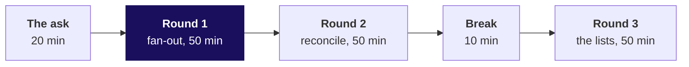
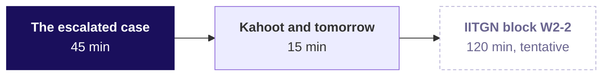

# Day sheet: Week 2, Tuesday. Booked against collected, without lying

**TRAINER ONLY.** Nothing on this page reaches a learner.

Posts to <!-- sync:module:W02/D2 -->Module 1: Foundations of AI and Data<!-- /sync:module:W02/D2 -->, on <!-- sync:day-date:W02/D2 -->Tue 13 Oct 2026<!-- /sync:day-date:W02/D2 -->.

<!-- sync:faculty-day:W02/D2 -->
**IITGN faculty block W2-2 (tentative), 120 minutes, after this row's applied core.** Faculty: to be confirmed by IIT Gandhinagar.

TOPIC: Confidence intervals and the t-test family: an interval for a mean and for a proportion; one-sample, two-sample and paired t-tests; the chi-square test at recognition depth; choosing the right test.
PICKS UP WHERE THE ROW STOPS: Week 1 Thursday named the confidence interval and the t-test and built neither.
CONNECTS TO KALPA: the Retail-Plus gap and the Student segment's 40 percent on twelve orders each get an interval.
BY THE END: a learner can build and read a 95 percent interval, pick a test from the shape of the data, and say what the interval adds to the p-value.
DOES NOT REPEAT: the shuffle test itself.
<!-- /sync:faculty-day:W02/D2 -->

| | |
|---|---|
| **Start from** | Monday's suite and its booked figure of Rs 9,84,00,000 for Q2. Open on Anand's reply and the platform lead's remark, then draw the join picture before any query runs. |
| **Go as far as** | Every learner ships the report by channel with a written count reconciliation, the unpaid list and the double-paid list. |
| **Stop before** | Self-joins, CROSS JOIN beyond a one-line mention, join algorithms and performance. FULL OUTER is named and parked. Your row stops where the IITGN block starts, so no statistics today. |
| **Comes later** | Wednesday ranks customers on the joined table with window functions. Thursday meets this fan-out again as pandas `validate=`, the loud version of today's count check. |
| **Cut first** | FULL OUTER, to one sentence (S11's third card). Never cut the count reconciliation, the fan-out or the WHERE-against-ON trap. |

The day is a faculty day. You have the 180-minute morning and the first 60 minutes of the
afternoon; the tentative IITGN block W2-2 takes the last 120 minutes. There is no second case and
no interview drill slot today, so the interview questions ride on the round strips, and learners
practise them aloud in pairs tonight.

---

## Morning, 180 minutes

| Part | Slides | Beside it | What must land | If short of time |
|---|---|---|---|---|
| The ask, 20 | S1 to S6 | The board: S5's picture stays up all day | Collected means cash counted once (S4, answer b); every join asks about the rows that miss; the five-step habit | S3 and S4 become one minute of you saying the answer |
| Round 1, 50 | S7 to S19 | `sql/..._01_tiny_tables`, `sql/..._02_fanout`, notebook 1, the companion's round 1 walk | Six, seven, seven and eight rows traced by hand; the room finds the doubling before you name fan-out; the fix at order grain closes 462 in, 462 out | S17 and S18 become self-study; never S13 to S16 |
| Round 2, 50 | S20 to S28 | `sql/..._03_reconcile`, notebook 2, the companion's bridge | The reconciliation written above the number; the INNER trap's minus 1,500 on the tiny tables; the bridge; the room reconciles Q2 itself (S27) | S25 folds into S26 |
| Round 3, 50 | S29 to S39 | `sql/..._04_lists`, notebook 3 | WHERE on paid_date turns LEFT into INNER; the anti-join; 216 orders flagged by HAVING at the wrong grain, fixed by order and instalment; the room builds both lists | S39 becomes a pointer; never S30 to S32 |

A round runs: the question and its picture (about 8), the demonstration (about 12), the trap and
its wrong number (about 12), the room's harder variant (about 12), and Kavya's review (about 6).

**Checkpoints, one learner each, under thirty seconds.** After round 1: why did collected come out
at nearly twice booked? After round 2: say the four lines of the reconciliation for Q2 without
reading the rupees. After round 3: what makes a retry a retry in this feed?

---

## Afternoon, the trainer's 60 minutes

| Part | Slides | Beside it | What must land | If short of time |
|---|---|---|---|---|
| The brief, 5 | half two, S1 to S4 | `exercises/unguided/C2_W02_D02_case_STUDENT.md`, `sql/..._05_case_start`, the case notebook | Five parts, the definition of done on S3, the four-part sentence | Read S2's timeline only |
| The room alone, 30 | S3 stays up | Nothing else; the support TA answers environment problems only | Parts 1 and 2 inside 15 minutes; an open line in the reconciliation beats an unreconciled number | Nothing; start it on time |
| The debrief, 10 | S5, S6 | Screens you noted while walking the room | Each of the four wrong answers met by at least one learner, and the check that caught it said aloud | S6's interview answer to one sentence |
| Kahoot, 9 | S7 | `kahoot/C2_W02_D02_quiz_STUDENT.md` | Any item below 60 percent explained by a learner who got it | Drop the return question |
| Close, 6 | S8, D9, S10, S11 | The practice lab set and the take-home | The five crux lines read aloud; tonight's work; Wednesday's message read and left open | D9 stays self-study |

Release `exercises/solutions/` at the end of the case. The solutions carry the queries and the
checks, never the plant values, so they are safe to release before the lab.

---

## Every trap, with its exact wrong number

| Round | The hurried query | The wrong number | What it would have misled | The check that catches it | The fix and what changed |
|---|---|---|---|---|---|
| 1 | `SUM(o.amount)` over `orders JOIN payments`, Q2 | Rs 19,29,04,410 "collected" (app Rs 8,50,36,620; store Rs 6,22,48,550; web Rs 4,56,19,240), 1.96 times booked | Collections stood down: "we collected ahead of bookings" | 462 orders in, 678 rows out on the LEFT join; collected above booked | Payments grouped to one row per order first; 216 repeated rows gone; order-side sum back to Rs 9,84,00,000 |
| 1, variant | `SUM(o.amount), SUM(p.amount)` from one LEFT join, by channel | Booked Rs 19,46,59,340, collected Rs 9,66,65,820, "49.7 percent collected" (app 50.1, store 49.4, web 49.3) | A collections panic over Rs 9.8 crore never owed | Booked after the join against Monday's booked | The same grain fix on the booked side |
| 2 | INNER join to payments grouped by order, Q2 | Booked Rs 9,66,45,070, collected Rs 9,66,65,820, gap minus Rs 20,750 (app minus 7,620; store minus 5,840; web minus 7,290); tiny tables: minus 1,500 on 4 of 5 orders | "There is no gap, Anand"; nobody chases Rs 17,54,930 of unpaid invoices | 432 orders in the report against 462 in the quarter | LEFT JOIN with COALESCE: 462 rows; the gap then reads Rs 17,34,180 until the retries come out in round 3 |
| 3 | LEFT JOIN with `WHERE p.paid_date BETWEEN '2026-07-01' AND '2026-09-30'` | 648 rows, 432 orders, the same numbers as the INNER report; the unpaid list is empty; tiny tables: 6 rows, T-4 gone | "Every Q2 order was paid within the quarter" | Rows out, counted as orders, against 462 | The date condition moves into ON; all 462 orders return and the 30 unpaid ones carry NULL |
| 3 | `GROUP BY order_id HAVING count(*) > 1`, Q2 | 216 orders, Rs 9,62,59,340 booked, Rs 9,62,80,090 posted | A refund review of Rs 9.6 crore of legitimate second instalments | The instalment pattern (step B4 of sql 04): 188 orders are instalments 1 and 2, 28 are instalment 1 twice | Group by order and instalment: 28 retries, surplus Rs 20,750 |

The WHERE-against-ON behaviour was checked on PostgreSQL 16.13 on 29 September 2026. The spine's
check used `p.status = 'ok'`; the v4 payments table has no status column, so the pack stages the
same failure with the quarter cut-off on `paid_date`, which is the filter a hurried analyst adds for
"collected in Q2". Run the round 2 and round 3 Kalpa versions live from `sql/..._03` part B and
`sql/..._04` part B; the STUDENT files show those two traps exactly only on the invented tiny tables.

---

## What is planted, and what the room should find

The discovery is the lesson, and naming a plant spends it. Nothing in any learner file names these.

| Planted | Where it is | What the room should do | If nobody finds it |
|---|---|---|---|
| 30 delivered Q2 orders never paid, Rs 17,54,930 | Spread across the whole quarter; two are large Business invoices, KR-00577 (store, Rs 9,27,000, 21 July) and KR-00582 (web, Rs 7,70,000, 21 September); the rest are Retail-Core orders between Rs 870 and Rs 2,930 | Count orders in the INNER report against 462, then run the anti-join | Ask the room to count the orders in their report. Do not name the number. |
| 50 gateway retries: the same instalment posted twice, 22 on Q1 orders and 28 on Q2 orders | Card, instalment 1, small orders; Q2 surplus Rs 20,750 (app 10 orders, Rs 7,620; store 9, Rs 5,840; web 9, Rs 7,290) | Notice collected as posted exceeds collected, then group by order and instalment | Ask what distinguishes the second row of a retry from a second instalment. |
| 8 orphan payments | KR-90000 to KR-90007, paid 14 August, wallet, Rs 24,680 in total | Account for every one of the 1,428 payment rows (step B5 of sql 04, part 5 of the case) | Ask whether 772 plus 648 makes 1,428. |
| 400 orders paid in two instalments (not a plant, the reason the fan-out doubles) | The largest orders; 188 of them in Q2 | See them fall out of the double-paid list once the grain is right | They meet it in round 3 whether they look or not |

Every paid order in the feed is paid within 0 to 2 days of its order date, so an unpaid order from
July is overdue rather than early. This is the evidence for the caveat in the two sentences.

---

## The numbers, so you are never caught out

| Measure, Q2 | app | store | web | Total |
|---|---|---|---|---|
| Orders | 153 | 159 | 150 | 462 |
| Booked | Rs 4,25,90,270 | Rs 3,21,48,730 | Rs 2,36,61,000 | Rs 9,84,00,000 |
| Collected, each payment once | Rs 4,25,82,150 | Rs 3,11,90,920 | Rs 2,28,72,000 | Rs 9,66,45,070 |
| Gap | Rs 8,120 | Rs 9,57,810 | Rs 7,89,000 | Rs 17,54,930 |
| Collected share | 99.98 percent | 97.02 percent | 96.67 percent | 98.22 percent |
| Unpaid orders | 4 | 17 | 9 | 30 |
| Retried orders, surplus | 10, Rs 7,620 | 9, Rs 5,840 | 9, Rs 7,290 | 28, Rs 20,750 |
| Posted in the feed | Rs 4,25,89,770 | Rs 3,11,96,760 | Rs 2,28,79,290 | Rs 9,66,65,820 |
| LEFT join rows, raw payments | 229 | 226 | 223 | 678 |
| INNER join rows, raw payments | 225 | 209 | 214 | 648 |

**The bridge.** Booked Rs 9,84,00,000, less never paid Rs 17,54,930, is collected Rs 9,66,45,070;
plus posted twice Rs 20,750 is posted in the feed Rs 9,66,65,820. The gap equals the unpaid list
to the rupee on every channel.

**Payment rows.** 772 on Q1 orders, 648 on Q2 orders and 8 on no order make 1,428. The whole table's
LEFT join returns 1,450 rows from 1,000 orders: 520 paid once, 400 in two instalments, 50 retried
and 30 unpaid. Q1 is Rs 10,00,00,000 booked with nothing unpaid. Refunds: 12 rows, all on Q1 orders,
so Q2's report says so in one line.

**The tiny tables, invented.** Booked 5,800; collected 5,000; posted 6,500; gap 800, which is T-4.
INNER 6 rows, LEFT 7, RIGHT 7, FULL 8. Fan-out 8,500. INNER report gap minus 1,500 on 4 orders;
LEFT fix alone minus 700.

---

## The interview questions, answered in one breath

| Tag | Question | The answer in one breath |
|---|---|---|
| [S] | INNER against LEFT join: what does each drop or keep? | INNER keeps only matched rows; LEFT keeps every left row with NULLs where nothing matched; both repeat a left row once per matching right row. |
| [S] | Your join grew the row count; name the cause and the check. | A key that repeats on the right table; count rows before and after, and `GROUP BY key HAVING count(*) > 1` on the right table to find the repeats. |
| [F] | How do you find orders with no payment? | A LEFT JOIN with `IS NULL` on the right key, or `NOT EXISTS`, and a check that the list's booked total equals the gap. |
| [F] | Revenue doubled after a join and every row looks fine; where do you look? | At the grain: each row is right and the sum is at the payment's grain, so aggregate the many side to the key before joining. |
| [D] | Design the validation you run before a joined number reaches Finance, and say what you do when it fails at 5 pm on reporting day. | Rows in against rows out, the total recomputed from the source, the gap equal to a named list, the bridge closing; when it fails late, ship booked with the open line named and hold collected. |
| [F] | A filter on the right-hand table of a LEFT JOIN: WHERE or ON, and what changes? | ON, because WHERE runs after the join and drops the NULL rows, which turns the LEFT JOIN into an INNER one. |
| [F] | HAVING COUNT(*) > 1 on payments by order: what does it find, and what does it wrongly include? | Every order with more than one payment row, which wrongly includes legitimate instalments; the retry grain is order and instalment. |
| [S] | When is an INNER join the honest choice? | When unmatched rows are out of the question by definition, such as "what do paid orders look like", and the report says so. |
| [F] | How do you reconcile a total after a join back to its source table? | Recompute it from the source alone and explain every rupee of difference as a named move in a bridge. |
| [D] | Anand says the gap is too small to matter; how do you decide whether to chase it? | Size it by channel and order, since Rs 17.5 lakh is two corporate invoices; check age, since a July order is overdue; weigh the cost of chasing against the cash. |
| [S] | What does a FULL OUTER JOIN add, and when would you reach for it? | Both sides' orphans; it is the reconciliation join for two feeds, such as orders against payments when either can hold a row the other lacks. |

---

## The practice lab, the take-home and the Kahoot

**The practice lab.** The set is `exercises/practice/C2_W02_D02_lab_STUDENT.md` and the TA note is
`trainer/C2_W02_D02_lab_note_TRAINER.md`, which says where learners stall and the one hint per
problem. The last problem runs the day's reconciliation on Q1, where the room meets the Q1 retries
and no unpaid orders; its solution gives the invariants, never the Q1 counts.

**The take-home.** See the take-home section below for its plants and expected numbers.

**The Kahoot.** Eight items, the return question from Monday included, in `kahoot/`.

---

## Which file serves which moment

| Moment | File |
|---|---|
| The whole morning, projected | `slides/C2_W02_D02_half1_STUDENT.pptx` |
| The afternoon, projected | `slides/C2_W02_D02_half2_STUDENT.pptx` |
| Round 1 live | `sql/C2_W02_D02_01_tiny_tables_STUDENT.sql`, `sql/C2_W02_D02_02_fanout_STUDENT.sql`, `notebooks/C2_W02_D02_01_fanout_STUDENT.ipynb` |
| Round 2 live | `sql/C2_W02_D02_03_reconcile_STUDENT.sql`, `notebooks/C2_W02_D02_02_reconcile_STUDENT.ipynb` |
| Round 3 live | `sql/C2_W02_D02_04_lists_STUDENT.sql`, `notebooks/C2_W02_D02_03_lists_STUDENT.ipynb` |
| One assumption changed at a time | `demos/C2_W02_D02_collected_STUDENT.html` |
| The rounds' scenario sets | `exercises/unguided/` fanout, reconcile and lists sets |
| The escalated case | `exercises/unguided/C2_W02_D02_case_STUDENT.md`, `sql/C2_W02_D02_05_case_start_STUDENT.sql`, `notebooks/C2_W02_D02_case_STUDENT.ipynb` |
| Your key for the case, with every real output | `trainer/C2_W02_D02_case_key_TRAINER.ipynb` |
| Released at the close | `exercises/solutions/` |
| The practice lab | `exercises/practice/C2_W02_D02_lab_STUDENT.md` |
| Tonight | `takehome/`, `study-notes/`, `cheatsheets/`, `preread/` |
