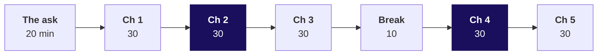
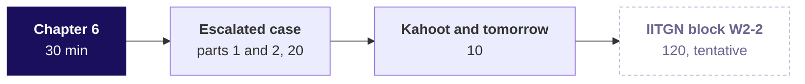

# What did Kalpa actually collect against what it booked in Q2, and how do we know nothing is counted twice?

**TRAINER ONLY. The Week 2 Tuesday day sheet.** Nothing on this page reaches a learner.

Posts to <!-- sync:module:W02/D2 -->Module 1: Foundations of AI and Data<!-- /sync:module:W02/D2 -->, on <!-- sync:day-date:W02/D2 -->Tue 13 Oct 2026<!-- /sync:day-date:W02/D2 -->.

<!-- sync:faculty-day:W02/D2 -->
**IITGN faculty block W2-2 (tentative), 120 minutes, after this row's applied core.** Faculty: to be confirmed by IIT Gandhinagar.

TOPIC: Confidence intervals and the t-test family: an interval for a mean and for a proportion; one-sample, two-sample and paired t-tests; the chi-square test at recognition depth; choosing the right test.
PICKS UP WHERE THE ROW STOPS: Week 1 Thursday named the confidence interval and the t-test and built neither.
CONNECTS TO KALPA: the Retail-Plus gap and the Student segment's 40 percent on twelve orders each get an interval.
BY THE END: a learner can build and read a 95 percent interval, pick a test from the shape of the data, and say what the interval adds to the p-value.
DOES NOT REPEAT: the shuffle test itself.
<!-- /sync:faculty-day:W02/D2 -->

## Which questions does the day ask, in order?

Ask the room each question before its answer is shown. The day's question is Anand's, and each
chapter asks the question the previous answer raised.

**The day.** What did Kalpa actually collect against what it booked in Q2, order by order and by
channel, and how do we know nothing is counted twice?

| Chapter | The chapter's question | The smaller questions on the way |
|---|---|---|
| 1. What does a join keep? | When payments are attached to orders, which rows does each join keep, drop or repeat? | Which join keeps every order? What is one row of each table? How many rows does each return? What does payments-first show? Can the keys predict the counts? |
| 2. Why twice the bookings? | Why does the first join on Kalpa's Q2 report nearly twice the bookings as collected, and how do we attach payments so that nothing counts twice? | Which orders own two rows? What does the draft collect? Why is the draft's sum wrong? Which of four fixes fits? Does the fix keep 462 orders? Do the two tables agree alone? |
| 3. Is every order there? | Once nothing counts twice, is every booked order still in the report, and can every rupee between booked and posted be named? | Which proof runs first? Can the fixed report gain rows? What does a plain JOIN report? Which check needs no rupee? Does the bridge close on Q2? Does capping each order agree? |
| 4. Which orders, exactly? | Which Q2 orders were never paid, and which payments did the gateway post twice? | Which orders have no payment? What does a date in WHERE do? Where does the date belong? Which orders does HAVING flag? What makes a retry a retry? Do second routes agree? |
| 5. What does Anand sign? | What goes on the report by channel that Anand signs, and does its gap column tell the truth? | Which of four page forms fits? What must a channel line carry? What does the gap column say? Why does the gap column read 0? Does the page match the bridge? Does the unpaid list agree? |
| 6. Can the number leave? | Which checks must pass before the collected number leaves the team, and what does Anand get when one fails at the end of reporting day? | Can hurried checks miss an order? Which checks tie to the tables? Does the suite stop all five? Does Kalpa's Q2 page pass? Does Python reach the same? What leaves when a check fails? |

---

## Where does the day start and stop?

| | |
|---|---|
| **Start from** | Monday's suite and its booked figure of Rs 9,84,00,000 over 462 Q2 orders. Open on Anand's reply and the platform lead's remark, then draw the join picture before any query runs. |
| **Go as far as** | Every learner builds the page by channel with its count reconciliation, the unpaid list and the double-paid list, and names the checks that let it leave. |
| **Stop before** | Self-joins, CROSS JOIN beyond one line, join algorithms and performance. FULL OUTER is named and parked. The window dedupe is named as an option and never built: window functions are Wednesday's. The row stops where the IITGN block starts, so no statistics today. |
| **Comes later** | Wednesday compares each customer with their neighbours and their own past on the joined table; Thursday meets today's fan-out again as a pandas merge. Do not preview either day's traps. |
| **Cut first** | FULL OUTER, to one sentence (S11 and S12). Then the second routes' detail (S23, S37, S52) to one line each. Never the count reconciliation, the fan-out, the WHERE-against-ON trap or the gap column's NULL. |

The day is a faculty day. The trainer keeps the 180-minute morning and the afternoon's first 60
minutes; the tentative IITGN block W2-2 takes the last 120. The rest of the escalated case, the second
case and the interview drill move to the TA-led practice lab and the take-home.

---

## How does the morning run?

| Part | Slides, morning deck | Beside it | What must land | If short of time |
|---|---|---|---|---|
| The ask, 20 | S1 to S6 | The board's first drawing, which stays up all day | The day's six questions; collected means cash, each payment once (S4, answer b); every join decides two things first; the four reconciliation lines | S3 and S4 become one minute of you giving the answer |
| Chapter 1, 30 | S7 to S24 | Notebook 1, `sql/..._01_what_a_join_keeps`, the guided trace sheet | 6, 7, 7 and 8 rows traced by hand; the LEFT JOIN with orders first; the payments-first statement at 122 percent | S12 and S23 to one sentence each |
| Chapter 2, 30 | S25 to S38 | Notebook 2, `sql/..._02_why_twice_booked` | The room finds the doubling (Rs 19,29,04,410) before you name fan-out; DISTINCT loses Rs 20,32,780; 462 in, 462 out after the fix | S27 to one line; S37 to one line |
| Chapter 3, 30 | S39 to S53 | Notebook 3, `sql/..._03_every_order_there`, the companion's bridge | The plain JOIN's minus 1,500 on the tiny tables; "4 against 5"; the bridge closes on Q2 | S52 becomes self-study |
| Break, 10 | | | | |
| Chapter 4, 30 | S54 to S69 | Notebook 4, `sql/..._04_which_orders` | The anti-join; the quarter in WHERE empties the list; 216 orders flagged at the wrong grain; order and instalment | S57 and S58 to one slide; never S61 to S67 |
| Chapter 5, 30 | S70 to S83 | Notebook 5, `sql/..._05_what_anand_signs` | The gap column's zeros; `coalesce(collected, 0)`; the page adds back to the bridge | S72 and S73 to one line each |

A chapter runs: the need and the company (about 4), the options and the call (about 5), the build in
two or three predicted steps (about 10), the trap with its wrong number, check and fix (about 7), the
second route (about 3) and the close with Kavya's review (1).

---

## How does the trainer's afternoon hour run?

| Part | Slides, afternoon deck | Beside it | What must land | If short of time |
|---|---|---|---|---|
| Chapter 6, 30 | S1 to S18 | Notebook 6, `sql/..._06_can_it_leave` | The hurried suite passes 3 of 3; the tie-back suite stops all five wrong reports; booked leaves and collected is held | S15 to one sentence |
| The escalated case, 20 | S19, S20 | `exercises/unguided/C2_W02_D02_escalated_STUDENT.md`, notebook ex1 | Parts 1 and 2 alone: the baseline, then the reconciliation lines before the query | Nothing; start it on time |
| Kahoot and tomorrow, 10 | S21 to S24 | `kahoot/C2_W02_D02_quiz_STUDENT.md` | The sentence to Anand, the six lines, the Kahoot, Wednesday's ask left open | Drop S22's reading; keep the Kahoot |

The lab slides, D1 to D4, are for the TA and for learners working alone. Release the six chapter
solutions at the end of the practice lab and the case solutions after each case's debrief; they carry
the keys, the reasons and the checks, and never a planted figure.

---

## Which trap does each chapter stage, with its exact wrong number?

| Chapter | The hurried move | The wrong number, invented tables | The wrong number, Kalpa's Q2 (run live) | What it would have misled | The check that catches it | The fix |
|---|---|---|---|---|---|---|
| 1 | Start the statement from payments | 4 of 5 orders; 7,100 cash against 5,800 booked, 122 percent | not shown on Kalpa data | Collections stood down | Booked orders on the statement against the table, 4 against 5 | Orders first |
| 2 | `sum(o.amount)` over the LEFT JOIN to raw payments | not shown | Rs 19,29,04,410 against Rs 9,84,00,000, 1.96 times; app Rs 8,50,36,620, store Rs 6,22,48,550, web Rs 4,56,19,240 | "Collecting ahead of bookings" | 462 orders in, 678 rows out; collected above booked | Payments to one row per order first |
| 3 | A plain JOIN to payments at order grain | 4 orders, booked 5,000, posted 6,500, gap minus 1,500 | 432 orders, booked Rs 9,66,45,070, posted Rs 9,66,65,820, gap minus Rs 20,750 | "No gap, and a surplus"; Rs 17,54,930 unpaid left unchased | Orders in the report, 432 against 462 | LEFT JOIN; the gap then reads Rs 17,34,180 until the bridge splits it |
| 4 | The quarter's dates in WHERE on the anti-join | 6 rows, an empty list against a bar of 800 | 648 rows, 432 orders, an empty unpaid list | "Every Q2 order was paid within the quarter" | The list's total against its bar | The dates move into ON: all 30 unpaid orders return |
| 4 | `GROUP BY order_id HAVING count(*) > 1` | T-2 and T-3, 2,300 claimed against 1,500 | 216 orders, Rs 9,62,59,340 booked, Rs 9,62,80,090 posted | A refund review of real second instalments | The list's surplus against posted less collected | Group by order and instalment: 28 retries, Rs 20,750 |
| 5 | `sum(booked - collected)` by channel | app 0 against a true 800 | Rs 0 on every channel against a true Rs 17,54,930 | A page that says nothing is outstanding | The gap against booked less collected as two sums | `sum(booked - coalesce(collected, 0))` |
| 6 | Three plausibility checks | 3 of 3 pass the quarter-in-WHERE page; 2 of the 5 wrong pages get through, the two that hide T-4 | the suite passes Kalpa's quarter-in-WHERE page too | A PASS stamp on a wrong number | Tie-back checks against the two tables | Five tie-back checks, each seen to fail |

The WHERE-against-ON behaviour and every Kalpa number above were rechecked on PostgreSQL 16.14 on
30 September 2026 and again on 1 October 2026. Run the Kalpa versions of the chapter 3, 4 and 5 traps live from the chapter's sql
file; the STUDENT files show them exactly only on the invented tables and leave the Kalpa counts to
each learner's empty cell.

---

## Which checkpoints run?

One learner each, under thirty seconds, at the end of each chapter. Chapter 1: which table does
Anand's statement start from, and why? Chapter 2: why did collected come out at nearly twice booked?
Chapter 3: say the four reconciliation lines for Q2 without reading a rupee. Chapter 4: what makes a
retry a retry in this feed? Chapter 5: why did the gap column say zero? Chapter 6: which check would
you keep if you could keep only one?

---

## What is planted, and what if nobody finds it?

A learner who is told where a plant is never has to find it, so nothing in any learner file names these.

| Planted | Where it is | What the room should do | If nobody finds it |
|---|---|---|---|
| 30 delivered Q2 orders never paid, Rs 17,54,930 | Spread over the quarter, booked 2 July to 23 September; two large Business invoices, KR-00577 (store, Rs 9,27,000) and KR-00582 (web, Rs 7,70,000); the rest Retail-Core orders of Rs 870 to Rs 2,930 | Count orders in the plain JOIN report against 462, then run the anti-join | Ask the room to count the orders in their report. Do not name the number. |
| 50 gateway retries, the same instalment posted twice: 22 on Q1 orders, 28 on Q2 | Card, instalment 1, small orders; Q2 surplus Rs 20,750 (app 10 orders, Rs 7,620; store 9, Rs 5,840; web 9, Rs 7,290); paid 8 April to 23 September | See posted run above collected, then group by order and instalment | Ask what separates the second row of a retry from a second instalment. |
| 8 payments with no order | KR-90000 to KR-90007, paid 14 August, wallet, Rs 24,680 in all | Account for every one of the 1,428 payment rows (chapter 4's your-turn, the second case's parts 1 and 2) | Ask whether the payment rows on Q1 and Q2 orders add to 1,428. |
| The Week 1 bulk order, carried into the warehouse | KR-00667, Rs 1,98,57,600, Q2, paid in two instalments | Nothing today: no learner file names it, and chapter 2 traces KR-00595 instead | Leave it; Week 1 taught it |
| 400 orders paid in two instalments, not a plant | 188 of them in Q2, both instalments on the same day | Watch them leave the double-paid list once the grain is right | They meet it in chapter 4 whether they look or not |

Every paid order is paid within 0 to 2 days of its order date, so an unpaid order from July is overdue
rather than early; that is the evidence for the answer to "the gap is too small to matter". Never
print 188 beside 216, or 648 beside 678, in anything a learner sees: each pair subtracts to a plant.

---

## Which numbers should you have to hand?

| Measure, Q2 | app | store | web | Total |
|---|---|---|---|---|
| Orders | 153 | 159 | 150 | 462 |
| Booked | Rs 4,25,90,270 | Rs 3,21,48,730 | Rs 2,36,61,000 | Rs 9,84,00,000 |
| Collected, each payment once | Rs 4,25,82,150 | Rs 3,11,90,920 | Rs 2,28,72,000 | Rs 9,66,45,070 |
| Gap, all of it never paid | Rs 8,120 | Rs 9,57,810 | Rs 7,89,000 | Rs 17,54,930 |
| Unpaid orders | 4 | 17 | 9 | 30 |
| Retried instalments, surplus | 10, Rs 7,620 | 9, Rs 5,840 | 9, Rs 7,290 | 28, Rs 20,750 |
| Posted in the feed | Rs 4,25,89,770 | Rs 3,11,96,760 | Rs 2,28,79,290 | Rs 9,66,65,820 |
| LEFT join rows, raw payments | 229 | 226 | 223 | 678 |
| INNER join rows, raw payments | 225 | 209 | 214 | 648 |

**The bridge.** Booked Rs 9,84,00,000, less never paid Rs 17,54,930, less paid short Rs 0, is
collected Rs 9,66,45,070; plus posted twice Rs 20,750 is posted Rs 9,66,65,820. The gap equals the
unpaid list to the rupee on every channel, since nothing on Q2 was paid short.

**Payment rows.** 772 on Q1 orders, 648 on Q2 orders and 8 on no order make 1,428. Refunds: 12 rows,
all on Q1 orders.

**The invented tables.** Booked 5,800; collected 5,000; posted 6,500; gap 800, which is T-4. INNER 6
rows, LEFT 7, RIGHT 7, FULL 8. The payments-first statement 7,100 on 4 orders; the plain JOIN report
minus 1,500 on 4 orders, and the LEFT fix alone minus 700.

---

## What are the keys?

| File | Key |
|---|---|
| The guided trace | 1c 2a 3b 4d |
| Chapter 1 set | 1b 2a 3c 4a 5c 6d |
| Chapter 2 set | 1c 2a 3c 4b 5b 6d |
| Chapter 3 set | 1b 2a 3c 4b 5a 6d |
| Chapter 4 set | 1a 2c 3b 4d 5a 6b |
| Chapter 5 set | 1b 2b 3c 4d 5c 6a |
| Chapter 6 set | 1a 2b 3c 4d 5b 6c |
| The escalated case, notebook ex1 | abdacbcb |
| The second case, notebook ex2 | cbda |
| The practice lab | 1b 2d 3a 4c 5a 6b 7c 8d 9a 10c 11b |
| The Kahoot | 1b 2c 3a 4d 5a 6b 7d 8b |

The day's items: 36 in the chapter sets, 8 in the escalated case, 4 in the second case, 4 in the
trace and 11 in the lab. Design items: 16 in the chapter sets, 2 in the escalated case (items 2 and 8)
and 2 in the second case (items 3 and 4), 20 of the 48 in the sets and cases. Every file passes the distractor audit.

**The case figures.** The escalated case's lists and page carry the plant figures above: 30 unpaid
orders, Rs 17,54,930, by channel as in the numbers table; 28 retried instalments, Rs 20,750. The
second case finds the 8 payments with no order, Rs 24,680, all wallet on 14 August, and 50 retries in
both quarters, all card, instalment 1, Rs 37,750 (22 on Q1, Rs 17,000; 28 on Q2, Rs 20,750), paid
between 8 April and 23 September. `trainer/C2_W02_D02_case_key_TRAINER.ipynb` prints every list.

---

## How is each interview question answered in one breath?

| Tag | Question | The answer in one breath |
|---|---|---|
| [S] | INNER against LEFT join: what does each drop or keep? | INNER keeps only matched rows; LEFT keeps every left row with NULLs where nothing matched; both repeat a left row once per matching right row. |
| [S] | Your join grew the row count; name the cause and the check. | A key that repeats on the other table; count rows before and after, count that table's rows per key, and bring it to the key's grain before the join. |
| [F] | How do you find orders with no payment? | A LEFT JOIN keeping the rows whose payment key IS NULL, or NOT EXISTS, and a check that the list's booked total equals total booked less total collected, less anything paid in part, computed without the list; never NOT IN. |
| [F] | Revenue doubled after a join and every row looks fine; where do you look? | At the grain: every row is real and the sum runs at the payment's grain, so aggregate the many side first and recompute each table alone. |
| [D] | Design the validation you run before a joined number reaches Finance, and say what you do when it fails at the end of reporting day. | Counts, including a unique key on the one side and the unmatched keys on the other; tie-backs to each table alone; one independent recomputation on a feed shown complete to the cut-off; and a test of the suite on known wrong reports. When one fails late, booked leaves with the open line named and collected is held. |
| [S] | When is an INNER join the honest choice? | When unmatched rows are outside the question by definition, such as days to the first payment for paid orders, and the report says so. |
| [F] | A filter on the right-hand table of a LEFT JOIN: WHERE or ON, and what changes? | ON; in WHERE it runs after the join, drops the NULL rows and turns the LEFT JOIN into an INNER one, which is right only when the question wants matched rows. |
| [F] | HAVING COUNT(*) > 1 on payments by order: what does it find, and what does it wrongly include? | Every order with more than one payment row, legitimate instalments included; the retry grain is order and instalment. |
| [F] | How do you reconcile a total after a join back to its source table? | Recompute it from the source alone and explain every rupee of difference as a named move with its list. |
| [D] | Two errors cancel and the total looks right: how would you find them? | Count first, then split the difference into moves with definitions, so each error gets its own bar. |
| [D] | Anand says the gap is too small to matter: how do you decide whether to chase it? | Size it as a share of booked, then by channel and order, since Rs 17.5 lakh is mostly two business invoices; check age, since a July order is overdue; weigh the cost of chasing against the cash; keep booked and collected beside the gap. |
| [S] | If you could keep only one check before a joined number leaves, which would you keep? | Orders on the report against orders in the table: no rupee, and it catches both ways a join fails; it misses posted read as collected and the gap summed past a NULL, so the gap's tie-back to the two lists comes second. |

---

## What do the practice lab, the take-home and the Kahoot carry?

**The practice lab.** On a faculty day it runs the escalated case's parts 3 to 5, the lab set's
problems 1 to 3, the second case in pairs and the interview drill, in that order; the TA note,
`trainer/C2_W02_D02_lab_note_TRAINER.md`, has the order, the stalls and one hint per problem. The lab
set's problem 4 runs the day's reconciliation on Q1, where the room meets the 22 Q1 retries and no
unpaid orders; its solution gives the invariants, never the Q1 counts.

**The take-home.** An invented second Q2 book, 120 orders (app 27, store 50, web 43), 125 payment rows
and 2 refunds, loaded from `data/C2_W02_D02_takehome_STUDENT.sql` into its own schema, `takehome`, by
`internal/C2_W02_D02_takehome_data_INTERNAL.py` (seed 20261013). Its plants, which the self-check
never names:

| Plant | Records | Value |
|---|---|---|
| Never paid | TH-0017 (store), TH-0046 (app), TH-0103 (store) and the large TH-0071 (web) | Rs 4,03,250 |
| Gateway retries, instalment 1 posted twice | TH-0024 and TH-0058 (store), TH-0089 (app) | Surplus Rs 9,890 |
| A payment with no order | TP-0085, wallet, 21 Aug, against TH-0131, which is not in the book | Rs 4,750 |
| Partial payment | TH-0035 (store, Rs 1,72,400): instalment 1 of Rs 1,03,440 arrived, instalment 2 never did | Rs 68,960 outstanding |
| Refunds, stored as negatives | TR-001 on TH-0012, TR-002 on TH-0064, both web | Rs 4,250 |

Expected: booked Rs 16,97,600; 120 rows out at order grain, 128 from the naive join; collected
Rs 12,25,390; net of refunds Rs 12,21,140; gap Rs 4,72,210, the unpaid Rs 4,03,250 plus the partial's
Rs 68,960; posted against orders Rs 12,35,280 and the whole feed Rs 12,40,030. The two slips to expect:
TH-0035 on the unpaid list at its full value, which overshoots the gap at Rs 5,75,650, and the stored
negatives subtracted, which gives Rs 12,29,640. Part 5 carries whatever the lab did not reach.

**The Kahoot.** Eight items, with Monday's WHERE-against-HAVING return question as item 7, in
`kahoot/C2_W02_D02_quiz_STUDENT.md`.

---

## Which file serves which moment?

| Moment | File |
|---|---|
| The morning, projected | `slides/C2_W02_D02_half1_STUDENT.pptx` |
| The afternoon hour, projected | `slides/C2_W02_D02_half2_STUDENT.pptx` |
| Chapters 1 to 6 live | `notebooks/C2_W02_D02_01_what_a_join_keeps_STUDENT.ipynb` to `..._06_can_it_leave_STUDENT.ipynb`, each with its `sql/` file of the same number |
| Chapter 1, by hand | `exercises/guided/C2_W02_D02_trace_STUDENT.md` |
| One assumption changed at a time | `demos/C2_W02_D02_collected_STUDENT.html` |
| Each chapter's set | `exercises/unguided/C2_W02_D02_ch1_what_a_join_keeps_STUDENT.md` to `..._ch6_can_it_leave_STUDENT.md` |
| The escalated case | `exercises/unguided/C2_W02_D02_escalated_STUDENT.md`, `notebooks/C2_W02_D02_ex1_escalated_case_STUDENT.ipynb` |
| The second case | `exercises/unguided/C2_W02_D02_second_case_STUDENT.md`, `notebooks/C2_W02_D02_ex2_second_case_STUDENT.ipynb` |
| Your key for both cases, every real output | `trainer/C2_W02_D02_case_key_TRAINER.ipynb` |
| The practice lab | `exercises/practice/C2_W02_D02_lab_STUDENT.md`, `trainer/C2_W02_D02_lab_note_TRAINER.md` |
| Released after the lab and the debriefs | `exercises/solutions/` |
| Tonight | `takehome/`, `study-notes/`, `cheatsheets/`, `preread/`, `extras/` |
