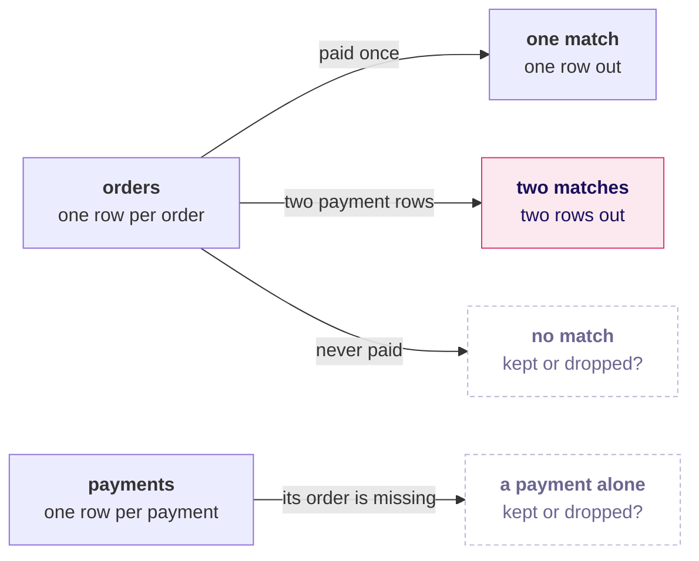
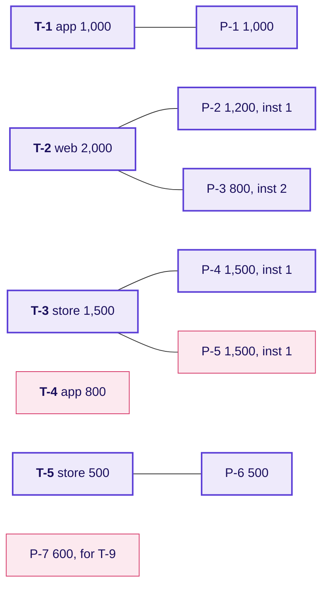
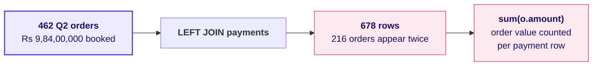
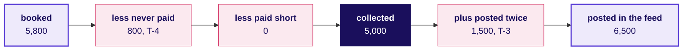
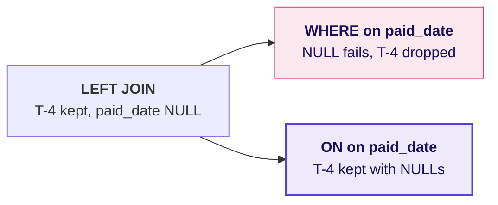
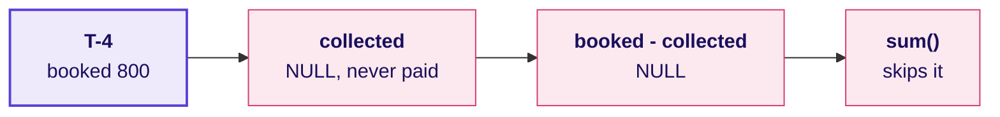

# What goes up on the board on Week 2 Tuesday, drawing by drawing?

The board work in the order it is drawn, one drawing for the ask and one or two for each chapter. The
deck, the notebooks, the companion page and the cheat sheet carry the same bridge, so the drawing a
learner copies here is the one they meet everywhere else today. Every number on the tiny tables is
invented.

---

## What are Anand's two words, and what is one row under each?

`BOOKED` goes on the left of the board and `COLLECTED` on the right, with a gap between them and
Anand's question written in it: **which orders, and which channel?** Under each word goes the table it
comes from and what one row of that table stands for.

The platform lead's remark goes beside the payments box in the room's words: the feed sometimes
double-posts when the gateway retries. The four reconciliation lines go in a box in the corner and
stay up all day: rows in, rows out, the difference named, then the number.

---

## Which payment belongs to which order on the two tiny tables?

Chapter 1. Five invented orders on the left and seven invented payments on the right, with a line
drawn from each payment to the order it names. The room calls out each line before it is drawn.

The pink boxes are the three awkward rows: T-4 has no line, P-7 has no order, and P-5 repeats P-4.

---

## What does each join do with the rows that find no partner?

Chapter 1. The room predicts each count before the trainer writes it.

| Join | What happens to T-4 and P-7 | Rows |
|---|---|---|
| INNER | Both vanish, and T-2 and T-3 each appear twice | 6 |
| LEFT | T-4 stays with NULLs, and P-7 vanishes | 7 |
| RIGHT | P-7 stays with NULLs, and T-4 vanishes | 7 |
| FULL OUTER | Both stay | 8 |

Under the table: start from the table whose every row must survive, which for Anand is `orders`.

---

## Why does the first draft collect nearly twice the bookings?

Chapter 2, drawn after the room has seen Rs 19,29,04,410 on the screen against Rs 9,84,00,000 booked.

Beside it, the fix in one line: bring payments to one row per order first, then join, and 462 rows
come back out. The word fan-out goes on the "two matches" arrow of the first drawing.

---

## Which moves carry booked to what the feed posted?

Chapter 3. The reconciliation box is filled for Q2, 462 rows in and 462 out, and the plain JOIN trap
on the tiny tables goes beside it: 4 orders, booked 5,000, posted 6,500, a gap of minus 1,500, and a
line under "4 against 5". Then the bridge.

---

## What does a condition on the payments table do in WHERE and in ON?

Chapter 4. Two versions of the same LEFT JOIN, side by side, with T-4's row traced through each.

Under it: the anti-join is the one WHERE on the right table that belongs there, `IS NULL` on the
payment's key.

---

## How is a retry different from an instalment?

Chapter 4. T-2 and T-3 go up side by side, each with its two payment rows and the instalment numbers
circled: T-2 reads 1 and 2, and T-3 reads 1 and 1. "More than one row" catches both; "the same
instalment twice" catches only T-3.

---

## Why does the gap column read zero?

Chapter 5. T-4's row, traced through the hurried gap.

Beside it: `sum(booked - coalesce(collected, 0))`, with the coalesce circled around `collected`.

---

## Which checks stop the day's wrong reports?

Chapter 6. A grid goes up with the day's five wrong pages as rows and the two suites as columns: the
plausibility suite lets through the two that hide T-4, the quarter in WHERE and the summed gap, and
the tie-back suite stops all five. Under it, the
reporting-day rule in one line: booked leaves with the open line named, and collected is held.

---

## What is on the board when the day ends?

1. The first drawing, with the fan-out marked on its "two matches" arrow and LEFT on its "never paid"
   arrow.
2. The four joins and their row counts on the tiny tables.
3. The reconciliation box, with Q2's 462 rows in and out.
4. The bridge on the tiny tables, with an empty copy beside it for Kalpa's Q2, whose middle moves each
   learner fills in from their own run.
5. The six lines worth keeping, along the bottom edge:
   - A join is done when its row count is explained: rows in, rows out, the difference named.
   - Start from the table whose every row must survive, and name its grain.
   - Bring the many side to the grain of the question before you join.
   - In a LEFT JOIN, a condition on the right-hand table goes in ON.
   - Two payment rows are not a double payment: a retry is one order and instalment, twice.
   - A check is worth its power to fail: tie every figure back to one table alone.
