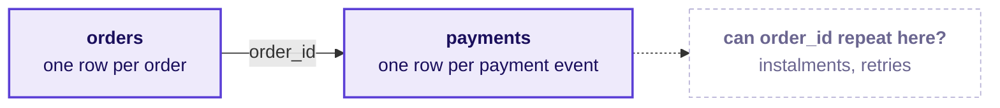
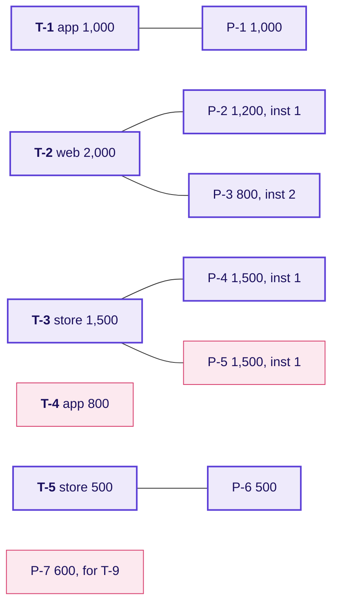
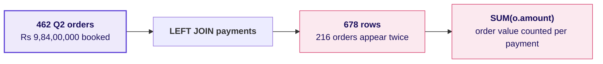
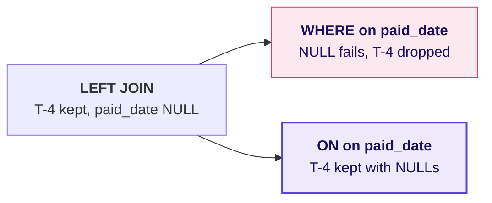
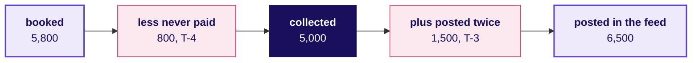

# Booked against collected, as it goes up on the board

The board work for Week 2, Tuesday, in the order it is drawn. The deck, the notebooks, the companion
page and the cheat sheet carry the same bridge, so the drawing a learner copies here is the one they
meet everywhere else today. Every number on the tiny tables is invented.

---

## First drawing: Anand's two words, and the grain under each table

`BOOKED` goes on the left of the board and `COLLECTED` on the right, with a gap between them and
Anand's question written in it: **which orders, and which channel?**

Under each word goes the table it comes from and what one row of that table stands for.

The platform lead's remark goes beside the payments box in the room's words: the feed sometimes
double-posts when the gateway retries.

---

## Second drawing: the two tiny tables, traced by hand

Five invented orders on the left and seven invented payments on the right, with a line drawn from each
payment to the order it names. The room calls out each line before it is drawn.

The pink boxes are the three awkward rows: T-4 has no line, P-7 has no order, and P-5 repeats P-4.

---

## Third drawing: four joins, four answers about the unmatched rows

The room predicts each count before the trainer writes it.

| Join | What happens to T-4 and P-7 | Rows |
|---|---|---|
| INNER | Both vanish, and T-2 and T-3 each appear twice. | 6 |
| LEFT | T-4 stays with NULLs, and P-7 vanishes. | 7 |
| RIGHT | P-7 stays with NULLs, and T-4 vanishes. | 7 |
| FULL OUTER | Both stay. | 8 |

Under the table, the first crux line: every join answers a question about the rows that do not
match; choose the join by that question.

---

## Fourth drawing: the fan-out

Drawn after the room has seen Rs 19,29,04,410 on the screen against Rs 9,84,00,000 booked.

Beside it, the fix in one line: bring payments to one row per order first, then join, and 462 rows
come back out.

---

## Fifth drawing: rows in, rows out, and the reconciliation

Four lines go up in a box, and stay up for the rest of the day:

1. Rows in: every Q2 order, from `orders` alone.
2. Rows out: one row per order after the join, equal to rows in.
3. Booked after the join equals booked from `orders`.
4. Booked minus collected equals the booked value of the unpaid list.

Beside the box, the INNER trap on the tiny tables: 4 orders, booked 5,000, collected 6,500, a gap of
minus 1,500, and a line under "4 against 5".

---

## Sixth drawing: WHERE against ON

Two versions of the same LEFT JOIN, side by side, with T-4's row traced through each.

Under it: the anti-join is the one WHERE on the right table that belongs there, `IS NULL` on the
payment's key.

---

## Seventh drawing: a retry against an instalment

T-2 and T-3 go up side by side, each with its two payment rows and the instalment numbers circled:
T-2 reads 1 and 2, and T-3 reads 1 and 1. "More than one row" catches both; "the same instalment
twice" catches only T-3.

---

## What is on the board when the day ends

The bridge, drawn once on the tiny tables and copied into every notebook:

1. The grain of each table, written under its name.
2. The four joins and their row counts on the tiny tables.
3. The reconciliation box, four lines, with Q2's 462 rows in and out.
4. The bridge above, with an empty copy beside it for Kalpa's Q2, whose two middle moves each learner
   fills in from their own run.
5. The five crux lines, written along the bottom edge.
