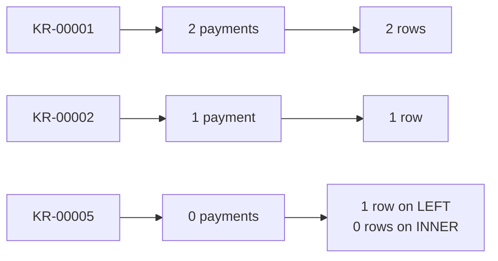
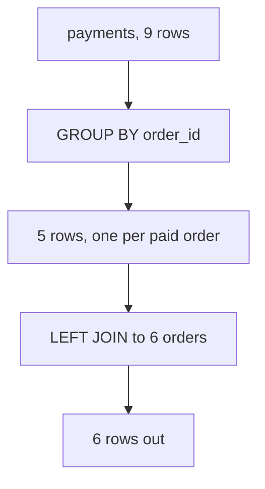

# The board work: two tiny tables, traced by hand before any query runs

## Why this is done on the board and not on a screen

The fan-out is invisible at a thousand rows and obvious at six. Draw the two tables, trace the
join row by row with a finger, and the room finds the doubling before the word exists for it.
Running the query first spends the lesson.

## The two tables

Write these up exactly. Six orders, nine payments, and the shape of the problem is already in
them.

| order | amount | what happened |
|---|---|---|
| KR-00001 | Rs 9,00,000 | Corporate, settled in two instalments |
| KR-00002 | Rs 2,400 | Paid once |
| KR-00003 | Rs 6,40,000 | Corporate, settled in two instalments |
| KR-00004 | Rs 1,800 | Gateway retried and charged twice |
| KR-00005 | Rs 3,100 | Delivered and never paid |
| KR-00006 | Rs 2,100 | Paid once |

| payment | order | amount |
|---|---|---|
| P-01 | KR-00001 | Rs 5,40,000 |
| P-02 | KR-00001 | Rs 3,60,000 |
| P-03 | KR-00002 | Rs 2,400 |
| P-04 | KR-00003 | Rs 3,84,000 |
| P-05 | KR-00003 | Rs 2,56,000 |
| P-06 | KR-00004 | Rs 1,800 |
| P-07 | KR-00004 | Rs 1,800 |
| P-08 | KR-00006 | Rs 2,100 |
| P-09 | KR-90001 | Rs 2,000 |

The last payment row is the one to leave uncommented. Somebody will notice `KR-90001` is not in
the order list, and that noticing is worth more than telling.

## The trace

Go order by order. For each one ask: how many payment rows match, and therefore how many rows does
the join produce? Write the count in the margin as you go.



Six orders in, nine rows out on a LEFT join. Then add the order amount down the result column and
compare it with the true booked total. The corporate orders have been counted twice, and they are
the ones carrying the money.

## The sentence to get out of the room

Ask what went wrong before naming it. The answer worth waiting for is some version of "nothing is
duplicated in either table, the duplication happened in the join". When somebody says that, the
word fan-out can be written on the board and it will mean something.

## The second drawing: the fix



One row in, one row out. Say aloud why the count check now passes by construction rather than by
luck, and why that is a different claim from "the number looks right".

## What to leave on the board all afternoon

Three numbers and one sentence.

```
rows before: 1,000
rows after:  1,450
difference:  450
therefore:   do not SUM the order amount over this join
```

Every query the room writes after this gets pointed at that block. By the third one somebody
writes their own version without being asked, which is the habit landing.
