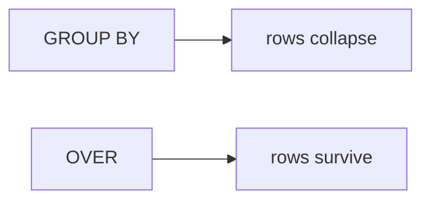

# Window functions, and the tie

## Panel 1: Collapse or keep

**Crux:** `GROUP BY` answers how much per group and the rows disappear; a window answers where
this row stands and every row survives.



If the answer needs the original row back, it is a window. If the answer is one number per group,
it is `GROUP BY`, and reaching for a window is over-engineering.

## Panel 2: OVER has two dials

**Crux:** `PARTITION BY` says who counts as neighbours and the window's own `ORDER BY` says in
what order, and changing either changes the answer.

```sql
rank() OVER (PARTITION BY segment ORDER BY revenue DESC)
```

These are not decoration on a function name. They are the definition of the question being asked.

## Panel 3: Three functions, one tie

**Crux:** The difference only shows up on a tie, and a tie at the boundary changes how many rows
your report ships.

| Function | On a tie | After it | Repeatable |
|---|---|---|---|
| `ROW_NUMBER` | Breaks it arbitrarily | 1 2 3 | No |
| `RANK` | Shares a position | 1 1 3 | Yes |
| `DENSE_RANK` | Shares a position | 1 1 2 | Yes |

`RANK` answers how many are ahead of me. `DENSE_RANK` answers how many levels are ahead of me.

## Panel 4: Top-N inside a group

**Crux:** A window cannot be filtered in `WHERE`, so compute it inside and filter outside.

```sql
WITH r AS (
  SELECT segment, customer_id, revenue,
         rank() OVER (PARTITION BY segment
                      ORDER BY revenue DESC) AS pos
  FROM q2
)
SELECT * FROM r WHERE pos <= 50;
```

`LIMIT 50` takes fifty rows from the whole result, never fifty from each group.

## Panel 5: LAG, and what NULL means

**Crux:** `LAG` reads the previous row inside the partition, and the first row of every partition
returns NULL because there is nothing behind it.

```sql
lag(spend, 1) OVER (PARTITION BY customer_id
                    ORDER BY month)
```

Falling two months running is two LAGs and a comparison. A member with one month of data returns
NULL, fails the comparison and drops out, which is honest: you cannot tell.

## Panel 6: Running totals and determinism

**Crux:** A running total is only reproducible when the window's order cannot tie.

```sql
sum(revenue) OVER (ORDER BY week_start)
```

If two rows share `week_start`, their relative order is undefined and the cumulative column can
differ between runs. Add a tiebreaker. A number that changes between runs is worse than one that
is wrong, because nobody can reproduce the argument about it.
