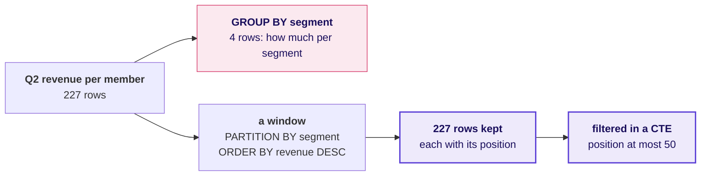

# Window functions: rank, LAG and the running total

Kalpa Retail, Week 2 Wednesday. A window keeps every row and adds a column computed across the rows
related to it. Q2 revenue per member is the booked amount of the member's Q2 orders, the definition
behind Monday's quarter total of Rs 9,84,00,000.

## Panel 1: The kept rows


```mermaid
flowchart LR
    R["<b>Q2 revenue per member</b><br/>227 rows"] --> G["<b>GROUP BY segment</b><br/>4 rows: how much per segment"]
    R --> W["<b>a window</b><br/>PARTITION BY segment<br/>ORDER BY revenue DESC"]
    W --> K["<b>227 rows kept</b><br/>each with its position"]
    K --> F["<b>filtered in a CTE</b><br/>position at most 50"]
    classDef known fill:#EEEAFB,stroke:#5B3FD6,color:#1A0F5C,stroke-width:2px
    classDef bad fill:#FBE9EF,stroke:#D63A6A,color:#1A0F5C
    class G bad
    class K,F known
```

PARTITION BY sets the group the calculation restarts in, and the ORDER BY inside the window sets who
comes first within it. A top fifty over the whole table handed Marketing 35 Business members, 11
Retail-Plus, 4 Retail-Core and no Student, so every list is counted by segment first.

**Crux:** GROUP BY answers how much per group; a window keeps every row and says where each row stands.

## Panel 2: Three functions on one tie

| Member (invented) | Spend | ROW_NUMBER | RANK | DENSE_RANK |
|---|---|---|---|---|
| A | 7,500 | 1 | 1 | 1 |
| B | 7,500 | 2 | 1 | 1 |
| C | 6,000 | 3 | 3 | 2 |
| D | 5,200 | 4 | 4 | 3 |
| E | 5,200 | 5 | 4 | 3 |
| F | 4,100 | 6 | 6 | 4 |

A top four with a tie at fourth (invented) ships 4 rows with ROW_NUMBER, 5 with RANK, 5 with
DENSE_RANK and 3 with whole ties only. Retail-Core's top fifty ships 50, 50, 52 and 50, because
earlier ties compress DENSE_RANK's numbers.

**Crux:** The tie rule is a business decision written as a function name: RANK keeps everyone at the line, and the report says how many.

## Panel 3: Top N per group, a CTE then a filter

```sql
WITH ranked AS (
  SELECT segment, customer_id, q2_revenue,
         rank() OVER (PARTITION BY segment
                      ORDER BY q2_revenue DESC) AS pos
  FROM   q2
)
SELECT * FROM ranked WHERE pos <= 50;
```

A window inside WHERE stops with `ERROR:  window functions are not allowed in WHERE`, because WHERE
runs before the window exists. The position is computed in one named step and filtered in the next.

## Panel 4: LAG, with the calendar check

```sql
lag(spend, 1) OVER (PARTITION BY customer_id ORDER BY month)
lag(month, 1) OVER (PARTITION BY customer_id ORDER BY month)
-- count a fall only when
-- month_before = month - INTERVAL '1 month'
```

Without the partition, 20 members are flagged and 4 of them were compared with another member's
month. With it, 16 are flagged and 7 of those skipped a month: a member with May, July and
September orders has July read as last month. Requiring the previous rows to be August and July
flags 9. A month with no order is no reading, so it breaks the run and is never filled with zero.

**Crux:** LAG reads the previous row, so partition by the member and check the previous row is last month.

## Panel 5: The running total against plan

```sql
sum(amount) OVER (ORDER BY order_date, order_id)
```

| Mistake | What it shows | The fix |
|---|---|---|
| Order by date alone | Every order of 22 July shows Rs 3,76,90,290. | Add order_id as the tiebreaker. |
| Actual beside one week's plan | Week seven reads as nine times plan. | Accumulate the plan as well. |
| Plan LEFT JOIN weekly revenue | It closes Rs 15,39,820 below the quarter. | Read the actual at each week's last day. |

Q2 closed at Rs 9,84,00,000 against a plan of Rs 9,83,99,990.

**Crux:** A running total is only as true as its order and its start; check it closes on the quarter's total.
