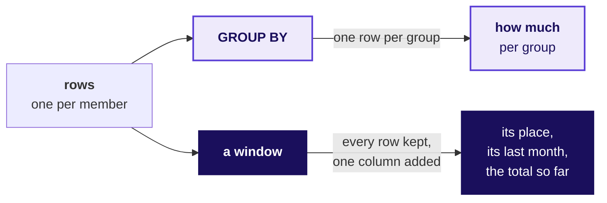

# Week 2 Wednesday: Which members should Marketing protect before they drift, and is Q2 on track against the plan line?

Kalpa Retail's marketing lead wants each segment's top fifty members by Q2 revenue and a flag on
falling monthly spend, and Meera Raghavan, the CEO, wants Q2 to date against the plan line. Q2 is
July to September 2026; revenue is booked, every order at its amount: Rs 9,84,00,000 on 462 orders.

## Panel 1: What does a window keep that GROUP BY throws away?


```mermaid
flowchart LR
    R["<b>rows</b><br/>one per member"] --> G["<b>GROUP BY</b>"]
    R --> W["<b>a window</b>"]
    G -->|"one row per group"| A["<b>how much</b><br/>per group"]
    W -->|"every row kept,<br/>one column added"| B["its place,<br/>its last month,<br/>the total so far"]
    classDef bet fill:#1A0F5C,stroke:#1A0F5C,color:#FFFFFF
    classDef known fill:#EEEAFB,stroke:#5B3FD6,color:#1A0F5C,stroke-width:2px
    class W,B bet
    class G,A known
```

GROUP BY answers how much per group and keeps nothing below the group: four segments, four rows. A
window function computes over related rows and keeps every row, adding one column: a place, a
previous month, or a total so far. It is written `function() OVER (PARTITION BY ... ORDER BY ...)`:
the partition says whose rows belong together and the order says which row comes before which.
WHERE runs before any window exists, so a place is computed in a named step and filtered outside.

## Panel 2: Is the top fifty a list of members or of orders?

| The list | Rows | Members | Segments |
|---|---|---|---|
| The fifty biggest Q2 orders | 50 | 28 | 1 |
| Members ranked on summed Q2 revenue | 50 | 50 | 3 |

`count(DISTINCT customer_id)` beside `count(*)` catches it. Ranked as members, the fifty are 35
Business, 11 Retail-Plus and 4 Retail-Core.

**Crux:** Say what one row of the list is before you rank it: fifty orders named only 28 members.

## Panel 3: How does each segment get its own fifty?

| Segment | Buyers | Book split | Partitioned |
|---|---|---|---|
| Business | 35 | 35 | 35 |
| Retail-Core | 96 | 4 | 50 |
| Retail-Plus | 76 | 11 | 50 |
| Student | 20 | 0 | 20 |

```sql
row_number() OVER (PARTITION BY segment
                   ORDER BY q2_revenue DESC, customer_id)
```

Check each list against the smaller of 50 and its buyers.

**Crux:** "In each segment" is a PARTITION BY: fifty, or every buyer, in each segment.

## Panel 4: When members tie at the line, how many does each rule ship?

| Invented | A | B | C | D | E | F |
|---|---|---|---|---|---|---|
| Spend, Rs | 7,500 | 7,500 | 6,000 | 5,200 | 5,200 | 4,100 |
| ROW_NUMBER | 1 | 2 | 3 | 4 | 5 | 6 |
| RANK | 1 | 1 | 3 | 4 | 4 | 6 |
| DENSE_RANK | 1 | 1 | 2 | 3 | 3 | 4 |

| Ships | ROW_NUMBER | RANK | DENSE_RANK | Whole ties |
|---|---|---|---|---|
| Invented top 4 | 4 | 5 | 5 | 3 |
| Retail-Core top 50 | 50 | 50 | 52 | 50 |

Two ties higher up leave DENSE_RANK two behind, so its 50 is Retail-Core's 52nd member.

**Crux:** RANK keeps a tie at the line and says the count; DENSE_RANK can run past the line with no tie at it.

## Panel 5: Whose monthly spend fell two months running?

```sql
-- the quick flag, and the column that exposes it
lag(spend, 1)       OVER (ORDER BY customer_id, month)
lag(customer_id, 1) OVER (ORDER BY customer_id, month)
-- the fix
lag(spend, 1) OVER (PARTITION BY customer_id ORDER BY month)
```

The quick flag names 20 members, 4 of them read from another member's months; the partition leaves
16.

**Crux:** Tell the window whose rows belong together, or LAG reads another member's month.

## Panel 6: Did Q2 close on plan, and where was it at mid-quarter?

| Booked to date | At the close | Against plan |
|---|---|---|
| Plan weeks LEFT JOIN weekly | Rs 9,68,60,180 | Rs 15,39,810 short |
| 1 to 5 July moved onto 6 July | Rs 9,84,00,000 | Rs 10 ahead |

The plan line has no week for 1 to 5 July. At mid-quarter Q2 stood Rs 1,57,51,980 ahead on one July
week; six of seven full weeks since 10 August ran below plan. Add `order_id` to make it repeat.

**Crux:** A running total is done when its last value equals the quarter's total.

## Panel 7: Does each flag hold up when a member skipped a month?

| C-0216 | May | Jun | Jul | Aug | Sep |
|---|---|---|---|---|---|
| Spend, Rs | 6,440 | none | 4,300 | none | 2,540 |

LAG compared his September with July. Seven of the 16 flags step over an empty month, and checking
that the two rows before September are August and July keeps 9. Zero-filling flags 26.

**Crux:** A month with no order is no reading: check that LAG read the calendar months before.
