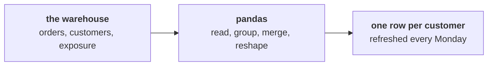

# Before Thursday: the same moves, in pandas

Ships tonight. Fifteen minutes of reading and two checks to run. Tomorrow opens on the growth team's
weekly table, and a room that has read this recognises every pandas move as something it did in
SQL this week.

---

## What tomorrow is about

The growth team now wants one thing every week: a single table with one row per customer, refreshed
on Monday, carrying how recently they bought, how often, how much, their segment, whether the
monsoon sale reached them, and last week's flags. The platform lead is blunt:

> "The warehouse queries are fine for Finance, but Marketing's analysts live in Python. Build them
> the table in pandas, from the warehouse, and make it refreshable in one run."

A senior analyst on the team adds a challenge you will answer in writing: "You did the tree in
plain Python in Week 1, in SQL on Monday. Do it a third way now, and tell me honestly which tool you
would pick for which job."



---

## The words you will hear tomorrow, against the ones you used today

Every pandas move tomorrow has a SQL twin from this week. Read across each row tonight, and cover
the right-hand column to test yourself.

| pandas | Its SQL twin from this week | What it does to the rows |
|---|---|---|
| `read_sql` | The query you ran in psql | It runs a query and brings the result into Python as a table. |
| `groupby` then `agg` | GROUP BY with sum or count | It collapses each group to one row, so it answers how much per group. |
| `groupby` then `transform` | A window with PARTITION BY | It keeps every row and adds a value computed across the row's group. |
| `groupby` then `rank` | RANK() OVER (PARTITION BY ...) | It gives each row its position inside its group, with a tie rule you choose. |
| `merge` | A join on a key | It lines up two tables on a shared column, as Tuesday's joins did. |
| `validate=` on a merge | Tuesday's row count check | It stops the merge with an error when the keys are not as unique as you said. |
| `pivot_table` | GROUP BY on two keys, spread across | It turns one of the keys into columns, such as months across the top. |

The one to hold on to is the third row. Today's lesson was that a window keeps every row, and
`transform` is pandas saying the same thing.

---

## One thing to think about before you arrive

Today you built the protect list in SQL: a position inside each segment, filtered to fifty, with
RANK so tied members share a place. Tomorrow the same list can be built in pandas in a few lines.

Write one sentence tonight on which of the two you would hand to Finance to audit, and which you
would hand to a Marketing analyst who wants to try three different cut-offs before lunch. Bring the
sentence; tomorrow's tool-choice note starts from it.

---

## The check for tonight

Two checks, both under five minutes, both in your Codespace terminal.

1. Confirm pandas imports and see which version you have:

   ```bash
   python -c "import pandas; print(pandas.__version__)"
   ```

   It prints a version number, because the Codespace setup installs pandas; the pack was built on
   3.0.6. If it prints an error instead, post the last line of the error in the cohort channel
   before the session.

2. Confirm the campaign exposure table tomorrow merges onto customers is in your warehouse:

   ```bash
   psql -c "SELECT count(*) FROM campaign_exposure;"
   ```

   It returns 136. Look at the count and nothing else tonight; tomorrow's merge is where the table
   gets read properly.

---

## The line worth carrying in

> A window keeps every row and says where each one stands, and tomorrow's `transform` does the same
> thing in pandas, so before any pandas call ask whether the answer should collapse the rows or keep
> them.
