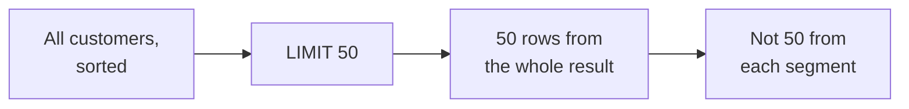
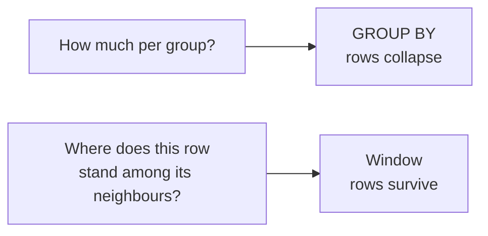
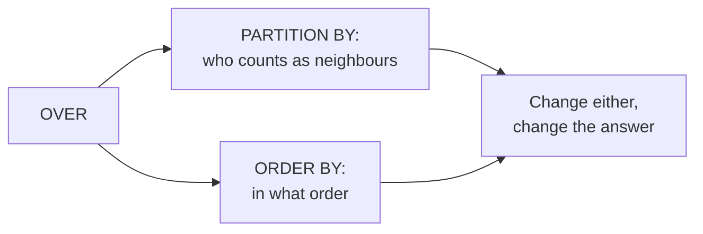
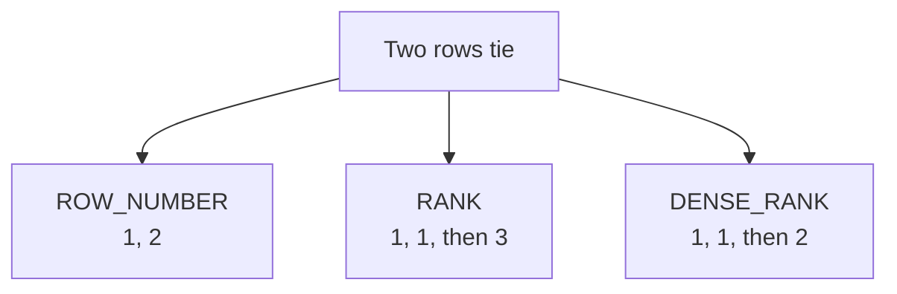
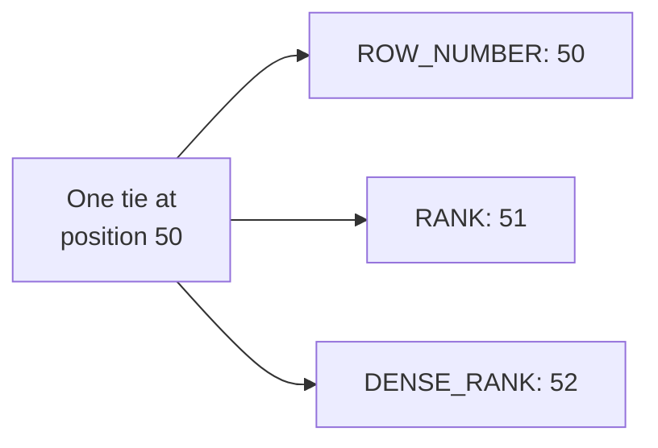
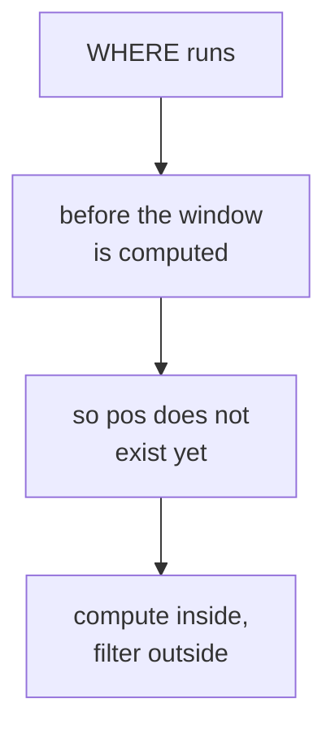
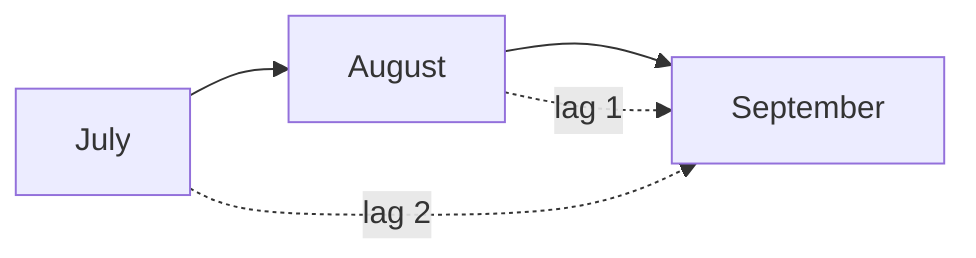
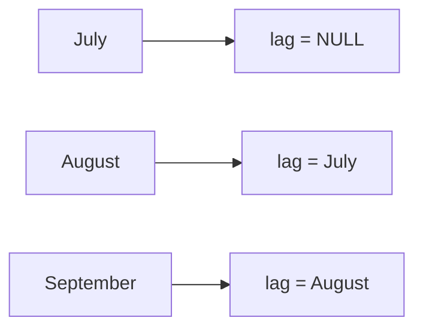
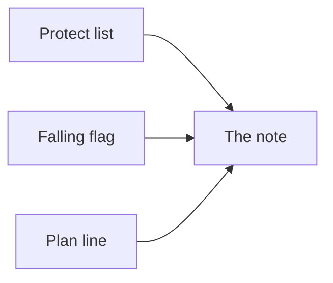

# Top members, falling spend, and the running total against plan

Week 2, Day 3. Slide source. One idea per slide.

Position bar, repeated at every section boundary:
`[Marketing's two asks] > [what GROUP BY cannot do] > [ranking and ties] > [looking sideways] > [the protect list]`

---

## SECTION A. Two asks, and a condition

---

## S1. Marketing is working with you now, not around you
> "Retail-Plus frequency is the problem, so we want to protect our best members before they
> drift. Give us the top fifty customers by Q2 revenue in each segment, and flag anyone whose
> monthly spend has fallen for two months running."

They have read your note. The ask follows from your own finding.

---

## S2. And Meera wants the third thing
> "Meera wants to see revenue accumulate week by week against the plan line, so we know by
> mid-quarter whether we are on track."

Three asks. Two of them are impossible with what you know so far.

---

## S3. The head of Retail-Plus adds a condition
> "Ties matter. If two members spent the same, I want them ranked the same, and I want to know how
> many made the top fifty, not forty-nine because of a tie."

That sentence decides a function name. Hold on to it.

---

## SECTION B. What GROUP BY cannot do

---

## S4. Try the top fifty per segment with what you have
```sql
SELECT c.segment, o.customer_id, sum(o.amount) AS revenue
FROM   orders o JOIN customers c USING (customer_id)
WHERE  o.quarter = 'Q2'
GROUP  BY c.segment, o.customer_id
ORDER  BY c.segment, revenue DESC;
```
This is correct and it is not the answer. It gives every customer, not the top fifty in each
segment.

---

## S5. Adding LIMIT does not fix it

`LIMIT 50` takes fifty rows from the whole result, not fifty from each segment.

There is no clause you have met that says "the best fifty **within** each group". That is the gap.

---

## S6. The two shapes of question


---

## S7. A window keeps every row and adds a column
```sql
SELECT customer_id, revenue,
       rank() OVER (ORDER BY revenue DESC) AS position
FROM   q2_spend;
```
Nothing collapsed. Each row gained a fact about where it sits.

---

## D1. `OVER` is the whole idea, and it has two dials

`PARTITION BY` says which rows count as neighbours. `ORDER BY` inside the window says in what
order they are considered.

Change either and the answer changes. They are not decoration on a function name; they are the
definition of the question.

---

## SECTION C. Ranking, and the tie

---

## S8. Three ranking functions, one tie


---

## S9. What each one does, in words
| Function | On a tie | After the tie |
|---|---|---|
| `ROW_NUMBER` | Breaks it arbitrarily | Continues, 1 2 3 |
| `RANK` | Gives both the same | Skips, 1 1 3 |
| `DENSE_RANK` | Gives both the same | Does not skip, 1 1 2 |

`ROW_NUMBER` is the only one that is not repeatable: run it twice on a tie and it can swap them.

---

## S10. Our data has a tie at exactly the wrong place
Two Retail-Plus members have identical Q2 revenue, and they sit at positions fifty and fifty-one.

Not a coincidence engineered for a slide. It is what happens when fifty is a round number somebody
picked.

---

## S11. So how many rows does the top fifty ship?
Depends entirely on the function.

---

## S12. Answer: fifty, fifty-one or fifty-two

| Filter | Rows shipped |
|---|---|
| `ROW_NUMBER <= 50` | 50 |
| `RANK <= 50` | 51 |
| `DENSE_RANK <= 50` | 52 |

Three defensible answers to one question. Only one matches what the head of Retail-Plus asked for.

---

## D2. He told you the answer before you asked
> "If two members spent the same, I want them ranked the same, and I want to know how many made
> the top fifty, not forty-nine because of a tie."

Ranked the same rules out `ROW_NUMBER`. Not forty-nine rules out cutting the tie. `RANK` at 50
ships fifty-one names, and the extra name is the point rather than a rounding error.

Write that sentence in the query as a comment. The next person will not have heard him say it.

---

## S13. Top-N within a group needs PARTITION BY
```sql
SELECT * FROM (
  SELECT c.segment, o.customer_id, sum(o.amount) AS revenue,
         rank() OVER (PARTITION BY c.segment ORDER BY sum(o.amount) DESC) AS pos
  FROM orders o JOIN customers c USING (customer_id)
  WHERE o.quarter = 'Q2'
  GROUP BY c.segment, o.customer_id
) t WHERE pos <= 50;
```
`PARTITION BY` restarts the numbering for each segment.

---

## S14. Notice the query had to be wrapped

```
ERROR:  window functions are not allowed in WHERE
```
`WHERE` runs before the window is computed, which is Monday's execution order again. The fix is to
compute the window in an inner query or a CTE, then filter outside it.

---

## SECTION D. Looking sideways

---

## S15. LAG reads the previous row
```sql
SELECT customer_id, month, spend,
       lag(spend) OVER (PARTITION BY customer_id ORDER BY month) AS prev
FROM   monthly;
```
For each row, the value from the row before it, within the same customer, in month order.

---

## S16. "Fallen for two months running" is two LAGs

Keep the row where July is above August and August is above September. Three members qualify.

---

## S17. The first month of every customer returns NULL

There is no previous row, so `lag` has nothing to give. That is correct behaviour and it will
quietly drop customers from your flag if you compare without thinking about it.

Decide out loud whether a customer with one month of data is falling. The honest answer is that
you cannot tell.

---

## D3. What you would say to the member who was on holiday
Marketing will act on this list, and somebody on it will object that they were away in August.

They are right, and the flag is still correct. A flag is a shortlist for a conversation rather
than a verdict, and the sentence that makes it usable is "three months of falling spend, worth a
call, not worth an assumption".

---

## S18. A running total accumulates without collapsing
```sql
SELECT week_start, revenue,
       sum(revenue) OVER (ORDER BY week_start) AS cumulative
FROM   weekly;
```
Every week keeps its own row and gains the total so far.

---

## S19. A running total is only deterministic if its order is
If two rows share a `week_start`, their relative order is undefined, so the cumulative column can
differ between runs.

Add a tiebreaker to the window's `ORDER BY`. A number that changes between runs is worse than a
number that is wrong, because nobody can reproduce the argument about it.

---

## SECTION E. What you hand over

---

## S20. Three deliverables, one note

| Piece | What it carries |
|---|---|
| The protect list | Top fifty per segment, `RANK`, fifty-one Retail-Plus names |
| The falling flag | Three members, with their three monthly figures |
| The plan line | Weekly revenue and cumulative, against plan |
| The note | Which tie rule you chose, and the sentence that decided it |

---

## S21. What today equipped you to answer
> [S] RANK, DENSE_RANK and ROW_NUMBER on a tie.
> [S] Top-3 per group: GROUP BY or a window, and why?
> [F] How would you find customers whose spend fell two months in a row?
> [F] Why can a window function not sit inside WHERE, and what do you do instead?
> [D] The business says 'ties rank the same'; which function, and how many rows might the top-N
> report ship?

---

## S22. Tomorrow
The growth team wants one table, one row per customer, refreshed every Monday. In pandas, because
Marketing's analysts live in Python.
