# Who do we protect before they drift?

Week 2, Day 3. Morning.

Kicker: WEEK 2  ·  WEDNESDAY  ·  MORNING
Quote: Retail-Plus frequency is the problem, so we want to protect our best members before they drift. Give us the top fifty customers by Q2 revenue in each segment, and flag anyone whose monthly spend has fallen for two months running.
Who: The marketing lead, Kalpa Retail, to the data and AI team at Kalpa's Global Capability Centre

```notes
LIVE, one minute. Read the marketing lead's words aloud and leave them up. Marketing now works with
the data team, and today's ask has three parts: a protect list per segment, a flag on falling
spend, and Meera's plan line. The day asks one question and climbs it in six chapters: which
members should Marketing protect before they drift, and is Q2 on track against the plan line? Five
chapters this morning and the sixth after lunch. Then the ladder.
```

---

## S1. Six questions take us from the list to the plan
*Which members should Marketing protect before they drift, and is Q2 on track against the plan line?*

```timeline
label: Chapter 1 | title: Who are the top fifty? | body: Fifty members, counted as members
label: Chapter 2 | title: Top fifty per segment? | body: One list for each of four segments
label: Chapter 3 | title: Who makes it at a tie? | body: The head of Retail-Plus's rule
label: Chapter 4 | title: Whose spend is falling? | body: Each member against their own month
label: Chapter 5 | title: On track against plan? | body: Q2 to date, week by week
label: Chapter 6 | title: Who does Marketing call? | body: The flag, checked before the calls | tone: dark
```

```notes
LIVE, 2 minutes. Read the day's question, then the six chapter questions in order: each is the
question the answer before it raises, and each chapter closes on its own answer with a number.
Chapter 6 runs after lunch, before the afternoon's tentative IITGN block. Then who is asking.
```

---

## S2. Three asks: a list, a flag and the plan line
*Who is asking, and what does each of them want by Monday?*

```cards
icon: megaphone | eyebrow: Marketing | title: The marketing lead | body: Owns acquisition and campaigns. Wants each segment's top fifty by Q2 revenue and a flag on members whose monthly spend fell two months running. | tone: dark
icon: crown | eyebrow: Retail-Plus | title: The head of Retail-Plus | body: Owns the paid membership tier. Wants members who spent the same ranked the same, and the count that made the list.
icon: chart-line | eyebrow: The CEO | title: Meera Raghavan | body: Wants Q2 revenue to accumulate week by week against the plan line, to know by mid-quarter whether to act.
```

```notes
LIVE, 3 minutes. Read the head of Retail-Plus's words: "Ties matter. If two members spent the
same, I want them ranked the same, and I want to know how many made the top fifty, not forty-nine
because of a tie." Q2 is July to September 2026. Revenue today is booked revenue, every order at
its amount whatever its status, which is how Monday's suite reached Rs 9,84,00,000 for Q2. Kalpa
Retail's four segments: Business (corporate buyers, orders in lakhs), Retail-Core (everyday
shoppers), Retail-Plus (the paid membership tier) and Student. Then what each one needs.
```

---

## S3. Each ask needs its own kind of answer
*What does each person need from the data team, and what does a wrong answer cost them?*

**The client asks.** "Give us the top fifty customers by Q2 revenue in each segment, and flag anyone whose monthly spend has fallen for two months running."

| Who | Their question | What answers it | A wrong answer costs |
|---|---|---|---|
| The marketing lead | Whom do we protect in each segment? | A ranked list per segment | Offers spent on the wrong members |
| The head of Retail-Plus | How many made the list, ties kept? | A tie rule and its count | A member dropped by a coin toss |
| The marketing lead | Whose spend is slipping? | Each member against their own month | Calls that accuse loyal members |
| Meera Raghavan | Is Q2 on track? | Revenue to date against plan to date | A campaign chasing a gap that is not there |

```notes
LIVE, 3 minutes. Say when each gets answered: the list in chapters 1 to 3, the flag in chapter 4,
the plan in chapter 5, and the calls Marketing makes in chapter 6, after lunch. Hold anyone who
wants to start typing; the thinking comes first. Then the question on the next slide.
```

---

## S4. Question: can one GROUP BY answer all three?
*Which tool every analyst already knows could produce a top fifty per segment?*

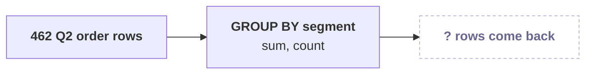

**Question.** Can one GROUP BY return each segment's top fifty members, as a letter? a) yes, GROUP BY segment with LIMIT 50; b) yes, GROUP BY member with LIMIT 50; c) no, GROUP BY returns one row per group and keeps no member below it; d) no, SQL cannot rank at all.

```notes
LIVE, 4 minutes. Pairs, two minutes: one way to write it with GROUP BY. Let somebody try GROUP BY
segment and somebody LIMIT 50; the point is the attempt. Letters in chat. Then the answer.
```

---

## S5. Answer: no, GROUP BY collapses what the asks keep
*Which tool every analyst already knows could produce a top fifty per segment?*

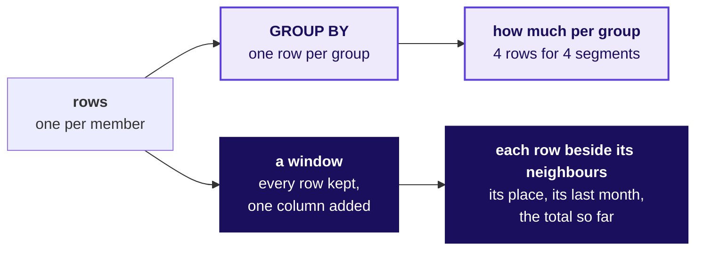

**The rule.** GROUP BY answers how much per group and keeps nothing below the group. A window function computes over related rows and keeps every row, adding one column: a place, a previous month, or a total so far.

```notes
LIVE, 3 minutes. The answer is c. Draw this with the room and leave it up all day: it is the day's
picture, and the cheat sheet's first panel carries it. Every ask on S3 keeps the rows and asks about
each row's neighbours. Then the three windows the day builds.
```

---

## S6. Every ask is a window: a place, a month, a total
*What does each of the three asks need the window to add to every row?*

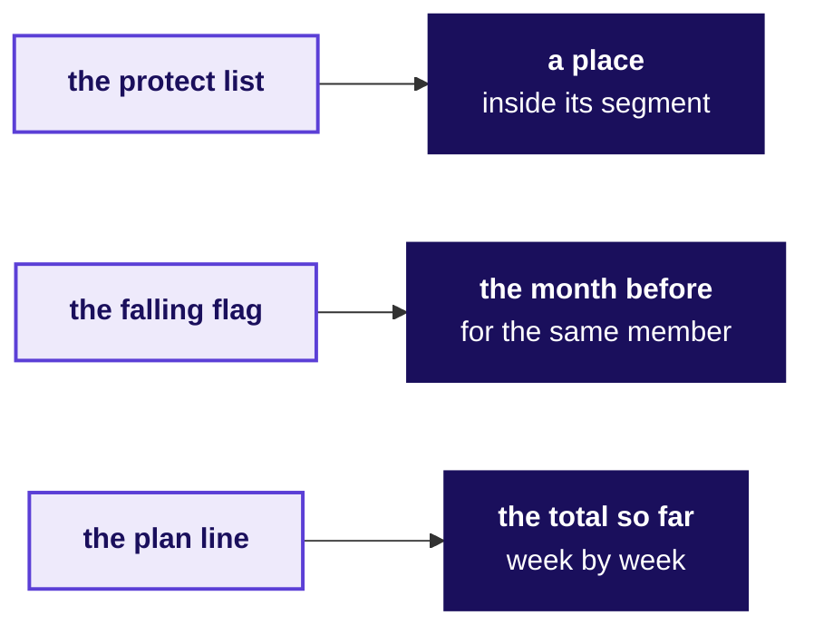

A window is written `function() OVER (PARTITION BY ... ORDER BY ...)`: the partition says whose rows belong together, and the order says which row comes before which. Those two words decide every answer today.

```notes
LIVE, 4 minutes. Name the functions only as the morning meets them: row_number, rank and
dense_rank for the place, lag for the month before, sum for the total so far. Then chapter 1.
```

---

## SECTION 1: Who are the top fifty?
*Which fifty members spent the most in Q2, the list Marketing's protect budget starts from?*

```notes
LIVE. Thirty minutes. Notebook C2_W02_D03_01_top_fifty and sql/C2_W02_D03_01_top_fifty_STUDENT.sql
run beside it, and the notebook's numbered sections are the questions on the next slide.
```

---

## S7. Answering it for Marketing: six questions on the way
*Who needs this answer, and which questions lead to it?*

**Who needs the answer.** The marketing lead spends the protect budget, a call from the member team and a renewal offer, on the members this list names. A list built on the wrong unit sends offers to the wrong people: each best member it misses is one nobody calls, and each one it repeats is a call made twice.

```timeline
label: 1 | title: Which way, at what cost? | body: Four ways to rank
label: 2 | title: What did each member book? | body: One row per member
label: 3 | title: Which fifty spent most? | body: Numbered in a window
label: 4 | title: What does the quick list give? | body: The fifty biggest orders
label: 5 | title: Which segments does it reach? | body: Counted by segment
label: 6 | title: Does Python agree? | body: A sort with no SQL | tone: dark
```

```notes
LIVE, 1 minute. Read the six questions. Each gets its answer before the next is asked, and the
chapter's last slide answers all six beside the review of Kavya Nair, the senior analyst who checks
every number before it leaves the team. Then the need.
```

---

## S8. Marketing needs members, ranked by what they booked
*What does Marketing need before the member team rings anyone, and what does a wrong list cost?*

```cards
icon: megaphone | eyebrow: Who asks | title: The marketing lead | body: Spends the protect budget, a call and a renewal offer, on the members this list names.
icon: indian-rupee | eyebrow: The metric | title: Q2 revenue per member | body: Booked revenue of every Q2 order the member placed, whatever its status. Q2 booked Rs 9,84,00,000.
icon: triangle-alert | eyebrow: A wrong list costs | title: Calls to the wrong people | body: A best member nobody rings, or one member rung twice. | tone: dark
```

**The client asks.** "Give us the top fifty customers by Q2 revenue."

```notes
LIVE, 2 minutes. A member is one customer on the customers table, and 227 of Kalpa's 340 members
placed a Q2 order. Monday's suite put Q2 at Rs 9,84,00,000 on 462 orders. Then a company whose
members carry most of its money.
```

---

## S9. Starbucks members made 59% of US store tender
*Has a real company's money come mostly from its members, so the list of members matters?*

```stats
value: 59% | label: of US store tender | note: from Rewards members, Q3 FY26
value: 35.8 M | label: active US members | note: in the 90 days to 28 June 2026
```

**What breaks.** When members carry more than half of the money, a retention offer that reaches the wrong members leaves the money that matters unprotected.

```notes
LIVE, 2 minutes. Source: Starbucks' card, loyalty and mobile dashboard for the third quarter of
fiscal 2026, the quarter that ended on 28 June 2026, checked 1 October 2026. The 59 percent is the
share of money tendered at company-operated US stores by Starbucks Rewards members; say "tender",
which is the dashboard's word. Then four ways Kalpa could rank.
```

---

## S10. Group, then number in a window: 50 rows leave
*How could the team build a ranked list, and what would each way cost?*

| Option | One row is | Leaves the warehouse | Per-segment list |
|---|---|---|---|
| A. Sort the Q2 orders, keep 50 | an order | 50 order rows | impossible |
| B. Group by member, sort, LIMIT 50 | a member | 50 rows | 4 queries glued |
| C. Group, number in a window, keep 1 to 50 | a member and its place | 50 rows | 1 more phrase |
| D. Export and sort by hand | anything | all 462 Q2 orders | 4 sorts by hand |

**The call.** C, because Marketing's ask is per segment and the place has to be a column a later step can count. What would switch it: one overall list to read by eye, where B is shorter and returns the same fifty.

```notes
LIVE, 4 minutes. LIMIT counts rows across the whole result, so B needs one query per segment, four
in all. D breaks the data platform lead's rule, "query it, do not export it". A answers in orders,
which the chapter comes back to. Then the picture of option C.
```

---

## S11. A named step adds up; a window numbers
*What does option C do to the rows, step by step?*

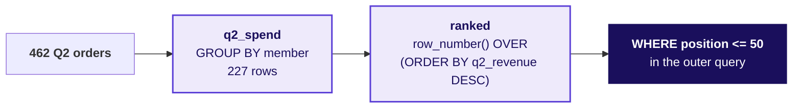

The customer id after the revenue in the window's ORDER BY decides any two members who booked the same, so the numbering is the same on every run. Chapter 3 asks whether that is fair.

```notes
LIVE, 1 minute. A CTE, a named step written WITH name AS (...), is Monday's tool. Then predict the
first step.
```

---

## S12. Question: how many rows, one per member?
*What did each member book in Q2?*

```sql
SELECT o.customer_id, c.segment, count(*) AS q2_orders, sum(o.amount) AS q2_revenue
FROM   orders o JOIN customers c USING (customer_id)
WHERE  o.quarter = 'Q2'
GROUP  BY o.customer_id, c.segment;
```

**Question.** How many rows come back, as a letter? a) 462, one per Q2 order; b) 340, one per member on the customers table; c) 227; d) 50.

```notes
LIVE, 2 minutes. Letters in chat before the notebook cell runs. Then the answer.
```

---

## S13. Answer: 227 members; Business books lakhs each
*What did each member book in Q2?*

```stats
value: Rs 27.9 lakh | label: Business | note: per member who bought, 35 members
value: Rs 5,400 | label: Retail-Plus | note: per member who bought, 76 members
value: Rs 3,800 | label: Retail-Core | note: per member who bought, 96 members
value: Rs 1,800 | label: Student | note: per member who bought, 20 members
```

**The check.** 227 rows carry all 462 orders and all Rs 9,84,00,000; 113 of the 340 members placed no Q2 order. A Business member books hundreds of times a retail member's quarter.

```notes
LIVE, 2 minutes. The answer is c. The figures are Q2 revenue per member who bought: Business 35
members on Rs 9,75,84,600, Retail-Plus 76 on Rs 4,13,380, Retail-Core 96 on Rs 3,66,250, Student 20
on Rs 35,770. Ask what that gap does to one list across the whole book. Then predict it.
```

---

## S14. Question: how many segments reach the fifty?
*Which fifty members spent the most?*

```sql
WITH q2_spend AS (...),
ranked AS (SELECT customer_id, segment, q2_revenue,
           row_number() OVER (ORDER BY q2_revenue DESC, customer_id) AS position
           FROM q2_spend)
SELECT * FROM ranked WHERE position <= 50 ORDER BY position;
```

**Question.** From how many of the four segments do the fifty come, as a letter? a) all four; b) three; c) two; d) one, Business.

```notes
LIVE, 2 minutes. Letters in chat. Then the answer.
```

---

## S15. Answer: three, and every Business buyer is on it
*Which fifty members spent the most?*

```stats
value: 35 | label: Business | note: every Business buyer in Q2
value: 11 | label: Retail-Plus | note: of 76 who bought
value: 4 | label: Retail-Core | note: of 96 who bought
value: 0 | label: Student | note: of 20 who bought
```

**The check.** Place 35, the last Business member, booked Rs 2,25,000; place 36, the first retail member, Rs 21,740, about a tenth of it. Option B's LIMIT returns the same fifty members.

```notes
LIVE, 2 minutes. The answer is b. Ranked across the whole book, any Business buyer outranks every
retail member. Hold that thought for chapter 2. First, the list a hurried analyst sends.
```

---

## S16. The plausible wrong answer: 50 rows, 28 members
*What does the quickest list, the fifty biggest orders, give Marketing?*

```sql
SELECT o.order_id, o.customer_id, c.segment, o.amount
FROM   orders o JOIN customers c USING (customer_id)
WHERE  o.quarter = 'Q2'
ORDER  BY o.amount DESC, o.order_id
LIMIT  50;
```

```stats
value: 50 | label: rows on the list | note: what the report says it holds
value: 28 | label: different members | note: whom Marketing would ring
value: 1 | label: segment | note: Business only
```

```notes
LIVE, 3 minutes, notebook 01, section 3. Ask the room first: how many members do fifty rows name?
Then run it. Two companies hold five places each and eleven more hold two or three. The decision it
misleads: Marketing rings 28 companies, two of them five times, and not one member of the tier it
is worried about. Then why.
```

---

## S17. Why it is wrong: one row is an order
*Why does a list of fifty rows name only twenty-eight members?*

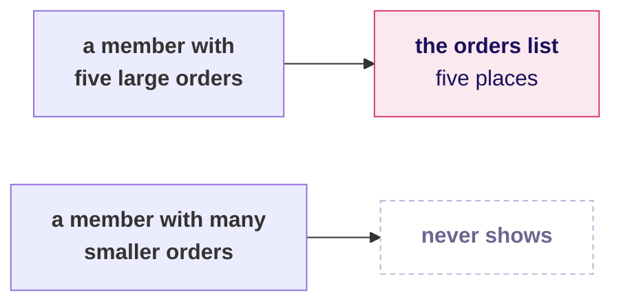

**The check.** Count the different members on the list beside its rows: a list of members holds as many members as rows, and this one holds 28 for 50.

```notes
LIVE, 2 minutes. The check is one line, count(DISTINCT customer_id) beside count(*), and it belongs
on every list before it leaves the team. Then the fix.
```

---

## S18. The fix: rank members, and 22 more are reached
*What changes when each member's orders are added up first?*

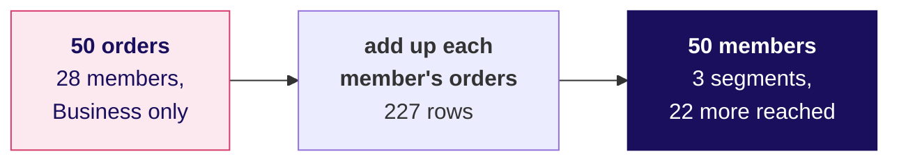

**What changed.** Adding up each member's orders before ranking gives fifty rows and fifty members. It reaches seven Business members the orders list missed and the fifteen retail members it could never show.

```notes
LIVE, 2 minutes. This is S15's list: the right unit. Then a second route that shares no SQL.
```

---

## S19. A second route: Python's sort, the same fifty
*Does a sort in Python pick the same fifty members?*

```python
spend = {}
for r in rows:                                   # the 462 Q2 order rows
    spend[r["customer_id"]] = spend.get(r["customer_id"], 0) + r["amount"]
fifty = sorted(spend, key=lambda cid: (-spend[cid], cid))[:50]
```

```stats
value: 50 = 50 | label: members | note: the same fifty, in the same order
value: 462 | label: rows moved | note: to say what the query said in 50
```

```notes
LIVE, 2 minutes. A slip in the window's ORDER BY could not move this list, since the two share no
code; that is what makes it a second route. It moves 462 rows out of the warehouse, which is why it
is the check and the query is the answer. Then the chapter's answers.
```

---

## S20. Fifty members, and the list is a Business list
*So which fifty members spent the most in Q2?*

| The question on the way | The answer |
|---|---|
| 1. Which way, at what cost? | Group, then number in a window: 50 rows leave |
| 2. What did each member book? | 227 rows, all 462 orders and Rs 9,84,00,000 |
| 3. Which fifty spent most? | 35 Business, 11 Retail-Plus, 4 Retail-Core |
| 4. What does the quick list give? | 50 orders naming 28 members, all Business |
| 5. Which segments does it reach? | Three; Student none |
| 6. Does Python agree? | Yes, member for member |

**Kavya's review.** "Say what one row of your list is before you say who is on it. A top fifty of orders and a top fifty of members look alike on screen and send Marketing to different people."

**In the interview.** [S] What is the difference between GROUP BY and a window function? [F] Your top-fifty list has fifty rows but twenty-eight names: what happened?

```notes
LIVE, 2 minutes. The tag says how often screens ask it: [S] a staple asked everywhere, [F]
frequent at global capability centres and product companies, [D] a differentiator. One breath for
the interview: GROUP BY collapses a group to one row; a window keeps every row and adds a column,
such as a place. The answer raises chapter 2's question: Marketing asked for fifty in each segment.
Then chapter 2.
```

---

## SECTION 2: Top fifty per segment?
*Which fifty members lead each of the four segments, so that no segment's protect budget goes unspent?*

```notes
LIVE. Thirty minutes. Notebook C2_W02_D03_02_each_segment and its .sql file run beside it.
```

---

## S21. Answering it per segment: five questions on the way
*Who needs this answer, and which questions lead to it?*

**Who needs the answer.** The marketing lead spends each segment's protect budget on that segment's own members, and the head of Retail-Plus wants his best members rung before they drift. A list that hands Retail-Plus a few places and Student none leaves the tier Marketing worries about mostly unprotected.

```timeline
label: 1 | title: Which way, at what cost? | body: Four ways per segment
label: 2 | title: Can GROUP BY do it? | body: What it can return
label: 3 | title: What does one numbering give? | body: The whole book, then split
label: 4 | title: What does PARTITION BY restart? | body: The count per list
label: 5 | title: Do four queries agree? | body: One query per segment | tone: dark
```

```notes
LIVE, 1 minute. Chapter 1 found the whole-book list: 35 Business, 11 Retail-Plus, 4 Retail-Core,
no Student. Read the five questions. Then the need.
```

---

## S22. Each segment's budget needs its own fifty
*Who asks for a list per segment, and what does a whole-book list cost them?*

```cards
icon: megaphone | eyebrow: Who asks | title: The marketing lead | body: Sets a protect budget per segment and spends it on that segment's members.
icon: list-ordered | eyebrow: The metric | title: Q2 revenue, ranked within a segment | body: A member's place among their own segment's buyers.
icon: triangle-alert | eyebrow: A wrong list costs | title: A tier left unprotected | body: A Retail-Plus member who lapses takes the fee and every order after it. | tone: dark
```

**The client asks.** "Give us the top fifty customers by Q2 revenue in each segment."

```notes
LIVE, 2 minutes. Read the ask's last three words. Then a company that ranks inside each group.
```

---

## S23. Amazon ranks each item inside its own category
*Has a real company had to rank inside each group, because one overall list hides the leaders?*

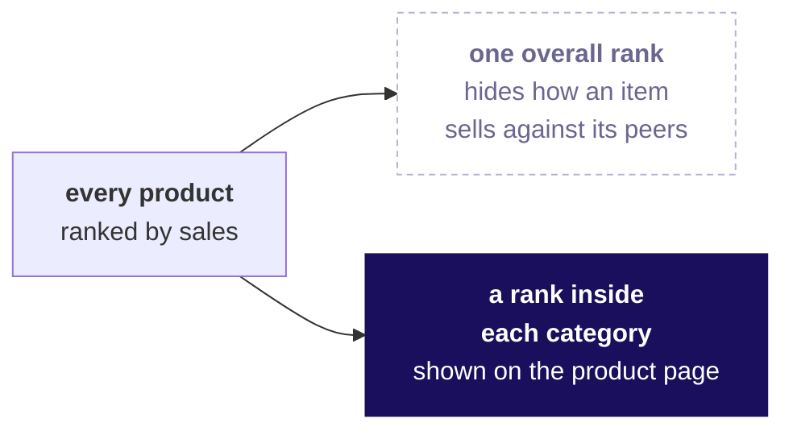

**What breaks.** Amazon says the overall rank "doesn't always indicate how well an item is selling in relation to similar items", so it keeps best-seller lists by category and subcategory.

```notes
LIVE, 2 minutes. Source: Amazon's help page on Best Sellers Rank, checked 1 October 2026; its lists
say "updated frequently". The room knows the people version: JEE Advanced publishes a rank list
inside each category beside the common list, and in 2026 the OBC-NCL rank 1 stood third on the
common list and the GEN-EWS rank 1 sixth (the results release of 1 June 2026). Then the options.
```

---

## S24. PARTITION BY: one query, the orders read once
*How could the team build one list per segment, and what would each way cost?*

| Option | How each segment gets fifty | Queries | Works through |
|---|---|---|---|
| A. One sorted query per segment, UNION ALL | its own LIMIT 50 | 4 | 1,848 order rows |
| B. Count who spent more | 1 plus members who booked more | 1 | 16,617 member pairs |
| C. A window with PARTITION BY segment | numbering restarts per segment | 1 | 462 order rows |
| D. GROUP BY segment, LIMIT 50 | none: one row per segment | 1 | cannot list members |

**The call.** C: one query, one pass, and a new segment needs no change. What would switch it: a database with no window functions, such as MySQL before 8.0, which leaves A.

```notes
LIVE, 4 minutes. 16,617 is 35 squared plus 96 squared plus 76 squared plus 20 squared: B sets every
member against every member of the same segment. A reads the 462 Q2 orders once per query. MySQL
first shipped window functions in its 8.0 line, generally available from April 2018. Then the
picture.
```

---

## S25. PARTITION BY restarts the numbering in each segment
*What does PARTITION BY do to the numbering?*

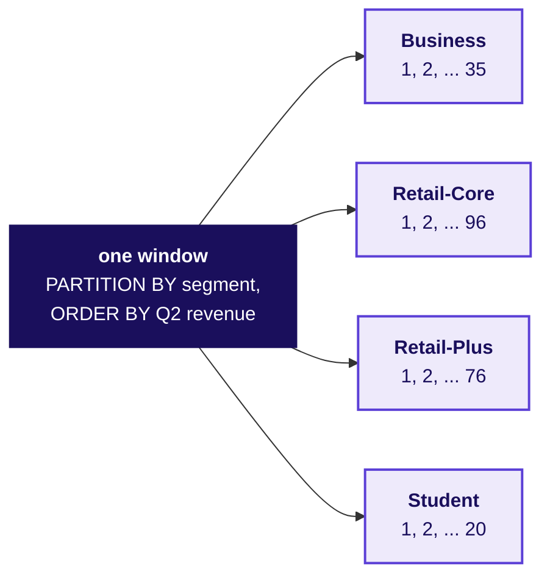

```notes
LIVE, 1 minute. The partition says whose rows belong together; the ORDER BY inside the brackets
says who comes first within them. Then the GROUP BY attempts.
```

---

## S26. Question: how many rows does GROUP BY return?
*Can GROUP BY return each segment's top fifty?*

```sql
SELECT c.segment, count(DISTINCT o.customer_id) AS members, sum(o.amount) AS q2_revenue
FROM   orders o JOIN customers c USING (customer_id)
WHERE  o.quarter = 'Q2'
GROUP  BY c.segment;
```

**Question.** How many rows come back, as a letter? a) 4; b) 155, fifty or every buyer per segment; c) 200, fifty per segment; d) 50.

```notes
LIVE, 2 minutes. Letters in chat. Then the answer, and the second attempt.
```

---

## S27. Answer: 4 rows, and LIMIT gives chapter 1's list
*Can GROUP BY return each segment's top fifty?*

```stats
value: 4 | label: rows | note: GROUP BY segment, one per group
value: 50 | label: rows | note: GROUP BY member, LIMIT 50: chapter 1's list again
```

**The check.** GROUP BY answers how much per segment: Business Rs 9,75,84,600, Retail-Plus Rs 4,13,380, Retail-Core Rs 3,66,250, Student Rs 35,770. LIMIT counts rows across the whole sorted result and knows nothing of segments.

```notes
LIVE, 2 minutes. The answer is a. GROUP BY can say how much each segment booked; it cannot say who
leads each one. Then the quickest per-segment list.
```

---

## S28. Wrong answer: Retail-Plus 11, Student none
*What does numbering the whole book once give each segment?*

```sql
row_number() OVER (ORDER BY q2_revenue DESC, customer_id) AS position
...
count(*) FILTER (WHERE position <= 50)   -- counted per segment
```

```stats
value: 35 | label: Business | note: of 35
value: 4 | label: Retail-Core | note: of 96
value: 11 | label: Retail-Plus | note: of 76
value: 0 | label: Student | note: of 20
```

```notes
LIVE, 3 minutes, notebook 02, section 2. Ask first: how many Retail-Plus members does this give?
Then run it. Sent as "the top fifty in each segment", it tells Marketing to protect 11 Retail-Plus
members, the tier it worries about, and tells the Student team it has nobody worth a call. Then why.
```

---

## S29. Why it is wrong: one numbering ranks Business first
*Why does a number from the whole book short every retail segment?*

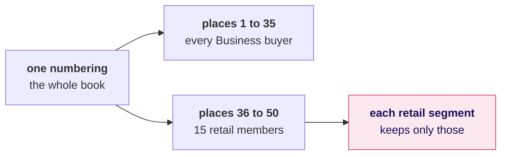

**The check.** Each segment's list should hold fifty, or every buyer where a segment has fewer. Set each count beside the smaller of 50 and its buyers: Retail-Plus has 76 buyers and gets 11.

```notes
LIVE, 2 minutes. Only Business looks right, because all its buyers rank above every retail member.
The check is a business rule written as a number, and it flags three of the four lists. Then the fix.
```

---

## S30. Question: how many members across the four lists?
*What does PARTITION BY restart, and how many members does each list hold?*

```sql
row_number() OVER (PARTITION BY segment
                   ORDER BY q2_revenue DESC, customer_id) AS position
```

**Question.** How many members do the four lists hold together, as a letter? a) 200, fifty in each; b) 155; c) 50; d) 227, every member who bought.

```notes
LIVE, 2 minutes. Letters in chat. Then the answer.
```

---

## S31. Answer: 155, fifty or every buyer per segment
*What does PARTITION BY restart, and how many members does each list hold?*

```stats
value: 35 | label: Business | note: every buyer
value: 50 | label: Retail-Core | note: of 96
value: 50 | label: Retail-Plus | note: of 76
value: 20 | label: Student | note: every buyer
```

**What changed.** The places restart at 1 in every segment: Retail-Core's place 1 is C-0010 on Rs 13,910, Retail-Plus's is C-0170 on Rs 21,740. Retail-Plus goes from 11 places to 50, and Student from none to 20.

```notes
LIVE, 2 minutes. The answer is b. Fifty is a cap: Business and Student have fewer than fifty Q2
buyers, so their lists hold every buyer. Then the one error most people meet on the way.
```

---

## S32. A place filter waits for the outer query
*Why does Postgres refuse the place filter in WHERE, and where does it go?*

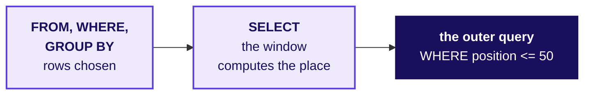

**The rule.** WHERE decides which rows exist before any window is computed, so the place does not exist yet when WHERE runs. Compute it in a named step and filter outside.

```notes
LIVE, 2 minutes, and never longer. Somebody writes the filter in WHERE; Postgres prints "ERROR:
window functions are not allowed in WHERE". Read the last line, point at Monday's drawing of the
order a query runs in, move the place into a CTE, and move on. It is an error met on the way, never
a trap. Then a second route with no window.
```

---

## S33. A second route: four queries, the same 155
*Does one sorted query per segment pick the same members?*

```sql
(SELECT 'Business' AS segment, o.customer_id, sum(o.amount) AS q2_revenue
 FROM orders o JOIN customers c USING (customer_id)
 WHERE o.quarter = 'Q2' AND c.segment = 'Business'
 GROUP BY o.customer_id ORDER BY q2_revenue DESC, o.customer_id LIMIT 50)
UNION ALL  ... the same for Retail-Core, Retail-Plus and Student
```

```stats
value: 155 = 155 | label: members | note: the same ones in every segment
value: 4 | label: places to edit | note: when the segments change
```

```notes
LIVE, 2 minutes. Each piece sits in brackets so its ORDER BY and LIMIT apply to it alone. A slip in
the window's PARTITION BY could not move this list. Then the chapter's answers.
```

---

## S34. Each segment gets fifty, or every buyer
*So which fifty members lead each of the four segments?*

| The question on the way | The answer |
|---|---|
| 1. Which way, at what cost? | PARTITION BY: one query, the orders read once |
| 2. Can GROUP BY do it? | No: 4 rows, or chapter 1's list again |
| 3. What does one numbering give? | Retail-Plus 11, Student none: short |
| 4. What does PARTITION BY restart? | The places: 155 members, 35, 50, 50, 20 |
| 5. Do four queries agree? | Yes, member for member |

**Kavya's review.** "Read the ask's last words again before you rank. 'In each segment' is a PARTITION BY, and each segment's list holds fifty members or every buyer, whichever is fewer: count it before it leaves the team."

**In the interview.** [S] Top three per group: GROUP BY or a window, and why? [F] Why can a window function not sit inside WHERE, and what do you do instead?

```notes
LIVE, 2 minutes. One breath for the first: a window with PARTITION BY the group numbers the rows
inside each group and keeps them all, where GROUP BY collapses each group to one row and LIMIT
counts across the whole result. Each list was cut by row_number, with the customer id deciding any
two members who booked the same. Chapter 3 asks the head of Retail-Plus's question. Then chapter 3.
```

---

## SECTION 3: Who makes it at a tie?
*When two members spent the same at the line, how many does a list ship, and which rule did the head of Retail-Plus ask for?*

```notes
LIVE. Thirty minutes. Notebook C2_W02_D03_03_tie_rule, its .sql file, the guided build
(exercises/guided/C2_W02_D03_tie_STUDENT.md) and the companion page run beside it. Never cut the
tie demonstration.
```

---

## S35. Answering the head's rule: six questions on the way
*Who needs this answer, and which questions lead to it?*

**Who needs the answer.** The head of Retail-Plus will defend the list to his members and to Marketing. A member left off by a coin toss, with the same spend as the member kept, has a fair complaint; a list labelled fifty that carries fifty-two has spent two calls nobody planned; a list that drops both members of a tie is the forty-nine he refused.

```timeline
label: 1 | title: Which rule, at what cost? | body: Four rules at the line
label: 2 | title: One tie, three functions? | body: Six invented members
label: 3 | title: A tie at the line? | body: An invented top four
label: 4 | title: How many in Retail-Core? | body: Four counts on Kalpa
label: 5 | title: How many in your segment? | body: Your own run
label: 6 | title: Does a plain count agree? | body: No window at all | tone: dark
```

```notes
LIVE, 1 minute. Chapter 2's lists were cut by row_number, with the customer id deciding any two
members who booked the same. Read the six questions. Then the need.
```

---

## S36. The head of Retail-Plus wants ties ranked the same
*Who asks for a tie rule, and what does the wrong rule cost him?*

```cards
icon: crown | eyebrow: Who asks | title: The head of Retail-Plus | body: Owns the paid membership tier and answers to its members for the list.
icon: hash | eyebrow: The metric | title: The count on each list | body: How many members each rule ships at fifty, beside Q2 revenue per member.
icon: triangle-alert | eyebrow: The wrong rule costs | title: A member dropped, or two extra | body: A coin toss at the line, or a list that says fifty and carries more. | tone: dark
```

**The client asks.** "Ties matter. If two members spent the same, I want them ranked the same, and I want to know how many made the top fifty, not forty-nine because of a tie."

```notes
LIVE, 2 minutes. Two members tie when their Q2 revenue is the same to the rupee. Then a company that
writes its tiebreaker down, and a race that shows the head's rule.
```

---

## S37. American Airlines writes its tiebreaker down
*Has a real company had to decide who goes first when two customers are equal?*

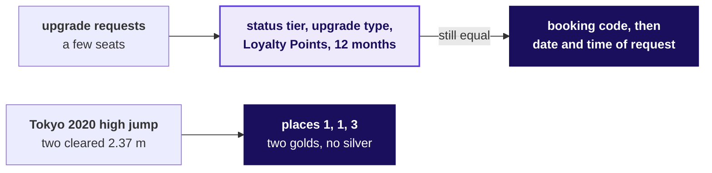

**What breaks.** A hard cap needs a tiebreaker written down before anyone is equal; a shared place needs the places after it to skip.

```notes
LIVE, 2 minutes. aa.com, upgrades for status members, checked 1 October 2026: "If the upgrade type
and 12-month Loyalty Point value are the same, we'll look at the booking code then date / time of
the request to determine priority." Tokyo 2020 men's high jump final, 1 August 2021: Barshim of
Qatar and Tamberi of Italy both cleared 2.37 m and shared the gold, and Nedasekau of Belarus was
placed third with the bronze; no silver (World Athletics results, checked 1 October 2026). Then
the four rules.
```

---

## S38. RANK: ties share a place and the count is said
*Which rules could cut a list at fifty, and what does each do at a tie?*

| Rule | At a tie on the line | Invented top four ships | Meets the head's ask? |
|---|---|---|---|
| A. ROW_NUMBER, stated tiebreaker | one in, one out | 4 | No: equal spend, different places |
| B. RANK | both in; next place skipped, 1, 1, 3 | 5 | Yes, with the count said |
| C. DENSE_RANK | both in; nothing skipped, 1, 1, 2 | 5 | Can run past fifty even untied |
| D. Whole ties only | both out unless all fit | 3 | Runs short: the forty-nine |

**The call.** B, RANK, with the count and its reason in the report. What would switch it: a hard cap, such as fifty seats at a members' dinner, where ROW_NUMBER with a tiebreaker stated in advance is honest.

```notes
LIVE, 4 minutes. The invented top four: A Rs 9,100, B 8,800, C 8,200, D 7,400, E 7,400, F 6,900,
with D and E tied at fourth. Whole ties only has no function of its own: count(*) OVER (PARTITION
BY q2_revenue) gives each member the number who share their figure, and rank + tied_with - 1 is the
last place the tie reaches. A good tiebreaker under a cap is a business reason, such as more Q2
orders first. Then predict the three functions.
```

---

## S39. Question: what does RANK give six members?
*What do ROW_NUMBER, RANK and DENSE_RANK give on one tie?*

| Member | A | B | C | D | E | F |
|---|---|---|---|---|---|---|
| Spend, Rs (invented) | 7,500 | 7,500 | 6,000 | 5,200 | 5,200 | 4,100 |

**Question.** What does RANK give the six, in order, as a letter? a) 1, 2, 3, 4, 5, 6; b) 1, 1, 3, 4, 4, 6; c) 1, 1, 2, 3, 3, 4; d) 1, 1, 1, 2, 2, 3.

```notes
LIVE, 3 minutes. Pairs write all three columns on paper first, ROW_NUMBER, RANK and DENSE_RANK,
then letters in chat for RANK. The members are invented. Then the answer.
```

---

## S40. Answer: 1, 1, 3, 4, 4, 6 skips a place
*What do ROW_NUMBER, RANK and DENSE_RANK give on one tie?*

| Function | A | B | C | D | E | F |
|---|---|---|---|---|---|---|
| ROW_NUMBER | 1 | 2 | 3 | 4 | 5 | 6 |
| RANK | 1 | 1 | 3 | 4 | 4 | 6 |
| DENSE_RANK | 1 | 1 | 2 | 3 | 3 | 4 |

**The check.** RANK reads like a race: two share first, so the next is third. DENSE_RANK numbers spend figures, so by F its 4 is two below F's place among the members, 6.

```notes
LIVE, 2 minutes. The answer is b. ROW_NUMBER puts A ahead of B only because the tiebreaker sorts A
first. Then the line itself.
```

---

## S41. Question: how many rows at a tie on the line?
*How many rows does each rule ship when two members tie at the line?*

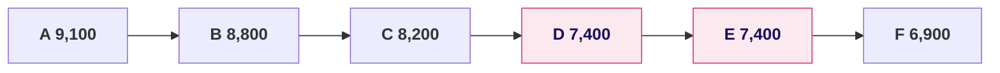

**Question.** Marketing wants a top four from these invented members, and D and E tie at fourth. How many rows does RANK ship, as a letter? a) 4; b) 5; c) 3; d) 6.

```notes
LIVE, 2 minutes. Letters in chat. Then the four counts.
```

---

## S42. Answer: RANK ships 5; the rules ship 4, 5, 5, 3
*How many rows does each rule ship when two members tie at the line?*

```stats
value: 4 | label: ROW_NUMBER | note: one of D and E left off
value: 5 | label: RANK | note: both kept, fourth shared
value: 5 | label: DENSE_RANK | note: both kept here
value: 3 | label: Whole ties only | note: both left off
```

**The check.** Every rule ships the line exactly when nobody ties at it. A tie at the line is where the rules part, and the count is how the reader finds out.

```notes
LIVE, 2 minutes. The answer is b. This is the forty-nine or fifty-one the head of Retail-Plus
spoke of, at four instead of fifty. Then the same four counts on Kalpa.
```

---

## S43. Wrong answer: DENSE_RANK ships 52 for Retail-Core
*How many Retail-Core members does each rule put on a top-fifty list?*

```stats
value: 50 | label: ROW_NUMBER | note: Retail-Core's top fifty
value: 50 | label: RANK | note: no tie at the line
value: 52 | label: DENSE_RANK | note: sent as "the top fifty"
value: 50 | label: Whole ties only | note: no tie at the line
```

```notes
LIVE, 3 minutes, notebook 03, section 4. Retail-Core, the everyday shoppers, has 96 Q2 buyers.
Ask first: a hurried analyst reads "ties ranked the same" and picks DENSE_RANK because its numbers
never skip; how many members does it ship? Then run it. The decision it misleads: a list labelled
top fifty that carries 52, two of whom tie with nobody. Then why.
```

---

## S44. Why it is wrong: two ties above leave it two behind
*Why does DENSE_RANK's fiftieth number land on the 52nd member?*

| Place | Member | Q2 revenue | RANK | DENSE_RANK |
|---|---|---|---|---|
| 50 | C-0005 | Rs 2,980 | 50 | 48 |
| 51 | C-0092 | Rs 2,950 | 51 | 49 |
| 52 | C-0094 | Rs 2,910 | 52 | 50 |
| 53 | C-0048 | Rs 2,870 | 53 | 51 |

**The check.** Read the places around the line with the functions side by side, and list the ties inside the first fifty: two members on Rs 4,540 at places 31 and 32, two on Rs 4,120 at places 37 and 38.

```notes
LIVE, 2 minutes. Each tie higher up costs DENSE_RANK one number, so its 50 falls on C-0094, the
52nd member. Nobody ties at Retail-Core's line: the fiftieth booked Rs 2,980 and the 51st Rs 2,950.
Then the fix.
```

---

## S45. The fix: RANK ships Retail-Core's fifty
*What changes when the list is cut by RANK, the head's rule?*

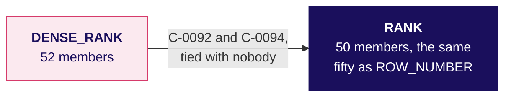

**What changed.** With no tie at the line, RANK and ROW_NUMBER agree, and the head's rule costs nothing. RANK only ships more than fifty when members tie at the line itself, and then the report says how many and why.

```notes
LIVE, 2 minutes. Then the head of Retail-Plus's own segment, which the room counts itself.
```

---

## S46. Your turn: count the head's own segment
*How many members does the Retail-Plus list ship under the head's rule?*

```python
mine = rows(Q["c3_your_segment"])[0]     # the four counts for Retail-Plus
mine
```

**The client asks.** "I want to know how many made the top fifty." Write the sentence the head of Retail-Plus reads: how many members his list carries under RANK and, if it is not fifty, why.

```notes
LIVE, 4 minutes. Every learner runs the cell in notebook 03's section 5 and writes the sentence
before anyone shares a number. If a learner's four numbers differ, point them at the notebook's
instruction to read the members around fiftieth place with block c3_core_line changed to
Retail-Plus. Do not read any count aloud; the day sheet carries it for the debrief. Then a second
route that needs no window.
```

---

## S47. A second route: count who spent at least the 50th
*Does a count with no window agree with RANK?*

```sql
SELECT count(*) FROM q2
WHERE  segment = 'Retail-Core'
  AND  q2_revenue >= (SELECT q2_revenue FROM q2 WHERE segment = 'Retail-Core'
                      ORDER BY q2_revenue DESC OFFSET 49 LIMIT 1);
```

```stats
value: 50 = 50 | label: Retail-Core | note: members at or above Rs 2,980, and RANK's count
value: 4 of 4 | label: segments agree | note: your own segment among them
```

```notes
LIVE, 2 minutes. A member ties with the fiftieth exactly when they booked the same figure, so the
count includes every tie at the line, as RANK does. It shares no window with RANK, so a slip in a
PARTITION BY could not move it. Then the chapter's answers.
```

---

## S48. RANK, with its count and reason in the report
*So when two members spend the same at the line, how many does a list ship, and which rule?*

| The question on the way | The answer |
|---|---|
| 1. Which rule, at what cost? | RANK; ROW_NUMBER only under a hard cap |
| 2. One tie, three functions? | 1 to 6; 1, 1, 3, 4, 4, 6; 1, 1, 2, 3, 3, 4 |
| 3. A tie at the line? | Top four: 4, 5, 5 and 3 rows |
| 4. How many in Retail-Core? | 50 under RANK; 52 under DENSE_RANK |
| 5. How many in your segment? | The count your own run gave, with its reason |
| 6. Does a plain count agree? | Yes, in every segment: 50 for Retail-Core |

**Kavya's review.** "A tie rule is a business decision written as a function name. State the rule, the count it ships and the members at the line in the same sentence, before anybody asks why the list holds more or fewer than fifty."

**In the interview.** [S] RANK, DENSE_RANK and ROW_NUMBER on a tie. [D] The business says ties rank the same: which function, and how many rows might a top-N report ship?

```notes
LIVE, 2 minutes. One breath for the second: RANK, and the report can ship more than N when a tie
straddles the line, so it states the count; DENSE_RANK can ship more than N even with no tie at the
line; ROW_NUMBER always ships N and hides the tie. Then the break, and chapter 4 after it.
```

---

## SECTION 4: Whose spend is falling?
*Whose monthly spend fell two months running, so Marketing can ring them before they drift further?*

```notes
LIVE. Thirty minutes, after the ten-minute break. Notebook C2_W02_D03_04_falling_spend and its .sql
file run beside it.
```

---

## S49. Answering the flag: six questions on the way
*Who needs this answer, and which questions lead to it?*

**Who needs the answer.** The marketing lead's member team will ring each flagged member with a retention offer. A flag that names the wrong member costs a call and tells a loyal customer they are slipping; a fall the flag misses is a member nobody rang until they had gone.

```timeline
label: 1 | title: Which way, at what cost? | body: Four ways to compare months
label: 2 | title: What did each spend monthly? | body: One row per member-month
label: 3 | title: What does LAG put beside it? | body: One member's months
label: 4 | title: What if nothing partitions? | body: Whose month LAG reads
label: 5 | title: How many fell twice? | body: Each member's months apart
label: 6 | title: Does a Python walk agree? | body: No window at all | tone: dark
```

```notes
LIVE, 1 minute. The protect lists are built; this is Marketing's second ask. Read the six
questions. Then the need.
```

---

## S50. Marketing rings members whose spend is slipping
*Who asks for the flag, what does it measure, and what does a wrong flag cost?*

```cards
icon: phone | eyebrow: Who asks | title: The marketing lead | body: The member team rings each flagged member with a retention offer.
icon: calendar | eyebrow: The metric | title: Monthly spend | body: A member's booked revenue in one calendar month, April to September 2026.
icon: triangle-alert | eyebrow: A wrong flag costs | title: A loyal member accused | body: Or a member who drifts with nobody ringing. | tone: dark
```

**The client asks.** "Flag anyone whose monthly spend has fallen for two months running."

```notes
LIVE, 2 minutes. The flag reads September, the last month: September below the month before, and
that month below the one before it. Then a company that judges each customer against their own past.
```

---

## S51. Square judges each customer against their own past
*Has a real company had to judge a customer against that customer's own earlier pattern?*

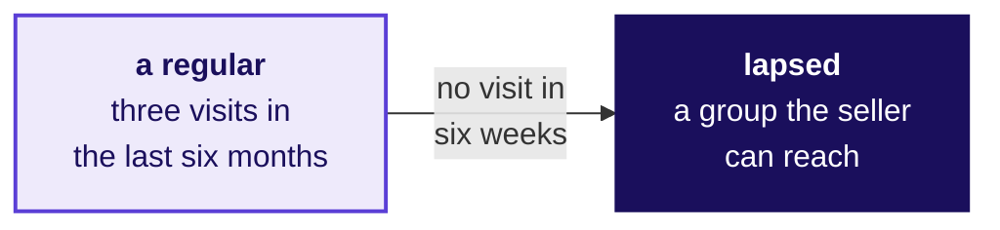

**What breaks.** A drop means something only against the customer's own pattern, so the comparison has to stay inside each customer's history.

```notes
LIVE, 2 minutes. Square Support Center, the page on customer groups and filters, checked 1 October
2026: its "Lapsed" group is "customers who were regulars, but haven't visited in the last six
weeks", a regular having visited three times in the last six months. Then four ways to compare a
month with the month before.
```

---

## S52. LAG reads each member-month once: 752 rows
*How could the team set each month beside the month before, and what would each way cost?*

| Option | How it reaches the month before | Works through |
|---|---|---|
| A. LAG in a window | reads the row before, in the window's order | 752 member-months, once |
| B. A self-join, twice | joins each month to the member's months before | 1,504 matches |
| C. A lookup per row | a correlated subquery, twice per row | 1,504 lookups |
| D. Months as spreadsheet columns | a person reads across each row | 1,806 cells |

**The call.** A: one pass, and lag(spend, 2) reaches two months back in the same line. What would switch it: a database with no window functions, such as MySQL before 8.0, which leaves the self-join.

```notes
LIVE, 4 minutes. The book holds 752 member-months, one row per member per month with an order, for
301 members who bought at least once; 118 ordered in September. Then the picture of LAG.
```

---

## S53. LAG reads the row before, inside its window
*What does LAG put beside each row?*

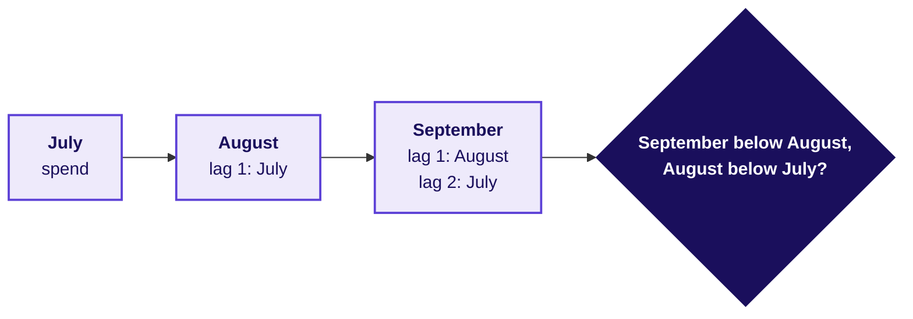

`lag(spend, 1) OVER (PARTITION BY customer_id ORDER BY month)` reads the previous row inside the member's own months, and `lag(spend, 2)` two rows back. LEAD reads the next row the same way; nothing today needs it.

```notes
LIVE, 1 minute. Then predict on one member.
```

---

## S54. Question: what does LAG show on the first month?
*What does LAG put beside one member's months?*

| Month | Apr | May | Jun | Jul | Aug | Sep |
|---|---|---|---|---|---|---|
| C-0040, Rs | 7,980 | 3,170 | 1,320 | 4,260 | 4,770 | 4,520 |

**Question.** What does lag(spend, 1) show on C-0040's first month, April, as a letter? a) 0; b) NULL, since no row comes before it; c) September's spend; d) April's own spend.

```notes
LIVE, 2 minutes. C-0040 of Retail-Core bought in all six months. Letters in chat. Then the answer.
```

---

## S55. Answer: NULL, and June fell twice running
*What does LAG put beside one member's months?*

| Month | Spend | lag 1 | lag 2 |
|---|---|---|---|
| Apr | Rs 7,980 | NULL | NULL |
| May | Rs 3,170 | Rs 7,980 | NULL |
| Jun | Rs 1,320 | Rs 3,170 | Rs 7,980 |
| Sep | Rs 4,520 | Rs 4,770 | Rs 4,260 |

**The check.** June sits below May and May below April, so a flag read at June would fire. September is below August but August is above July, so the flag read at September does not fire for C-0040.

```notes
LIVE, 2 minutes. The answer is b. Then the quickest version of the flag.
```

---

## S56. Question: does the quick flag flag more or fewer?
*What does LAG read when the window has no PARTITION BY?*

```sql
lag(spend, 1) OVER (ORDER BY customer_id, month) AS spend_1_back,
lag(spend, 2) OVER (ORDER BY customer_id, month) AS spend_2_back
...
WHERE month = DATE '2026-09-01' AND spend < spend_1_back AND spend_1_back < spend_2_back
```

**Question.** Against the version with PARTITION BY customer_id, does this flag more members, fewer or the same, as a letter? a) the same, since the sort keeps each member together; b) more; c) fewer; d) none, since LAG needs a partition.

```notes
LIVE, 2 minutes. Letters in chat, then run it. Then the answer.
```

---

## S57. Answer: more: 20 flagged, the plausible wrong answer
*What does LAG read when the window has no PARTITION BY?*

```stats
value: 20 | label: members flagged | note: LAG with no PARTITION BY
value: 4 | label: of them | note: compared with another member's month
```

**What breaks.** Four members would be rung about a fall that happened in somebody else's account.

```notes
LIVE, 2 minutes, notebook 04, section 3. The answer is b. Then why it happens.
```

---

## S58. Why it is wrong: LAG ran into the member before
*Why did C-0132 get flagged for a fall from a month he never had?*

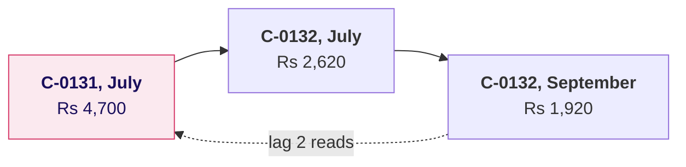

**The check.** Carry lag(customer_id) beside lag(spend) and count the flags where the member LAG read is not the member on the row. It should be zero; it is four.

```notes
LIVE, 2 minutes. With no PARTITION BY the window is the whole table, so LAG runs from one member's
last row into the next member's first. C-0132 bought only in July and September, so his second step
back is C-0131's July. Then the fix.
```

---

## S59. The fix: PARTITION BY customer_id flags 16
*How many members fell two months running once each member's months are kept apart?*

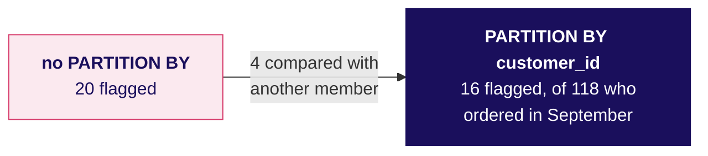

**What changed.** The window starts again for every member, so LAG returns NULL on a member's first row and never reaches into another member's months. Four members come off the call list.

```notes
LIVE, 2 minutes. Then a second route that shares no window.
```

---

## S60. A second route: a Python walk finds the same 16
*Does a walk through each member's months in Python find the same members?*

```python
months = {}
for r in rows:                                   # 752 member-months, unordered
    months.setdefault(r["customer_id"], []).append((r["month"], r["spend"]))
for cid, ms in months.items():
    ms.sort()                                    # each member's months, in order
```

```stats
value: 16 = 16 | label: members flagged | note: the same members as LAG
```

```notes
LIVE, 2 minutes. Python groups the rows by member and sorts each member's months itself, then flags
a member whose last month is September and whose last three months each fall. Both routes read the
month before as the member's previous row of months. Then the chapter's answers.
```

---

## S61. Sixteen members fell twice, months kept apart
*So whose monthly spend fell two months running?*

| The question on the way | The answer |
|---|---|
| 1. Which way, at what cost? | LAG: 752 member-months read once |
| 2. What did each spend monthly? | 752 member-months for 301 members |
| 3. What does LAG put beside it? | The row before; NULL on a first month |
| 4. What if nothing partitions? | 20 flags, four of them borrowed |
| 5. How many fell twice? | 16, with PARTITION BY customer_id |
| 6. Does a Python walk agree? | Yes, the same 16 |

**Kavya's review.** "A window that is not told whose rows belong together will compare anyone with anyone. Carry the id LAG read beside the value it read, and read the rows behind a flag before a call goes out."

**In the interview.** [F] How would you find customers whose spend fell two months in a row? [F] LAG returned a value on a customer's very first month: what went wrong?

```notes
LIVE, 2 minutes. One breath for the first: one row per customer per month, lag one and two over a
window partitioned by the customer and ordered by month, and keep the rows that fall twice. Chapter
6 comes back to these sixteen before Marketing rings any of them. Then chapter 5.
```

---

## SECTION 5: On track against plan?
*Has Q2 revenue kept pace with the plan line week by week, and where did it stand at mid-quarter, when Meera decides whether to act?*

```notes
LIVE. Thirty minutes. Notebook C2_W02_D03_05_against_plan and its .sql file run beside it.
```

---

## S62. Answering Meera: six questions on the way
*Who needs this answer, and which questions lead to it?*

**Who needs the answer.** Meera Raghavan decides at mid-quarter whether to hold the plan, push a campaign or move budget. A quarter reported behind plan when it is on plan sends Marketing after a gap that is not there, and a lead that one week made hides a run rate below plan.

```timeline
label: 1 | title: Which way, at what cost? | body: Four ways to accumulate
label: 2 | title: How much by each week's end? | body: The plan's weeks
label: 3 | title: Does it close on Q2? | body: Against Monday's total
label: 4 | title: Where at mid-quarter? | body: And each week since
label: 5 | title: Which order crossed? | body: A running total by order
label: 6 | title: Does a plain sum agree? | body: No window at all | tone: dark
```

```notes
LIVE, 1 minute. Read the six questions. Then the need.
```

---

## S63. Meera wants to know by mid-quarter
*Who asks for the plan line, what is measured, and what does a wrong reading cost?*

```cards
icon: chart-line | eyebrow: Who asks | title: Meera Raghavan | body: CEO of Kalpa Retail; decides at mid-quarter whether to act.
icon: calendar-range | eyebrow: The metric | title: Booked to date against plan to date | body: Every week up to and including the one on the row, both sides.
icon: triangle-alert | eyebrow: A wrong reading costs | title: A campaign for a gap that is not there | body: Discounts that cost margin, or a slipping run rate nobody sees. | tone: dark
```

**The client asks.** "Meera wants to see revenue accumulate week by week against the plan line, so we know by mid-quarter whether we are on track."

```notes
LIVE, 2 minutes. The plan line is a small table, plan_line: 13 weeks from Monday 6 July, Rs 75,69,230
each, Rs 9,83,99,990 in all. Mid-quarter is the end of the seventh plan week, the week of 17 August.
Then a company that read its quarter while it ran.
```

---

## S64. Target cut its Q2 guide five weeks in
*Has a real company had to read its quarter while it was still running?*

```stats
value: 5.3% | label: the guide before | note: centred on Q1's margin, 18 May 2022
value: ~2% | label: the guide on 7 June | note: about five weeks into Q2
value: 1.2% | label: where Q2 closed | note: released 17 August 2022
```

**What breaks.** A quarter read only at its end leaves nothing to act on; read week by week, it leaves time to move.

```notes
LIVE, 2 minutes. Target's second quarter of 2022 began on 1 May 2022. On 7 June 2022 Target said it
"now expects its second-quarter operating margin rate will be in a range around 2%", after
markdowns to clear excess inventory. Sources: Target's releases of 18 May, 7 June and 17 August
2022, checked 1 October 2026. Then four ways to accumulate.
```

---

## S65. A running SUM in a window: 462 rows read once
*How could the team accumulate the quarter against plan, and what would each way cost?*

| Option | How it accumulates | Works through |
|---|---|---|
| A. A running SUM in a window | weekly totals, then sum() OVER (ORDER BY week) | 462 orders, once |
| B. A plain SUM per week's end | every order up to each week's last day | 6,006 order reads |
| C. A self-join of weeks | each week with every week before | 91 week pairs |
| D. A spreadsheet column | an export, a formula copied down | 462 rows exported |

**The call.** A, booked and plan side by side in one table. What would switch it: one reading on a day Meera names, such as "where were we on 19 August?", which is one plain SUM with that date in WHERE.

```notes
LIVE, 4 minutes. 6,006 is the 462 Q2 orders read once for each of the 13 plan weeks; 91 is 13 times
14 over 2. Then the picture of a running total.
```

---

## S66. A running total keeps every week and adds to date
*What does sum() OVER (ORDER BY week) add to each row?*

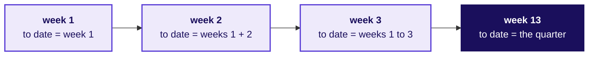

**The rule.** The last row of a running total is the quarter itself, so it has to equal the total you can count without it.

```notes
LIVE, 1 minute. Then the quickest build.
```

---

## S67. Question: where does booked to date finish?
*How much had Q2 booked by the end of each plan week?*

```sql
FROM plan_line p LEFT JOIN weekly w USING (week_start)   -- weekly: date_trunc('week', order_date)
...
sum(plan_revenue) OVER (ORDER BY week_start) AS plan_to_date,
sum(booked)       OVER (ORDER BY week_start) AS booked_to_date
```

**Question.** Where does booked to date finish against the plan to date of Rs 9,83,99,990, as a letter? a) on plan, within a few rupees; b) about Rs 15 lakh short; c) about Rs 1.6 crore ahead; d) nine times the plan.

```notes
LIVE, 2 minutes. The build starts from the plan's weeks and attaches each week's booked revenue by
the Monday its orders fall in. Letters in chat, then run it. Then the answer.
```

---

## S68. Answer: Rs 15,39,810 short, as the table says
*How much had Q2 booked by the end of each plan week?*

```stats
value: Rs 9,68,60,180 | label: booked to date | note: the plan-first build's close
value: Rs 9,83,99,990 | label: plan to date | note: thirteen weeks
value: Rs 15,39,810 | label: short of plan | note: the plausible wrong answer
```

**What breaks.** Sent to Meera, the line says Q2 missed plan, and the next quarter opens on a campaign to recover Rs 15 lakh.

```notes
LIVE, 2 minutes, notebook 05, section 1. The answer the table gives is b. Ask the room what they
would check before sending it. Then why it is wrong.
```

---

## S69. Why it is wrong: 1 to 5 July have no plan week
*Does the running total close on Monday's Q2 total?*

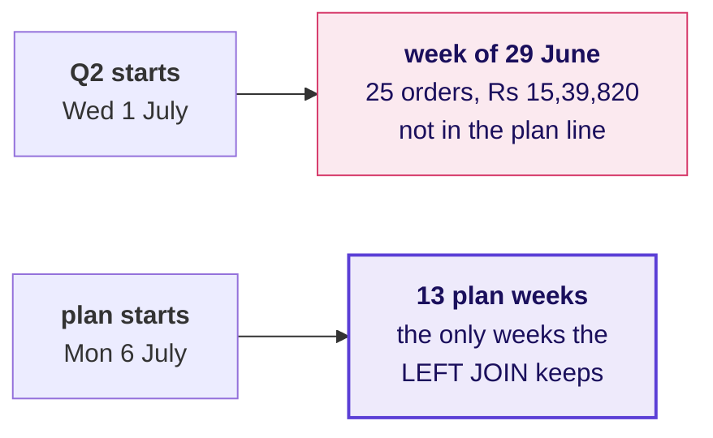

**The check.** The last booked to date has to equal Monday's Q2 total, Rs 9,84,00,000. It is Rs 15,39,820 short, and Q2's orders fall under 14 Mondays where the plan has 13.

```notes
LIVE, 2 minutes. A LEFT JOIN that starts from the plan's weeks keeps only the plan's weeks, so the
25 orders of 1 to 5 July, Rs 15,39,820, never enter. Tuesday's rule holds here: a join is done only
when its rows are explained. Then the fix.
```

---

## S70. The fix: Q2 closes Rs 10 ahead, on plan
*What changes when the plan's first week carries the days before it?*

```stats
value: Rs 9,84,00,000 | label: booked to date | note: Monday's Q2 total
value: Rs 9,83,99,990 | label: plan to date | note: thirteen weeks
value: Rs 10 | label: ahead | note: on plan
```

**What changed.** `greatest(date_trunc('week', order_date), the first plan Monday)` moves 1 to 5 July onto 6 July, so every Q2 order lands in a plan week. The quarter that read Rs 15,39,810 short closed Rs 10 ahead.

```notes
LIVE, 2 minutes. Then mid-quarter, where Meera reads it.
```

---

## S71. Question: where was Q2 at mid-quarter?
*Where did Q2 stand at mid-quarter, and how has each week run since?*

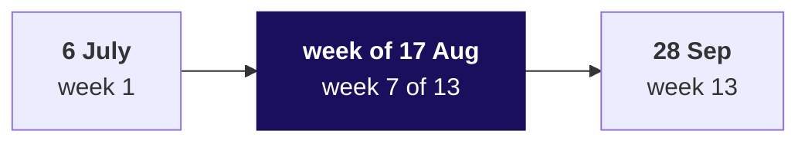

**Question.** At the end of the week of 17 August, where was booked to date against plan to date, as a letter? a) about Rs 15 lakh behind; b) about Rs 1.6 crore ahead; c) exactly on plan; d) about nine times the plan.

```notes
LIVE, 2 minutes. Letters in chat. Then the answer.
```

---

## S72. Answer: Rs 1.58 crore ahead, from one July week
*Where did Q2 stand at mid-quarter, and how has each week run since?*

```stats
value: Rs 1,57,51,980 | label: ahead at mid-quarter | note: Rs 6,87,36,590 against Rs 5,29,84,610
value: Rs 2,66,28,920 | label: the week of 13 July | note: 3.5 times its plan
value: 6 of 7 | label: full weeks below plan | note: from the week of 10 August
```

**The check.** The quarter was ahead by the total and behind by the run rate. A cumulative figure beside one week's plan, Rs 6,87,36,590 against Rs 75,69,230, reads as nine times plan and is never a comparison: to date goes beside to date.

```notes
LIVE, 3 minutes. The answer is b. The lead peaked at Rs 2,16,69,660 at the end of the week of 3
August and shrank from there to Rs 10 at the close, because one July week paid for the weeks after
it. That is the line Meera needs. Then a question at the grain of an order.
```

---

## S73. Question: what does 22 July's first order show?
*Can a running total by order say which order took Q2 past Rs 3.5 crore?*

```sql
sum(amount) OVER (ORDER BY order_date) AS by_date_alone
```

**Question.** 22 July, the busiest day of Q2, holds twelve orders. What does the first of them show, as a letter? a) Rs 3,45,16,000, the day before plus its own amount; b) Rs 3,76,90,290, the day's closing total; c) its own amount; d) NULL.

```notes
LIVE, 2 minutes. Rows that share the window's ORDER BY value are peers, and the default running sum
adds all of a row's peers at once. Letters in chat. Then the answer.
```

---

## S74. Answer: the day's close; add the order id
*Can a running total by order say which order took Q2 past Rs 3.5 crore?*

| Order | Amount | By date alone | By date and order id |
|---|---|---|---|
| KR-00557 | Rs 930 | Rs 3,76,90,290 | Rs 3,45,16,000 |
| KR-00580 | Rs 8,55,000 | Rs 3,76,90,290 | Rs 3,53,71,000 |
| KR-00979 | Rs 970 | Rs 3,76,90,290 | Rs 3,76,90,290 |

**The rule.** The order id makes every row its own step and the figure the same on every run. It does not make it the true order of the day, since the warehouse records a date and no time, so say which tiebreak the figure uses.

```notes
LIVE, 2 minutes. The answer is b. By date alone, all twelve orders show the day's closing total, so
no row can say which order crossed Rs 3.5 crore; with the order id added, KR-00580's step is the one
that crosses. Then a second route.
```

---

## S75. A second route: thirteen plain sums agree
*Does a plain sum up to each week's end agree with the running total?*

```sql
SELECT p.week_start,
       (SELECT sum(o.amount) FROM orders o
        WHERE  o.quarter = 'Q2' AND o.order_date <= p.week_start + 6) AS booked_to_date
FROM   plan_line p;
```

```stats
value: 13 of 13 | label: weeks agree | note: including the first, which ends 12 July
value: 6,006 | label: order reads | note: where the window read 462
```

```notes
LIVE, 2 minutes. The plain sums share no code with the window or with the greatest() fix. Then the
chapter's answers.
```

---

## S76. On plan by the total, below plan by the week
*So has Q2 kept pace with the plan line, and where was it at mid-quarter?*

| The question on the way | The answer |
|---|---|
| 1. Which way, at what cost? | A running SUM in a window: 462 rows read once |
| 2. How much by each week's end? | The plan-first build: Rs 15,39,810 short |
| 3. Does it close on Q2? | Once 1 to 5 July count: Rs 10 ahead |
| 4. Where at mid-quarter? | Rs 1.58 crore ahead, from one July week |
| 5. Which order crossed? | Only a unique tiebreak can say |
| 6. Does a plain sum agree? | Yes, in all thirteen weeks |

**Kavya's review.** "A running total is finished when its last value equals the total you can count without it. Close the loop on Monday's Rs 9,84,00,000 before you say ahead or behind."

**In the interview.** [F] What makes a running total deterministic? [D] Your running total closes below the quarter's total: what do you check first?

```notes
LIVE, 2 minutes. One breath for the second: whether every row made it in, by setting the last
cumulative value beside the independent total and looking for rows outside the join's calendar.
After lunch, chapter 6 brings the members back: Marketing wants to ring the flagged members on the
protect lists, and one of them says he was on holiday.
```
