# The protect list, ranked the way it was asked

Week 2, Day 3. Half one.

Kicker: WEEK 2  ·  WEDNESDAY  ·  HALF ONE
Quote: Give us the top fifty customers by Q2 revenue in each segment, and flag anyone whose monthly spend has fallen for two months running.
Who: Marketing, Kalpa Retail, to the data and AI team at Kalpa's Global Capability Centre

```notes
LIVE, one minute. Read Marketing's line aloud and leave it on screen while the room settles.
Marketing is working with the team now, because Tuesday's note answered their question honestly.
Say the shape of the morning once: the ask and the thinking, then three rounds, each ending on
Kavya's review. The afternoon is the escalated case. Then move on.
```

---

## SECTION 1: The ask
*Marketing wants a list it can act on, and every question in it keeps the rows GROUP BY would collapse.*

```notes
LIVE. Chapter one runs about 20 minutes, including the cover. No new SQL here: the job is to see
why Monday's tool cannot answer today's questions, and to draw the day's picture on the board.
```

---

## S1. Marketing's ask, and the condition on it
*Three asks in one message, and a condition from the head of Retail-Plus that decides a function name.*

**The client asks.** "Retail-Plus frequency is the problem, so we want to protect our best members before they drift. Give us the top fifty customers by Q2 revenue in each segment, and flag anyone whose monthly spend has fallen for two months running. And Meera wants to see revenue accumulate week by week against the plan line, so we know by mid-quarter whether we are on track."

> "Ties matter. If two members spent the same, I want them ranked the same, and I want to know how many made the top fifty, not forty-nine because of a tie." The head of Retail-Plus, Kalpa Retail

```notes
LIVE, 4 minutes. Read Marketing's message aloud, then the head of Retail-Plus's condition.
Ask the room to count the asks: three (the protect list, the falling flag, the running total
against plan) and one condition (ties). Your role today: Marketing acts on your list, so you
state the tie rule you chose and why, and you defend the falling flag against a member who says
he was on holiday. Write the three asks on the board in a column; the rungs slide fills it in.
Transition: before any query, what is already on the desk from Monday and Tuesday.
```

---

## S2. What Monday and Tuesday left on the desk
*A quarter total the room can reconcile to, and a row-count habit that catches a join going wrong.*

```stats
value: Rs 9,84,00,000 | label: Q2 booked | note: Monday's suite, all statuses
value: 462 | label: Q2 orders | note: from 1 July to 28 September
value: 227 | label: Q2 buyers | note: members with at least one Q2 order
value: 1,000 to 1,450 | label: rows | note: Tuesday's fan-out, caught by a count
```

**The rule.** Q2 revenue per member means the booked amount of the member's Q2 orders, all statuses, which is the definition Monday's suite used for the Rs 9,84,00,000 quarter total. Every number today carries that definition.

```notes
LIVE, 3 minutes. Monday built the suite with SELECT, GROUP BY, HAVING and CTEs, and the Q2 total
is the number every result today reconciles to. Tuesday taught that a count before and after a
join is the cheapest check there is. Both habits return this morning: count the rows under every
result before reading the names. Ask one learner to restate the definition of Q2 revenue.
Transition: what Monday's GROUP BY can and cannot do with Marketing's list.
```

---

## S3. A window keeps every row and adds its position
*GROUP BY collapses 227 member rows into four; a window keeps all 227 and says where each stands.*

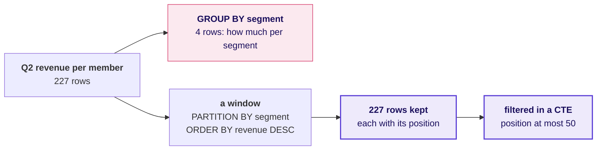

**In the interview.** [S] What is the difference between GROUP BY and PARTITION BY?

```notes
LIVE, 7 minutes. Ask first: can Monday's GROUP BY hand Marketing fifty members per segment? Take
two answers and hold them, because Round 1 counts what the hurried attempt hands out. Then draw this
picture on the board with the room and leave it up all day; the notebook, the cheat sheet and the afternoon use the same drawing. Say the first idea in
one breath: GROUP BY collapses rows to one per group, and a window function keeps every row and
adds a column computed across related rows. One-breath answer to the interview question: GROUP BY
returns one row per group; PARTITION BY sets the group a window restarts in and returns every row.
Transition: three asks become five rungs.
```

---

## S4. Five rungs, climbed in three rounds
*Each rung is a harder question, and each answer raises the next one.*

```timeline
label: Rung 1 | title: The fifty biggest | body: Who are the fifty biggest members by Q2 revenue? Round 1.
label: Rung 2 | title: Fifty per segment | body: Who are the fifty biggest inside each segment? Round 1.
label: Rung 3 | title: The fiftieth place | body: What happens at fiftieth when two members tie? Round 2.
label: Rung 4 | title: Falling spend | body: Whose monthly spend fell two months running? Round 3.
label: Rung 5 | title: Against plan | body: Is Q2 on track against the plan line? Round 3, then the afternoon. | tone: dark
```

```notes
LIVE, 5 minutes. Fill the board column from the first slide with the rungs. Rung 1 is the hurried reading of
the ask, and rung 2 is what Marketing meant. Rung 3 is where the head of Retail-Plus's condition
bites. Rungs 4 and 5 read each member against their own past and the quarter against its plan.
Transition: Round 1, who goes on the protect list.
```

---

## SECTION 2: Round 1, who goes on the list
*Fifty per segment is a position inside a group, which a window computes and a CTE filters.*

```notes
LIVE. Round 1 runs 50 minutes: the question and its picture (5), the demonstration on Kalpa (15),
the trap and its wrong number (10), the room's harder variant (15) and Kavya's review (5).
The notebook is C2_W02_D03_01_windows_STUDENT.ipynb; the SQL is sql/C2_W02_D03_01_windows_walk_STUDENT.sql.
```

---

## S5. Round 1: who goes on the protect list
*The top fifty members by Q2 revenue in each segment, which is the list Marketing acts on.*

```cards
icon: receipt | eyebrow: The measure | title: Q2 revenue per member | body: The booked amount of the member's Q2 orders, all statuses, as Monday defined it.
icon: users | eyebrow: The group | title: Each segment | body: Business, Retail-Plus, Retail-Core and Student, each ranked on its own.
icon: list-ordered | eyebrow: The output | title: Fifty per segment | body: One row per listed member, with the segment, the revenue and the position. | tone: dark
```

```notes
LIVE, 2 minutes. State the round's question and the three parts of it. Ask: which of the three
cards is the one a hurried analyst drops? The group. Keep the answer to yourself if nobody gets
it; the trap shows it.
Transition: draw the steps before touching SQL.
```

---

## S6. Four steps from orders to a list
*Collapse orders to members first, then rank members inside their segment, then keep the first fifty.*

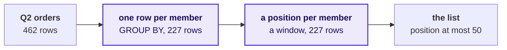

GROUP BY still has a job: it turns orders into members. The window then works on the member rows, and the row count only falls at the last step.

```notes
LIVE, 3 minutes. Draw the four boxes with the row count under each. The row counts are the check:
462, 227, 227, then the list. Ask the room which step is new today (the third). Point at the
second arrow: GROUP BY and a window are partners here, one after the other.
Transition: step one, on Kalpa.
```

---

## S7. Step 1: one row per member, 227 of them
*The biggest member books Rs 2,08,64,600 in Q2, and the Business segment fills the top of the table.*

```sql
SELECT c.segment, o.customer_id, sum(o.amount) AS q2_revenue
FROM   orders o
JOIN   customers c USING (customer_id)
WHERE  o.quarter = 'Q2'
GROUP  BY c.segment, o.customer_id
ORDER  BY q2_revenue DESC;
```

| segment | customer_id | q2_revenue |
|---|---|---|
| Business | C-0286 | Rs 2,08,64,600 |
| Business | C-0275 | Rs 61,58,000 |
| Business | C-0273 | Rs 61,19,000 |

```notes
LIVE, 5 minutes. Run block 1 of the walk file on the projector without its LIMIT 10, and read
the row count first: 227 members with a Q2 order. Then read the top three and ask what they have in common: all Business.
Watch for learners who read names before counts. Transition: before ranking, how many members
does each segment have to rank at all?
```

---

## S8. Step 2: four segments of very different sizes
*Business and Student have fewer than fifty Q2 buyers, so their top fifty is everyone who bought.*

| Segment | Q2 buyers | Q2 revenue | Top member |
|---|---|---|---|
| Business | 35 | Rs 9,75,84,600 | Rs 2,08,64,600 |
| Retail-Plus | 76 | Rs 4,13,380 | Rs 21,740 |
| Retail-Core | 96 | Rs 3,66,250 | Rs 13,910 |
| Student | 20 | Rs 35,770 | Rs 5,710 |

**The rule.** Count the population before ranking it. A segment with 35 buyers cannot have a top fifty, and the list has to say its fifty is everyone.

```notes
LIVE, 4 minutes. Run block 3. The four rows add to 227 buyers and Rs 9,84,00,000, the Monday total:
say so, because every result today reconciles to it. Point at the scale: one Business member books
more than all of Retail-Plus together, fifty times over. Ask what that will do to a list ranked
across the whole table. Transition: the hurried list.
```

---

## S9. Question: what does the hurried fifty hand out
*Fifty rows ranked across the whole table, and a Retail-Plus team waiting for its fifty.*

```sql
WITH q2 AS ( ... one row per member ... ),
top_fifty AS (
    SELECT * FROM q2 ORDER BY q2_revenue DESC, customer_id LIMIT 50
)
SELECT segment, count(*) AS members_on_the_list
FROM   top_fifty
GROUP  BY segment;
```

**Question.** How many Retail-Plus members does the hurried list hand the Retail-Plus team? a) 50; b) about 19, a fair share of 76 out of 227 buyers; c) 11; d) 0.

```notes
LIVE, 3 minutes. Take letters before running. Expect a from those who read the list and never
counted it, and b from those who assume the ranking spreads evenly. Then run block 2 of the walk.
```

---

## S10. Answer: 35 Business, 11 Retail-Plus, 4 Core, 0 Student
*The list looks complete at fifty rows, and it hands the Retail-Plus team eleven members to protect.*

```stats
value: 35 | label: Business | note: every Q2 buyer in the segment
value: 11 | label: Retail-Plus | note: smallest on the list Rs 9,600
value: 4 | label: Retail-Core | note: smallest on the list Rs 9,630
value: 0 | label: Student | note: nobody at all
```

```bar
label: Business 35 | value: 35 | caption: 35 of the 50
label: Retail-Plus 11 | value: 11 | caption: 11
label: Core 4 | value: 4 | caption: 4
```

```notes
LIVE, 3 minutes. The answer is c. This is the plausible wrong answer: fifty rows, sorted, correct
arithmetic, and useless to three of the four teams. Let the room sit with the eleven for a moment,
because the Retail-Plus team is the one Marketing said has the problem.
Transition: why it is wrong, and the check that was free.
```

---

## S11. Why it is wrong: one ranking across four segments
*One Business order outweighs a year of a retail member, so a single ranking is a Business list.*

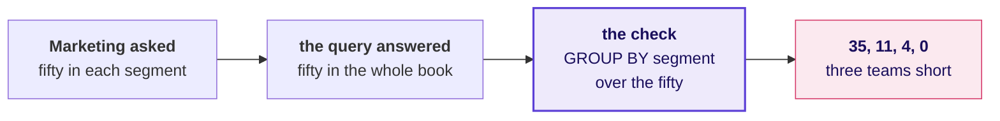

**What breaks.** Marketing would protect eleven Retail-Plus members and no Student at all, and would not know it until a segment head asked where the rest were.

```notes
LIVE, 4 minutes. The mistake in business terms: the list answers a question Marketing did not ask.
The check costs one GROUP BY over the list, and it takes ten seconds. Say the habit plainly: count
any list by the group it was asked for before anyone reads a name on it.
Transition: the fix is to restart the ranking inside every segment.
```

---

## S12. The fix: PARTITION BY restarts the count
*The position restarts at 1 in every segment, and ORDER BY inside the window decides who is first.*

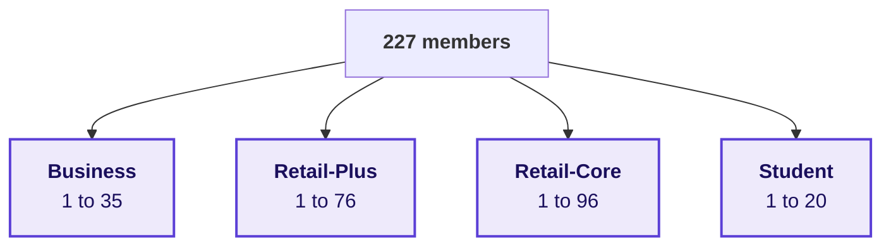

```sql
row_number() OVER (PARTITION BY segment ORDER BY q2_revenue DESC, customer_id)
    AS position
```

```notes
LIVE, 5 minutes. Run block 4 and read the position column restarting at 1 when the segment
changes. Say the second idea: PARTITION BY sets the group the calculation restarts in, and ORDER BY
inside the window sets the order within it. customer_id is the tiebreaker, so two runs give the
same numbers; Round 2 asks whether that is fair. Now ask a learner to keep position at most 50 by
adding it to WHERE, and let them run it.
```

---

## S13. Aside: a window refused inside WHERE
*WHERE runs before the window exists, so the position is computed in a CTE and filtered outside it.*

```text
ERROR:  window functions are not allowed in WHERE
```

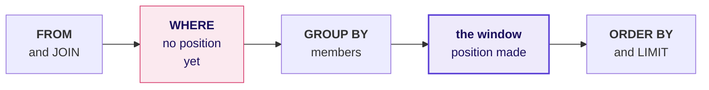

```notes
LIVE, 2 minutes, no more. This is a runtime error met when it happens, never a trap: read the last
line, name the reason, show the CTE on the next slide. Postgres prints two spaces after ERROR:,
so the room sees exactly this line. Interview anchor [F] lives here: why can a window not sit in
WHERE, and what do you do instead? One breath: WHERE runs before the window is computed, so
compute it in a CTE or subquery and filter outside.
```

---

## S14. The list: 35, 50, 50 and 20 members, 155 rows
*The position is computed in a CTE and filtered outside it, and every segment gets its own list.*

```sql
ranked AS (
    SELECT segment, customer_id, q2_revenue,
           row_number() OVER (PARTITION BY segment
                              ORDER BY q2_revenue DESC, customer_id) AS position
    FROM   q2
)
SELECT segment, count(*) AS members_on_the_list
FROM   ranked WHERE position <= 50 GROUP BY segment;
```

```stats
value: 35 | label: Business | note: every Q2 buyer
value: 50 | label: Retail-Plus | note: up from 11
value: 50 | label: Retail-Core | note: up from 4
value: 20 | label: Student | note: every Q2 buyer
```

```notes
LIVE, 4 minutes. Run block 5. Read the counts before anything else: 155 rows, and Retail-Plus goes
from 11 members to 50. Business and Student ship everyone who bought, and the list says so in its
header line. The WHERE now sits outside the CTE, where the position already exists.
Transition: the room's turn, one level harder.
```

---

## S15. Your turn: how much of each segment the list holds
*In pairs, fifteen minutes: the share of each segment's Q2 revenue on its list, and the line in Core.*

```cards
num: 1 | icon: percent | eyebrow: Part one | title: Share on the list | body: For each segment, the Q2 revenue on the list over the segment's whole Q2 revenue.
num: 2 | icon: ruler | eyebrow: Part two | title: The line in Retail-Core | body: The members at positions 50 and 51, with their Q2 revenue.
num: 3 | icon: message-square | eyebrow: Part three | title: One sentence | body: What the share tells Marketing about members left off the list. | tone: dark
```

A sum over the segment is a window too: `sum(q2_revenue) OVER (PARTITION BY segment)` puts the segment's total on every member's row.

```notes
LIVE, 10 minutes of work, the room running block 6 of the walk and part two on their own. Walk the
room and look for shares above 100 percent, which means the denominator was the list and not the
segment. Pairs who finish early write the sentence for Student and Business, where the share is
all of it. Transition: Kavya reads the list before it goes to Marketing.
```

---

## S16. Kavya's review of the list
*The list holds most of each segment's revenue, and the line in Retail-Core sits on Rs 30.*

| Segment | On the list | Share of Q2 revenue |
|---|---|---|
| Business | 35 of 35 | 100.0 percent |
| Retail-Plus | 50 of 76 | 85.5 percent |
| Retail-Core | 50 of 96 | 76.1 percent |
| Student | 20 of 20 | 100.0 percent |

**Kavya's review.** Count the list by segment before anyone reads a name, and say in the header when a segment's fifty is everyone who bought. In Retail-Core, C-0005 is fiftieth on Rs 2,980 and C-0092 is off the list on Rs 2,950, so the line is Rs 30 wide.

**In the interview.** [S] Top-3 per group: GROUP BY or a window, and why?

```notes
LIVE, 5 minutes. Read the table, then Kavya's review. The Rs 30 line in Retail-Core is the bridge to
Round 2: if two members can sit Rs 30 apart at the line, two can sit Rs 0 apart. One-breath answer
to the interview question: a window, because GROUP BY returns one row per group and cannot keep
three members of it; rank inside a partition in a CTE and filter the position outside.
Transition: Round 2, the fiftieth place.
```

---

## SECTION 3: Round 2, the fiftieth place
*The tie rule is a business choice written as a function name, and each rule ships a different count.*

```notes
LIVE. Round 2 runs 50 minutes, same shape as Round 1. The notebook is C2_W02_D03_02_ties_STUDENT.ipynb
and the SQL is sql/C2_W02_D03_02_protect_list_STUDENT.sql. The mechanism is shown on invented
members first; the room finds what happens on Kalpa's own line by running it.
```

---

## S17. Round 2: how many make the list on a tie
*The head of Retail-Plus asked for tied members to rank the same and for the count to be said.*

> "Ties matter. If two members spent the same, I want them ranked the same, and I want to know how many made the top fifty, not forty-nine because of a tie." The head of Retail-Plus, Kalpa Retail

```cards
icon: equal | eyebrow: The condition | title: Same spend, same place | body: Two members with the same Q2 revenue share a position.
icon: hash | eyebrow: The report | title: Say how many | body: The count that shipped, and why, in the same line.
icon: user-x | eyebrow: The failure | title: Forty-nine | body: A member dropped although he spent what the fiftieth did. | tone: dark
```

```notes
LIVE, 2 minutes. Read the condition again and split it into its two demands: rank the same, and
say the count. Ask: which Round 1 function breaks the first demand? ROW_NUMBER, because it gives
every row its own number. Transition: three functions on one picture.
```

---

## S18. Three functions, three answers to a tie
*ROW_NUMBER splits the tie, RANK shares the place and leaves a gap, DENSE_RANK shares it with no gap.*

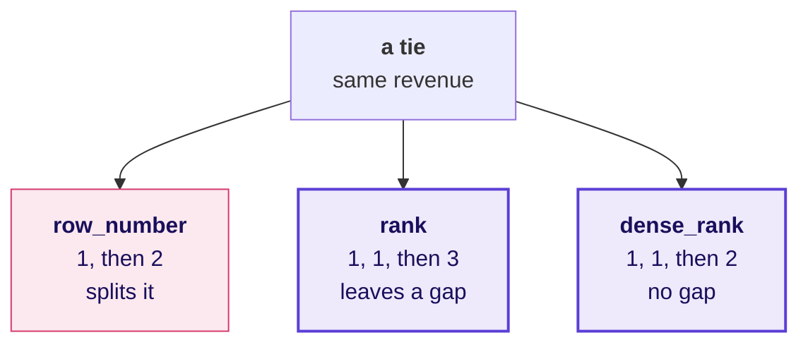

```notes
LIVE, 3 minutes. Say the fourth idea: the tie rule is a business choice expressed as a function
name. Draw the three branches on the board beside the day's picture. RANK returning 1, 1, 3 where
the room expected 1, 1, 2 is the surprise to name now. Transition: six invented members.
```

---

## S19. Six invented members, three columns
*Invented numbers, for the mechanism only: two ties, and the three functions side by side.*

| Member (invented) | Spend | ROW_NUMBER | RANK | DENSE_RANK |
|---|---|---|---|---|
| A | Rs 7,500 | 1 | 1 | 1 |
| B | Rs 7,500 | 2 | 1 | 1 |
| C | Rs 6,000 | 3 | 3 | 2 |
| D | Rs 5,200 | 4 | 4 | 3 |
| E | Rs 5,200 | 5 | 4 | 3 |
| F | Rs 4,100 | 6 | 6 | 4 |

```notes
LIVE, 5 minutes. Run block 1 of the protect-list file. These six members are invented and the slide
says so; they exist so the whole mechanism fits on one screen. Read row C across: ROW_NUMBER 3,
RANK 3, DENSE_RANK 2. RANK counts how many are ahead; DENSE_RANK counts how many distinct values
are ahead. Transition: move the tie to the line.
```

---

## S20. Move the tie to the line, and count what ships
*Invented again: a top four where the fourth and fifth members spent the same Rs 7,400.*

```sql
count(*) FILTER (WHERE rn <= 4)                 AS row_number_ships,
count(*) FILTER (WHERE rk <= 4)                 AS rank_ships,
count(*) FILTER (WHERE dr <= 4)                 AS dense_rank_ships,
count(*) FILTER (WHERE rk + tied_with - 1 <= 4) AS whole_ties_only_ships
```

```stats
value: 4 | label: ROW_NUMBER | note: D kept, E dropped
value: 5 | label: RANK | note: both tied members kept
value: 5 | label: DENSE_RANK | note: both kept here
value: 3 | label: whole ties only | note: both tied members dropped
```

```notes
LIVE, 5 minutes. Run block 2. The invented spends are 9,100, 8,800, 8,200, 7,400, 7,400 and 6,900.
Read each stat as a sentence to the head of Retail-Plus: ROW_NUMBER ships four and drops E, who
spent exactly what D did; whole ties only ships three, which is the forty-nine he forbade.
Transition: the same count on Kalpa's Retail-Core.
```

---

## S21. On Kalpa: Retail-Core under four rules
*Retail-Core has no tie at fiftieth, and one rule still ships two extra members.*

```stats
value: 50 | label: ROW_NUMBER | note: Retail-Core members shipped
value: 50 | label: RANK | note: Retail-Core members shipped
value: 52 | label: DENSE_RANK | note: Retail-Core members shipped
value: 50 | label: whole ties only | note: Retail-Core members shipped
```

| ROW_NUMBER | RANK | DENSE_RANK | customer_id | Q2 revenue |
|---|---|---|---|---|
| 50 | 50 | 48 | C-0005 | Rs 2,980 |
| 51 | 51 | 49 | C-0092 | Rs 2,950 |
| 52 | 52 | 50 | C-0094 | Rs 2,910 |

```notes
LIVE, 5 minutes. Run blocks 3 and 4 with segment = 'Retail-Core'. Read the counts, then the
boundary. DENSE_RANK reads 48 at row fifty because two ties higher up the Retail-Core list each
saved a number, so its fiftieth place is the fifty-second member. Do not explain further yet;
the next slide asks the room to choose a rule.
```

---

## S22. Question: which rule did the head ask for
*His sentence was "ranked the same". Two functions do that, and they ship different counts.*

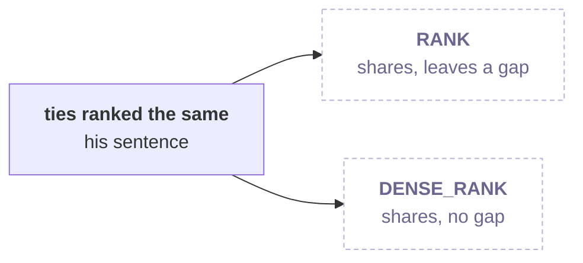

**Question.** Which function goes into the protect list? a) DENSE_RANK, since ties share a number and no position is skipped; b) RANK; c) ROW_NUMBER with customer_id as a tiebreaker, since it always ships exactly fifty; d) either of RANK and DENSE_RANK, since both rank ties the same.

```notes
LIVE, 3 minutes. Take letters. Expect a to win the room: "no gaps" sounds tidier, and DENSE_RANK
reads like the literal sentence. Expect d from careful readers of the sentence. Hold the answer.
```

---

## S23. Answer: RANK, because DENSE_RANK ships 52
*DENSE_RANK at most 50 puts 52 Retail-Core members on a list of fifty, with no tie at the line.*

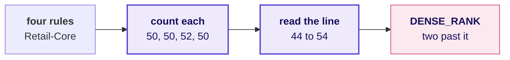

**What breaks.** DENSE_RANK sounds like "ties rank the same" and quietly ships C-0092 and C-0094, who spent less than the fiftieth. The check is to count what each rule ships and read positions 44 to 54 with all three functions side by side.

```notes
LIVE, 7 minutes. The answer is b. This is the plausible wrong answer: 52 rows under a heading that
says fifty, and nobody counted. RANK shares the place and leaves the gap, so RANK at most 50 means
everyone with fewer than fifty members ahead, which is a top fifty that keeps ties. Block 4 shows
every rule's decision at once in the rows around the line. ROW_NUMBER's fiftieth is chosen by the
database when two members tie, so a member can be on Monday's list and off Tuesday's with the same
spend; the tiebreaker makes it repeatable and still arbitrary. Transition: the fix, written down.
```

---

## S24. The fix: RANK, and a report that says the count
*Tied members share a position, everyone at or above fiftieth ships, and the header states how many.*

```sql
ranked AS (
    SELECT segment, customer_id, q2_revenue,
           rank() OVER (PARTITION BY segment
                        ORDER BY q2_revenue DESC) AS position
    FROM   q2
)
SELECT segment, count(*) AS members_on_the_list, max(position) AS last_position
FROM   ranked WHERE position <= 50 GROUP BY segment;
```

**The rule.** The report line carries the count and its reason, for example: "50 Retail-Core members; no tie at fiftieth."

```notes
LIVE, 4 minutes. Show block 5's query and do not run the Retail-Plus line on the projector; that is
the room's variant. RANK has no tiebreaker on purpose: a tie is the business fact the head asked to
see. Transition: the room runs it where the head of Retail-Plus is looking.
```

---

## S25. Your turn: run it for Retail-Plus
*In pairs, fifteen minutes: how many Retail-Plus members ship, under each rule, and the line in words.*

```stats
value: ? | label: ROW_NUMBER | note: Retail-Plus members shipped
value: ? | label: RANK | note: Retail-Plus members shipped
value: ? | label: DENSE_RANK | note: Retail-Plus members shipped
value: ? | label: whole ties only | note: Retail-Plus members shipped
```

Change the segment to 'Retail-Plus' in blocks 3 and 4, fill the four counts, read positions 44 to 54, and write the one line the head of Retail-Plus reads.

```notes
LIVE, 11 minutes of work. The room runs blocks 3 and 4 for Retail-Plus in the notebook's empty
your-turn cell. Do not say what they will find; the count and the line are theirs. Watch for pairs
who report one number without reading the boundary rows, and pairs who write a line with no reason
in it. Collect two report lines aloud for Kavya's review. Transition: Kavya's review.
```

---

## S26. Kavya's review of the tie rule
*The rule is chosen before the query runs, and the count is reported whatever it turns out to be.*

```cards
icon: list-ordered | eyebrow: Arbitrary | title: ROW_NUMBER | body: Exactly N, and the database decides who is last on a tie.
icon: medal | eyebrow: Keeps ties | title: RANK | body: Everyone at or above N ships, and a tie at the line adds rows. | tone: dark
icon: layers | eyebrow: Compresses | title: DENSE_RANK | body: Ties higher up save numbers, so it can ship past N with no tie at the line.
```

**Kavya's review.** Say the tie rule and the count in the same sentence, and a list that ships more or fewer than fifty is right as long as its line says why.

**In the interview.** [D] The business says 'ties rank the same'; which function, and how many rows might the top-N report ship?

```notes
LIVE, 5 minutes. Read two of the room's report lines against Kavya's review. One-breath answer to
the interview question: RANK, and the report ships N plus every member who shares the Nth place, so
the count is stated with its reason; DENSE_RANK can ship more than N with no tie at the line.
Then the break, 10 minutes. After it: whose spend is falling.
```

---

## SECTION 4: Round 3, falling spend and the plan
*LAG reads the previous row, and a running total reads everything so far; both need the right order.*

```notes
LIVE. The 10-minute break comes before this chapter. Round 3 runs 50 minutes. The notebook is
C2_W02_D03_03_falling_STUDENT.ipynb and the SQL is sql/C2_W02_D03_03_falling_spend_STUDENT.sql.
Two traps sit in this round, and level 4 is the running total that hands the afternoon its question.
```

---

## S27. Round 3: whose spend is falling, and the plan
*Marketing's flag compares each member with their own past, and Meera's line compares Q2 with plan.*

**The client asks.** "Flag anyone whose monthly spend has fallen for two months running. And Meera wants to see revenue accumulate week by week against the plan line, so we know by mid-quarter whether we are on track."

```cards
icon: trending-down | eyebrow: Rung 4 | title: The flag | body: Spend in September below August, and August below July, for the same member.
icon: target | eyebrow: Rung 5 | title: The plan line | body: Q2 booked to date against the plan to date, week by week. | tone: dark
```

```notes
LIVE, 2 minutes. Read the two asks and name them as rungs 4 and 5. Say what "fallen two months
running" means in this pack: less in August than July, and less again in September than August.
Transition: draw the flag before writing it.
```

---

## S28. A member's months, then the member's own past
*One row per member per month with an order, then LAG reads the row before it for the same member.*

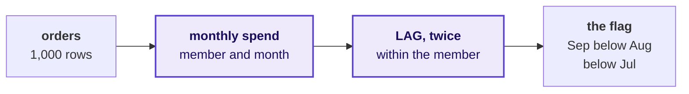

A month with no order has no row at all, so the row before September is whatever month the member last bought in.

```notes
LIVE, 3 minutes. Draw it. Say the fifth idea: LAG reads the previous row of the partition in its
order, so the partition must be the member and the previous row must be the previous calendar
month. Say the second clause now and do not dwell on it; the second trap proves it.
Transition: step one on Kalpa.
```

---

## S29. Step 1: a month per member, and the gaps in it
*C-0003 bought in April, June, July and August, so May has no row.*

```sql
SELECT customer_id, date_trunc('month', order_date)::date AS month,
       sum(amount) AS spend
FROM   orders
GROUP  BY customer_id, date_trunc('month', order_date)
ORDER  BY customer_id, month;
```

| customer_id | month | spend |
|---|---|---|
| C-0003 | April | Rs 3,850 |
| C-0003 | June | Rs 2,420 |
| C-0003 | July | Rs 2,630 |
| C-0003 | August | Rs 810 |

```notes
LIVE, 3 minutes. Run block 1. Point at the jump from April to June: the table carries no May row
for C-0003. Ask what the row before June is for this member. April. Hold that thought.
Transition: LAG on a member who genuinely fell.
```

---

## S30. Step 2: LAG on a member whose spend fell
*LAG reads the member's previous month and LEAD the next; C-0010 fell in August and again in September.*

```sql
lag(spend, 1) OVER (PARTITION BY customer_id ORDER BY month) AS spend_before,
lag(spend, 2) OVER (PARTITION BY customer_id ORDER BY month) AS spend_two_before
```

```stats
value: Rs 7,840 | label: July | note: C-0010, spend_two_before
value: Rs 4,080 | label: August | note: C-0010, spend_before
value: Rs 1,990 | label: September | note: C-0010, spend
```

```notes
LIVE, 3 minutes. The flag is two LAGs and a comparison: spend below spend_before, and spend_before
below spend_two_before, on the September row. C-0010 is on the protect list at position 1 in
Retail-Core, which is why this flag matters to Marketing. LEAD reads the next row the same way;
name it and move on. Transition: the hurried version of the flag.
```

---

## S31. Question: how many does the hurried flag catch
*The same two LAGs with the PARTITION BY left out, over all members' months sorted by member.*

```sql
lag(spend, 1)       OVER (ORDER BY customer_id, month) AS spend_before,
lag(spend, 2)       OVER (ORDER BY customer_id, month) AS spend_two_before,
lag(customer_id, 2) OVER (ORDER BY customer_id, month) AS whose_row_two_before
```

**Question.** Run with no PARTITION BY, the flag ending in September catches 20 members. How many of those compared a month with another member's month? a) none, because the rows are sorted by member; b) 4; c) all 20; d) it cannot be counted.

```notes
LIVE, 2 minutes. Take letters. Expect a: sorting by member feels like partitioning by member.
Then run block 2 of the falling-spend file.
```

---

## S32. Answer: 4 of the 20 read another member's month
*Without PARTITION BY, a member's first months are compared with whoever sorts before them.*

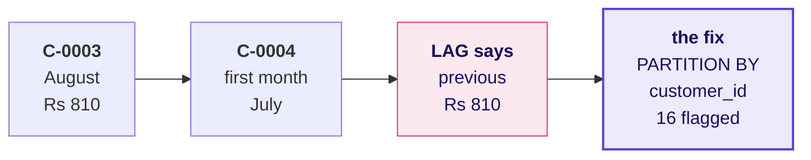

**What breaks.** Four members are accused of a fall that happened in someone else's account. The check: any member's first month with a previous value, or a count of rows where whose_row_two_before is another customer.

```notes
LIVE, 3 minutes. The answer is b. Trace C-0004 on the board: its first row reads C-0003's August.
Add PARTITION BY customer_id and rerun block 3: 16 flagged. Interview [F] follow-up for the notes:
LAG returned a value on a first month, so the partition is missing; check with a count of first
months carrying a previous value, which must be zero. Transition: 16 is still too many.
```

---

## S33. Sixteen flagged, and one was on holiday
*C-0216 bought in May, July and September, and LAG called July "last month" for September.*

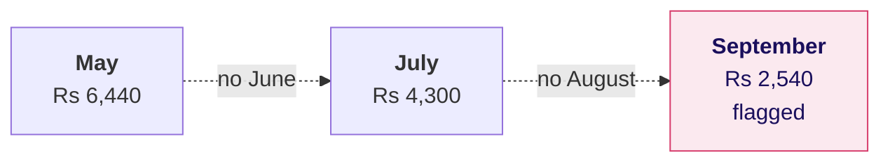

**What breaks.** Seven of the sixteen compared across a skipped month, so a gap became a fall. The check: carry lag(month) beside lag(spend) and count the rows where the previous row is not the previous calendar month.

```notes
LIVE, 4 minutes. Run block 4 and read C-0216's three rows. This is the member who says he was on
holiday, and he is right. This is the round's second plausible wrong answer: 16 flagged, seven of
them across a gap. The check line is block 3's second count, which reads 7.
Transition: the flag that holds.
```

---

## S34. The fix: two readings a calendar month apart
*Require the previous two rows to be August and July, and a month with no order breaks the run.*

```sql
WHERE month            = DATE '2026-09-01'
  AND month_before     = month - INTERVAL '1 month'
  AND month_two_before = month - INTERVAL '2 months'
  AND spend < spend_before AND spend_before < spend_two_before
```

```stats
value: 20 | label: no PARTITION BY | note: 4 read another member
value: 16 | label: partitioned | note: 7 read across a gap
value: 9 | label: consecutive months | note: the flag that holds
```

```notes
LIVE, 4 minutes. Run block 5's count: 9. A month with no order is no reading, so it breaks the run.
Depth note for the curious: filling the gap with zero would turn every holiday month into a fall
to zero, which accuses every member who skipped a month. The fix is the calendar condition.
Transition: the room lists them.
```

---

## D35. Why a missing month is never filled with zero
*Invented numbers, for the mechanism only: a member with no September order yet.*

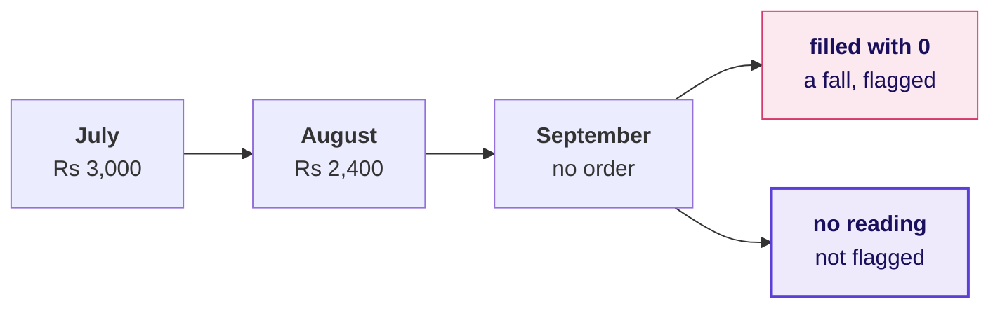

**What breaks.** Filling the gap with zero reads "bought nothing" as "spent Rs 0", so every member on holiday in the latest month shows a fall to zero and lands on the flag.

```notes
SELF-STUDY, 3 minutes of reading, depth for the confident half; show it live only if the room asks why the gap is not
zero-filled. The member is invented. Interview [D]: a member says he was on holiday in August and
should not be flagged; the definition treats a month with no order as no reading, so it breaks the
run, and zero-filling would accuse every member who skipped a month.
```

---

## S36. Your turn: list the flagged members
*In pairs, nine minutes: the members behind the count, their segment and their place on the list.*

```cards
num: 1 | icon: list | eyebrow: Part one | title: The members | body: Turn block 5's count into a list of customer_id with the three months' spend.
num: 2 | icon: users | eyebrow: Part two | title: Their segment | body: Join customers and group the list by segment.
num: 3 | icon: shield | eyebrow: Part three | title: On the protect list | body: Which of them hold a RANK position of fifty or better in their segment. | tone: dark
```

```notes
LIVE, 9 minutes of work in the notebook's empty your-turn cell. Do not read the list out; the room
finds it. Watch for pairs who join customers before the LAG and partition by segment instead of
member. Pairs who finish early start part three, which is Part 2 of the afternoon case.
Transition: level 4, the running total.
```

---

## S37. Level 4: a running total needs a full order
*On 22 July, ORDER BY order_date alone gives all twelve orders the day's closing figure.*

| order_id | amount | by date only | by date, then order_id |
|---|---|---|---|
| KR-00557 | Rs 930 | Rs 3,76,90,290 | Rs 3,45,16,000 |
| KR-00580 | Rs 8,55,000 | Rs 3,76,90,290 | Rs 3,53,71,000 |
| KR-00601 | Rs 10,40,000 | Rs 3,76,90,290 | Rs 3,64,11,000 |
| ... | eight more orders | Rs 3,76,90,290 each | one step each |
| KR-00979 | Rs 970 | Rs 3,76,90,290 | Rs 3,76,90,290 |

```sql
sum(amount) OVER (ORDER BY order_date)           AS by_date_only,
sum(amount) OVER (ORDER BY order_date, order_id) AS by_date_then_order
```

```notes
LIVE, 5 minutes. Run block 6 and read the first and last rows of 22 July, the busiest day, with
twelve orders. Rows of the same date are peers, so Postgres gives every one the day's closing
total. Adding order_id makes each row its own step. If anyone writes the running total with a ROWS
frame, tied rows are added in an order the database picks and a row's figure can change between
runs; the same tiebreaker fixes it. Say the sixth
idea: a running total needs an unambiguous order and a starting point that covers the whole period.
Transition: the plan line.
```

---

## S38. Read the plan to date, never one week of it
*At the end of the seventh plan week, a running actual beside one week's plan reads as nine times plan.*

| At the end of week seven | Booked to date | Set beside | What it reads as |
|---|---|---|---|
| One week of plan | Rs 6,87,36,590 | Rs 75,69,230 | Nine times plan, which misleads Meera |
| Plan to date | Rs 6,87,36,590 | Rs 5,29,84,610 | Ahead of plan by Rs 1,57,51,980 |

**The rule.** Both sides accumulate. A quarter-to-date actual is compared with a quarter-to-date plan, read at the last day of each plan week.

```notes
LIVE, 5 minutes. Show block 7's shape: the plan accumulates with sum() OVER (ORDER BY week_start),
and the actual is read at week_start + 6. Mid-quarter is the end of the seventh plan week, the
week of 17 August. Interview [F] for the notes: a dashboard saying nine times plan by week seven
has set a running actual beside one week's plan. Transition: the question the afternoon answers.
```

---

## S39. The question the afternoon answers
*Monday's suite says Q2 booked Rs 9,84,00,000. Does the running total close on it?*

```stats
value: Rs 9,84,00,000 | label: Q2 booked | note: Monday's suite
value: 13 | label: plan weeks | note: 6 July to 28 September
value: Rs 9,83,99,990 | label: plan in all | note: the plan line's total
value: ? | label: booked at the close | note: the afternoon's check
```

**The rule.** A running total is only as true as its order and its start, and its last value has to equal the quarter's total before anyone reads the chart.

```notes
LIVE, 2 minutes. Leave the fourth number open. The escalated case asks the room to build the
running total against plan for all thirteen weeks and to check its close against Monday's total.
Say only that the plan line starts on Monday 6 July and Q2 orders start on 1 July.
Transition: Kavya's review of the round.
```

---

## S40. Kavya's review of the flag and the total
*A flag and a total are both claims about order, and each carries the check that proves its order.*

```cards
icon: user-check | eyebrow: The flag | title: Same member, last month | body: PARTITION BY the member, and require the previous rows to be August and July.
icon: calendar-x | eyebrow: The holiday | title: No order, no reading | body: A month with no order breaks the run and is never read as a fall.
icon: sigma | eyebrow: The total | title: A full order and a full start | body: Tiebreak the order, and check the close equals the quarter's total. | tone: dark
```

**Kavya's review.** Before the flag goes to Marketing, show the member who was on holiday and say why he is off it. Before the total goes to Meera, show that its last value is Monday's Rs 9,84,00,000.

**In the interview.** [F] How would you find customers whose spend fell two months in a row?

```notes
LIVE, 5 minutes. Read Kavya's review. One-breath answer to the interview question: monthly spend
per customer, LAG by one and two months partitioned by customer and ordered by month, require the
two previous rows to be the two previous calendar months, and keep rows where each month is below
the one before. Transition: after the break, the escalated case, which puts all three rounds in one file.
```
