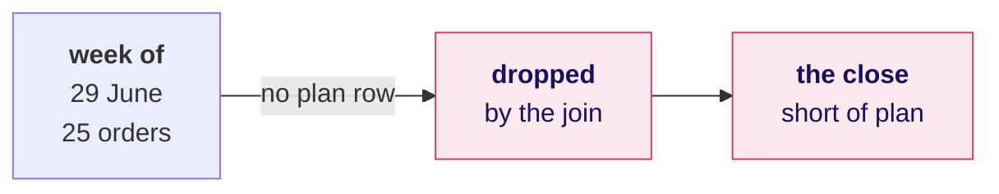
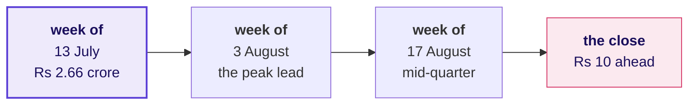
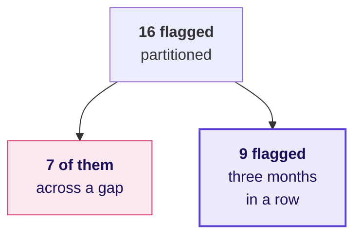
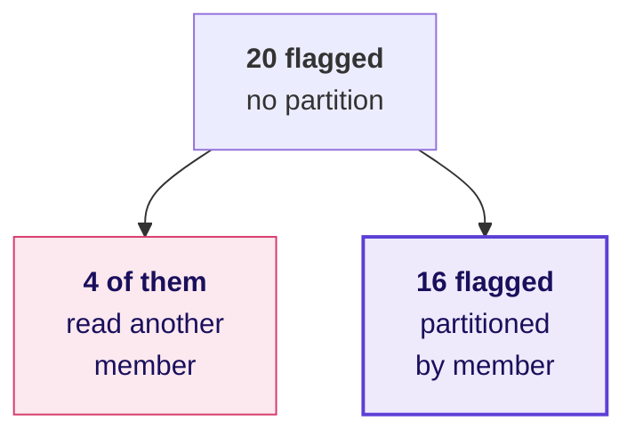

# Marketing's Monday file, and the sentence on it

Week 2, Day 3. Half two.

Kicker: WEEK 2  ·  WEDNESDAY  ·  HALF TWO
Quote: We act on this list on Monday. Tell us the tie rule and the number of members it ships.
Who: Marketing, Kalpa Retail, to the data and AI team at Kalpa's Global Capability Centre

```notes
LIVE, one minute. Read Marketing's line aloud and leave it on screen. The morning ran the three
rounds one at a time; the afternoon puts them into one file Marketing acts on. The trainer's part
of the afternoon is 60 minutes: the case with its debrief folded in (45), then the Kahoot and
Thursday's ask (15).
```

---

## SECTION 1: The escalated case
*One file with five named steps: the list, the flag, the plan, the check and the sentence.*

```notes
LIVE. The case runs 45 minutes, unguided, with the debrief folded into its last ten. The brief is
exercises/unguided/C2_W02_D03_marketing_case_STUDENT.md and the file the room fills is
sql/C2_W02_D03_04_marketing_case_STUDENT.sql, which runs as it ships because every placeholder is
a comment.
```

---

## S1. Marketing's Monday file
*Everything the morning built, in one file, read by the people who act on it.*

**The client asks.** "We act on this list on Monday. One file: the top fifty members by Q2 revenue in every segment, ranked the way the head of Retail-Plus asked, a column that says whether each one's spend fell in August and again in September, and the running total against the plan so Meera can see where the quarter stood at mid-quarter and where it closed. Tell us the tie rule and the number of members it ships."

```stats
value: 4 | label: segments | note: each ranked on its own
value: 3 | label: months | note: July, August, September
value: 13 | label: plan weeks | note: 6 July to 28 September
```

```notes
LIVE, 1 minute. Read the message aloud. Point out that it asks for two things the morning never
produced on one screen: the flag joined to the list, and the check on the running total. The
learner's role is unchanged: state the tie rule and why, and defend the flag against the member
who was on holiday. Transition: the five parts.
```

---

## S2. Five parts, each a named step
*Each part is a CTE with one comment line above it: the question it answers and its denominator.*

```cards
num: 1 | icon: list-ordered | eyebrow: Part 1 | title: The protect list | body: The top fifty by Q2 booked revenue in each segment, ties ranked the same.
num: 2 | icon: trending-down | eyebrow: Part 2 | title: The flag | body: Listed members who spent less in August than July, and less again in September.
num: 3 | icon: target | eyebrow: Part 3 | title: Against plan | body: Booked to date against plan to date, at the end of each plan week.
num: 4 | icon: scale | eyebrow: Part 4 | title: The check | body: The last booked-to-date against Monday's Q2 total of Rs 9,84,00,000.
num: 5 | icon: message-square | eyebrow: Part 5 | title: The sentence | body: Three sentences for Marketing and Meera: the rule, the flag, the plan. | tone: dark
```

```notes
LIVE, 1 minute. Read the five parts once. The comment line above each step is the line Anand's
analyst reads first, so it is part of the answer. Part 4 is the one hurried rooms skip.
Transition: what done looks like.
```

---

## S3. What done looks like
*Each part is done when its result carries the check that proves it.*

| Part | What it returns | The check it carries |
|---|---|---|
| 1 | Members per segment and the last position | The count per segment, stated with its reason |
| 2 | The flagged members with segment and position | A member with a skipped month is off the flag |
| 3 | Thirteen rows of plan to date and booked to date | Both columns accumulate |
| 4 | The close against Monday's total | The two numbers are equal to the rupee |
| 5 | Three sentences in a comment | Each carries a number and what it means |

```notes
LIVE, 1 minute. Leave this on screen while the room starts. The right-hand column is what Kavya
reads first. Transition: the clock.
```

---

## S4. Forty-five minutes, parts first
*A four-minute brief, thirty-one minutes on the five parts, then ten minutes of debrief on what the room found.*

```bar
label: Brief | value: 4 | caption: 4
label: Parts 1 and 2 | value: 13 | caption: 13 minutes
label: Part 3 | value: 9 | caption: 9 minutes
label: Parts 4 and 5 | value: 9 | caption: 9 minutes
label: Debrief | value: 10 | caption: 10 minutes
```

Work alone. The morning's three SQL files and notebooks are open to you, and the solution is released at the close.

```notes
LIVE, 31 minutes of unguided work, then the debrief on the next slides. Walk the room from the
fifteenth minute and watch for four things, which are the debrief's four slides: a plan-first
join, a count of 49, 50 or 52 in Retail-Plus, a flag that includes a member with no August order,
and LAG with no PARTITION BY. Note which pairs hit which, without naming them in the debrief.
```

---

## SECTION 2: The debrief
*Four wrong answers the room is likely to ship, each with the number it produces and the check.*

```notes
LIVE. The debrief runs about 10 minutes inside the case's 45. Take each wrong answer as a number
first, then the check. Nobody is named; the numbers are what the room saw.
```

---

## S5. Question: the plan-first running total
*Start from plan_line, LEFT JOIN weekly revenue on date_trunc('week'), and accumulate both sides.*

```sql
hurried AS (
    SELECT p.week_start,
           sum(w.booked)       OVER (ORDER BY p.week_start) AS booked_to_date,
           sum(p.plan_revenue) OVER (ORDER BY p.week_start) AS plan_to_date
    FROM   plan_line p
    LEFT JOIN weekly w ON w.week_start = p.week_start
)
```

**Question.** Thirteen rows, thirteen numbers. Where does booked to date close? a) Rs 9,84,00,000, Monday's total; b) Rs 9,68,60,180; c) Rs 9,83,99,990, the plan; d) it cannot close, a LEFT JOIN drops no rows.

```notes
LIVE, 1 minute. Take letters. Expect a and d: the join keeps all thirteen plan weeks, so it feels
complete. The query is the hurried Part 3 several pairs wrote.
```

---

## S6. Answer: Rs 15,39,820 fell out before week one
*Q2 orders start on 1 July and the plan starts on 6 July, so the week of 29 June has no plan row.*



**What breaks.** Meera would be told Q2 missed plan by Rs 15,39,810 when it landed on it. The check is Part 4: the last booked-to-date must equal Monday's Rs 9,84,00,000, and this one is Rs 15,39,820 short.

```notes
LIVE, 2 minutes. The answer is b. The fix: accumulate the actual by day from the first Q2 order
and read it at each plan week's last day, week_start + 6. Then Q2 closes at Rs 9,84,00,000 against
Rs 9,83,99,990, Rs 10 ahead. The Rs 15,39,810 and Rs 15,39,820 differ by the plan's own Rs 10
rounding; say so if anyone asks. Transition: what Meera reads once the total is right.
```

---

## S7. On plan by the total, below plan by the run rate
*The quarter closed Rs 10 ahead, and its lead came from one week in July.*



```stats
value: Rs 2,16,69,660 | label: peak lead | note: end of the week of 3 August
value: Rs 1,57,51,980 | label: mid-quarter lead | note: end of the seventh plan week
value: 6 of 7 | label: weeks below plan | note: from 10 August, against Rs 75,69,230 a week
```

```notes
LIVE, 1 minute. This is the reading for Meera, and it is two sentences: on track by the total,
off track by the run rate. Mid-quarter is the end of the seventh plan week, the week of 17 August,
where Q2 had booked Rs 6,87,36,590 against a plan to date of Rs 5,29,84,610.
Transition: the protect list's count.
```

---

## S8. Question: how many Retail-Plus members ship
*Four counts came back from the room for the same segment and the same fifty.*

```stats
value: 49 | label: count one | note: from one pair's file
value: 50 | label: count two | note: from another
value: 51 | label: count three | note: from another
value: 52 | label: count four | note: from another
```

**Question.** Which count answers the head of Retail-Plus, and which rule produced each of the others?

```notes
LIVE, 1 minute. Take one answer per count. Push each pair for the rule behind its number before
revealing anything.
```

---

## S9. Answer: 51, with RANK, and the line says why
*Two Retail-Plus members tie at fiftieth, so RANK keeps both and ships fifty-one.*

| Rule | Retail-Plus ships | What it did at the line |
|---|---|---|
| RANK at most 50 | 51 | Both tied members kept, which is what the head asked |
| Whole ties only | 49 | Both tied members dropped, the forty-nine he forbade |
| ROW_NUMBER at most 50 | 50 | One tied member dropped by the database's choice |
| DENSE_RANK at most 50 | 52 | A tie higher up saved a number, so a member past the line ships |

**Kavya's review.** Fifty-one is correct, and it is only defensible with its reason beside it: "51 Retail-Plus members, because two tie at fiftieth."

```notes
LIVE, 2 minutes. RANK is the rule the head of Retail-Plus asked for. ROW_NUMBER's fifty looks
right and is the dangerous one: which of the tied pair ships depends on the tiebreaker, so a member
can be on Monday's list and off Tuesday's with the same spend. Interview [F] follow-up: your top
fifty came back with 51 rows; it is no bug, and the stakeholder is told the tie and the count.
```

---

## S10. The holiday member, flagged by LAG
*Sixteen flagged is seven too many, because a skipped month was read as last month.*



**The rule.** A month with no order is no reading, so it breaks the run. Nine listed members spent less in August than July and less again in September, three each in Business, Retail-Core and Retail-Plus.

```notes
LIVE, 1 minute. C-0216 is the example: May, July and September, and LAG called July last month.
Interview [D] for the notes: why not fill August with zero? Because every holiday month would then
read as a fall to zero, accusing every member who skipped a month. Transition: the other LAG slip.
```

---

## S11. LAG across members: 20 flagged
*Without PARTITION BY, a member's first month reads the last month of the member sorted before.*



**The rule.** Count the first months that carry a previous value. The count must be zero, and any other number means the partition is missing.

```notes
LIVE, 1 minute. Quick, since the morning covered it. The check works on ten thousand rows as well
as on ten: count rows where the lagged customer_id differs from the row's own.
Transition: the sentence that goes to Marketing and Meera.
```

---

## S12. The sentence to Marketing and Meera
*Three sentences, each carrying its number and what it means for the decision.*

> "We ranked with RANK inside each segment, so tied members share a place and nobody at the line is dropped by a coin toss: the list carries 35 Business and 20 Student members, which is every Q2 buyer there, 50 Retail-Core and 51 Retail-Plus, because two Retail-Plus members tie at fiftieth. Nine listed members spent less in August than July and less again in September; a member with no August order is not flagged, because a month without an order is no reading. Q2 closed on plan, Rs 9,84,00,000 against Rs 9,83,99,990, and the Rs 1.58 crore lead at mid-quarter came from one week in July, so the weekly run rate has been below plan since 10 August."

```notes
LIVE, 1 minute. Read it aloud once, slowly, and ask each learner to compare it with their own Part 5:
which of the three numbers did theirs carry, and which meaning did it leave out? The solution file
is released now. Transition: the four lines the day comes down to.
```

---

## SECTION 3: The close
*Four lines to keep, eight Kahoot questions, and Thursday's question left open.*

```notes
LIVE. The close runs 15 minutes: the crux lines (3), the Kahoot (8), Thursday's ask (3) and the
hand-over to the IITGN session, which is tentative (1).
```

---

## S13. Four lines the day comes down to
*The cheat sheet and the study notes carry these four lines word for word.*

```cards
num: 1 | icon: layers | eyebrow: Window | title: Every row stays | body: GROUP BY answers how much per group; a window keeps every row and says where each row stands.
num: 2 | icon: medal | eyebrow: Ties | title: A business decision | body: The tie rule is a business decision written as a function name: RANK keeps everyone at the line, and the report says how many.
num: 3 | icon: history | eyebrow: LAG | title: Last month, same member | body: LAG reads the previous row, so partition by the member and check the previous row is last month.
num: 4 | icon: sigma | eyebrow: Running total | title: Order and start | body: A running total is only as true as its order and its start; check it closes on the quarter's total. | tone: dark
```

```notes
LIVE, 3 minutes. Read the four lines aloud. Ask two learners to say one each without the slide.
These are the lines Saturday's paper leans on.
```

---

## S14. The Kahoot: eight questions on the day
*Eight questions, played for practice, with Tuesday's join question returning one level up.*

```stats
value: 2 | label: on ties | note: the three rules, and the business choice
value: 2 | label: on windows | note: PARTITION BY, and ROW_NUMBER's cut at a tie
value: 2 | label: on LAG | note: the first month, and the missing month
value: 2 | label: running total and Tuesday | note: a full order, a join that grew
```

```notes
LIVE, 8 minutes. Run the eight items from the kahoot file. After each item, one sentence on why
the popular wrong option was wrong. The Tuesday item: a LEFT join grew rows because the right side
had more than one match per key; the check is the row count before and after.
Transition: Thursday's ask.
```

---

## S15. Thursday: one table per customer, every Monday
*The question left open: when SQL, plain Python and pandas can each answer it, which tool do you pick, and why?*

**The client asks.** "The warehouse queries are fine for Finance, but Marketing's analysts live in Python. Build them the table in pandas, from the warehouse, and make it refreshable in one run."

```cards
icon: user | eyebrow: One row each | title: Per customer | body: How recently, how often and how much, with the segment.
icon: megaphone | eyebrow: From campaigns | title: The monsoon sale | body: Whether the campaign reached the customer.
icon: flag | eyebrow: From today | title: Last week's flags | body: The falling-spend flag, carried into the table. | tone: dark
```

```notes
LIVE, 3 minutes. The speaker is Kalpa's platform lead. Leave the question open; do not answer it.
Thursday's pre-read is preread/C2_W02_D03_preread_STUDENT.md. Point out that today's ranks and LAG
return tomorrow as groupby transforms, and that today's flag becomes one of the table's columns.
```

---

## S16. Next: the IITGN session W2-3, tentative
*The afternoon continues with the tentative IITGN faculty session on errors, power and sample size.*

```stats
value: W2-3 | label: IITGN session | note: tentative
value: 120 | label: minutes | note: tentative
```

The IITGN faculty session W2-3 (tentative) runs for 120 minutes on Type I and Type II errors, power and the sample size a comparison needs. The tentative session picks up the rule of thumb of thirty observations from Week 1 Thursday.

```notes
LIVE, 1 minute. The trainer's row stops here, where the tentative IITGN block starts. Everything about the
block is tentative, so say only what the slide says: the tentative session W2-3, 120 minutes, on
errors, power and sample size. The TA-led practice lab runs after it from the practice set.
```
